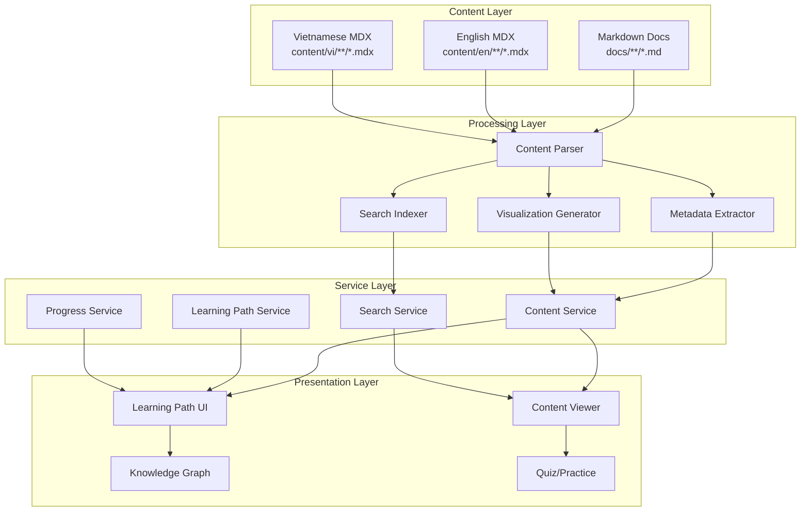
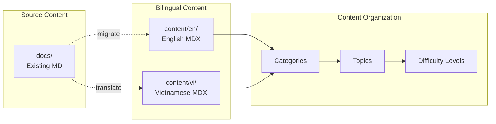
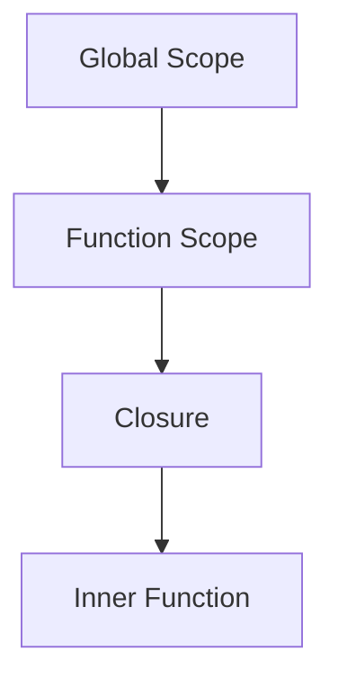
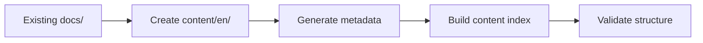
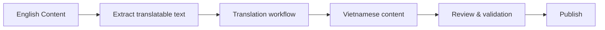
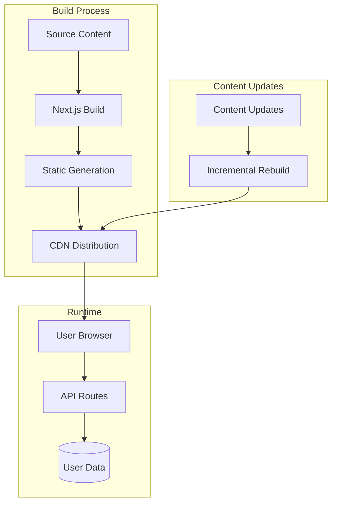

# Design Document: Bilingual Content Expansion

## Overview

This design outlines the architecture for transforming the existing frontend interview preparation platform into a comprehensive bilingual (Vietnamese/English) learning system with enhanced visualizations, structured learning paths, and university-level depth. The system will leverage the existing `docs/` content structure while creating a parallel bilingual content system in `content/en/` and `content/vi/` directories with MDX support for interactive components.

### Design Goals

1. **Bilingual Content Delivery**: Seamless language switching between Vietnamese and English
2. **Visual Learning**: Rich diagrams, knowledge graphs, and interactive visualizations
3. **Structured Progression**: Clear learning paths from fundamentals to expert level
4. **Interview Focus**: Content aligned with FAANG and top tech company expectations
5. **Scalability**: Architecture supporting continuous content expansion
6. **Performance**: Fast content loading and search capabilities

## Architecture

### High-Level System Architecture



### Content Structure Architecture



## Components and Interfaces

### 1. Content Management System

#### Content File Structure

```
content/
├── en/                          # English content
│   ├── javascript/
│   │   ├── fundamentals/
│   │   │   ├── 01-variables.mdx
│   │   │   ├── 02-scope.mdx
│   │   │   └── metadata.json
│   │   ├── advanced/
│   │   └── expert/
│   ├── react/
│   ├── typescript/
│   ├── computer-science/
│   └── system-design/
├── vi/                          # Vietnamese content (mirrors en/)
│   ├── javascript/
│   ├── react/
│   └── ...
└── shared/                      # Language-agnostic assets
    ├── diagrams/
    ├── code-examples/
    └── visualizations/
```

#### Content Metadata Schema

```typescript
interface ContentMetadata {
  id: string;
  slug: string;
  title: {
    en: string;
    vi: string;
  };
  description: {
    en: string;
    vi: string;
  };
  category: ContentCategory;
  difficulty: 'beginner' | 'intermediate' | 'advanced' | 'expert';
  estimatedTime: number; // minutes
  prerequisites: string[]; // Array of content IDs
  relatedTopics: string[];
  tags: string[];
  interviewCompanies: ('google' | 'meta' | 'amazon' | 'microsoft' | 'grab')[];
  lastUpdated: string;
  version: string;
  hasQuiz: boolean;
  hasCodeExamples: boolean;
  hasDiagrams: boolean;
}

type ContentCategory = 
  | 'javascript'
  | 'typescript'
  | 'react'
  | 'nextjs'
  | 'css'
  | 'html'
  | 'web-apis'
  | 'computer-science'
  | 'algorithms'
  | 'system-design'
  | 'security'
  | 'performance'
  | 'testing'
  | 'tools';
```

#### MDX Content Template

```mdx
---
id: js-closures-fundamentals
title:
  en: "Understanding Closures in JavaScript"
  vi: "Hiểu về Closures trong JavaScript"
category: javascript
difficulty: intermediate
estimatedTime: 45
prerequisites: ["js-scope-fundamentals", "js-functions-basics"]
relatedTopics: ["js-hoisting", "js-execution-context"]
tags: ["closures", "scope", "functions"]
interviewCompanies: ["google", "meta", "amazon"]
---

import { CodeExample } from '@/components/mdx/CodeExample';
import { Diagram } from '@/components/mdx/Diagram';
import { Quiz } from '@/components/mdx/Quiz';
import { Glossary } from '@/components/mdx/Glossary';

# {frontmatter.title[locale]}

<Glossary terms={['closure', 'lexical-scope', 'execution-context']} />

## Introduction

[Content in current locale]

<Diagram type="mermaid">

</Diagram>

<CodeExample 
  title="Basic Closure Example"
  language="javascript"
  runnable={true}
>
```javascript
function createCounter() {
  let count = 0;
  return function() {
    return ++count;
  };
}
```
</CodeExample>

<Quiz id="closures-basic" />
```

### 2. Content Service Layer

#### Content Service Interface

```typescript
interface IContentService {
  // Content retrieval
  getContent(slug: string, locale: Locale): Promise<Content>;
  getContentByCategory(category: ContentCategory, locale: Locale): Promise<Content[]>;
  getContentByDifficulty(difficulty: Difficulty, locale: Locale): Promise<Content[]>;
  
  // Search and discovery
  searchContent(query: string, locale: Locale, filters?: SearchFilters): Promise<SearchResult[]>;
  getRelatedContent(contentId: string, locale: Locale): Promise<Content[]>;
  
  // Metadata operations
  getContentMetadata(slug: string): Promise<ContentMetadata>;
  getAllMetadata(locale: Locale): Promise<ContentMetadata[]>;
  
  // Navigation
  getNextContent(currentId: string, learningPathId?: string): Promise<Content | null>;
  getPreviousContent(currentId: string, learningPathId?: string): Promise<Content | null>;
}

interface Content {
  metadata: ContentMetadata;
  content: string; // MDX content
  tableOfContents: TOCItem[];
  glossary: GlossaryTerm[];
}

interface SearchFilters {
  categories?: ContentCategory[];
  difficulty?: Difficulty[];
  tags?: string[];
  companies?: string[];
  hasQuiz?: boolean;
  hasDiagrams?: boolean;
}
```

### 3. Learning Path System

#### Learning Path Structure

```typescript
interface LearningPath {
  id: string;
  title: {
    en: string;
    vi: string;
  };
  description: {
    en: string;
    vi: string;
  };
  targetRole: 'frontend' | 'fullstack' | 'senior' | 'staff';
  estimatedDuration: number; // weeks
  modules: LearningModule[];
  prerequisites: string[];
}

interface LearningModule {
  id: string;
  title: {
    en: string;
    vi: string;
  };
  order: number;
  topics: LearningTopic[];
  estimatedTime: number; // hours
}

interface LearningTopic {
  contentId: string;
  order: number;
  required: boolean;
  practiceExercises?: string[];
  quiz?: string;
}
```

#### Learning Path Service

```typescript
interface ILearningPathService {
  // Path management
  getLearningPath(pathId: string, locale: Locale): Promise<LearningPath>;
  getAllPaths(locale: Locale): Promise<LearningPath[]>;
  getRecommendedPath(userLevel: string): Promise<LearningPath>;
  
  // Progress tracking
  getUserProgress(userId: string, pathId: string): Promise<PathProgress>;
  updateProgress(userId: string, contentId: string, completed: boolean): Promise<void>;
  
  // Navigation
  getNextTopic(userId: string, pathId: string): Promise<LearningTopic | null>;
  getPathCompletion(userId: string, pathId: string): Promise<number>; // percentage
}

interface PathProgress {
  pathId: string;
  completedTopics: string[];
  currentTopic: string;
  startedAt: Date;
  lastAccessedAt: Date;
  completionPercentage: number;
}
```

### 4. Visualization System

#### Knowledge Graph Component

```typescript
interface KnowledgeGraphProps {
  centerNodeId: string;
  depth: number; // How many levels of relationships to show
  locale: Locale;
  highlightPath?: string[]; // Highlight specific learning path
}

interface GraphNode {
  id: string;
  label: string;
  category: ContentCategory;
  difficulty: Difficulty;
  completed?: boolean;
}

interface GraphEdge {
  from: string;
  to: string;
  type: 'prerequisite' | 'related' | 'next-in-path';
}
```

#### Diagram Component

```typescript
interface DiagramProps {
  type: 'mermaid' | 'flowchart' | 'sequence' | 'architecture';
  content: string;
  title?: string;
  caption?: string;
  interactive?: boolean;
}
```

### 5. Search System

#### Search Service Interface

```typescript
interface ISearchService {
  // Full-text search
  search(query: string, locale: Locale, options?: SearchOptions): Promise<SearchResult[]>;
  
  // Faceted search
  searchWithFacets(query: string, locale: Locale, facets: SearchFacets): Promise<FacetedSearchResult>;
  
  // Autocomplete
  getSuggestions(partial: string, locale: Locale): Promise<string[]>;
  
  // Index management
  rebuildIndex(locale: Locale): Promise<void>;
}

interface SearchOptions {
  filters?: SearchFilters;
  limit?: number;
  offset?: number;
  sortBy?: 'relevance' | 'difficulty' | 'date';
}

interface SearchResult {
  contentId: string;
  title: string;
  excerpt: string;
  category: ContentCategory;
  difficulty: Difficulty;
  relevanceScore: number;
  highlights: string[]; // Matched text snippets
}

interface FacetedSearchResult {
  results: SearchResult[];
  facets: {
    categories: { [key: string]: number };
    difficulties: { [key: string]: number };
    tags: { [key: string]: number };
    companies: { [key: string]: number };
  };
}
```

### 6. Interactive Components

#### Code Example Component

```typescript
interface CodeExampleProps {
  code: string;
  language: string;
  title?: string;
  runnable?: boolean;
  editable?: boolean;
  highlightLines?: number[];
  showLineNumbers?: boolean;
}
```

#### Quiz Component

```typescript
interface QuizProps {
  id: string;
  locale: Locale;
}

interface QuizData {
  id: string;
  questions: QuizQuestion[];
  passingScore: number;
}

interface QuizQuestion {
  id: string;
  type: 'multiple-choice' | 'code' | 'true-false';
  question: {
    en: string;
    vi: string;
  };
  options?: {
    en: string[];
    vi: string[];
  };
  correctAnswer: string | number;
  explanation: {
    en: string;
    vi: string;
  };
}
```

## Data Models

### Content Index Structure

```typescript
interface ContentIndex {
  version: string;
  locale: Locale;
  lastBuilt: Date;
  contents: {
    [contentId: string]: {
      metadata: ContentMetadata;
      path: string;
      searchTokens: string[];
      relationships: {
        prerequisites: string[];
        dependents: string[];
        related: string[];
      };
    };
  };
  categories: {
    [category: string]: string[]; // Array of content IDs
  };
  tags: {
    [tag: string]: string[]; // Array of content IDs
  };
}
```

### User Progress Model

```typescript
interface UserProgress {
  userId: string;
  locale: Locale;
  completedContent: {
    [contentId: string]: {
      completedAt: Date;
      timeSpent: number; // minutes
      quizScore?: number;
    };
  };
  bookmarks: string[]; // Content IDs
  notes: {
    [contentId: string]: string;
  };
  learningPaths: {
    [pathId: string]: PathProgress;
  };
  preferences: {
    defaultLocale: Locale;
    theme: 'light' | 'dark';
    codeTheme: string;
  };
}
```

## Error Handling

### Error Types

```typescript
enum ContentErrorType {
  NOT_FOUND = 'CONTENT_NOT_FOUND',
  TRANSLATION_MISSING = 'TRANSLATION_MISSING',
  INVALID_METADATA = 'INVALID_METADATA',
  PARSE_ERROR = 'CONTENT_PARSE_ERROR',
  SEARCH_ERROR = 'SEARCH_ERROR',
}

class ContentError extends Error {
  constructor(
    public type: ContentErrorType,
    public contentId: string,
    public locale: Locale,
    message: string
  ) {
    super(message);
  }
}
```

### Fallback Strategies

1. **Missing Translation**: Display English version with language indicator
2. **Content Not Found**: Show related content suggestions
3. **Parse Error**: Display raw markdown with error notification
4. **Search Failure**: Fall back to category browsing

## Testing Strategy

### Unit Testing

```typescript
// Content Service Tests
describe('ContentService', () => {
  test('should retrieve content in specified locale', async () => {
    const content = await contentService.getContent('js-closures', 'vi');
    expect(content.metadata.title.vi).toBeDefined();
  });
  
  test('should fall back to English when translation missing', async () => {
    const content = await contentService.getContent('new-topic', 'vi');
    expect(content.metadata.translationStatus).toBe('fallback');
  });
});

// Learning Path Tests
describe('LearningPathService', () => {
  test('should calculate correct completion percentage', async () => {
    const progress = await learningPathService.getPathCompletion('user1', 'frontend-path');
    expect(progress).toBeGreaterThanOrEqual(0);
    expect(progress).toBeLessThanOrEqual(100);
  });
});
```

### Integration Testing

```typescript
// End-to-end content flow
describe('Content Flow Integration', () => {
  test('should navigate through learning path', async () => {
    const path = await learningPathService.getLearningPath('frontend-basics', 'en');
    const firstTopic = path.modules[0].topics[0];
    const content = await contentService.getContent(firstTopic.contentId, 'en');
    const nextContent = await contentService.getNextContent(content.metadata.id, path.id);
    
    expect(nextContent).toBeDefined();
    expect(nextContent.metadata.id).toBe(path.modules[0].topics[1].contentId);
  });
});
```

### Performance Testing

- Content loading time: < 200ms
- Search response time: < 100ms
- Knowledge graph rendering: < 500ms
- Page navigation: < 150ms

## Migration Strategy

### Phase 1: Content Structure Setup



1. Create bilingual directory structure
2. Convert existing MD to MDX format
3. Generate metadata for all content
4. Build initial content index
5. Validate all links and references

### Phase 2: Translation Pipeline



1. Extract translatable content
2. Create translation templates
3. Translate high-priority content first
4. Review and validate translations
5. Publish bilingual content

### Phase 3: Feature Implementation

1. Implement content service
2. Build learning path system
3. Create visualization components
4. Implement search functionality
5. Add interactive features (quizzes, code examples)

### Phase 4: Enhancement & Optimization

1. Add knowledge graphs
2. Implement progress tracking
3. Optimize search performance
4. Add advanced visualizations
5. Gather user feedback and iterate

## Performance Considerations

### Content Delivery Optimization

1. **Static Generation**: Pre-render all content pages at build time
2. **Incremental Static Regeneration**: Update content without full rebuild
3. **Code Splitting**: Load MDX components on demand
4. **Image Optimization**: Use Next.js Image component for diagrams
5. **Search Index**: Pre-build search index for fast queries

### Caching Strategy

```typescript
interface CacheStrategy {
  contentPages: {
    strategy: 'static-generation';
    revalidate: 3600; // 1 hour
  };
  searchIndex: {
    strategy: 'build-time';
    updateTrigger: 'content-change';
  };
  userProgress: {
    strategy: 'client-side';
    syncInterval: 30000; // 30 seconds
  };
}
```

## Accessibility

### WCAG 2.1 Level AA Compliance

1. **Keyboard Navigation**: All interactive elements accessible via keyboard
2. **Screen Reader Support**: Proper ARIA labels and semantic HTML
3. **Color Contrast**: Minimum 4.5:1 ratio for text
4. **Focus Indicators**: Clear visual focus states
5. **Alt Text**: Descriptive alt text for all diagrams in both languages

### Internationalization (i18n)

```typescript
interface I18nConfig {
  defaultLocale: 'en';
  locales: ['en', 'vi'];
  localeDetection: true;
  domains: [
    {
      domain: 'frontend-interview.com',
      defaultLocale: 'en',
    },
    {
      domain: 'frontend-interview.vn',
      defaultLocale: 'vi',
    },
  ];
}
```

## Security Considerations

1. **Content Sanitization**: Sanitize user-generated content (notes, comments)
2. **XSS Prevention**: Escape user input in search queries
3. **Rate Limiting**: Limit search and API requests
4. **Authentication**: Secure user progress and preferences
5. **Data Privacy**: GDPR-compliant user data handling

## Monitoring and Analytics

### Key Metrics

```typescript
interface ContentMetrics {
  pageViews: {
    contentId: string;
    locale: Locale;
    count: number;
  }[];
  completionRates: {
    contentId: string;
    completionRate: number;
  }[];
  searchQueries: {
    query: string;
    locale: Locale;
    resultCount: number;
  }[];
  userEngagement: {
    averageTimeOnPage: number;
    bounceRate: number;
    quizCompletionRate: number;
  };
}
```

### Tracking Events

- Content view
- Content completion
- Quiz attempt/completion
- Search query
- Learning path progress
- Language switch
- Bookmark/note creation

## Deployment Architecture



## Future Enhancements

1. **AI-Powered Features**
   - Personalized learning recommendations
   - Automated content translation
   - Smart search with semantic understanding

2. **Collaborative Features**
   - Community notes and annotations
   - Peer review system
   - Discussion forums per topic

3. **Advanced Visualizations**
   - 3D knowledge graphs
   - Animated algorithm visualizations
   - Interactive system design diagrams

4. **Mobile App**
   - Native iOS/Android apps
   - Offline content access
   - Push notifications for learning reminders

5. **Gamification**
   - Achievement badges
   - Learning streaks
   - Leaderboards
   - Skill assessments
