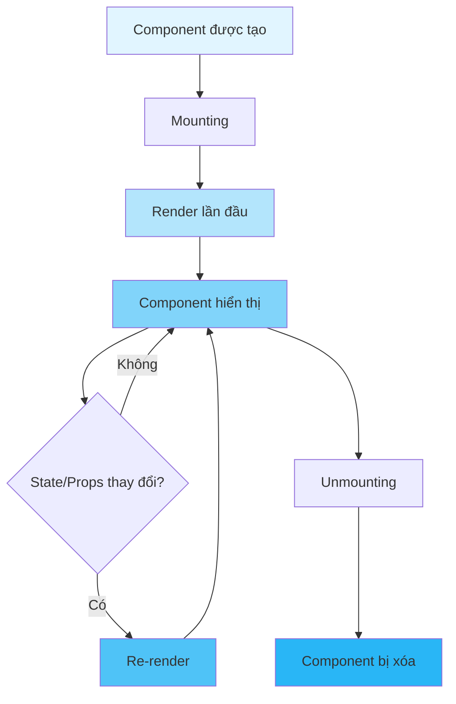

import { CodeExample } from "@/components/mdx/CodeExample";
import { Diagram } from "@/components/mdx/Diagram";
import { Quiz } from "@/components/mdx/Quiz";
import { InteractiveDemo } from "@/components/mdx/InteractiveDemo";

# Kiến thức cơ bản React

## Giới thiệu

React là một thư viện JavaScript để xây dựng giao diện người dùng. Được phát triển bởi Meta (Facebook), React đã trở thành một trong những công cụ phổ biến nhất cho phát triển frontend hiện đại.

## Các khái niệm cốt lõi

### 1. Components (Thành phần)

Components là các khối xây dựng cơ bản của ứng dụng React. Chúng cho phép bạn chia UI thành các phần độc lập, có thể tái sử dụng.

<CodeExample title="Function Component cơ bản" language="jsx">
```jsx
function Welcome(props) {
  return <h1>Xin chào, {props.name}!</h1>;
}

// Sử dụng component
function App() {
return (
<div>
<Welcome name="An" />
<Welcome name="Bình" />
<Welcome name="Chi" />
</div>
);
}

````
</CodeExample>

### 2. JSX (JavaScript XML)

JSX là một cú pháp mở rộng cho JavaScript cho phép bạn viết HTML-like code trong JavaScript.

<CodeExample title="JSX Syntax" language="jsx">
```jsx
// JSX
const element = <h1>Hello, world!</h1>;

// Được biên dịch thành:
const element = React.createElement(
  'h1',
  null,
  'Hello, world!'
);
````

</CodeExample>

### 3. Props (Thuộc tính)

Props là cách để truyền dữ liệu từ component cha sang component con. Props là read-only (chỉ đọc).

<CodeExample title="Sử dụng Props" language="jsx">
```jsx
function UserCard({ name, age, email }) {
  return (
    <div className="user-card">
      <h2>{name}</h2>
      <p>Tuổi: {age}</p>
      <p>Email: {email}</p>
    </div>
  );
}

function App() {
return (
<UserCard 
      name="Nguyễn Văn A" 
      age={25} 
      email="a@example.com" 
    />
);
}

````
</CodeExample>

### 4. State (Trạng thái)

State là dữ liệu có thể thay đổi trong component. Khi state thay đổi, React sẽ re-render component.

<CodeExample title="useState Hook" language="jsx" runnable={true}>
```jsx
import { useState } from 'react';

function Counter() {
  const [count, setCount] = useState(0);

  return (
    <div>
      <p>Bạn đã nhấn {count} lần</p>
      <button onClick={() => setCount(count + 1)}>
        Nhấn vào đây
      </button>
    </div>
  );
}
````

</CodeExample>

## Component Lifecycle (Vòng đời Component)

<Diagram type="mermaid" title="React Component Lifecycle">

</Diagram>

## Hooks cơ bản

### useState

Quản lý state trong function components.

<CodeExample title="useState Examples" language="jsx">
```jsx
import { useState } from 'react';

function Form() {
const [name, setName] = useState('');
const [email, setEmail] = useState('');
const [isSubmitted, setIsSubmitted] = useState(false);

const handleSubmit = (e) => {
e.preventDefault();
setIsSubmitted(true);
};

if (isSubmitted) {
return <h2>Cảm ơn bạn, {name}!</h2>;
}

return (
<form onSubmit={handleSubmit}>
<input
type="text"
value={name}
onChange={(e) => setName(e.target.value)}
placeholder="Tên của bạn"
/>
<input
type="email"
value={email}
onChange={(e) => setEmail(e.target.value)}
placeholder="Email của bạn"
/>
<button type="submit">Gửi</button>
</form>
);
}

````
</CodeExample>

### useEffect

Thực hiện side effects trong function components.

<CodeExample title="useEffect Examples" language="jsx">
```jsx
import { useState, useEffect } from 'react';

function Timer() {
  const [seconds, setSeconds] = useState(0);

  useEffect(() => {
    // Effect: Thiết lập interval
    const interval = setInterval(() => {
      setSeconds(s => s + 1);
    }, 1000);

    // Cleanup: Xóa interval khi component unmount
    return () => clearInterval(interval);
  }, []); // Empty dependency array = chỉ chạy một lần

  return <div>Đã trôi qua: {seconds} giây</div>;
}
````

</CodeExample>

## Event Handling (Xử lý sự kiện)

<CodeExample title="Event Handlers" language="jsx">
```jsx
function EventExamples() {
  const handleClick = () => {
    alert('Button được nhấn!');
  };

const handleChange = (e) => {
console.log('Input value:', e.target.value);
};

const handleSubmit = (e) => {
e.preventDefault(); // Ngăn form submit mặc định
console.log('Form submitted');
};

return (
<div>
<button onClick={handleClick}>Nhấn vào đây</button>

      <input
        type="text"
        onChange={handleChange}
        placeholder="Nhập gì đó..."
      />

      <form onSubmit={handleSubmit}>
        <button type="submit">Gửi</button>
      </form>
    </div>

);
}

````
</CodeExample>

## Conditional Rendering (Render có điều kiện)

<CodeExample title="Conditional Rendering" language="jsx">
```jsx
function Greeting({ isLoggedIn, username }) {
  // Cách 1: if/else
  if (isLoggedIn) {
    return <h1>Chào mừng trở lại, {username}!</h1>;
  }
  return <h1>Vui lòng đăng nhập.</h1>;
}

function Status({ isOnline }) {
  // Cách 2: Ternary operator
  return (
    <div>
      Trạng thái: {isOnline ? 'Trực tuyến' : 'Ngoại tuyến'}
    </div>
  );
}

function Notification({ message }) {
  // Cách 3: Logical && operator
  return (
    <div>
      {message && <div className="alert">{message}</div>}
    </div>
  );
}
````

</CodeExample>

## Lists và Keys

<CodeExample title="Rendering Lists" language="jsx">
```jsx
function TodoList() {
  const todos = [
    { id: 1, text: 'Học React', completed: true },
    { id: 2, text: 'Xây dựng dự án', completed: false },
    { id: 3, text: 'Phỏng vấn', completed: false }
  ];

return (
<ul>
{todos.map(todo => (
<li
key={todo.id}
style={{
            textDecoration: todo.completed ? 'line-through' : 'none'
          }} >
{todo.text}
</li>
))}
</ul>
);
}

````
</CodeExample>

## Câu hỏi phỏng vấn thường gặp

### Câu 1: React là gì và tại sao nên sử dụng nó?

**Trả lời:**
React là một thư viện JavaScript để xây dựng giao diện người dùng. Lý do nên sử dụng:
- **Component-based**: Tái sử dụng code dễ dàng
- **Virtual DOM**: Hiệu suất cao
- **Declarative**: Code dễ đọc và maintain
- **Large ecosystem**: Nhiều thư viện và công cụ hỗ trợ
- **Strong community**: Cộng đồng lớn và tài liệu phong phú

### Câu 2: Sự khác biệt giữa Props và State là gì?

**Trả lời:**

| Props | State |
|-------|-------|
| Được truyền từ component cha | Được quản lý trong component |
| Read-only (không thể thay đổi) | Có thể thay đổi với setState/useState |
| Dùng để truyền dữ liệu xuống | Dùng để quản lý dữ liệu nội bộ |
| Functional components nhận props | Functional components dùng useState |

### Câu 3: Virtual DOM là gì?

**Trả lời:**
Virtual DOM là một representation (biểu diễn) nhẹ của DOM thực. React sử dụng Virtual DOM để:
1. Tạo một bản sao của DOM trong bộ nhớ
2. Khi state thay đổi, tạo Virtual DOM mới
3. So sánh (diffing) Virtual DOM mới với cũ
4. Chỉ cập nhật những phần thay đổi trong DOM thực (reconciliation)

Điều này giúp cải thiện hiệu suất đáng kể.

### Câu 4: useEffect hoạt động như thế nào?

**Trả lời:**
`useEffect` cho phép thực hiện side effects trong function components:

```jsx
useEffect(() => {
  // Effect code
  return () => {
    // Cleanup code
  };
}, [dependencies]);
````

- **Effect code**: Chạy sau mỗi render (hoặc khi dependencies thay đổi)
- **Cleanup code**: Chạy trước khi effect chạy lại hoặc component unmount
- **Dependencies**: Mảng các giá trị mà effect phụ thuộc vào

### Câu 5: Key trong React là gì và tại sao quan trọng?

**Trả lời:**
Keys giúp React xác định items nào đã thay đổi, được thêm, hoặc bị xóa trong một list:

```jsx
// ✅ Đúng - sử dụng unique ID
{
  items.map((item) => <Item key={item.id} {...item} />);
}

// ❌ Sai - sử dụng index (có thể gây bug)
{
  items.map((item, index) => <Item key={index} {...item} />);
}
```

Keys nên:

- Là unique giữa các siblings
- Là stable (không thay đổi giữa các renders)
- Không sử dụng index trừ khi list không bao giờ thay đổi

## Best Practices

1. **Component nhỏ và tập trung**: Mỗi component nên làm một việc
2. **Sử dụng functional components**: Ưu tiên function components với hooks
3. **Prop validation**: Sử dụng PropTypes hoặc TypeScript
4. **Tránh inline functions**: Trong JSX có thể ảnh hưởng performance
5. **Destructure props**: Làm code dễ đọc hơn
6. **Sử dụng keys đúng cách**: Trong lists
7. **Cleanup effects**: Luôn cleanup trong useEffect khi cần

## Bài tập thực hành

### Bài 1: Todo App

Tạo một ứng dụng Todo đơn giản với các tính năng:

- Thêm todo mới
- Đánh dấu todo hoàn thành
- Xóa todo
- Hiển thị số lượng todo chưa hoàn thành

### Bài 2: Form Validation

Tạo một form đăng ký với validation:

- Email phải hợp lệ
- Password phải ít nhất 8 ký tự
- Confirm password phải khớp
- Hiển thị error messages

### Bài 3: Data Fetching

Tạo component fetch và hiển thị dữ liệu từ API:

- Hiển thị loading state
- Xử lý errors
- Hiển thị dữ liệu khi thành công

<Quiz id="react-fundamentals-quiz" />

## Tóm tắt

- React sử dụng component-based architecture
- JSX cho phép viết HTML-like syntax trong JavaScript
- Props truyền dữ liệu từ cha sang con
- State quản lý dữ liệu có thể thay đổi
- Hooks (useState, useEffect) cho phép sử dụng state và lifecycle trong function components
- Virtual DOM giúp tối ưu hiệu suất

## Chủ đề liên quan

- [React Hooks Deep Dive](./03-hooks-deep-dive.mdx)
- [State Management](./05-state-management.mdx)
- [Performance Optimization](./09-performance-optimization.mdx)
