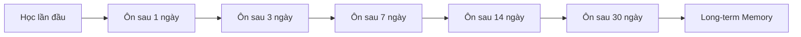
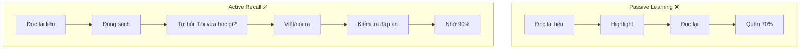
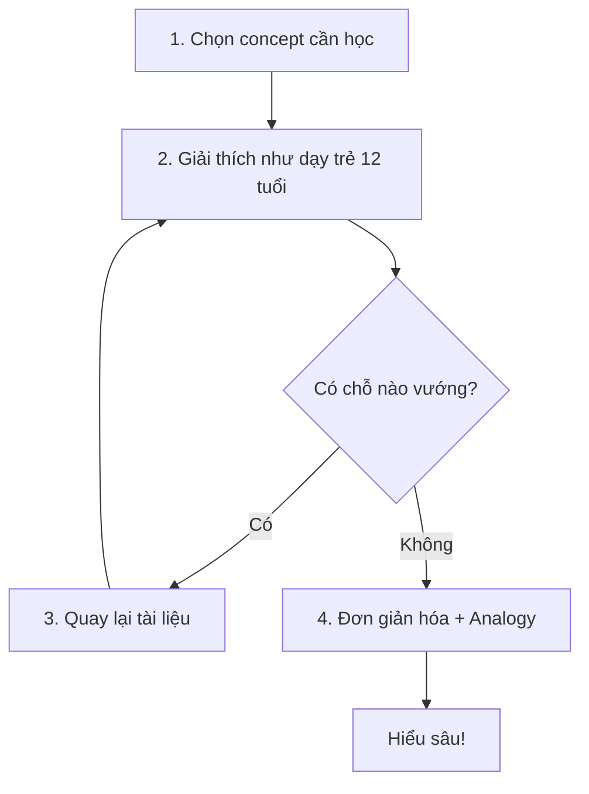
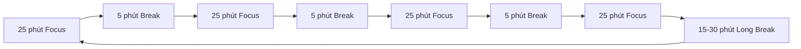

# Phương Pháp Học Hiệu Quả - Evidence-Based Learning

> Tổng hợp các phương pháp học hiện đại từ Oxford, Harvard, Cambridge và Nhật Bản - được chứng minh khoa học giúp tăng hiệu quả ghi nhớ lên 74%

---

## Mục Lục

1. [Giới Thiệu](#giới-thiệu)
2. [Spaced Repetition - Lặp Lại Ngắt Quãng](#1-spaced-repetition---lặp-lại-ngắt-quãng)
3. [Active Recall - Nhớ Lại Chủ Động](#2-active-recall---nhớ-lại-chủ-động)
4. [Feynman Technique](#3-feynman-technique)
5. [Mind Mapping - Sơ Đồ Tư Duy](#4-mind-mapping---sơ-đồ-tư-duy)
6. [Phương Pháp Nhật Bản](#5-phương-pháp-nhật-bản)
7. [Harvard Case Study Method](#6-harvard-case-study-method)
8. [Oxford Tutorial Style](#7-oxford-tutorial-style)
9. [Interleaving - Học Xen Kẽ](#8-interleaving---học-xen-kẽ)
10. [Áp Dụng Tổng Hợp](#áp-dụng-tổng-hợp-cho-frontend-interview)

---

## Giới Thiệu

### Tại Sao Phương Pháp Học Quan Trọng?

Nhiều người học frontend bằng cách đọc documentation và xem tutorial - nhưng khi phỏng vấn lại quên sạch. Nguyên nhân là do não bộ xử lý thông tin theo quy luật riêng, và **cách học quyết định 80% hiệu quả ghi nhớ**.

### Forgetting Curve (Đường Cong Quên Lãng)

```
Mức độ nhớ (%)
100% ─┬────────────────────────────────────────
      │ ████
 80% ─┤ ████████
      │ ████████████
 60% ─┤ ████████████████
      │ ████████████████████
 40% ─┤ ████████████████████████
      │ ████████████████████████████
 20% ─┤ ████████████████████████████████
      │ ████████████████████████████████████
  0% ─┴──┬──────┬──────┬──────┬──────┬──────┬─
         1h    1d     2d     1w     2w    1m
                     Thời gian
```

> Theo nghiên cứu của Hermann Ebbinghaus (1885), chúng ta quên **70% thông tin trong 24 giờ** nếu không ôn tập.

### Kết Quả Khi Áp Dụng Đúng Phương Pháp

| Phương pháp | Hiệu quả so với đọc thụ động |
|-------------|------------------------------|
| Spaced Repetition | +74% ghi nhớ |
| Active Recall | +50% ghi nhớ |
| Interleaving | +76% ghi nhớ |
| Feynman Technique | +40% hiểu sâu |

---

## 1. Spaced Repetition - Lặp Lại Ngắt Quãng

### What - Định Nghĩa

**Spaced Repetition (SRS)** là phương pháp học trong đó bạn ôn tập thông tin với khoảng cách thời gian tăng dần. Thay vì học nhồi nhét một lần, bạn chia nhỏ và ôn tập theo lịch trình khoa học.



### Why - Tại Sao Hiệu Quả?

**Cơ sở khoa học:**

1. **Spacing Effect**: Não bộ củng cố ký ức mỗi khi bạn cố gắng nhớ lại thông tin đang dần bị quên.

2. **Effortful Retrieval**: Càng khó nhớ lại, ký ức càng được củng cố mạnh khi bạn nhớ thành công.

3. **Neural Pathway Strengthening**: Mỗi lần recall, các kết nối neuron được tăng cường.

**Nghiên cứu chứng minh:**
- Meta-analysis 29 nghiên cứu: SRS hiệu quả hơn **74%** so với học tập trung (Cepeda et al., 2006)
- Harvard Medical School: Kiến thức duy trì **tới 2 năm** với SRS (Dr. B. Price Kerfoot)
- Carnegie Mellon: Sinh viên hoàn thành chương trình trong **1/2 thời gian** với SRS

### How - Cách Thực Hiện

#### Bước 1: Tạo Flashcards
```
Front: Closure trong JavaScript là gì?
Back: Closure là khi một function "nhớ" được lexical scope
      của nó ngay cả khi function đó được thực thi bên ngoài
      scope đó. Closure được tạo mỗi khi function được định nghĩa.
```

#### Bước 2: Lịch Ôn Tập
| Lần ôn | Khoảng cách | Ví dụ |
|--------|-------------|-------|
| 1 | Ngay sau khi học | Ngày 1 |
| 2 | 1 ngày | Ngày 2 |
| 3 | 3 ngày | Ngày 5 |
| 4 | 7 ngày | Ngày 12 |
| 5 | 14 ngày | Ngày 26 |
| 6 | 30 ngày | Ngày 56 |

#### Bước 3: Công Cụ Khuyên Dùng
- **Anki** (Free, powerful) - Tải tại: https://apps.ankiweb.net/
- **Quizlet** (Online, easy to use)
- **RemNote** (Note-taking + SRS)

### When - Khi Nào Sử Dụng

**Phù hợp nhất cho:**
- Ghi nhớ khái niệm (definitions)
- Nhớ syntax và API
- Các pattern/algorithm thường dùng

**Không phù hợp cho:**
- Hiểu sâu cơ chế hoạt động
- Giải quyết vấn đề phức tạp

### Áp Dụng Cho Frontend Interview

```markdown
## Flashcard Examples

### JavaScript
Front: Event Loop xử lý microtask và macrotask theo thứ tự nào?
Back: 1. Execute Call Stack
      2. Execute ALL Microtasks (Promise callbacks)
      3. Execute ONE Macrotask (setTimeout)
      4. Repeat

### React
Front: useEffect với dependency array rỗng [] chạy khi nào?
Back: Chỉ chạy 1 lần sau khi component mount lần đầu.
      Tương đương componentDidMount trong class component.

### TypeScript
Front: Khác biệt giữa interface và type là gì?
Back: - Interface: extends, declaration merging, chỉ objects
      - Type: intersections (&), unions (|), primitives, tuples
```

---

## 2. Active Recall - Nhớ Lại Chủ Động

### What - Định Nghĩa

**Active Recall** là phương pháp học bằng cách chủ động cố gắng nhớ lại thông tin từ bộ nhớ, thay vì đọc lại thụ động. Đây là "Testing Effect" - một trong những hiện tượng được nghiên cứu kỹ nhất trong tâm lý học nhận thức.



### Why - Tại Sao Hiệu Quả?

**Cơ sở khoa học:**

1. **Retrieval Strengthens Memory**: Mỗi lần bạn "lấy" thông tin ra từ não, đường dẫn neural đó được củng cố.

2. **Identifies Knowledge Gaps**: Khi không nhớ được, bạn biết chính xác đâu là lỗ hổng.

3. **Deeper Processing**: Cố gắng recall đòi hỏi xử lý sâu hơn so với đọc lại.

**Nghiên cứu chứng minh:**
- Meta-analysis 118 nghiên cứu: d = 0.51 (hiệu quả đáng kể)
- Karpicke & Blunt (2011, Science): Active recall vượt trội concept maps
- Kết hợp SRS: Tăng 33% hiệu quả học tập

### How - Cách Thực Hiện

#### Kỹ Thuật 1: Blank Page Method
```
1. Đọc một section (10-15 phút)
2. Đóng tài liệu
3. Lấy giấy trắng, viết ra TẤT CẢ những gì bạn nhớ
4. Mở tài liệu, so sánh
5. Đánh dấu những gì thiếu/sai
6. Lặp lại bước 2-5 cho đến khi nhớ đủ
```

#### Kỹ Thuật 2: Question-Based Notes
Khi đọc, tạo câu hỏi thay vì ghi chú thụ động:

| Thay vì viết | Hãy viết |
|--------------|----------|
| "Closure giữ reference tới outer scope" | "Q: Tại sao closure có thể access biến từ outer function?" |
| "React re-render khi state thay đổi" | "Q: Khi nào React component re-render?" |

#### Kỹ Thuật 3: Rubber Duck Debugging
```
1. Đặt một con vịt cao su (hoặc object bất kỳ) trước mặt
2. Giải thích concept cho con vịt như thể nó là người mới học
3. Nếu không giải thích được → bạn chưa hiểu rõ
```

### When - Khi Nào Sử Dụng

**Phù hợp nhất cho:**
- Sau khi đọc xong một topic
- Trước khi bắt đầu coding practice
- Review cuối ngày/cuối tuần

**Daily Practice:**
```
Morning (sau SRS review):
- 10 phút: Viết ra 3 concepts học hôm qua
- Không nhìn notes!

Evening:
- 10 phút: Tổng kết ngày - học được gì?
- Viết dạng bullet points
```

### Áp Dụng Cho Frontend Interview

#### Practice Session Example
```markdown
## Session: Event Loop (30 phút)

### Phase 1: Learning (15 phút)
- Đọc về Call Stack, Task Queue, Microtask Queue

### Phase 2: Active Recall (15 phút)
1. Đóng tài liệu
2. Trả lời các câu hỏi (không nhìn):

   Q1: Call stack là gì? Hoạt động như thế nào?
   [Viết câu trả lời của bạn]

   Q2: Microtask và macrotask khác nhau ở điểm nào?
   [Viết câu trả lời của bạn]

   Q3: Vẽ diagram event loop process
   [Vẽ diagram]

3. Mở tài liệu, kiểm tra câu trả lời
4. Đánh dấu những gì sai/thiếu
```

---

## 3. Feynman Technique

### What - Định Nghĩa

**Feynman Technique** được đặt theo tên của nhà vật lý đoạt giải Nobel Richard Feynman. Nguyên tắc cốt lõi: **"Nếu bạn không thể giải thích đơn giản, bạn chưa thực sự hiểu."**



### Why - Tại Sao Hiệu Quả?

**Cơ sở khoa học:**

1. **Exposes Knowledge Gaps**: Jargon thường che giấu sự thiếu hiểu biết. Khi phải dùng ngôn ngữ đơn giản, gaps hiện ra rõ ràng.

2. **Forces Deep Processing**: Để đơn giản hóa, bạn phải thực sự hiểu cơ chế bên dưới.

3. **Creates Mental Models**: Analogies tạo ra các mô hình mental giúp nhớ lâu hơn.

### How - Cách Thực Hiện

#### 4 Bước Feynman

**Bước 1: Chọn Concept**
```
Topic: React Fiber
```

**Bước 2: Giải thích đơn giản (không dùng thuật ngữ)**
```
❌ Sai: "Fiber là một reimplementation của core algorithm
        cho phép incremental rendering với time-slicing."

✅ Đúng: "Hãy tưởng tượng bạn đang dọn một căn phòng rất bừa bộn.

         Cách cũ (Stack Reconciler): Bạn phải dọn xong 100% mới
         được làm việc khác. Nếu có khách gọi cửa, họ phải đợi.

         Cách mới (Fiber): Bạn dọn từng góc nhỏ, sau mỗi góc
         bạn có thể dừng lại để mở cửa cho khách. Xong việc
         khách thì tiếp tục dọn từ chỗ dừng."
```

**Bước 3: Xác định gaps**
```
Khi giải thích, tôi không biết:
- Fiber chính xác "dừng" ở đâu?
- Time-slicing hoạt động thế nào với browser?
→ Quay lại đọc thêm về requestIdleCallback
```

**Bước 4: Đơn giản hóa với Analogy**
```
Final explanation:
"React Fiber giống như đầu bếp trong nhà hàng bận rộn.

Đầu bếp cũ (Stack): Phải nấu xong món A mới được nấu món B,
kể cả khi khách VIP đến và cần món B gấp.

Đầu bếp mới (Fiber):
- Chia công việc thành các bước nhỏ
- Sau mỗi bước, kiểm tra: có việc quan trọng hơn không?
- Nếu có (user click, input) → dừng lại, xử lý việc đó trước
- Xong việc gấp → quay lại từ bước đang dở"
```

### When - Khi Nào Sử Dụng

**Phù hợp nhất cho:**
- Concepts phức tạp (Event Loop, Fiber, Virtual DOM)
- Chuẩn bị giải thích trong phỏng vấn
- Khi đọc xong nhưng vẫn thấy mơ hồ

**Interview Application:**
```
Interviewer: "Giải thích closure là gì?"

❌ Trả lời kỹ thuật: "Closure là một function bundle với
   lexical environment của nó, cho phép access outer scope
   variables sau khi outer function đã return."

✅ Feynman-style: "Hãy tưởng tượng bạn có một chiếc ba lô.
   Khi bạn rời khỏi nhà (outer function), bạn mang theo
   ba lô đó. Trong ba lô có các vật dụng từ nhà (variables).

   Dù bạn đã rời nhà, bạn vẫn có thể dùng các vật dụng đó.

   Closure cũng vậy - function mang theo 'ba lô' chứa các
   biến từ scope cha, và có thể sử dụng chúng bất cứ đâu."
```

---

## 4. Mind Mapping - Sơ Đồ Tư Duy

### What - Định Nghĩa

**Mind Mapping** là kỹ thuật ghi chú trực quan, bắt đầu từ một ý tưởng trung tâm và phát triển các nhánh liên kết. Được phát triển bởi Tony Buzan, phương pháp này tận dụng cách não bộ xử lý thông tin qua hình ảnh và liên kết.

### Why - Tại Sao Hiệu Quả?

**Cơ sở khoa học:**

1. **Visual Processing**: Não xử lý hình ảnh nhanh hơn 60,000 lần so với text
2. **Association**: Thông tin được liên kết = dễ nhớ hơn
3. **Big Picture**: Nhìn thấy toàn cảnh và mối quan hệ giữa các concepts

**Nghiên cứu:**
- Tăng 10-15% retention (Farrand, Hussain & Hennessy, 2002)
- 85-95% success rate nhận diện hình ảnh (Standing, 1973)

### How - Cách Thực Hiện

#### JavaScript Mind Map Example

```
                    ┌─────────────────┐
                    │   JAVASCRIPT    │
                    │     ENGINE      │
                    └────────┬────────┘
                             │
         ┌───────────────────┼───────────────────┐
         │                   │                   │
    ┌────▼────┐        ┌─────▼─────┐       ┌─────▼─────┐
    │ Parsing │        │ Execution │       │  Memory   │
    └────┬────┘        └─────┬─────┘       └─────┬─────┘
         │                   │                   │
    ┌────┴────┐         ┌────┴────┐         ┌────┴────┐
    │  Lexer  │         │ Call    │         │  Heap   │
    │ (tokens)│         │ Stack   │         │(objects)│
    └─────────┘         └────┬────┘         └─────────┘
                             │
                        ┌────┴────┐
                        │ Event   │
                        │  Loop   │
                        └────┬────┘
                             │
              ┌──────────────┼──────────────┐
              │              │              │
         ┌────▼────┐   ┌─────▼─────┐  ┌─────▼─────┐
         │Microtask│   │ Macrotask │  │  Render   │
         │  Queue  │   │   Queue   │  │   Queue   │
         │(Promise)│   │(setTimeout)│  │(rAF)     │
         └─────────┘   └───────────┘  └───────────┘
```

#### React Hooks Mind Map

```
                         ┌───────────┐
                         │   HOOKS   │
                         └─────┬─────┘
                               │
       ┌───────────┬───────────┼───────────┬───────────┐
       │           │           │           │           │
  ┌────▼────┐ ┌────▼────┐ ┌────▼────┐ ┌────▼────┐ ┌────▼────┐
  │useState │ │useEffect│ │useRef   │ │useMemo  │ │useCallback│
  └────┬────┘ └────┬────┘ └────┬────┘ └────┬────┘ └────┬────┘
       │           │           │           │           │
  Component   Side        DOM ref    Memoize    Memoize
  State       Effects     or         computed   function
              Cleanup     mutable    values
              Deps        values
```

### When - Khi Nào Sử Dụng

**Phù hợp nhất cho:**
- Khi bắt đầu học một topic lớn
- Tổng hợp sau khi học xong một module
- Trước phỏng vấn - review toàn bộ kiến thức

**Tools:**
- **Mermaid** (trong markdown)
- **Excalidraw** (vẽ tay)
- **Miro** (collaborate)
- **XMind** (desktop app)

---

## 5. Phương Pháp Nhật Bản

### 5.1 Kaizen - Cải Tiến Liên Tục

#### What - Định Nghĩa
**Kaizen (改善)** có nghĩa là "thay đổi để tốt hơn". Triết lý: Những cải tiến nhỏ, liên tục sẽ dẫn đến kết quả lớn.

#### Why - Tại Sao Hiệu Quả?
- Không overwhelm với mục tiêu lớn
- Xây dựng habits bền vững
- Compound effect theo thời gian

#### How - Cách Áp Dụng

```markdown
## Kaizen cho Frontend Interview

### Daily Kaizen (5-10 phút cải tiến)
- Hôm nay tôi học được gì mới?
- Có cách nào học hiệu quả hơn không?
- Flashcard nào cần update?

### Weekly Kaizen
- Review tuần: Hoàn thành bao nhiêu % kế hoạch?
- Điều gì hoạt động tốt? Điều gì không?
- Tuần tới cần điều chỉnh gì?

### Ví dụ cụ thể
Week 1: Học 1 concept/ngày
Week 2: Học 1 concept + 1 coding problem/ngày
Week 3: Thêm 15 phút SRS review
Week 4: Thêm mock interview 1 lần/tuần
→ Dần dần tăng, không đột ngột
```

### 5.2 Pomodoro Technique

#### What - Định Nghĩa
**Pomodoro** (cà chua tiếng Ý) là kỹ thuật quản lý thời gian: làm việc tập trung 25 phút, nghỉ 5 phút.



#### How - Cách Áp Dụng

```markdown
## Study Session với Pomodoro

### Pomodoro 1: JavaScript Concept (25 phút)
- Đọc về Event Loop
- Ghi notes theo Question format

### Break 1 (5 phút)
- Đứng dậy, đi bộ
- KHÔNG nhìn màn hình

### Pomodoro 2: Active Recall (25 phút)
- Đóng notes
- Viết ra những gì đã học
- So sánh với notes

### Break 2 (5 phút)
- Uống nước
- Stretch

### Pomodoro 3: Coding Practice (25 phút)
- Giải 1 LeetCode problem
- Không Google trong 25 phút đầu

### Break 3 (5 phút)
- Rest

### Pomodoro 4: Review Solution (25 phút)
- Xem optimal solution
- Ghi chú pattern học được

### Long Break (15-30 phút)
- Đi bộ, ăn nhẹ
- Hoàn toàn disconnect
```

### 5.3 Shoshin - Beginner's Mind

#### What - Định Nghĩa
**Shoshin (初心)** là khái niệm Zen Buddhist: tiếp cận mọi thứ với tâm thế của người mới bắt đầu - tò mò, cởi mở, không định kiến.

#### Why - Tại Sao Quan Trọng?

> "In the beginner's mind there are many possibilities, but in the expert's mind there are few." - Shunryu Suzuki

- Tránh **Einstellung Effect**: Bị mắc kẹt trong cách giải quen thuộc
- Luôn sẵn sàng học cách mới, tốt hơn
- Humble khi phỏng vấn - không assume đã biết hết

#### How - Cách Áp Dụng

```markdown
## Shoshin trong Interview Prep

### Khi học concept quen thuộc
❌ "Closure à, biết rồi, skip"
✅ "Mình đã thực sự hiểu closure chưa? Có cách giải thích mới không?"

### Khi giải bài toán
❌ "Dùng HashMap như mọi khi"
✅ "Có approach nào khác không? Trade-offs là gì?"

### Khi nhận feedback
❌ "Cách mình đúng rồi mà"
✅ "Có thể mình đang miss điều gì đó"
```

---

## 6. Harvard Case Study Method

### What - Định Nghĩa

**Case Study Method** được phát triển tại Harvard Business School từ đầu thế kỷ 20. Thay vì học lý thuyết thuần túy, sinh viên phân tích các tình huống thực tế, đưa ra quyết định và bảo vệ lập luận.

### Why - Tại Sao Hiệu Quả?

1. **Bridges Theory & Practice**: Lý thuyết trở nên có nghĩa khi áp dụng
2. **Develops Critical Thinking**: Phân tích trade-offs, không có đáp án "đúng" tuyệt đối
3. **Prepares for Real Interviews**: System design interviews là case studies

### How - Cách Áp Dụng

#### Frontend System Design Case Study

```markdown
## Case Study: Design Facebook News Feed

### Context
- 2 tỷ users
- 1000+ posts/giây
- Multiple content types: text, image, video
- Real-time updates

### Your Task (45 phút)
1. Xác định requirements
2. Thiết kế high-level architecture
3. Đề xuất data model
4. Xử lý các trade-offs

### Analysis Framework
┌─────────────────────────────────────────────────────────┐
│                    RADIO Framework                       │
├─────────────────────────────────────────────────────────┤
│ R - Requirements: Functional & Non-functional            │
│ A - Architecture: Components, data flow                  │
│ D - Data Model: Entities, relationships                  │
│ I - Interface: API contracts, component interfaces       │
│ O - Optimizations: Performance, caching, lazy loading    │
└─────────────────────────────────────────────────────────┘

### Trade-off Analysis
| Decision | Option A | Option B | Your Choice & Why |
|----------|----------|----------|-------------------|
| Rendering | CSR | SSR | ? |
| State | Redux | Context | ? |
| Updates | Polling | WebSocket | ? |
```

### When - Khi Nào Sử Dụng

- System Design preparation
- Khi học architecture patterns
- Mock interview practice

---

## 7. Oxford Tutorial Style

### What - Định Nghĩa

**Oxford Tutorial** là phương pháp giảng dạy 1-1 hoặc nhóm nhỏ (1-2 sinh viên) với một tutor. Sinh viên chuẩn bị essay/solution, sau đó trình bày và bảo vệ trước tutor.

### Why - Tại Sao Hiệu Quả?

1. **Accountable Learning**: Phải giải thích và bảo vệ hiểu biết
2. **Immediate Feedback**: Phát hiện lỗ hổng ngay lập tức
3. **Simulates Interview**: Rất giống technical interview

### How - Cách Áp Dụng

```markdown
## Mock Interview Session (Tutorial Style)

### Preparation (30 phút trước)
- Chọn topic: "React Performance Optimization"
- Chuẩn bị: giải thích + code examples

### Session (45 phút)
1. **Presentation (10 phút)**
   - Trình bày những gì đã chuẩn bị

2. **Questioning (20 phút)**
   Partner hỏi:
   - "Tại sao useMemo có thể giảm re-renders?"
   - "Khi nào useMemo có thể harmful?"
   - "React.memo khác useMemo như thế nào?"

3. **Coding Challenge (15 phút)**
   - Implement optimization cho một component
   - Giải thích từng step

### Feedback
- Điểm mạnh
- Điểm cần cải thiện
- Resources để học thêm
```

### When - Khi Nào Sử Dụng

- Mock interviews với bạn học
- Mentorship sessions
- Study group meetings

---

## 8. Interleaving - Học Xen Kẽ

### What - Định Nghĩa

**Interleaving** là học nhiều topics/skills xen kẽ trong một session, thay vì học từng cái một (blocked practice).

```
Blocked:     AAAA BBBB CCCC (Học hết A rồi đến B, rồi C)
Interleaved: ABCA BCAB CABC (Xen kẽ A, B, C)
```

### Why - Tại Sao Hiệu Quả?

**Nghiên cứu:**
- Taylor & Rohrer (2010): Interleaving **tăng gấp đôi** điểm test
- 2015 study: +76% improvement

**Cơ chế:**
1. **Discrimination Learning**: Học cách phân biệt khi nào dùng technique nào
2. **Retrieval Practice**: Phải recall context switching
3. **Real-world Simulation**: Phỏng vấn cũng mix nhiều topics

### How - Cách Áp Dụng

```markdown
## Interleaved Study Session (2 giờ)

### Thay vì:
- 2 giờ: Chỉ làm Array problems

### Hãy:
- 25 phút: Array problem (Two Sum)
- 25 phút: JavaScript concept (Closures)
- 25 phút: Tree problem (BFS)
- 25 phút: React hooks review
- 20 phút: Mixed review quiz

### Coding Practice Interleaved
Monday:   Array → String → Tree
Tuesday:  String → Tree → DP
Wednesday: Tree → DP → Array
Thursday: DP → Array → String
Friday:   Mixed practice test
```

### When - Khi Nào Sử Dụng

- Coding practice sessions
- Khi đã qua giai đoạn học cơ bản
- Mock interview prep (realistic conditions)

---

## Áp Dụng Tổng Hợp Cho Frontend Interview

### Daily Study Template

```markdown
## Morning Session (1.5 giờ)

### Pomodoro 1: SRS Review (25 phút)
- Review flashcards (Spaced Repetition)
- Target: 50-100 cards/session

### Break (5 phút)

### Pomodoro 2: New Concept (25 phút)
- Đọc một topic mới
- Ghi notes dạng questions (Active Recall prep)

### Break (5 phút)

### Pomodoro 3: Feynman (25 phút)
- Giải thích concept vừa học
- Viết ra như đang dạy người khác
- Xác định gaps, quay lại đọc thêm

---

## Evening Session (1.5 giờ)

### Pomodoro 1: Coding - Topic A (25 phút)
- Giải 1 problem không nhìn solution

### Break (5 phút)

### Pomodoro 2: Coding - Topic B (25 phút)
- Switch sang problem khác loại (Interleaving)

### Break (5 phút)

### Pomodoro 3: Review & Mind Map (25 phút)
- Review solutions
- Update mind map cho topics đã học
- Tạo flashcards cho patterns mới

---

## Weekly
- Saturday: Case Study (System Design)
- Sunday: Mock Interview (Tutorial Style)
```

### 6-Week Integration Plan

| Tuần | Focus | Methods |
|------|-------|---------|
| 1-2 | JavaScript Core | SRS + Feynman + Mind Map |
| 3-4 | React + TS | SRS + Active Recall + Interleaving |
| 5 | System Design | Case Study + Tutorial |
| 6 | Mock Interviews | All methods combined |

---

## Checklist Tự Đánh Giá

### Daily
- [ ] Completed SRS review (50+ cards)
- [ ] Learned 1 new concept with Feynman
- [ ] Solved 1-2 coding problems (interleaved)
- [ ] Updated flashcards with new learnings

### Weekly
- [ ] Created/updated mind map for the week's topics
- [ ] 1 case study (system design)
- [ ] 1 mock interview session
- [ ] Kaizen reflection: What to improve?

### Before Interview
- [ ] Can explain all concepts using Feynman (simple language)
- [ ] Flashcard streak maintained
- [ ] Completed 3+ mock interviews
- [ ] Reviewed all mind maps

---

## Tài Nguyên Bổ Sung

### Books
- "Make It Stick" - Brown, Roediger, McDaniel
- "A Mind for Numbers" - Barbara Oakley
- "Ultralearning" - Scott Young

### Apps
- **Anki**: https://apps.ankiweb.net/ (SRS)
- **Forest**: Focus timer (Pomodoro)
- **Excalidraw**: Mind mapping

### Research Papers
- Cepeda et al. (2006): Spacing Effect meta-analysis
- Karpicke & Blunt (2011): Retrieval practice vs. concept maps
- Rohrer & Taylor (2007): Interleaving effects

---

> **Nhớ:** Không cần áp dụng TẤT CẢ methods cùng lúc. Bắt đầu với 2-3 methods, làm quen, rồi dần dần thêm. **Consistency > Intensity.**
