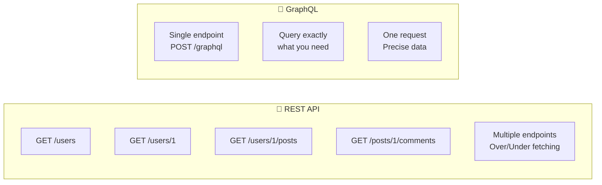
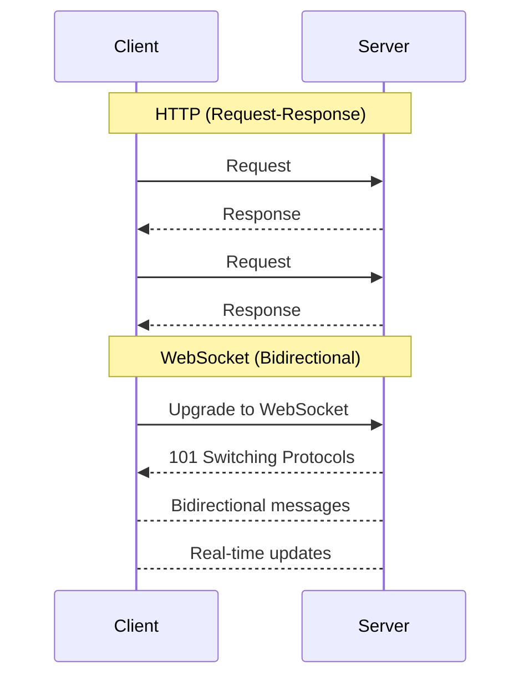
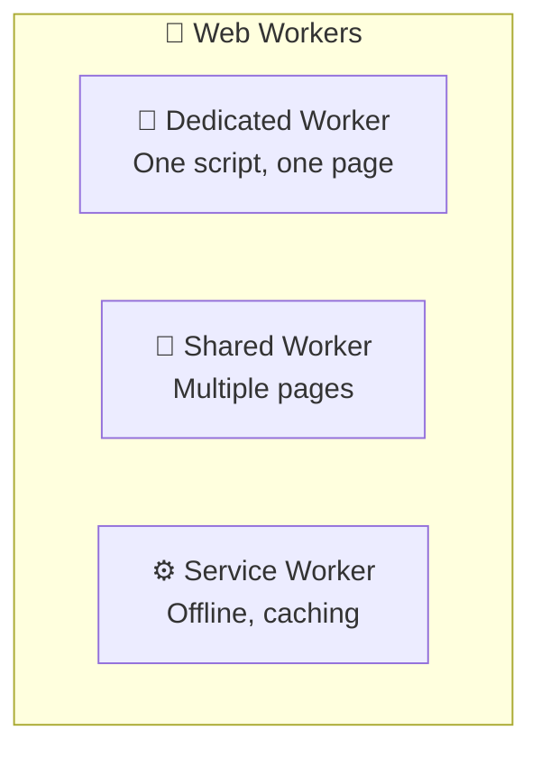
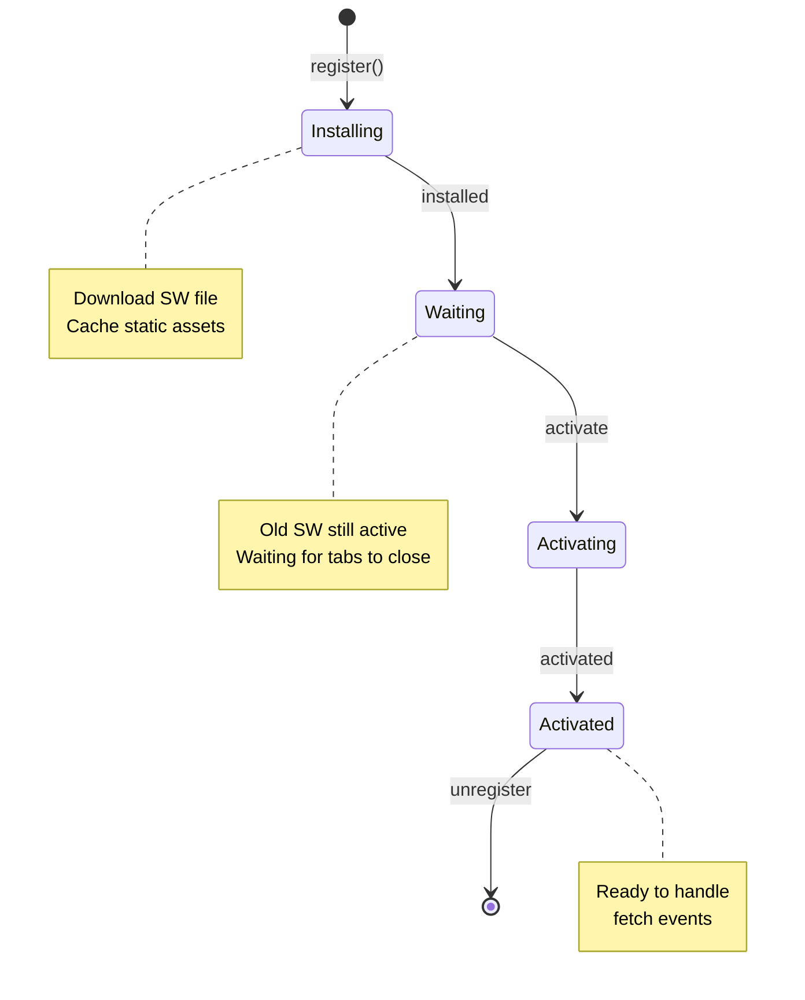
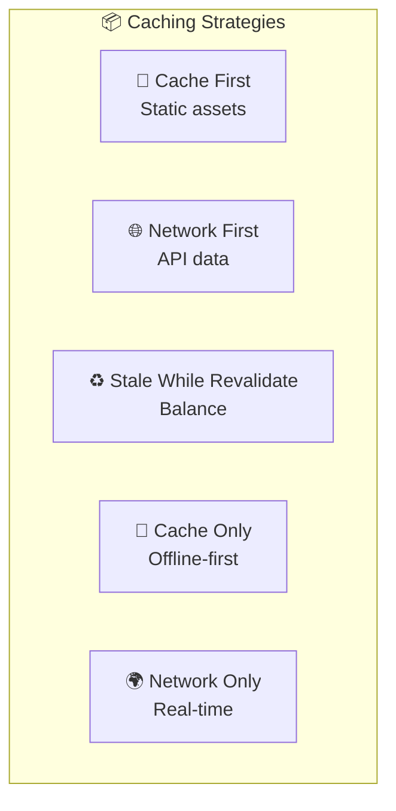
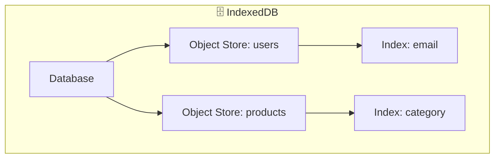
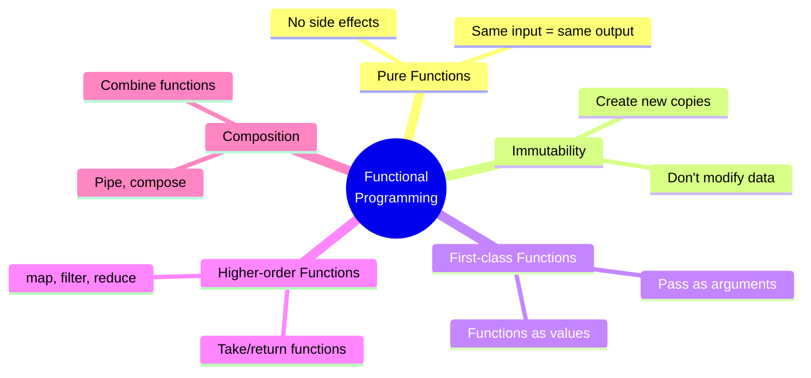
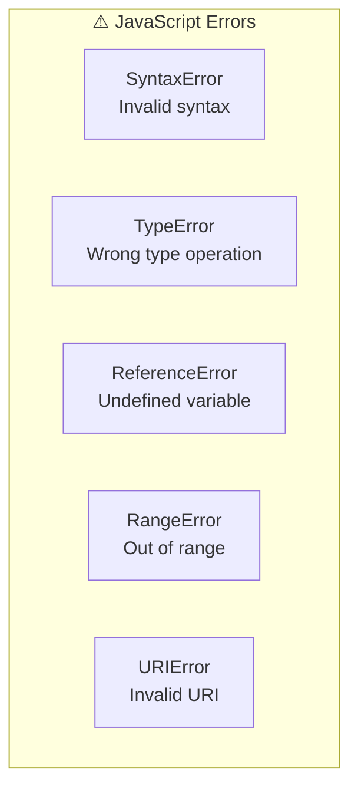
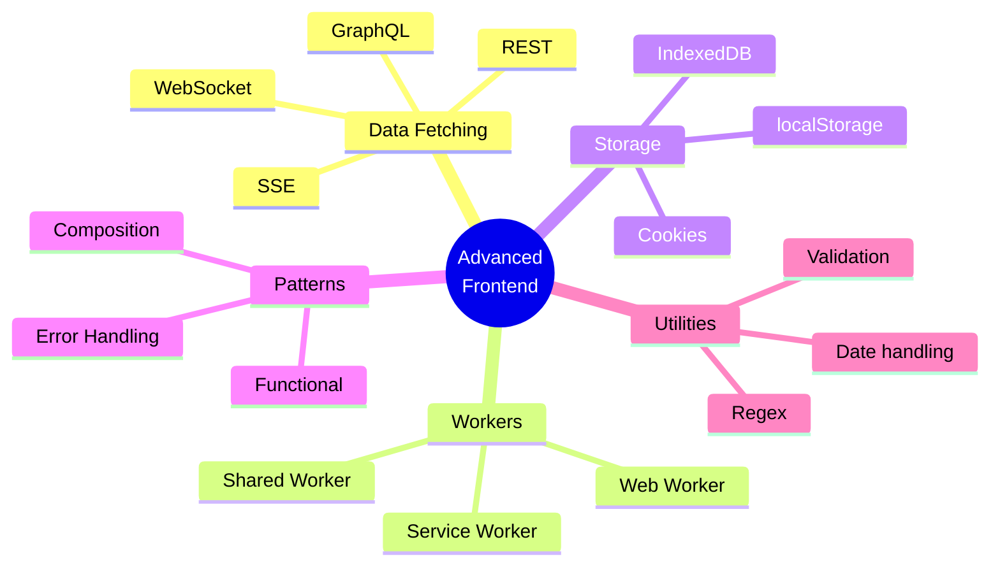

# 📚 Tài Liệu Phỏng Vấn Frontend 2025 - Phần 10

> **Chủ đề**: 🚀 Advanced APIs & Programming Patterns

---

## 📋 Mục Lục

1. [GraphQL Fundamentals](#1-graphql-fundamentals)
2. [WebSocket & Real-time](#2-websocket--real-time)
3. [Web Workers](#3-web-workers)
4. [Service Workers & Caching](#4-service-workers--caching)
5. [IndexedDB](#5-indexeddb)
6. [Web Storage APIs](#6-web-storage-apis)
7. [Functional Programming](#7-functional-programming)
8. [Regular Expressions](#8-regular-expressions)
9. [Error Handling Patterns](#9-error-handling-patterns)
10. [Câu Hỏi Phỏng Vấn](#10-câu-hỏi-phỏng-vấn)

---

## 1. GraphQL Fundamentals

### 1.1 REST vs GraphQL



| Aspect             | REST              | GraphQL          |
| ------------------ | ----------------- | ---------------- |
| **Endpoints**      | Multiple          | Single           |
| **Data fetching**  | Fixed response    | Client specifies |
| **Over-fetching**  | Common            | Avoided          |
| **Under-fetching** | Multiple requests | Single request   |
| **Versioning**     | URL versioning    | Schema evolution |
| **Caching**        | HTTP caching      | Client-side      |

### 1.2 GraphQL Query Syntax

```graphql
# 📖 QUERY - Read data
query GetUser($id: ID!) {
  user(id: $id) {
    id
    name
    email
    posts(first: 5) {
      title
      createdAt
      comments {
        text
        author {
          name
        }
      }
    }
  }
}

# ✏️ MUTATION - Write data
mutation CreatePost($input: PostInput!) {
  createPost(input: $input) {
    id
    title
    author {
      name
    }
  }
}

# 📡 SUBSCRIPTION - Real-time
subscription OnNewMessage($roomId: ID!) {
  messageAdded(roomId: $roomId) {
    id
    text
    sender {
      name
    }
  }
}
```

### 1.3 Apollo Client Setup

```javascript
// 📦 Apollo Client setup
import { ApolloClient, InMemoryCache, gql } from "@apollo/client";

const client = new ApolloClient({
  uri: "https://api.example.com/graphql",
  cache: new InMemoryCache(),
});

// 🔍 Query hook
import { useQuery, useMutation } from "@apollo/client";

const GET_USERS = gql`
  query GetUsers {
    users {
      id
      name
    }
  }
`;

function UserList() {
  const { loading, error, data, refetch } = useQuery(GET_USERS);

  if (loading) return <Spinner />;
  if (error) return <Error message={error.message} />;

  return (
    <ul>
      {data.users.map((user) => (
        <li key={user.id}>{user.name}</li>
      ))}
    </ul>
  );
}

// ✏️ Mutation hook
const CREATE_USER = gql`
  mutation CreateUser($name: String!) {
    createUser(name: $name) {
      id
      name
    }
  }
`;

function AddUser() {
  const [createUser, { loading }] = useMutation(CREATE_USER, {
    refetchQueries: [{ query: GET_USERS }],
    // Or update cache directly
    update(cache, { data: { createUser } }) {
      const { users } = cache.readQuery({ query: GET_USERS });
      cache.writeQuery({
        query: GET_USERS,
        data: { users: [...users, createUser] },
      });
    },
  });

  const handleSubmit = (name) => {
    createUser({ variables: { name } });
  };
}
```

---

## 2. WebSocket & Real-time

### 2.1 WebSocket vs HTTP



### 2.2 Native WebSocket API

```javascript
// 🔌 WEBSOCKET CONNECTION
const ws = new WebSocket("wss://api.example.com/socket");

// 📡 Connection opened
ws.addEventListener("open", (event) => {
  console.log("Connected!");
  ws.send(JSON.stringify({ type: "subscribe", channel: "updates" }));
});

// 📩 Message received
ws.addEventListener("message", (event) => {
  const data = JSON.parse(event.data);
  console.log("Received:", data);
});

// ❌ Error handling
ws.addEventListener("error", (event) => {
  console.error("WebSocket error:", event);
});

// 🔚 Connection closed
ws.addEventListener("close", (event) => {
  console.log("Disconnected:", event.code, event.reason);
  // Reconnect logic
  setTimeout(() => reconnect(), 3000);
});

// 📤 Send message
function sendMessage(message) {
  if (ws.readyState === WebSocket.OPEN) {
    ws.send(JSON.stringify(message));
  }
}

// 🔌 Close connection
ws.close(1000, "Normal closure");
```

### 2.3 React WebSocket Hook

```javascript
function useWebSocket(url) {
  const [messages, setMessages] = useState([]);
  const [isConnected, setIsConnected] = useState(false);
  const ws = useRef(null);

  useEffect(() => {
    ws.current = new WebSocket(url);

    ws.current.onopen = () => setIsConnected(true);
    ws.current.onclose = () => setIsConnected(false);
    ws.current.onmessage = (event) => {
      const data = JSON.parse(event.data);
      setMessages((prev) => [...prev, data]);
    };

    return () => ws.current?.close();
  }, [url]);

  const send = useCallback((message) => {
    ws.current?.send(JSON.stringify(message));
  }, []);

  return { messages, isConnected, send };
}

// Usage
function Chat() {
  const { messages, isConnected, send } = useWebSocket(
    "wss://chat.example.com"
  );

  return (
    <div>
      <span>{isConnected ? "🟢 Connected" : "🔴 Disconnected"}</span>
      {messages.map((msg) => (
        <Message key={msg.id} {...msg} />
      ))}
    </div>
  );
}
```

### 2.4 Server-Sent Events (SSE)

```javascript
// 📡 SSE - One-way server → client
const eventSource = new EventSource("/api/events");

eventSource.onmessage = (event) => {
  console.log("Data:", event.data);
};

eventSource.addEventListener("notification", (event) => {
  console.log("Notification:", JSON.parse(event.data));
});

eventSource.onerror = (error) => {
  console.error("SSE error:", error);
};

// Close connection
eventSource.close();
```

| Feature            | WebSocket      | SSE                  |
| ------------------ | -------------- | -------------------- |
| **Direction**      | Bidirectional  | Server → Client only |
| **Protocol**       | ws:// / wss:// | HTTP                 |
| **Binary data**    | ✅ Yes         | ❌ No (text only)    |
| **Auto-reconnect** | ❌ Manual      | ✅ Built-in          |
| **Use case**       | Chat, games    | Notifications, feeds |

---

## 3. Web Workers

### 3.1 Worker Types



### 3.2 Dedicated Worker

```javascript
// 📄 main.js
const worker = new Worker("worker.js");

// Send data to worker
worker.postMessage({ type: "process", data: largeArray });

// Receive result
worker.onmessage = (event) => {
  console.log("Result:", event.data);
};

// Handle errors
worker.onerror = (error) => {
  console.error("Worker error:", error);
};

// Terminate worker
worker.terminate();

// 📄 worker.js
self.onmessage = (event) => {
  const { type, data } = event.data;

  if (type === "process") {
    // Heavy computation in background
    const result = data.map((x) => x * 2).filter((x) => x > 100);

    // Send result back
    self.postMessage(result);
  }
};
```

### 3.3 Transferable Objects

```javascript
// 🚀 Transfer ownership instead of copying (faster!)
const buffer = new ArrayBuffer(1024 * 1024); // 1MB

// ❌ Slow: Copy data
worker.postMessage({ buffer });

// ✅ Fast: Transfer ownership
worker.postMessage({ buffer }, [buffer]);
// Note: buffer is now unusable in main thread
```

### 3.4 Worker with Module

```javascript
// Modern worker with ES modules
const worker = new Worker("worker.js", { type: "module" });

// worker.js
import { heavyComputation } from "./utils.js";

self.onmessage = async (event) => {
  const result = await heavyComputation(event.data);
  self.postMessage(result);
};
```

---

## 4. Service Workers & Caching

### 4.1 Service Worker Lifecycle



### 4.2 Registration

```javascript
// 📝 Register Service Worker
if ("serviceWorker" in navigator) {
  window.addEventListener("load", async () => {
    try {
      const registration = await navigator.serviceWorker.register("/sw.js", {
        scope: "/",
      });

      console.log("SW registered:", registration.scope);

      // Check for updates
      registration.addEventListener("updatefound", () => {
        const newWorker = registration.installing;
        newWorker.addEventListener("statechange", () => {
          if (newWorker.state === "installed") {
            if (navigator.serviceWorker.controller) {
              // New version available
              showUpdateNotification();
            }
          }
        });
      });
    } catch (error) {
      console.error("SW registration failed:", error);
    }
  });
}
```

### 4.3 Service Worker File

```javascript
// 📄 sw.js
const CACHE_NAME = "app-v1";
const STATIC_ASSETS = [
  "/",
  "/index.html",
  "/styles.css",
  "/app.js",
  "/offline.html",
];

// 📥 Install - Cache static assets
self.addEventListener("install", (event) => {
  event.waitUntil(
    caches.open(CACHE_NAME).then((cache) => {
      return cache.addAll(STATIC_ASSETS);
    })
  );
  self.skipWaiting(); // Activate immediately
});

// 🧹 Activate - Clean old caches
self.addEventListener("activate", (event) => {
  event.waitUntil(
    caches.keys().then((cacheNames) => {
      return Promise.all(
        cacheNames
          .filter((name) => name !== CACHE_NAME)
          .map((name) => caches.delete(name))
      );
    })
  );
  self.clients.claim(); // Take control immediately
});

// 🔄 Fetch - Serve from cache or network
self.addEventListener("fetch", (event) => {
  event.respondWith(
    caches
      .match(event.request)
      .then((cached) => {
        // Cache first, then network
        return (
          cached ||
          fetch(event.request).then((response) => {
            // Cache new requests
            if (response.status === 200) {
              const clone = response.clone();
              caches.open(CACHE_NAME).then((cache) => {
                cache.put(event.request, clone);
              });
            }
            return response;
          })
        );
      })
      .catch(() => {
        // Offline fallback
        if (event.request.mode === "navigate") {
          return caches.match("/offline.html");
        }
      })
  );
});
```

### 4.4 Caching Strategies



---

## 5. IndexedDB

### 5.1 Overview



### 5.2 Basic Operations

```javascript
// 🗄️ Open database
const request = indexedDB.open("MyApp", 1);

request.onerror = (event) => {
  console.error("DB error:", event.target.error);
};

request.onupgradeneeded = (event) => {
  const db = event.target.result;

  // Create object store
  const store = db.createObjectStore("users", { keyPath: "id" });

  // Create indexes
  store.createIndex("email", "email", { unique: true });
  store.createIndex("name", "name", { unique: false });
};

request.onsuccess = (event) => {
  const db = event.target.result;

  // ➕ ADD
  const addTx = db.transaction(["users"], "readwrite");
  const store = addTx.objectStore("users");
  store.add({ id: 1, name: "John", email: "john@example.com" });

  // 📖 READ
  const getTx = db.transaction(["users"], "readonly");
  const getStore = getTx.objectStore("users");
  const getRequest = getStore.get(1);
  getRequest.onsuccess = () => console.log(getRequest.result);

  // ✏️ UPDATE
  const updateTx = db.transaction(["users"], "readwrite");
  const updateStore = updateTx.objectStore("users");
  updateStore.put({ id: 1, name: "John Doe", email: "john@example.com" });

  // ❌ DELETE
  const deleteTx = db.transaction(["users"], "readwrite");
  const deleteStore = deleteTx.objectStore("users");
  deleteStore.delete(1);

  // 🔍 QUERY by index
  const queryTx = db.transaction(["users"], "readonly");
  const queryStore = queryTx.objectStore("users");
  const emailIndex = queryStore.index("email");
  const queryRequest = emailIndex.get("john@example.com");
};
```

### 5.3 Wrapper Library (Dexie.js)

```javascript
import Dexie from "dexie";

// 📦 Define database
const db = new Dexie("MyApp");

db.version(1).stores({
  users: "++id, email, name",
  posts: "++id, userId, title, createdAt",
});

// ➕ Add
await db.users.add({ name: "John", email: "john@example.com" });

// 📖 Read
const user = await db.users.get(1);
const users = await db.users.toArray();

// 🔍 Query
const results = await db.users
  .where("name")
  .startsWithIgnoreCase("j")
  .toArray();

// ✏️ Update
await db.users.update(1, { name: "John Doe" });

// ❌ Delete
await db.users.delete(1);

// 🔗 Relations
const userWithPosts = await db.users
  .where("id")
  .equals(1)
  .first()
  .then(async (user) => ({
    ...user,
    posts: await db.posts.where("userId").equals(user.id).toArray(),
  }));
```

---

## 6. Web Storage APIs

### 6.1 Storage Comparison

| Feature            | localStorage | sessionStorage | IndexedDB   | Cookies      |
| ------------------ | ------------ | -------------- | ----------- | ------------ |
| **Capacity**       | 5-10 MB      | 5-10 MB        | Unlimited\* | 4 KB         |
| **Persistence**    | Permanent    | Tab session    | Permanent   | Configurable |
| **Sync/Async**     | Sync         | Sync           | Async       | Sync         |
| **Data type**      | String       | String         | Any         | String       |
| **Access**         | Same origin  | Same origin    | Same origin | Same origin  |
| **Sent to server** | ❌ No        | ❌ No          | ❌ No       | ✅ Auto      |

### 6.2 LocalStorage & SessionStorage

```javascript
// 📦 LOCAL STORAGE
localStorage.setItem("user", JSON.stringify({ id: 1, name: "John" }));
const user = JSON.parse(localStorage.getItem("user"));
localStorage.removeItem("user");
localStorage.clear();

// 🔍 Storage event (cross-tab)
window.addEventListener("storage", (event) => {
  console.log("Key:", event.key);
  console.log("Old:", event.oldValue);
  console.log("New:", event.newValue);
});

// 📦 SESSION STORAGE (tab-specific)
sessionStorage.setItem("tempData", "value");

// 🔧 Storage wrapper
const storage = {
  get(key, defaultValue = null) {
    try {
      const item = localStorage.getItem(key);
      return item ? JSON.parse(item) : defaultValue;
    } catch {
      return defaultValue;
    }
  },

  set(key, value) {
    localStorage.setItem(key, JSON.stringify(value));
  },

  remove(key) {
    localStorage.removeItem(key);
  },
};
```

### 6.3 Cookies

```javascript
// 🍪 READ COOKIES
function getCookie(name) {
  const match = document.cookie.match(new RegExp("(^| )" + name + "=([^;]+)"));
  return match ? decodeURIComponent(match[2]) : null;
}

// 🍪 SET COOKIE
function setCookie(name, value, options = {}) {
  const { days = 7, path = "/", secure = true, sameSite = "Strict" } = options;

  const expires = new Date(Date.now() + days * 864e5).toUTCString();

  document.cookie = [
    `${encodeURIComponent(name)}=${encodeURIComponent(value)}`,
    `expires=${expires}`,
    `path=${path}`,
    secure && "Secure",
    `SameSite=${sameSite}`,
  ]
    .filter(Boolean)
    .join("; ");
}

// 🍪 DELETE COOKIE
function deleteCookie(name) {
  document.cookie = `${name}=; expires=Thu, 01 Jan 1970 00:00:00 GMT; path=/`;
}
```

---

## 7. Functional Programming

### 7.1 Core Concepts



### 7.2 Pure Functions

```javascript
// ❌ Impure - side effects
let total = 0;
function addToTotal(amount) {
  total += amount; // Modifies external state
  return total;
}

// ✅ Pure - no side effects
function add(a, b) {
  return a + b; // Same input = same output
}

// ❌ Impure - depends on external state
function formatDate() {
  return new Date().toISOString(); // Different each time
}

// ✅ Pure - all dependencies as params
function formatDate(date) {
  return date.toISOString();
}
```

### 7.3 Immutability

```javascript
// ❌ Mutable
const user = { name: "John", age: 25 };
user.age = 26; // Mutates original

const arr = [1, 2, 3];
arr.push(4); // Mutates original

// ✅ Immutable
const updatedUser = { ...user, age: 26 }; // New object
const newArr = [...arr, 4]; // New array

// 🔧 Immutable array operations
const numbers = [1, 2, 3, 4, 5];

// Add
const added = [...numbers, 6];

// Remove
const removed = numbers.filter((n) => n !== 3);

// Update
const updated = numbers.map((n) => (n === 3 ? 30 : n));

// Insert at index
const inserted = [...numbers.slice(0, 2), 10, ...numbers.slice(2)];
```

### 7.4 Higher-Order Functions

```javascript
// 📦 HOF: Takes function as argument
const map = (fn, arr) => arr.map(fn);
const double = (x) => x * 2;
map(double, [1, 2, 3]); // [2, 4, 6]

// 📦 HOF: Returns function
const multiply = (a) => (b) => a * b;
const triple = multiply(3);
triple(5); // 15

// 📦 Currying
const curry =
  (fn) =>
  (...args) =>
    args.length >= fn.length ? fn(...args) : curry(fn.bind(null, ...args));

const add = (a, b, c) => a + b + c;
const curriedAdd = curry(add);
curriedAdd(1)(2)(3); // 6
curriedAdd(1, 2)(3); // 6

// 📦 Compose (right to left)
const compose =
  (...fns) =>
  (x) =>
    fns.reduceRight((acc, fn) => fn(acc), x);

const addOne = (x) => x + 1;
const double = (x) => x * 2;
const addOneThenDouble = compose(double, addOne);
addOneThenDouble(5); // 12

// 📦 Pipe (left to right)
const pipe =
  (...fns) =>
  (x) =>
    fns.reduce((acc, fn) => fn(acc), x);

const doubleAddOne = pipe(double, addOne);
doubleAddOne(5); // 11
```

---

## 8. Regular Expressions

### 8.1 Regex Basics

```javascript
// 📝 Creating Regex
const regex1 = /pattern/flags;
const regex2 = new RegExp('pattern', 'flags');

// 🚩 Flags
// g - global (all matches)
// i - case insensitive
// m - multiline
// s - dotAll (. matches newlines)
// u - unicode

// 🔍 Testing
/hello/.test('hello world'); // true

// 🔍 Matching
'hello world'.match(/hello/); // ['hello']
'hello hello'.match(/hello/g); // ['hello', 'hello']

// 🔄 Replacing
'hello world'.replace(/world/, 'there'); // 'hello there'
'hello WORLD'.replace(/world/i, 'there'); // 'hello there'
```

### 8.2 Common Patterns

```javascript
// 📧 Email
const email = /^[^\s@]+@[^\s@]+\.[^\s@]+$/;

// 📱 Phone (US)
const phone = /^\(?([0-9]{3})\)?[-. ]?([0-9]{3})[-. ]?([0-9]{4})$/;

// 🔗 URL
const url = /^(https?:\/\/)?([\da-z.-]+)\.([a-z.]{2,6})([\/\w .-]*)*\/?$/;

// 💳 Credit Card (basic)
const creditCard = /^\d{4}[\s-]?\d{4}[\s-]?\d{4}[\s-]?\d{4}$/;

// 🔑 Password (8+ chars, upper, lower, number)
const password = /^(?=.*[a-z])(?=.*[A-Z])(?=.*\d)[a-zA-Z\d]{8,}$/;

// 🏷️ HTML Tags
const htmlTag = /<([a-z]+)([^<]+)*(?:>(.*)<\/\1>|\s+\/>)/gi;

// 📅 Date (YYYY-MM-DD)
const date = /^\d{4}-\d{2}-\d{2}$/;
```

### 8.3 Groups & Capture

```javascript
// 📦 Capturing groups
const dateRegex = /(\d{4})-(\d{2})-(\d{2})/;
const match = "2024-12-25".match(dateRegex);
// ['2024-12-25', '2024', '12', '25']

// 📦 Named groups
const namedRegex = /(?<year>\d{4})-(?<month>\d{2})-(?<day>\d{2})/;
const { groups } = "2024-12-25".match(namedRegex);
// { year: '2024', month: '12', day: '25' }

// 📦 Non-capturing groups
const nonCapture = /(?:https?:\/\/)?example\.com/;

// 🔄 Replace with groups
"John Smith".replace(/(\w+) (\w+)/, "$2, $1"); // 'Smith, John'

// 🔄 Replace with function
"hello world".replace(/\w+/g, (match) => match.toUpperCase());
// 'HELLO WORLD'
```

---

## 9. Error Handling Patterns

### 9.1 Error Types



### 9.2 Error Handling Patterns

```javascript
// 🎯 Try/Catch/Finally
try {
  const data = JSON.parse(invalidJson);
} catch (error) {
  if (error instanceof SyntaxError) {
    console.error("Invalid JSON");
  }
} finally {
  cleanup();
}

// 🎯 Custom Errors
class ValidationError extends Error {
  constructor(field, message) {
    super(message);
    this.name = "ValidationError";
    this.field = field;
  }
}

throw new ValidationError("email", "Invalid email format");

// 🎯 Async Error Handling
async function fetchData() {
  try {
    const response = await fetch("/api/data");
    if (!response.ok) {
      throw new Error(`HTTP error! status: ${response.status}`);
    }
    return await response.json();
  } catch (error) {
    if (error.name === "AbortError") {
      console.log("Request aborted");
    } else {
      throw error; // Re-throw
    }
  }
}

// 🎯 Result Pattern (like Rust)
function divide(a, b) {
  if (b === 0) {
    return { ok: false, error: "Division by zero" };
  }
  return { ok: true, value: a / b };
}

const result = divide(10, 2);
if (result.ok) {
  console.log(result.value);
} else {
  console.error(result.error);
}
```

### 9.3 React Error Boundaries

```javascript
class ErrorBoundary extends React.Component {
  state = { hasError: false, error: null };

  static getDerivedStateFromError(error) {
    return { hasError: true, error };
  }

  componentDidCatch(error, errorInfo) {
    console.error("Error:", error);
    console.error("Info:", errorInfo);
    // Log to error reporting service
  }

  render() {
    if (this.state.hasError) {
      return <ErrorFallback error={this.state.error} />;
    }
    return this.props.children;
  }
}

// Usage
<ErrorBoundary>
  <App />
</ErrorBoundary>;
```

---

## 10. Câu Hỏi Phỏng Vấn

### 10.1 GraphQL

<details>
<summary><strong>Q: Ưu/nhược điểm của GraphQL so với REST?</strong></summary>

**Ưu điểm:**

- Client quyết định data cần lấy
- Một request lấy mọi thứ
- Strong typing với schema

**Nhược điểm:**

- Caching phức tạp hơn
- Learning curve cao
- Có thể có N+1 query problem

</details>

### 10.2 Workers

<details>
<summary><strong>Q: Web Worker vs Service Worker?</strong></summary>

- **Web Worker**: Background computation, không access DOM
- **Service Worker**: Network proxy, offline caching, push notifications
- Service Worker sống độc lập với page, có thể hoạt động khi page đóng

</details>

### 10.3 Storage

<details>
<summary><strong>Q: Khi nào dùng localStorage vs IndexedDB?</strong></summary>

- **localStorage**: Simple key-value, < 5MB, sync API
- **IndexedDB**: Complex queries, large data, async, indexes

</details>

---

## 📊 Tổng Kết



---

> **Chúc bạn phỏng vấn thành công! 🎉**
>
> _Tài liệu được tạo: 23/12/2025_
