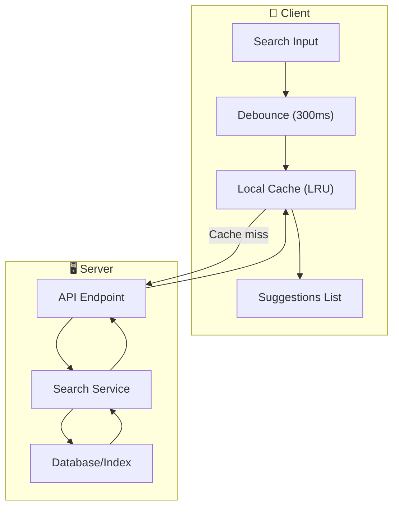
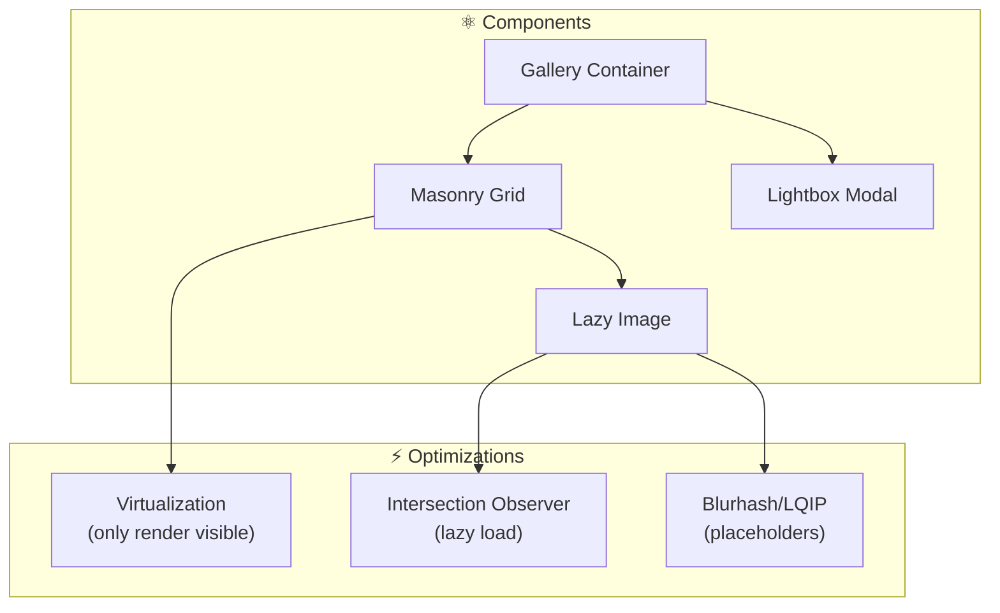
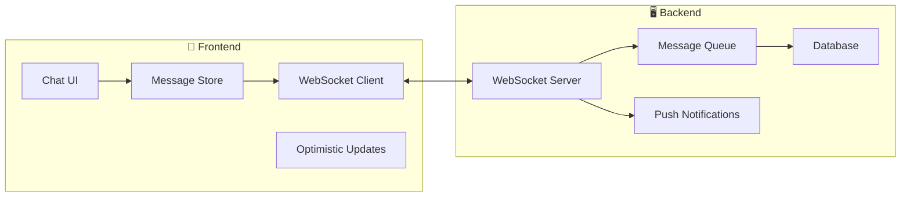
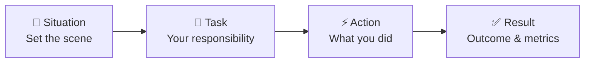
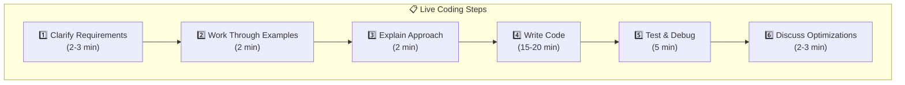
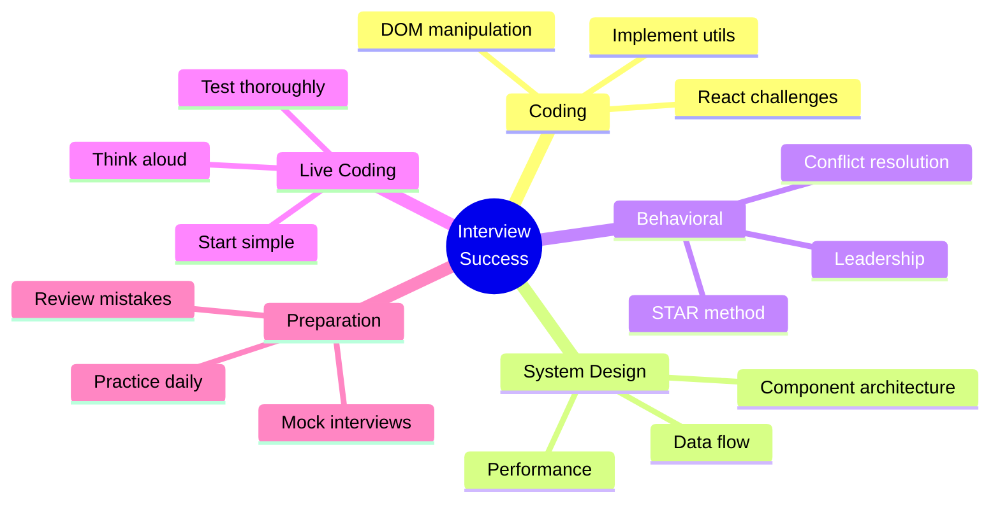

# 📚 Tài Liệu Phỏng Vấn Frontend 2025 - Phần 11

> **Chủ đề**: 🎯 Interview Practice - Thực Hành Phỏng Vấn

---

## 📋 Mục Lục

1. [Frontend Coding Challenges](#1-frontend-coding-challenges)
2. [DOM Manipulation Problems](#2-dom-manipulation-problems)
3. [Implement JS Methods](#3-implement-js-methods)
4. [React Challenges](#4-react-challenges)
5. [System Design Examples](#5-system-design-examples)
6. [Behavioral Questions (STAR)](#6-behavioral-questions-star)
7. [Live Coding Tips](#7-live-coding-tips)
8. [Take-home Project Tips](#8-take-home-project-tips)
9. [Common Mistakes to Avoid](#9-common-mistakes-to-avoid)
10. [Mock Interview Q&A](#10-mock-interview-qa)

---

## 1. Frontend Coding Challenges

### 1.1 Debounce Implementation

```javascript
// 📝 Problem: Implement debounce function
// Debounce delays function execution until after wait ms
// have elapsed since last call

function debounce(fn, wait) {
  let timeoutId = null;

  return function (...args) {
    // Clear previous timeout
    clearTimeout(timeoutId);

    // Set new timeout
    timeoutId = setTimeout(() => {
      fn.apply(this, args);
    }, wait);
  };
}

// With immediate option
function debounceAdvanced(fn, wait, immediate = false) {
  let timeoutId = null;

  return function (...args) {
    const callNow = immediate && !timeoutId;

    clearTimeout(timeoutId);

    timeoutId = setTimeout(() => {
      timeoutId = null;
      if (!immediate) {
        fn.apply(this, args);
      }
    }, wait);

    if (callNow) {
      fn.apply(this, args);
    }
  };
}

// Usage
const debouncedSearch = debounce((query) => {
  console.log("Searching:", query);
}, 300);
```

### 1.2 Throttle Implementation

```javascript
// 📝 Problem: Implement throttle function
// Throttle limits function to execute at most once per wait ms

function throttle(fn, wait) {
  let lastTime = 0;

  return function (...args) {
    const now = Date.now();

    if (now - lastTime >= wait) {
      lastTime = now;
      fn.apply(this, args);
    }
  };
}

// With trailing call option
function throttleAdvanced(fn, wait, options = {}) {
  const { leading = true, trailing = true } = options;
  let lastTime = 0;
  let timeoutId = null;

  return function (...args) {
    const now = Date.now();

    if (!lastTime && !leading) {
      lastTime = now;
    }

    const remaining = wait - (now - lastTime);

    if (remaining <= 0) {
      clearTimeout(timeoutId);
      timeoutId = null;
      lastTime = now;
      fn.apply(this, args);
    } else if (!timeoutId && trailing) {
      timeoutId = setTimeout(() => {
        lastTime = leading ? Date.now() : 0;
        timeoutId = null;
        fn.apply(this, args);
      }, remaining);
    }
  };
}
```

### 1.3 Deep Clone

```javascript
// 📝 Problem: Implement deep clone

function deepClone(obj, seen = new WeakMap()) {
  // Handle primitives
  if (obj === null || typeof obj !== "object") {
    return obj;
  }

  // Handle circular references
  if (seen.has(obj)) {
    return seen.get(obj);
  }

  // Handle Date
  if (obj instanceof Date) {
    return new Date(obj);
  }

  // Handle RegExp
  if (obj instanceof RegExp) {
    return new RegExp(obj);
  }

  // Handle Array
  if (Array.isArray(obj)) {
    const clone = [];
    seen.set(obj, clone);
    obj.forEach((item, i) => {
      clone[i] = deepClone(item, seen);
    });
    return clone;
  }

  // Handle Object
  const clone = Object.create(Object.getPrototypeOf(obj));
  seen.set(obj, clone);

  for (const key of Object.keys(obj)) {
    clone[key] = deepClone(obj[key], seen);
  }

  return clone;
}
```

### 1.4 Flatten Array

```javascript
// 📝 Problem: Flatten nested array

// Recursive
function flatten(arr, depth = Infinity) {
  return arr.reduce((acc, item) => {
    if (Array.isArray(item) && depth > 0) {
      acc.push(...flatten(item, depth - 1));
    } else {
      acc.push(item);
    }
    return acc;
  }, []);
}

// Iterative
function flattenIterative(arr) {
  const stack = [...arr];
  const result = [];

  while (stack.length) {
    const item = stack.pop();
    if (Array.isArray(item)) {
      stack.push(...item);
    } else {
      result.unshift(item);
    }
  }

  return result;
}

// Test
flatten([1, [2, [3, [4]]]]); // [1, 2, 3, 4]
flatten([1, [2, [3, [4]]]], 2); // [1, 2, 3, [4]]
```

### 1.5 Event Emitter

```javascript
// 📝 Problem: Implement Event Emitter

class EventEmitter {
  constructor() {
    this.events = new Map();
  }

  on(event, callback) {
    if (!this.events.has(event)) {
      this.events.set(event, []);
    }
    this.events.get(event).push(callback);

    // Return unsubscribe function
    return () => this.off(event, callback);
  }

  once(event, callback) {
    const wrapper = (...args) => {
      callback(...args);
      this.off(event, wrapper);
    };
    this.on(event, wrapper);
  }

  off(event, callback) {
    if (!this.events.has(event)) return;

    const callbacks = this.events.get(event);
    const index = callbacks.indexOf(callback);
    if (index !== -1) {
      callbacks.splice(index, 1);
    }
  }

  emit(event, ...args) {
    if (!this.events.has(event)) return;

    this.events.get(event).forEach((callback) => {
      callback(...args);
    });
  }
}

// Usage
const emitter = new EventEmitter();
const unsubscribe = emitter.on("click", (x, y) => console.log(x, y));
emitter.emit("click", 10, 20); // 10 20
unsubscribe();
```

---

## 2. DOM Manipulation Problems

### 2.1 Get Elements by Class Name

```javascript
// 📝 Problem: Implement getElementsByClassName without using it

function getElementsByClassName(root, className) {
  const result = [];

  function traverse(node) {
    if (node.nodeType !== 1) return; // Not an element

    if (node.classList.contains(className)) {
      result.push(node);
    }

    for (const child of node.children) {
      traverse(child);
    }
  }

  traverse(root);
  return result;
}
```

### 2.2 DOM to JSON

```javascript
// 📝 Problem: Convert DOM tree to JSON

function domToJson(element) {
  const obj = {
    tag: element.tagName.toLowerCase(),
  };

  // Attributes
  if (element.attributes.length) {
    obj.attributes = {};
    for (const attr of element.attributes) {
      obj.attributes[attr.name] = attr.value;
    }
  }

  // Children
  const children = [];
  for (const child of element.childNodes) {
    if (child.nodeType === Node.TEXT_NODE) {
      const text = child.textContent.trim();
      if (text) children.push(text);
    } else if (child.nodeType === Node.ELEMENT_NODE) {
      children.push(domToJson(child));
    }
  }

  if (children.length) {
    obj.children = children;
  }

  return obj;
}

// Example output:
// { tag: 'div', attributes: { class: 'container' }, children: [...] }
```

### 2.3 Create DOMContentLoaded

```javascript
// 📝 Problem: Implement function that runs after DOM ready

function domReady(callback) {
  if (document.readyState !== "loading") {
    // DOM already loaded
    callback();
  } else {
    document.addEventListener("DOMContentLoaded", callback);
  }
}

// Usage
domReady(() => {
  console.log("DOM is ready!");
});
```

### 2.4 Infinite Scroll

```javascript
// 📝 Problem: Implement infinite scroll

function createInfiniteScroll(container, loadMore) {
  const observer = new IntersectionObserver(
    (entries) => {
      if (entries[0].isIntersecting) {
        loadMore();
      }
    },
    { threshold: 0.1 }
  );

  // Create sentinel element
  const sentinel = document.createElement("div");
  sentinel.id = "scroll-sentinel";
  container.appendChild(sentinel);

  observer.observe(sentinel);

  return () => {
    observer.disconnect();
    sentinel.remove();
  };
}

// Usage
const cleanup = createInfiniteScroll(document.getElementById("list"), () =>
  fetchMoreItems()
);
```

---

## 3. Implement JS Methods

### 3.1 Array.prototype.map

```javascript
Array.prototype.myMap = function (callback, thisArg) {
  const result = [];
  for (let i = 0; i < this.length; i++) {
    if (i in this) {
      result[i] = callback.call(thisArg, this[i], i, this);
    }
  }
  return result;
};

// Test
[1, 2, 3].myMap((x) => x * 2); // [2, 4, 6]
```

### 3.2 Array.prototype.filter

```javascript
Array.prototype.myFilter = function (callback, thisArg) {
  const result = [];
  for (let i = 0; i < this.length; i++) {
    if (i in this && callback.call(thisArg, this[i], i, this)) {
      result.push(this[i]);
    }
  }
  return result;
};

// Test
[1, 2, 3, 4, 5].myFilter((x) => x % 2 === 0); // [2, 4]
```

### 3.3 Array.prototype.reduce

```javascript
Array.prototype.myReduce = function (callback, initialValue) {
  let accumulator = initialValue;
  let startIndex = 0;

  if (arguments.length < 2) {
    if (this.length === 0) {
      throw new TypeError("Reduce of empty array with no initial value");
    }
    accumulator = this[0];
    startIndex = 1;
  }

  for (let i = startIndex; i < this.length; i++) {
    if (i in this) {
      accumulator = callback(accumulator, this[i], i, this);
    }
  }

  return accumulator;
};

// Test
[1, 2, 3, 4].myReduce((acc, x) => acc + x); // 10
```

### 3.4 Function.prototype.bind

```javascript
Function.prototype.myBind = function (thisArg, ...boundArgs) {
  const fn = this;

  return function (...args) {
    return fn.apply(thisArg, [...boundArgs, ...args]);
  };
};

// Test
const greet = function (greeting, punctuation) {
  return `${greeting}, ${this.name}${punctuation}`;
};
const person = { name: "John" };
const boundGreet = greet.myBind(person, "Hello");
boundGreet("!"); // "Hello, John!"
```

### 3.5 Promise.all

```javascript
Promise.myAll = function (promises) {
  return new Promise((resolve, reject) => {
    const results = [];
    let completed = 0;

    if (promises.length === 0) {
      resolve([]);
      return;
    }

    promises.forEach((promise, index) => {
      Promise.resolve(promise)
        .then((value) => {
          results[index] = value;
          completed++;

          if (completed === promises.length) {
            resolve(results);
          }
        })
        .catch(reject);
    });
  });
};

// Test
Promise.myAll([
  Promise.resolve(1),
  Promise.resolve(2),
  Promise.resolve(3),
]).then(console.log); // [1, 2, 3]
```

---

## 4. React Challenges

### 4.1 useDebounce Hook

```javascript
function useDebounce(value, delay) {
  const [debouncedValue, setDebouncedValue] = useState(value);

  useEffect(() => {
    const handler = setTimeout(() => {
      setDebouncedValue(value);
    }, delay);

    return () => clearTimeout(handler);
  }, [value, delay]);

  return debouncedValue;
}

// Usage
function SearchInput() {
  const [query, setQuery] = useState("");
  const debouncedQuery = useDebounce(query, 300);

  useEffect(() => {
    if (debouncedQuery) {
      search(debouncedQuery);
    }
  }, [debouncedQuery]);

  return <input value={query} onChange={(e) => setQuery(e.target.value)} />;
}
```

### 4.2 usePrevious Hook

```javascript
function usePrevious(value) {
  const ref = useRef();

  useEffect(() => {
    ref.current = value;
  }, [value]);

  return ref.current;
}

// Usage
function Counter() {
  const [count, setCount] = useState(0);
  const prevCount = usePrevious(count);

  return (
    <div>
      Current: {count}, Previous: {prevCount}
      <button onClick={() => setCount((c) => c + 1)}>+</button>
    </div>
  );
}
```

### 4.3 useLocalStorage Hook

```javascript
function useLocalStorage(key, initialValue) {
  const [storedValue, setStoredValue] = useState(() => {
    try {
      const item = localStorage.getItem(key);
      return item ? JSON.parse(item) : initialValue;
    } catch (error) {
      return initialValue;
    }
  });

  const setValue = useCallback(
    (value) => {
      try {
        const valueToStore =
          value instanceof Function ? value(storedValue) : value;
        setStoredValue(valueToStore);
        localStorage.setItem(key, JSON.stringify(valueToStore));
      } catch (error) {
        console.error(error);
      }
    },
    [key, storedValue]
  );

  return [storedValue, setValue];
}

// Usage
const [theme, setTheme] = useLocalStorage("theme", "light");
```

### 4.4 Implement useEffect

```javascript
// 📝 Simplified version to understand how it works
let hooks = [];
let currentHook = 0;

function myUseEffect(callback, deps) {
  const hook = hooks[currentHook];

  const hasNoDeps = !deps;
  const hasChangedDeps = hook
    ? !deps.every((dep, i) => dep === hook.deps[i])
    : true;

  if (hasNoDeps || hasChangedDeps) {
    // Run cleanup from previous effect
    if (hook?.cleanup) {
      hook.cleanup();
    }

    // Run effect and store cleanup
    const cleanup = callback();
    hooks[currentHook] = { deps, cleanup };
  }

  currentHook++;
}
```

---

## 5. System Design Examples

### 5.1 Design: Autocomplete/Typeahead



**Key Points:**

- Debounce input (300ms)
- Cache recent queries (LRU)
- Highlight matched text
- Keyboard navigation
- Cancel pending requests
- Rate limiting

### 5.2 Design: Image Gallery

```javascript
/*
📋 Requirements:
- Lazy load images
- Infinite scroll
- Grid layout (responsive)
- Lightbox view
- Thumbnail caching

🏗️ Architecture:
*/
```



### 5.3 Design: Real-time Chat



**Key Considerations:**

- Message ordering (timestamps)
- Delivery status (sent, delivered, read)
- Offline message queue
- Typing indicators
- Reconnection logic

---

## 6. Behavioral Questions (STAR)

### 6.1 STAR Method



### 6.2 Common Questions & Sample Answers

<details>
<summary><strong>Q: Tell me about a challenging project you worked on.</strong></summary>

**S:** At my previous company, our e-commerce site had a 6-second load time, causing 40% bounce rate.

**T:** I was tasked to lead the performance optimization effort and reduce load time to under 2 seconds.

**A:**

1. Analyzed with Lighthouse, identified issues
2. Implemented code splitting, reduced bundle from 2MB to 400KB
3. Added lazy loading for images (saved 60% initial load)
4. Set up CDN and caching strategy
5. Optimized database queries (server-side)

**R:**

- LCP improved from 6s to 1.8s
- Bounce rate decreased 35%
- Conversion increased 28%
- Documented process for team

</details>

<details>
<summary><strong>Q: Tell me about a time you disagreed with a teammate.</strong></summary>

**S:** A senior developer wanted to use Redux for a small dashboard app with 5 components.

**T:** I needed to express my concern without damaging the relationship.

**A:**

1. Scheduled 1:1 meeting (not in public)
2. Asked questions to understand their reasoning
3. Presented data: bundle size, learning curve, maintenance
4. Proposed alternatives: Context API, Zustand
5. Offered to create prototypes of both approaches

**R:**

- We went with Context API + smaller library
- Project delivered on time
- Senior dev appreciated the approach
- We documented decision for future

</details>

<details>
<summary><strong>Q: How do you stay up to date with technology?</strong></summary>

**Answer:**

- **Daily**: Twitter/X for quick updates
- **Weekly**: Newsletter (JavaScript Weekly, React Status)
- **Monthly**: Side projects to try new tech
- **Quarterly**: Attend meetups/conferences
- **Continuous**: Read official docs, follow RFCs

</details>

---

## 7. Live Coding Tips

### 7.1 Framework



### 7.2 Do's and Don'ts

| ✅ Do                      | ❌ Don't                   |
| -------------------------- | -------------------------- |
| Think out loud             | Code in silence            |
| Ask clarifying questions   | Assume requirements        |
| Start with brute force     | Jump to optimal solution   |
| Write clean, readable code | Over-optimize early        |
| Test with examples         | Skip edge cases            |
| Admit when stuck           | Pretend to know everything |

### 7.3 Communication Templates

```javascript
// 🎤 When starting:
"Let me make sure I understand the problem correctly...";
"What are the constraints? Input size? Time limit?";

// 🎤 When thinking:
"I'm considering two approaches...";
"Let me think about edge cases...";

// 🎤 When stuck:
"I'm stuck on [X]. Can I get a hint?";
"Let me take a step back and reconsider...";

// 🎤 When done:
"Let me trace through with an example...";
"Time complexity is O(n), space is O(1)...";
"We could optimize by...";
```

---

## 8. Take-home Project Tips

### 8.1 Checklist

```
📋 Before Starting:
□ Read requirements TWICE
□ Note time limit
□ List ALL requirements
□ Ask questions if unclear

📋 During Development:
□ Start with README
□ Set up clean project structure
□ Commit frequently
□ Write tests as you go
□ Don't over-engineer

📋 Before Submission:
□ All requirements met?
□ README is complete
□ Code is clean, commented
□ Tests pass
□ Works after fresh clone
□ No console errors
```

### 8.2 README Template

````markdown
# Project Name

## 🚀 Quick Start

```bash
npm install
npm run dev
```
````

## 📋 Features

- [x] Feature 1
- [x] Feature 2

## 🏗️ Architecture Decisions

- Used [X] because...
- Chose [Y] over [Z] because...

## 🧪 Testing

```bash
npm run test
```

## ⏱️ Time Spent

- Planning: 30 min
- Coding: 3 hours
- Testing: 30 min

## 🔮 Future Improvements

- Would add X if more time
- Could optimize Y

````

---

## 9. Common Mistakes to Avoid

### 9.1 Technical Mistakes

| ❌ Mistake | ✅ Better Approach |
|-----------|-------------------|
| Not asking clarifying questions | Ask before coding |
| Jumping to code immediately | Plan & discuss first |
| Writing untested code | Test early, test often |
| Over-engineering | Start simple, iterate |
| Ignoring edge cases | List cases before coding |
| Not knowing complexity | Always state Big O |

### 9.2 Communication Mistakes

| ❌ Mistake | ✅ Better Approach |
|-----------|-------------------|
| Silent coding | Think out loud |
| Getting defensive | Accept feedback graciously |
| Saying "I don't know" and stopping | "I don't know, but I'd approach it by..." |
| Badmouthing previous employers | Focus on learnings |
| Not asking questions at end | Prepare 2-3 questions |

---

## 10. Mock Interview Q&A

### 10.1 Technical Quick Fire

<details>
<summary><strong>1. What is the difference between let, const, and var?</strong></summary>

- `var`: Function scoped, hoisted, can redeclare
- `let`: Block scoped, hoisted but in TDZ, can't redeclare
- `const`: Block scoped, can't reassign (but objects mutable)

</details>

<details>
<summary><strong>2. Explain closures with an example.</strong></summary>

Closure = function that remembers its outer scope even when executed elsewhere.

```javascript
function counter() {
  let count = 0;
  return () => ++count;
}
const inc = counter();
inc(); // 1
inc(); // 2
````

</details>

<details>
<summary><strong>3. What happens when you type a URL?</strong></summary>

1. DNS resolution → IP address
2. TCP handshake → Connection
3. TLS handshake → Secure
4. HTTP request → Server
5. Response → HTML
6. Parse HTML → DOM
7. Parse CSS → CSSOM
8. Render tree → Layout → Paint

</details>

<details>
<summary><strong>4. Explain useEffect vs useLayoutEffect.</strong></summary>

- `useEffect`: Runs after paint (async, non-blocking)
- `useLayoutEffect`: Runs before paint (sync, blocking)

Use `useLayoutEffect` for DOM measurements to avoid flicker.

</details>

<details>
<summary><strong>5. What is CORS and how to handle it?</strong></summary>

Cross-Origin Resource Sharing - browser security.

Server must send headers:

- `Access-Control-Allow-Origin`
- `Access-Control-Allow-Methods`
- `Access-Control-Allow-Headers`

</details>

### 10.2 Output Questions

```javascript
// ❓ What's the output?

// Q1
console.log(1);
setTimeout(() => console.log(2), 0);
Promise.resolve().then(() => console.log(3));
console.log(4);
// Answer: 1, 4, 3, 2

// Q2
for (var i = 0; i < 3; i++) {
  setTimeout(() => console.log(i), 0);
}
// Answer: 3, 3, 3

// Q3
const obj = { a: 1 };
const copy = obj;
copy.a = 2;
console.log(obj.a);
// Answer: 2 (same reference)

// Q4
console.log(typeof null);
// Answer: "object" (JS bug)

// Q5
console.log(0.1 + 0.2 === 0.3);
// Answer: false (floating point)
```

---

## 📊 Tổng Kết



---

> **Tip cuối**: Practice makes perfect. Mock interview ít nhất 5-10 lần trước khi phỏng vấn thật!
>
> **Chúc bạn phỏng vấn thành công! 🎉**
>
> _Tài liệu được tạo: 23/12/2025_
