# 📚 Tài Liệu Phỏng Vấn Frontend 2025 - Phần 13

> **Chủ đề**: 📖 Frontend Handbook 2019 - Learning Path & Tools Complete Guide
>
> _Dựa trên Frontend Masters Handbook 2019 by Cody Lindley_

---

## 📋 Mục Lục

1. [Frontend Developer Roadmap](#1-frontend-developer-roadmap)
2. [Learn Internet & Web](#2-learn-internet--web)
3. [Learn Web Browsers](#3-learn-web-browsers)
4. [Learn DNS & HTTP](#4-learn-dns--http)
5. [Learn HTML & CSS Deep Dive](#5-learn-html--css-deep-dive)
6. [Learn JavaScript Deep Dive](#6-learn-javascript-deep-dive)
7. [Frontend Dev Tools Complete](#7-frontend-dev-tools-complete)
8. [Application Frameworks](#8-application-frameworks)
9. [Testing Tools Complete](#9-testing-tools-complete)
10. [Resources & Communities](#10-resources--communities)

---

## 1. Frontend Developer Roadmap

### 1.1 How to Become a Frontend Developer

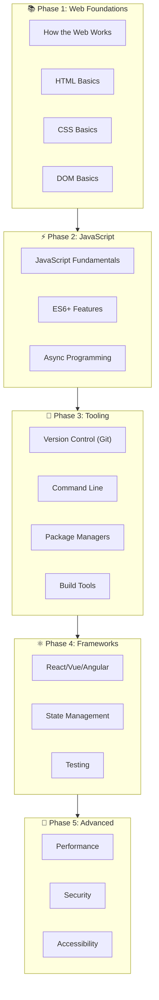

### 1.2 Learning Order (Theo 2019 Handbook)

| Order | Topic        | Focus                          |
| ----- | ------------ | ------------------------------ |
| 1     | Web Platform | How Internet/Web works         |
| 2     | HTML         | Structure & semantics          |
| 3     | CSS          | Styling & layout               |
| 4     | JavaScript   | Core language                  |
| 5     | DOM          | Document manipulation          |
| 6     | HTTP/URLs    | Network basics                 |
| 7     | Browser APIs | Web APIs                       |
| 8     | Tooling      | Git, NPM, CLI                  |
| 9     | Framework    | React/Vue/Angular              |
| 10    | Advanced     | Testing, Performance, Security |

### 1.3 Lời Khuyên Quan Trọng

> 💡 **Learn the fundamentals, not abstractions first!**

```
❌ Don't learn jQuery first    → ✅ Learn DOM first
❌ Don't learn SASS first      → ✅ Learn CSS first
❌ Don't learn JSX first       → ✅ Learn HTML first
❌ Don't learn TypeScript first → ✅ Learn JavaScript first
❌ Don't learn Handlebars first → ✅ Learn ES6 templates first
❌ Don't just use Bootstrap    → ✅ Learn UI patterns first
```

---

## 2. Learn Internet & Web

### 2.1 How the Internet Works

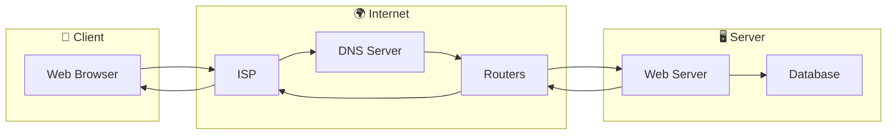

### 2.2 Key Concepts

| Concept        | Mô Tả                                           |
| -------------- | ----------------------------------------------- |
| **Internet**   | Network of networks kết nối billions of devices |
| **Web (WWW)**  | Information system chạy trên Internet           |
| **Protocol**   | Quy tắc giao tiếp (HTTP, FTP, SMTP)             |
| **IP Address** | Địa chỉ số của mỗi device                       |
| **Domain**     | Tên dễ nhớ thay cho IP                          |
| **DNS**        | "Phone book" của Internet                       |
| **Server**     | Máy tính lưu trữ và serve content               |
| **Client**     | Device request content                          |

### 2.3 Resources để Học

- [How the Internet Works (video)](https://www.youtube.com/watch?v=7_LPdttKXPc)
- [How the Web Works - MDN](https://developer.mozilla.org/en-US/docs/Learn/Getting_started_with_the_web/How_the_Web_works)
- [Internet Fundamentals](https://internetfundamentals.com/)

---

## 3. Learn Web Browsers

### 3.1 Browser Market Share

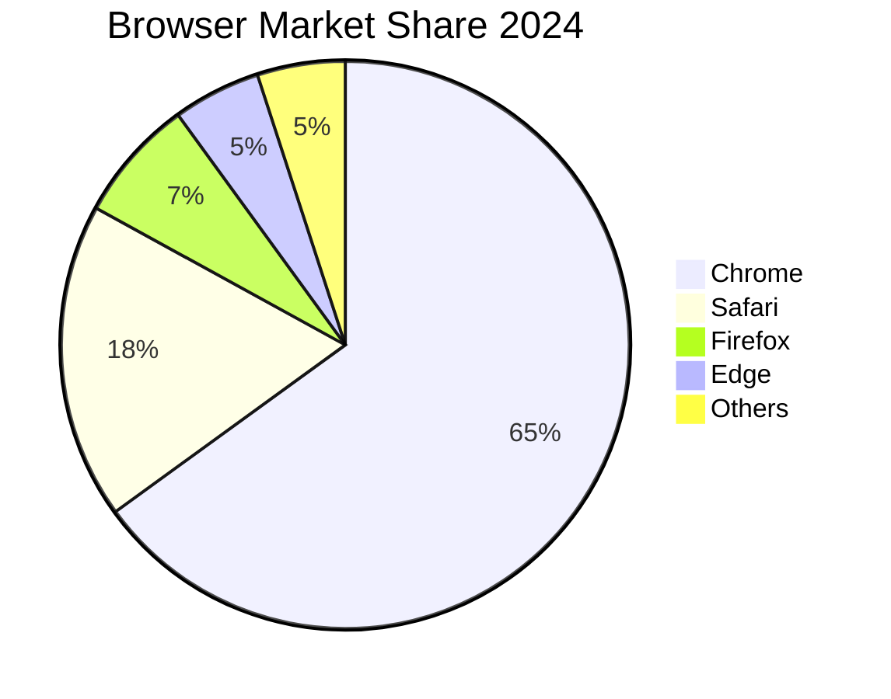

### 3.2 Browser Engines

| Browser     | Rendering Engine | JS Engine      |
| ----------- | ---------------- | -------------- |
| **Chrome**  | Blink            | V8             |
| **Firefox** | Gecko            | SpiderMonkey   |
| **Safari**  | WebKit           | JavaScriptCore |
| **Edge**    | Blink            | V8             |

### 3.3 How Browsers Work

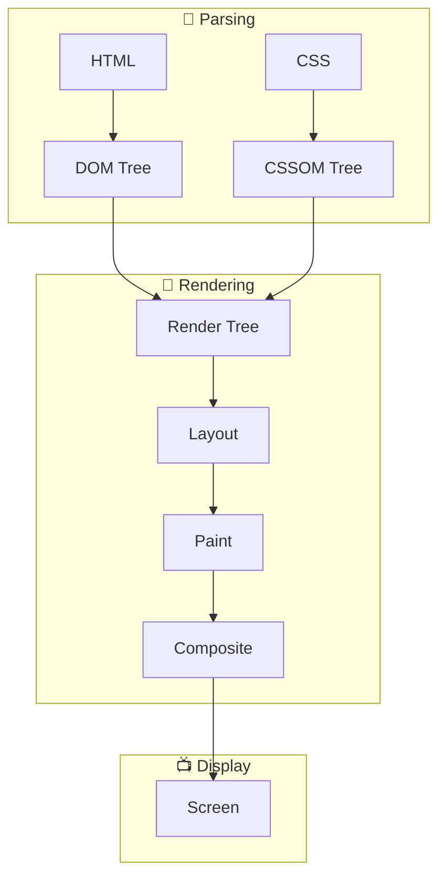

### 3.4 Browser DevTools

| Browser | DevTools         | Shortcut        |
| ------- | ---------------- | --------------- |
| Chrome  | Chrome DevTools  | F12 / Cmd+Opt+I |
| Firefox | Firefox DevTools | F12 / Cmd+Opt+I |
| Safari  | Web Inspector    | Cmd+Opt+I       |
| Edge    | Edge DevTools    | F12             |

### 3.5 Headless Browsers

- **Headless Chromium** - Phổ biến nhất cho testing
- **Puppeteer** - High-level API for Chromium
- **Playwright** - Cross-browser automation

---

## 4. Learn DNS & HTTP

### 4.1 DNS (Domain Name System)

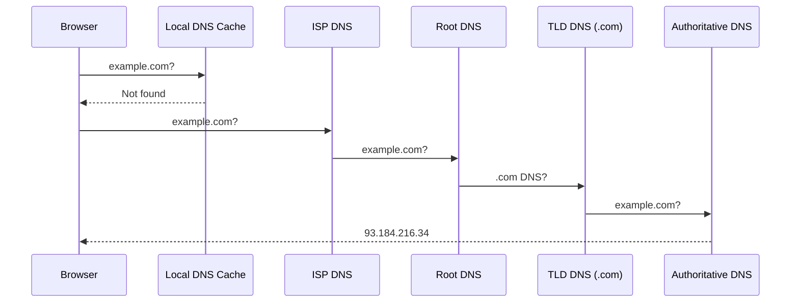

### 4.2 HTTP Methods

| Method  | Purpose        | Idempotent | Body |
| ------- | -------------- | ---------- | ---- |
| GET     | Read           | ✅         | ❌   |
| POST    | Create         | ❌         | ✅   |
| PUT     | Replace        | ✅         | ✅   |
| PATCH   | Update         | ❌         | ✅   |
| DELETE  | Delete         | ✅         | ❌   |
| HEAD    | Headers only   | ✅         | ❌   |
| OPTIONS | CORS preflight | ✅         | ❌   |

### 4.3 HTTP Status Codes

| Range | Category      | Examples                                         |
| ----- | ------------- | ------------------------------------------------ |
| 1xx   | Informational | 100 Continue                                     |
| 2xx   | Success       | 200 OK, 201 Created, 204 No Content              |
| 3xx   | Redirection   | 301 Moved, 304 Not Modified                      |
| 4xx   | Client Error  | 400 Bad Request, 401 Unauthorized, 404 Not Found |
| 5xx   | Server Error  | 500 Internal, 502 Bad Gateway, 503 Unavailable   |

### 4.4 CORS (Cross-Origin Resource Sharing)

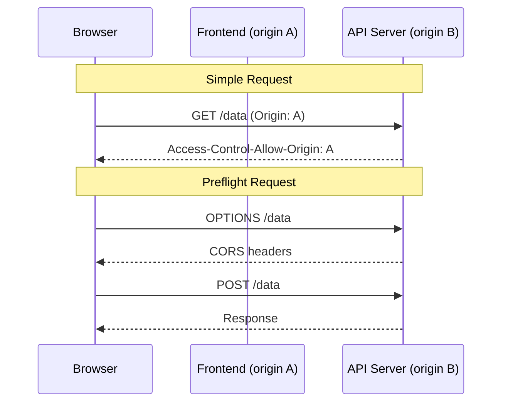

### 4.5 WebSocket

| Feature         | HTTP             | WebSocket     |
| --------------- | ---------------- | ------------- |
| Connection      | Request/Response | Persistent    |
| Direction       | Client → Server  | Bidirectional |
| Header overhead | Every request    | Once          |
| Use case        | REST API         | Real-time     |

---

## 5. Learn HTML & CSS Deep Dive

### 5.1 HTML Document Structure

```html
<!DOCTYPE html>
<html lang="vi">
  <head>
    <meta charset="UTF-8" />
    <meta name="viewport" content="width=device-width, initial-scale=1.0" />
    <meta name="description" content="Description" />
    <title>Page Title</title>
    <link rel="stylesheet" href="styles.css" />
  </head>
  <body>
    <header>
      <nav>...</nav>
    </header>
    <main>
      <article>
        <section>...</section>
      </article>
      <aside>...</aside>
    </main>
    <footer>...</footer>
    <script src="app.js"></script>
  </body>
</html>
```

### 5.2 Semantic HTML Elements

| Element     | Purpose                   |
| ----------- | ------------------------- |
| `<header>`  | Page/section header       |
| `<nav>`     | Navigation links          |
| `<main>`    | Main content (1 per page) |
| `<article>` | Self-contained content    |
| `<section>` | Thematic grouping         |
| `<aside>`   | Related content, sidebar  |
| `<footer>`  | Page/section footer       |
| `<figure>`  | Image with caption        |
| `<time>`    | Date/time                 |
| `<mark>`    | Highlighted text          |

### 5.3 CSS Architecture

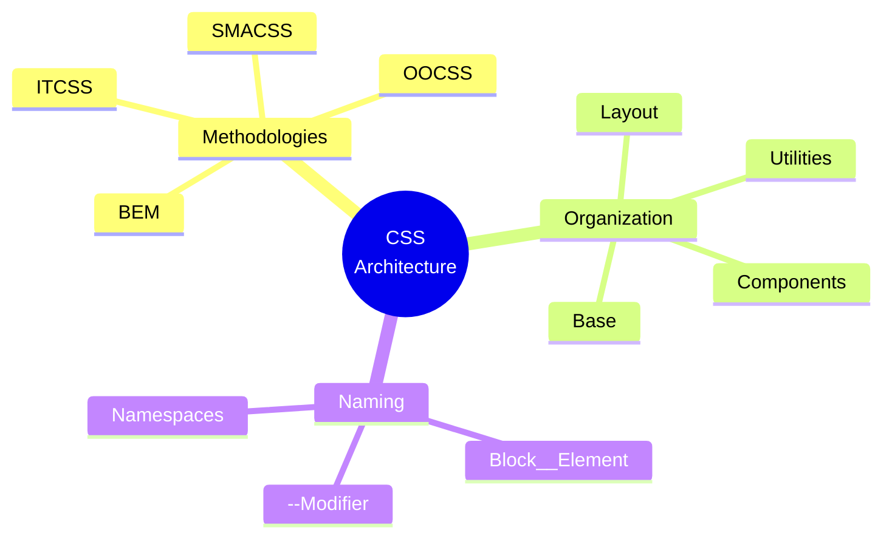

### 5.4 BEM Naming Convention

```css
/* Block */
.card {
}

/* Element (part of block) */
.card__title {
}
.card__image {
}
.card__content {
}

/* Modifier (variation) */
.card--featured {
}
.card--large {
}
.card__title--highlighted {
}
```

### 5.5 CSS Layout Systems

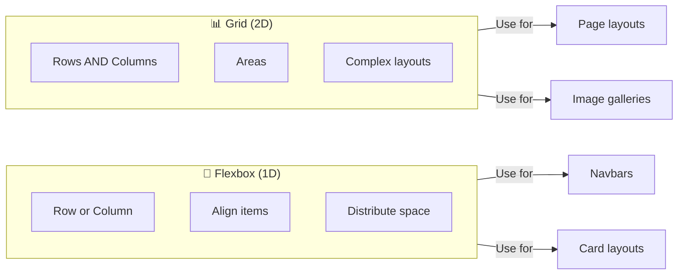

---

## 6. Learn JavaScript Deep Dive

### 6.1 Learning Path

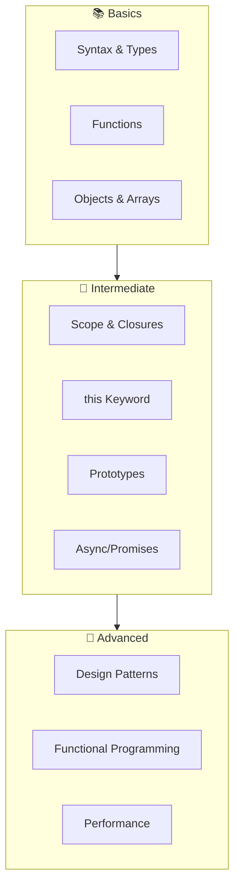

### 6.2 ES6+ Features Checklist

| Feature                | Syntax                    |
| ---------------------- | ------------------------- |
| **let/const**          | `let x = 1; const y = 2;` |
| **Arrow Functions**    | `const fn = (x) => x * 2` |
| **Template Literals**  | `` `Hello ${name}` ``     |
| **Destructuring**      | `const { a, b } = obj`    |
| **Spread/Rest**        | `[...arr]`, `...args`     |
| **Default Params**     | `function(x = 10)`        |
| **Classes**            | `class Foo extends Bar`   |
| **Modules**            | `import/export`           |
| **Promises**           | `new Promise()`           |
| **async/await**        | `async function()`        |
| **Optional Chaining**  | `obj?.prop?.value`        |
| **Nullish Coalescing** | `value ?? default`        |

### 6.3 Functional Programming in JS

```javascript
// Pure Functions
const add = (a, b) => a + b;

// Immutability
const newArr = [...arr, newItem];
const newObj = { ...obj, key: value };

// Higher-Order Functions
const double = arr.map((x) => x * 2);
const evens = arr.filter((x) => x % 2 === 0);
const sum = arr.reduce((acc, x) => acc + x, 0);

// Composition
const compose = (f, g) => (x) => f(g(x));
const addThenDouble = compose(double, add);

// Currying
const multiply = (a) => (b) => a * b;
const triple = multiply(3);
```

---

## 7. Frontend Dev Tools Complete

### 7.1 Code Editors

| Editor           | Type             | Best For           |
| ---------------- | ---------------- | ------------------ |
| **VS Code**      | Free, Fast       | Most developers ⭐ |
| **WebStorm**     | Paid, Full IDE   | Large projects     |
| **Sublime Text** | Paid, Super fast | Simple editing     |
| **Vim/Neovim**   | Free, Terminal   | Power users        |

### 7.2 Build Tools Comparison

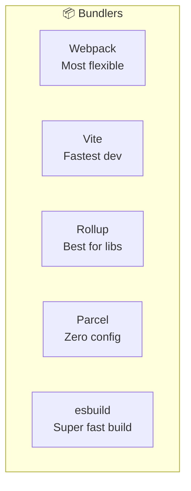

### 7.3 Package Managers

| Manager  | Command        | Lock File         |
| -------- | -------------- | ----------------- |
| **npm**  | `npm install`  | package-lock.json |
| **yarn** | `yarn`         | yarn.lock         |
| **pnpm** | `pnpm install` | pnpm-lock.yaml    |

### 7.4 CSS Tools

| Category          | Tools                      |
| ----------------- | -------------------------- |
| **Preprocessors** | SASS, Less, Stylus         |
| **PostCSS**       | Autoprefixer, cssnano      |
| **CSS-in-JS**     | styled-components, Emotion |
| **Frameworks**    | Tailwind, Bootstrap        |
| **Reset**         | Normalize.css, Reset CSS   |

### 7.5 Linting & Formatting

```javascript
// .eslintrc.js
module.exports = {
  extends: ['eslint:recommended', 'prettier'],
  rules: {
    'no-console': 'warn',
    'no-unused-vars': 'error',
  },
};

// .prettierrc
{
  "semi": true,
  "singleQuote": true,
  "tabWidth": 2,
  "trailingComma": "es5"
}
```

### 7.6 Version Control (Git)

```bash
# Essential Commands
git init                    # Initialize repo
git clone <url>             # Clone repo
git add .                   # Stage changes
git commit -m "message"     # Commit
git push origin main        # Push
git pull                    # Pull updates
git branch feature          # Create branch
git checkout feature        # Switch branch
git merge feature           # Merge branch
git stash                   # Stash changes
```

---

## 8. Application Frameworks

### 8.1 Framework Comparison 2024

| Framework   | Learning Curve | Performance | Ecosystem | Jobs   |
| ----------- | -------------- | ----------- | --------- | ------ |
| **React**   | Medium         | Good        | Excellent | ⭐⭐⭐ |
| **Vue**     | Easy           | Good        | Good      | ⭐⭐   |
| **Angular** | Hard           | Good        | Good      | ⭐⭐   |
| **Svelte**  | Easy           | Excellent   | Growing   | ⭐     |

### 8.2 Meta-Frameworks

| Framework     | Base   | Use Case        |
| ------------- | ------ | --------------- |
| **Next.js**   | React  | Full-stack, SSR |
| **Nuxt**      | Vue    | Full-stack, SSR |
| **SvelteKit** | Svelte | Full-stack      |
| **Astro**     | Any    | Content-focused |
| **Remix**     | React  | Web standards   |

### 8.3 State Management

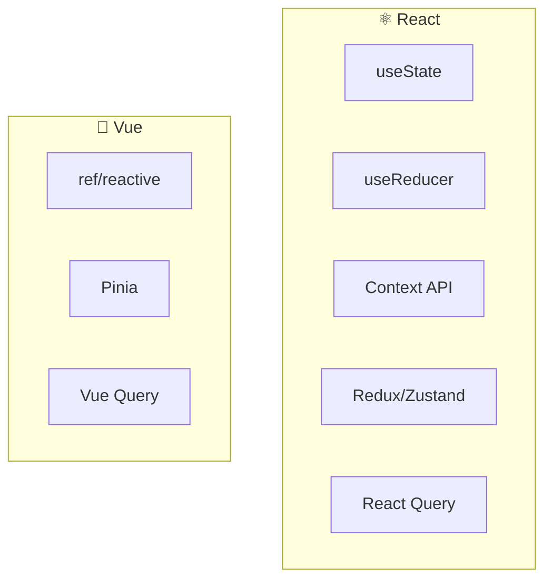

### 8.4 Native App Development

| Platform            | Technology     | Approach       |
| ------------------- | -------------- | -------------- |
| **Mobile (Hybrid)** | Ionic, Cordova | WebView        |
| **Mobile (Native)** | React Native   | JS to Native   |
| **Desktop**         | Electron       | Web in Native  |
| **Desktop (Light)** | Tauri          | Rust + WebView |

---

## 9. Testing Tools Complete

### 9.1 Testing Categories

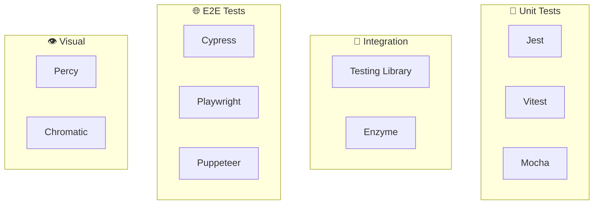

### 9.2 Testing Libraries Recommendations

| Type          | 2024 Recommendation       |
| ------------- | ------------------------- |
| **Unit**      | Vitest (faster than Jest) |
| **Component** | Testing Library           |
| **E2E**       | Playwright or Cypress     |
| **API Mock**  | MSW (Mock Service Worker) |
| **Visual**    | Chromatic                 |

### 9.3 Test File Structure

```
src/
├── components/
│   ├── Button/
│   │   ├── Button.tsx
│   │   ├── Button.test.tsx     # Unit tests
│   │   └── Button.stories.tsx  # Storybook
tests/
├── integration/
│   └── checkout.test.ts
├── e2e/
│   └── user-flow.spec.ts
```

---

## 10. Resources & Communities

### 10.1 Learning Platforms

| Platform             | Type          | Cost              |
| -------------------- | ------------- | ----------------- |
| **Frontend Masters** | Video courses | $39/month         |
| **Udemy**            | Video courses | Pay per course    |
| **freeCodeCamp**     | Interactive   | Free              |
| **Codecademy**       | Interactive   | Free to $20/month |
| **MDN Web Docs**     | Documentation | Free              |

### 10.2 Newsletters

| Newsletter                       | Focus            |
| -------------------------------- | ---------------- |
| **JavaScript Weekly**            | JS news          |
| **CSS-Tricks**                   | CSS/Frontend     |
| **React Status**                 | React            |
| **Frontend Focus**               | General frontend |
| **Web Development Reading List** | Curated articles |

### 10.3 Podcasts

| Podcast                 | Focus           |
| ----------------------- | --------------- |
| **Syntax**              | Web development |
| **ShopTalk Show**       | Frontend        |
| **JS Party**            | JavaScript      |
| **The Changelog**       | Open source     |
| **Frontend Happy Hour** | Frontend        |

### 10.4 Communities

| Community          | Platform          |
| ------------------ | ----------------- |
| **r/webdev**       | Reddit            |
| **r/reactjs**      | Reddit            |
| **Dev.to**         | Blogging platform |
| **Hashnode**       | Blogging platform |
| **Discord**        | Various servers   |
| **Stack Overflow** | Q&A               |

### 10.5 Documentation

| Resource         | Best For                |
| ---------------- | ----------------------- |
| **MDN Web Docs** | HTML, CSS, JS, Web APIs |
| **DevDocs**      | All-in-one docs         |
| **Can I Use**    | Browser support         |
| **web.dev**      | Best practices          |

---

## 📊 Final Summary

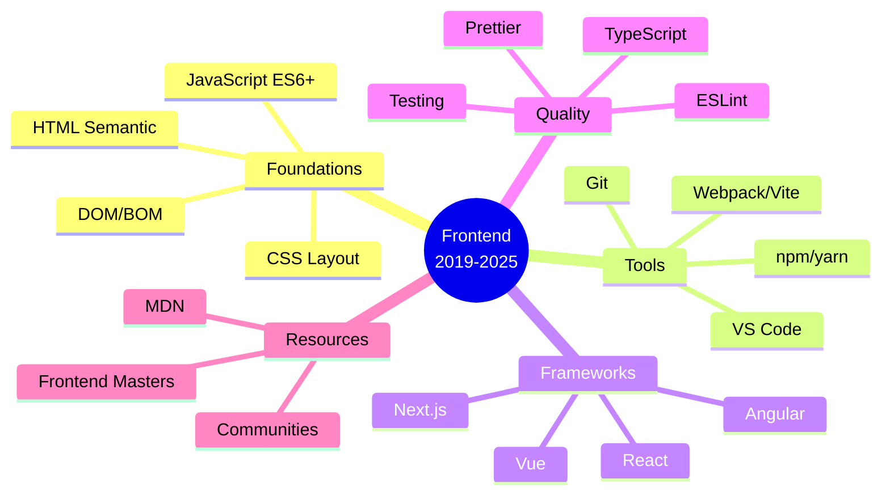

---

> **Key Takeaway từ Handbook 2019:**
>
> - Học fundamentals trước abstractions
> - Practice > Theory
> - Cập nhật liên tục vì web thay đổi nhanh
>
> **Chúc bạn phỏng vấn thành công! 🎉**
>
> _Tài liệu được tạo: 23/12/2025_
