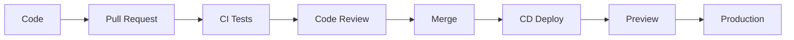
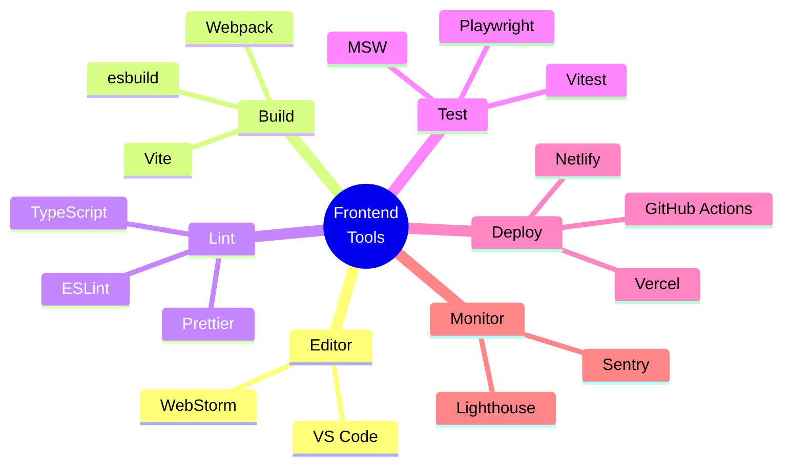

# 📚 Tài Liệu Phỏng Vấn Frontend 2025 - Phần 14

> **Chủ đề**: 🧰 Frontend Tools Catalog - Danh Sách Đầy Đủ Các Công Cụ

---

## 📋 Mục Lục

1. [Documentation Tools](#1-documentation-tools)
2. [Code Editors](#2-code-editors)
3. [HTML Tools](#3-html-tools)
4. [CSS Tools](#4-css-tools)
5. [JavaScript Tools](#5-javascript-tools)
6. [DOM Tools](#6-dom-tools)
7. [Graphics & Animation](#7-graphics--animation)
8. [Data Visualization](#8-data-visualization)
9. [Performance Tools](#9-performance-tools)
10. [Security Tools](#10-security-tools)
11. [Accessibility Tools](#11-accessibility-tools)
12. [Hosting & Deployment](#12-hosting--deployment)

---

## 1. Documentation Tools

### 1.1 API/Doc Browsing

| Tool         | Platform      | Cost |
| ------------ | ------------- | ---- |
| **DevDocs**  | Web           | Free |
| **Dash**     | macOS/iOS     | $30  |
| **Zeal**     | Windows/Linux | Free |
| **Velocity** | Windows       | $20  |

### 1.2 Cheatsheet Resources

- [devhints.io](https://devhints.io) - Collection of cheatsheets
- [OverAPI](http://overapi.com) - All cheatsheets
- [Cheatography](https://cheatography.com) - User-created cheatsheets

---

## 2. Code Editors

### 2.1 Desktop Editors

| Editor           | Cost   | Best For        |
| ---------------- | ------ | --------------- |
| **VS Code** ⭐   | Free   | Most developers |
| **WebStorm**     | $59/yr | Enterprise      |
| **Sublime Text** | $99    | Speed           |
| **Atom**         | Free   | Customization   |
| **Vim/Neovim**   | Free   | Terminal        |

### 2.2 Online Editors

| Editor          | Best For           | Features        |
| --------------- | ------------------ | --------------- |
| **CodeSandbox** | React/Vue projects | Instant preview |
| **StackBlitz**  | Full-stack         | Web Containers  |
| **CodePen**     | Quick demos        | Social sharing  |
| **JSFiddle**    | Quick tests        | Simple UI       |
| **Glitch**      | Full apps          | Collaboration   |
| **Replit**      | Learning           | Multi-language  |

### 2.3 VS Code Essential Extensions

```
📦 Must-Have Extensions:
├── ESLint
├── Prettier
├── GitLens
├── Auto Rename Tag
├── Path Intellisense
├── Bracket Pair Colorizer
├── Live Server
├── Import Cost
├── Error Lens
└── GitHub Copilot
```

---

## 3. HTML Tools

### 3.1 HTML Boilerplates/Templates

| Template              | Use Case           |
| --------------------- | ------------------ |
| **HTML5 Boilerplate** | General projects   |
| **HTML5 Bones**       | Minimal start      |
| **Vite**              | Modern development |

### 3.2 HTML Linting

```bash
# HTMLHint
npm install -g htmlhint
htmlhint index.html

# html-validate
npm install -g html-validate
html-validate "*.html"
```

### 3.3 HTML References

| Resource                     | Content         |
| ---------------------------- | --------------- |
| **MDN HTML Reference**       | Complete docs   |
| **HTML Elements Reference**  | All elements    |
| **HTML Attribute Reference** | All attributes  |
| **Can I Use**                | Browser support |

### 3.4 Templating Engines

| Engine         | Syntax Style      |
| -------------- | ----------------- |
| **Pug (Jade)** | Indentation-based |
| **EJS**        | Embedded JS       |
| **Handlebars** | Mustache-like     |
| **Nunjucks**   | Jinja2-like       |
| **Liquid**     | Shopify/Jekyll    |

---

## 4. CSS Tools

### 4.1 CSS Frameworks

| Framework           | Type          | Size   | Best For          |
| ------------------- | ------------- | ------ | ----------------- |
| **Tailwind CSS** ⭐ | Utility-first | 10KB+  | Custom designs    |
| **Bootstrap**       | Component     | 50KB+  | Rapid prototyping |
| **Bulma**           | Component     | 25KB   | Simple projects   |
| **Foundation**      | Component     | 60KB+  | Enterprise        |
| **Semantic UI**     | Component     | 100KB+ | Readable code     |

### 4.2 CSS Utilities

| Library      | Focus           |
| ------------ | --------------- |
| **Tachyons** | Functional CSS  |
| **Basscss**  | Low-level       |
| **SUITCSS**  | Component-based |

### 4.3 CSS Preprocessors

| Preprocessor  | Features                     |
| ------------- | ---------------------------- |
| **SASS/SCSS** | Variables, mixins, nesting   |
| **Less**      | Similar to SASS              |
| **Stylus**    | Flexible syntax              |
| **PostCSS**   | Plugin-based transformations |

### 4.4 CSS-in-JS Solutions

| Library               | Approach          | Framework |
| --------------------- | ----------------- | --------- |
| **styled-components** | Tagged templates  | React     |
| **Emotion**           | Similar to styled | React     |
| **CSS Modules**       | Scoped classes    | Any       |
| **Vanilla Extract**   | Zero-runtime      | Any       |
| **Stitches**          | Near-zero runtime | React     |

### 4.5 CSS Animation Libraries

| Library           | Focus                    |
| ----------------- | ------------------------ |
| **Animate.css**   | Ready-to-use animations  |
| **Framer Motion** | React animations         |
| **GSAP**          | Professional animations  |
| **Lottie**        | After Effects animations |

### 4.6 CSS Tools & Generators

| Tool                   | Purpose             |
| ---------------------- | ------------------- |
| **CSS Grid Generator** | Grid layouts        |
| **Flexbox Froggy**     | Learn flexbox       |
| **CSS Gradient**       | Gradient generator  |
| **Cubic Bezier**       | Easing functions    |
| **Clippy**             | Clip-path generator |

---

## 5. JavaScript Tools

### 5.1 Utility Libraries

| Library      | Purpose                |
| ------------ | ---------------------- |
| **Lodash**   | Utility functions      |
| **Ramda**    | Functional programming |
| **date-fns** | Date manipulation      |
| **Day.js**   | Lightweight Moment     |
| **Axios**    | HTTP client            |
| **uuid**     | UUID generation        |

### 5.2 Transpilers & Compilers

| Tool           | Purpose                 |
| -------------- | ----------------------- |
| **Babel**      | ES6+ to ES5             |
| **TypeScript** | Type checking + compile |
| **SWC**        | Super fast compiler     |
| **esbuild**    | Fast bundler/compiler   |

### 5.3 Linters & Formatters

```javascript
// ESLint Config
module.exports = {
  extends: [
    'eslint:recommended',
    'plugin:react/recommended',
    'prettier'
  ],
  rules: {
    'no-console': 'warn',
    'no-unused-vars': 'error'
  }
};

// Prettier Config
{
  "semi": true,
  "singleQuote": true,
  "tabWidth": 2,
  "trailingComma": "es5"
}
```

### 5.4 Type Checking

| Tool           | Approach         |
| -------------- | ---------------- |
| **TypeScript** | Full type system |
| **Flow**       | Gradual typing   |
| **JSDoc**      | Comments-based   |

### 5.5 Module Bundlers

| Bundler     | Speed   | Config  | Best For     |
| ----------- | ------- | ------- | ------------ |
| **Vite** ⭐ | Fast    | Simple  | Modern apps  |
| **Webpack** | Medium  | Complex | Full control |
| **Rollup**  | Fast    | Medium  | Libraries    |
| **Parcel**  | Fast    | Zero    | Quick start  |
| **esbuild** | Fastest | Simple  | Build tool   |

### 5.6 Package Managers

```bash
# npm
npm install package
npm install -D package  # dev dependency
npm run build

# yarn
yarn add package
yarn add -D package
yarn build

# pnpm (fastest)
pnpm add package
pnpm add -D package
pnpm build
```

---

## 6. DOM Tools

### 6.1 DOM Libraries

| Library         | Size | Features      |
| --------------- | ---- | ------------- |
| **jQuery**      | 87KB | Full-featured |
| **Zepto**       | 10KB | jQuery-like   |
| **Cash**        | 6KB  | Modern jQuery |
| **Umbrella JS** | 3KB  | Minimal       |

### 6.2 Virtual DOM Libraries

| Library         | Framework  |
| --------------- | ---------- |
| **React DOM**   | React      |
| **Preact**      | Preact     |
| **Snabbdom**    | Standalone |
| **virtual-dom** | Standalone |

### 6.3 DOM Utilities

| Tool             | Purpose              |
| ---------------- | -------------------- |
| **Tether**       | Positioning          |
| **Popper.js**    | Tooltips/Popovers    |
| **clipboard.js** | Copy to clipboard    |
| **autosize**     | Textarea auto-resize |
| **flatpickr**    | Date picker          |

---

## 7. Graphics & Animation

### 7.1 SVG Libraries

| Library      | Purpose          |
| ------------ | ---------------- |
| **Snap.svg** | SVG manipulation |
| **SVG.js**   | Lightweight SVG  |
| **Vivus**    | SVG animation    |

### 7.2 Canvas Libraries

| Library       | Purpose             |
| ------------- | ------------------- |
| **Fabric.js** | Canvas manipulation |
| **Konva**     | 2D graphics         |
| **Paper.js**  | Vector graphics     |
| **PixiJS**    | 2D WebGL            |

### 7.3 WebGL/3D

| Library        | Purpose     |
| -------------- | ----------- |
| **Three.js**   | 3D graphics |
| **Babylon.js** | 3D engine   |
| **A-Frame**    | VR/AR       |
| **PlayCanvas** | Game engine |

### 7.4 Animation Libraries

| Library           | Type                    |
| ----------------- | ----------------------- |
| **GSAP** ⭐       | Professional animations |
| **Anime.js**      | Lightweight             |
| **Velocity.js**   | Fast animations         |
| **Popmotion**     | Functional              |
| **Framer Motion** | React                   |
| **React Spring**  | Physics-based           |

---

## 8. Data Visualization

### 8.1 Charting Libraries

| Library        | Type         | Best For     |
| -------------- | ------------ | ------------ |
| **D3.js** ⭐   | Low-level    | Custom viz   |
| **Chart.js**   | Simple       | Basic charts |
| **Recharts**   | React        | React apps   |
| **ApexCharts** | Modern       | Dashboards   |
| **ECharts**    | Feature-rich | Enterprise   |
| **Victory**    | React        | React apps   |

### 8.2 Specialized Visualization

| Library       | Purpose        |
| ------------- | -------------- |
| **Leaflet**   | Maps           |
| **Mapbox GL** | Maps           |
| **Sigma.js**  | Graph networks |
| **Cytoscape** | Graph theory   |

---

## 9. Performance Tools

### 9.1 Analysis Tools

| Tool                   | Purpose            |
| ---------------------- | ------------------ |
| **Lighthouse** ⭐      | Performance audit  |
| **WebPageTest**        | Detailed analysis  |
| **PageSpeed Insights** | Google's tool      |
| **GTmetrix**           | Performance report |
| **Bundle Analyzer**    | Bundle size        |

### 9.2 Optimization Libraries

| Library           | Purpose           |
| ----------------- | ----------------- |
| **imagemin**      | Image compression |
| **sharp**         | Image processing  |
| **terser**        | JS minification   |
| **cssnano**       | CSS minification  |
| **html-minifier** | HTML minification |

### 9.3 Image Optimization

| Service/Tool   | Type           |
| -------------- | -------------- |
| **Squoosh**    | Online tool    |
| **TinyPNG**    | Online service |
| **ImageOptim** | macOS app      |
| **svgo**       | SVG optimizer  |

### 9.4 Performance Checklist

```
📊 Core Web Vitals
□ LCP < 2.5s (Largest Contentful Paint)
□ FID < 100ms (First Input Delay)
□ CLS < 0.1 (Cumulative Layout Shift)

⚡ Optimization
□ Images optimized (WebP)
□ Code split / lazy loaded
□ Gzip/Brotli compression
□ CDN configured
□ Caching headers set
□ Critical CSS inlined
```

---

## 10. Security Tools

### 10.1 Security Scanners

| Tool           | Purpose                    |
| -------------- | -------------------------- |
| **OWASP ZAP**  | Vulnerability scanner      |
| **Snyk**       | Dependency vulnerabilities |
| **npm audit**  | npm vulnerabilities        |
| **Dependabot** | Auto security updates      |

### 10.2 Security Libraries

| Library       | Purpose          |
| ------------- | ---------------- |
| **DOMPurify** | XSS sanitization |
| **helmet**    | HTTP headers     |
| **cors**      | CORS middleware  |
| **csurf**     | CSRF protection  |

### 10.3 Security Headers

```
Content-Security-Policy: default-src 'self'
X-Frame-Options: DENY
X-Content-Type-Options: nosniff
Strict-Transport-Security: max-age=31536000
X-XSS-Protection: 1; mode=block
```

---

## 11. Accessibility Tools

### 11.1 Testing Tools

| Tool             | Type               |
| ---------------- | ------------------ |
| **axe DevTools** | Browser extension  |
| **WAVE**         | Online + extension |
| **Lighthouse**   | A11y audit         |
| **pa11y**        | CLI tool           |

### 11.2 Screen Readers

| Tool          | Platform       |
| ------------- | -------------- |
| **VoiceOver** | macOS/iOS      |
| **NVDA**      | Windows (free) |
| **JAWS**      | Windows (paid) |
| **TalkBack**  | Android        |

### 11.3 A11y Resources

| Resource                 | Content    |
| ------------------------ | ---------- |
| **WCAG 2.1**             | Guidelines |
| **A11y Project**         | Checklist  |
| **Inclusive Components** | Patterns   |
| **WebAIM**               | Resources  |

---

## 12. Hosting & Deployment

### 12.1 Static Hosting

| Service              | Features      | Cost      |
| -------------------- | ------------- | --------- |
| **Vercel** ⭐        | Next.js, Edge | Free tier |
| **Netlify**          | JAMstack      | Free tier |
| **Cloudflare Pages** | Fast CDN      | Free tier |
| **GitHub Pages**     | Simple        | Free      |
| **Surge**            | Simple        | Free      |

### 12.2 Cloud Providers

| Provider         | Best For                |
| ---------------- | ----------------------- |
| **AWS**          | Enterprise, flexibility |
| **Google Cloud** | ML, data                |
| **Azure**        | Microsoft stack         |
| **DigitalOcean** | Simple VPS              |

### 12.3 CI/CD Tools

| Tool                  | Type            |
| --------------------- | --------------- |
| **GitHub Actions** ⭐ | Built-in GitHub |
| **GitLab CI**         | Built-in GitLab |
| **CircleCI**          | Cloud CI        |
| **Jenkins**           | Self-hosted     |

### 12.4 Deployment Workflow



---

## 📊 Tools Quick Reference

### By Category



### 2025 Recommended Stack

```
📦 Development Stack
├── Editor: VS Code
├── Build: Vite
├── Package: pnpm
├── Lint: ESLint + Prettier
├── Types: TypeScript
├── Test: Vitest + Playwright
├── Framework: React/Next.js or Vue/Nuxt
├── Styling: Tailwind CSS
├── State: Zustand or React Query
└── Deploy: Vercel or Netlify
```

---

> **Tip**: Không cần biết tất cả tools, chọn tools phù hợp với project!
>
> **Chúc bạn phỏng vấn thành công! 🎉**
>
> _Tài liệu được tạo: 23/12/2025_
