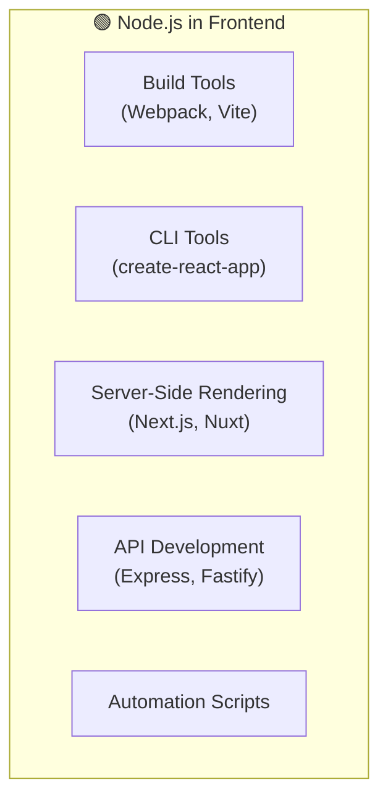
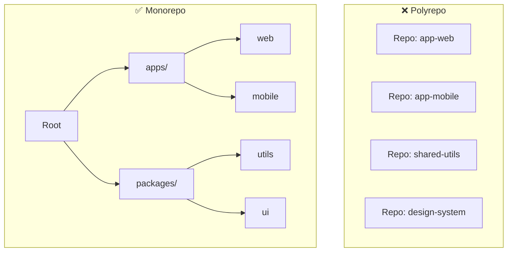
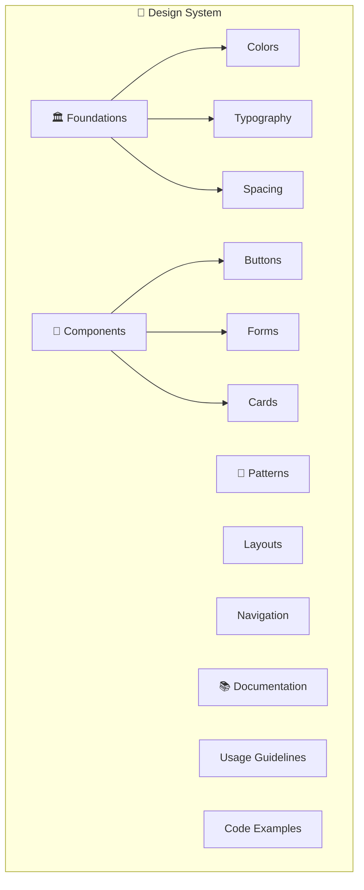
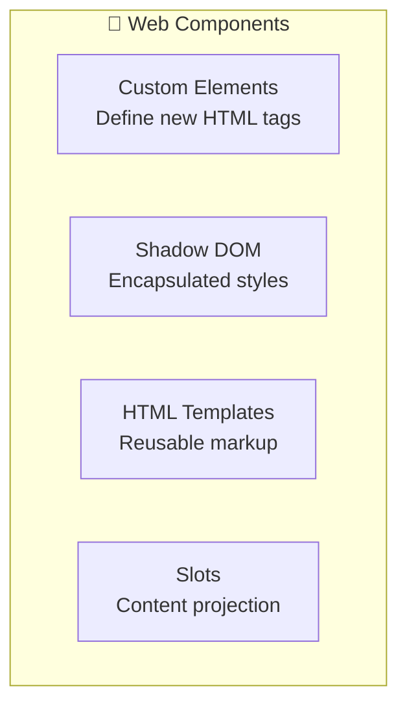
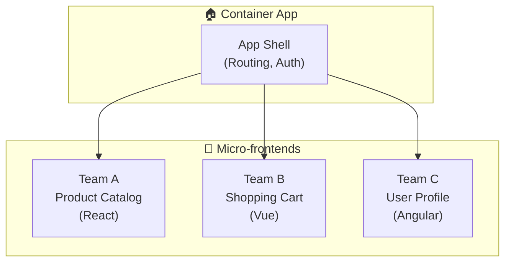
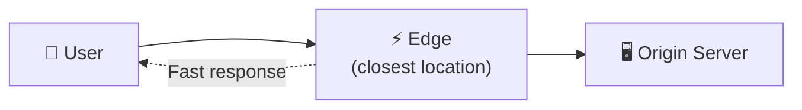
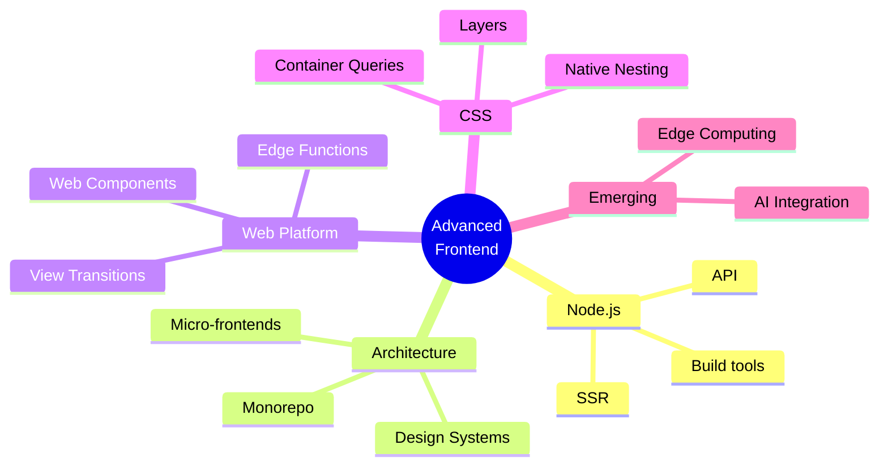

# 📚 Tài Liệu Phỏng Vấn Frontend 2025 - Phần 15

> **Chủ đề**: 🚀 Advanced Frontend Topics - Chủ Đề Nâng Cao

---

## 📋 Mục Lục

1. [Node.js for Frontend](#1-nodejs-for-frontend)
2. [Monorepo Architecture](#2-monorepo-architecture)
3. [Design Systems](#3-design-systems)
4. [Web Components](#4-web-components)
5. [Advanced CSS Techniques](#5-advanced-css-techniques)
6. [Micro-frontends](#6-micro-frontends)
7. [Edge Computing](#7-edge-computing)
8. [AI in Frontend](#8-ai-in-frontend)
9. [Câu Hỏi Phỏng Vấn Nâng Cao](#9-câu-hỏi-phỏng-vấn-nâng-cao)

---

## 1. Node.js for Frontend

### 1.1 Why Frontend Devs Need Node.js



### 1.2 Essential Node.js Concepts

```javascript
// 📦 Module System
// CommonJS (Node default)
const fs = require('fs');
module.exports = { myFunction };

// ES Modules (add "type": "module" in package.json)
import fs from 'fs';
export { myFunction };

// 📁 File System
import { readFile, writeFile } from 'fs/promises';

async function processFile() {
  const data = await readFile('input.txt', 'utf-8');
  await writeFile('output.txt', data.toUpperCase());
}

// 🌐 HTTP Server
import http from 'http';

const server = http.createServer((req, res) => {
  res.writeHead(200, { 'Content-Type': 'text/plain' });
  res.end('Hello World');
});

server.listen(3000);

// 📦 Package Scripts
// package.json
{
  "scripts": {
    "dev": "vite",
    "build": "tsc && vite build",
    "preview": "vite preview",
    "lint": "eslint . --fix",
    "test": "vitest"
  }
}
```

### 1.3 Express.js Quick Start

```javascript
import express from "express";
import cors from "cors";

const app = express();

// Middleware
app.use(cors());
app.use(express.json());

// Routes
app.get("/api/users", (req, res) => {
  res.json([{ id: 1, name: "John" }]);
});

app.post("/api/users", (req, res) => {
  const { name } = req.body;
  res.status(201).json({ id: 2, name });
});

// Error handling
app.use((err, req, res, next) => {
  console.error(err.stack);
  res.status(500).json({ error: "Something went wrong" });
});

app.listen(3000, () => console.log("Server running"));
```

---

## 2. Monorepo Architecture

### 2.1 What is Monorepo?



### 2.2 Monorepo Tools

| Tool                | By       | Features      |
| ------------------- | -------- | ------------- |
| **Turborepo** ⭐    | Vercel   | Fast, simple  |
| **Nx**              | Nrwl     | Full-featured |
| **Lerna**           | Original | Legacy        |
| **pnpm workspaces** | pnpm     | Native        |
| **Yarn workspaces** | Yarn     | Native        |

### 2.3 Turborepo Setup

```
📁 my-monorepo/
├── apps/
│   ├── web/
│   │   └── package.json
│   └── admin/
│       └── package.json
├── packages/
│   ├── ui/
│   │   └── package.json
│   ├── utils/
│   │   └── package.json
│   └── config/
│       └── package.json
├── turbo.json
├── package.json
└── pnpm-workspace.yaml
```

```javascript
// turbo.json
{
  "$schema": "https://turbo.build/schema.json",
  "pipeline": {
    "build": {
      "dependsOn": ["^build"],
      "outputs": ["dist/**"]
    },
    "lint": {},
    "test": {
      "dependsOn": ["build"]
    },
    "dev": {
      "cache": false,
      "persistent": true
    }
  }
}

// pnpm-workspace.yaml
packages:
  - 'apps/*'
  - 'packages/*'

// package.json (root)
{
  "name": "monorepo",
  "private": true,
  "scripts": {
    "dev": "turbo run dev",
    "build": "turbo run build",
    "lint": "turbo run lint",
    "test": "turbo run test"
  }
}
```

### 2.4 Sharing Code

```javascript
// packages/ui/src/Button.tsx
export function Button({ children, onClick }) {
  return <button onClick={onClick}>{children}</button>;
}

// packages/ui/package.json
{
  "name": "@repo/ui",
  "exports": {
    ".": "./src/index.ts"
  }
}

// apps/web/package.json
{
  "dependencies": {
    "@repo/ui": "workspace:*"
  }
}

// apps/web/src/App.tsx
import { Button } from '@repo/ui';
```

---

## 3. Design Systems

### 3.1 What is a Design System?



### 3.2 Design Tokens

```javascript
// tokens/colors.js
export const colors = {
  primary: {
    50: "#eff6ff",
    100: "#dbeafe",
    500: "#3b82f6",
    600: "#2563eb",
    900: "#1e3a8a",
  },
  gray: {
    50: "#f9fafb",
    100: "#f3f4f6",
    500: "#6b7280",
    900: "#111827",
  },
  success: "#10b981",
  error: "#ef4444",
  warning: "#f59e0b",
};

// tokens/spacing.js
export const spacing = {
  0: "0",
  1: "0.25rem", // 4px
  2: "0.5rem", // 8px
  3: "0.75rem", // 12px
  4: "1rem", // 16px
  6: "1.5rem", // 24px
  8: "2rem", // 32px
};

// tokens/typography.js
export const typography = {
  fontFamily: {
    sans: ["Inter", "sans-serif"],
    mono: ["Fira Code", "monospace"],
  },
  fontSize: {
    xs: "0.75rem",
    sm: "0.875rem",
    base: "1rem",
    lg: "1.125rem",
    xl: "1.25rem",
    "2xl": "1.5rem",
  },
};
```

### 3.3 Component Library Structure

```
📁 design-system/
├── src/
│   ├── tokens/
│   │   ├── colors.ts
│   │   ├── spacing.ts
│   │   └── typography.ts
│   ├── components/
│   │   ├── Button/
│   │   │   ├── Button.tsx
│   │   │   ├── Button.styles.ts
│   │   │   ├── Button.test.tsx
│   │   │   └── index.ts
│   │   ├── Input/
│   │   └── Card/
│   ├── utils/
│   └── index.ts
├── stories/       # Storybook
├── package.json
└── tsconfig.json
```

### 3.4 Storybook

```javascript
// Button.stories.tsx
import type { Meta, StoryObj } from "@storybook/react";
import { Button } from "./Button";

const meta: Meta<typeof Button> = {
  title: "Components/Button",
  component: Button,
  tags: ["autodocs"],
  argTypes: {
    variant: {
      control: "select",
      options: ["primary", "secondary", "ghost"],
    },
    size: {
      control: "select",
      options: ["sm", "md", "lg"],
    },
  },
};

export default meta;
type Story = StoryObj<typeof Button>;

export const Primary: Story = {
  args: {
    children: "Button",
    variant: "primary",
  },
};

export const Secondary: Story = {
  args: {
    children: "Button",
    variant: "secondary",
  },
};
```

---

## 4. Web Components

### 4.1 Overview



### 4.2 Creating Web Components

```javascript
// 🧩 Custom Element
class MyButton extends HTMLElement {
  constructor() {
    super();

    // Attach Shadow DOM
    this.attachShadow({ mode: "open" });

    // Styles (encapsulated)
    const style = document.createElement("style");
    style.textContent = `
      button {
        padding: 8px 16px;
        background: #3b82f6;
        color: white;
        border: none;
        border-radius: 4px;
        cursor: pointer;
      }
      button:hover {
        background: #2563eb;
      }
    `;

    // Template
    const button = document.createElement("button");
    button.innerHTML = "<slot></slot>";

    this.shadowRoot.append(style, button);
  }

  // Lifecycle callbacks
  connectedCallback() {
    console.log("Element added to DOM");
  }

  disconnectedCallback() {
    console.log("Element removed from DOM");
  }

  // Observed attributes
  static get observedAttributes() {
    return ["disabled"];
  }

  attributeChangedCallback(name, oldValue, newValue) {
    if (name === "disabled") {
      this.shadowRoot.querySelector("button").disabled = newValue !== null;
    }
  }
}

// Register element
customElements.define("my-button", MyButton);

// Usage in HTML
// <my-button>Click me</my-button>
```

### 4.3 Lit Framework

```javascript
import { LitElement, html, css } from "lit";
import { customElement, property } from "lit/decorators.js";

@customElement("my-counter")
export class MyCounter extends LitElement {
  static styles = css`
    :host {
      display: block;
      padding: 16px;
    }
    button {
      padding: 8px 16px;
      margin: 0 4px;
    }
  `;

  @property({ type: Number })
  count = 0;

  render() {
    return html`
      <div>
        <button @click=${() => this.count--}>-</button>
        <span>${this.count}</span>
        <button @click=${() => this.count++}>+</button>
      </div>
    `;
  }
}
```

---

## 5. Advanced CSS Techniques

### 5.1 CSS Container Queries

```css
/* Container queries (2023+) */
.card-container {
  container-type: inline-size;
  container-name: card;
}

@container card (min-width: 400px) {
  .card {
    display: flex;
    flex-direction: row;
  }
}

@container card (max-width: 399px) {
  .card {
    display: block;
  }
}
```

### 5.2 CSS Layers

```css
/* CSS Cascade Layers */
@layer reset, base, components, utilities;

@layer reset {
  * {
    margin: 0;
    padding: 0;
    box-sizing: border-box;
  }
}

@layer base {
  body {
    font-family: system-ui;
  }
}

@layer components {
  .button {
    padding: 8px 16px;
  }
}

@layer utilities {
  .mt-4 {
    margin-top: 1rem;
  }
}
```

### 5.3 CSS Nesting (Native)

```css
/* Native CSS Nesting (2023+) */
.card {
  padding: 1rem;
  background: white;

  & .title {
    font-size: 1.5rem;
    font-weight: bold;
  }

  & .content {
    margin-top: 0.5rem;
  }

  &:hover {
    box-shadow: 0 4px 12px rgba(0, 0, 0, 0.1);
  }

  @media (min-width: 768px) {
    padding: 2rem;
  }
}
```

### 5.4 Modern Color Functions

```css
/* Modern CSS Colors */
:root {
  /* oklch - perceptually uniform */
  --primary: oklch(60% 0.15 250);

  /* color-mix */
  --primary-light: color-mix(in oklch, var(--primary), white 30%);
  --primary-dark: color-mix(in oklch, var(--primary), black 20%);

  /* relative colors */
  --primary-alpha: oklch(from var(--primary) l c h / 50%);
}
```

### 5.5 View Transitions API

```css
/* View Transitions */
::view-transition-old(root) {
  animation: fade-out 0.3s ease-out;
}

::view-transition-new(root) {
  animation: fade-in 0.3s ease-in;
}

@keyframes fade-out {
  to {
    opacity: 0;
  }
}

@keyframes fade-in {
  from {
    opacity: 0;
  }
}
```

```javascript
// Trigger view transition
document.startViewTransition(() => {
  // Update DOM
  updateContent();
});
```

---

## 6. Micro-frontends

### 6.1 Architecture



### 6.2 Module Federation (Webpack 5)

```javascript
// host/webpack.config.js
const ModuleFederationPlugin = require("webpack/lib/container/ModuleFederationPlugin");

module.exports = {
  plugins: [
    new ModuleFederationPlugin({
      name: "host",
      remotes: {
        catalog: "catalog@http://localhost:3001/remoteEntry.js",
        cart: "cart@http://localhost:3002/remoteEntry.js",
      },
      shared: ["react", "react-dom"],
    }),
  ],
};

// catalog/webpack.config.js
module.exports = {
  plugins: [
    new ModuleFederationPlugin({
      name: "catalog",
      filename: "remoteEntry.js",
      exposes: {
        "./ProductList": "./src/ProductList",
      },
      shared: ["react", "react-dom"],
    }),
  ],
};

// Usage in host
const ProductList = React.lazy(() => import("catalog/ProductList"));
```

### 6.3 Single-SPA

```javascript
// root-config.js
import { registerApplication, start } from "single-spa";

registerApplication({
  name: "@org/navbar",
  app: () => System.import("@org/navbar"),
  activeWhen: ["/"],
});

registerApplication({
  name: "@org/products",
  app: () => System.import("@org/products"),
  activeWhen: ["/products"],
});

start();
```

---

## 7. Edge Computing

### 7.1 Edge Functions



### 7.2 Vercel Edge Functions

```javascript
// api/hello.ts (Edge Runtime)
export const config = {
  runtime: "edge",
};

export default function handler(request: Request) {
  return new Response(JSON.stringify({ message: "Hello from the Edge!" }), {
    headers: { "content-type": "application/json" },
  });
}
```

### 7.3 Cloudflare Workers

```javascript
// worker.js
export default {
  async fetch(request, env, ctx) {
    const url = new URL(request.url);

    if (url.pathname === "/api/data") {
      // Read from KV storage
      const data = await env.MY_KV.get("key");
      return Response.json({ data });
    }

    return new Response("Hello World!");
  },
};
```

---

## 8. AI in Frontend

### 8.1 AI-Powered Features

| Feature              | Use Case                 |
| -------------------- | ------------------------ |
| **Code Completion**  | GitHub Copilot           |
| **Image Generation** | DALL-E, Stable Diffusion |
| **Text Generation**  | ChatGPT API              |
| **Search**           | Vector embeddings        |
| **Personalization**  | Recommendation systems   |

### 8.2 AI SDK (Vercel)

```javascript
import { openai } from "@ai-sdk/openai";
import { streamText } from "ai";

export async function POST(req: Request) {
  const { messages } = await req.json();

  const result = await streamText({
    model: openai("gpt-4-turbo"),
    messages,
  });

  return result.toDataStreamResponse();
}

// React component
import { useChat } from "ai/react";

export function Chat() {
  const { messages, input, handleInputChange, handleSubmit } = useChat();

  return (
    <div>
      {messages.map((m) => (
        <div key={m.id}>{m.content}</div>
      ))}
      <form onSubmit={handleSubmit}>
        <input value={input} onChange={handleInputChange} />
      </form>
    </div>
  );
}
```

---

## 9. Câu Hỏi Phỏng Vấn Nâng Cao

### 9.1 Architecture

<details>
<summary><strong>Q: Khi nào nên dùng Monorepo?</strong></summary>

**Nên dùng:**

- Multiple apps share code
- One team manages all
- Consistent tooling needed
- Atomic changes across packages

**Không nên:**

- Teams need isolation
- Different release cycles
- Security concerns

</details>

<details>
<summary><strong>Q: Micro-frontends pros/cons?</strong></summary>

**Pros:**

- Team autonomy
- Independent deployments
- Tech stack flexibility

**Cons:**

- Complexity
- Performance overhead
- Shared state challenges
- Consistent UX difficult

</details>

### 9.2 CSS

<details>
<summary><strong>Q: Container queries vs Media queries?</strong></summary>

- **Media queries**: Based on viewport size
- **Container queries**: Based on parent container size

Container queries better for reusable components.

</details>

### 9.3 Web Components

<details>
<summary><strong>Q: When to use Web Components?</strong></summary>

**Good for:**

- Framework-agnostic components
- Design systems shared across stacks
- Third-party embeddable widgets

**Not ideal for:**

- Complex apps (use React/Vue)
- SSR requirements

</details>

---

## 📊 Summary



---

> **Chúc bạn phỏng vấn thành công! 🎉**
>
> _Tài liệu được tạo: 23/12/2025_
