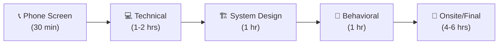

# 📚 Tài Liệu Phỏng Vấn Frontend 2025 - Phần 16

> **Chủ đề**: 🎯 Complete Interview Preparation - Chuẩn Bị Phỏng Vấn Toàn Diện

---

## 📋 Mục Lục

1. [50+ Technical Questions](#1-50-technical-questions)
2. [Behavioral Questions](#2-behavioral-questions)
3. [System Design Questions](#3-system-design-questions)
4. [Portfolio Best Practices](#4-portfolio-best-practices)
5. [Resume Tips](#5-resume-tips)
6. [Salary Negotiation](#6-salary-negotiation)
7. [Interview Process](#7-interview-process)
8. [Questions to Ask](#8-questions-to-ask)

---

## 1. 50+ Technical Questions

### 1.1 JavaScript Core (15 Questions)

<details>
<summary><strong>1. Explain hoisting in JavaScript</strong></summary>

**Answer:** Hoisting là quá trình JS engine đưa declarations lên đầu scope trước khi execute.

```javascript
// var hoisted với undefined
console.log(x); // undefined
var x = 5;

// let/const hoisted nhưng trong TDZ
console.log(y); // ReferenceError
let y = 5;

// Function declarations fully hoisted
sayHi(); // "Hi!"
function sayHi() {
  console.log("Hi!");
}
```

</details>

<details>
<summary><strong>2. What is closure? Give real example</strong></summary>

**Answer:** Closure = function + lexical environment. Function "nhớ" biến từ scope bên ngoài.

```javascript
// Real example: Counter
function createCounter() {
  let count = 0; // Private variable
  return {
    increment: () => ++count,
    getCount: () => count,
  };
}

const counter = createCounter();
counter.increment(); // 1
counter.increment(); // 2
counter.getCount(); // 2
```

</details>

<details>
<summary><strong>3. Explain Event Loop</strong></summary>

**Answer:** Event Loop quản lý execution order:

1. Execute synchronous code (Call Stack)
2. Process all Microtasks (Promise.then, queueMicrotask)
3. Execute one Macrotask (setTimeout, setInterval)
4. Repeat

```javascript
console.log("1"); // Sync
setTimeout(() => console.log("2"), 0); // Macrotask
Promise.resolve().then(() => console.log("3")); // Microtask
console.log("4"); // Sync

// Output: 1, 4, 3, 2
```

</details>

<details>
<summary><strong>4. Difference between == and ===</strong></summary>

**Answer:**

- `==` : Type coercion (chuyển đổi type trước khi so sánh)
- `===` : Strict equality (so sánh cả type và value)

```javascript
1 == "1"; // true (coerced)
1 === "1"; // false (different types)
null == undefined; // true
null === undefined; // false
```

**Best practice:** Luôn dùng `===`

</details>

<details>
<summary><strong>5. What is 'this' keyword?</strong></summary>

**Answer:** `this` depends on how function is called:

| Context         | this =                      |
| --------------- | --------------------------- |
| Global          | window / undefined (strict) |
| Object method   | The object                  |
| Arrow function  | Lexical (parent's this)     |
| new             | New instance                |
| call/apply/bind | First argument              |

</details>

<details>
<summary><strong>6. Explain Promises vs Callbacks</strong></summary>

**Answer:**

- **Callbacks:** Function passed as argument, can lead to callback hell
- **Promises:** Object representing future value, chainable, better error handling

```javascript
// Callback hell
getData(a, (b) => {
  getMore(b, (c) => {
    getMore(c, (d) => {
      /* ... */
    });
  });
});

// Promise chain
getData(a)
  .then((b) => getMore(b))
  .then((c) => getMore(c))
  .catch((err) => handle(err));

// async/await (cleanest)
const result = await getData(a);
```

</details>

<details>
<summary><strong>7. What is prototypal inheritance?</strong></summary>

**Answer:** Objects inherit from other objects through prototype chain.

```javascript
const animal = {
  speak() {
    console.log("Sound");
  },
};

const dog = Object.create(animal);
dog.bark = function () {
  console.log("Woof");
};

dog.speak(); // "Sound" (inherited)
dog.bark(); // "Woof" (own method)
```

</details>

<details>
<summary><strong>8. Explain spread vs rest operators</strong></summary>

**Answer:** Same syntax `...` but different use:

```javascript
// Spread: Expand
const arr = [...arr1, ...arr2];
const obj = { ...obj1, newProp: 1 };

// Rest: Collect
function sum(...nums) {
  return nums.reduce((a, b) => a + b);
}
const { a, ...rest } = object;
```

</details>

<details>
<summary><strong>9. What are arrow functions limitations?</strong></summary>

**Answer:**

1. No own `this` (lexical)
2. Cannot be used as constructors (no `new`)
3. No `arguments` object
4. Cannot be used as methods with `this`

```javascript
const obj = {
  name: "John",
  // ❌ Wrong
  greet: () => console.log(this.name), // undefined
  // ✅ Correct
  greet() {
    console.log(this.name);
  }, // "John"
};
```

</details>

<details>
<summary><strong>10. Explain debounce vs throttle</strong></summary>

**Answer:**

- **Debounce:** Wait until user stops (search input)
- **Throttle:** Execute at most once per interval (scroll)

```javascript
// Debounce: Search after user stops typing
const debouncedSearch = debounce(search, 300);

// Throttle: Track scroll max 60fps
const throttledScroll = throttle(trackScroll, 16);
```

</details>

<details>
<summary><strong>11. What is memoization?</strong></summary>

**Answer:** Caching function results based on arguments.

```javascript
function memoize(fn) {
  const cache = new Map();
  return (...args) => {
    const key = JSON.stringify(args);
    if (cache.has(key)) return cache.get(key);
    const result = fn(...args);
    cache.set(key, result);
    return result;
  };
}
```

</details>

<details>
<summary><strong>12. Explain Map vs Object</strong></summary>

**Answer:**

| Feature     | Object         | Map                            |
| ----------- | -------------- | ------------------------------ |
| Keys        | String/Symbol  | Any type                       |
| Order       | Not guaranteed | Insertion order                |
| Size        | Manual count   | `.size`                        |
| Iteration   | Complex        | Built-in                       |
| Performance | Good           | Better for frequent add/remove |

</details>

<details>
<summary><strong>13. What is Set?</strong></summary>

**Answer:** Collection of unique values.

```javascript
const set = new Set([1, 2, 2, 3]); // {1, 2, 3}
set.add(4);
set.has(2); // true
set.delete(2);
set.size; // 3

// Remove duplicates
const unique = [...new Set(array)];
```

</details>

<details>
<summary><strong>14. Explain async/await error handling</strong></summary>

**Answer:**

```javascript
// try/catch
async function fetchData() {
  try {
    const res = await fetch(url);
    return await res.json();
  } catch (error) {
    console.error("Error:", error);
    throw error; // Re-throw if needed
  }
}

// Promise.catch
fetchData().catch(handleError);
```

</details>

<details>
<summary><strong>15. What is optional chaining?</strong></summary>

**Answer:** Safe access to nested properties.

```javascript
// Without optional chaining
const city = user && user.address && user.address.city;

// With optional chaining
const city = user?.address?.city;

// Also works with functions
user?.getAddress?.();

// And arrays
arr?.[0];
```

</details>

---

### 1.2 React (15 Questions)

<details>
<summary><strong>16. What is Virtual DOM?</strong></summary>

**Answer:** Lightweight copy of real DOM in memory. React compares Virtual DOM trees (diffing) and only updates changed parts in real DOM (reconciliation). This makes updates efficient.

</details>

<details>
<summary><strong>17. Explain useState hook</strong></summary>

**Answer:**

```javascript
const [state, setState] = useState(initialValue);

// Update with new value
setState(newValue);

// Update based on previous (recommended)
setState((prev) => prev + 1);

// Lazy initialization (expensive computation)
useState(() => computeExpensive());
```

</details>

<details>
<summary><strong>18. useEffect dependencies explained</strong></summary>

**Answer:**

```javascript
// Run on every render
useEffect(() => {});

// Run once on mount
useEffect(() => {}, []);

// Run when deps change
useEffect(() => {}, [dep1, dep2]);

// Cleanup function
useEffect(() => {
  const sub = subscribe();
  return () => unsubscribe(sub); // Cleanup
}, []);
```

</details>

<details>
<summary><strong>19. What is useRef used for?</strong></summary>

**Answer:**

1. Access DOM elements directly
2. Store mutable value that doesn't trigger re-render

```javascript
// DOM access
const inputRef = useRef(null);
inputRef.current.focus();

// Mutable value (persists across renders)
const countRef = useRef(0);
countRef.current++; // No re-render
```

</details>

<details>
<summary><strong>20. React.memo vs useMemo vs useCallback</strong></summary>

**Answer:**

| Hook          | Purpose                                          |
| ------------- | ------------------------------------------------ |
| `React.memo`  | Memoize component (skip re-render if props same) |
| `useMemo`     | Memoize value (expensive calculation)            |
| `useCallback` | Memoize function reference                       |

```javascript
const MemoizedComponent = React.memo(Component);
const expensiveValue = useMemo(() => compute(a), [a]);
const stableCallback = useCallback(() => fn(a), [a]);
```

</details>

<details>
<summary><strong>21. Controlled vs Uncontrolled components</strong></summary>

**Answer:**

```javascript
// Controlled: React manages state
<input value={value} onChange={e => setValue(e.target.value)} />

// Uncontrolled: DOM manages state
<input ref={inputRef} defaultValue="initial" />
// Access: inputRef.current.value
```

**Best practice:** Use controlled for most cases.

</details>

<details>
<summary><strong>22. What is Context API?</strong></summary>

**Answer:** Share data without prop drilling.

```javascript
const ThemeContext = createContext("light");

// Provider
<ThemeContext.Provider value="dark">
  <App />
</ThemeContext.Provider>;

// Consumer
const theme = useContext(ThemeContext);
```

</details>

<details>
<summary><strong>23. useReducer vs useState</strong></summary>

**Answer:**

- `useState`: Simple state
- `useReducer`: Complex state with multiple sub-values or when next state depends on previous

```javascript
const reducer = (state, action) => {
  switch (action.type) {
    case "INCREMENT":
      return { count: state.count + 1 };
    case "DECREMENT":
      return { count: state.count - 1 };
    default:
      return state;
  }
};

const [state, dispatch] = useReducer(reducer, { count: 0 });
dispatch({ type: "INCREMENT" });
```

</details>

<details>
<summary><strong>24. How to prevent re-renders?</strong></summary>

**Answer:**

1. `React.memo` for components
2. `useMemo` for expensive values
3. `useCallback` for function references
4. Move state down (lift state only when needed)
5. Split context into smaller pieces

</details>

<details>
<summary><strong>25. What are React keys?</strong></summary>

**Answer:** Unique identifiers for list items. Helps React identify which items changed, added, or removed.

```javascript
// ✅ Good: Unique ID
{
  items.map((item) => <Item key={item.id} {...item} />);
}

// ❌ Bad: Index as key (causes issues on reorder)
{
  items.map((item, i) => <Item key={i} {...item} />);
}
```

</details>

<details>
<summary><strong>26. Explain React lifecycle</strong></summary>

**Answer:**

```
Mount:
  constructor → render → DOM update → componentDidMount
  (useEffect with [])

Update:
  render → DOM update → componentDidUpdate
  (useEffect with deps)

Unmount:
  componentWillUnmount
  (useEffect cleanup)
```

</details>

<details>
<summary><strong>27. What is lazy loading in React?</strong></summary>

**Answer:**

```javascript
// Code splitting with lazy
const HeavyComponent = React.lazy(() => import("./HeavyComponent"));

// Must wrap with Suspense
<Suspense fallback={<Loading />}>
  <HeavyComponent />
</Suspense>;
```

</details>

<details>
<summary><strong>28. Error Boundaries explained</strong></summary>

**Answer:** Catch JavaScript errors in child component tree.

```javascript
class ErrorBoundary extends React.Component {
  state = { hasError: false };

  static getDerivedStateFromError(error) {
    return { hasError: true };
  }

  componentDidCatch(error, errorInfo) {
    logErrorToService(error, errorInfo);
  }

  render() {
    if (this.state.hasError) return <FallbackUI />;
    return this.props.children;
  }
}
```

Note: Cannot catch errors in event handlers, async code, SSR.

</details>

<details>
<summary><strong>29. What is React Portal?</strong></summary>

**Answer:** Render children into DOM node outside parent hierarchy. Useful for modals, tooltips.

```javascript
createPortal(<Modal />, document.getElementById("modal-root"));
```

</details>

<details>
<summary><strong>30. Custom hooks best practices</strong></summary>

**Answer:**

1. Start with `use` prefix
2. Can call other hooks
3. Share stateful logic, not state itself
4. Keep them small and focused

```javascript
function useLocalStorage(key, initialValue) {
  const [value, setValue] = useState(() => {
    const stored = localStorage.getItem(key);
    return stored ? JSON.parse(stored) : initialValue;
  });

  useEffect(() => {
    localStorage.setItem(key, JSON.stringify(value));
  }, [key, value]);

  return [value, setValue];
}
```

</details>

---

### 1.3 CSS/HTML (10 Questions)

<details>
<summary><strong>31. Explain Box Model</strong></summary>

**Answer:**

```
┌─────────── margin ───────────┐
│ ┌──────── border ─────────┐  │
│ │ ┌───── padding ──────┐  │  │
│ │ │      content       │  │  │
│ │ └────────────────────┘  │  │
│ └─────────────────────────┘  │
└──────────────────────────────┘
```

`box-sizing: content-box` (default): width = content only
`box-sizing: border-box`: width = content + padding + border

</details>

<details>
<summary><strong>32. Flexbox vs Grid</strong></summary>

**Answer:**

- **Flexbox:** 1D layout (row OR column)
- **Grid:** 2D layout (rows AND columns)

```css
/* Flexbox: Navbar */
.nav {
  display: flex;
  justify-content: space-between;
}

/* Grid: Page layout */
.page {
  display: grid;
  grid-template-columns: 200px 1fr 200px;
  grid-template-rows: auto 1fr auto;
}
```

</details>

<details>
<summary><strong>33. CSS Specificity</strong></summary>

**Answer:**

```
Inline:    1,0,0,0  (highest)
ID:        0,1,0,0
Class:     0,0,1,0
Element:   0,0,0,1  (lowest)
```

```css
/* Specificity examples */
#header .nav a     /* 0,1,1,1 - Winner */
.nav a.active      /* 0,0,2,1 */
nav ul li a; /* 0,0,0,4 */
```

</details>

<details>
<summary><strong>34. Position values explained</strong></summary>

**Answer:**

| Value      | Behavior                                           |
| ---------- | -------------------------------------------------- |
| `static`   | Default, normal flow                               |
| `relative` | Offset from normal position                        |
| `absolute` | Removed from flow, relative to positioned ancestor |
| `fixed`    | Removed from flow, relative to viewport            |
| `sticky`   | Hybrid of relative and fixed                       |

</details>

<details>
<summary><strong>35. Semantic HTML importance</strong></summary>

**Answer:**

1. **SEO:** Search engines understand content
2. **Accessibility:** Screen readers navigate better
3. **Maintainability:** Code is self-documenting

```html
<!-- ❌ Non-semantic -->
<div class="header"><div class="nav">...</div></div>

<!-- ✅ Semantic -->
<header><nav>...</nav></header>
```

</details>

<details>
<summary><strong>36. CSS Variables usage</strong></summary>

**Answer:**

```css
:root {
  --primary: #3b82f6;
  --spacing: 1rem;
}

.button {
  background: var(--primary);
  padding: var(--spacing);
}

/* Override in scope */
.dark {
  --primary: #60a5fa;
}

/* Fallback */
color: var(--text, #333);
```

</details>

<details>
<summary><strong>37. Z-index explained</strong></summary>

**Answer:** Controls stacking order. Only works on positioned elements (`position: relative/absolute/fixed/sticky`).

Creates stacking context:

- `position` with z-index
- `opacity < 1`
- `transform`, `filter`
- `isolation: isolate`

</details>

<details>
<summary><strong>38. Media queries for responsive</strong></summary>

**Answer:**

```css
/* Mobile first */
.container {
  width: 100%;
}

@media (min-width: 768px) {
  .container {
    width: 750px;
  }
}

@media (min-width: 1024px) {
  .container {
    width: 980px;
  }
}

/* Feature queries */
@media (hover: hover) {
  /* Has hover */
}
@media (prefers-color-scheme: dark) {
  /* Dark mode */
}
```

</details>

<details>
<summary><strong>39. CSS Transitions vs Animations</strong></summary>

**Answer:**

- **Transitions:** Simple A→B changes, triggered by state
- **Animations:** Complex multi-step, can loop, auto-play

```css
/* Transition */
.button {
  transition: background 0.3s ease;
}
.button:hover {
  background: blue;
}

/* Animation */
@keyframes pulse {
  0%,
  100% {
    scale: 1;
  }
  50% {
    scale: 1.1;
  }
}
.icon {
  animation: pulse 2s infinite;
}
```

</details>

<details>
<summary><strong>40. Accessibility best practices</strong></summary>

**Answer:**

1. Use semantic HTML
2. Add alt text to images
3. Ensure keyboard navigation
4. Sufficient color contrast (4.5:1)
5. Use ARIA when needed
6. Focus visible states
7. Skip links

</details>

---

### 1.4 Performance & Security (10 Questions)

<details>
<summary><strong>41. Core Web Vitals</strong></summary>

**Answer:**

| Metric  | Target  | Measures                 |
| ------- | ------- | ------------------------ |
| **LCP** | < 2.5s  | Largest Contentful Paint |
| **FID** | < 100ms | First Input Delay        |
| **CLS** | < 0.1   | Cumulative Layout Shift  |

</details>

<details>
<summary><strong>42. How to optimize images?</strong></summary>

**Answer:**

1. Use modern formats (WebP, AVIF)
2. Responsive images (`srcset`)
3. Lazy loading (`loading="lazy"`)
4. Proper dimensions (avoid layout shift)
5. CDN delivery
6. Compression

</details>

<details>
<summary><strong>43. What is code splitting?</strong></summary>

**Answer:** Split bundle into smaller chunks loaded on demand.

```javascript
// Route-based splitting
const Dashboard = lazy(() => import("./Dashboard"));

// Component-based
const HeavyChart = lazy(() => import("./HeavyChart"));
```

</details>

<details>
<summary><strong>44. Explain XSS attack and prevention</strong></summary>

**Answer:** **Cross-Site Scripting:** Injecting malicious scripts.

Prevention:

1. Escape user input
2. Use Content Security Policy
3. React auto-escapes by default
4. Avoid `dangerouslySetInnerHTML`
5. Validate/sanitize input

</details>

<details>
<summary><strong>45. What is CSRF?</strong></summary>

**Answer:** **Cross-Site Request Forgery:** Tricking user to execute unwanted actions.

Prevention:

1. CSRF tokens
2. SameSite cookies
3. Check Origin/Referer headers

</details>

<details>
<summary><strong>46. HTTPS importance</strong></summary>

**Answer:**

1. Encrypts data in transit
2. Prevents MITM attacks
3. Required for modern APIs (Service Workers, Geolocation)
4. SEO ranking factor
5. User trust

</details>

<details>
<summary><strong>47. What causes reflow/repaint?</strong></summary>

**Answer:**

- **Reflow (expensive):** Geometry changes (width, height, position)
- **Repaint (medium):** Visual changes (color, background)
- **Composite (cheap):** transform, opacity

Optimize by using `transform` and `opacity` for animations.

</details>

<details>
<summary><strong>48. React performance optimization</strong></summary>

**Answer:**

1. `React.memo` for pure components
2. `useMemo` / `useCallback`
3. Virtualization for long lists
4. Code splitting
5. Avoid inline objects/functions in JSX
6. Use production build

</details>

<details>
<summary><strong>49. Caching strategies</strong></summary>

**Answer:**

| Type           | Use Case            |
| -------------- | ------------------- |
| Browser cache  | Static assets       |
| Service Worker | Offline, PWA        |
| CDN            | Global distribution |
| HTTP headers   | Cache-Control, ETag |

</details>

<details>
<summary><strong>50. Tree shaking explained</strong></summary>

**Answer:** Remove unused code during build. Requires:

1. ES Modules (static imports)
2. Side-effect free code
3. Modern bundler (Webpack, Rollup, Vite)

```javascript
// Only includes what's used
import { debounce } from "lodash-es";
```

</details>

---

## 2. Behavioral Questions

### 2.1 STAR Format Answers

<details>
<summary><strong>"Tell me about a challenging project"</strong></summary>

**S:** Our e-commerce site had 6s load time, 40% bounce rate.

**T:** Lead performance optimization, target <2s.

**A:**

- Analyzed with Lighthouse
- Implemented code splitting (bundle 2MB → 400KB)
- Lazy loaded images (60% reduction)
- Set up CDN caching

**R:**

- LCP improved to 1.8s
- Bounce rate decreased 35%
- Conversion increased 28%

</details>

<details>
<summary><strong>"Describe a conflict with a teammate"</strong></summary>

**S:** Senior dev wanted Redux for small dashboard (5 components).

**T:** Express concerns professionally without damaging relationship.

**A:**

- Scheduled private 1:1 meeting
- Asked questions to understand reasoning
- Presented data on bundle size, complexity
- Proposed alternatives with prototypes

**R:**

- Chose Context API + Zustand
- Delivered on time
- Documented decision for future

</details>

---

## 3. System Design Questions

### 3.1 Common Questions

<details>
<summary><strong>"Design an Autocomplete/Typeahead"</strong></summary>

**Key Points:**

1. Debounce input (300ms)
2. Cancel pending requests
3. LRU cache for queries
4. Highlight matches
5. Keyboard navigation
6. Rate limiting
7. Consider offline mode

</details>

<details>
<summary><strong>"Design Infinite Scroll"</strong></summary>

**Key Points:**

1. Intersection Observer for trigger
2. Virtualization for performance
3. Loading states
4. Error handling + retry
5. Maintain scroll position
6. Back button behavior

</details>

---

## 4. Portfolio Best Practices

### 4.1 Must-Have Projects

| Type                | Examples                        |
| ------------------- | ------------------------------- |
| **Full-stack**      | E-commerce, Blog with CMS       |
| **API Integration** | Weather app, Movie database     |
| **Real-time**       | Chat app, Live dashboard        |
| **Complex UI**      | Kanban board, Calendar          |
| **Open Source**     | Contributions to known projects |

### 4.2 Project Checklist

```
□ Clean, responsive design
□ Mobile-friendly
□ Fast loading (<3s)
□ Proper error handling
□ README with setup instructions
□ Live demo link
□ Clean commit history
□ Tests included
```

---

## 5. Resume Tips

### 5.1 Format

```
📄 Resume Structure
├── Header (Name, Contact, Links)
├── Summary (2-3 sentences)
├── Skills (Categorized)
├── Experience (Reverse chronological)
└── Education/Certifications
```

### 5.2 Action Verbs

```
Built, Developed, Implemented, Architected
Optimized, Improved, Reduced, Increased
Led, Mentored, Collaborated, Coordinated
Migrated, Refactored, Automated, Deployed
```

### 5.3 Quantify Results

```
❌ "Improved website performance"
✅ "Reduced load time by 60%, improving conversion by 25%"

❌ "Built new features"
✅ "Developed 15+ reusable components used across 3 products"
```

---

## 6. Salary Negotiation

### 6.1 Research

| Source     | Info               |
| ---------- | ------------------ |
| Levels.fyi | By company         |
| Glassdoor  | Average salaries   |
| LinkedIn   | Market rate        |
| Blind      | Anonymous insights |

### 6.2 Negotiation Tips

1. **Never give first number** - "What's the budget for this role?"
2. **Use ranges** - "Based on my research, $X-$Y is typical"
3. **Consider total comp** - Base + bonus + equity + benefits
4. **Have alternatives** - "I have another offer at..."
5. **Be professional** - Negotiate, don't demand

---

## 7. Interview Process

### 7.1 Typical Stages



### 7.2 Preparation Timeline

| Week | Focus                        |
| ---- | ---------------------------- |
| 1-2  | Review fundamentals          |
| 3-4  | Practice coding problems     |
| 5    | System design                |
| 6    | Behavioral + mock interviews |

---

## 8. Questions to Ask

### 8.1 About Role

1. What does a typical day look like?
2. What are the current challenges?
3. How is success measured?
4. What's the tech stack and why?

### 8.2 About Team

1. How is the team structured?
2. What's the ratio of junior to senior?
3. How do you handle code reviews?
4. What's the on-call like?

### 8.3 About Growth

1. How do you support learning?
2. What's the promotion process?
3. Are there mentorship opportunities?

---

> **Chúc bạn phỏng vấn thành công! 🎉**
>
> _Tài liệu được tạo: 24/12/2025_
