# 📚 Tài Liệu Phỏng Vấn Frontend 2025 - Phần 17

> **Chủ đề**: 📖 MASTER INDEX & STUDY GUIDE - Hướng Dẫn Toàn Bộ Series

---

## 🎯 Tổng Quan Series

Bộ tài liệu này bao gồm **17 phần** với tổng cộng **~25,000 dòng** nội dung tiếng Việt, được thiết kế để giúp bạn chuẩn bị phỏng vấn Frontend Developer từ Junior đến Senior level.

---

## 📋 MỤC LỤC TỔNG HỢP

### 🔰 FOUNDATION (Parts 1-5)

| Part  | Tên                     | Nội Dung Chính                                 |
| ----- | ----------------------- | ---------------------------------------------- |
| **1** | JavaScript Core         | Event Loop, Promises, Closures, This, Hoisting |
| **2** | React & TypeScript      | Hooks, State, ES6+, Web Performance            |
| **3** | System Design & Testing | Architecture, Next.js, Algorithms              |
| **4** | Advanced Theory         | V8 Engine, Prototypes, HTTP, Browser           |
| **5** | Career Roadmap          | Frameworks, Web Paradigms, Career Path         |

---

### 🔗 CONNECTIONS (Parts 6-7)

| Part  | Tên                      | Nội Dung Chính                            |
| ----- | ------------------------ | ----------------------------------------- |
| **6** | Knowledge Connections    | Big Picture, Mental Models, Concept Links |
| **7** | Deep Dive Visualizations | Step-by-step diagrams, Flow charts        |

---

### 🏛️ FOUNDATIONS (Parts 8-10)

| Part   | Tên                  | Nội Dung Chính                       |
| ------ | -------------------- | ------------------------------------ |
| **8**  | Web Foundations      | 9 Core Technologies, DOM/BOM/CSSOM   |
| **9**  | Build Tools & DevOps | Webpack, Vite, Testing, Git, CI/CD   |
| **10** | Advanced APIs        | GraphQL, WebSocket, Workers, Storage |

---

### 🎯 INTERVIEW PREP (Parts 11-12)

| Part   | Tên                | Nội Dung Chính                       |
| ------ | ------------------ | ------------------------------------ |
| **11** | Interview Practice | Coding Challenges, Live Coding, STAR |
| **12** | Final Cheat Sheet  | Quick Reference, One-page Summary    |

---

### 📖 HANDBOOK 2019 (Parts 13-14)

| Part   | Tên           | Nội Dung Chính                         |
| ------ | ------------- | -------------------------------------- |
| **13** | Learning Path | Roadmap, Internet/Web, Frameworks      |
| **14** | Tools Catalog | Complete listing of all frontend tools |

---

### 🚀 ADVANCED (Parts 15-17)

| Part   | Tên                     | Nội Dung Chính                     |
| ------ | ----------------------- | ---------------------------------- |
| **15** | Advanced Topics         | Monorepo, Design Systems, Edge, AI |
| **16** | Complete Interview Prep | 50+ Q&A, Resume, Salary, Portfolio |
| **17** | Master Index            | This document - Study Guide        |

---

## 📚 STUDY GUIDE BY LEVEL

### 🟢 Junior Developer (0-2 years)

**Focus Areas:**

```
Week 1-2: Parts 1, 8
  └── JavaScript fundamentals
  └── DOM, HTML, CSS basics

Week 3-4: Parts 2, 5
  └── React basics
  └── ES6+ features
  └── Career roadmap

Week 5-6: Parts 11, 12
  └── Coding practice
  └── Cheat sheets
```

**Key Topics to Master:**

- [ ] Hoisting, Closures, This
- [ ] Event Loop & Promises
- [ ] React Hooks (useState, useEffect)
- [ ] CSS Flexbox & Grid
- [ ] HTTP basics

---

### 🟡 Mid-Level Developer (2-5 years)

**Focus Areas:**

```
Week 1-2: Parts 3, 4
  └── System Design basics
  └── V8 Engine, Performance

Week 3-4: Parts 9, 10
  └── Build tools
  └── Advanced APIs

Week 5-6: Parts 6, 7, 15
  └── Deep understanding
  └── Advanced concepts
```

**Key Topics to Master:**

- [ ] React Performance Optimization
- [ ] Testing (Unit, Integration, E2E)
- [ ] TypeScript Advanced
- [ ] Build Tools (Vite, Webpack)
- [ ] System Design Patterns

---

### 🔴 Senior Developer (5+ years)

**Focus Areas:**

```
Week 1: Parts 3, 15
  └── System Design deep dive
  └── Architecture decisions

Week 2: Parts 4, 6
  └── Theory mastery
  └── Knowledge connections

Week 3: Parts 16, 11
  └── Interview strategies
  └── Leadership questions
```

**Key Topics to Master:**

- [ ] Micro-frontends
- [ ] Design Systems
- [ ] Performance at scale
- [ ] Team leadership & mentoring
- [ ] Architecture trade-offs

---

## ⏱️ INTERVIEW TIMELINE

### 6-Week Preparation Plan

```mermaid
gantt
    title Interview Preparation Timeline
    dateFormat  X
    axisFormat %s

    section Week 1-2
    JS Fundamentals    :0, 2
    React Basics       :0, 2

    section Week 3-4
    Practice Problems  :2, 4
    System Design      :2, 4

    section Week 5
    Mock Interviews    :4, 5
    Review Weak Areas  :4, 5

    section Week 6
    Final Review       :5, 6
    Rest & Prepare     :5, 6
```



### Daily Schedule Template

```
📅 Daily Study Plan (2-3 hours)

Morning (1 hour):
  └── Read documentation/theory
  └── Take notes

Afternoon (1 hour):
  └── Coding practice
  └── Build small projects

Evening (30-60 min):
  └── Review flashcards
  └── Mock interview practice
```

---

## 🔍 QUICK TOPIC FINDER

### JavaScript

| Topic          | Location        |
| -------------- | --------------- |
| Event Loop     | Part 1, Part 7  |
| Closures       | Part 1, Part 16 |
| Promises/Async | Part 1, Part 10 |
| This keyword   | Part 1, Part 16 |
| Prototypes     | Part 4          |
| ES6+           | Part 2          |
| Modules        | Part 8, Part 9  |

### React

| Topic            | Location        |
| ---------------- | --------------- |
| Hooks            | Part 2, Part 16 |
| Performance      | Part 2, Part 16 |
| State Management | Part 2, Part 10 |
| Testing          | Part 9, Part 11 |
| Fiber            | Part 7          |

### CSS

| Topic        | Location        |
| ------------ | --------------- |
| Flexbox/Grid | Part 8, Part 16 |
| Specificity  | Part 7, Part 16 |
| Animations   | Part 8, Part 15 |
| Responsive   | Part 8          |
| Advanced     | Part 15         |

### Tools

| Topic        | Location        |
| ------------ | --------------- |
| Webpack/Vite | Part 9, Part 14 |
| Git          | Part 9, Part 14 |
| Testing      | Part 9, Part 11 |
| CI/CD        | Part 9, Part 14 |
| DevTools     | Part 9          |

### Architecture

| Topic           | Location        |
| --------------- | --------------- |
| System Design   | Part 3, Part 11 |
| Monorepo        | Part 15         |
| Micro-frontends | Part 15         |
| Design Systems  | Part 15         |

---

## 📊 STATISTICS

```
📈 Series Statistics

Total Parts:        17
Total Lines:        ~25,000+
Total Questions:    100+
Total Diagrams:     150+
Code Examples:      200+
Cheat Sheets:       10+

Topics Covered:
├── JavaScript:     40%
├── React:          25%
├── CSS/HTML:       15%
├── Tools:          10%
└── Career:         10%
```

---

## ✅ MASTER CHECKLIST

### Technical Knowledge

```
JavaScript
□ Variables (var, let, const)
□ Hoisting & TDZ
□ Closures & Scope
□ This keyword
□ Prototypes
□ Event Loop
□ Promises & Async/Await
□ ES6+ Features

React
□ Components & Props
□ State & Lifecycle
□ Hooks (useState, useEffect, useMemo, etc.)
□ Context API
□ Performance Optimization
□ Error Boundaries
□ Testing

CSS
□ Box Model
□ Flexbox
□ Grid
□ Positioning
□ Responsive Design
□ Animations
□ Specificity

Tools
□ Git
□ npm/yarn/pnpm
□ Webpack/Vite
□ ESLint/Prettier
□ Testing (Jest, RTL, Cypress)
□ DevTools
```

### Soft Skills

```
Interview Skills
□ STAR method practiced
□ Questions to ask prepared
□ Salary research done
□ Portfolio updated
□ Resume polished

Communication
□ Explain technical concepts simply
□ Ask clarifying questions
□ Think out loud during coding
□ Handle feedback gracefully
```

---

## 🎓 RECOMMENDED LEARNING ORDER

### For Beginners

```
1️⃣ Part 8  → Web Foundations
2️⃣ Part 1  → JavaScript Core
3️⃣ Part 2  → React Basics
4️⃣ Part 12 → Cheat Sheet
5️⃣ Part 11 → Practice Problems
6️⃣ Part 16 → Interview Prep
```

### For Experienced Developers

```
1️⃣ Part 12 → Quick Review
2️⃣ Part 7  → Deep Visualizations
3️⃣ Part 3  → System Design
4️⃣ Part 15 → Advanced Topics
5️⃣ Part 16 → Interview Q&A
6️⃣ Part 11 → Live Coding Practice
```

---

## 📱 MOBILE STUDY CARDS

### Must-Know One-Liners

```
Event Loop:
"Sync → Microtasks → Macrotasks → Render"

Closure:
"Function + its lexical environment"

Virtual DOM:
"In-memory representation, efficient diffing"

useMemo vs useCallback:
"useMemo for values, useCallback for functions"

CSS Specificity:
"Inline > ID > Class > Element"

CORS:
"Browser security, server must allow origins"
```

---

## 🔗 EXTERNAL RESOURCES

### Documentation

- [MDN Web Docs](https://developer.mozilla.org/)
- [React Docs](https://react.dev/)
- [TypeScript Docs](https://www.typescriptlang.org/docs/)

### Practice

- [LeetCode](https://leetcode.com/)
- [Frontend Mentor](https://frontendmentor.io/)
- [GreatFrontEnd](https://greatfrontend.com/)

### Learning

- [Frontend Masters](https://frontendmasters.com/)
- [freeCodeCamp](https://freecodecamp.org/)
- [web.dev](https://web.dev/)

---

## 🏆 FINAL TIPS

### Before Interview Day

```
✅ Review cheat sheets (Part 12)
✅ Practice 2-3 coding problems
✅ Review your projects
✅ Prepare questions to ask
✅ Get good sleep!
```

### During Interview

```
✅ Listen carefully
✅ Ask clarifying questions
✅ Think out loud
✅ Start with brute force, then optimize
✅ Test your solution
✅ Be honest about what you don't know
```

### After Interview

```
✅ Send thank you email
✅ Note down questions asked
✅ Review what went well/poorly
✅ Keep practicing
```

---

## 📊 Series Complete!

```
╔══════════════════════════════════════════════════╗
║                                                  ║
║   🎉 FRONTEND INTERVIEW 2025 SERIES COMPLETE!   ║
║                                                  ║
║   Parts: 17                                      ║
║   Lines: ~25,000+                                ║
║   Language: Vietnamese                           ║
║   Created: 24/12/2025                            ║
║                                                  ║
║   Location: /interview/docs/                     ║
║                                                  ║
╚══════════════════════════════════════════════════╝
```

---

> **"The only way to do great work is to love what you do."**
> — Steve Jobs
>
> **Chúc bạn phỏng vấn thành công! 🎉🚀**
>
> _Series hoàn thành: 24/12/2025_
