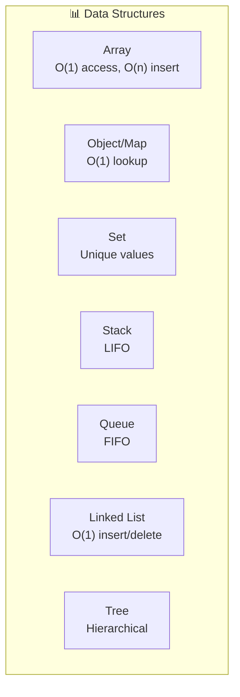

# 📚 Tài Liệu Phỏng Vấn Frontend 2025 - Phần 18

> **Chủ đề**: 💻 Coding Patterns, Data Structures & Algorithms

---

## 📋 Mục Lục

1. [Data Structures for Frontend](#1-data-structures-for-frontend)
2. [Common Algorithm Patterns](#2-common-algorithm-patterns)
3. [String Manipulation](#3-string-manipulation)
4. [Array Techniques](#4-array-techniques)
5. [Object & Map Problems](#5-object--map-problems)
6. [DOM Coding Challenges](#6-dom-coding-challenges)
7. [Async Coding Patterns](#7-async-coding-patterns)
8. [Output Questions (Tricky)](#8-output-questions-tricky)
9. [Mock Interview Scenarios](#9-mock-interview-scenarios)

---

## 1. Data Structures for Frontend

### 1.1 Essential Data Structures



### 1.2 Stack Implementation

```javascript
class Stack {
  constructor() {
    this.items = [];
  }

  push(item) {
    this.items.push(item);
  }

  pop() {
    return this.items.pop();
  }

  peek() {
    return this.items[this.items.length - 1];
  }

  isEmpty() {
    return this.items.length === 0;
  }

  size() {
    return this.items.length;
  }
}

// Use case: Undo functionality, bracket matching
```

### 1.3 Queue Implementation

```javascript
class Queue {
  constructor() {
    this.items = [];
  }

  enqueue(item) {
    this.items.push(item);
  }

  dequeue() {
    return this.items.shift();
  }

  front() {
    return this.items[0];
  }

  isEmpty() {
    return this.items.length === 0;
  }
}

// Use case: Task scheduling, BFS
```

### 1.4 Linked List

```javascript
class Node {
  constructor(value) {
    this.value = value;
    this.next = null;
  }
}

class LinkedList {
  constructor() {
    this.head = null;
    this.tail = null;
    this.length = 0;
  }

  append(value) {
    const node = new Node(value);
    if (!this.head) {
      this.head = node;
      this.tail = node;
    } else {
      this.tail.next = node;
      this.tail = node;
    }
    this.length++;
  }

  prepend(value) {
    const node = new Node(value);
    node.next = this.head;
    this.head = node;
    if (!this.tail) this.tail = node;
    this.length++;
  }

  delete(value) {
    if (!this.head) return;

    if (this.head.value === value) {
      this.head = this.head.next;
      this.length--;
      return;
    }

    let current = this.head;
    while (current.next) {
      if (current.next.value === value) {
        current.next = current.next.next;
        this.length--;
        return;
      }
      current = current.next;
    }
  }

  toArray() {
    const result = [];
    let current = this.head;
    while (current) {
      result.push(current.value);
      current = current.next;
    }
    return result;
  }
}
```

### 1.5 LRU Cache

```javascript
class LRUCache {
  constructor(capacity) {
    this.capacity = capacity;
    this.cache = new Map();
  }

  get(key) {
    if (!this.cache.has(key)) return -1;

    // Move to end (most recently used)
    const value = this.cache.get(key);
    this.cache.delete(key);
    this.cache.set(key, value);
    return value;
  }

  put(key, value) {
    if (this.cache.has(key)) {
      this.cache.delete(key);
    } else if (this.cache.size >= this.capacity) {
      // Delete oldest (first item)
      const firstKey = this.cache.keys().next().value;
      this.cache.delete(firstKey);
    }
    this.cache.set(key, value);
  }
}

// Use case: Caching API responses, search results
```

---

## 2. Common Algorithm Patterns

### 2.1 Two Pointers

```javascript
// Example: Two Sum (sorted array)
function twoSum(nums, target) {
  let left = 0;
  let right = nums.length - 1;

  while (left < right) {
    const sum = nums[left] + nums[right];
    if (sum === target) {
      return [left, right];
    } else if (sum < target) {
      left++;
    } else {
      right--;
    }
  }
  return [];
}

// Example: Reverse string in place
function reverseString(str) {
  const arr = str.split("");
  let left = 0,
    right = arr.length - 1;

  while (left < right) {
    [arr[left], arr[right]] = [arr[right], arr[left]];
    left++;
    right--;
  }
  return arr.join("");
}
```

### 2.2 Sliding Window

```javascript
// Maximum sum of k consecutive elements
function maxSumSubarray(arr, k) {
  if (arr.length < k) return null;

  let maxSum = 0;
  let windowSum = 0;

  // First window
  for (let i = 0; i < k; i++) {
    windowSum += arr[i];
  }
  maxSum = windowSum;

  // Slide window
  for (let i = k; i < arr.length; i++) {
    windowSum += arr[i] - arr[i - k];
    maxSum = Math.max(maxSum, windowSum);
  }

  return maxSum;
}

// Longest substring without repeating characters
function lengthOfLongestSubstring(s) {
  const seen = new Map();
  let maxLength = 0;
  let start = 0;

  for (let end = 0; end < s.length; end++) {
    if (seen.has(s[end])) {
      start = Math.max(start, seen.get(s[end]) + 1);
    }
    seen.set(s[end], end);
    maxLength = Math.max(maxLength, end - start + 1);
  }

  return maxLength;
}
```

### 2.3 Hash Map Pattern

```javascript
// Two Sum (unsorted)
function twoSum(nums, target) {
  const map = new Map();

  for (let i = 0; i < nums.length; i++) {
    const complement = target - nums[i];
    if (map.has(complement)) {
      return [map.get(complement), i];
    }
    map.set(nums[i], i);
  }
  return [];
}

// Group Anagrams
function groupAnagrams(strs) {
  const map = new Map();

  for (const str of strs) {
    const sorted = str.split("").sort().join("");
    if (!map.has(sorted)) {
      map.set(sorted, []);
    }
    map.get(sorted).push(str);
  }

  return Array.from(map.values());
}
```

### 2.4 Recursion with Memoization

```javascript
// Fibonacci with memoization
function fibonacci(n, memo = {}) {
  if (n in memo) return memo[n];
  if (n <= 1) return n;

  memo[n] = fibonacci(n - 1, memo) + fibonacci(n - 2, memo);
  return memo[n];
}

// Or with closure
function createFibonacci() {
  const memo = new Map();

  return function fib(n) {
    if (memo.has(n)) return memo.get(n);
    if (n <= 1) return n;

    const result = fib(n - 1) + fib(n - 2);
    memo.set(n, result);
    return result;
  };
}
```

---

## 3. String Manipulation

### 3.1 Common Problems

```javascript
// Reverse words in string
function reverseWords(s) {
  return s.split(" ").reverse().join(" ");
}

// Check palindrome
function isPalindrome(s) {
  const cleaned = s.toLowerCase().replace(/[^a-z0-9]/g, "");
  return cleaned === cleaned.split("").reverse().join("");
}

// Count vowels
function countVowels(s) {
  return (s.match(/[aeiou]/gi) || []).length;
}

// Capitalize first letter of each word
function capitalize(s) {
  return s.replace(/\b\w/g, (char) => char.toUpperCase());
}

// Truncate string with ellipsis
function truncate(s, maxLength) {
  if (s.length <= maxLength) return s;
  return s.slice(0, maxLength - 3) + "...";
}

// Remove duplicate characters
function removeDuplicates(s) {
  return [...new Set(s)].join("");
}
```

### 3.2 Advanced String Problems

```javascript
// Valid parentheses
function isValidParentheses(s) {
  const stack = [];
  const pairs = { ")": "(", "}": "{", "]": "[" };

  for (const char of s) {
    if ("({[".includes(char)) {
      stack.push(char);
    } else if (")}]".includes(char)) {
      if (stack.pop() !== pairs[char]) return false;
    }
  }

  return stack.length === 0;
}

// Longest common prefix
function longestCommonPrefix(strs) {
  if (!strs.length) return "";

  let prefix = strs[0];

  for (let i = 1; i < strs.length; i++) {
    while (strs[i].indexOf(prefix) !== 0) {
      prefix = prefix.slice(0, -1);
      if (!prefix) return "";
    }
  }

  return prefix;
}
```

---

## 4. Array Techniques

### 4.1 Array Manipulation

```javascript
// Remove duplicates
const unique = (arr) => [...new Set(arr)];

// Flatten array
const flatten = (arr) => arr.flat(Infinity);
// Or recursive
function flattenDeep(arr) {
  return arr.reduce(
    (acc, val) =>
      Array.isArray(val) ? acc.concat(flattenDeep(val)) : acc.concat(val),
    []
  );
}

// Chunk array
function chunk(arr, size) {
  const result = [];
  for (let i = 0; i < arr.length; i += size) {
    result.push(arr.slice(i, i + size));
  }
  return result;
}

// Shuffle array (Fisher-Yates)
function shuffle(arr) {
  const result = [...arr];
  for (let i = result.length - 1; i > 0; i--) {
    const j = Math.floor(Math.random() * (i + 1));
    [result[i], result[j]] = [result[j], result[i]];
  }
  return result;
}

// Find intersection
function intersection(arr1, arr2) {
  const set = new Set(arr1);
  return arr2.filter((x) => set.has(x));
}

// Find difference
function difference(arr1, arr2) {
  const set = new Set(arr2);
  return arr1.filter((x) => !set.has(x));
}
```

### 4.2 Sorting

```javascript
// Quick Sort
function quickSort(arr) {
  if (arr.length <= 1) return arr;

  const pivot = arr[Math.floor(arr.length / 2)];
  const left = arr.filter((x) => x < pivot);
  const middle = arr.filter((x) => x === pivot);
  const right = arr.filter((x) => x > pivot);

  return [...quickSort(left), ...middle, ...quickSort(right)];
}

// Merge Sort
function mergeSort(arr) {
  if (arr.length <= 1) return arr;

  const mid = Math.floor(arr.length / 2);
  const left = mergeSort(arr.slice(0, mid));
  const right = mergeSort(arr.slice(mid));

  return merge(left, right);
}

function merge(left, right) {
  const result = [];
  let i = 0,
    j = 0;

  while (i < left.length && j < right.length) {
    if (left[i] < right[j]) {
      result.push(left[i++]);
    } else {
      result.push(right[j++]);
    }
  }

  return [...result, ...left.slice(i), ...right.slice(j)];
}
```

---

## 5. Object & Map Problems

### 5.1 Object Utilities

```javascript
// Deep clone
function deepClone(obj) {
  if (obj === null || typeof obj !== "object") return obj;
  if (obj instanceof Date) return new Date(obj);
  if (obj instanceof Array) return obj.map(deepClone);

  const clone = {};
  for (const key in obj) {
    if (obj.hasOwnProperty(key)) {
      clone[key] = deepClone(obj[key]);
    }
  }
  return clone;
}

// Deep merge
function deepMerge(target, source) {
  const result = { ...target };

  for (const key in source) {
    if (source[key] instanceof Object && key in target) {
      result[key] = deepMerge(target[key], source[key]);
    } else {
      result[key] = source[key];
    }
  }

  return result;
}

// Get value by path
function get(obj, path, defaultValue) {
  const keys = path.split(".");
  let result = obj;

  for (const key of keys) {
    result = result?.[key];
    if (result === undefined) return defaultValue;
  }

  return result;
}

// Set value by path
function set(obj, path, value) {
  const keys = path.split(".");
  let current = obj;

  for (let i = 0; i < keys.length - 1; i++) {
    if (!(keys[i] in current)) {
      current[keys[i]] = {};
    }
    current = current[keys[i]];
  }

  current[keys[keys.length - 1]] = value;
  return obj;
}

// Flatten object
function flattenObject(obj, prefix = "") {
  const result = {};

  for (const key in obj) {
    const newKey = prefix ? `${prefix}.${key}` : key;

    if (typeof obj[key] === "object" && obj[key] !== null) {
      Object.assign(result, flattenObject(obj[key], newKey));
    } else {
      result[newKey] = obj[key];
    }
  }

  return result;
}
```

---

## 6. DOM Coding Challenges

### 6.1 DOM Traversal

```javascript
// Get all text content
function getAllText(element) {
  let text = "";

  function traverse(node) {
    if (node.nodeType === Node.TEXT_NODE) {
      text += node.textContent;
    } else {
      for (const child of node.childNodes) {
        traverse(child);
      }
    }
  }

  traverse(element);
  return text;
}

// Find all elements by class (recursive)
function findByClass(root, className) {
  const result = [];

  function traverse(node) {
    if (node.classList?.contains(className)) {
      result.push(node);
    }
    for (const child of node.children) {
      traverse(child);
    }
  }

  traverse(root);
  return result;
}

// Get element depth
function getDepth(element) {
  let depth = 0;
  let current = element;

  while (current.parentElement) {
    depth++;
    current = current.parentElement;
  }

  return depth;
}
```

### 6.2 Event Delegation

```javascript
// Event delegation
function delegate(container, selector, event, handler) {
  container.addEventListener(event, (e) => {
    const target = e.target.closest(selector);
    if (target && container.contains(target)) {
      handler.call(target, e);
    }
  });
}

// Usage
delegate(document.body, ".btn", "click", function (e) {
  console.log("Button clicked:", this);
});
```

---

## 7. Async Coding Patterns

### 7.1 Promise Utilities

```javascript
// Promise.all implementation
function promiseAll(promises) {
  return new Promise((resolve, reject) => {
    const results = [];
    let completed = 0;

    if (promises.length === 0) {
      resolve([]);
      return;
    }

    promises.forEach((promise, index) => {
      Promise.resolve(promise)
        .then((value) => {
          results[index] = value;
          completed++;
          if (completed === promises.length) {
            resolve(results);
          }
        })
        .catch(reject);
    });
  });
}

// Promise.race implementation
function promiseRace(promises) {
  return new Promise((resolve, reject) => {
    promises.forEach((promise) => {
      Promise.resolve(promise).then(resolve).catch(reject);
    });
  });
}

// Promise.allSettled implementation
function promiseAllSettled(promises) {
  return Promise.all(
    promises.map((p) =>
      Promise.resolve(p)
        .then((value) => ({ status: "fulfilled", value }))
        .catch((reason) => ({ status: "rejected", reason }))
    )
  );
}

// Retry with exponential backoff
async function retry(fn, maxRetries = 3, delay = 1000) {
  for (let i = 0; i < maxRetries; i++) {
    try {
      return await fn();
    } catch (error) {
      if (i === maxRetries - 1) throw error;
      await new Promise((r) => setTimeout(r, delay * Math.pow(2, i)));
    }
  }
}

// Concurrent limit
async function concurrent(tasks, limit = 3) {
  const results = [];
  const executing = [];

  for (const task of tasks) {
    const promise = Promise.resolve().then(() => task());
    results.push(promise);

    if (limit <= tasks.length) {
      const e = promise.then(() => executing.splice(executing.indexOf(e), 1));
      executing.push(e);

      if (executing.length >= limit) {
        await Promise.race(executing);
      }
    }
  }

  return Promise.all(results);
}
```

---

## 8. Output Questions (Tricky)

### 8.1 Scope & Hoisting

```javascript
// Q1: What's the output?
console.log(a);
var a = 1;
// Answer: undefined (hoisted, not initialized)

// Q2: What's the output?
console.log(b);
let b = 1;
// Answer: ReferenceError (TDZ)

// Q3: What's the output?
var x = 1;
function foo() {
  console.log(x);
  var x = 2;
}
foo();
// Answer: undefined (local x hoisted)
```

### 8.2 Closures

```javascript
// Q4: What's the output?
for (var i = 0; i < 3; i++) {
  setTimeout(() => console.log(i), 0);
}
// Answer: 3, 3, 3

// Fix with let:
for (let i = 0; i < 3; i++) {
  setTimeout(() => console.log(i), 0);
}
// Answer: 0, 1, 2

// Q5: What's the output?
const arr = [10, 20, 30];
for (var i = 0; i < arr.length; i++) {
  setTimeout(() => console.log(arr[i]), 0);
}
// Answer: undefined, undefined, undefined
```

### 8.3 this Keyword

```javascript
// Q6: What's the output?
const obj = {
  name: "John",
  greet: () => console.log(this.name),
};
obj.greet();
// Answer: undefined (arrow function - lexical this)

// Q7: What's the output?
const obj2 = {
  name: "John",
  greet() {
    console.log(this.name);
  },
};
const greet = obj2.greet;
greet();
// Answer: undefined (lost context)
```

### 8.4 Event Loop

```javascript
// Q8: What's the order?
console.log("1");
setTimeout(() => console.log("2"), 0);
Promise.resolve().then(() => console.log("3"));
console.log("4");
// Answer: 1, 4, 3, 2

// Q9: What's the order?
async function async1() {
  console.log("a");
  await async2();
  console.log("b");
}
async function async2() {
  console.log("c");
}
console.log("d");
async1();
console.log("e");
// Answer: d, a, c, e, b
```

### 8.5 Type Coercion

```javascript
// Q10: What's the output?
console.log([] + []); // ""
console.log([] + {}); // "[object Object]"
console.log({} + []); // "[object Object]"
console.log(1 + "2"); // "12"
console.log("2" - 1); // 1
console.log(null + 1); // 1
console.log(undefined + 1); // NaN
console.log(true + true); // 2
```

---

## 9. Mock Interview Scenarios

### 9.1 15-Minute Coding Interview

**Prompt:** "Implement a function that finds the first non-repeating character in a string."

```javascript
// Solution
function firstNonRepeating(str) {
  const count = new Map();

  // Count occurrences
  for (const char of str) {
    count.set(char, (count.get(char) || 0) + 1);
  }

  // Find first with count 1
  for (const char of str) {
    if (count.get(char) === 1) {
      return char;
    }
  }

  return null;
}

// Test
console.log(firstNonRepeating("aabbcde")); // 'c'
console.log(firstNonRepeating("aabb")); // null

// Time: O(n), Space: O(k) where k = unique chars
```

### 9.2 30-Minute Coding Interview

**Prompt:** "Implement a simple publish-subscribe system."

```javascript
class PubSub {
  constructor() {
    this.subscribers = new Map();
  }

  subscribe(event, callback) {
    if (!this.subscribers.has(event)) {
      this.subscribers.set(event, new Set());
    }
    this.subscribers.get(event).add(callback);

    // Return unsubscribe function
    return () => {
      this.subscribers.get(event).delete(callback);
    };
  }

  publish(event, data) {
    if (!this.subscribers.has(event)) return;

    this.subscribers.get(event).forEach((callback) => {
      callback(data);
    });
  }
}

// Usage
const pubsub = new PubSub();
const unsub = pubsub.subscribe("message", (data) => {
  console.log("Received:", data);
});
pubsub.publish("message", { text: "Hello" });
unsub();
```

---

## 📊 Complexity Quick Reference

| Algorithm     | Time           | Space    |
| ------------- | -------------- | -------- |
| Binary Search | O(log n)       | O(1)     |
| Linear Search | O(n)           | O(1)     |
| Bubble Sort   | O(n²)          | O(1)     |
| Merge Sort    | O(n log n)     | O(n)     |
| Quick Sort    | O(n log n) avg | O(log n) |
| Hash Table    | O(1) avg       | O(n)     |
| BFS/DFS       | O(V + E)       | O(V)     |

---

> **Chúc bạn phỏng vấn thành công! 🎉**
>
> _Tài liệu được tạo: 24/12/2025_
