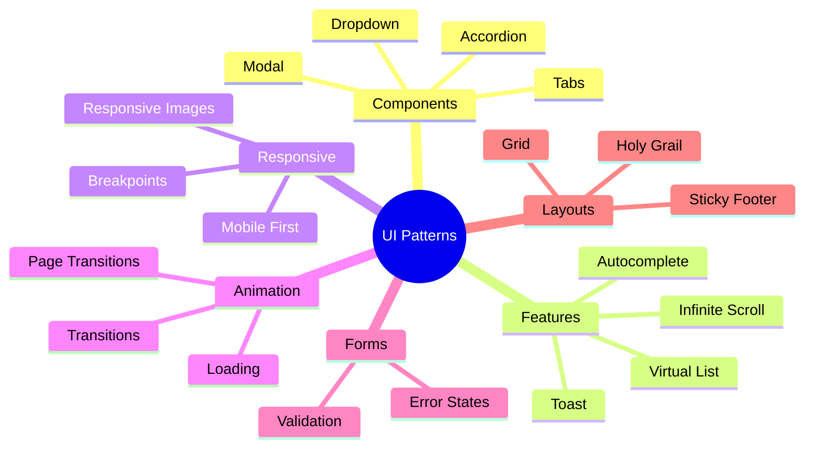

# 📚 Tài Liệu Phỏng Vấn Frontend 2025 - Phần 19

> **Chủ đề**: 🎨 UI Patterns, Components & Responsive Design

---

## 📋 Mục Lục

1. [Common UI Patterns](#1-common-ui-patterns)
2. [React Component Implementations](#2-react-component-implementations)
3. [Responsive Design Patterns](#3-responsive-design-patterns)
4. [Animation Patterns](#4-animation-patterns)
5. [Form Patterns](#5-form-patterns)
6. [Layout Patterns](#6-layout-patterns)
7. [State UI Patterns](#7-state-ui-patterns)

---

## 1. Common UI Patterns

### 1.1 Modal/Dialog

```javascript
// React Modal Component
function Modal({ isOpen, onClose, title, children }) {
  useEffect(() => {
    const handleEscape = (e) => {
      if (e.key === "Escape") onClose();
    };

    if (isOpen) {
      document.addEventListener("keydown", handleEscape);
      document.body.style.overflow = "hidden";
    }

    return () => {
      document.removeEventListener("keydown", handleEscape);
      document.body.style.overflow = "unset";
    };
  }, [isOpen, onClose]);

  if (!isOpen) return null;

  return createPortal(
    <div className="modal-overlay" onClick={onClose}>
      <div
        className="modal-content"
        onClick={(e) => e.stopPropagation()}
        role="dialog"
        aria-modal="true"
        aria-labelledby="modal-title"
      >
        <header className="modal-header">
          <h2 id="modal-title">{title}</h2>
          <button onClick={onClose} aria-label="Close">
            ×
          </button>
        </header>
        <div className="modal-body">{children}</div>
      </div>
    </div>,
    document.body
  );
}
```

```css
/* Modal Styles */
.modal-overlay {
  position: fixed;
  inset: 0;
  background: rgba(0, 0, 0, 0.5);
  display: flex;
  align-items: center;
  justify-content: center;
  z-index: 1000;
  animation: fadeIn 0.2s ease;
}

.modal-content {
  background: white;
  border-radius: 8px;
  max-width: 500px;
  width: 90%;
  max-height: 85vh;
  overflow-y: auto;
  animation: slideUp 0.3s ease;
}

@keyframes fadeIn {
  from {
    opacity: 0;
  }
}

@keyframes slideUp {
  from {
    transform: translateY(20px);
    opacity: 0;
  }
}
```

### 1.2 Dropdown/Select

```javascript
function Dropdown({ options, value, onChange, placeholder }) {
  const [isOpen, setIsOpen] = useState(false);
  const ref = useRef(null);

  // Close on outside click
  useEffect(() => {
    const handleClickOutside = (e) => {
      if (ref.current && !ref.current.contains(e.target)) {
        setIsOpen(false);
      }
    };
    document.addEventListener("mousedown", handleClickOutside);
    return () => document.removeEventListener("mousedown", handleClickOutside);
  }, []);

  const selected = options.find((o) => o.value === value);

  return (
    <div className="dropdown" ref={ref}>
      <button
        className="dropdown-trigger"
        onClick={() => setIsOpen(!isOpen)}
        aria-haspopup="listbox"
        aria-expanded={isOpen}
      >
        {selected?.label || placeholder}
        <ChevronIcon />
      </button>

      {isOpen && (
        <ul className="dropdown-menu" role="listbox">
          {options.map((option) => (
            <li
              key={option.value}
              role="option"
              aria-selected={option.value === value}
              onClick={() => {
                onChange(option.value);
                setIsOpen(false);
              }}
            >
              {option.label}
            </li>
          ))}
        </ul>
      )}
    </div>
  );
}
```

### 1.3 Tabs

```javascript
function Tabs({ tabs, defaultTab }) {
  const [activeTab, setActiveTab] = useState(defaultTab || tabs[0].id);

  return (
    <div className="tabs">
      <div className="tab-list" role="tablist">
        {tabs.map((tab) => (
          <button
            key={tab.id}
            role="tab"
            aria-selected={activeTab === tab.id}
            aria-controls={`panel-${tab.id}`}
            onClick={() => setActiveTab(tab.id)}
            className={activeTab === tab.id ? "active" : ""}
          >
            {tab.label}
          </button>
        ))}
      </div>

      {tabs.map((tab) => (
        <div
          key={tab.id}
          id={`panel-${tab.id}`}
          role="tabpanel"
          hidden={activeTab !== tab.id}
        >
          {tab.content}
        </div>
      ))}
    </div>
  );
}
```

### 1.4 Accordion

```javascript
function Accordion({ items, allowMultiple = false }) {
  const [openItems, setOpenItems] = useState(new Set());

  const toggle = (id) => {
    setOpenItems((prev) => {
      const next = new Set(allowMultiple ? prev : []);
      if (prev.has(id)) {
        next.delete(id);
      } else {
        next.add(id);
      }
      return next;
    });
  };

  return (
    <div className="accordion">
      {items.map((item) => (
        <div key={item.id} className="accordion-item">
          <button
            className="accordion-header"
            onClick={() => toggle(item.id)}
            aria-expanded={openItems.has(item.id)}
          >
            {item.title}
            <ChevronIcon rotated={openItems.has(item.id)} />
          </button>

          <div
            className="accordion-content"
            style={{
              maxHeight: openItems.has(item.id) ? "1000px" : "0",
              overflow: "hidden",
              transition: "max-height 0.3s ease",
            }}
          >
            {item.content}
          </div>
        </div>
      ))}
    </div>
  );
}
```

---

## 2. React Component Implementations

### 2.1 Infinite Scroll

```javascript
function InfiniteScroll({ loadMore, hasMore, children }) {
  const observerRef = useRef(null);
  const [loading, setLoading] = useState(false);

  const lastElementRef = useCallback(
    (node) => {
      if (loading) return;

      if (observerRef.current) {
        observerRef.current.disconnect();
      }

      observerRef.current = new IntersectionObserver((entries) => {
        if (entries[0].isIntersecting && hasMore) {
          setLoading(true);
          loadMore().finally(() => setLoading(false));
        }
      });

      if (node) observerRef.current.observe(node);
    },
    [loading, hasMore, loadMore]
  );

  return (
    <div>
      {children}
      <div ref={lastElementRef} />
      {loading && <Spinner />}
    </div>
  );
}

// Usage
function ProductList() {
  const [products, setProducts] = useState([]);
  const [page, setPage] = useState(1);
  const [hasMore, setHasMore] = useState(true);

  const loadMore = async () => {
    const newProducts = await fetchProducts(page);
    setProducts((prev) => [...prev, ...newProducts]);
    setPage((prev) => prev + 1);
    setHasMore(newProducts.length > 0);
  };

  return (
    <InfiniteScroll loadMore={loadMore} hasMore={hasMore}>
      {products.map((product) => (
        <ProductCard key={product.id} {...product} />
      ))}
    </InfiniteScroll>
  );
}
```

### 2.2 Virtualized List

```javascript
function VirtualList({ items, itemHeight, containerHeight }) {
  const [scrollTop, setScrollTop] = useState(0);

  const startIndex = Math.floor(scrollTop / itemHeight);
  const endIndex = Math.min(
    startIndex + Math.ceil(containerHeight / itemHeight) + 1,
    items.length
  );

  const visibleItems = items.slice(startIndex, endIndex);
  const offsetY = startIndex * itemHeight;

  return (
    <div
      style={{ height: containerHeight, overflow: "auto" }}
      onScroll={(e) => setScrollTop(e.target.scrollTop)}
    >
      <div style={{ height: items.length * itemHeight }}>
        <div style={{ transform: `translateY(${offsetY}px)` }}>
          {visibleItems.map((item, index) => (
            <div key={startIndex + index} style={{ height: itemHeight }}>
              {item}
            </div>
          ))}
        </div>
      </div>
    </div>
  );
}
```

### 2.3 Toast/Notification System

```javascript
const ToastContext = createContext();

function ToastProvider({ children }) {
  const [toasts, setToasts] = useState([]);

  const addToast = (message, type = "info", duration = 3000) => {
    const id = Date.now();
    setToasts((prev) => [...prev, { id, message, type }]);

    setTimeout(() => {
      setToasts((prev) => prev.filter((t) => t.id !== id));
    }, duration);
  };

  const removeToast = (id) => {
    setToasts((prev) => prev.filter((t) => t.id !== id));
  };

  return (
    <ToastContext.Provider value={{ addToast }}>
      {children}
      <div className="toast-container">
        {toasts.map((toast) => (
          <div key={toast.id} className={`toast toast-${toast.type}`}>
            {toast.message}
            <button onClick={() => removeToast(toast.id)}>×</button>
          </div>
        ))}
      </div>
    </ToastContext.Provider>
  );
}

// Hook
function useToast() {
  return useContext(ToastContext);
}

// Usage
function App() {
  const { addToast } = useToast();

  return (
    <button onClick={() => addToast("Success!", "success")}>Show Toast</button>
  );
}
```

### 2.4 Search with Autocomplete

```javascript
function Autocomplete({ suggestions, onSelect }) {
  const [query, setQuery] = useState("");
  const [filtered, setFiltered] = useState([]);
  const [isOpen, setIsOpen] = useState(false);
  const [activeIndex, setActiveIndex] = useState(-1);

  const debouncedQuery = useDebounce(query, 300);

  useEffect(() => {
    if (debouncedQuery) {
      const matches = suggestions.filter((s) =>
        s.toLowerCase().includes(debouncedQuery.toLowerCase())
      );
      setFiltered(matches);
      setIsOpen(matches.length > 0);
    } else {
      setFiltered([]);
      setIsOpen(false);
    }
  }, [debouncedQuery, suggestions]);

  const handleKeyDown = (e) => {
    switch (e.key) {
      case "ArrowDown":
        e.preventDefault();
        setActiveIndex((prev) => Math.min(prev + 1, filtered.length - 1));
        break;
      case "ArrowUp":
        e.preventDefault();
        setActiveIndex((prev) => Math.max(prev - 1, 0));
        break;
      case "Enter":
        if (activeIndex >= 0) {
          onSelect(filtered[activeIndex]);
          setIsOpen(false);
        }
        break;
      case "Escape":
        setIsOpen(false);
        break;
    }
  };

  return (
    <div className="autocomplete">
      <input
        value={query}
        onChange={(e) => setQuery(e.target.value)}
        onKeyDown={handleKeyDown}
        onFocus={() => query && setIsOpen(true)}
      />

      {isOpen && (
        <ul className="suggestions">
          {filtered.map((item, index) => (
            <li
              key={item}
              className={index === activeIndex ? "active" : ""}
              onClick={() => {
                onSelect(item);
                setQuery(item);
                setIsOpen(false);
              }}
            >
              {item}
            </li>
          ))}
        </ul>
      )}
    </div>
  );
}
```

---

## 3. Responsive Design Patterns

### 3.1 Mobile-First Breakpoints

```css
/* Mobile First Approach */
:root {
  --breakpoint-sm: 640px;
  --breakpoint-md: 768px;
  --breakpoint-lg: 1024px;
  --breakpoint-xl: 1280px;
}

/* Base styles (mobile) */
.container {
  padding: 1rem;
}

/* Small screens and up */
@media (min-width: 640px) {
  .container {
    padding: 1.5rem;
  }
}

/* Medium screens and up */
@media (min-width: 768px) {
  .container {
    padding: 2rem;
    max-width: 720px;
    margin: 0 auto;
  }
}

/* Large screens and up */
@media (min-width: 1024px) {
  .container {
    max-width: 960px;
  }
}
```

### 3.2 Responsive Navigation

```css
/* Mobile: Hamburger menu */
.nav {
  display: flex;
  justify-content: space-between;
  align-items: center;
}

.nav-links {
  display: none;
  position: absolute;
  top: 100%;
  left: 0;
  right: 0;
  background: white;
  flex-direction: column;
}

.nav-links.open {
  display: flex;
}

.hamburger {
  display: block;
}

/* Desktop: Horizontal nav */
@media (min-width: 768px) {
  .nav-links {
    display: flex;
    position: static;
    flex-direction: row;
    gap: 1rem;
  }

  .hamburger {
    display: none;
  }
}
```

### 3.3 Responsive Grid

```css
/* Auto-fit responsive grid */
.grid {
  display: grid;
  grid-template-columns: repeat(auto-fit, minmax(280px, 1fr));
  gap: 1.5rem;
}

/* Responsive columns */
.grid-responsive {
  display: grid;
  grid-template-columns: 1fr;
  gap: 1rem;
}

@media (min-width: 640px) {
  .grid-responsive {
    grid-template-columns: repeat(2, 1fr);
  }
}

@media (min-width: 1024px) {
  .grid-responsive {
    grid-template-columns: repeat(3, 1fr);
  }
}
```

### 3.4 Responsive Images

```html
<!-- Responsive with srcset -->


<!-- Art direction with picture -->
<picture>
  <source media="(min-width: 1024px)" srcset="desktop.webp" />
  <source media="(min-width: 640px)" srcset="tablet.webp" />
  
</picture>
```

---

## 4. Animation Patterns

### 4.1 CSS Transitions

```css
/* Hover effects */
.button {
  transition: all 0.3s ease;
}

.button:hover {
  transform: translateY(-2px);
  box-shadow: 0 4px 12px rgba(0, 0, 0, 0.15);
}

/* Smooth color transitions */
.link {
  color: var(--primary);
  transition: color 0.2s ease;
}

.link:hover {
  color: var(--primary-dark);
}
```

### 4.2 Loading Animations

```css
/* Spinner */
.spinner {
  width: 40px;
  height: 40px;
  border: 3px solid #f3f3f3;
  border-top: 3px solid var(--primary);
  border-radius: 50%;
  animation: spin 1s linear infinite;
}

@keyframes spin {
  to {
    transform: rotate(360deg);
  }
}

/* Skeleton loading */
.skeleton {
  background: linear-gradient(90deg, #f0f0f0 25%, #e0e0e0 50%, #f0f0f0 75%);
  background-size: 200% 100%;
  animation: shimmer 1.5s infinite;
}

@keyframes shimmer {
  0% {
    background-position: 200% 0;
  }
  100% {
    background-position: -200% 0;
  }
}

/* Pulse */
.pulse {
  animation: pulse 2s ease-in-out infinite;
}

@keyframes pulse {
  0%,
  100% {
    opacity: 1;
  }
  50% {
    opacity: 0.5;
  }
}
```

### 4.3 Page Transitions

```css
/* Fade in on load */
.page-enter {
  opacity: 0;
  transform: translateY(20px);
}

.page-enter-active {
  opacity: 1;
  transform: translateY(0);
  transition: all 0.3s ease;
}

.page-exit {
  opacity: 1;
}

.page-exit-active {
  opacity: 0;
  transition: opacity 0.2s ease;
}
```

---

## 5. Form Patterns

### 5.1 Form Validation

```javascript
function useForm(initialValues, validate) {
  const [values, setValues] = useState(initialValues);
  const [errors, setErrors] = useState({});
  const [touched, setTouched] = useState({});

  const handleChange = (e) => {
    const { name, value } = e.target;
    setValues((prev) => ({ ...prev, [name]: value }));
  };

  const handleBlur = (e) => {
    const { name } = e.target;
    setTouched((prev) => ({ ...prev, [name]: true }));

    const validationErrors = validate(values);
    setErrors(validationErrors);
  };

  const handleSubmit = (onSubmit) => (e) => {
    e.preventDefault();
    const validationErrors = validate(values);
    setErrors(validationErrors);
    setTouched(
      Object.keys(values).reduce((acc, key) => {
        acc[key] = true;
        return acc;
      }, {})
    );

    if (Object.keys(validationErrors).length === 0) {
      onSubmit(values);
    }
  };

  return { values, errors, touched, handleChange, handleBlur, handleSubmit };
}

// Usage
function LoginForm() {
  const validate = (values) => {
    const errors = {};
    if (!values.email) errors.email = "Required";
    if (!values.password) errors.password = "Required";
    return errors;
  };

  const { values, errors, touched, handleChange, handleBlur, handleSubmit } =
    useForm({ email: "", password: "" }, validate);

  return (
    <form onSubmit={handleSubmit(login)}>
      <input
        name="email"
        value={values.email}
        onChange={handleChange}
        onBlur={handleBlur}
      />
      {touched.email && errors.email && <span>{errors.email}</span>}

      <input
        name="password"
        type="password"
        value={values.password}
        onChange={handleChange}
        onBlur={handleBlur}
      />
      {touched.password && errors.password && <span>{errors.password}</span>}

      <button type="submit">Login</button>
    </form>
  );
}
```

---

## 6. Layout Patterns

### 6.1 Holy Grail Layout

```css
.layout {
  display: grid;
  grid-template-areas:
    "header header header"
    "nav    main   aside"
    "footer footer footer";
  grid-template-rows: auto 1fr auto;
  grid-template-columns: 200px 1fr 200px;
  min-height: 100vh;
}

.header {
  grid-area: header;
}
.nav {
  grid-area: nav;
}
.main {
  grid-area: main;
}
.aside {
  grid-area: aside;
}
.footer {
  grid-area: footer;
}

@media (max-width: 768px) {
  .layout {
    grid-template-areas:
      "header"
      "main"
      "footer";
    grid-template-columns: 1fr;
  }

  .nav,
  .aside {
    display: none;
  }
}
```

### 6.2 Sticky Footer

```css
/* Modern approach */
.page {
  min-height: 100vh;
  display: flex;
  flex-direction: column;
}

.main {
  flex: 1;
}

.footer {
  /* Will stick to bottom */
}
```

---

## 7. State UI Patterns

### 7.1 Loading/Error/Empty States

```javascript
function DataList({ data, loading, error }) {
  if (loading) {
    return <SkeletonList count={5} />;
  }

  if (error) {
    return <ErrorState message={error.message} onRetry={() => refetch()} />;
  }

  if (!data || data.length === 0) {
    return (
      <EmptyState
        icon={<EmptyIcon />}
        title="No items yet"
        action={<Button>Add Item</Button>}
      />
    );
  }

  return (
    <ul>
      {data.map((item) => (
        <ListItem key={item.id} {...item} />
      ))}
    </ul>
  );
}
```

### 7.2 Optimistic UI

```javascript
function LikeButton({ postId, initialLikes }) {
  const [likes, setLikes] = useState(initialLikes);
  const [isLiked, setIsLiked] = useState(false);

  const handleLike = async () => {
    // Optimistic update
    setLikes((prev) => (isLiked ? prev - 1 : prev + 1));
    setIsLiked(!isLiked);

    try {
      await api.toggleLike(postId);
    } catch (error) {
      // Rollback on error
      setLikes((prev) => (isLiked ? prev + 1 : prev - 1));
      setIsLiked(isLiked);
      toast.error("Failed to update");
    }
  };

  return (
    <button onClick={handleLike}>
      {isLiked ? "❤️" : "🤍"} {likes}
    </button>
  );
}
```

---

## 📊 Summary



---

> **Chúc bạn phỏng vấn thành công! 🎉**
>
> _Tài liệu được tạo: 24/12/2025_
