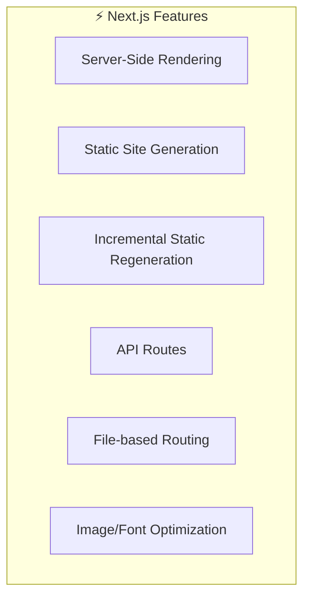
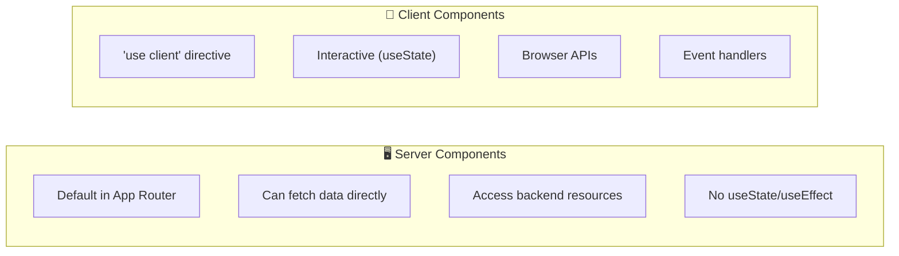
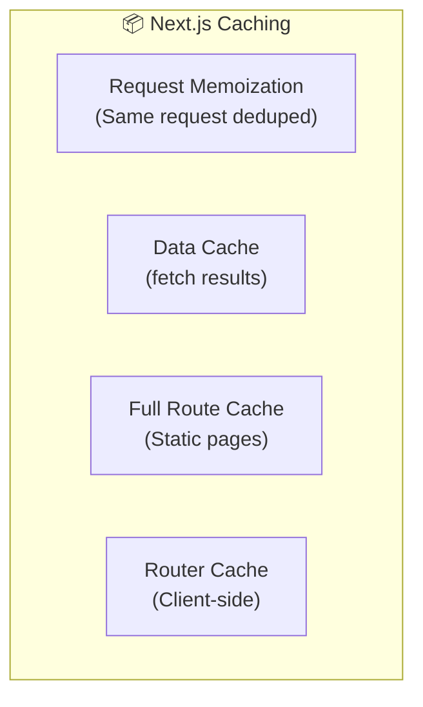

# 📚 Tài Liệu Phỏng Vấn Frontend 2025 - Phần 22

> **Chủ đề**: ⚡ Next.js Complete Guide - Hướng Dẫn Toàn Diện

---

## 📋 Mục Lục

1. [Next.js Overview](#1-nextjs-overview)
2. [App Router vs Pages Router](#2-app-router-vs-pages-router)
3. [Server Components](#3-server-components)
4. [Data Fetching](#4-data-fetching)
5. [Caching & Revalidation](#5-caching--revalidation)
6. [Routing Patterns](#6-routing-patterns)
7. [Middleware](#7-middleware)
8. [API Routes](#8-api-routes)
9. [Deployment & Optimization](#9-deployment--optimization)
10. [Interview Questions](#10-interview-questions)

---

## 1. Next.js Overview

### 1.1 What is Next.js?



### 1.2 Key Features 2024/2025

| Feature                 | Description                     |
| ----------------------- | ------------------------------- |
| **App Router**          | New routing system with layouts |
| **Server Components**   | Components that run on server   |
| **Streaming**           | Progressive UI rendering        |
| **Server Actions**      | Server-side mutations           |
| **Parallel Routes**     | Simultaneous route rendering    |
| **Intercepting Routes** | Modal patterns                  |

---

## 2. App Router vs Pages Router

### 2.1 Comparison

| Feature       | App Router (new)  | Pages Router (legacy) |
| ------------- | ----------------- | --------------------- |
| Folder        | `/app`            | `/pages`              |
| Default       | Server Components | Client Components     |
| Layouts       | Built-in nested   | Manual                |
| Data Fetching | fetch() + cache   | getServerSideProps    |
| Loading UI    | loading.tsx       | Manual                |
| Error UI      | error.tsx         | \_error.tsx           |

### 2.2 App Router Structure

```
📁 app/
├── layout.tsx        # Root layout
├── page.tsx          # Home page (/)
├── loading.tsx       # Loading UI
├── error.tsx         # Error UI
├── not-found.tsx     # 404 page
├── globals.css
│
├── 📁 dashboard/
│   ├── layout.tsx    # Dashboard layout
│   ├── page.tsx      # /dashboard
│   └── loading.tsx   # Dashboard loading
│
├── 📁 blog/
│   ├── page.tsx      # /blog
│   └── 📁 [slug]/
│       └── page.tsx  # /blog/:slug
│
└── 📁 api/
    └── 📁 users/
        └── route.ts  # API: /api/users
```

---

## 3. Server Components

### 3.1 Server vs Client Components



### 3.2 Server Component

```typescript
// app/users/page.tsx (Server Component by default)
async function UsersPage() {
  // Direct database access - runs on server
  const users = await db.user.findMany();

  // Or API fetch
  const res = await fetch("https://api.example.com/users");
  const data = await res.json();

  return (
    <ul>
      {users.map((user) => (
        <li key={user.id}>{user.name}</li>
      ))}
    </ul>
  );
}

export default UsersPage;
```

### 3.3 Client Component

```typescript
"use client"; // Required directive

import { useState } from "react";

export function Counter() {
  const [count, setCount] = useState(0);

  return <button onClick={() => setCount((c) => c + 1)}>Count: {count}</button>;
}
```

### 3.4 Mixing Patterns

```typescript
// Server Component
import { Counter } from "./Counter"; // Client Component

async function Dashboard() {
  const data = await fetchData(); // Server fetch

  return (
    <div>
      <h1>Dashboard</h1>
      <p>Data: {data.value}</p>
      <Counter /> {/* Client Component */}
    </div>
  );
}
```

---

## 4. Data Fetching

### 4.1 Server-Side Fetching

```typescript
// app/posts/page.tsx
async function PostsPage() {
  // Automatic caching and deduplication
  const res = await fetch("https://api.example.com/posts", {
    cache: "force-cache", // Default - Static
    // cache: 'no-store',  // Dynamic - every request
    // next: { revalidate: 60 }, // ISR - every 60s
  });

  const posts = await res.json();
  return <PostList posts={posts} />;
}
```

### 4.2 Parallel Data Fetching

```typescript
async function Dashboard() {
  // Parallel fetches - faster!
  const [users, posts, stats] = await Promise.all([
    fetch("/api/users").then((r) => r.json()),
    fetch("/api/posts").then((r) => r.json()),
    fetch("/api/stats").then((r) => r.json()),
  ]);

  return (
    <>
      <Users data={users} />
      <Posts data={posts} />
      <Stats data={stats} />
    </>
  );
}
```

### 4.3 Server Actions

```typescript
// app/actions.ts
"use server";

export async function createPost(formData: FormData) {
  const title = formData.get("title");
  const content = formData.get("content");

  await db.post.create({
    data: { title, content },
  });

  revalidatePath("/posts");
}

// app/posts/new/page.tsx
import { createPost } from "../actions";

export default function NewPost() {
  return (
    <form action={createPost}>
      <input name="title" />
      <textarea name="content" />
      <button type="submit">Create</button>
    </form>
  );
}
```

---

## 5. Caching & Revalidation

### 5.1 Caching Strategies



### 5.2 Revalidation Options

```typescript
// Time-based revalidation
fetch(url, { next: { revalidate: 3600 } }); // Every hour

// On-demand revalidation
import { revalidatePath, revalidateTag } from "next/cache";

// By path
revalidatePath("/blog");

// By tag
fetch(url, { next: { tags: ["posts"] } });
revalidateTag("posts");
```

### 5.3 Cache Control

```typescript
// Force dynamic rendering
export const dynamic = "force-dynamic";

// Force static rendering
export const dynamic = "force-static";

// Revalidate every 60 seconds
export const revalidate = 60;

// Opt out of caching
export const fetchCache = "force-no-store";
```

---

## 6. Routing Patterns

### 6.1 Dynamic Routes

```typescript
// app/blog/[slug]/page.tsx
interface Props {
  params: { slug: string };
}

export default function BlogPost({ params }: Props) {
  return <div>Post: {params.slug}</div>;
}

// Generate static paths
export async function generateStaticParams() {
  const posts = await getPosts();
  return posts.map((post) => ({ slug: post.slug }));
}
```

### 6.2 Parallel Routes

```
📁 app/
└── 📁 dashboard/
    ├── layout.tsx
    ├── page.tsx
    ├── 📁 @analytics/
    │   └── page.tsx
    └── 📁 @team/
        └── page.tsx
```

```typescript
// app/dashboard/layout.tsx
export default function Layout({
  children,
  analytics,
  team,
}: {
  children: React.ReactNode;
  analytics: React.ReactNode;
  team: React.ReactNode;
}) {
  return (
    <div>
      {children}
      <div className="grid grid-cols-2">
        {analytics}
        {team}
      </div>
    </div>
  );
}
```

### 6.3 Intercepting Routes

```
📁 app/
├── 📁 feed/
│   └── page.tsx
├── 📁 photo/
│   └── 📁 [id]/
│       └── page.tsx
└── 📁 @modal/
    └── 📁 (.)photo/
        └── 📁 [id]/
            └── page.tsx  # Opens as modal
```

### 6.4 Route Groups

```
📁 app/
├── 📁 (marketing)/
│   ├── layout.tsx  # Marketing layout
│   ├── about/
│   └── contact/
└── 📁 (shop)/
    ├── layout.tsx  # Shop layout
    ├── products/
    └── cart/
```

---

## 7. Middleware

### 7.1 Basic Middleware

```typescript
// middleware.ts (root level)
import { NextResponse } from "next/server";
import type { NextRequest } from "next/server";

export function middleware(request: NextRequest) {
  // Check auth
  const token = request.cookies.get("token");

  if (!token && request.nextUrl.pathname.startsWith("/dashboard")) {
    return NextResponse.redirect(new URL("/login", request.url));
  }

  return NextResponse.next();
}

// Apply to specific paths
export const config = {
  matcher: ["/dashboard/:path*", "/api/:path*"],
};
```

### 7.2 Common Use Cases

```typescript
// Geolocation redirect
export function middleware(request: NextRequest) {
  const country = request.geo?.country || "US";

  if (country === "VN") {
    return NextResponse.redirect(new URL("/vi", request.url));
  }
}

// Add headers
export function middleware(request: NextRequest) {
  const response = NextResponse.next();
  response.headers.set("x-custom-header", "value");
  return response;
}

// Rate limiting
const rateLimit = new Map();

export function middleware(request: NextRequest) {
  const ip = request.ip || "127.0.0.1";
  const count = rateLimit.get(ip) || 0;

  if (count > 100) {
    return new NextResponse("Too Many Requests", { status: 429 });
  }

  rateLimit.set(ip, count + 1);
  return NextResponse.next();
}
```

---

## 8. API Routes

### 8.1 Route Handlers

```typescript
// app/api/users/route.ts
import { NextRequest, NextResponse } from "next/server";

export async function GET(request: NextRequest) {
  const users = await db.user.findMany();
  return NextResponse.json(users);
}

export async function POST(request: NextRequest) {
  const body = await request.json();
  const user = await db.user.create({ data: body });
  return NextResponse.json(user, { status: 201 });
}
```

### 8.2 Dynamic API Routes

```typescript
// app/api/users/[id]/route.ts
interface Context {
  params: { id: string };
}

export async function GET(request: NextRequest, { params }: Context) {
  const user = await db.user.findUnique({
    where: { id: params.id },
  });

  if (!user) {
    return NextResponse.json({ error: "Not found" }, { status: 404 });
  }

  return NextResponse.json(user);
}

export async function DELETE(request: NextRequest, { params }: Context) {
  await db.user.delete({ where: { id: params.id } });
  return new NextResponse(null, { status: 204 });
}
```

---

## 9. Deployment & Optimization

### 9.1 Image Optimization

```typescript
import Image from "next/image";

export function Avatar({ src, alt }: { src: string; alt: string }) {
  return (
    <Image
      src={src}
      alt={alt}
      width={100}
      height={100}
      placeholder="blur"
      blurDataURL="/placeholder.png"
      priority // Load immediately
    />
  );
}
```

### 9.2 Font Optimization

```typescript
// app/layout.tsx
import { Inter } from "next/font/google";

const inter = Inter({
  subsets: ["latin"],
  display: "swap",
});

export default function RootLayout({ children }) {
  return (
    <html lang="en" className={inter.className}>
      <body>{children}</body>
    </html>
  );
}
```

### 9.3 Metadata

```typescript
// app/layout.tsx
import type { Metadata } from "next";

export const metadata: Metadata = {
  title: {
    default: "My App",
    template: "%s | My App",
  },
  description: "Description here",
  openGraph: {
    title: "My App",
    images: ["/og-image.png"],
  },
};

// app/blog/[slug]/page.tsx
export async function generateMetadata({ params }): Promise<Metadata> {
  const post = await getPost(params.slug);
  return {
    title: post.title,
    description: post.excerpt,
  };
}
```

---

## 10. Interview Questions

<details>
<summary><strong>Q: SSR vs SSG vs ISR?</strong></summary>

**SSR (Server-Side Rendering):**

- Render on each request
- Always fresh data
- Slower TTFB

**SSG (Static Site Generation):**

- Render at build time
- Fastest, cached
- Stale data possible

**ISR (Incremental Static Regeneration):**

- Static with revalidation
- Best of both worlds
- `revalidate: 60`

</details>

<details>
<summary><strong>Q: Server vs Client Components?</strong></summary>

**Server Components:**

- Default in App Router
- Run only on server
- Can access DB directly
- No useState/useEffect
- Smaller bundle

**Client Components:**

- Use `'use client'`
- Interactive (hooks)
- Event handlers
- Browser APIs

</details>

<details>
<summary><strong>Q: When to use Server Actions?</strong></summary>

- Form submissions
- Data mutations
- Replace API routes for simple operations
- Can revalidate cache inline

</details>

<details>
<summary><strong>Q: Next.js caching layers?</strong></summary>

1. **Request Memoization** - Dedupe same requests
2. **Data Cache** - Cached fetch results
3. **Full Route Cache** - Static page HTML
4. **Router Cache** - Client-side cache

</details>

<details>
<summary><strong>Q: App Router benefits?</strong></summary>

- Nested layouts
- Server Components default
- Streaming & Suspense
- Parallel/Intercepting routes
- Better loading/error states
- Simplified data fetching

</details>

---

## 📊 Quick Reference

```
App Router File Conventions:
├── page.tsx      → Route UI
├── layout.tsx    → Shared layout
├── loading.tsx   → Loading UI
├── error.tsx     → Error UI
├── not-found.tsx → 404 UI
├── route.ts      → API endpoint
└── template.tsx  → Re-render layout

Data Fetching:
├── Server Components → async/await fetch
├── Client Components → useEffect or SWR/React Query
└── Server Actions    → 'use server' functions

Caching:
├── cache: 'force-cache' → Static (default)
├── cache: 'no-store'    → Dynamic
└── next: { revalidate } → ISR
```

---

> **Chúc bạn phỏng vấn thành công! 🎉**
>
> _Tài liệu được tạo: 24/12/2025_
