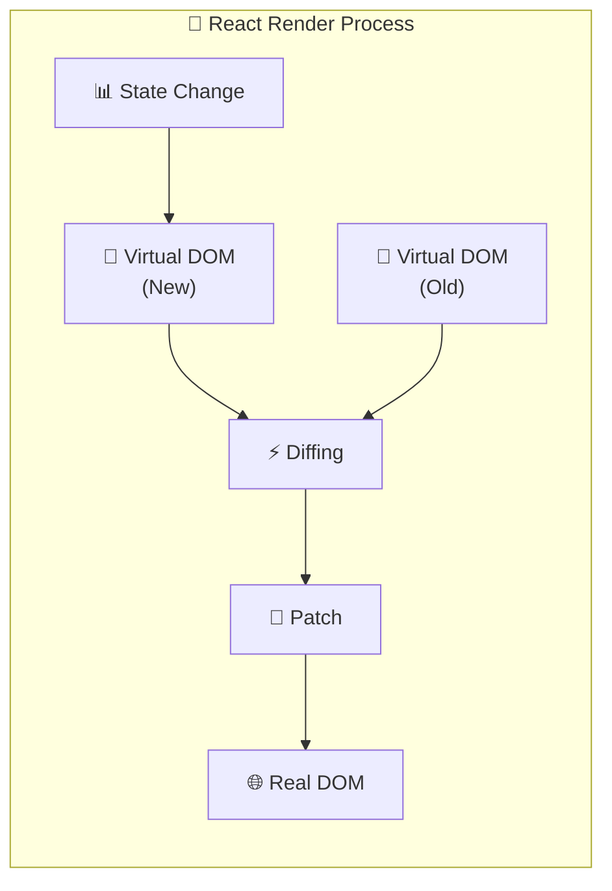
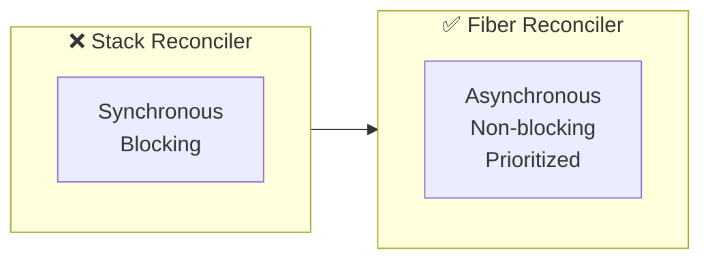
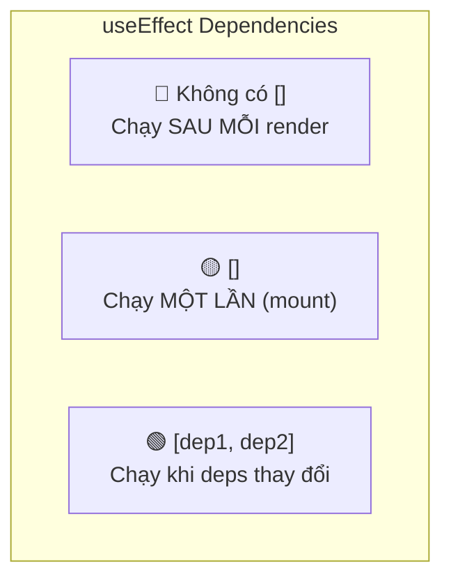
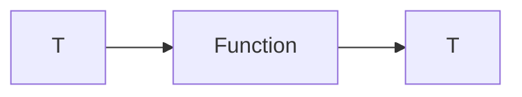
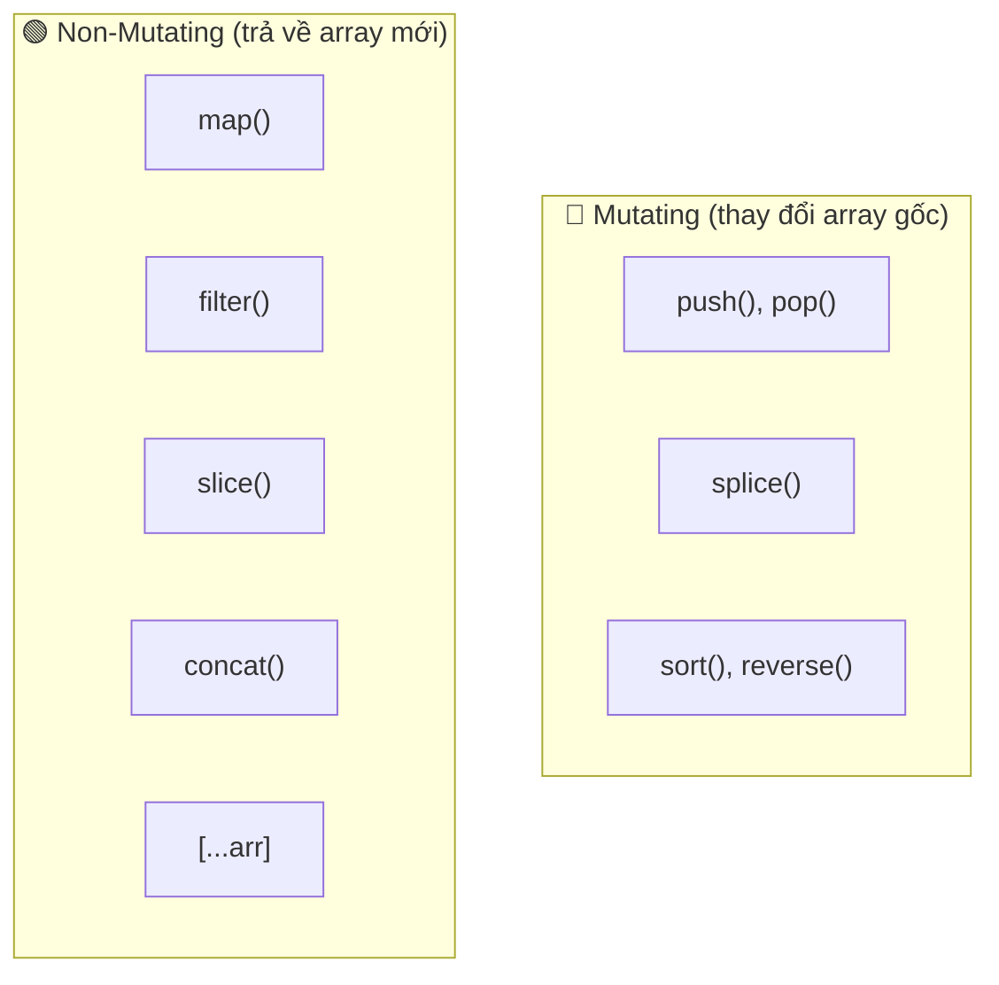
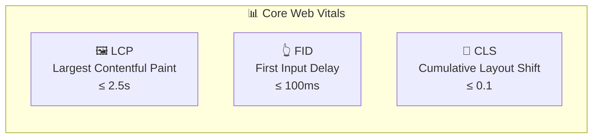
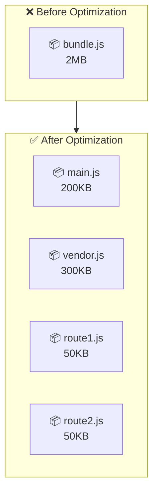
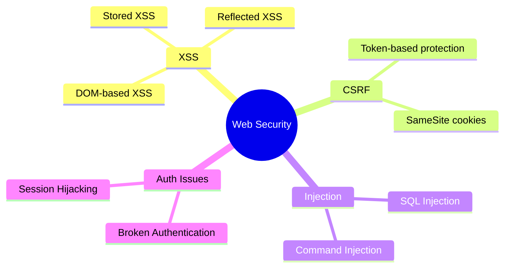
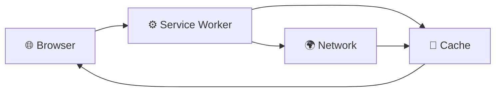
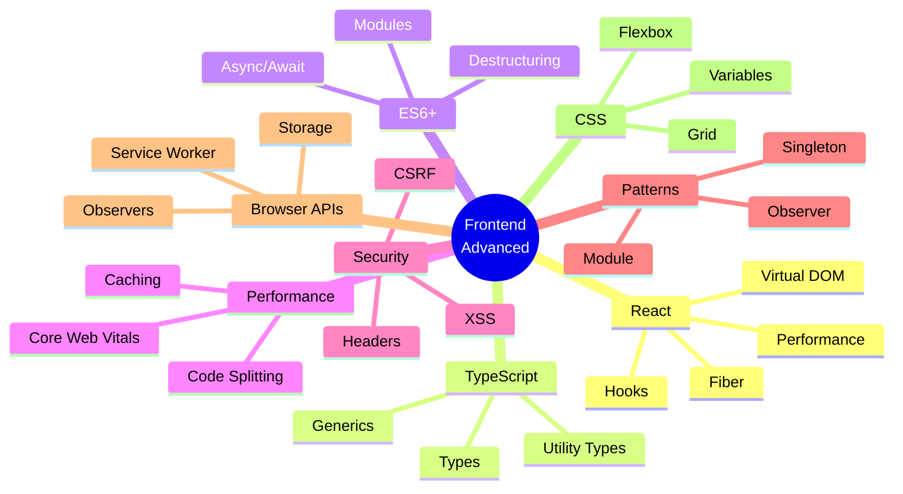

# 📚 Tài Liệu Phỏng Vấn Frontend 2025 - Phần 2

> **Chủ đề**: React, TypeScript, ES6+, Web Performance, Security & Modern CSS

---

## 📋 Mục Lục

1. [React Core Concepts](#1-react-core-concepts)
2. [React Hooks Deep Dive](#2-react-hooks-deep-dive)
3. [TypeScript Essentials](#3-typescript-essentials)
4. [ES6+ Modern Features](#4-es6-modern-features)
5. [Web Performance Optimization](#5-web-performance-optimization)
6. [Web Security](#6-web-security)
7. [Design Patterns trong JavaScript](#7-design-patterns-trong-javascript)
8. [Browser APIs quan trọng](#8-browser-apis-quan-trọng)
9. [Modern CSS & Layout](#9-modern-css--layout)
10. [Câu Hỏi Phỏng Vấn](#10-câu-hỏi-phỏng-vấn)

---

## 1. React Core Concepts

### 1.1 Virtual DOM

**Virtual DOM** là một bản sao nhẹ của Real DOM được lưu trong memory. React sử dụng nó để tối ưu hiệu năng render.



### 1.2 Reconciliation Algorithm

| Bước                | Mô Tả                                          |
| ------------------- | ---------------------------------------------- |
| 1️⃣ **Diffing**      | So sánh Virtual DOM cũ và mới                  |
| 2️⃣ **Key Matching** | Sử dụng `key` để identify elements trong lists |
| 3️⃣ **Batching**     | Gom nhóm nhiều updates thành một               |
| 4️⃣ **Commit**       | Áp dụng changes vào Real DOM                   |

### 1.3 Component Lifecycle (Class vs Hooks)

```mermaid
flowchart TB
    subgraph Mounting["🚀 Mounting"]
        constructor["constructor()"]
        render1["render()"]
        componentDidMount["componentDidMount()<br/>≈ useEffect(() => {}, [])"]
    end

    subgraph Updating["🔄 Updating"]
        shouldUpdate["shouldComponentUpdate()<br/>≈ React.memo()"]
        render2["render()"]
        componentDidUpdate["componentDidUpdate()<br/>≈ useEffect(() => {}, [deps])"]
    end

    subgraph Unmounting["💀 Unmounting"]
        componentWillUnmount["componentWillUnmount()<br/>≈ useEffect cleanup"]
    end

    Mounting --> Updating --> Unmounting
```

### 1.4 React Fiber

**React Fiber** là thuật toán reconciliation mới (React 16+) cho phép:

- **Incremental Rendering**: Chia nhỏ render work thành chunks
- **Prioritization**: Ưu tiên updates quan trọng (user input > animations)
- **Pause/Resume**: Có thể pause và resume render work



---

## 2. React Hooks Deep Dive

### 2.1 useState vs useReducer

```javascript
// useState - Simple state
const [count, setCount] = useState(0);

// useReducer - Complex state logic
const reducer = (state, action) => {
  switch (action.type) {
    case "INCREMENT":
      return { count: state.count + 1 };
    case "DECREMENT":
      return { count: state.count - 1 };
    default:
      return state;
  }
};
const [state, dispatch] = useReducer(reducer, { count: 0 });
```

| Tiêu Chí       | useState        | useReducer             |
| -------------- | --------------- | ---------------------- |
| **Complexity** | Simple state    | Complex state logic    |
| **Updates**    | Direct value    | Actions + Reducer      |
| **Testing**    | Harder          | Easier (pure function) |
| **Use case**   | Toggle, counter | Form, shopping cart    |

### 2.2 useEffect Dependencies



```javascript
// ❌ Chạy sau MỖI render - Có thể gây infinite loop
useEffect(() => {
  fetchData();
});

// ✅ Chạy MỘT LẦN khi mount
useEffect(() => {
  fetchData();
}, []);

// ✅ Chạy khi userId thay đổi
useEffect(() => {
  fetchUser(userId);
}, [userId]);

// ✅ Cleanup function
useEffect(() => {
  const subscription = subscribe();
  return () => subscription.unsubscribe(); // Cleanup
}, []);
```

### 2.3 useMemo vs useCallback

```javascript
// useMemo - Memoize VALUE
const expensiveValue = useMemo(() => {
  return computeExpensive(a, b);
}, [a, b]);

// useCallback - Memoize FUNCTION
const handleClick = useCallback(() => {
  doSomething(a, b);
}, [a, b]);

// useCallback là shorthand của:
const handleClick = useMemo(() => {
  return () => doSomething(a, b);
}, [a, b]);
```

> [!WARNING]
> Đừng lạm dụng `useMemo`/`useCallback`! Chỉ sử dụng khi thực sự cần thiết vì chúng cũng có overhead.

### 2.4 useRef Use Cases

```javascript
// 1️⃣ Access DOM element
const inputRef = useRef(null);
inputRef.current.focus();

// 2️⃣ Store mutable value (không gây re-render)
const renderCount = useRef(0);
renderCount.current += 1; // Không re-render!

// 3️⃣ Store previous value
const prevValue = useRef(value);
useEffect(() => {
  prevValue.current = value;
}, [value]);

// 4️⃣ Store timeout/interval ID
const timerRef = useRef(null);
timerRef.current = setTimeout(() => {}, 1000);
clearTimeout(timerRef.current);
```

### 2.5 Custom Hooks Pattern

```javascript
// Custom hook for data fetching
function useFetch(url) {
  const [data, setData] = useState(null);
  const [loading, setLoading] = useState(true);
  const [error, setError] = useState(null);

  useEffect(() => {
    const abortController = new AbortController();

    async function fetchData() {
      try {
        setLoading(true);
        const response = await fetch(url, {
          signal: abortController.signal,
        });
        const json = await response.json();
        setData(json);
      } catch (err) {
        if (err.name !== "AbortError") {
          setError(err);
        }
      } finally {
        setLoading(false);
      }
    }

    fetchData();
    return () => abortController.abort(); // Cleanup
  }, [url]);

  return { data, loading, error };
}

// Usage
const { data, loading, error } = useFetch("/api/users");
```

---

## 3. TypeScript Essentials

### 3.1 Basic Types

```typescript
// Primitive types
let name: string = "John";
let age: number = 30;
let isActive: boolean = true;

// Arrays
let numbers: number[] = [1, 2, 3];
let names: Array<string> = ["a", "b"];

// Tuple
let tuple: [string, number] = ["hello", 10];

// Enum
enum Status {
  Pending = "PENDING",
  Active = "ACTIVE",
  Inactive = "INACTIVE",
}

// Any vs Unknown
let anyValue: any = "hello"; // ❌ Bypass type checking
let unknownValue: unknown = "hello"; // ✅ Must type-check before use
```

### 3.2 Interface vs Type

```typescript
// Interface - Extendable, for objects
interface User {
  id: number;
  name: string;
  email?: string; // Optional
  readonly createdAt: Date; // Immutable
}

// Extending interface
interface Admin extends User {
  permissions: string[];
}

// Type - More flexible, for unions/intersections
type Status = "pending" | "active" | "inactive";
type Response = User | Error;
type UserWithMeta = User & { metadata: object };

// Declaration merging (chỉ Interface)
interface User {
  avatar?: string; // Merge với User interface ở trên
}
```

### 3.3 Generics



```typescript
// Generic function
function identity<T>(arg: T): T {
  return arg;
}

// Generic interface
interface ApiResponse<T> {
  data: T;
  status: number;
  message: string;
}

// Generic with constraints
interface HasLength {
  length: number;
}

function logLength<T extends HasLength>(arg: T): void {
  console.log(arg.length);
}

logLength("hello"); // ✅ string has length
logLength([1, 2, 3]); // ✅ array has length
logLength(123); // ❌ number doesn't have length
```

### 3.4 Utility Types

| Type           | Mô Tả                            | Ví Dụ                        |
| -------------- | -------------------------------- | ---------------------------- |
| `Partial<T>`   | Tất cả properties thành optional | `Partial<User>`              |
| `Required<T>`  | Tất cả properties thành required | `Required<User>`             |
| `Pick<T, K>`   | Chọn một số properties           | `Pick<User, 'id' \| 'name'>` |
| `Omit<T, K>`   | Loại bỏ một số properties        | `Omit<User, 'password'>`     |
| `Record<K, V>` | Tạo object type                  | `Record<string, number>`     |
| `Readonly<T>`  | Tất cả properties readonly       | `Readonly<User>`             |

```typescript
interface User {
  id: number;
  name: string;
  email: string;
  password: string;
}

// Partial - for update operations
function updateUser(id: number, updates: Partial<User>) {
  // updates.name is optional
}

// Pick - for specific fields
type UserPreview = Pick<User, "id" | "name">;

// Omit - for API responses
type SafeUser = Omit<User, "password">;
```

---

## 4. ES6+ Modern Features

### 4.1 Destructuring & Spread

```javascript
// Object destructuring
const { name, age, city = "Unknown" } = user;

// Array destructuring
const [first, second, ...rest] = array;

// Spread operator
const newObj = { ...obj1, ...obj2 };
const newArr = [...arr1, ...arr2];

// Rest parameters
function sum(...numbers) {
  return numbers.reduce((a, b) => a + b, 0);
}
```

### 4.2 Optional Chaining & Nullish Coalescing

```javascript
// Optional Chaining (?.)
const street = user?.address?.street; // undefined nếu null/undefined

// Nullish Coalescing (??)
const name = user.name ?? "Anonymous"; // Chỉ fallback khi null/undefined

// So sánh với ||
const count = 0;
count || 10; // 10 (0 is falsy)
count ?? 10; // 0 (0 is NOT nullish)
```

### 4.3 Array Methods



```javascript
const users = [
  { name: "A", age: 20 },
  { name: "B", age: 30 },
];

// map - Transform
const names = users.map((u) => u.name); // ['A', 'B']

// filter - Filter
const adults = users.filter((u) => u.age >= 21); // [{ name: 'B', age: 30 }]

// find - Find first match
const user = users.find((u) => u.name === "A"); // { name: 'A', age: 20 }

// reduce - Aggregate
const totalAge = users.reduce((sum, u) => sum + u.age, 0); // 50

// some / every
users.some((u) => u.age > 25); // true (at least one)
users.every((u) => u.age > 25); // false (all must match)

// flatMap (ES2019)
const nested = [
  [1, 2],
  [3, 4],
];
nested.flatMap((x) => x); // [1, 2, 3, 4]
```

### 4.4 ES2020+ Features

```javascript
// Optional Chaining (ES2020)
obj?.prop?.method?.();

// Nullish Coalescing (ES2020)
value ?? defaultValue;

// Promise.allSettled (ES2020)
await Promise.allSettled([p1, p2, p3]);

// Logical Assignment (ES2021)
x ||= y; // x = x || y
x &&= y; // x = x && y
x ??= y; // x = x ?? y

// String replaceAll (ES2021)
"aabbcc".replaceAll("a", "x"); // "xxbbcc"

// Array.at() (ES2022)
arr.at(-1); // Last element

// Top-level await (ES2022)
const data = await fetch("/api");
```

---

## 5. Web Performance Optimization

### 5.1 Core Web Vitals



### 5.2 Optimization Strategies

| Technique              | Mô Tả                       | Impact      |
| ---------------------- | --------------------------- | ----------- |
| **Code Splitting**     | Lazy load components/routes | LCP, TTI    |
| **Image Optimization** | WebP, lazy loading, srcset  | LCP         |
| **Minification**       | Giảm size JS/CSS            | Load time   |
| **Caching**            | Browser cache, CDN          | All metrics |
| **Tree Shaking**       | Loại bỏ unused code         | Bundle size |

### 5.3 React Performance

```javascript
// 1️⃣ React.memo - Prevent unnecessary re-renders
const MemoizedComponent = React.memo(({ value }) => {
  return <div>{value}</div>;
});

// 2️⃣ Code Splitting với lazy
const LazyComponent = React.lazy(() => import("./HeavyComponent"));

// 3️⃣ Virtualization cho long lists
import { FixedSizeList } from "react-window";

<FixedSizeList height={400} itemCount={10000} itemSize={35}>
  {({ index, style }) => <div style={style}>Row {index}</div>}
</FixedSizeList>;

// 4️⃣ Debounce expensive operations
const debouncedSearch = useMemo(
  () => debounce((query) => search(query), 300),
  []
);
```

### 5.4 Bundle Optimization



---

## 6. Web Security

### 6.1 Common Vulnerabilities



### 6.2 XSS Prevention

```javascript
// ❌ VULNERABLE - Direct HTML insertion
element.innerHTML = userInput;

// ✅ SAFE - Use textContent
element.textContent = userInput;

// ✅ SAFE - React auto-escapes
return <div>{userInput}</div>;

// ⚠️ DANGEROUS - dangerouslySetInnerHTML
return <div dangerouslySetInnerHTML={{ __html: sanitizedHtml }} />;

// ✅ Sanitize with DOMPurify
import DOMPurify from "dompurify";
const clean = DOMPurify.sanitize(dirtyHtml);
```

### 6.3 CSRF Protection

```javascript
// 1️⃣ CSRF Token
fetch("/api/action", {
  method: "POST",
  headers: {
    "X-CSRF-Token": csrfToken, // From meta tag or cookie
  },
});

// 2️⃣ SameSite Cookies
// Set-Cookie: session=abc123; SameSite=Strict; Secure; HttpOnly
```

### 6.4 Security Headers

| Header                      | Mục Đích                                        |
| --------------------------- | ----------------------------------------------- |
| `Content-Security-Policy`   | Ngăn XSS, chỉ load resources từ trusted sources |
| `X-Frame-Options`           | Ngăn Clickjacking                               |
| `X-Content-Type-Options`    | Ngăn MIME sniffing                              |
| `Strict-Transport-Security` | Force HTTPS                                     |

---

## 7. Design Patterns trong JavaScript

### 7.1 Module Pattern

```javascript
// IIFE Module (ES5)
const Calculator = (function () {
  let result = 0; // Private

  return {
    add: (x) => {
      result += x;
      return this;
    },
    getResult: () => result,
  };
})();

// ES6 Modules
// math.js
export const add = (a, b) => a + b;
export default class Calculator {}

// app.js
import Calculator, { add } from "./math.js";
```

### 7.2 Singleton Pattern

```javascript
class Database {
  static instance = null;

  constructor() {
    if (Database.instance) {
      return Database.instance;
    }
    Database.instance = this;
    this.connection = this.connect();
  }

  connect() {
    console.log("Connecting to database...");
    return { connected: true };
  }
}

const db1 = new Database();
const db2 = new Database();
console.log(db1 === db2); // true
```

### 7.3 Observer Pattern (Pub/Sub)

```javascript
class EventEmitter {
  constructor() {
    this.events = {};
  }

  on(event, callback) {
    if (!this.events[event]) {
      this.events[event] = [];
    }
    this.events[event].push(callback);
    return () => this.off(event, callback); // Return unsubscribe
  }

  off(event, callback) {
    this.events[event] = this.events[event]?.filter((cb) => cb !== callback);
  }

  emit(event, data) {
    this.events[event]?.forEach((cb) => cb(data));
  }
}

// Usage
const emitter = new EventEmitter();
const unsubscribe = emitter.on("userLogin", (user) => {
  console.log("User logged in:", user);
});
emitter.emit("userLogin", { name: "John" });
unsubscribe(); // Cleanup
```

### 7.4 Factory Pattern

```javascript
class UserFactory {
  static createUser(type, data) {
    switch (type) {
      case "admin":
        return new Admin(data);
      case "customer":
        return new Customer(data);
      case "guest":
        return new Guest(data);
      default:
        throw new Error(`Unknown user type: ${type}`);
    }
  }
}

const admin = UserFactory.createUser("admin", { name: "John" });
const guest = UserFactory.createUser("guest", {});
```

---

## 8. Browser APIs quan trọng

### 8.1 Web Storage

```javascript
// localStorage - Persistent
localStorage.setItem("user", JSON.stringify({ name: "John" }));
const user = JSON.parse(localStorage.getItem("user"));
localStorage.removeItem("user");
localStorage.clear();

// sessionStorage - Per tab, cleared on close
sessionStorage.setItem("tempData", "value");

// Comparison
// | Feature        | localStorage | sessionStorage | Cookies      |
// |----------------|--------------|----------------|--------------|
// | Capacity       | 5-10 MB      | 5-10 MB        | 4 KB         |
// | Expires        | Never        | Tab close      | Configurable |
// | Sent to server | No           | No             | Yes (auto)   |
```

### 8.2 Intersection Observer

```javascript
// Lazy loading images, infinite scroll, animations
const observer = new IntersectionObserver(
  (entries) => {
    entries.forEach((entry) => {
      if (entry.isIntersecting) {
        entry.target.src = entry.target.dataset.src; // Lazy load
        observer.unobserve(entry.target);
      }
    });
  },
  {
    threshold: 0.1, // 10% visible
    rootMargin: "100px", // Start loading 100px before visible
  }
);

document.querySelectorAll("img[data-src]").forEach((img) => {
  observer.observe(img);
});
```

### 8.3 Service Workers & PWA



```javascript
// Register service worker
if ("serviceWorker" in navigator) {
  navigator.serviceWorker.register("/sw.js");
}

// sw.js - Cache First strategy
self.addEventListener("fetch", (event) => {
  event.respondWith(
    caches.match(event.request).then((cached) => {
      return cached || fetch(event.request);
    })
  );
});
```

### 8.4 Web Workers

```javascript
// main.js
const worker = new Worker("worker.js");

worker.postMessage({ data: largeArray });

worker.onmessage = (event) => {
  console.log("Result:", event.data);
};

// worker.js
self.onmessage = (event) => {
  const result = heavyComputation(event.data);
  self.postMessage(result);
};
```

---

## 9. Modern CSS & Layout

### 9.1 Flexbox

```css
.container {
  display: flex;
  flex-direction: row; /* row | column */
  justify-content: center; /* main axis */
  align-items: center; /* cross axis */
  gap: 1rem;
  flex-wrap: wrap;
}

.item {
  flex: 1; /* flex-grow: 1, flex-shrink: 1, flex-basis: 0 */
  /* OR */
  flex-grow: 1; /* Nở ra chiếm không gian thừa */
  flex-shrink: 0; /* Không co lại */
  flex-basis: 200px; /* Kích thước mặc định */
}
```

### 9.2 CSS Grid

```css
.grid-container {
  display: grid;
  grid-template-columns: repeat(3, 1fr);
  grid-template-rows: auto;
  gap: 1rem;
}

/* Responsive breakpoints */
.grid-container {
  grid-template-columns: repeat(auto-fit, minmax(250px, 1fr));
}

/* Grid areas */
.layout {
  display: grid;
  grid-template-areas:
    "header header"
    "sidebar main"
    "footer footer";
  grid-template-columns: 200px 1fr;
}
.header {
  grid-area: header;
}
.sidebar {
  grid-area: sidebar;
}
.main {
  grid-area: main;
}
.footer {
  grid-area: footer;
}
```

### 9.3 CSS Variables & Modern Features

```css
:root {
  --primary-color: #3498db;
  --spacing-unit: 8px;
  --font-size-base: 16px;
}

.button {
  background: var(--primary-color);
  padding: calc(var(--spacing-unit) * 2);

  /* Container queries (2023+) */
  container-type: inline-size;
}

@container (min-width: 400px) {
  .card {
    flex-direction: row;
  }
}

/* :has() selector (2023+) */
.card:has(.featured-badge) {
  border: 2px solid gold;
}
```

---

## 10. Câu Hỏi Phỏng Vấn

### 10.1 React

<details>
<summary><strong>Q: Controlled vs Uncontrolled Components?</strong></summary>

**A:**

- **Controlled**: React controls the value via state (`value={state}`, `onChange`)
- **Uncontrolled**: DOM controls the value, access via `ref`

```javascript
// Controlled
<input value={value} onChange={e => setValue(e.target.value)} />

// Uncontrolled
<input ref={inputRef} defaultValue="initial" />
```

</details>

<details>
<summary><strong>Q: Tại sao cần key trong lists?</strong></summary>

**A:** `key` giúp React identify elements để optimize re-rendering. Không dùng `key` hoặc dùng `index` làm `key` có thể gây bugs khi reorder/delete items.

</details>

<details>
<summary><strong>Q: useEffect vs useLayoutEffect?</strong></summary>

**A:**

- `useEffect`: Chạy **sau** render và paint (async, non-blocking)
- `useLayoutEffect`: Chạy **trước** paint (sync, blocking) - dùng cho DOM measurements

</details>

### 10.2 TypeScript

<details>
<summary><strong>Q: any vs unknown vs never?</strong></summary>

**A:**

- `any`: Bypass type checking (không nên dùng)
- `unknown`: Type-safe any, phải check trước khi dùng
- `never`: Không bao giờ xảy ra (exhaustive checks, throw)

</details>

### 10.3 Performance

<details>
<summary><strong>Q: Làm sao optimize React app?</strong></summary>

**A:**

1. `React.memo()` cho pure components
2. `useMemo`/`useCallback` cho expensive computations
3. Code splitting với `React.lazy()`
4. Virtualization cho long lists
5. Avoid inline objects/functions as props
6. Use production build

</details>

### 10.4 Security

<details>
<summary><strong>Q: XSS là gì và cách phòng tránh?</strong></summary>

**A:** XSS (Cross-Site Scripting) là attack inject malicious scripts.

**Phòng tránh:**

1. Escape user input
2. Use `textContent` instead of `innerHTML`
3. Content Security Policy headers
4. Sanitize với DOMPurify nếu cần HTML

</details>

---

## 📊 Tổng Kết



---

## 📚 Tài Liệu Tham Khảo

- [React Documentation](https://react.dev/)
- [TypeScript Handbook](https://www.typescriptlang.org/docs/)
- [web.dev - Core Web Vitals](https://web.dev/vitals/)
- [OWASP Top 10](https://owasp.org/www-project-top-ten/)
- [MDN Web Docs](https://developer.mozilla.org/)

---

> **Chúc bạn phỏng vấn thành công! 🎉**
>
> _Tài liệu được tạo: 23/12/2025_
