# 📚 Tài Liệu Phỏng Vấn Frontend 2025 - Phần 3

> **Chủ đề**: System Design, Next.js, Data Structures, Testing & Soft Skills

---

## 📋 Mục Lục

1. [Frontend System Design](#1-frontend-system-design)
2. [Next.js Deep Dive](#2-nextjs-deep-dive)
3. [Data Structures cho Frontend](#3-data-structures-cho-frontend)
4. [Algorithms thường gặp](#4-algorithms-thường-gặp)
5. [Testing Strategies](#5-testing-strategies)
6. [State Management](#6-state-management)
7. [API & Data Fetching](#7-api--data-fetching)
8. [Behavioral Interview Questions](#8-behavioral-interview-questions)
9. [Coding Challenge Tips](#9-coding-challenge-tips)
10. [Tổng Hợp Câu Hỏi Phỏng Vấn](#10-tổng-hợp-câu-hỏi-phỏng-vấn)

---

## 1. Frontend System Design

### 1.1 Các Bước Tiếp Cận System Design

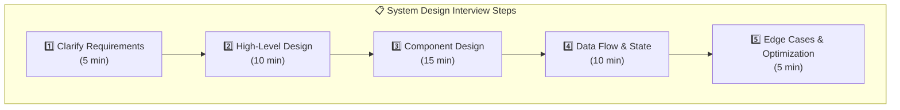

### 1.2 Câu Hỏi Cần Hỏi Interviewer

| Loại            | Ví Dụ Câu Hỏi                                   |
| --------------- | ----------------------------------------------- |
| **Users**       | Bao nhiêu concurrent users? Mobile hay Desktop? |
| **Features**    | MVP features nào? Prioritize thế nào?           |
| **Performance** | Target load time? Offline support?              |
| **Scale**       | Amount of data? Growth expectations?            |
| **Integration** | Existing APIs? Third-party services?            |

### 1.3 Component Architecture

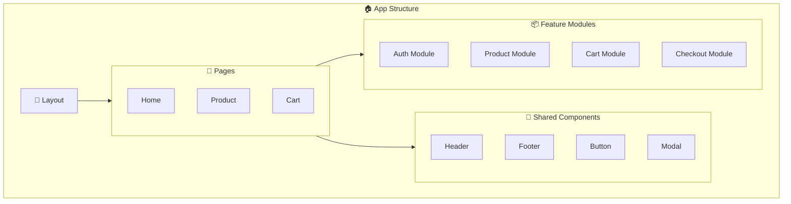

### 1.4 Ví Dụ: Design E-commerce Product Page

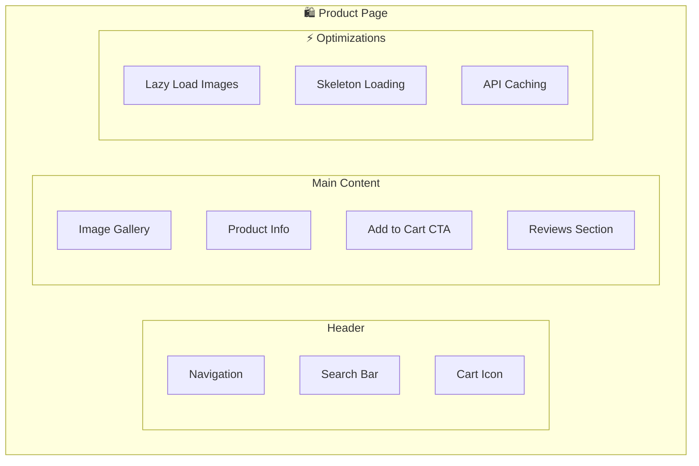

**Key Decisions:**

- **Image Gallery**: Lazy loading, WebP format, srcset cho responsive
- **State**: Product data trong React Query cache
- **SEO**: SSR/SSG với Next.js cho product pages
- **Performance**: Critical CSS inline, font preloading

---

## 2. Next.js Deep Dive

### 2.1 Rendering Strategies

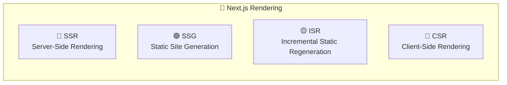

| Strategy | Khi Nào Dùng          | Performance | SEO     |
| -------- | --------------------- | ----------- | ------- |
| **SSG**  | Static content, blogs | ⭐⭐⭐ Best | ⭐⭐⭐  |
| **ISR**  | E-commerce products   | ⭐⭐⭐ Best | ⭐⭐⭐  |
| **SSR**  | Personalized content  | ⭐⭐ Good   | ⭐⭐⭐  |
| **CSR**  | Dashboards, auth-only | ⭐ Depends  | ⭐ Poor |

### 2.2 App Router vs Pages Router

```javascript
// 📁 App Router (Next.js 13+)
// app/products/[id]/page.tsx
export default async function ProductPage({ params }) {
  const product = await getProduct(params.id);
  return <ProductView product={product} />;
}

// Server Components by default
// Use 'use client' for client components

// 📁 Pages Router (Legacy)
// pages/products/[id].tsx
export async function getServerSideProps({ params }) {
  const product = await getProduct(params.id);
  return { props: { product } };
}

export default function ProductPage({ product }) {
  return <ProductView product={product} />;
}
```

### 2.3 Server Components vs Client Components

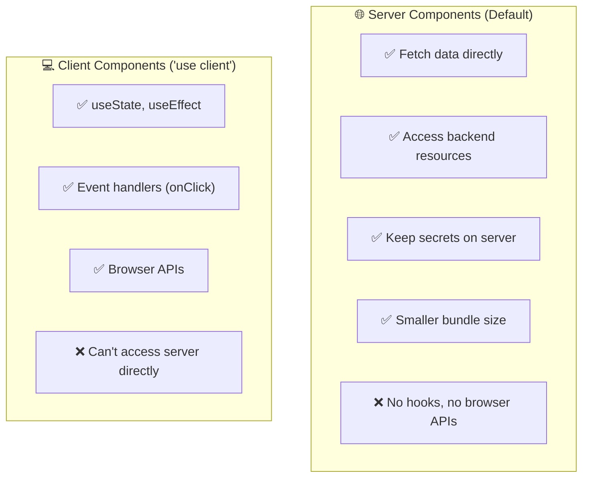

### 2.4 Data Fetching Patterns

```javascript
// 1️⃣ Server Component - Direct fetch
async function ProductList() {
  const products = await fetch("https://api.example.com/products", {
    next: { revalidate: 3600 }, // ISR: revalidate every hour
  });
  return (
    <ul>
      {products.map((p) => (
        <li key={p.id}>{p.name}</li>
      ))}
    </ul>
  );
}

// 2️⃣ Route Handlers (API Routes)
// app/api/products/route.ts
export async function GET() {
  const products = await db.products.findMany();
  return Response.json(products);
}

// 3️⃣ Server Actions (Form submissions)
// app/actions.ts
("use server");
export async function createProduct(formData: FormData) {
  const product = await db.products.create({
    data: { name: formData.get("name") },
  });
  revalidatePath("/products");
}
```

### 2.5 Caching Layers

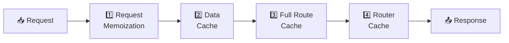

---

## 3. Data Structures cho Frontend

### 3.1 Array vs Object vs Map vs Set

```javascript
// Array - Ordered list
const arr = [1, 2, 3];
arr.push(4); // O(1)
arr.includes(2); // O(n)
arr.indexOf(2); // O(n)

// Object - Key-value pairs (string keys)
const obj = { a: 1, b: 2 };
obj.c = 3; // O(1)
"a" in obj; // O(1)

// Map - Key-value (any key type, ordered)
const map = new Map();
map.set(obj, "value"); // Object as key!
map.get(obj); // O(1)
map.size; // Direct property

// Set - Unique values
const set = new Set([1, 2, 2, 3]); // {1, 2, 3}
set.has(2); // O(1) - faster than array.includes!
set.add(4); // O(1)
```

### 3.2 Khi Nào Dùng Gì?

| Use Case             | Best Choice         | Lý Do                   |
| -------------------- | ------------------- | ----------------------- |
| List items với index | `Array`             | Ordered, index access   |
| Unique values        | `Set`               | Auto-dedup, O(1) lookup |
| Config/settings      | `Object`            | Simple key-value        |
| Cache với expiry     | `Map`               | Any key type, ordered   |
| Counting occurrences | `Map`               | Number keys             |
| Quick lookup by ID   | `Object` hoặc `Map` | O(1) access             |

### 3.3 Ví Dụ Thực Tế

```javascript
// 1️⃣ Remove duplicates
const unique = [...new Set(array)];

// 2️⃣ Count occurrences
const counts = array.reduce((map, item) => {
  map.set(item, (map.get(item) || 0) + 1);
  return map;
}, new Map());

// 3️⃣ LRU Cache với Map (maintains insertion order)
class LRUCache {
  constructor(capacity) {
    this.capacity = capacity;
    this.cache = new Map();
  }

  get(key) {
    if (!this.cache.has(key)) return -1;
    const value = this.cache.get(key);
    this.cache.delete(key);
    this.cache.set(key, value); // Move to end
    return value;
  }

  put(key, value) {
    if (this.cache.has(key)) this.cache.delete(key);
    this.cache.set(key, value);
    if (this.cache.size > this.capacity) {
      this.cache.delete(this.cache.keys().next().value); // Delete oldest
    }
  }
}
```

---

## 4. Algorithms Thường Gặp

### 4.1 Array Manipulation

```javascript
// Two Pointers
function twoSum(arr, target) {
  let left = 0,
    right = arr.length - 1;
  while (left < right) {
    const sum = arr[left] + arr[right];
    if (sum === target) return [left, right];
    if (sum < target) left++;
    else right--;
  }
  return [-1, -1];
}

// Sliding Window
function maxSubarraySum(arr, k) {
  let maxSum = 0,
    windowSum = 0;
  for (let i = 0; i < k; i++) windowSum += arr[i];
  maxSum = windowSum;

  for (let i = k; i < arr.length; i++) {
    windowSum = windowSum - arr[i - k] + arr[i];
    maxSum = Math.max(maxSum, windowSum);
  }
  return maxSum;
}
```

### 4.2 String Manipulation

```javascript
// Palindrome check
function isPalindrome(s) {
  const cleaned = s.toLowerCase().replace(/[^a-z0-9]/g, "");
  return cleaned === cleaned.split("").reverse().join("");
}

// Anagram check
function isAnagram(s1, s2) {
  const sort = (s) => s.toLowerCase().split("").sort().join("");
  return sort(s1) === sort(s2);
}

// Find first non-repeating character
function firstUnique(s) {
  const count = new Map();
  for (const c of s) count.set(c, (count.get(c) || 0) + 1);
  for (const c of s) if (count.get(c) === 1) return c;
  return null;
}
```

### 4.3 Tree/DOM Traversal

```javascript
// BFS - Level order (useful for DOM)
function bfs(root) {
  const queue = [root];
  const result = [];

  while (queue.length) {
    const node = queue.shift();
    result.push(node.value);
    for (const child of node.children) {
      queue.push(child);
    }
  }
  return result;
}

// DFS - Depth first
function dfs(root) {
  const result = [];

  function traverse(node) {
    result.push(node.value);
    for (const child of node.children) {
      traverse(child);
    }
  }

  traverse(root);
  return result;
}

// Real-world: Find all elements matching selector
function findAll(root, selector) {
  const results = [];
  const queue = [root];

  while (queue.length) {
    const el = queue.shift();
    if (el.matches(selector)) results.push(el);
    queue.push(...el.children);
  }

  return results;
}
```

### 4.4 Debounce & Throttle

```javascript
// Debounce - Wait until user stops typing
function debounce(fn, delay) {
  let timeoutId;
  return function (...args) {
    clearTimeout(timeoutId);
    timeoutId = setTimeout(() => fn.apply(this, args), delay);
  };
}

// Throttle - Execute at most once per interval
function throttle(fn, limit) {
  let inThrottle;
  return function (...args) {
    if (!inThrottle) {
      fn.apply(this, args);
      inThrottle = true;
      setTimeout(() => (inThrottle = false), limit);
    }
  };
}

// Usage
const debouncedSearch = debounce(search, 300);
const throttledScroll = throttle(handleScroll, 100);
```

---

## 5. Testing Strategies

### 5.1 Testing Pyramid

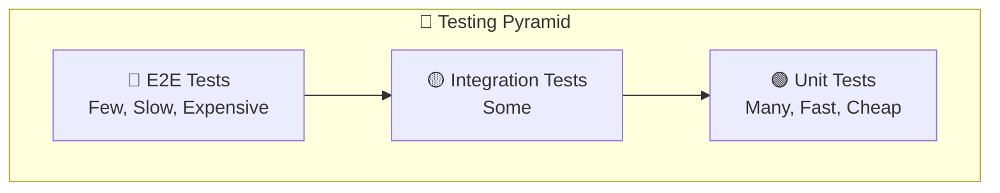

### 5.2 Types of Tests

| Type            | Purpose                            | Tools                 | Coverage |
| --------------- | ---------------------------------- | --------------------- | -------- |
| **Unit**        | Test isolated functions/components | Jest, Vitest          | 70-80%   |
| **Integration** | Test component interactions        | React Testing Library | 15-20%   |
| **E2E**         | Test user flows                    | Cypress, Playwright   | 5-10%    |

### 5.3 Testing React Components

```javascript
// Unit Test - Pure functions
describe("utils", () => {
  test("formatPrice formats correctly", () => {
    expect(formatPrice(1000)).toBe("$1,000.00");
  });
});

// Integration Test - Component behavior
import { render, screen, fireEvent } from "@testing-library/react";

describe("Counter", () => {
  test("increments on button click", () => {
    render(<Counter />);

    const button = screen.getByRole("button", { name: /increment/i });
    fireEvent.click(button);

    expect(screen.getByText("Count: 1")).toBeInTheDocument();
  });
});

// Testing async behavior
test("loads user data", async () => {
  render(<UserProfile userId="1" />);

  expect(screen.getByText(/loading/i)).toBeInTheDocument();

  await waitFor(() => {
    expect(screen.getByText("John Doe")).toBeInTheDocument();
  });
});
```

### 5.4 Mocking

```javascript
// Mock API calls
jest.mock("./api", () => ({
  fetchUser: jest.fn(() => Promise.resolve({ name: "John" })),
}));

// Mock hooks
jest.mock("react-router-dom", () => ({
  ...jest.requireActual("react-router-dom"),
  useParams: () => ({ id: "1" }),
}));

// Mock timers
jest.useFakeTimers();
// ... trigger debounced function
jest.runAllTimers();
```

---

## 6. State Management

### 6.1 State Management Options

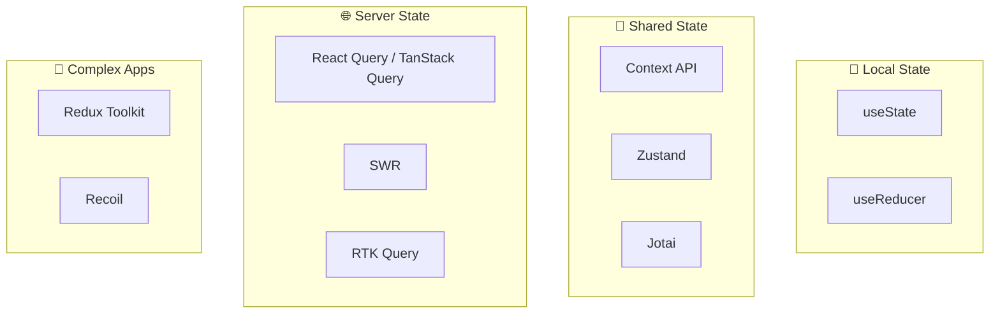

### 6.2 Khi Nào Dùng Gì?

| Use Case              | Recommendation                     |
| --------------------- | ---------------------------------- |
| Form input, toggles   | `useState`                         |
| Complex local state   | `useReducer`                       |
| Theme, auth, i18n     | Context + `useState`               |
| API data, caching     | React Query / SWR                  |
| Cross-component state | Zustand (simple) / Redux (complex) |

### 6.3 Zustand Example

```javascript
import { create } from "zustand";

const useCartStore = create((set) => ({
  items: [],

  addItem: (item) =>
    set((state) => ({
      items: [...state.items, item],
    })),

  removeItem: (id) =>
    set((state) => ({
      items: state.items.filter((item) => item.id !== id),
    })),

  clearCart: () => set({ items: [] }),

  // Computed values
  get totalItems() {
    return this.items.reduce((sum, item) => sum + item.quantity, 0);
  },
}));

// Usage in component
function Cart() {
  const { items, removeItem, totalItems } = useCartStore();

  return (
    <div>
      <h2>Cart ({totalItems} items)</h2>
      {items.map((item) => (
        <CartItem key={item.id} item={item} onRemove={removeItem} />
      ))}
    </div>
  );
}
```

### 6.4 React Query Example

```javascript
import { useQuery, useMutation, useQueryClient } from "@tanstack/react-query";

// Fetching data
function ProductList() {
  const { data, isLoading, error } = useQuery({
    queryKey: ["products"],
    queryFn: () => fetch("/api/products").then((res) => res.json()),
    staleTime: 5 * 60 * 1000, // 5 minutes
  });

  if (isLoading) return <Skeleton />;
  if (error) return <Error />;

  return (
    <ul>
      {data.map((p) => (
        <ProductItem key={p.id} product={p} />
      ))}
    </ul>
  );
}

// Mutations
function AddProduct() {
  const queryClient = useQueryClient();

  const mutation = useMutation({
    mutationFn: (newProduct) =>
      fetch("/api/products", {
        method: "POST",
        body: JSON.stringify(newProduct),
      }),
    onSuccess: () => {
      queryClient.invalidateQueries({ queryKey: ["products"] });
    },
  });

  return (
    <form
      onSubmit={(e) => {
        e.preventDefault();
        mutation.mutate({ name: e.target.name.value });
      }}
    >
      <input name="name" />
      <button disabled={mutation.isPending}>Add</button>
    </form>
  );
}
```

---

## 7. API & Data Fetching

### 7.1 REST vs GraphQL

| Aspect             | REST           | GraphQL                 |
| ------------------ | -------------- | ----------------------- |
| **Endpoints**      | Multiple       | Single                  |
| **Data fetching**  | Fixed response | Request specific fields |
| **Over-fetching**  | Common         | Avoided                 |
| **Caching**        | HTTP caching   | Client-side (Apollo)    |
| **Learning curve** | Lower          | Higher                  |

### 7.2 Error Handling Patterns

```javascript
// Centralized error handling
async function apiClient(url, options = {}) {
  try {
    const response = await fetch(url, {
      ...options,
      headers: {
        "Content-Type": "application/json",
        ...options.headers,
      },
    });

    if (!response.ok) {
      const error = await response.json();
      throw new ApiError(response.status, error.message);
    }

    return response.json();
  } catch (error) {
    if (error instanceof ApiError) throw error;
    throw new NetworkError("Network request failed");
  }
}

class ApiError extends Error {
  constructor(status, message) {
    super(message);
    this.status = status;
  }
}
```

### 7.3 Request Cancellation

```javascript
// AbortController pattern
function useFetch(url) {
  const [data, setData] = useState(null);

  useEffect(() => {
    const controller = new AbortController();

    fetch(url, { signal: controller.signal })
      .then((res) => res.json())
      .then(setData)
      .catch((err) => {
        if (err.name !== "AbortError") {
          console.error(err);
        }
      });

    return () => controller.abort();
  }, [url]);

  return data;
}
```

---

## 8. Behavioral Interview Questions

### 8.1 STAR Method

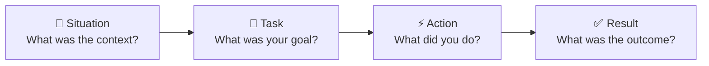

### 8.2 Common Questions & Tips

| Question                                | Tip                                           |
| --------------------------------------- | --------------------------------------------- |
| "Tell me about a challenging project"   | Focus on technical challenges AND soft skills |
| "Describe a conflict with a teammate"   | Show resolution, not blame                    |
| "Why do you want to work here?"         | Research company, align with your goals       |
| "Where do you see yourself in 5 years?" | Show growth mindset, alignment with role      |

### 8.3 Sample Answers

<details>
<summary><strong>"Tell me about a time you improved performance"</strong></summary>

**Situation**: Our e-commerce site had a 6-second load time, causing high bounce rates.

**Task**: I was tasked with improving the Core Web Vitals to meet Google's thresholds.

**Action**:

1. Analyzed with Lighthouse, identified image optimization as main issue
2. Implemented lazy loading, WebP conversion, and CDN
3. Added code splitting for vendor bundles
4. Optimized critical rendering path

**Result**: LCP improved from 6s to 1.8s, bounce rate decreased 40%, and conversions increased 25%.

</details>

---

## 9. Coding Challenge Tips

### 9.1 Approach Framework

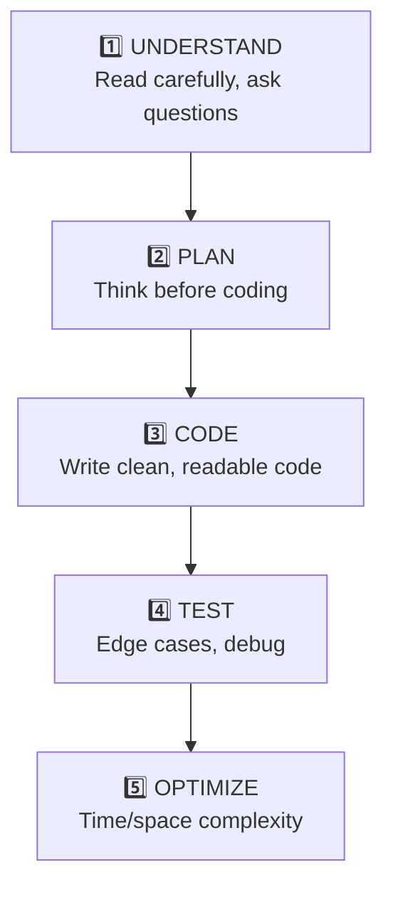

### 9.2 Common Patterns

| Pattern            | Use Case                   | Example               |
| ------------------ | -------------------------- | --------------------- |
| **Two Pointers**   | Sorted arrays, palindromes | Two Sum (sorted)      |
| **Sliding Window** | Subarrays, substrings      | Max sum subarray      |
| **Hash Map**       | Counting, lookup           | Two Sum (unsorted)    |
| **BFS/DFS**        | Trees, graphs, DOM         | Level order traversal |
| **Recursion**      | Trees, nested structures   | Deep clone            |

### 9.3 Time Complexity Cheat Sheet

| Complexity | Name         | Example                     |
| ---------- | ------------ | --------------------------- |
| O(1)       | Constant     | Array access, hash lookup   |
| O(log n)   | Logarithmic  | Binary search               |
| O(n)       | Linear       | Single loop, array.includes |
| O(n log n) | Linearithmic | Sorting (merge, quick)      |
| O(n²)      | Quadratic    | Nested loops                |

---

## 10. Tổng Hợp Câu Hỏi Phỏng Vấn

### 10.1 System Design

<details>
<summary><strong>Q: Design a chat application frontend</strong></summary>

**Key considerations:**

1. **Real-time**: WebSocket for live messages
2. **Optimistic UI**: Show message immediately, sync later
3. **Virtualization**: For long chat history
4. **State**: Messages in React Query, typing indicator in local state
5. **Offline**: IndexedDB for offline queue

</details>

### 10.2 Next.js

<details>
<summary><strong>Q: SSR vs SSG vs ISR - khi nào dùng?</strong></summary>

- **SSG**: Blog posts, marketing pages (static content)
- **ISR**: E-commerce products (frequent updates, need SEO)
- **SSR**: User-specific content, real-time data
- **CSR**: Dashboards, authenticated pages (no SEO needed)

</details>

### 10.3 Algorithms

<details>
<summary><strong>Q: Implement debounce function</strong></summary>

```javascript
function debounce(fn, delay) {
  let timeoutId;
  return function (...args) {
    clearTimeout(timeoutId);
    timeoutId = setTimeout(() => fn.apply(this, args), delay);
  };
}
```

</details>

### 10.4 Testing

<details>
<summary><strong>Q: How do you decide what to test?</strong></summary>

**Priority:**

1. Critical user paths (checkout, login)
2. Business logic functions
3. Error handling
4. Edge cases

**Coverage target**: 70-80% unit, focus on behavior not implementation

</details>

---

## 📊 Tổng Kết

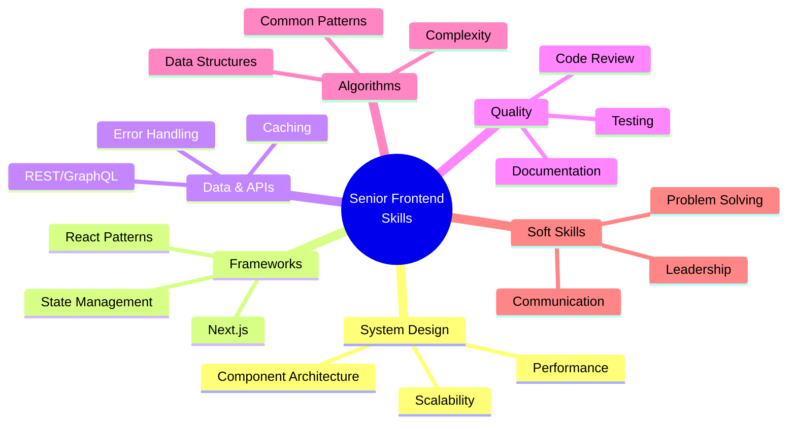

---

## 📚 Tài Liệu Tham Khảo

- [Next.js Documentation](https://nextjs.org/docs)
- [React Testing Library](https://testing-library.com/docs/react-testing-library/intro/)
- [TanStack Query](https://tanstack.com/query/latest)
- [Frontend System Design - GreatFrontend](https://www.greatfrontend.com/system-design)

---

> **Chúc bạn phỏng vấn thành công! 🎉**
>
> _Tài liệu được tạo: 23/12/2025_
