# 📚 Tài Liệu Phỏng Vấn Frontend 2025 - Phần 4

> **Chủ đề**: Lý Thuyết Nâng Cao - JS Engine, Prototypes, HTTP, Browser Internals

---

## 📋 Mục Lục

1. [JavaScript Engine Internals](#1-javascript-engine-internals)
2. [Prototypes & Inheritance](#2-prototypes--inheritance)
3. [Modules: CommonJS vs ES Modules](#3-modules-commonjs-vs-es-modules)
4. [HTTP, HTTPS & WebSocket](#4-http-https--websocket)
5. [Browser Rendering Pipeline](#5-browser-rendering-pipeline)
6. [Accessibility (a11y)](#6-accessibility-a11y)
7. [Web Components](#7-web-components)
8. [Progressive Web Apps (PWA)](#8-progressive-web-apps-pwa)
9. [Micro-frontends](#9-micro-frontends)
10. [Câu Hỏi Phỏng Vấn Lý Thuyết](#10-câu-hỏi-phỏng-vấn-lý-thuyết)

---

## 1. JavaScript Engine Internals

### 1.1 V8 Engine Architecture

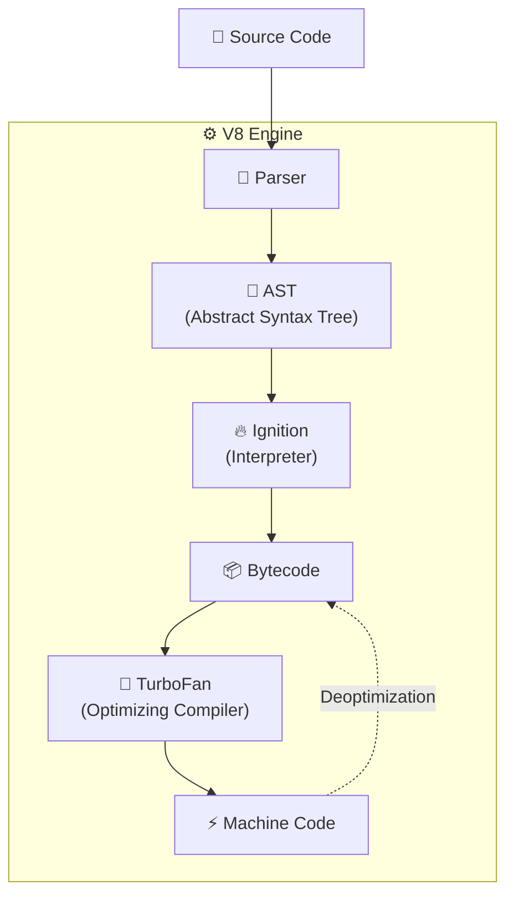

### 1.2 JIT Compilation (Just-In-Time)

| Phase              | Engine Component | Mô Tả                                |
| ------------------ | ---------------- | ------------------------------------ |
| **Parsing**        | Parser           | Convert source → AST                 |
| **Interpretation** | Ignition         | Execute bytecode (fast startup)      |
| **Profiling**      | Ignition         | Collect type information             |
| **Optimization**   | TurboFan         | Compile hot functions → machine code |
| **Deoptimization** | TurboFan         | Fallback nếu assumptions sai         |

### 1.3 Hidden Classes & Inline Caching

```javascript
// ✅ GOOD - Same hidden class
function Point(x, y) {
  this.x = x;
  this.y = y;
}
const p1 = new Point(1, 2);
const p2 = new Point(3, 4);
// p1 và p2 share same hidden class → Fast property access

// ❌ BAD - Different hidden classes
const obj1 = { a: 1 };
obj1.b = 2;

const obj2 = { b: 1 };
obj2.a = 2;
// obj1: {a} → {a, b}
// obj2: {b} → {b, a}
// Different hidden classes → Slower
```

> [!TIP] > **Optimization Tips:**
>
> - Khởi tạo tất cả properties trong constructor
> - Không thêm/xóa properties sau khi tạo object
> - Giữ consistent property order

### 1.4 Memory Layout

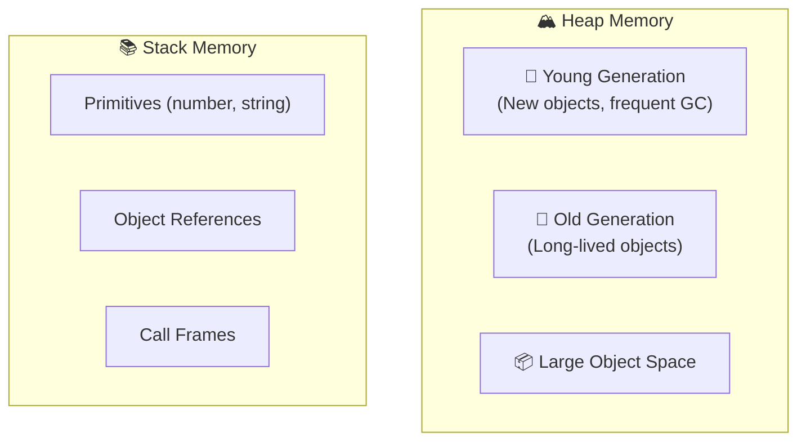

---

## 2. Prototypes & Inheritance

### 2.1 Prototype Chain

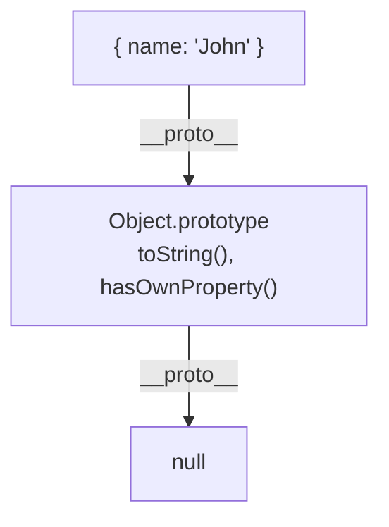

### 2.2 Constructor Functions

```javascript
function Animal(name) {
  this.name = name;
}

Animal.prototype.speak = function () {
  console.log(`${this.name} makes a sound`);
};

function Dog(name, breed) {
  Animal.call(this, name); // Call parent constructor
  this.breed = breed;
}

// Set up inheritance
Dog.prototype = Object.create(Animal.prototype);
Dog.prototype.constructor = Dog;

Dog.prototype.speak = function () {
  console.log(`${this.name} barks`);
};

const dog = new Dog("Rex", "German Shepherd");
dog.speak(); // "Rex barks"
```

### 2.3 ES6 Classes (Syntactic Sugar)

```javascript
class Animal {
  constructor(name) {
    this.name = name;
  }

  speak() {
    console.log(`${this.name} makes a sound`);
  }

  static create(name) {
    return new Animal(name);
  }
}

class Dog extends Animal {
  constructor(name, breed) {
    super(name); // Must call super() first
    this.breed = breed;
  }

  speak() {
    console.log(`${this.name} barks`);
  }
}
```

### 2.4 Prototype Methods

```javascript
// Check prototype chain
Object.getPrototypeOf(dog) === Dog.prototype; // true
dog instanceof Dog; // true
dog instanceof Animal; // true

// Check own property
dog.hasOwnProperty("name"); // true
dog.hasOwnProperty("speak"); // false (on prototype)

// Get all properties (including inherited)
for (let prop in dog) console.log(prop);

// Get only own properties
Object.keys(dog); // ['name', 'breed']
Object.getOwnPropertyNames(dog);
```

---

## 3. Modules: CommonJS vs ES Modules

### 3.1 So Sánh

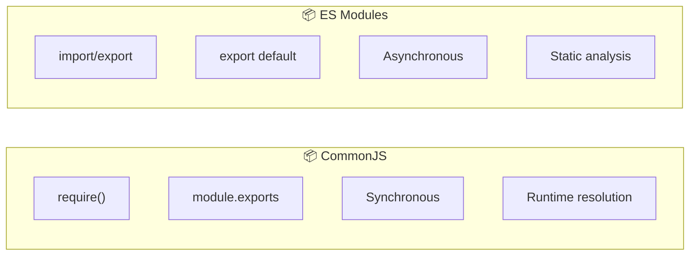

| Feature             | CommonJS                      | ES Modules            |
| ------------------- | ----------------------------- | --------------------- |
| **Syntax**          | `require()`, `module.exports` | `import`, `export`    |
| **Loading**         | Synchronous                   | Asynchronous          |
| **Analysis**        | Runtime                       | Static (compile time) |
| **Tree Shaking**    | ❌ Khó                        | ✅ Dễ                 |
| **Top-level await** | ❌ Không                      | ✅ Có                 |
| **Environment**     | Node.js                       | Browser & Node.js     |

### 3.2 Syntax Examples

```javascript
// CommonJS
const fs = require("fs");
const { readFile } = require("fs");

module.exports = { myFunction };
module.exports.myFunction = () => {};

// ES Modules
import fs from "fs";
import { readFile } from "fs";
import * as fs from "fs";

export const myFunction = () => {};
export default myFunction;

// Dynamic import (both)
const module = await import("./path/to/module.js");
```

### 3.3 Circular Dependencies

```javascript
// a.js
import { b } from "./b.js";
export const a = "A";
console.log(b); // undefined (b chưa được export)

// b.js
import { a } from "./a.js";
export const b = "B";
console.log(a); // 'A' (ESM hoists exports)
```

> [!WARNING]
> Tránh circular dependencies! Refactor bằng cách tách common code ra module riêng.

---

## 4. HTTP, HTTPS & WebSocket

### 4.1 HTTP/1.1 vs HTTP/2 vs HTTP/3

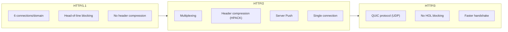

### 4.2 HTTPS & TLS Handshake

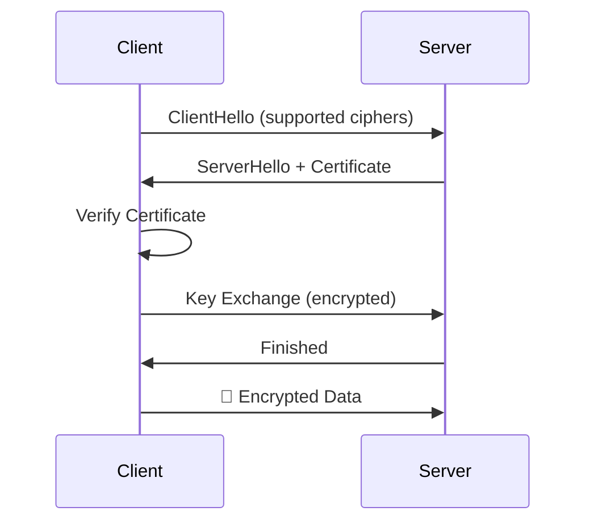

### 4.3 HTTP Methods & Status Codes

| Method | Idempotent | Safe | Use Case         |
| ------ | ---------- | ---- | ---------------- |
| GET    | ✅         | ✅   | Read data        |
| POST   | ❌         | ❌   | Create resource  |
| PUT    | ✅         | ❌   | Update (full)    |
| PATCH  | ❌         | ❌   | Update (partial) |
| DELETE | ✅         | ❌   | Delete resource  |

| Status | Category     | Examples                                         |
| ------ | ------------ | ------------------------------------------------ |
| 2xx    | Success      | 200 OK, 201 Created, 204 No Content              |
| 3xx    | Redirect     | 301 Moved, 304 Not Modified                      |
| 4xx    | Client Error | 400 Bad Request, 401 Unauthorized, 404 Not Found |
| 5xx    | Server Error | 500 Internal Error, 503 Service Unavailable      |

### 4.4 WebSocket

```javascript
// Client
const ws = new WebSocket("wss://example.com/socket");

ws.onopen = () => {
  console.log("Connected");
  ws.send(JSON.stringify({ type: "subscribe", channel: "updates" }));
};

ws.onmessage = (event) => {
  const data = JSON.parse(event.data);
  console.log("Received:", data);
};

ws.onclose = () => console.log("Disconnected");
ws.onerror = (error) => console.error("Error:", error);

// Cleanup
ws.close();
```

| Feature    | HTTP                | WebSocket                 |
| ---------- | ------------------- | ------------------------- |
| Connection | Request-Response    | Persistent, bidirectional |
| Use case   | REST APIs           | Real-time (chat, games)   |
| Overhead   | Headers mỗi request | Initial handshake only    |

---

## 5. Browser Rendering Pipeline

### 5.1 Critical Rendering Path

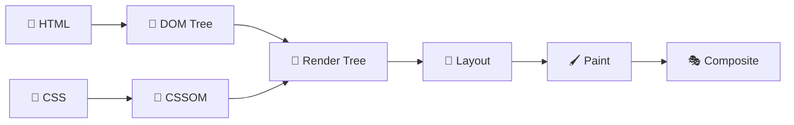

### 5.2 Các Giai Đoạn

| Giai Đoạn     | Mô Tả                        | Trigger Khi               |
| ------------- | ---------------------------- | ------------------------- |
| **Parse**     | Convert HTML/CSS → DOM/CSSOM | Load page                 |
| **Style**     | Compute final styles         | CSS changes               |
| **Layout**    | Calculate positions/sizes    | Geometry changes          |
| **Paint**     | Fill pixels                  | Color, visibility changes |
| **Composite** | Combine layers               | Transform, opacity        |

### 5.3 Reflow vs Repaint

```javascript
// 🔴 TRIGGER REFLOW (expensive)
element.offsetHeight; // Read layout
element.style.width = "100px";
element.style.height = "200px";

// 🟡 TRIGGER REPAINT (less expensive)
element.style.backgroundColor = "red";
element.style.visibility = "hidden";

// 🟢 NO REFLOW/REPAINT (GPU accelerated)
element.style.transform = "translateX(100px)";
element.style.opacity = 0.5;
```

### 5.4 Optimization Tips

```javascript
// ❌ BAD - Multiple reflows
for (let i = 0; i < 100; i++) {
  element.style.left = element.offsetLeft + 10 + "px";
}

// ✅ GOOD - Batch reads and writes
const left = element.offsetLeft; // Read once
for (let i = 0; i < 100; i++) {
  element.style.left = left + i * 10 + "px"; // Write
}

// ✅ BETTER - Use transform
element.style.transform = `translateX(${100 * 10}px)`;

// ✅ Use requestAnimationFrame
requestAnimationFrame(() => {
  element.style.transform = `translateX(${x}px)`;
});
```

---

## 6. Accessibility (a11y)

### 6.1 WCAG Principles (POUR)

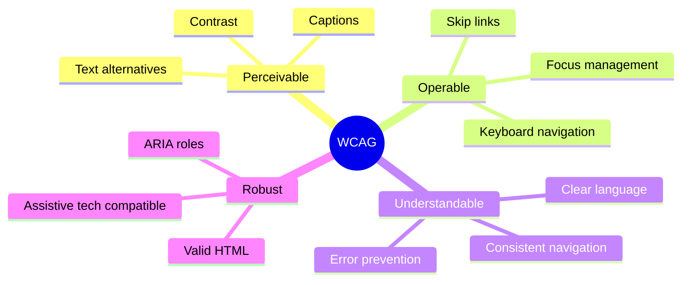

### 6.2 Semantic HTML

```html
<!-- ❌ Non-semantic -->
<div class="button" onclick="submit()">Submit</div>
<div class="header">...</div>

<!-- ✅ Semantic -->
<button type="submit">Submit</button>
<header>...</header>
<nav>...</nav>
<main>...</main>
<article>...</article>
<aside>...</aside>
<footer>...</footer>
```

### 6.3 ARIA Attributes

```html
<!-- Labels -->
<button aria-label="Close menu">×</button>

<!-- State -->
<button aria-pressed="true">Bold</button>
<div aria-expanded="false">Menu</div>

<!-- Relationships -->
<input aria-describedby="hint" />
<span id="hint">Enter your email</span>

<!-- Live regions -->
<div aria-live="polite">Status updated</div>
<div role="alert">Error occurred!</div>
```

### 6.4 Keyboard Navigation

```javascript
// Focus trap trong modal
function trapFocus(modal) {
  const focusable = modal.querySelectorAll(
    'button, [href], input, select, textarea, [tabindex]:not([tabindex="-1"])'
  );
  const first = focusable[0];
  const last = focusable[focusable.length - 1];

  modal.addEventListener("keydown", (e) => {
    if (e.key === "Tab") {
      if (e.shiftKey && document.activeElement === first) {
        e.preventDefault();
        last.focus();
      } else if (!e.shiftKey && document.activeElement === last) {
        e.preventDefault();
        first.focus();
      }
    }
    if (e.key === "Escape") closeModal();
  });
}
```

---

## 7. Web Components

### 7.1 Core Technologies

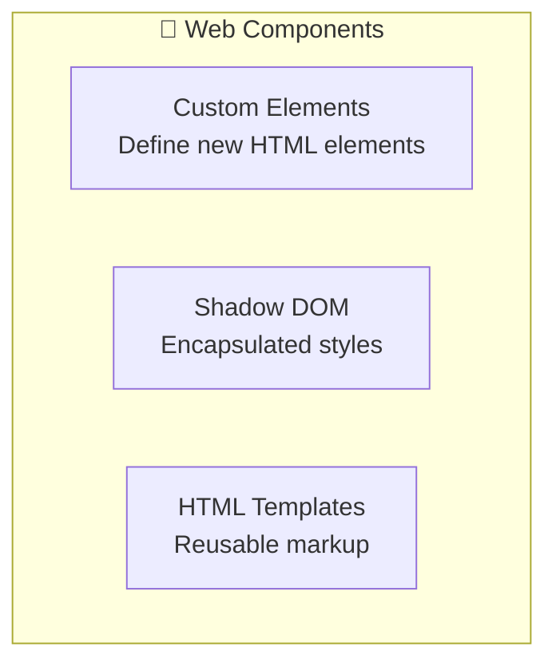

### 7.2 Custom Element Example

```javascript
class MyCounter extends HTMLElement {
  constructor() {
    super();
    this.count = 0;
    this.attachShadow({ mode: "open" });
  }

  connectedCallback() {
    this.render();
    this.shadowRoot
      .querySelector("button")
      .addEventListener("click", () => this.increment());
  }

  disconnectedCallback() {
    // Cleanup
  }

  static get observedAttributes() {
    return ["initial"];
  }

  attributeChangedCallback(name, oldVal, newVal) {
    if (name === "initial") this.count = parseInt(newVal);
  }

  increment() {
    this.count++;
    this.render();
    this.dispatchEvent(new CustomEvent("change", { detail: this.count }));
  }

  render() {
    this.shadowRoot.innerHTML = `
      <style>
        button { padding: 10px 20px; }
      </style>
      <span>${this.count}</span>
      <button>+1</button>
    `;
  }
}

customElements.define("my-counter", MyCounter);
```

```html
<my-counter initial="5"></my-counter>
```

---

## 8. Progressive Web Apps (PWA)

### 8.1 PWA Features

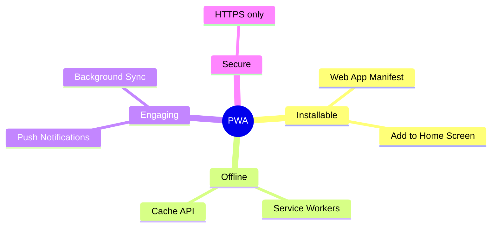

### 8.2 Web App Manifest

```json
{
  "name": "My PWA App",
  "short_name": "MyPWA",
  "start_url": "/",
  "display": "standalone",
  "background_color": "#ffffff",
  "theme_color": "#3498db",
  "icons": [
    { "src": "/icon-192.png", "sizes": "192x192", "type": "image/png" },
    { "src": "/icon-512.png", "sizes": "512x512", "type": "image/png" }
  ]
}
```

### 8.3 Service Worker Caching Strategies

| Strategy                   | Mô Tả                              | Use Case                |
| -------------------------- | ---------------------------------- | ----------------------- |
| **Cache First**            | Check cache, fallback to network   | Static assets           |
| **Network First**          | Try network, fallback to cache     | API data                |
| **Stale While Revalidate** | Return cache, update in background | Balance speed/freshness |
| **Cache Only**             | Only from cache                    | Offline-first apps      |
| **Network Only**           | Always network                     | Real-time data          |

```javascript
// sw.js - Stale While Revalidate
self.addEventListener("fetch", (event) => {
  event.respondWith(
    caches.open("v1").then((cache) => {
      return cache.match(event.request).then((cached) => {
        const fetched = fetch(event.request).then((response) => {
          cache.put(event.request, response.clone());
          return response;
        });
        return cached || fetched;
      });
    })
  );
});
```

---

## 9. Micro-frontends

### 9.1 Architecture Patterns

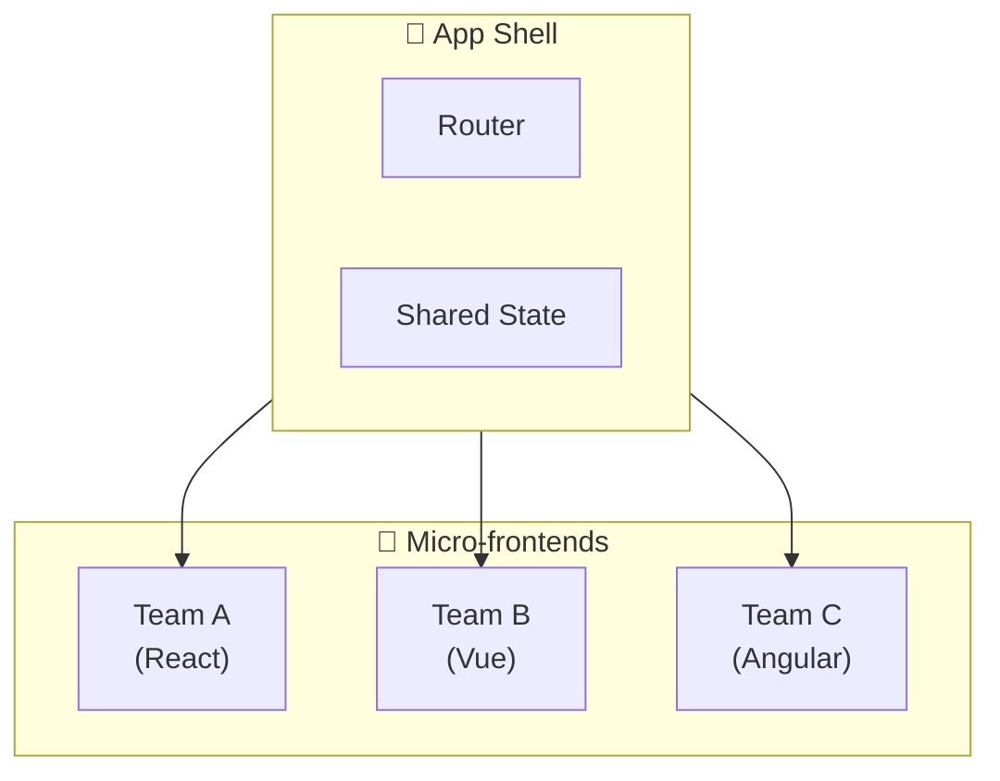

### 9.2 Integration Approaches

| Approach              | Pros                | Cons                    |
| --------------------- | ------------------- | ----------------------- |
| **iframes**           | Complete isolation  | Performance, SEO issues |
| **Module Federation** | Runtime integration | Webpack-specific        |
| **Web Components**    | Framework-agnostic  | Limited ecosystem       |
| **Server-side**       | SEO friendly        | Complex routing         |

### 9.3 Module Federation Example

```javascript
// webpack.config.js (Host)
new ModuleFederationPlugin({
  name: "host",
  remotes: {
    mfe1: "mfe1@http://localhost:3001/remoteEntry.js",
    mfe2: "mfe2@http://localhost:3002/remoteEntry.js",
  },
});

// webpack.config.js (Remote - mfe1)
new ModuleFederationPlugin({
  name: "mfe1",
  filename: "remoteEntry.js",
  exposes: {
    "./Button": "./src/components/Button",
  },
});

// Usage in Host
const RemoteButton = React.lazy(() => import("mfe1/Button"));
```

---

## 10. Câu Hỏi Phỏng Vấn Lý Thuyết

### 10.1 JavaScript Engine

<details>
<summary><strong>Q: V8 optimize code như thế nào?</strong></summary>

**A:** V8 sử dụng:

1. **Hidden Classes**: Track object shapes cho fast property access
2. **Inline Caching**: Cache property locations
3. **JIT Compilation**: Ignition (interpreter) → TurboFan (optimizer)
4. **Deoptimization**: Fallback khi assumptions sai

</details>

### 10.2 Prototypes

<details>
<summary><strong>Q: Prototype chain hoạt động như thế nào?</strong></summary>

**A:** Khi access property:

1. Tìm trong object
2. Nếu không có → tìm trong `object.__proto__`
3. Tiếp tục lên chain cho đến `null`

```javascript
obj → Object.prototype → null
arr → Array.prototype → Object.prototype → null
```

</details>

### 10.3 HTTP

<details>
<summary><strong>Q: HTTP/2 cải thiện gì so với HTTP/1.1?</strong></summary>

**A:**

1. **Multiplexing**: Multiple requests/responses trên 1 connection
2. **Header Compression**: HPACK giảm overhead
3. **Server Push**: Server gửi resources trước khi client request
4. **Binary Protocol**: Faster parsing

</details>

### 10.4 Browser Rendering

<details>
<summary><strong>Q: Tại sao transform tốt hơn left/top cho animations?</strong></summary>

**A:**

- `left/top`: Trigger **Layout → Paint → Composite** (expensive)
- `transform/opacity`: Chỉ trigger **Composite** (GPU accelerated)

</details>

### 10.5 Accessibility

<details>
<summary><strong>Q: ARIA dùng khi nào?</strong></summary>

**A:** Theo thứ tự ưu tiên:

1. Dùng semantic HTML trước (`<button>`, `<nav>`)
2. ARIA chỉ khi không có HTML element phù hợp
3. Không override native semantics

</details>

---

## 📊 Tổng Kết

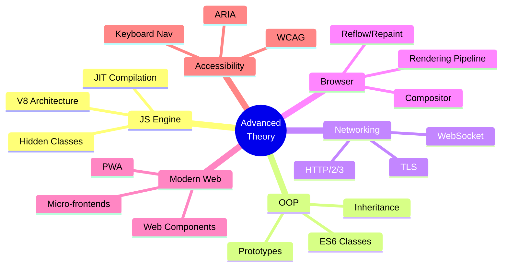

---

## 📚 Tài Liệu Tham Khảo

- [V8 Blog](https://v8.dev/blog)
- [MDN - Web Components](https://developer.mozilla.org/en-US/docs/Web/Web_Components)
- [web.dev - PWA](https://web.dev/progressive-web-apps/)
- [WCAG 2.1 Guidelines](https://www.w3.org/WAI/WCAG21/quickref/)

---

> **Chúc bạn phỏng vấn thành công! 🎉**
>
> _Tài liệu được tạo: 23/12/2025_
