# 📚 Tài Liệu Phỏng Vấn Frontend 2025 - Phần 5

> **Chủ đề**: Frontend Developer Handbook 2024 - Roadmap, Ecosystem & Career Guide
>
> _Dựa trên [Frontend Masters Handbook 2024](https://frontendmasters.com/guides/front-end-handbook/2024/)_

---

## 📋 Mục Lục

1. [Frontend Developer là gì?](#1-frontend-developer-là-gì)
2. [Career Levels & Job Titles](#2-career-levels--job-titles)
3. [Core Competencies Roadmap](#3-core-competencies-roadmap)
4. [Web Fundamentals](#4-web-fundamentals)
5. [Frameworks & Libraries Ecosystem](#5-frameworks--libraries-ecosystem)
6. [Web Paradigms: SPA, MPA, SSR, SSG](#6-web-paradigms-spa-mpa-ssr-ssg)
7. [Modern Web Patterns](#7-modern-web-patterns)
8. [Development Toolbox/Stack 2024](#8-development-toolboxstack-2024)
9. [Career Preparation](#9-career-preparation)
10. [Interview Checklist](#10-interview-checklist)

---

## 1. Frontend Developer là gì?

### 1.1 Định Nghĩa

**Frontend Developer/Engineer** là người sử dụng các công nghệ Web Platform — **HTML, CSS, JavaScript** — để phát triển giao diện người dùng (UI) cho websites, web applications và native applications.

### 1.2 Các Sản Phẩm Frontend Developer Tạo Ra

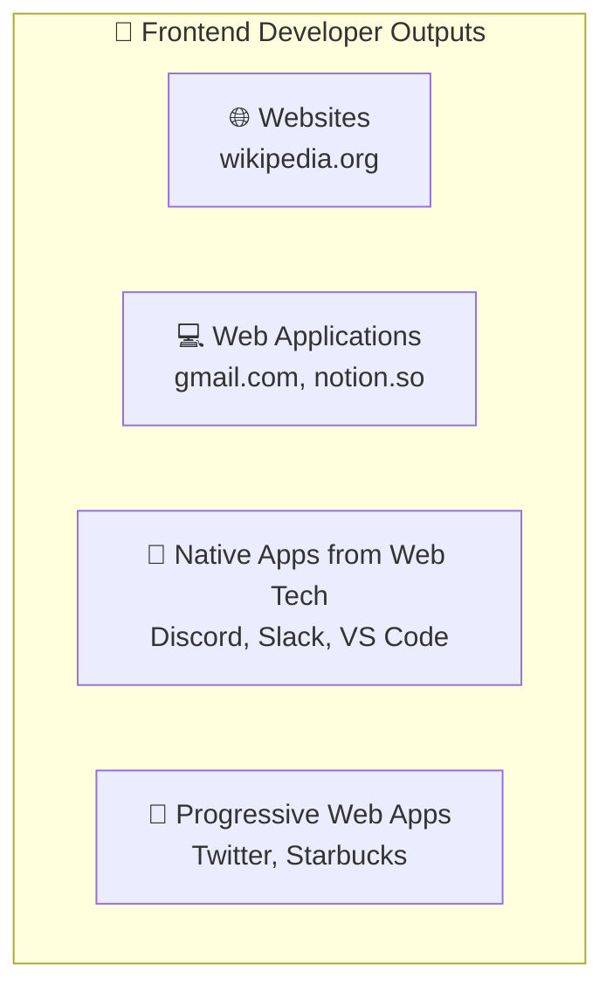

| Loại                | Mô Tả                                               | Ví Dụ                       |
| ------------------- | --------------------------------------------------- | --------------------------- |
| **Website**         | Tập hợp web pages liên kết, static hoặc dynamic     | Wikipedia, blogs            |
| **Web Application** | Ứng dụng chạy trong browser, tương tác với database | Gmail, Notion, Figma        |
| **Native from Web** | App native từ web technologies                      | Discord (Electron), VS Code |
| **PWA**             | Installable web apps với native-like experience     | Twitter Lite                |

### 1.3 Technologies để Build Native Apps từ Web

| Technology       | Platform         | Approach                   |
| ---------------- | ---------------- | -------------------------- |
| **Electron**     | Desktop          | Web runtime embedded       |
| **Tauri**        | Desktop + Mobile | Rust backend, web frontend |
| **React Native** | Mobile           | Translate to native UI     |
| **Capacitor**    | Mobile           | Web in native container    |
| **PWA**          | All platforms    | Browser-based installable  |

---

## 2. Career Levels & Job Titles

### 2.1 Career Ladder

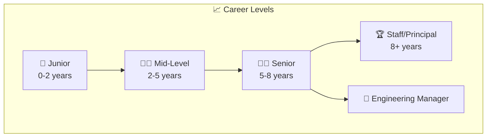

### 2.2 Common Job Titles

| Focus Area        | Job Titles                                           |
| ----------------- | ---------------------------------------------------- |
| **General**       | Frontend Developer, Frontend Engineer, Web Developer |
| **UI/UX**         | UI Developer, UI Engineer, UX Engineer               |
| **Testing**       | Frontend QA Engineer, Test Engineer                  |
| **Performance**   | Web Performance Engineer                             |
| **Accessibility** | Accessibility Specialist, a11y Engineer              |
| **Full-stack**    | Full-stack Developer, Software Engineer              |

### 2.3 Salary Ranges (US Market 2024)

| Level           | Salary Range (USD)   |
| --------------- | -------------------- |
| Junior          | $60,000 - $90,000    |
| Mid-Level       | $90,000 - $130,000   |
| Senior          | $130,000 - $180,000  |
| Staff/Principal | $180,000 - $250,000+ |

---

## 3. Core Competencies Roadmap

### 3.1 Skills Overview

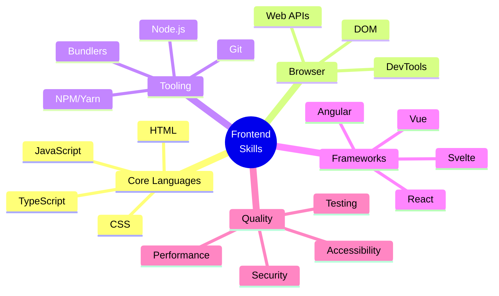

### 3.2 Learning Path Recommended

| Phase             | Topics                          | Timeline   |
| ----------------- | ------------------------------- | ---------- |
| **1. Basics**     | HTML, CSS, JavaScript basics    | 2-3 months |
| **2. DOM & APIs** | DOM manipulation, Fetch, Events | 1-2 months |
| **3. Tooling**    | Git, NPM, Command Line          | 2-4 weeks  |
| **4. Framework**  | React/Vue/Angular (pick one)    | 2-3 months |
| **5. TypeScript** | Types, Interfaces, Generics     | 1 month    |
| **6. Testing**    | Unit, Integration, E2E          | 1-2 months |
| **7. Advanced**   | Performance, Security, a11y     | Ongoing    |

---

## 4. Web Fundamentals

### 4.1 How the Web Works

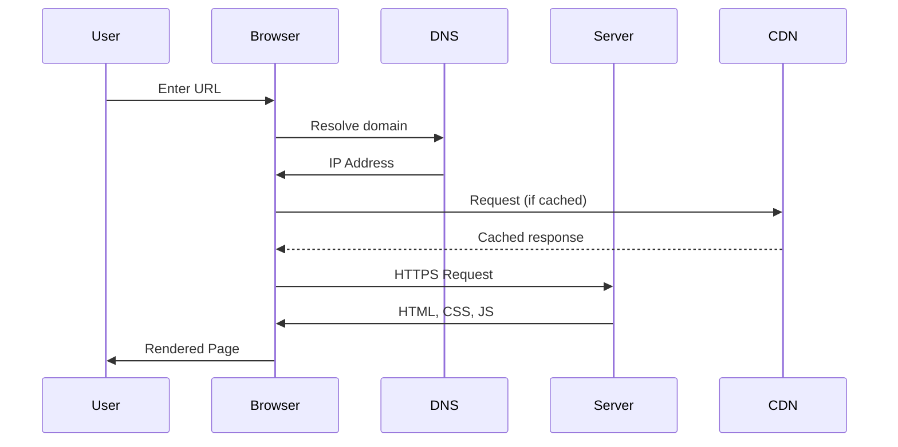

### 4.2 Key Concepts

| Concept               | Mô Tả                                           |
| --------------------- | ----------------------------------------------- |
| **DNS**               | Chuyển domain name → IP address                 |
| **HTTP/HTTPS**        | Protocol để transfer data                       |
| **CDN**               | Network of servers để deliver content nhanh hơn |
| **Browser**           | Engine để parse và render web content           |
| **JavaScript Engine** | V8 (Chrome), SpiderMonkey (Firefox)             |

### 4.3 URL Structure

```
https://www.example.com:443/path/page.html?query=value#section
└─┬─┘   └──────┬──────┘└┬┘ └─────┬─────┘ └────┬────┘ └──┬──┘
scheme      domain    port    path         query    fragment
```

---

## 5. Frameworks & Libraries Ecosystem

### 5.1 Frontend Frameworks 2024

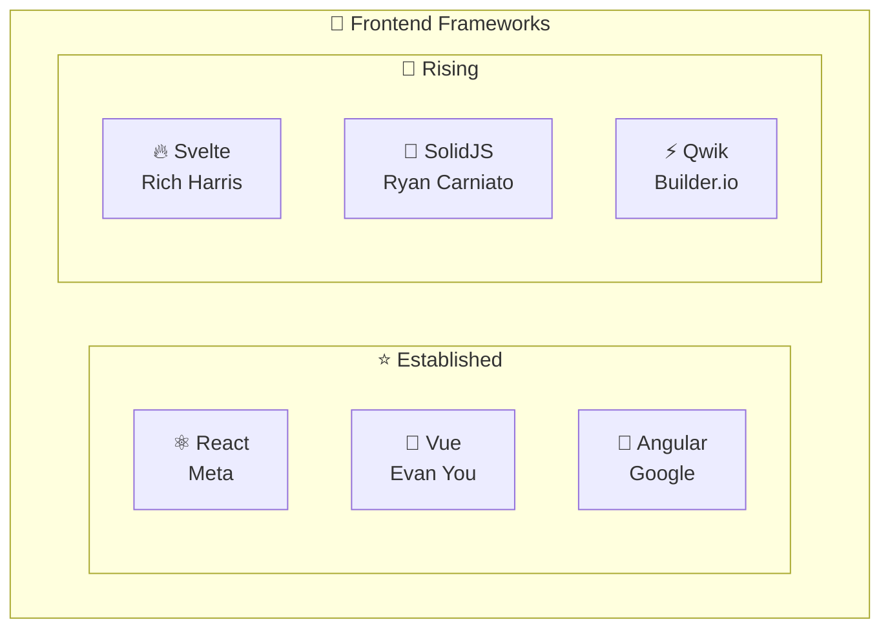

### 5.2 Framework Comparison

| Framework   | Learning Curve | Performance | Ecosystem | Best For             |
| ----------- | -------------- | ----------- | --------- | -------------------- |
| **React**   | Medium         | Good        | Excellent | Large apps, jobs     |
| **Vue**     | Easy           | Good        | Good      | Beginners, rapid dev |
| **Angular** | Hard           | Good        | Good      | Enterprise           |
| **Svelte**  | Easy           | Excellent   | Growing   | Performance-critical |
| **SolidJS** | Medium         | Excellent   | Small     | Performance-critical |

### 5.3 Meta-Frameworks (Full-Stack)

| Framework     | Base   | Features                         |
| ------------- | ------ | -------------------------------- |
| **Next.js**   | React  | SSR, SSG, API routes, App Router |
| **Nuxt**      | Vue    | SSR, SSG, Auto-imports           |
| **SvelteKit** | Svelte | SSR, SSG, Form actions           |
| **Astro**     | Any    | Islands, Content-focused         |
| **Remix**     | React  | Nested routing, Loaders          |

---

## 6. Web Paradigms: SPA, MPA, SSR, SSG

### 6.1 Rendering Strategies

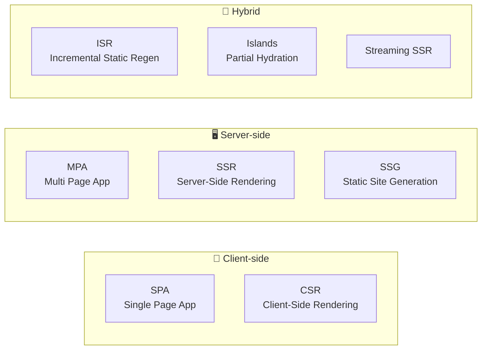

### 6.2 Comparison Table

| Aspect            | SPA/CSR    | MPA/SSR     | SSG         | ISR         |
| ----------------- | ---------- | ----------- | ----------- | ----------- |
| **Initial Load**  | Slow       | Fast        | Fastest     | Fast        |
| **SEO**           | Poor       | Excellent   | Excellent   | Excellent   |
| **Interactivity** | Instant    | Page reload | Page reload | Page reload |
| **Server Cost**   | Low        | High        | Lowest      | Medium      |
| **Use Case**      | Dashboards | E-commerce  | Blogs       | Products    |

### 6.3 Modern Patterns

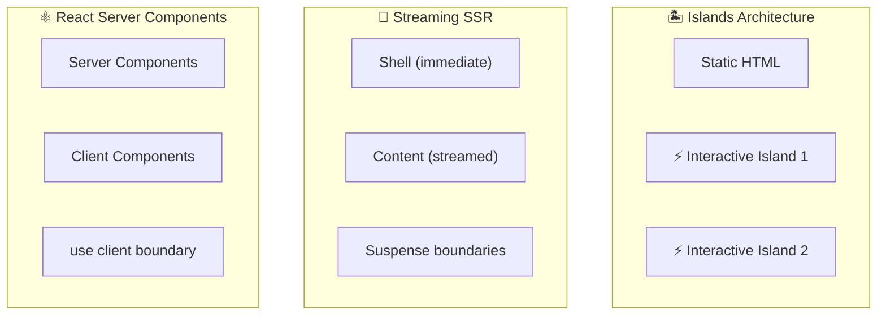

---

## 7. Modern Web Patterns

### 7.1 State Management

| Pattern          | Tools                   | Use Case        |
| ---------------- | ----------------------- | --------------- |
| **Local State**  | useState, useReducer    | Component-level |
| **Global State** | Zustand, Jotai, Redux   | Cross-component |
| **Server State** | React Query, SWR        | API data        |
| **URL State**    | React Router, Next.js   | Navigation      |
| **Form State**   | React Hook Form, Formik | Forms           |

### 7.2 Data Fetching Patterns

```javascript
// 1️⃣ Client-side with React Query
const { data } = useQuery({
  queryKey: ["users"],
  queryFn: () => fetch("/api/users").then((r) => r.json()),
});

// 2️⃣ Server-side (Next.js)
export async function getServerSideProps() {
  const data = await fetch("...");
  return { props: { data } };
}

// 3️⃣ Server Components (Next.js 13+)
async function Page() {
  const data = await fetch("...");
  return <div>{data}</div>;
}
```

### 7.3 API Patterns

| Pattern       | Description                        | Tools        |
| ------------- | ---------------------------------- | ------------ |
| **REST**      | Resource-based, multiple endpoints | fetch, axios |
| **GraphQL**   | Query language, single endpoint    | Apollo, urql |
| **tRPC**      | Type-safe APIs                     | tRPC         |
| **WebSocket** | Real-time, bidirectional           | Socket.io    |

---

## 8. Development Toolbox/Stack 2024

### 8.1 Recommended Stack

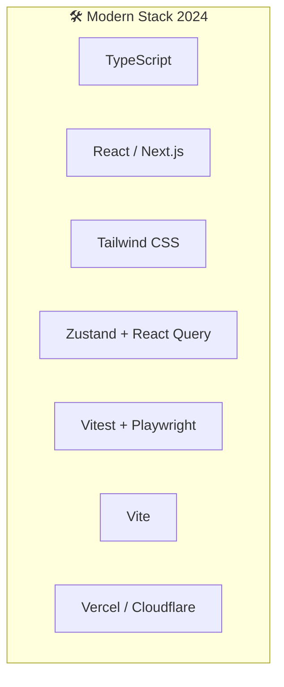

### 8.2 Tool Categories

| Category            | Tools                       |
| ------------------- | --------------------------- |
| **Code Editor**     | VS Code, WebStorm           |
| **Version Control** | Git, GitHub, GitLab         |
| **Package Manager** | npm, pnpm, yarn             |
| **Bundler**         | Vite, webpack, esbuild      |
| **Linting**         | ESLint, Biome               |
| **Formatting**      | Prettier, Biome             |
| **Testing**         | Vitest, Jest, Playwright    |
| **CI/CD**           | GitHub Actions, CircleCI    |
| **Hosting**         | Vercel, Netlify, Cloudflare |

### 8.3 AI-Powered Tools 2024

| Tool               | Use Case             |
| ------------------ | -------------------- |
| **GitHub Copilot** | AI code completion   |
| **Cursor**         | AI-first code editor |
| **v0.dev**         | AI UI generation     |
| **ChatGPT/Claude** | Code assistance      |

---

## 9. Career Preparation

### 9.1 Build Online Presence

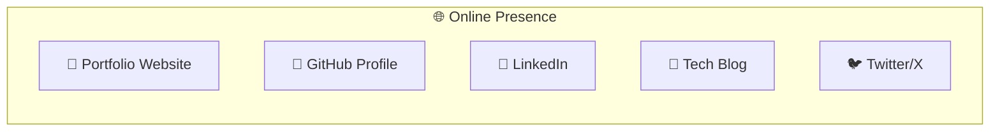

### 9.2 Portfolio Checklist

- [ ] Clean, modern design
- [ ] Mobile responsive
- [ ] Fast loading (< 3s)
- [ ] 3-5 quality projects
- [ ] Live demos + GitHub links
- [ ] Clear contact info
- [ ] About section with skills

### 9.3 Resume Tips

| Section        | Tips                                   |
| -------------- | -------------------------------------- |
| **Header**     | Name, title, contact, LinkedIn, GitHub |
| **Summary**    | 2-3 sentences, highlight expertise     |
| **Skills**     | Group by category, relevant to job     |
| **Experience** | Action verbs, quantified results       |
| **Projects**   | Tech used, your role, impact           |

### 9.4 Interview Preparation

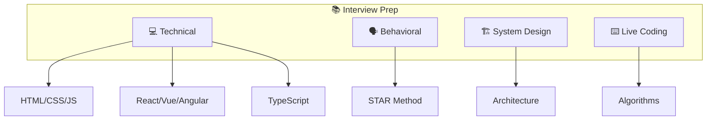

---

## 10. Interview Checklist

### 10.1 Technical Topics to Master

| Priority  | Topic                      | Resources            |
| --------- | -------------------------- | -------------------- |
| 🔴 High   | JavaScript Core (ES6+)     | MDN, JavaScript.info |
| 🔴 High   | React/Vue fundamentals     | Official docs        |
| 🔴 High   | CSS Layout (Flexbox, Grid) | CSS-Tricks           |
| 🟡 Medium | TypeScript                 | TS Handbook          |
| 🟡 Medium | Web Performance            | web.dev              |
| 🟡 Medium | Testing                    | Testing Library docs |
| 🟢 Lower  | System Design              | GreatFrontend        |
| 🟢 Lower  | Algorithms                 | LeetCode, NeetCode   |

### 10.2 Common Interview Questions

<details>
<summary><strong>HTML/CSS</strong></summary>

- Semantic HTML là gì? Tại sao quan trọng?
- Flexbox vs Grid - khi nào dùng?
- CSS Specificity hoạt động như thế nào?
- Làm sao để responsive design?

</details>

<details>
<summary><strong>JavaScript</strong></summary>

- Event Loop hoạt động như thế nào?
- Closure là gì? Cho ví dụ?
- Promise vs async/await?
- Prototypes vs Classes?

</details>

<details>
<summary><strong>React</strong></summary>

- Virtual DOM là gì?
- useEffect dependencies?
- useMemo vs useCallback?
- State management options?

</details>

<details>
<summary><strong>Performance</strong></summary>

- Core Web Vitals là gì?
- Làm sao optimize bundle size?
- Lazy loading techniques?
- Caching strategies?

</details>

### 10.3 Day Before Interview

- [ ] Review resume và projects
- [ ] Test camera và microphone
- [ ] Prepare questions for interviewer
- [ ] Get good sleep
- [ ] Prepare water và snacks

---

## 📊 Tổng Kết Roadmap

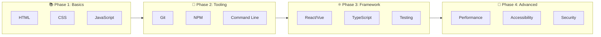

---

## 📚 Tài Liệu Tham Khảo

- [Frontend Masters Handbook 2024](https://frontendmasters.com/guides/front-end-handbook/2024/)
- [MDN Web Docs](https://developer.mozilla.org/)
- [web.dev](https://web.dev/)
- [React Documentation](https://react.dev/)
- [JavaScript.info](https://javascript.info/)

---

> **Chúc bạn phỏng vấn thành công! 🎉**
>
> _Tài liệu được tạo: 23/12/2025_
