# 📚 Tài Liệu Phỏng Vấn Frontend 2025 - Phần 6

> **Chủ đề**: 🔗 Kết Nối Kiến Thức - Cái Nhìn Toàn Diện
>
> _Tài liệu này giúp bạn hiểu MỐI QUAN HỆ giữa các concepts, giúp nhớ lâu hơn_

---

## 🎯 Mục Tiêu

Thay vì học từng concept riêng lẻ, tài liệu này sẽ giúp bạn:

1. **Hiểu WHY** - Tại sao concept này tồn tại?
2. **Hiểu HOW** - Nó hoạt động như thế nào trong bức tranh lớn?
3. **Hiểu WHEN** - Khi nào áp dụng?
4. **Kết nối** - Concept này liên quan đến những gì khác?

---

## 📋 Mục Lục

1. [The Big Picture - Bức Tranh Toàn Cảnh](#1-the-big-picture)
2. [JavaScript Runtime: Từ Code đến Execution](#2-javascript-runtime)
3. [Async Programming: Câu Chuyện Hoàn Chỉnh](#3-async-programming-story)
4. [React: Từ DOM đến Virtual DOM](#4-react-evolution)
5. [Data Flow: Từ Server đến UI](#5-data-flow)
6. [Performance: Mọi Thứ Kết Nối](#6-performance-connections)
7. [Memory Map: Kiến Thức Liên Kết](#7-memory-map)

---

## 1. The Big Picture - Bức Tranh Toàn Cảnh

### 1.1 Frontend Development Flow

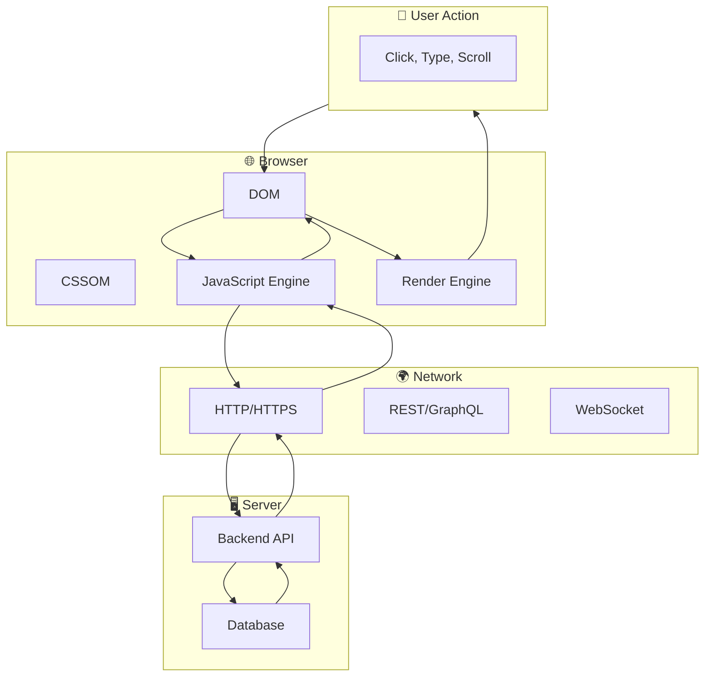

> [!IMPORTANT] > **Ghi nhớ**: Mọi thứ trong frontend đều xoay quanh vòng lặp này:
> **User → Browser → Network → Server → Network → Browser → User**

### 1.2 Tại Sao Cần Hiểu Connections?

| Khi bạn hiểu... | Bạn sẽ hiểu tại sao...                    |
| --------------- | ----------------------------------------- |
| Event Loop      | Promise callbacks chạy trước setTimeout   |
| V8 Engine       | Tại sao hidden classes tối ưu performance |
| Virtual DOM     | React không re-render toàn bộ DOM         |
| Closure         | State trong React hooks hoạt động         |
| HTTP/2          | Multiplexing giúp load nhanh hơn          |

---

## 2. JavaScript Runtime: Từ Code đến Execution

### 2.1 Journey of Your Code

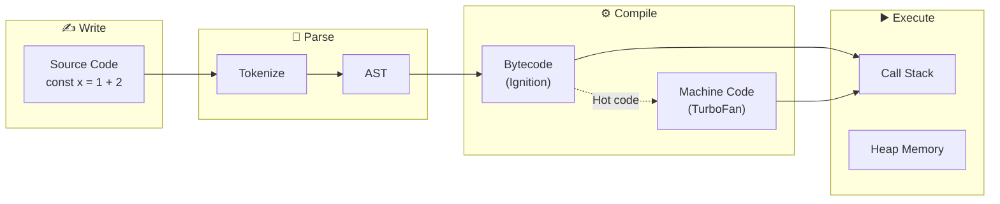

### 2.2 Kết Nối: Engine → Memory → Garbage Collection

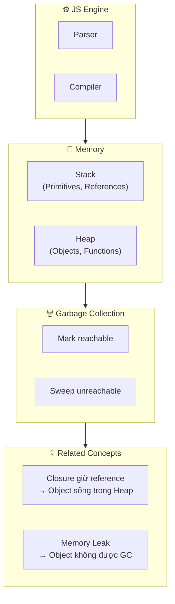

### 2.3 Ví Dụ Kết Nối

```javascript
// 1️⃣ Code này tạo gì trong memory?
function createCounter() {
  let count = 0; // Lưu trong Heap (vì closure)

  return function increment() {
    return ++count;
  };
}

const counter = createCounter();
// 'counter' reference lưu trong Stack
// Function object và 'count' lưu trong Heap
// Closure giữ 'count' sống → GC không xóa

counter(); // 1
counter(); // 2

// 2️⃣ Nếu set counter = null
counter = null;
// Không còn reference đến closure
// GC sẽ xóa function và count khỏi Heap
```

> [!TIP] > **Ghi nhớ chuỗi**:
> Code → Parse → Compile → Execute trong Stack → Objects trong Heap → GC dọn Heap

---

## 3. Async Programming: Câu Chuyện Hoàn Chỉnh

### 3.1 Vấn Đề Gốc: JavaScript là Single-Threaded

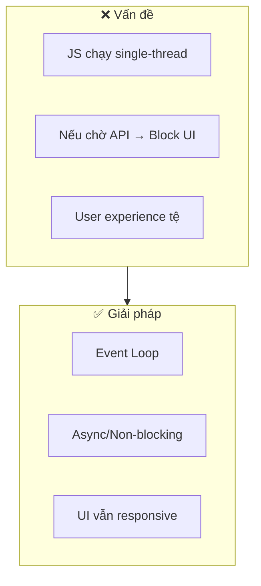

### 3.2 Evolution: Callbacks → Promises → Async/Await

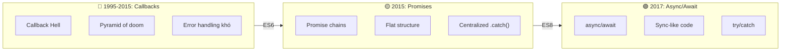

### 3.3 Event Loop: Kết Nối Tất Cả

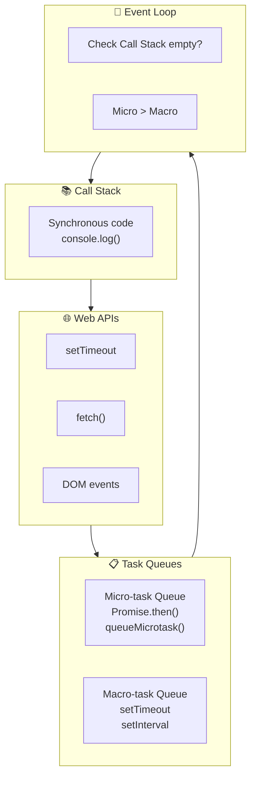

### 3.4 Tại Sao Micro-task Ưu Tiên Hơn Macro-task?

```javascript
console.log("1"); // Sync → Call Stack

setTimeout(() => {
  console.log("2"); // Macro-task Queue
}, 0);

Promise.resolve().then(() => {
  console.log("3"); // Micro-task Queue
});

console.log("4"); // Sync → Call Stack

// Output: 1, 4, 3, 2
// WHY? Vì Promise liên quan đến data consistency
// Cần resolve ngay khi có thể để không block data flow
```

> [!IMPORTANT] > **Mental Model**:
>
> - Micro-tasks = "Việc quan trọng, làm ngay khi có thể"
> - Macro-tasks = "Việc có thể đợi, làm khi rảnh"

---

## 4. React: Từ DOM đến Virtual DOM

### 4.1 Vấn Đề với DOM Trực Tiếp

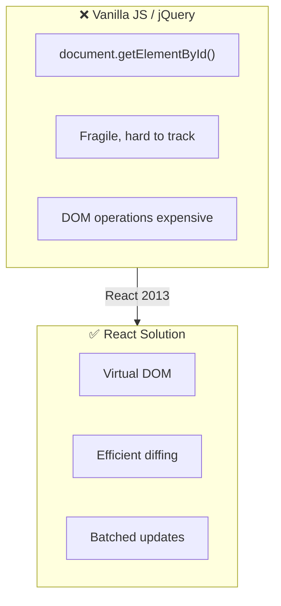

### 4.2 Chuỗi Kết Nối: State → VDOM → DOM

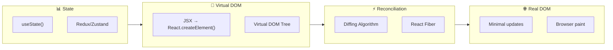

### 4.3 Hooks: Closure trong Action

```javascript
// useState uses CLOSURE to remember state between renders
function Counter() {
  // React internally:
  // let hooks = []; let index = 0;

  const [count, setCount] = useState(0);
  // First render: hooks[0] = 0
  // Re-render: return hooks[0] (closure keeps reference)

  useEffect(() => {
    // This function CLOSES OVER 'count'
    document.title = `Count: ${count}`;
  }, [count]);
  // When count changes → new closure created → effect runs

  return <button onClick={() => setCount((c) => c + 1)}>{count}</button>;
}
```

> [!TIP] > **Kết nối**: `useState` hoạt động nhờ Closure!
> React giữ array of hooks, closure giúp access đúng hook mỗi render.

### 4.4 Từ Class Components đến Hooks

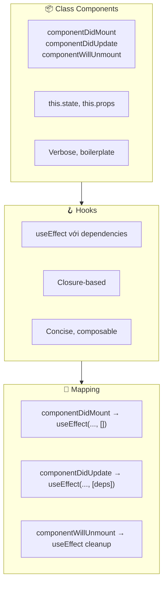

---

## 5. Data Flow: Từ Server đến UI

### 5.1 Complete Data Journey

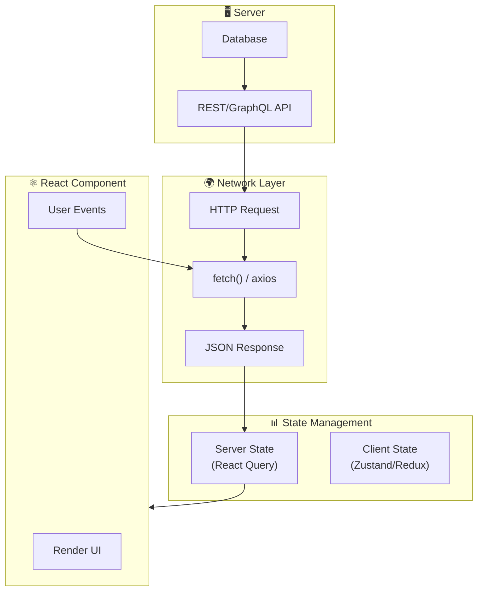

### 5.2 Kết Nối: Promise → fetch → React Query

```javascript
// 1️⃣ Low level: Promise với fetch
fetch("/api/users")
  .then((res) => res.json())
  .then((data) => setUsers(data))
  .catch((err) => setError(err));

// 2️⃣ Better: async/await
async function loadUsers() {
  try {
    const res = await fetch("/api/users");
    const data = await res.json();
    setUsers(data);
  } catch (err) {
    setError(err);
  } finally {
    setLoading(false);
  }
}

// 3️⃣ Best: React Query (abstracts all above)
const { data, isLoading, error } = useQuery({
  queryKey: ["users"],
  queryFn: () => fetch("/api/users").then((r) => r.json()),
  // Automatic: caching, deduplication, background refetch
});
// React Query uses Promises internally!
```

### 5.3 Tại Sao Server State ≠ Client State?

| Aspect        | Server State     | Client State       |
| ------------- | ---------------- | ------------------ |
| **Source**    | External (API)   | Internal (UI)      |
| **Ownership** | Backend owns     | Frontend owns      |
| **Sync**      | Can be stale     | Always fresh       |
| **Caching**   | Needs strategy   | Usually not needed |
| **Tool**      | React Query, SWR | useState, Zustand  |

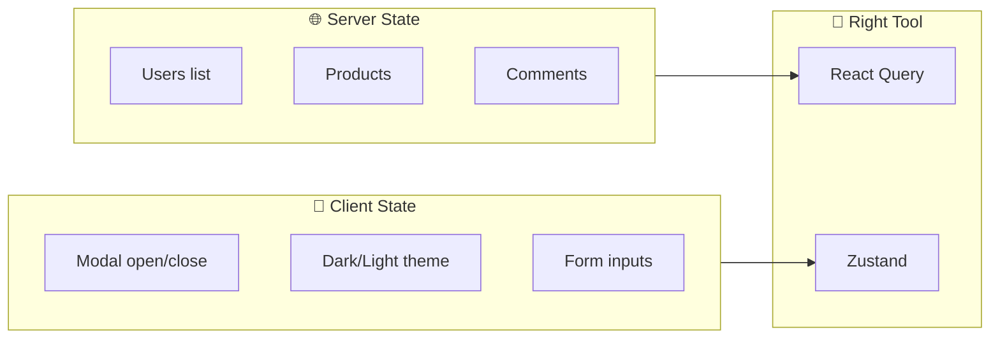

---

## 6. Performance: Mọi Thứ Kết Nối

### 6.1 Performance Web = Tổng Hợp Mọi Kiến Thức

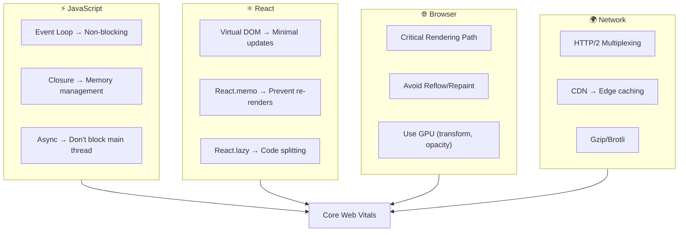

### 6.2 Core Web Vitals: Kết Quả của Tất Cả

| Metric          | Đo gì                  | Cải thiện bằng               |
| --------------- | ---------------------- | ---------------------------- |
| **LCP** < 2.5s  | Largest element loaded | SSR, Image optimization, CDN |
| **FID** < 100ms | First input delay      | Code splitting, Web Workers  |
| **CLS** < 0.1   | Layout shifts          | Reserve space, font loading  |

### 6.3 Ví Dụ Kết Nối Toàn Bộ

```javascript
// This code demonstrates ALL connections:

// 1️⃣ React Component (Virtual DOM)
function ProductList() {
  // 2️⃣ React Query (Server State, uses Promises internally)
  const { data, isLoading } = useQuery({
    queryKey: ["products"],
    queryFn: fetchProducts, // 3️⃣ async fetch (Event Loop)
    staleTime: 5 * 60 * 1000, // Caching strategy
  });

  // 4️⃣ useMemo (avoid expensive recalculation)
  const sortedProducts = useMemo(
    () => data?.sort((a, b) => b.rating - a.rating),
    [data]
  );

  // 5️⃣ Virtualization (Browser performance)
  return (
    <VirtualList
      items={sortedProducts}
      renderItem={(product) => (
        // 6️⃣ React.memo (prevent unnecessary re-renders)
        <MemoizedProductCard product={product} />
      )}
    />
  );
}

// 7️⃣ Lazy loading (Code splitting)
const ProductDetails = React.lazy(() => import("./ProductDetails"));
```

---

## 7. Memory Map: Kiến Thức Liên Kết

### 7.1 The Complete Mental Model

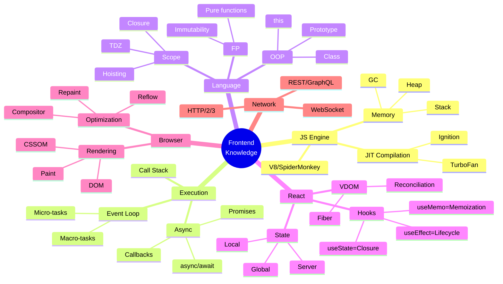

### 7.2 Câu Chuyện Để Nhớ

> **Hãy tưởng tượng bạn đang xây một ứng dụng Todo:**

1. **User types** → DOM event fires → **Event Loop** picks it up
2. **React component** receives event → calls `setTodos()`
3. **useState** (powered by **Closure**) updates state
4. **Virtual DOM** creates new tree
5. **Reconciliation** (Fiber) diffs old vs new
6. **Minimal DOM updates** applied
7. **Browser repaints** only changed parts
8. User sees update → **feels instant!**

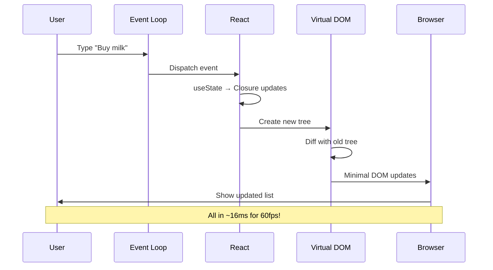

### 7.3 Quick Reference: Concept Connections

| Concept A       | Kết nối với      | Vì sao?                                |
| --------------- | ---------------- | -------------------------------------- |
| **Closure**     | useState         | Hooks giữ state qua closures           |
| **Event Loop**  | React updates    | State changes queued as microtasks     |
| **Prototype**   | React.Component  | Class inheritance                      |
| **Promise**     | fetch/axios      | Network requests return Promises       |
| **Virtual DOM** | Performance      | Avoid expensive DOM operations         |
| **GC**          | Memory leaks     | Forgotten closures prevent GC          |
| **HTTP/2**      | Bundle splitting | Multiplexing makes many small files OK |

---

## 📝 Cách Sử Dụng Tài Liệu Này

### Khi Ôn Tập

1. **Đọc Big Picture trước** (Section 1)
2. **Đi theo flow**: Engine → Async → React → Data
3. **Mỗi concept, hỏi**: "Cái này kết nối với cái gì?"

### Khi Phỏng Vấn

- Interviewer hỏi về Promise? → Nhắc đến Event Loop, Microtasks
- Hỏi về React re-render? → Nhắc đến Virtual DOM, Reconciliation
- Hỏi về Performance? → Kết nối tất cả: JS Engine, Browser, Network

### Memory Technique

```
🧠 "ENGINE runs EVENT LOOP that handles ASYNC code
    using CLOSURES, affecting REACT state,
    updating VIRTUAL DOM, causing BROWSER to render"
```

---

## 📚 Tài Liệu Tham Khảo

- Phần 1-5 của series này
- [JavaScript Event Loop Visualizer](http://latentflip.com/loupe/)
- [React Fiber Architecture](https://github.com/acdlite/react-fiber-architecture)

---

> **Tip cuối**: Khi học, luôn hỏi "Tại sao?" và "Liên quan đến gì?"
>
> **Chúc bạn phỏng vấn thành công! 🎉**
>
> _Tài liệu được tạo: 23/12/2025_
