# 📚 Tài Liệu Phỏng Vấn Frontend 2025 - Phần 7

> **Chủ đề**: 🔬 Deep Dive Visualizations - Hiểu Sâu Qua Hình Ảnh

---

## 📋 Mục Lục

1. [JavaScript Execution Deep Dive](#1-javascript-execution-deep-dive)
2. [Memory Management Visualization](#2-memory-management-visualization)
3. [Event Loop Step-by-Step](#3-event-loop-step-by-step)
4. [Promise Internals](#4-promise-internals)
5. [React Fiber Deep Dive](#5-react-fiber-deep-dive)
6. [Browser Rendering Pipeline](#6-browser-rendering-pipeline)
7. [Network Request Lifecycle](#7-network-request-lifecycle)
8. [CSS Cascade & Specificity](#8-css-cascade--specificity)

---

## 1. JavaScript Execution Deep Dive

### 1.1 Code Parsing Flow

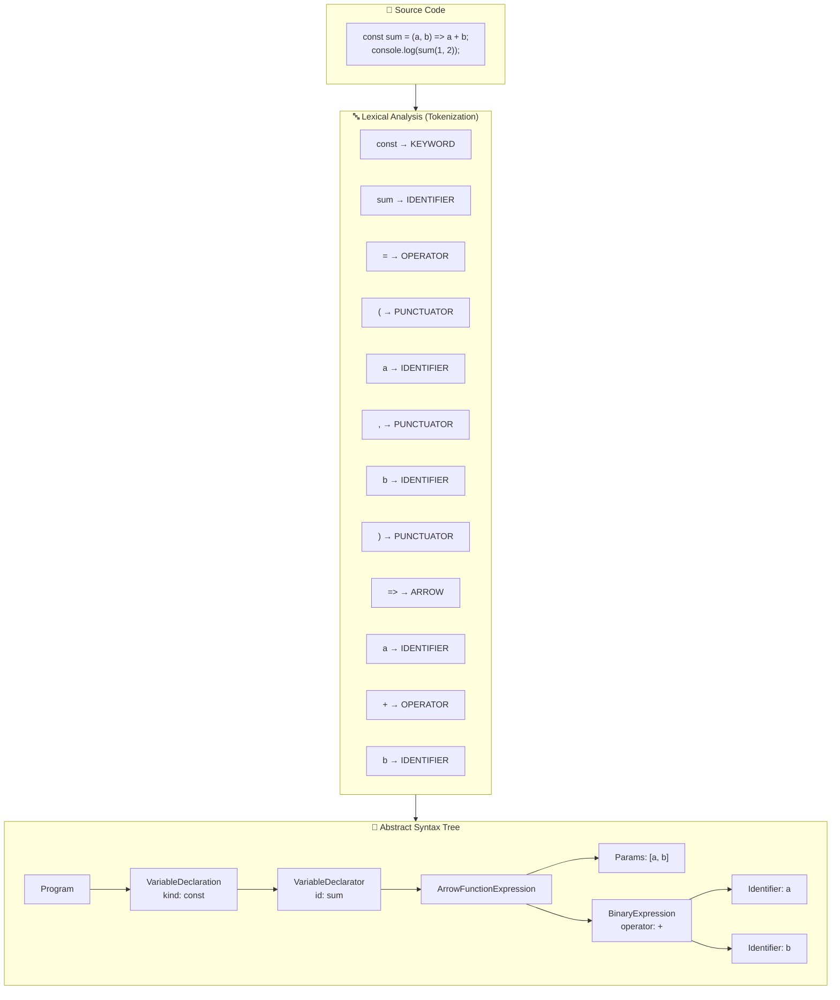

### 1.2 Execution Context Stack

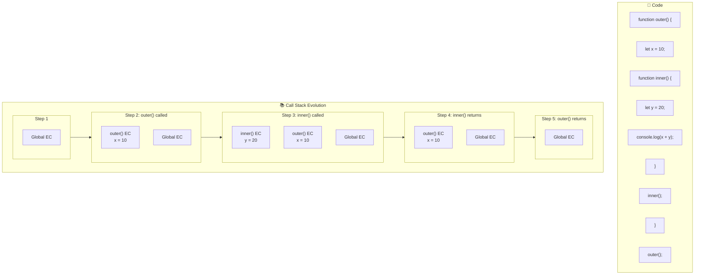

### 1.3 Scope Chain Visualization

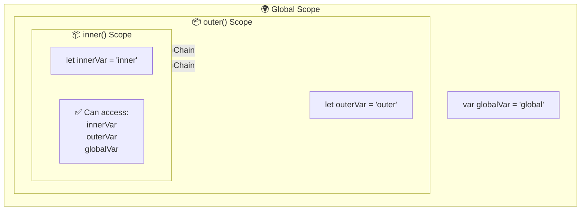

### 1.4 Variable Lifecycle với TDZ

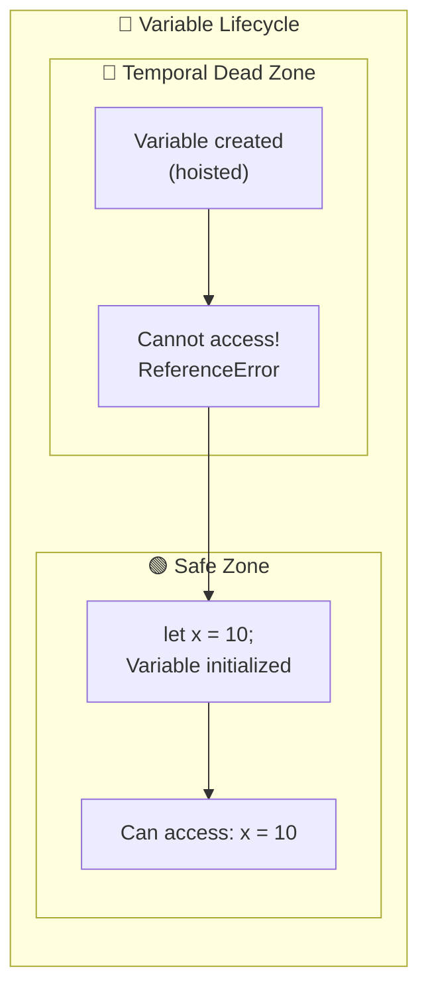

---

## 2. Memory Management Visualization

### 2.1 Stack vs Heap Memory

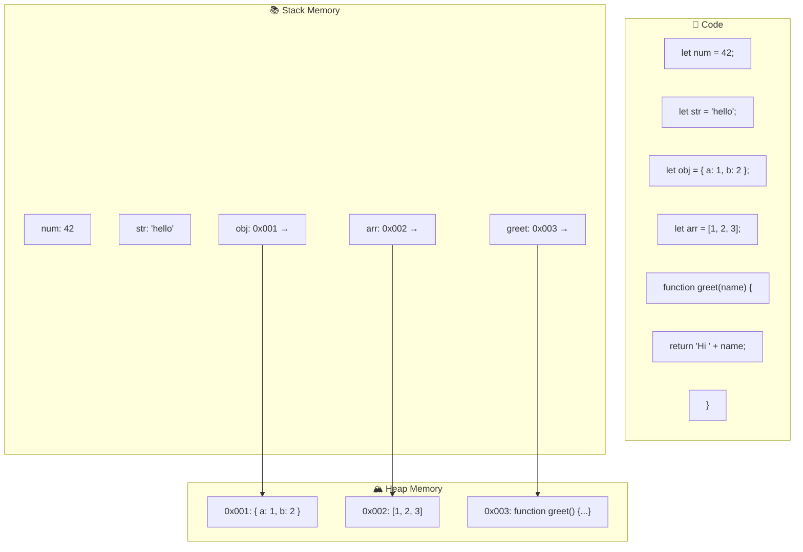

### 2.2 Garbage Collection: Mark-and-Sweep

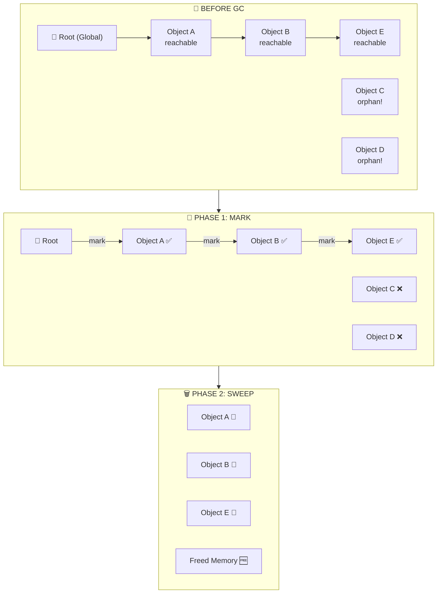

### 2.3 Closure Memory Impact

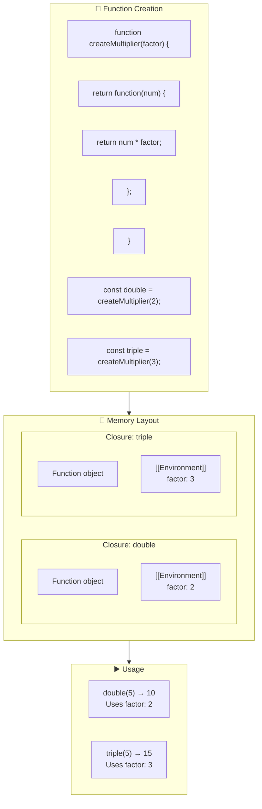

---

## 3. Event Loop Step-by-Step

### 3.1 Complete Event Loop Visualization

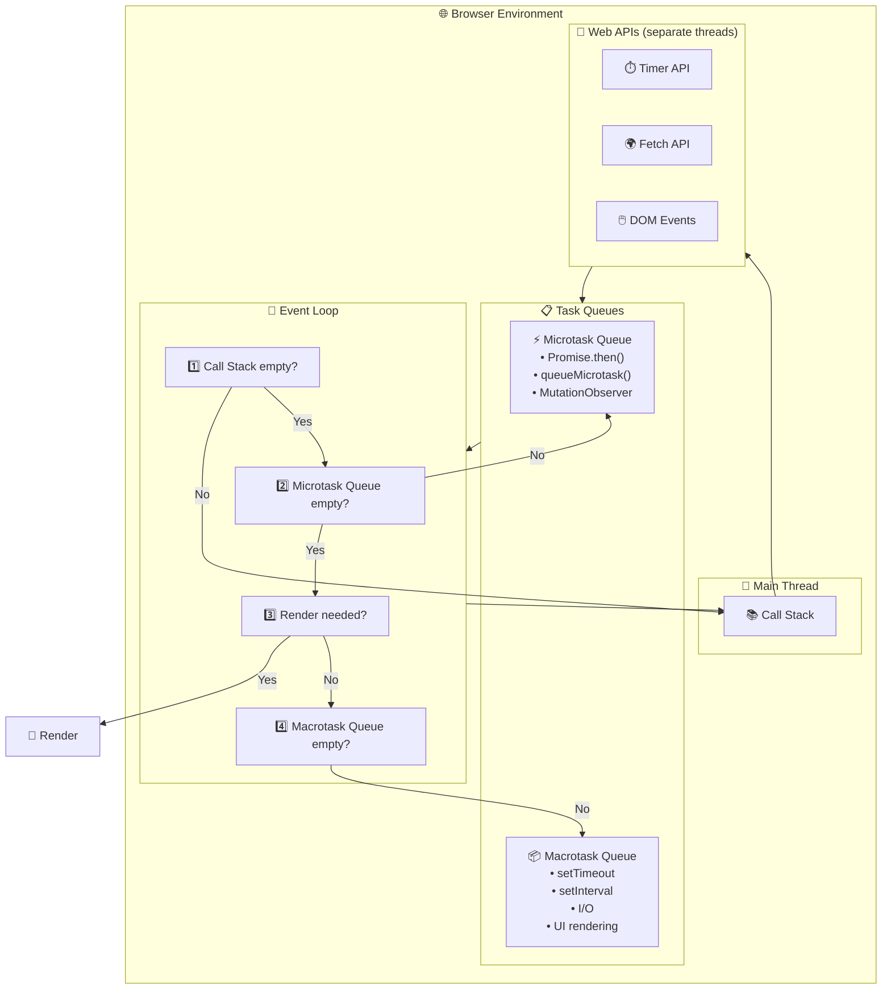

### 3.2 Code Example Step-by-Step

```javascript
console.log("1"); // A
setTimeout(() => console.log("2"), 0); // B
Promise.resolve().then(() => console.log("3")); // C
console.log("4"); // D
```

```mermaid
flowchart LR
    subgraph Step1["Step 1"]
        CS1["📚 Call Stack:<br/>console.log('1')"]
        MQ1["⚡ Micro: empty"]
        MaQ1["📦 Macro: empty"]
        Out1["Output: 1"]
    end

    subgraph Step2["Step 2"]
        CS2["📚 Call Stack:<br/>setTimeout()"]
        MQ2["⚡ Micro: empty"]
        MaQ2["📦 Macro: empty"]
        Timer["⏱️ Web API: Timer started"]
    end

    subgraph Step3["Step 3"]
        CS3["📚 Call Stack:<br/>Promise.then()"]
        MQ3["⚡ Micro: log('3')"]
        MaQ3["📦 Macro: log('2')"]
    end

    subgraph Step4["Step 4"]
        CS4["📚 Call Stack:<br/>console.log('4')"]
        MQ4["⚡ Micro: log('3')"]
        MaQ4["📦 Macro: log('2')"]
        Out4["Output: 4"]
    end

    subgraph Step5["Step 5: Stack empty, process Micro"]
        CS5["📚 Call Stack:<br/>log('3') from Micro"]
        MQ5["⚡ Micro: empty"]
        MaQ5["📦 Macro: log('2')"]
        Out5["Output: 3"]
    end

    subgraph Step6["Step 6: Micro empty, process Macro"]
        CS6["📚 Call Stack:<br/>log('2') from Macro"]
        MQ6["⚡ Micro: empty"]
        MaQ6["📦 Macro: empty"]
        Out6["Output: 2"]
    end

    Step1 --> Step2 --> Step3 --> Step4 --> Step5 --> Step6
```

---

## 4. Promise Internals

### 4.1 Promise State Machine

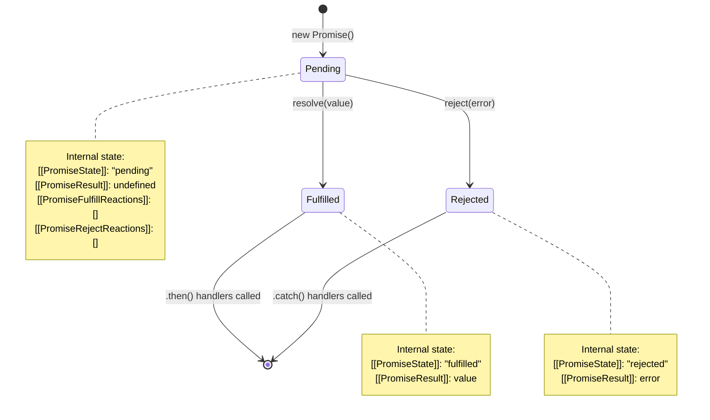

### 4.2 Promise Chain Execution

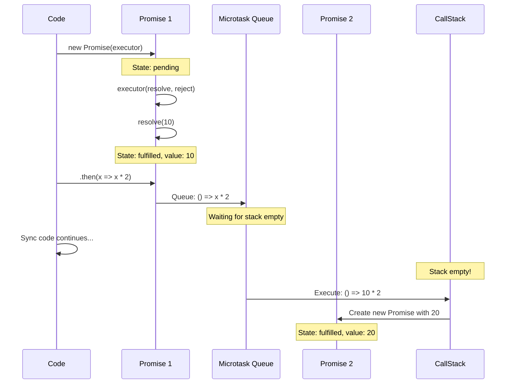

### 4.3 Promise.all Visualization

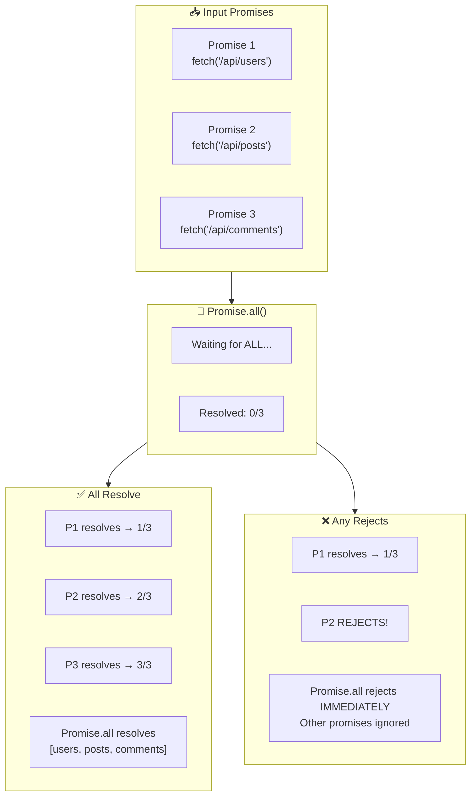

---

## 5. React Fiber Deep Dive

### 5.1 Fiber Architecture

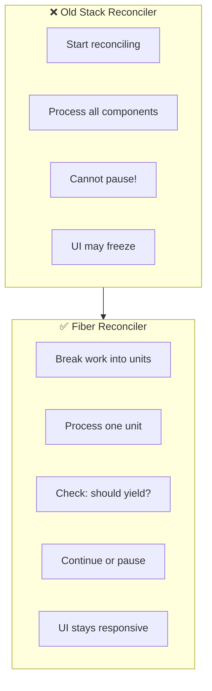

### 5.2 Fiber Node Structure

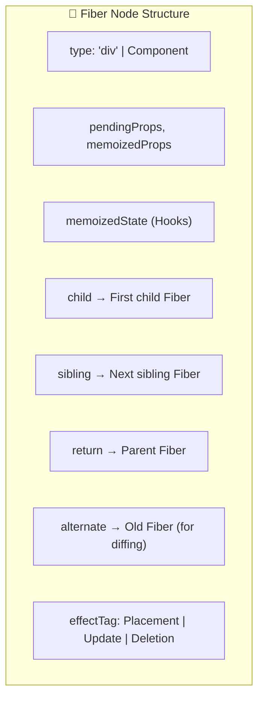

### 5.3 Reconciliation Process

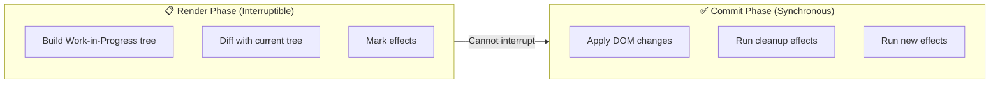

### 5.4 Hooks Linked List

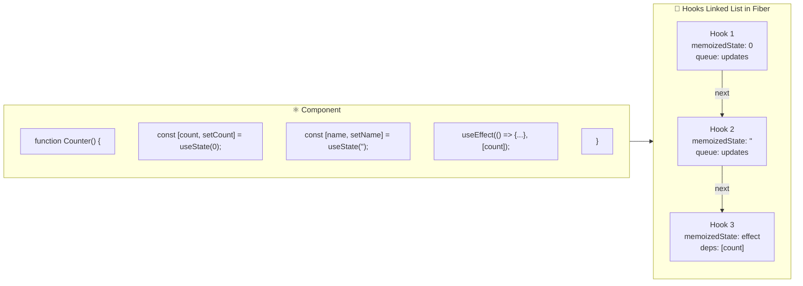

---

## 6. Browser Rendering Pipeline

### 6.1 Complete Rendering Flow

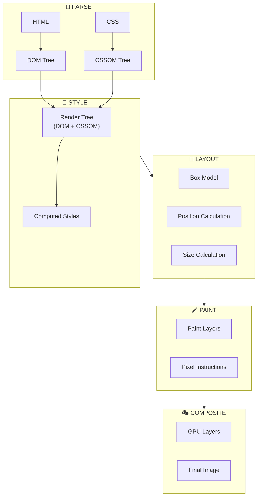

### 6.2 Reflow vs Repaint vs Composite

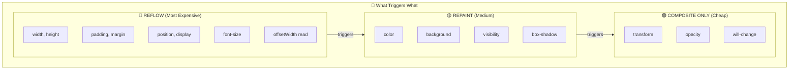

### 6.3 CSS Animation Optimization

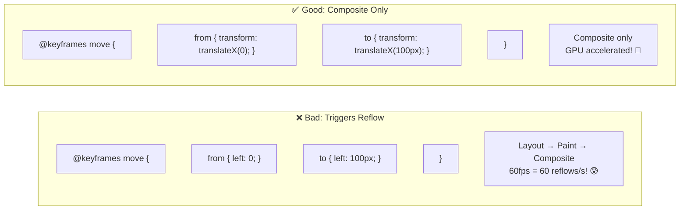

---

## 7. Network Request Lifecycle

### 7.1 HTTP Request Complete Journey

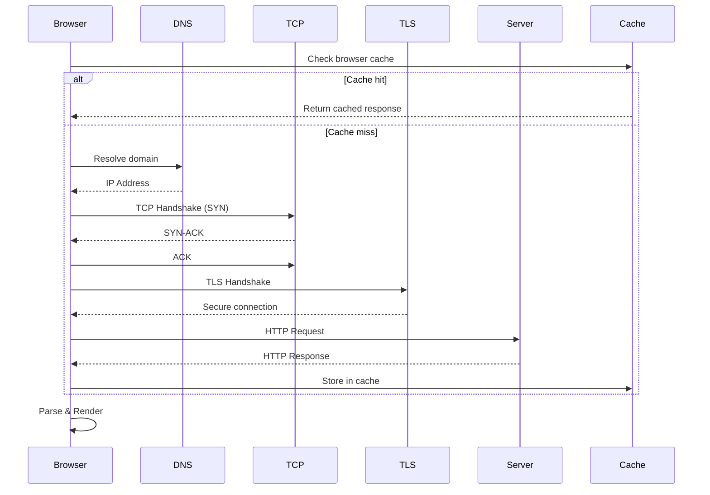

### 7.2 HTTP/2 Multiplexing

```mermaid
flowchart TB
    subgraph HTTP1["❌ HTTP/1.1"]
        Conn1["Connection 1"]
        Conn2["Connection 2"]
        Conn3["Connection 3"]

        Req1["Request 1 → Response 1"]
        Req2["Request 2 → Response 2"]
        Req3["Request 3 → Response 3"]

        Conn1 --> Req1
        Conn2 --> Req2
        Conn3 --> Req3

        Note1["🔴 6 connections limit<br/>Head-of-line blocking"]
    end

    subgraph HTTP2["✅ HTTP/2"]
        SingleConn["Single Connection"]

        Stream1["Stream 1: Request ↔ Response"]
        Stream2["Stream 2: Request ↔ Response"]
        Stream3["Stream 3: Request ↔ Response"]

        SingleConn --> Stream1
        SingleConn --> Stream2
        SingleConn --> Stream3

        Note2["🟢 Multiplexed<br/>Parallel on single connection"]
    end
```

### 7.3 Fetch API Flow

```mermaid
flowchart TB
    subgraph FetchCall["📞 fetch() Call"]
        Code["fetch('https://api.example.com/data')"]
    end

    subgraph Promise["⏳ Promise Created"]
        Pending["State: pending"]
    end

    subgraph Network["🌐 Network Request"]
        DNS["DNS Resolution"]
        TCP["TCP Connection"]
        TLS["TLS Handshake"]
        HTTP["HTTP Request/Response"]
    end

    subgraph Response["📬 Response"]
        Status["Response object<br/>status, headers"]
        Body["Body (stream)"]
    end

    subgraph Parse["📖 Parse Body"]
        JSON[".json()"]
        Text[".text()"]
        Blob[".blob()"]
    end

    subgraph Result["✅ Final Data"]
        Data["JavaScript Object"]
    end

    FetchCall --> Promise --> Network --> Response --> Parse --> Result
```

---

## 8. CSS Cascade & Specificity

### 8.1 Cascade Order

```mermaid
flowchart TB
    subgraph Cascade["🌊 CSS Cascade (Priority Low → High)"]
        L1["1️⃣ User Agent Styles<br/>(Browser defaults)"]
        L2["2️⃣ User Styles<br/>(Browser settings)"]
        L3["3️⃣ Author Styles<br/>(Your CSS)"]
        L4["4️⃣ Author !important"]
        L5["5️⃣ User !important"]
        L6["6️⃣ UA !important"]
    end

    L1 --> L2 --> L3 --> L4 --> L5 --> L6
```

### 8.2 Specificity Calculator

```mermaid
flowchart LR
    subgraph Specificity["🔢 Specificity (A, B, C, D)"]
        A["A: Inline styles<br/>style='...'"]
        B["B: IDs<br/>#id"]
        C["C: Classes, attributes<br/>.class, [attr]"]
        D["D: Elements, pseudo<br/>div, ::before"]
    end

    subgraph Examples["📝 Examples"]
        E1["div → (0,0,0,1)"]
        E2[".class → (0,0,1,0)"]
        E3["#id → (0,1,0,0)"]
        E4["#id .class div → (0,1,1,1)"]
        E5["style='' → (1,0,0,0)"]
    end
```

### 8.3 Specificity Comparison

```mermaid
flowchart TB
    subgraph Compare["⚖️ Which Wins?"]
        Rule1["#header .nav a<br/>(0,1,1,1)"]
        Rule2[".nav a.active<br/>(0,0,2,1)"]
        Rule3["nav ul li a<br/>(0,0,0,4)"]

        Winner["🏆 Winner: #header .nav a<br/>ID always beats classes"]
    end

    Rule1 --> Winner
    Rule2 -.->|"loses"| Winner
    Rule3 -.->|"loses"| Winner
```

---

## 📊 Cheat Sheet: Visual Summary

```mermaid
mindmap
  root((Frontend<br/>Visualized))
    JS Execution
      Parse → AST → Execute
      Scope Chain
      TDZ Timeline
    Memory
      Stack vs Heap
      GC Mark-Sweep
      Closure Environment
    Event Loop
      Call Stack
      Microtask Priority
      Macrotask Queue
    Promise
      State Machine
      Chain Execution
      Promise.all Flow
    React Fiber
      Work Units
      Two Phases
      Hooks Linked List
    Browser
      Render Pipeline
      Reflow < Repaint < Composite
    Network
      HTTP/2 Multiplexing
      Fetch Promise Flow
    CSS
      Cascade Order
      Specificity Calculation
```

---

> **Tip**: Visualizations help you understand the "WHY" behind the code!
>
> **Chúc bạn phỏng vấn thành công! 🎉**
>
> _Tài liệu được tạo: 23/12/2025_
