# 📚 Tài Liệu Phỏng Vấn Frontend 2025 - Phần 8

> **Chủ đề**: 🏛️ Nền Tảng Frontend - Kiến Thức Core Không Thay Đổi
>
> _Dựa trên Frontend Masters Handbook 2019 - Những kiến thức nền tảng vẫn đúng đến 2025_

---

## 📋 Mục Lục

1. [9 Core Web Technologies](#1-9-core-web-technologies)
2. [DOM Deep Dive](#2-dom-deep-dive)
3. [BOM - Browser Object Model](#3-bom---browser-object-model)
4. [CSSOM - CSS Object Model](#4-cssom---css-object-model)
5. [Web Animation](#5-web-animation)
6. [Web Fonts & Typography](#6-web-fonts--typography)
7. [Web Images & Optimization](#7-web-images--optimization)
8. [JSON & Data Formats](#8-json--data-formats)
9. [JavaScript Modules History](#9-javascript-modules-history)
10. [Frontend Architecture Patterns](#10-frontend-architecture-patterns)
11. [Multi-Device Development](#11-multi-device-development)
12. [Web Security Fundamentals](#12-web-security-fundamentals)

---

## 1. 9 Core Web Technologies

### 1.1 The Foundation Stack

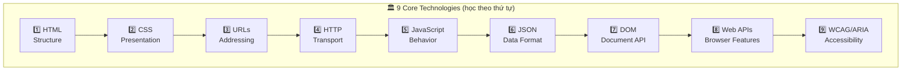

### 1.2 Chi Tiết Từng Technology

| #   | Technology     | Vai Trò                | Specification               |
| --- | -------------- | ---------------------- | --------------------------- |
| 1   | **HTML**       | Cấu trúc content       | WHATWG HTML Living Standard |
| 2   | **CSS**        | Styling, Layout        | W3C CSS Specifications      |
| 3   | **URLs**       | Resource addressing    | RFC 3986                    |
| 4   | **HTTP**       | Data transport         | RFC 7230-7237               |
| 5   | **JavaScript** | Interactivity, Logic   | ECMAScript (TC39)           |
| 6   | **JSON**       | Data interchange       | RFC 8259                    |
| 7   | **DOM**        | Document structure API | WHATWG DOM Standard         |
| 8   | **Web APIs**   | Browser capabilities   | W3C/WHATWG APIs             |
| 9   | **WCAG/ARIA**  | Accessibility          | W3C WAI                     |

### 1.3 Relationship Diagram

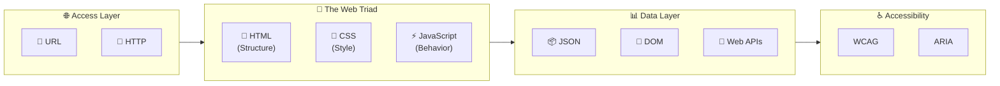

---

## 2. DOM Deep Dive

### 2.1 DOM là gì?

**DOM (Document Object Model)** là một API cho HTML và XML documents. Nó represent document như một tree structure, cho phép JavaScript thao tác với content, structure và style.

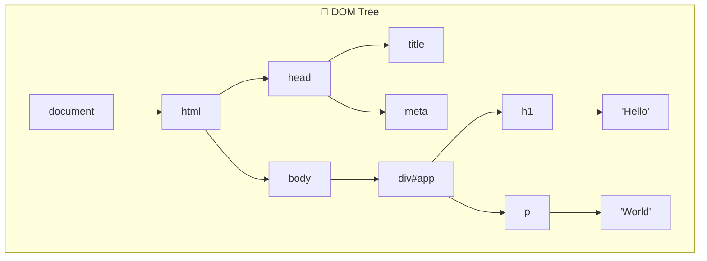

### 2.2 Node Types

| nodeType | Constant               | Mô Tả        | Ví Dụ                      |
| -------- | ---------------------- | ------------ | -------------------------- |
| 1        | ELEMENT_NODE           | Element      | `<div>`, `<p>`             |
| 2        | ATTRIBUTE_NODE         | Attribute    | `id="app"`                 |
| 3        | TEXT_NODE              | Text content | `"Hello"`                  |
| 8        | COMMENT_NODE           | Comment      | `<!-- comment -->`         |
| 9        | DOCUMENT_NODE          | Document     | `document`                 |
| 10       | DOCUMENT_TYPE_NODE     | Doctype      | `<!DOCTYPE html>`          |
| 11       | DOCUMENT_FRAGMENT_NODE | Fragment     | `createDocumentFragment()` |

### 2.3 DOM Traversal

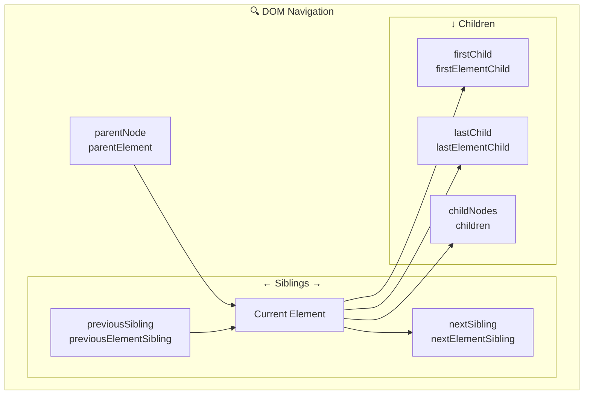

### 2.4 DOM Manipulation Methods

```javascript
// 🔍 SELECTING
document.getElementById('id');           // Single by ID
document.getElementsByClassName('class'); // HTMLCollection by class
document.getElementsByTagName('div');     // HTMLCollection by tag
document.querySelector('.class');         // First match (CSS selector)
document.querySelectorAll('.class');      // All matches (NodeList)

// ✏️ CREATING
const div = document.createElement('div');
const text = document.createTextNode('Hello');
const fragment = document.createDocumentFragment();

// 📎 INSERTING
parent.appendChild(child);               // Add at end
parent.insertBefore(new, reference);     // Add before reference
parent.append(...nodes);                 // Add multiple (ES6)
parent.prepend(...nodes);                // Add at start (ES6)
target.insertAdjacentHTML('position', html); // beforebegin, afterbegin, beforeend, afterend

// 🗑️ REMOVING
parent.removeChild(child);               // Remove child
element.remove();                        // Remove self (ES6)

// 🔄 REPLACING
parent.replaceChild(new, old);
element.replaceWith(newElement);         // (ES6)

// 📋 CLONING
element.cloneNode(false);                // Shallow (element only)
element.cloneNode(true);                 // Deep (with children)
```

### 2.5 Attributes vs Properties

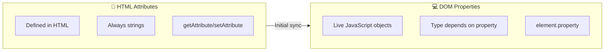

```javascript
// Attribute: HTML attribute
element.getAttribute("value"); // Initial HTML value
element.setAttribute("data-id", "123");

// Property: JavaScript property
element.value; // Current value (may differ)
element.dataset.id; // data-* attributes

// Special cases
input.checked; // Boolean property
input.getAttribute("checked"); // String or null

// Class manipulation
element.className; // String
element.classList.add("active");
element.classList.remove("active");
element.classList.toggle("active");
element.classList.contains("active");
```

---

## 3. BOM - Browser Object Model

### 3.1 BOM là gì?

**BOM (Browser Object Model)** cho phép JavaScript tương tác với browser. Không có standard chính thức, nhưng tất cả browsers đều implement tương tự.

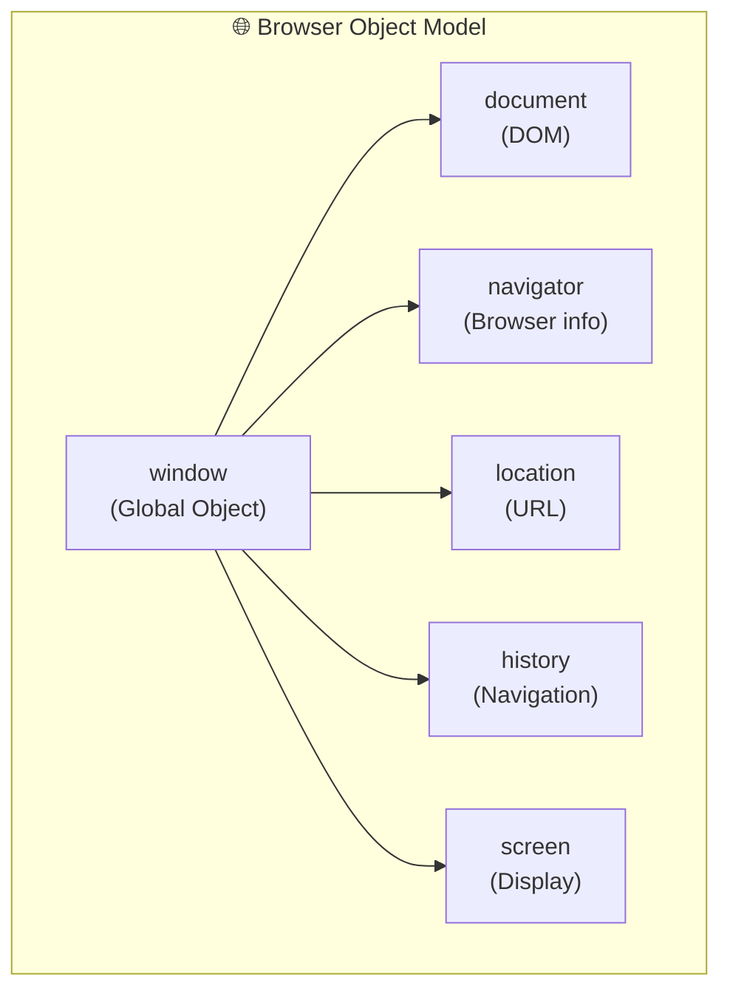

### 3.2 Window Object

```javascript
// 🪟 WINDOW DIMENSIONS
window.innerWidth; // Viewport width
window.innerHeight; // Viewport height
window.outerWidth; // Including toolbars
window.outerHeight;

window.scrollX; // Horizontal scroll
window.scrollY; // Vertical scroll

// 📍 POSITION
window.screenX; // Window position
window.screenY;

// 📜 SCROLLING
window.scrollTo(x, y);
window.scrollBy(x, y);
window.scroll({ top: 100, behavior: "smooth" });

// ⏱️ TIMERS
const id = setTimeout(fn, delay);
clearTimeout(id);
const id = setInterval(fn, interval);
clearInterval(id);
const id = requestAnimationFrame(fn); // 60fps
cancelAnimationFrame(id);

// 🔔 DIALOGS (blocking - avoid!)
alert("Message");
const result = confirm("Question?");
const input = prompt("Enter value:", "default");
```

### 3.3 Navigator Object

```javascript
// 🧭 BROWSER INFO
navigator.userAgent; // Browser string (unreliable)
navigator.language; // User language ('en-US')
navigator.languages; // Preferred languages
navigator.platform; // OS platform
navigator.cookieEnabled; // Cookies enabled?
navigator.onLine; // Online status

// 📍 GEOLOCATION
navigator.geolocation.getCurrentPosition(
  (position) => {
    const { latitude, longitude } = position.coords;
  },
  (error) => console.error(error),
  { enableHighAccuracy: true }
);

// 📎 CLIPBOARD (async)
await navigator.clipboard.writeText("text");
const text = await navigator.clipboard.readText();

// 🔔 NOTIFICATIONS
const permission = await Notification.requestPermission();
if (permission === "granted") {
  new Notification("Title", { body: "Message" });
}

// 🎤 MEDIA DEVICES
const stream = await navigator.mediaDevices.getUserMedia({
  video: true,
  audio: true,
});
```

### 3.4 Location Object

```javascript
// 📍 URL: https://example.com:8080/path/page.html?query=value#section

location.href; // Full URL
location.protocol; // 'https:'
location.host; // 'example.com:8080'
location.hostname; // 'example.com'
location.port; // '8080'
location.pathname; // '/path/page.html'
location.search; // '?query=value'
location.hash; // '#section'
location.origin; // 'https://example.com:8080'

// 🔄 NAVIGATION
location.assign("url"); // Navigate (with history)
location.replace("url"); // Navigate (no history)
location.reload(); // Reload page
location.reload(true); // Force reload

// 📊 URL Search Params (Modern)
const params = new URLSearchParams(location.search);
params.get("query"); // 'value'
params.set("key", "val");
params.append("key", "val2");
params.delete("key");
params.toString(); // 'query=value&key=val'
```

### 3.5 History Object

```javascript
// 📚 HISTORY
history.length; // Number of entries
history.back(); // Go back
history.forward(); // Go forward
history.go(-2); // Go back 2 pages
history.go(1); // Go forward 1 page

// 🔄 HISTORY API (SPA)
history.pushState(state, title, url); // Add entry
history.replaceState(state, title, url); // Replace current

// 📢 LISTEN FOR NAVIGATION
window.addEventListener("popstate", (event) => {
  console.log(event.state);
});
```

---

## 4. CSSOM - CSS Object Model

### 4.1 CSSOM là gì?

**CSSOM (CSS Object Model)** cho phép JavaScript đọc và thao tác với CSS styles.

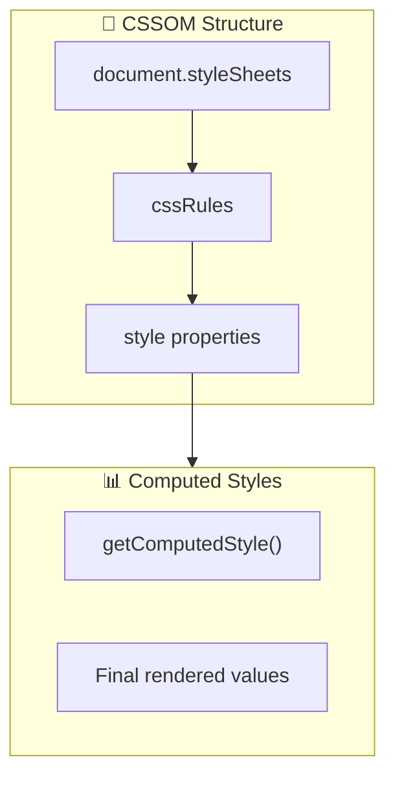

### 4.2 Accessing Styles

```javascript
// 📝 INLINE STYLES (read/write)
element.style.backgroundColor = "red";
element.style.fontSize = "16px";
element.style.cssText = "color: red; font-size: 16px;";

// 📊 COMPUTED STYLES (read-only)
const styles = getComputedStyle(element);
styles.backgroundColor; // 'rgb(255, 0, 0)'
styles.getPropertyValue("background-color");

// With pseudo-element
getComputedStyle(element, "::before").content;

// 📋 STYLESHEETS
document.styleSheets; // StyleSheetList
document.styleSheets[0].cssRules; // CSSRuleList
document.styleSheets[0].insertRule("p { color: red; }", 0);
document.styleSheets[0].deleteRule(0);
```

### 4.3 CSS Custom Properties (Variables)

```javascript
// 📝 CSS Variables
// :root { --primary-color: blue; }

// Read
getComputedStyle(document.documentElement).getPropertyValue("--primary-color");

// Write
document.documentElement.style.setProperty("--primary-color", "red");

// On specific element
element.style.setProperty("--size", "20px");
```

---

## 5. Web Animation

### 5.1 Animation Methods Comparison

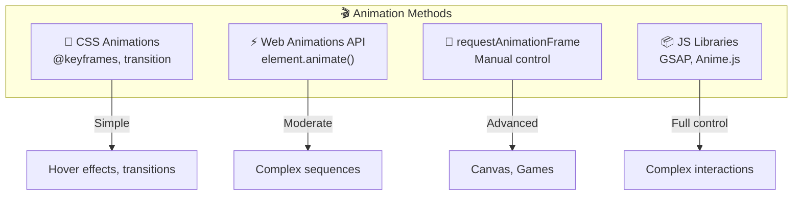

### 5.2 CSS Transitions

```css
/* 🔄 TRANSITIONS */
.button {
  background: blue;
  transition: background 300ms ease-in-out;
  /* transition: property duration timing-function delay */
}

.button:hover {
  background: red;
}

/* Multiple properties */
.card {
  transition: transform 300ms ease-out, opacity 200ms ease-in;
}

/* Timing functions */
/* ease, linear, ease-in, ease-out, ease-in-out */
/* cubic-bezier(x1, y1, x2, y2) */
```

### 5.3 CSS Keyframe Animations

```css
/* 🎬 KEYFRAMES */
@keyframes slideIn {
  0% {
    transform: translateX(-100%);
    opacity: 0;
  }
  50% {
    opacity: 0.5;
  }
  100% {
    transform: translateX(0);
    opacity: 1;
  }
}

.element {
  animation: slideIn 500ms ease-out forwards;
  /* animation: name duration timing fill-mode */

  /* All properties */
  animation-name: slideIn;
  animation-duration: 500ms;
  animation-timing-function: ease-out;
  animation-delay: 0s;
  animation-iteration-count: 1; /* infinite */
  animation-direction: normal; /* reverse, alternate */
  animation-fill-mode: forwards; /* backwards, both */
  animation-play-state: running; /* paused */
}
```

### 5.4 Web Animations API

```javascript
// ⚡ WEB ANIMATIONS API
const animation = element.animate(
  [
    // Keyframes
    { transform: "translateX(0)", opacity: 1 },
    { transform: "translateX(100px)", opacity: 0.5 },
    { transform: "translateX(200px)", opacity: 1 },
  ],
  {
    // Options
    duration: 1000,
    easing: "ease-in-out",
    iterations: Infinity,
    direction: "alternate",
    fill: "forwards",
  }
);

// Control
animation.play();
animation.pause();
animation.reverse();
animation.cancel();
animation.finish();

// Properties
animation.playbackRate = 2; // 2x speed
animation.currentTime = 500;

// Events
animation.onfinish = () => console.log("Done!");
animation.finished.then(() => console.log("Promise way"));
```

### 5.5 requestAnimationFrame

```javascript
// 🔄 ANIMATION LOOP
let startTime = null;
const duration = 1000;

function animate(timestamp) {
  if (!startTime) startTime = timestamp;
  const elapsed = timestamp - startTime;
  const progress = Math.min(elapsed / duration, 1);

  // Easing function
  const eased = easeOutCubic(progress);

  // Update element
  element.style.transform = `translateX(${eased * 200}px)`;

  if (progress < 1) {
    requestAnimationFrame(animate);
  }
}

requestAnimationFrame(animate);

// Easing functions
function easeOutCubic(t) {
  return 1 - Math.pow(1 - t, 3);
}

function easeInOutQuad(t) {
  return t < 0.5 ? 2 * t * t : 1 - Math.pow(-2 * t + 2, 2) / 2;
}
```

---

## 6. Web Fonts & Typography

### 6.1 Font Loading

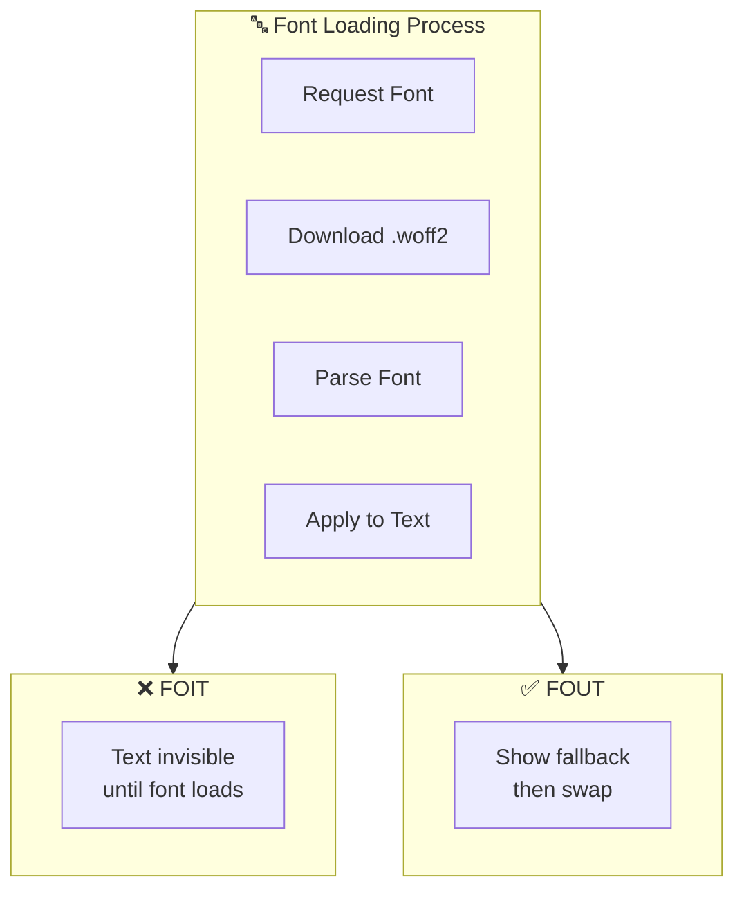

### 6.2 @font-face

```css
/* 📝 FONT FACE DECLARATION */
@font-face {
  font-family: "MyFont";
  src: local("MyFont"), url("/fonts/myfont.woff2") format("woff2"), url("/fonts/myfont.woff")
      format("woff");
  font-weight: 400;
  font-style: normal;
  font-display: swap; /* fallback, optional, block */
  unicode-range: U+0000-00FF; /* Latin subset */
}

/* Usage */
body {
  font-family: "MyFont", -apple-system, BlinkMacSystemFont, "Segoe UI", Roboto, sans-serif;
}
```

### 6.3 Font Display Strategies

| Value      | Behavior                      | Use Case             |
| ---------- | ----------------------------- | -------------------- |
| `auto`     | Browser decides               | Default              |
| `block`    | Invisible until loaded (FOIT) | Icons                |
| `swap`     | Fallback → Custom (FOUT)      | Body text ✅         |
| `fallback` | Short block, then fallback    | Balanced             |
| `optional` | May not use custom font       | Performance-critical |

### 6.4 Font Loading API

```javascript
// 📦 CSS FONT LOADING API

// Check if font is loaded
document.fonts.check("16px MyFont"); // boolean

// Load specific font
document.fonts.load("16px MyFont").then(() => {
  console.log("Font loaded!");
});

// Wait for all fonts
document.fonts.ready.then(() => {
  console.log("All fonts loaded!");
  document.body.classList.add("fonts-loaded");
});

// Add font programmatically
const font = new FontFace("MyFont", "url(/fonts/myfont.woff2)");
font.load().then((loadedFont) => {
  document.fonts.add(loadedFont);
});
```

---

## 7. Web Images & Optimization

### 7.1 Image Formats

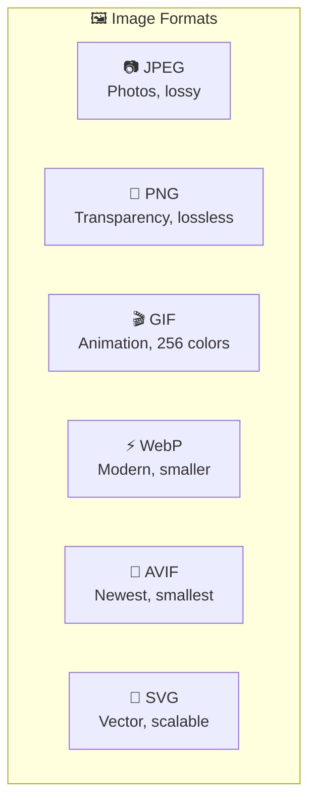

| Format   | Best For          | Transparency | Animation | Size     |
| -------- | ----------------- | ------------ | --------- | -------- |
| **JPEG** | Photos            | ❌           | ❌        | Medium   |
| **PNG**  | Graphics, text    | ✅           | ❌        | Large    |
| **GIF**  | Simple animations | ✅ (1-bit)   | ✅        | Large    |
| **WebP** | General use       | ✅           | ✅        | Small    |
| **AVIF** | Modern browsers   | ✅           | ✅        | Smallest |
| **SVG**  | Icons, logos      | ✅           | ✅ (CSS)  | Tiny     |

### 7.2 Responsive Images

```html
<!-- 📐 RESPONSIVE IMAGES -->

<!-- srcset with width descriptors -->


<!-- Art direction with picture -->
<picture>
  <source media="(min-width: 1200px)" srcset="desktop.webp" type="image/webp" />
  <source media="(min-width: 768px)" srcset="tablet.webp" type="image/webp" />
  <source srcset="mobile.webp" type="image/webp" />
  
</picture>
```

### 7.3 Lazy Loading

```html
<!-- Native lazy loading -->


<!-- Intersection Observer (more control) -->


<script>
  const observer = new IntersectionObserver(
    (entries) => {
      entries.forEach((entry) => {
        if (entry.isIntersecting) {
          const img = entry.target;
          img.src = img.dataset.src;
          img.classList.remove("lazy");
          observer.unobserve(img);
        }
      });
    },
    { rootMargin: "100px" }
  );

  document.querySelectorAll(".lazy").forEach((img) => {
    observer.observe(img);
  });
</script>
```

---

## 8. JSON & Data Formats

### 8.1 JSON Syntax

```javascript
// 📦 JSON (JavaScript Object Notation)
{
  "string": "Hello",
  "number": 42,
  "boolean": true,
  "null": null,
  "array": [1, 2, 3],
  "object": {
    "nested": "value"
  }
}

// ❌ NOT ALLOWED in JSON
{
  key: "unquoted key",       // Keys must be quoted
  'single': 'quotes',        // Must use double quotes
  undefined: undefined,      // No undefined
  function: function() {},   // No functions
  date: new Date(),          // No Date objects
  // comment                 // No comments
}
```

### 8.2 JSON Methods

```javascript
// 📝 PARSING
const obj = JSON.parse('{"name": "John"}');

// With reviver (transform values)
JSON.parse(json, (key, value) => {
  if (key === "date") return new Date(value);
  return value;
});

// 📤 STRINGIFYING
const json = JSON.stringify({ name: "John" });

// With replacer and indent
JSON.stringify(obj, null, 2); // Pretty print
JSON.stringify(obj, ["name"]); // Only include 'name'
JSON.stringify(obj, (key, value) => {
  if (key === "password") return undefined; // Exclude
  return value;
});

// 🔄 DEEP CLONE (simple objects only)
const clone = JSON.parse(JSON.stringify(obj));
```

### 8.3 Data URLs

```javascript
// 📊 DATA URLs
// data:[<mediatype>][;base64],<data>

// Inline SVG
const svg = `data:image/svg+xml,<svg>...</svg>`;

// Base64 encoded image
const img = `data:image/png;base64,iVBORw0KGgo...`;

// Convert Blob to Data URL
const reader = new FileReader();
reader.onload = () => console.log(reader.result);
reader.readAsDataURL(blob);

// Convert Canvas to Data URL
const dataUrl = canvas.toDataURL("image/png");
```

---

## 9. JavaScript Modules History

### 9.1 Evolution Timeline

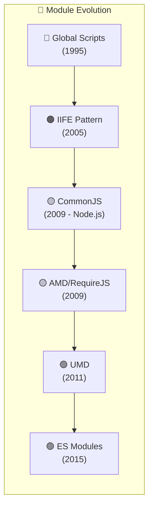

### 9.2 Pattern Examples

```javascript
// 🔴 GLOBAL (Bad)
var myLib = {};
myLib.doSomething = function () {};

// 🟠 IIFE (Better)
var myLib = (function () {
  var private = "secret";
  return {
    public: function () {},
  };
})();

// 🟡 COMMONJS (Node.js)
const fs = require("fs");
module.exports = { myFunction };

// 🟡 AMD (RequireJS)
define(["dep1", "dep2"], function (dep1, dep2) {
  return { myFunction };
});

// 🟢 ES MODULES (Modern)
import { something } from "./module.js";
export const myFunction = () => {};
export default class MyClass {}
```

### 9.3 ES Modules Deep Dive

```javascript
// 📦 ES MODULES

// Named exports
export const PI = 3.14159;
export function square(x) {
  return x * x;
}
export class Circle {}

// Default export (one per module)
export default function main() {}

// Named imports
import { PI, square } from "./math.js";

// Default import
import main from "./main.js";

// Mixed
import main, { PI, square } from "./math.js";

// Namespace import
import * as math from "./math.js";
math.PI;
math.square(5);

// Rename
import { square as sq } from "./math.js";
export { square as sq };

// Re-export
export { square } from "./math.js";
export * from "./utils.js";

// Dynamic import
const module = await import("./heavy.js");
```

---

## 10. Frontend Architecture Patterns

### 10.1 Application Architecture

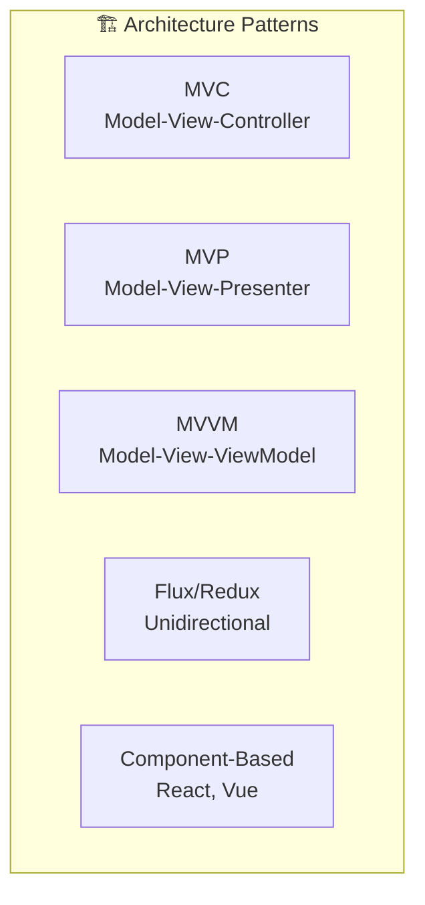

### 10.2 Component Architecture

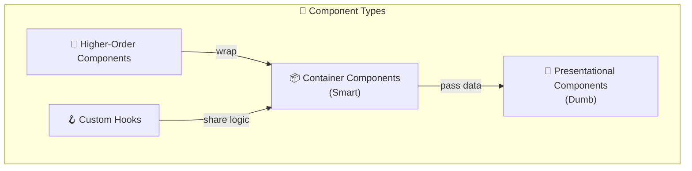

### 10.3 State Architecture

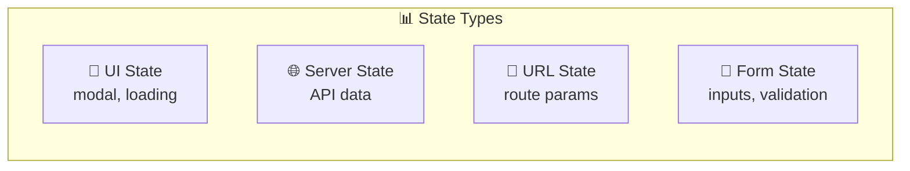

---

## 11. Multi-Device Development

### 11.1 Responsive vs Adaptive

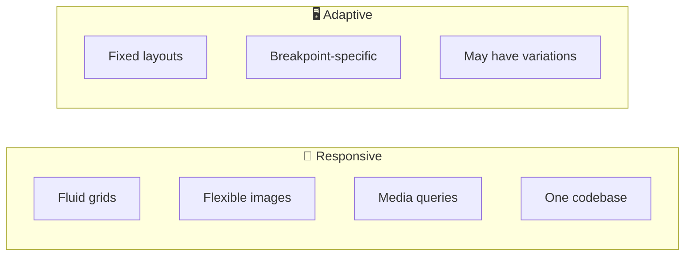

### 11.2 Media Queries

```css
/* 📐 MEDIA QUERIES */

/* Breakpoints */
@media (min-width: 576px) {
  /* Small */
}
@media (min-width: 768px) {
  /* Medium */
}
@media (min-width: 992px) {
  /* Large */
}
@media (min-width: 1200px) {
  /* XL */
}

/* Feature queries */
@media (hover: hover) {
  /* Has hover */
}
@media (prefers-color-scheme: dark) {
  /* Dark mode */
}
@media (prefers-reduced-motion: reduce) {
  /* Reduce motion */
}
@media (orientation: landscape) {
  /* Landscape */
}

/* Container queries (2023+) */
@container (min-width: 400px) {
  .card {
    flex-direction: row;
  }
}
```

### 11.3 Touch vs Pointer

```javascript
// 🖱️ POINTER EVENTS (unified)
element.addEventListener("pointerdown", handleStart);
element.addEventListener("pointermove", handleMove);
element.addEventListener("pointerup", handleEnd);

// Detect input type
element.addEventListener("pointerdown", (e) => {
  if (e.pointerType === "touch") {
    /* touch */
  }
  if (e.pointerType === "mouse") {
    /* mouse */
  }
  if (e.pointerType === "pen") {
    /* stylus */
  }
});

// 👆 TOUCH EVENTS (touch-specific)
element.addEventListener("touchstart", handleStart);
element.addEventListener("touchmove", handleMove);
element.addEventListener("touchend", handleEnd);
```

---

## 12. Web Security Fundamentals

### 12.1 Security Threats

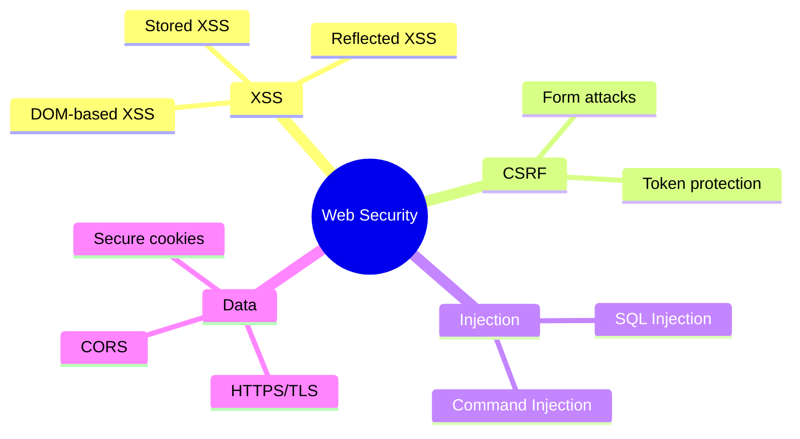

### 12.2 Content Security Policy

```html
<!-- 🔒 CSP HEADER -->
<meta
  http-equiv="Content-Security-Policy"
  content="default-src 'self';
               script-src 'self' 'nonce-abc123';
               style-src 'self' 'unsafe-inline';
               img-src 'self' data: https:;
               connect-src 'self' https://api.example.com;"
/>
```

### 12.3 Secure Cookies

```javascript
// 🍪 SECURE COOKIE ATTRIBUTES
document.cookie =
  "session=abc123; " +
  "Secure; " + // HTTPS only
  "HttpOnly; " + // No JS access
  "SameSite=Strict; " + // CSRF protection
  "Path=/; " +
  "Max-Age=3600"; // Expiry
```

### 12.4 CORS

```javascript
// 🌐 CORS (Cross-Origin Resource Sharing)

// Simple request headers (browser adds automatically)
// Origin: https://your-domain.com

// Server response headers
// Access-Control-Allow-Origin: https://your-domain.com
// Access-Control-Allow-Methods: GET, POST, PUT
// Access-Control-Allow-Headers: Content-Type
// Access-Control-Allow-Credentials: true

// Preflight request (OPTIONS)
fetch("https://api.example.com/data", {
  method: "POST",
  headers: { "Content-Type": "application/json" },
  credentials: "include", // Include cookies
});
```

---

## 📊 Tổng Kết

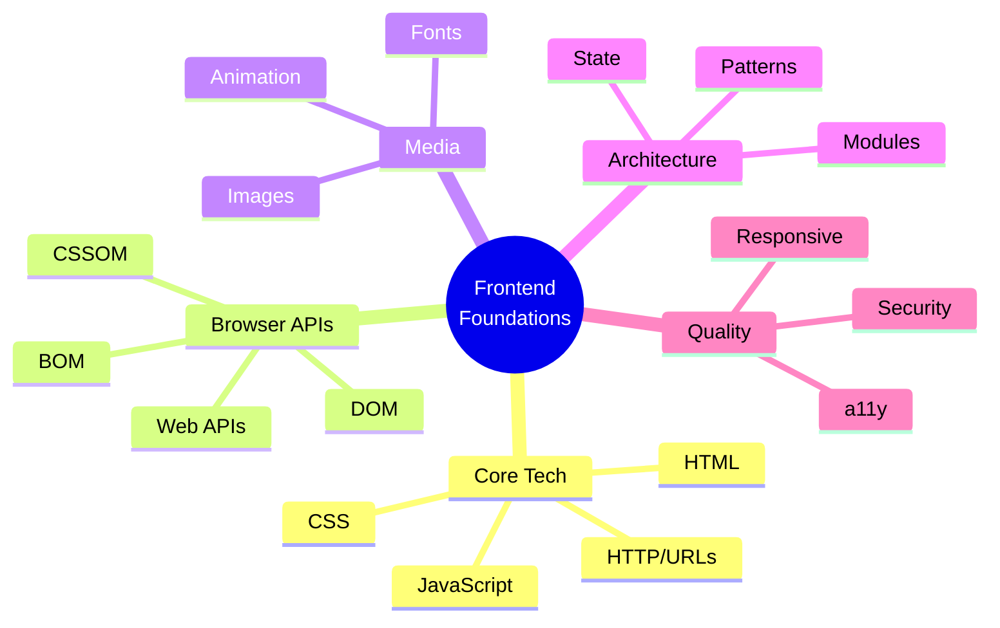

---

> **Remember**: Những kiến thức nền tảng này không bao giờ lỗi thời!
>
> **Chúc bạn phỏng vấn thành công! 🎉**
>
> _Tài liệu được tạo: 23/12/2025_
