# 📚 Tài Liệu Phỏng Vấn Frontend 2025 - Phần 9

> **Chủ đề**: 🛠️ Build Tools, Testing, Git & DevOps

---

## 📋 Mục Lục

1. [Build Tools Evolution](#1-build-tools-evolution)
2. [Webpack Deep Dive](#2-webpack-deep-dive)
3. [Vite & Modern Bundlers](#3-vite--modern-bundlers)
4. [Testing Deep Dive](#4-testing-deep-dive)
5. [Git & Version Control](#5-git--version-control)
6. [Chrome DevTools Mastery](#6-chrome-devtools-mastery)
7. [Debugging Techniques](#7-debugging-techniques)
8. [CI/CD for Frontend](#8-cicd-for-frontend)
9. [Code Quality Tools](#9-code-quality-tools)
10. [Câu Hỏi Phỏng Vấn](#10-câu-hỏi-phỏng-vấn)

---

## 1. Build Tools Evolution

### 1.1 Timeline

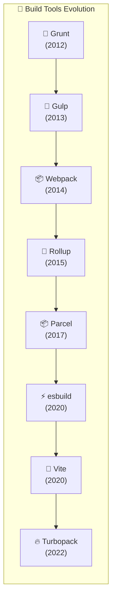

### 1.2 Tool Comparison

| Tool          | Speed      | Config      | Use Case     | Language   |
| ------------- | ---------- | ----------- | ------------ | ---------- |
| **Webpack**   | Moderate   | Complex     | Full control | JavaScript |
| **Vite**      | Fast (dev) | Simple      | Modern apps  | JavaScript |
| **esbuild**   | Fastest    | Minimal     | Libraries    | Go         |
| **Rollup**    | Fast       | Moderate    | Libraries    | JavaScript |
| **Parcel**    | Fast       | Zero-config | Quick start  | Rust       |
| **Turbopack** | Very Fast  | Next.js     | Next.js apps | Rust       |

### 1.3 What Build Tools Do

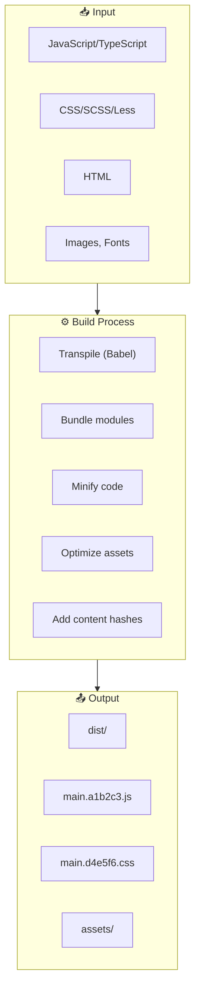

---

## 2. Webpack Deep Dive

### 2.1 Core Concepts

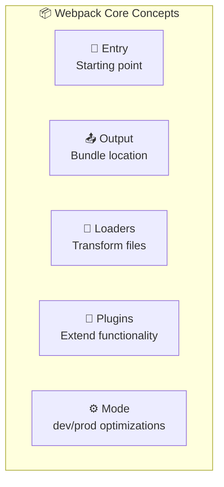

### 2.2 Basic Configuration

```javascript
// webpack.config.js
const path = require("path");
const HtmlWebpackPlugin = require("html-webpack-plugin");
const MiniCssExtractPlugin = require("mini-css-extract-plugin");

module.exports = {
  // 🚪 Entry point
  entry: "./src/index.js",

  // 📤 Output
  output: {
    path: path.resolve(__dirname, "dist"),
    filename: "[name].[contenthash].js",
    clean: true,
  },

  // ⚙️ Mode
  mode: "production", // or 'development'

  // 🔧 Loaders
  module: {
    rules: [
      // JavaScript/TypeScript
      {
        test: /\.(js|jsx|ts|tsx)$/,
        exclude: /node_modules/,
        use: "babel-loader",
      },
      // CSS
      {
        test: /\.css$/,
        use: [MiniCssExtractPlugin.loader, "css-loader"],
      },
      // SCSS
      {
        test: /\.scss$/,
        use: [MiniCssExtractPlugin.loader, "css-loader", "sass-loader"],
      },
      // Images
      {
        test: /\.(png|jpg|gif|svg)$/,
        type: "asset/resource",
      },
    ],
  },

  // 🔌 Plugins
  plugins: [
    new HtmlWebpackPlugin({
      template: "./src/index.html",
    }),
    new MiniCssExtractPlugin({
      filename: "[name].[contenthash].css",
    }),
  ],

  // 📦 Code Splitting
  optimization: {
    splitChunks: {
      chunks: "all",
      cacheGroups: {
        vendor: {
          test: /[\\/]node_modules[\\/]/,
          name: "vendors",
          chunks: "all",
        },
      },
    },
  },

  // 🔍 Source Maps
  devtool: "source-map",

  // 🖥️ Dev Server
  devServer: {
    port: 3000,
    hot: true,
    historyApiFallback: true,
  },
};
```

### 2.3 Common Loaders

| Loader         | Purpose             | Files                        |
| -------------- | ------------------- | ---------------------------- |
| `babel-loader` | Transpile JS/TS     | `.js`, `.jsx`, `.ts`, `.tsx` |
| `css-loader`   | Resolve CSS imports | `.css`                       |
| `style-loader` | Inject CSS to DOM   | `.css`                       |
| `sass-loader`  | Compile SCSS        | `.scss`, `.sass`             |
| `file-loader`  | Copy files          | images, fonts                |
| `url-loader`   | Inline small files  | images, fonts                |
| `ts-loader`    | Compile TypeScript  | `.ts`, `.tsx`                |

### 2.4 Common Plugins

| Plugin                 | Purpose                 |
| ---------------------- | ----------------------- |
| `HtmlWebpackPlugin`    | Generate HTML file      |
| `MiniCssExtractPlugin` | Extract CSS to files    |
| `DefinePlugin`         | Define env variables    |
| `CopyWebpackPlugin`    | Copy static files       |
| `BundleAnalyzerPlugin` | Visualize bundle size   |
| `CompressionPlugin`    | Gzip/Brotli compression |

---

## 3. Vite & Modern Bundlers

### 3.1 Why Vite is Fast

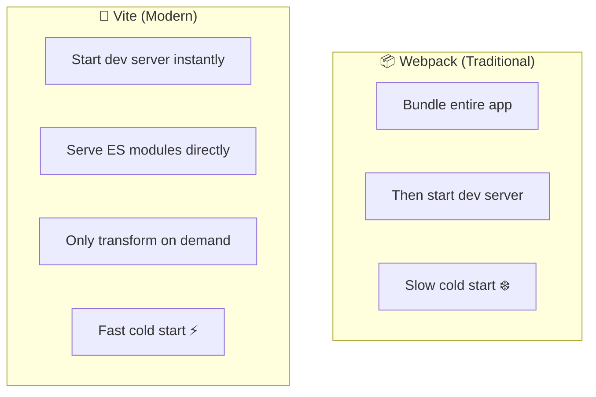

### 3.2 Vite Configuration

```javascript
// vite.config.js
import { defineConfig } from "vite";
import react from "@vitejs/plugin-react";
import path from "path";

export default defineConfig({
  // 🔌 Plugins
  plugins: [react()],

  // 🔧 Resolve
  resolve: {
    alias: {
      "@": path.resolve(__dirname, "./src"),
      "@components": path.resolve(__dirname, "./src/components"),
    },
  },

  // 🖥️ Dev Server
  server: {
    port: 3000,
    open: true,
    proxy: {
      "/api": {
        target: "http://localhost:8080",
        changeOrigin: true,
      },
    },
  },

  // 📦 Build
  build: {
    outDir: "dist",
    sourcemap: true,
    rollupOptions: {
      output: {
        manualChunks: {
          vendor: ["react", "react-dom"],
          utils: ["lodash", "axios"],
        },
      },
    },
  },

  // 🎨 CSS
  css: {
    modules: {
      localsConvention: "camelCase",
    },
    preprocessorOptions: {
      scss: {
        additionalData: `@import "@/styles/variables.scss";`,
      },
    },
  },
});
```

### 3.3 esbuild

```javascript
// esbuild.config.js
const esbuild = require("esbuild");

esbuild
  .build({
    entryPoints: ["src/index.ts"],
    bundle: true,
    minify: true,
    sourcemap: true,
    target: ["es2020"],
    outfile: "dist/bundle.js",
    loader: {
      ".png": "dataurl",
      ".svg": "text",
    },
    define: {
      "process.env.NODE_ENV": '"production"',
    },
  })
  .catch(() => process.exit(1));
```

---

## 4. Testing Deep Dive

### 4.1 Testing Pyramid

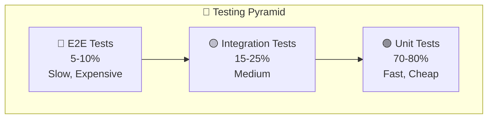

### 4.2 Testing Tools Ecosystem

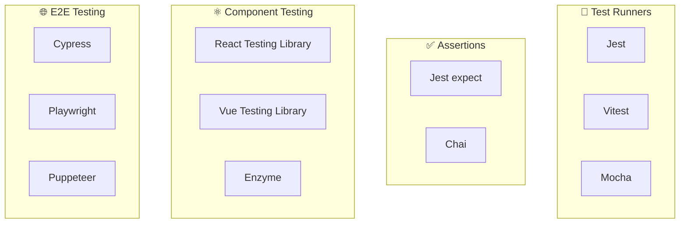

### 4.3 Jest Configuration

```javascript
// jest.config.js
module.exports = {
  // 🎯 Test environment
  testEnvironment: "jsdom",

  // 📁 Setup files
  setupFilesAfterEnv: ["<rootDir>/src/setupTests.js"],

  // 🔍 Module resolution
  moduleNameMapper: {
    "^@/(.*)$": "<rootDir>/src/$1",
    "\\.(css|scss)$": "identity-obj-proxy",
    "\\.(jpg|png|svg)$": "<rootDir>/__mocks__/fileMock.js",
  },

  // 📊 Coverage
  collectCoverageFrom: [
    "src/**/*.{js,jsx,ts,tsx}",
    "!src/index.js",
    "!src/**/*.d.ts",
  ],
  coverageThreshold: {
    global: {
      branches: 80,
      functions: 80,
      lines: 80,
      statements: 80,
    },
  },

  // 🔧 Transform
  transform: {
    "^.+\\.(js|jsx|ts|tsx)$": "babel-jest",
  },
};
```

### 4.4 React Testing Library Examples

```javascript
import { render, screen, fireEvent, waitFor } from "@testing-library/react";
import userEvent from "@testing-library/user-event";
import Counter from "./Counter";

// 🧪 Basic rendering
test("renders counter with initial value", () => {
  render(<Counter initialValue={0} />);
  expect(screen.getByText("Count: 0")).toBeInTheDocument();
});

// 🖱️ User interactions
test("increments counter on button click", async () => {
  const user = userEvent.setup();
  render(<Counter initialValue={0} />);

  const button = screen.getByRole("button", { name: /increment/i });
  await user.click(button);

  expect(screen.getByText("Count: 1")).toBeInTheDocument();
});

// ⏳ Async testing
test("loads data on mount", async () => {
  render(<UserProfile userId="1" />);

  // Wait for loading to complete
  await waitFor(() => {
    expect(screen.queryByText("Loading...")).not.toBeInTheDocument();
  });

  expect(screen.getByText("John Doe")).toBeInTheDocument();
});

// 🎭 Mocking
jest.mock("./api", () => ({
  fetchUser: jest.fn(() => Promise.resolve({ name: "John" })),
}));

// 📸 Snapshot testing
test("matches snapshot", () => {
  const { container } = render(<Button>Click me</Button>);
  expect(container).toMatchSnapshot();
});
```

### 4.5 Cypress E2E

```javascript
// cypress/e2e/login.cy.js
describe("Login Flow", () => {
  beforeEach(() => {
    cy.visit("/login");
  });

  it("should login successfully", () => {
    // Type credentials
    cy.get('[data-testid="email"]').type("user@example.com");
    cy.get('[data-testid="password"]').type("password123");

    // Submit form
    cy.get('[data-testid="submit"]').click();

    // Assert redirect
    cy.url().should("include", "/dashboard");
    cy.get('[data-testid="welcome"]').should("contain", "Welcome");
  });

  it("should show error for invalid credentials", () => {
    cy.get('[data-testid="email"]').type("wrong@email.com");
    cy.get('[data-testid="password"]').type("wrongpass");
    cy.get('[data-testid="submit"]').click();

    cy.get('[data-testid="error"]').should("be.visible");
  });

  // 🔧 API stubbing
  it("should handle API errors", () => {
    cy.intercept("POST", "/api/login", {
      statusCode: 500,
      body: { error: "Server error" },
    });

    cy.get('[data-testid="submit"]').click();
    cy.get('[data-testid="error"]').should("contain", "Server error");
  });
});
```

---

## 5. Git & Version Control

### 5.1 Git Flow

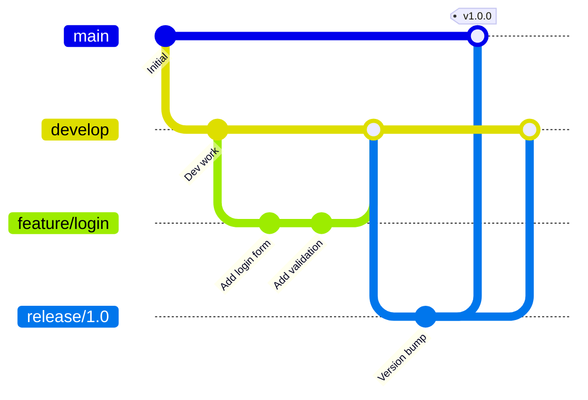

### 5.2 Essential Commands

```bash
# 📦 SETUP
git init                          # Initialize repo
git clone <url>                   # Clone repo
git remote add origin <url>       # Add remote

# 📝 BASIC WORKFLOW
git status                        # Check status
git add .                         # Stage all files
git add -p                        # Interactive staging
git commit -m "message"           # Commit
git push origin main              # Push to remote

# 🌿 BRANCHING
git branch                        # List branches
git branch feature/name           # Create branch
git checkout feature/name         # Switch branch
git checkout -b feature/name      # Create & switch
git branch -d feature/name        # Delete branch

# 🔄 MERGING
git merge feature/name            # Merge branch
git merge --no-ff feature/name    # Merge with commit
git rebase main                   # Rebase onto main

# 📥 UPDATING
git fetch                         # Fetch updates
git pull                          # Fetch & merge
git pull --rebase                 # Fetch & rebase

# 🔍 HISTORY
git log --oneline                 # Compact log
git log --graph                   # Visual log
git blame <file>                  # Who changed what

# ↩️ UNDOING
git checkout -- <file>            # Discard changes
git reset HEAD <file>             # Unstage file
git reset --soft HEAD~1           # Undo commit (keep changes)
git reset --hard HEAD~1           # Undo commit (discard)
git revert <commit>               # Create reverse commit

# 📦 STASHING
git stash                         # Stash changes
git stash list                    # List stashes
git stash pop                     # Apply & remove stash
git stash apply                   # Apply & keep stash
```

### 5.3 Conventional Commits

```bash
# Format: <type>(<scope>): <subject>

# Types:
feat:     # New feature
fix:      # Bug fix
docs:     # Documentation
style:    # Formatting
refactor: # Code restructuring
test:     # Adding tests
chore:    # Maintenance

# Examples:
git commit -m "feat(auth): add login page"
git commit -m "fix(cart): resolve quantity update bug"
git commit -m "docs: update README installation steps"
git commit -m "refactor(api): extract fetch logic to hook"
```

### 5.4 Git Hooks (Husky)

```javascript
// package.json
{
  "scripts": {
    "prepare": "husky install"
  },
  "lint-staged": {
    "*.{js,jsx,ts,tsx}": [
      "eslint --fix",
      "prettier --write"
    ],
    "*.{css,scss}": "prettier --write"
  }
}

// .husky/pre-commit
#!/bin/sh
npx lint-staged

// .husky/commit-msg
#!/bin/sh
npx commitlint --edit $1
```

---

## 6. Chrome DevTools Mastery

### 6.1 Panel Overview

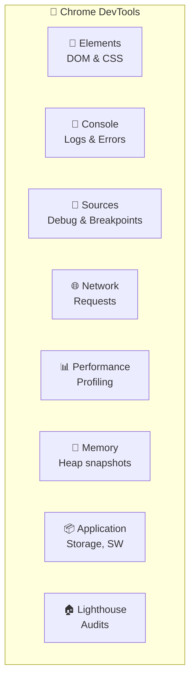

### 6.2 Console Tips

```javascript
// 📝 LOGGING
console.log("Basic log");
console.info("ℹ️ Info");
console.warn("⚠️ Warning");
console.error("❌ Error");

// 📊 FORMATTING
console.table([
  { a: 1, b: 2 },
  { a: 3, b: 4 },
]);
console.dir(document.body); // Interactive object
console.group("Group");
console.log("Nested");
console.groupEnd();

// ⏱️ TIMING
console.time("fetch");
await fetch("/api/data");
console.timeEnd("fetch"); // fetch: 234ms

// 📈 COUNTING
console.count("click"); // click: 1
console.count("click"); // click: 2

// 🎨 STYLING
console.log("%cStyled!", "color: red; font-size: 20px;");

// 📍 STACK TRACE
console.trace("Where am I?");

// ✅ ASSERTIONS
console.assert(1 === 2, "This will show");
```

### 6.3 Network Panel Tips

| Feature         | Shortcut/Action            |
| --------------- | -------------------------- |
| Filter XHR only | Click "Fetch/XHR"          |
| Search requests | `Cmd+F`                    |
| Block request   | Right-click → Block        |
| Copy as cURL    | Right-click → Copy as cURL |
| Throttling      | "No throttling" dropdown   |
| Preserve log    | Checkbox                   |
| Disable cache   | Checkbox                   |

### 6.4 Performance Panel

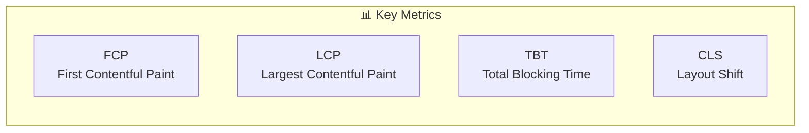

---

## 7. Debugging Techniques

### 7.1 Breakpoint Types

| Type                | Use Case                      |
| ------------------- | ----------------------------- |
| **Line breakpoint** | Pause at specific line        |
| **Conditional**     | Pause when condition is true  |
| **DOM**             | Pause on DOM changes          |
| **XHR/Fetch**       | Pause on network requests     |
| **Event listener**  | Pause on events (click, etc.) |
| **Exception**       | Pause on exceptions           |

### 7.2 Debugging in Code

```javascript
// 🛑 DEBUGGER STATEMENT
function processData(data) {
  debugger; // Pauses execution here
  return data.map((item) => item.value);
}

// 📝 CONSOLE DEBUGGING
function complexFunction(a, b) {
  console.log("Input:", { a, b });

  const result = a + b;
  console.log("Result:", result);

  return result;
}

// 🔍 CONDITIONAL LOGGING
function process(items) {
  items.forEach((item, i) => {
    if (i === 5) debugger; // Only pause at index 5
    // or
    if (item.error) console.error("Error at:", i, item);
  });
}
```

### 7.3 React DevTools

```javascript
// 🔍 COMPONENT DEBUGGING

// Add displayName for better debugging
const MyComponent = () => <div>Content</div>;
MyComponent.displayName = "MyComponent";

// Use React DevTools hooks
// - Highlight updates
// - Component profiler
// - Props/State inspection

// Debug re-renders
import { useEffect, useRef } from "react";

function useWhyDidYouUpdate(name, props) {
  const previousProps = useRef();

  useEffect(() => {
    if (previousProps.current) {
      const allKeys = Object.keys({ ...previousProps.current, ...props });
      const changes = {};

      allKeys.forEach((key) => {
        if (previousProps.current[key] !== props[key]) {
          changes[key] = {
            from: previousProps.current[key],
            to: props[key],
          };
        }
      });

      if (Object.keys(changes).length) {
        console.log("[why-did-update]", name, changes);
      }
    }
    previousProps.current = props;
  });
}
```

---

## 8. CI/CD for Frontend

### 8.1 CI/CD Pipeline

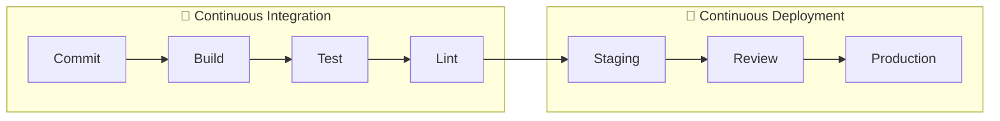

### 8.2 GitHub Actions

```yaml
# .github/workflows/ci.yml
name: CI/CD Pipeline

on:
  push:
    branches: [main, develop]
  pull_request:
    branches: [main]

jobs:
  build-and-test:
    runs-on: ubuntu-latest

    steps:
      # 📥 Checkout
      - uses: actions/checkout@v4

      # 📦 Setup Node
      - uses: actions/setup-node@v4
        with:
          node-version: "20"
          cache: "npm"

      # 📥 Install dependencies
      - run: npm ci

      # 🔍 Lint
      - run: npm run lint

      # 📦 Build
      - run: npm run build

      # 🧪 Test
      - run: npm run test -- --coverage

      # 📊 Upload coverage
      - uses: codecov/codecov-action@v3
        with:
          files: ./coverage/lcov.info

  deploy:
    needs: build-and-test
    if: github.ref == 'refs/heads/main'
    runs-on: ubuntu-latest

    steps:
      - uses: actions/checkout@v4

      - uses: actions/setup-node@v4
        with:
          node-version: "20"
          cache: "npm"

      - run: npm ci
      - run: npm run build

      # 🚀 Deploy to Vercel
      - uses: amondnet/vercel-action@v25
        with:
          vercel-token: ${{ secrets.VERCEL_TOKEN }}
          vercel-org-id: ${{ secrets.ORG_ID }}
          vercel-project-id: ${{ secrets.PROJECT_ID }}
          vercel-args: "--prod"
```

### 8.3 Environment Variables

```yaml
# .github/workflows/deploy.yml
env:
  NODE_ENV: production

jobs:
  deploy:
    steps:
      - run: npm run build
        env:
          VITE_API_URL: ${{ secrets.API_URL }}
          VITE_GA_ID: ${{ secrets.GA_ID }}
```

---

## 9. Code Quality Tools

### 9.1 ESLint Configuration

```javascript
// .eslintrc.js
module.exports = {
  root: true,
  env: {
    browser: true,
    es2021: true,
    node: true,
  },
  extends: [
    "eslint:recommended",
    "plugin:react/recommended",
    "plugin:react-hooks/recommended",
    "plugin:@typescript-eslint/recommended",
    "prettier", // Must be last
  ],
  parser: "@typescript-eslint/parser",
  plugins: ["react", "@typescript-eslint"],
  rules: {
    "react/react-in-jsx-scope": "off",
    "react/prop-types": "off",
    "@typescript-eslint/no-unused-vars": "warn",
    "no-console": ["warn", { allow: ["warn", "error"] }],
  },
  settings: {
    react: {
      version: "detect",
    },
  },
};
```

### 9.2 Prettier Configuration

```javascript
// .prettierrc.js
module.exports = {
  semi: true,
  singleQuote: true,
  tabWidth: 2,
  trailingComma: 'es5',
  printWidth: 80,
  bracketSpacing: true,
  arrowParens: 'avoid',
};

// .prettierignore
node_modules
dist
coverage
*.min.js
```

### 9.3 TypeScript Configuration

```javascript
// tsconfig.json
{
  "compilerOptions": {
    "target": "ES2020",
    "lib": ["ES2020", "DOM", "DOM.Iterable"],
    "module": "ESNext",
    "moduleResolution": "bundler",

    // Strict mode
    "strict": true,
    "noImplicitAny": true,
    "strictNullChecks": true,

    // Module
    "esModuleInterop": true,
    "allowSyntheticDefaultImports": true,

    // Output
    "noEmit": true,
    "declaration": true,

    // Path aliases
    "baseUrl": ".",
    "paths": {
      "@/*": ["src/*"]
    }
  },
  "include": ["src"],
  "exclude": ["node_modules"]
}
```

---

## 10. Câu Hỏi Phỏng Vấn

### 10.1 Build Tools

<details>
<summary><strong>Q: Webpack vs Vite - khác nhau gì?</strong></summary>

**A:**

- **Webpack**: Bundle tất cả trước khi serve → Cold start chậm
- **Vite**: Serve ES modules trực tiếp, transform on-demand → Fast dev
- Vite dùng esbuild (Go) để transpile, nhanh hơn Babel nhiều lần

</details>

<details>
<summary><strong>Q: Tree shaking là gì?</strong></summary>

**A:** Loại bỏ unused code khi build. Chỉ hoạt động với ES Modules (static analysis). CommonJS không hỗ trợ do dynamic imports.

</details>

### 10.2 Testing

<details>
<summary><strong>Q: Unit test vs Integration test vs E2E?</strong></summary>

**A:**

- **Unit**: Test isolated function/component
- **Integration**: Test component interactions
- **E2E**: Test full user flows in real browser

Ratio: 70% unit, 20% integration, 10% E2E

</details>

### 10.3 Git

<details>
<summary><strong>Q: git rebase vs git merge?</strong></summary>

**A:**

- **Merge**: Tạo merge commit, giữ history đầy đủ
- **Rebase**: Rewrite history, linear history
- Rule: Không rebase public/shared branches

</details>

---

## 📊 Tổng Kết

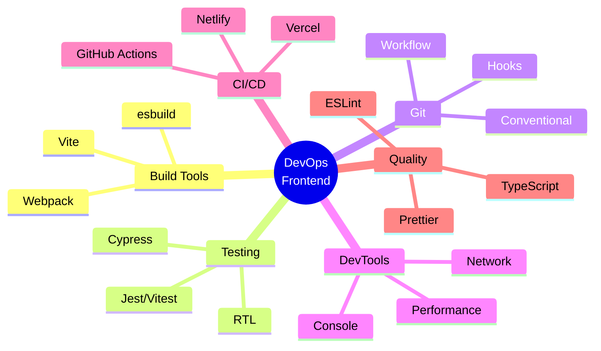

---

> **Chúc bạn phỏng vấn thành công! 🎉**
>
> _Tài liệu được tạo: 23/12/2025_
