# 📚 Tài Liệu Chuẩn Bị Phỏng Vấn Frontend Middle-Senior 2025

> **Chủ đề chính**: JavaScript Asynchronous Programming, Event Loop, Closures & Memory Management

---

## 📋 Mục Lục

1. [Event Loop và Main Thread](#1-event-loop-và-main-thread)
2. [Callback và Callback Hell](#2-callback-và-callback-hell)
3. [Promise - Giải pháp cho Callback Hell](#3-promise---giải-pháp-cho-callback-hell)
4. [Promise Chain](#4-promise-chain)
5. [Async/Await - Cú pháp hiện đại](#5-asyncawait---cú-pháp-hiện-đại)
6. [Promise APIs nâng cao](#6-promise-apis-nâng-cao)
7. [Closure và Garbage Collection](#7-closure-và-garbage-collection)
8. [Hoisting và Execution Context](#8-hoisting-và-execution-context)
9. [This Keyword](#9-this-keyword)
10. [Câu Hỏi Phỏng Vấn Thường Gặp](#10-câu-hỏi-phỏng-vấn-thường-gặp)

---

## 1. Event Loop và Main Thread

### 1.1 Định Nghĩa

**Event Loop** là cơ chế cho phép JavaScript thực thi code, xử lý events và thực hiện các tác vụ bất đồng bộ mặc dù JavaScript là **single-threaded** (đơn luồng).

### 1.2 Kiến Trúc Tổng Quan

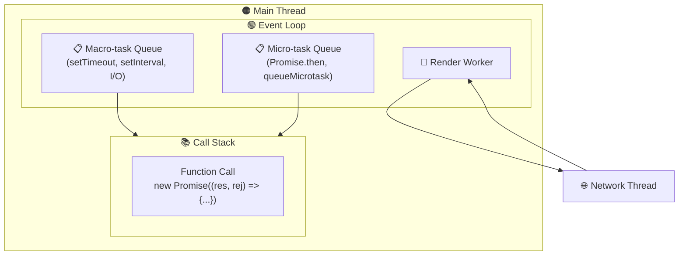

### 1.3 Các Thành Phần Chính

| Thành Phần           | Mô Tả                                                        | Ví Dụ                                   |
| -------------------- | ------------------------------------------------------------ | --------------------------------------- |
| **Call Stack**       | Nơi lưu trữ các function đang được thực thi theo thứ tự LIFO | `console.log()`, function calls         |
| **Macro-task Queue** | Hàng đợi các tác vụ "lớn"                                    | `setTimeout`, `setInterval`, I/O events |
| **Micro-task Queue** | Hàng đợi các tác vụ "nhỏ", **ưu tiên cao hơn**               | `Promise.then()`, `queueMicrotask()`    |
| **Render Worker**    | Xử lý việc render giao diện                                  | Paint, Layout                           |
| **Network Thread**   | Xử lý các request mạng (riêng biệt với Main Thread)          | `fetch()`, XHR                          |

### 1.4 Thứ Tự Thực Thi

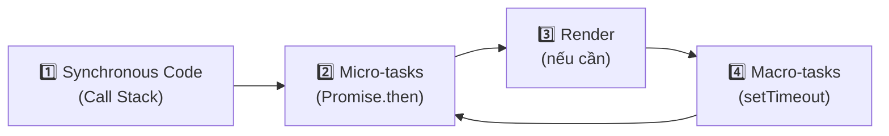

> [!IMPORTANT] > **Quy tắc vàng**: Micro-tasks LUÔN được thực thi TRƯỚC Macro-tasks trong mỗi vòng lặp Event Loop!

### 1.5 Ví Dụ Minh Họa

```javascript
console.log("1️⃣ Start"); // Sync

setTimeout(() => {
  console.log("4️⃣ Timeout"); // Macro-task
}, 0);

Promise.resolve().then(() => {
  console.log("3️⃣ Promise"); // Micro-task
});

console.log("2️⃣ End"); // Sync

// Output: 1️⃣ Start → 2️⃣ End → 3️⃣ Promise → 4️⃣ Timeout
```

---

## 2. Callback và Callback Hell

### 2.1 Callback là gì?

**Callback** là một function được truyền vào một function khác như một tham số, và sẽ được gọi lại (call back) sau khi một tác vụ bất đồng bộ hoàn thành.

### 2.2 Cách Callback Hoạt Động

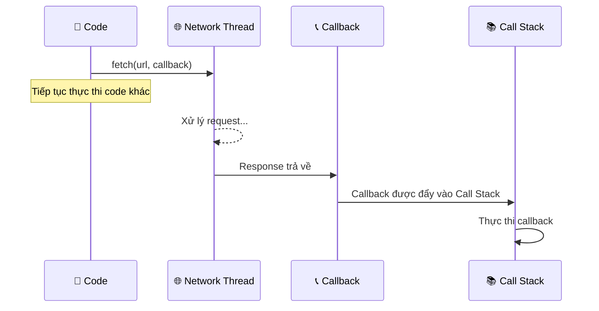

### 2.3 Mô Hình Callback Truyền Thống

```javascript
// Pattern: Error-first callback
fetch("https://api.example.com", (err, data) => {
  if (err) {
    return console.error(err); // 👈 Tham số đầu tiên là error
  }
  console.log("Success", data); // 👈 Tham số thứ hai là data
});
```

> [!NOTE] > **Convention trong Node.js**: Callback luôn nhận `error` làm tham số đầu tiên. Nếu không có lỗi, `error` sẽ là `null`.

### 2.4 Callback Hell (Pyramid of Doom) 🔥

Khi có nhiều tác vụ bất đồng bộ phụ thuộc lẫn nhau, code sẽ trở nên khó đọc và khó bảo trì:

```javascript
// ❌ Callback Hell - KHÔNG NÊN
fetchUser(userId, (err, user) => {
  if (err) return handleError(err);

  fetchOrders(user.id, (err, orders) => {
    if (err) return handleError(err);

    fetchProducts(orders[0].id, (err, products) => {
      if (err) return handleError(err);

      fetchDetails(products[0].id, (err, details) => {
        if (err) return handleError(err);

        // 😱 Ngày càng lồng nhau sâu hơn...
        console.log(details);
      });
    });
  });
});
```

### 2.5 Vấn Đề của Callback Hell

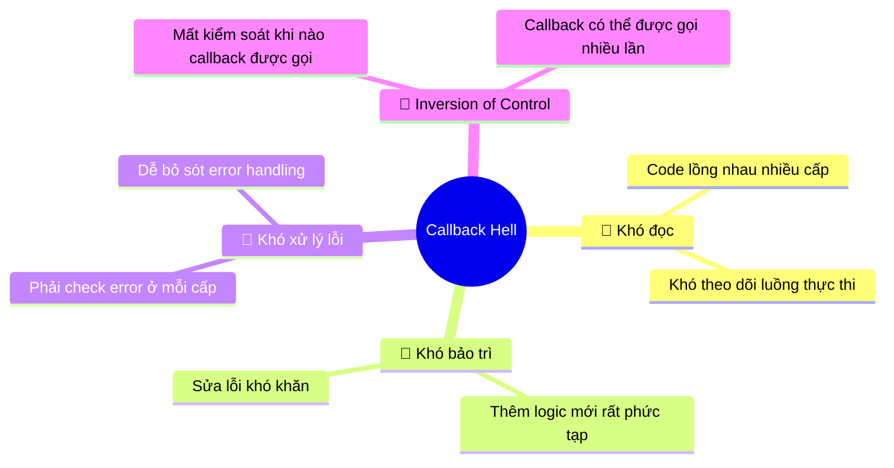

---

## 3. Promise - Giải Pháp cho Callback Hell

### 3.1 Promise là gì?

**Promise** là một object đại diện cho kết quả (hoặc lỗi) của một tác vụ bất đồng bộ trong tương lai.

> [!TIP]
> Hãy tưởng tượng Promise như một "lời hứa" - bạn gọi API và nhận lại một "lời hứa" rằng kết quả sẽ được trả về sau.

### 3.2 Ba Trạng Thái của Promise

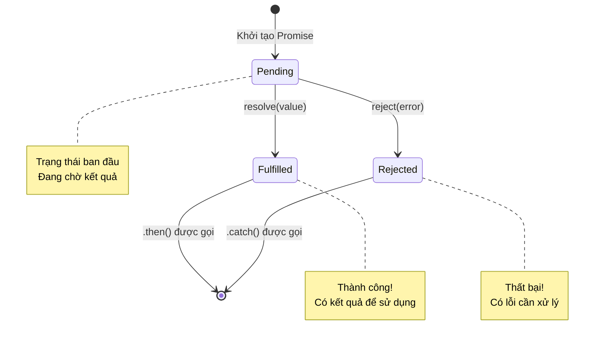

### 3.3 Cách Tạo Promise

```javascript
// Tạo một Promise
const myPromise = new Promise((resolve, reject) => {
  const randomNumber = Math.random();

  if (randomNumber > 0.5) {
    resolve(randomNumber); // ✅ Fulfilled
  } else {
    reject("The number was less than 0.5."); // ❌ Rejected
  }
});

// Sử dụng Promise
myPromise
  .then((number) => console.log(number)) // Xử lý khi fulfilled
  .catch((error) => console.error(error)); // Xử lý khi rejected
```

### 3.4 Promise trong Event Loop

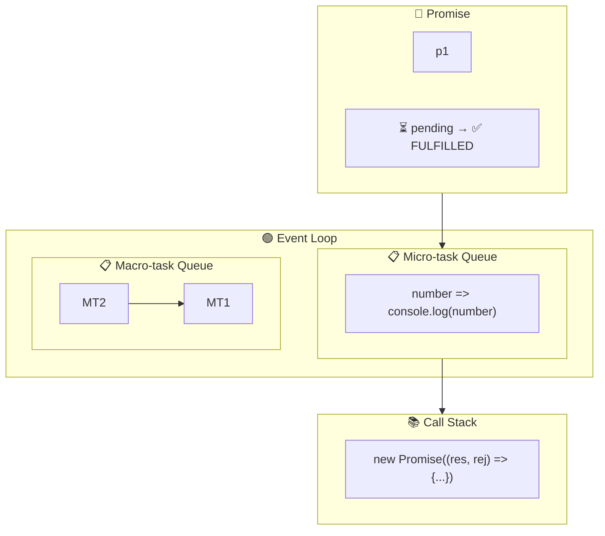

### 3.5 Cách Promise Hoạt Động

| Bước | Mô Tả                                                                                     |
| ---- | ----------------------------------------------------------------------------------------- |
| 1️⃣   | Khi `new Promise()` được gọi, callback bên trong thực thi ngay lập tức (synchronous)      |
| 2️⃣   | Promise được tạo với trạng thái `pending`                                                 |
| 3️⃣   | Khi `resolve()` hoặc `reject()` được gọi, Promise chuyển sang `fulfilled` hoặc `rejected` |
| 4️⃣   | Callback trong `.then()` hoặc `.catch()` được đẩy vào **Micro-task Queue**                |
| 5️⃣   | Event Loop thực thi callback từ Micro-task Queue khi Call Stack trống                     |

---

## 4. Promise Chain

### 4.1 Từ Callback Hell đến Promise Chain

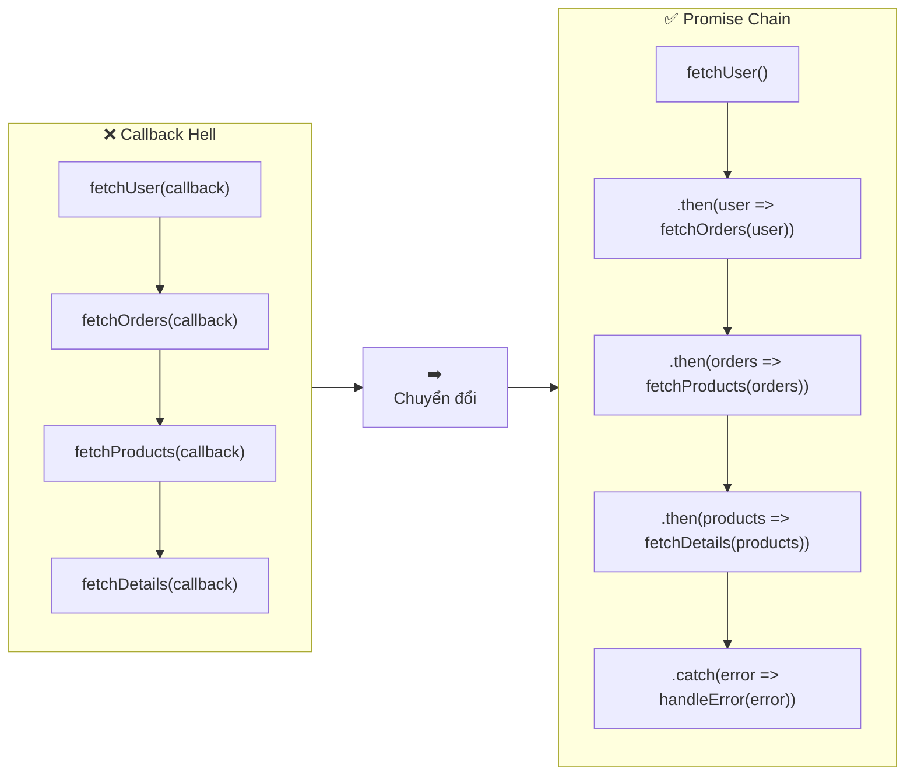

### 4.2 Ví Dụ Promise Chain

```javascript
// ✅ Promise Chain - NÊN DÙNG
fetchUser(userId)
  .then((user) => {
    console.log("1. User:", user);
    return fetchOrders(user.id);
  })
  .then((orders) => {
    console.log("2. Orders:", orders);
    return fetchProducts(orders[0].id);
  })
  .then((products) => {
    console.log("3. Products:", products);
    return fetchDetails(products[0].id);
  })
  .then((details) => {
    console.log("4. Details:", details);
  })
  .catch((error) => {
    // 🎯 Xử lý TẤT CẢ lỗi ở MỘT nơi duy nhất
    console.error("Error:", error);
  });
```

### 4.3 Ưu Điểm của Promise Chain

| Đặc Điểm          | Callback Hell        | Promise Chain            |
| ----------------- | -------------------- | ------------------------ |
| **Cấu trúc code** | Lồng nhau (pyramid)  | Phẳng (flat)             |
| **Xử lý lỗi**     | Phải check ở mỗi cấp | Một `.catch()` cuối cùng |
| **Đọc code**      | Khó theo dõi         | Dễ đọc từ trên xuống     |
| **Thêm step mới** | Phức tạp             | Thêm `.then()` mới       |

---

## 5. Async/Await - Cú Pháp Hiện Đại

### 5.1 Async/Await là gì?

**Async/Await** là syntactic sugar (cú pháp "đường") được xây dựng trên Promise, giúp viết code bất đồng bộ trông giống như code đồng bộ.

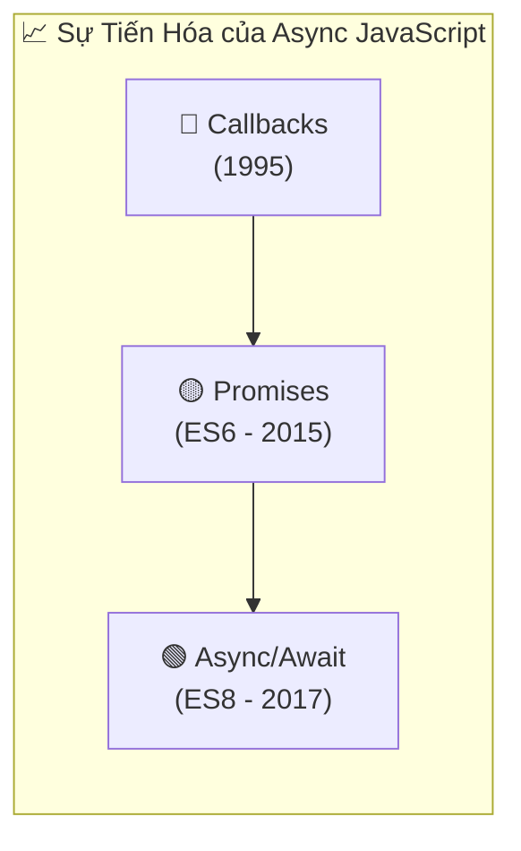

### 5.2 Cú Pháp Cơ Bản

```javascript
// ✅ Async function với await
async function fetchUserData(userId) {
  try {
    const user = await fetchUser(userId); // Đợi kết quả
    const orders = await fetchOrders(user.id); // Đợi kết quả
    const products = await fetchProducts(orders[0].id);

    console.log("All data loaded:", { user, orders, products });
    return products;
  } catch (error) {
    console.error("Error:", error);
    throw error; // Re-throw nếu cần
  }
}
```

### 5.3 So Sánh Promise Chain vs Async/Await

| Đặc Điểm        | Promise Chain    | Async/Await               |
| --------------- | ---------------- | ------------------------- |
| **Cú pháp**     | `.then().then()` | `await ... await`         |
| **Xử lý lỗi**   | `.catch()`       | `try/catch`               |
| **Readability** | Tốt              | Tuyệt vời                 |
| **Debugging**   | Khó hơn          | Dễ hơn (stack trace rõ)   |
| **Parallel**    | `Promise.all()`  | `Promise.all()` với await |

### 5.4 Thực Thi Song Song với Async/Await

```javascript
// ❌ SAI - Thực thi tuần tự (chậm)
async function fetchAllSequential() {
  const user = await fetchUser(); // 2s
  const posts = await fetchPosts(); // 2s
  const comments = await fetchComments(); // 2s
  // Tổng: 6 giây 😰
}

// ✅ ĐÚNG - Thực thi song song (nhanh)
async function fetchAllParallel() {
  const [user, posts, comments] = await Promise.all([
    fetchUser(), // 2s
    fetchPosts(), // 2s (chạy đồng thời)
    fetchComments(), // 2s (chạy đồng thời)
  ]);
  // Tổng: 2 giây 🚀
}
```

> [!WARNING] > **Lỗi thường gặp**: Dùng `await` trong vòng lặp `forEach` sẽ KHÔNG hoạt động như mong đợi!

### 5.5 Await trong Loop - Cách Đúng

```javascript
// ❌ SAI - forEach không đợi await
userIds.forEach(async (id) => {
  const user = await fetchUser(id); // Không đợi!
});

// ✅ ĐÚNG - Dùng for...of
for (const id of userIds) {
  const user = await fetchUser(id); // Tuần tự
}

// ✅ ĐÚNG - Dùng Promise.all cho song song
const users = await Promise.all(userIds.map((id) => fetchUser(id)));
```

### 5.6 Error Handling Patterns

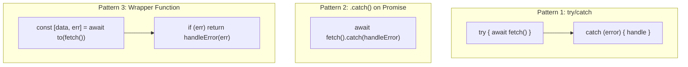

```javascript
// Pattern 3: Go-style error handling
async function to(promise) {
  try {
    const data = await promise;
    return [data, null];
  } catch (error) {
    return [null, error];
  }
}

// Sử dụng
const [user, error] = await to(fetchUser(id));
if (error) {
  console.error("Failed to fetch user:", error);
  return;
}
console.log("User:", user);
```

---

## 6. Promise APIs Nâng Cao

### 6.1 Tổng Quan Promise Static Methods

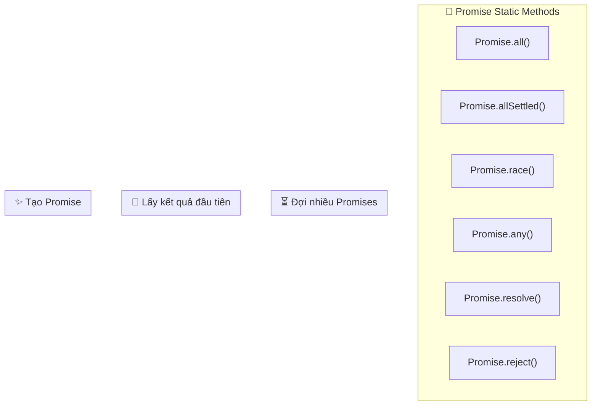

### 6.2 Promise.all()

Đợi **TẤT CẢ** promises hoàn thành. **Reject ngay** nếu bất kỳ promise nào reject.

```javascript
const results = await Promise.all([
  fetchUser(1), // ✅ Resolve
  fetchUser(2), // ✅ Resolve
  fetchUser(3), // ❌ Reject → Toàn bộ Promise.all reject!
]);
```

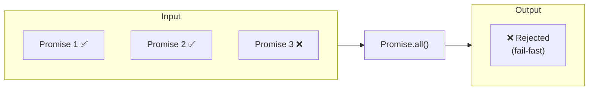

**Use case**: Khi cần TẤT CẢ data hoặc không cần gì cả.

### 6.3 Promise.allSettled()

Đợi **TẤT CẢ** promises hoàn thành, **không quan tâm** resolve hay reject.

```javascript
const results = await Promise.allSettled([
  fetchUser(1), // ✅ { status: 'fulfilled', value: user1 }
  fetchUser(2), // ❌ { status: 'rejected', reason: error }
  fetchUser(3), // ✅ { status: 'fulfilled', value: user3 }
]);

// Xử lý kết quả
results.forEach((result) => {
  if (result.status === "fulfilled") {
    console.log("Success:", result.value);
  } else {
    console.log("Failed:", result.reason);
  }
});
```

**Use case**: Khi muốn biết kết quả của từng promise riêng lẻ.

### 6.4 Promise.race()

Trả về promise **HOÀN THÀNH ĐẦU TIÊN** (resolve hoặc reject).

```javascript
// Timeout pattern
const result = await Promise.race([
  fetchData(), // Có thể mất 5s
  timeout(3000), // Reject sau 3s
]);

function timeout(ms) {
  return new Promise((_, reject) =>
    setTimeout(() => reject(new Error("Timeout!")), ms)
  );
}
```

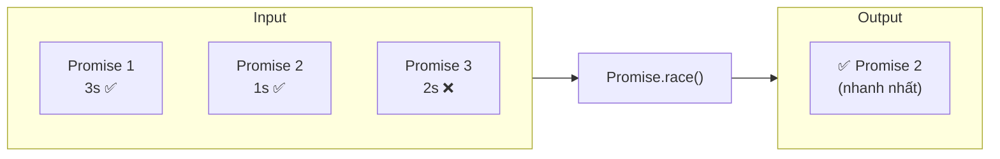

**Use case**: Timeout, load balancing giữa nhiều servers.

### 6.5 Promise.any()

Trả về promise **RESOLVE ĐẦU TIÊN**. Chỉ reject khi TẤT CẢ reject.

```javascript
// Tìm server phản hồi nhanh nhất
const fastestResponse = await Promise.any([
  fetch("https://server1.com/api"), // Slow
  fetch("https://server2.com/api"), // Fast ✅
  fetch("https://server3.com/api"), // Error
]);
```

**Use case**: Fallback servers, CDN racing.

### 6.6 Bảng So Sánh

| Method                 | Resolve khi      | Reject khi                   | ES Version |
| ---------------------- | ---------------- | ---------------------------- | ---------- |
| `Promise.all()`        | Tất cả resolve   | Bất kỳ reject                | ES6        |
| `Promise.allSettled()` | Tất cả settle    | Không bao giờ reject         | ES2020     |
| `Promise.race()`       | Đầu tiên settle  | Đầu tiên settle (nếu reject) | ES6        |
| `Promise.any()`        | Đầu tiên resolve | Tất cả reject                | ES2021     |

---

## 7. Closure và Garbage Collection

### 7.1 Closure là gì?

**Closure** là khả năng của một function "ghi nhớ" và truy cập các biến từ scope bên ngoài, ngay cả khi function đó được thực thi ở một context khác.

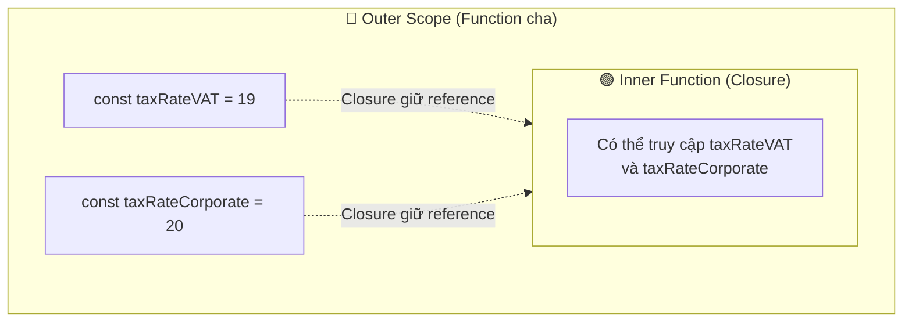

### 7.2 Ví Dụ Closure

```javascript
const taxRateVAT = 19;
const taxRateCorporate = 20;
const taxRateDividends = 25;

function calculateNetSales(salesAmount) {
  const netSales = salesAmount * (100 - taxRateVAT);
  return netSales;
}

function calculateNetProfit(salesAmount) {
  const netSales = calculateNetSales(salesAmount);
  const netProfit = netSales * (100 - taxRateCorporate);
  return netProfit;
}

// 🎯 Gán function vào DOM element
document.getElementById("#myButton").onclick = calculateNetProfit;
```

### 7.3 Closure và Memory

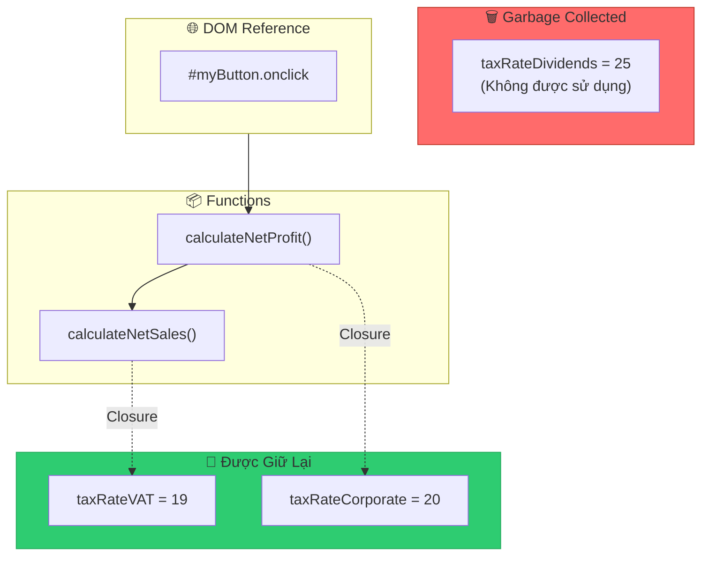

> [!IMPORTANT] > **Biến được giữ lại khi:**
>
> - Biến nằm trong scope chain của function đang được sử dụng
> - Function được tham chiếu bởi DOM hoặc code khác

### 7.4 Garbage Collection (Thu Gom Rác)

**Garbage Collection** là quá trình tự động của JavaScript Engine để giải phóng bộ nhớ không còn được sử dụng.

### 7.5 Thuật Toán Mark-and-Sweep

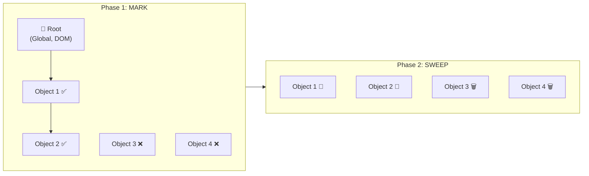

### 7.6 Cách Garbage Collection Hoạt Động

| Bước           | Mô Tả                                                                                 |
| -------------- | ------------------------------------------------------------------------------------- |
| 1️⃣ **Mark**    | GC bắt đầu từ "roots" (global object, DOM) và đánh dấu tất cả objects có thể truy cập |
| 2️⃣ **Sweep**   | Xóa tất cả objects KHÔNG được đánh dấu                                                |
| 3️⃣ **Compact** | (Tùy chọn) Sắp xếp lại bộ nhớ để giảm fragmentation                                   |

### 7.7 Tại sao Closure có thể gây Memory Leak?

```javascript
function createHandler() {
  const hugeData = new Array(1000000).fill("🔴"); // 1 triệu items

  return function handler() {
    // handler giữ reference đến hugeData qua closure
    // Ngay cả khi không sử dụng hugeData
  };
}

const handler = createHandler();
// ⚠️ hugeData vẫn tồn tại trong memory vì closure!
```

> [!CAUTION] > **Tránh Memory Leak:**
>
> - Không giữ reference đến large objects trong closure nếu không cần thiết
> - Set reference về `null` khi không cần nữa
> - Sử dụng WeakMap/WeakSet cho cache

---

## 8. Hoisting và Execution Context

### 8.1 Execution Context là gì?

**Execution Context** là môi trường mà JavaScript code được thực thi. Mỗi khi code chạy, nó chạy trong một execution context.

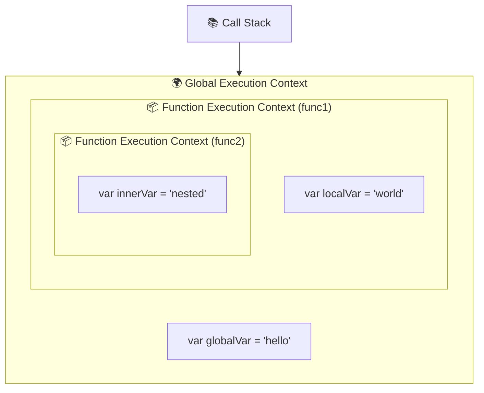

### 8.2 Hai Giai Đoạn của Execution Context

| Giai Đoạn              | Mô Tả                                             | Xảy ra khi            |
| ---------------------- | ------------------------------------------------- | --------------------- |
| **1. Creation Phase**  | Tạo Variable Object, Scope Chain, xác định `this` | Trước khi code chạy   |
| **2. Execution Phase** | Gán giá trị cho biến, thực thi code               | Khi code thực sự chạy |

### 8.3 Hoisting là gì?

**Hoisting** là hành vi của JavaScript di chuyển các **khai báo** (không phải gán giá trị) lên đầu scope trong giai đoạn Creation.

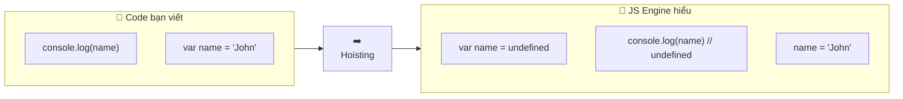

### 8.4 var vs let vs const Hoisting

```javascript
// 🔴 var - Hoisted với undefined
console.log(a); // undefined
var a = 10;

// 🔴 let/const - Hoisted nhưng trong TDZ
console.log(b); // ❌ ReferenceError: Cannot access 'b' before initialization
let b = 20;

// 🔴 const - Giống let
console.log(c); // ❌ ReferenceError
const c = 30;
```

### 8.5 Temporal Dead Zone (TDZ)

**TDZ** là khoảng thời gian từ đầu scope cho đến khi biến được khởi tạo.

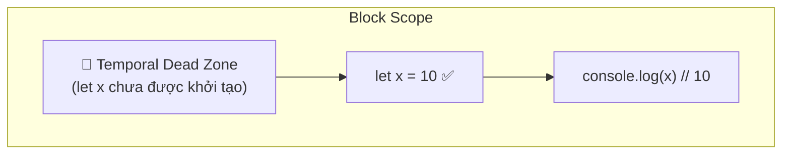

```javascript
{
  // TDZ bắt đầu cho 'x'
  console.log(x); // ❌ ReferenceError (trong TDZ)

  let x = 10; // TDZ kết thúc
  console.log(x); // ✅ 10
}
```

### 8.6 Function Hoisting

```javascript
// ✅ Function Declaration - Hoisted hoàn toàn
sayHello(); // "Hello!"
function sayHello() {
  console.log("Hello!");
}

// ❌ Function Expression - Chỉ hoisted như biến
sayBye(); // TypeError: sayBye is not a function
var sayBye = function () {
  console.log("Bye!");
};

// ❌ Arrow Function - Giống Function Expression
greet(); // TypeError
const greet = () => console.log("Hi!");
```

### 8.7 Bảng So Sánh Hoisting

| Khai báo             | Hoisted?        | Giá trị ban đầu  | TDZ?        |
| -------------------- | --------------- | ---------------- | ----------- |
| `var`                | ✅ Có           | `undefined`      | ❌ Không    |
| `let`                | ✅ Có           | Không khởi tạo   | ✅ Có       |
| `const`              | ✅ Có           | Không khởi tạo   | ✅ Có       |
| Function Declaration | ✅ Có           | Toàn bộ function | ❌ Không    |
| Function Expression  | ✅ Có (như var) | `undefined`      | Tùy var/let |
| Class                | ✅ Có           | Không khởi tạo   | ✅ Có       |

---

## 9. This Keyword

### 9.1 This là gì?

**`this`** là một keyword đặc biệt trong JavaScript, tham chiếu đến object mà function đang được gọi trong context của nó.

> [!IMPORTANT]
> Giá trị của `this` được xác định **tại thời điểm gọi function**, KHÔNG phải khi định nghĩa!

### 9.2 Các Quy Tắc Xác Định This

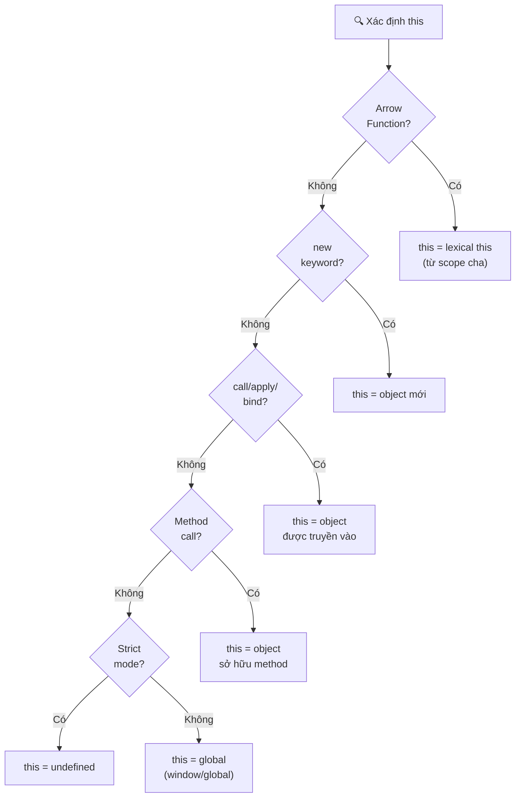

### 9.3 Ví Dụ Từng Trường Hợp

```javascript
// 1️⃣ Global Context
console.log(this); // window (browser) hoặc global (Node.js)

// 2️⃣ Method Call
const obj = {
  name: "John",
  greet() {
    console.log(this.name); // 'John' - this = obj
  },
};
obj.greet();

// 3️⃣ Regular Function
function showThis() {
  console.log(this);
}
showThis(); // window (non-strict) hoặc undefined (strict)

// 4️⃣ new Keyword
function Person(name) {
  this.name = name; // this = object mới được tạo
}
const john = new Person("John");

// 5️⃣ call/apply/bind
const person = { name: "Jane" };
function greet() {
  console.log(`Hello, ${this.name}`);
}
greet.call(person); // "Hello, Jane"
greet.apply(person); // "Hello, Jane"
const boundGreet = greet.bind(person);
boundGreet(); // "Hello, Jane"
```

### 9.4 Arrow Function và This

Arrow functions **KHÔNG** có `this` riêng - chúng "borrow" `this` từ lexical scope (scope bên ngoài).

```javascript
const obj = {
  name: "John",

  // ❌ Arrow function - this không phải obj
  arrowGreet: () => {
    console.log(this.name); // undefined (this = global)
  },

  // ✅ Regular function - this = obj
  regularGreet() {
    console.log(this.name); // 'John'
  },

  // ✅ Arrow trong method - this được giữ từ method
  delayedGreet() {
    setTimeout(() => {
      console.log(this.name); // 'John' ✅
    }, 1000);
  },

  // ❌ Regular trong setTimeout - this bị mất
  brokenGreet() {
    setTimeout(function () {
      console.log(this.name); // undefined ❌
    }, 1000);
  },
};
```

### 9.5 Các Phương Thức Thay Đổi This

| Method    | Cú pháp                        | Thực thi ngay? | Trả về           |
| --------- | ------------------------------ | -------------- | ---------------- |
| `call()`  | `fn.call(thisArg, arg1, arg2)` | ✅ Có          | Kết quả function |
| `apply()` | `fn.apply(thisArg, [args])`    | ✅ Có          | Kết quả function |
| `bind()`  | `fn.bind(thisArg, arg1)`       | ❌ Không       | Function mới     |

```javascript
function introduce(greeting, punctuation) {
  console.log(`${greeting}, I'm ${this.name}${punctuation}`);
}

const person = { name: "Alice" };

// call - truyền args riêng lẻ
introduce.call(person, "Hi", "!"); // "Hi, I'm Alice!"

// apply - truyền args dạng array
introduce.apply(person, ["Hello", "."]); // "Hello, I'm Alice."

// bind - tạo function mới
const boundIntro = introduce.bind(person, "Hey");
boundIntro("?"); // "Hey, I'm Alice?"
```

### 9.6 This trong Event Handlers

```javascript
const button = document.querySelector("#myButton");

// ❌ Arrow function - this KHÔNG phải button
button.addEventListener("click", () => {
  console.log(this); // window
});

// ✅ Regular function - this = button element
button.addEventListener("click", function () {
  console.log(this); // <button id="myButton">
});

// ✅ Nếu cần giữ this từ component (React class)
class Component {
  constructor() {
    this.handleClick = this.handleClick.bind(this);
  }

  handleClick() {
    console.log(this); // Component instance
  }
}
```

---

## 10. Câu Hỏi Phỏng Vấn Thường Gặp

### 10.1 Event Loop

<details>
<summary><strong>Q: Giải thích Event Loop trong JavaScript?</strong></summary>

**A:** Event Loop là cơ chế cho phép JavaScript (single-threaded) thực hiện các tác vụ bất đồng bộ. Nó liên tục kiểm tra:

1. Call Stack có trống không?
2. Nếu trống, lấy task từ Micro-task Queue trước
3. Sau đó mới lấy từ Macro-task Queue
4. Thực thi task trong Call Stack
5. Lặp lại

</details>

<details>
<summary><strong>Q: Sự khác biệt giữa Micro-task và Macro-task?</strong></summary>

**A:**

- **Micro-tasks**: Promise callbacks, queueMicrotask(), MutationObserver
- **Macro-tasks**: setTimeout, setInterval, I/O, UI rendering
- **Thứ tự ưu tiên**: Micro-tasks LUÔN được thực thi trước Macro-tasks

</details>

### 10.2 Promise & Async/Await

<details>
<summary><strong>Q: Promise có bao nhiêu trạng thái? Giải thích từng trạng thái?</strong></summary>

**A:** Promise có 3 trạng thái:

1. **Pending**: Trạng thái ban đầu, đang chờ kết quả
2. **Fulfilled**: Thành công, có giá trị trả về
3. **Rejected**: Thất bại, có lỗi

Một khi Promise chuyển từ Pending sang Fulfilled/Rejected, nó KHÔNG thể thay đổi trạng thái nữa (immutable).

</details>

<details>
<summary><strong>Q: Promise.all() vs Promise.allSettled() vs Promise.race() vs Promise.any()?</strong></summary>

**A:**

| Method                 | Resolve khi      | Reject khi      |
| ---------------------- | ---------------- | --------------- |
| `Promise.all()`        | Tất cả resolve   | Bất kỳ reject   |
| `Promise.allSettled()` | Tất cả settle    | Không bao giờ   |
| `Promise.race()`       | Đầu tiên settle  | Đầu tiên reject |
| `Promise.any()`        | Đầu tiên resolve | Tất cả reject   |

</details>

<details>
<summary><strong>Q: Tại sao await trong forEach không hoạt động?</strong></summary>

**A:** `forEach` không đợi async callback hoàn thành. Dùng `for...of` cho tuần tự, hoặc `Promise.all(arr.map(...))` cho song song.

```javascript
// ❌ Sai
arr.forEach(async (item) => await process(item));

// ✅ Đúng - tuần tự
for (const item of arr) await process(item);

// ✅ Đúng - song song
await Promise.all(arr.map((item) => process(item)));
```

</details>

### 10.3 Hoisting & Scope

<details>
<summary><strong>Q: Hoisting là gì? var, let, const khác nhau thế nào?</strong></summary>

**A:** Hoisting là việc JS di chuyển khai báo lên đầu scope.

- **var**: Hoisted với giá trị `undefined`
- **let/const**: Hoisted nhưng trong Temporal Dead Zone (TDZ) - truy cập trước khai báo gây ReferenceError
- **Function Declaration**: Hoisted hoàn toàn (cả tên và body)

</details>

<details>
<summary><strong>Q: Temporal Dead Zone (TDZ) là gì?</strong></summary>

**A:** TDZ là khoảng thời gian từ đầu scope cho đến khi biến `let`/`const` được khởi tạo. Truy cập biến trong TDZ gây `ReferenceError`.

</details>

### 10.4 This Keyword

<details>
<summary><strong>Q: Giá trị của `this` được xác định như thế nào?</strong></summary>

**A:** `this` được xác định **tại thời điểm gọi function** theo thứ tự ưu tiên:

1. **Arrow function**: Lấy `this` từ lexical scope (scope cha)
2. **new keyword**: `this` = object mới được tạo
3. **call/apply/bind**: `this` = object truyền vào
4. **Method call**: `this` = object sở hữu method
5. **Default**: global (window) hoặc undefined (strict mode)

</details>

<details>
<summary><strong>Q: Sự khác biệt giữa call, apply và bind?</strong></summary>

**A:**

- `call(thisArg, arg1, arg2)`: Gọi ngay với arguments riêng lẻ
- `apply(thisArg, [args])`: Gọi ngay với arguments dạng array
- `bind(thisArg)`: Trả về function mới với `this` cố định, KHÔNG gọi ngay

</details>

### 10.5 Closure & Memory

<details>
<summary><strong>Q: Closure là gì? Cho ví dụ thực tế?</strong></summary>

**A:** Closure là khả năng function "nhớ" scope bên ngoài. Ví dụ thực tế:

```javascript
function createCounter() {
  let count = 0; // Private variable
  return {
    increment: () => ++count,
    getCount: () => count,
  };
}

const counter = createCounter();
counter.increment(); // 1
counter.getCount(); // 1
// count không thể truy cập trực tiếp!
```

</details>

<details>
<summary><strong>Q: Làm sao để tránh Memory Leak trong JavaScript?</strong></summary>

**A:**

1. **Xóa event listeners** khi component unmount
2. **Clear timers** (clearTimeout, clearInterval)
3. **Tránh circular references** trong closures
4. **Sử dụng WeakMap/WeakSet** cho caching
5. **Set reference về null** khi không cần object lớn

</details>

### 10.6 Output Questions

<details>
<summary><strong>Q: Output của đoạn code sau là gì?</strong></summary>

```javascript
console.log("1");
setTimeout(() => console.log("2"), 0);
Promise.resolve().then(() => console.log("3"));
console.log("4");
```

**A:** `1 → 4 → 3 → 2`

- Sync: 1, 4 (in ngay)
- Micro-task: 3 (Promise)
- Macro-task: 2 (setTimeout)

</details>

<details>
<summary><strong>Q: Output của đoạn code sau là gì?</strong></summary>

```javascript
for (var i = 0; i < 3; i++) {
  setTimeout(() => console.log(i), 0);
}
```

**A:** `3, 3, 3` (vì `var` có function scope, không phải block scope)

**Fix:** Dùng `let` thay `var` → output: `0, 1, 2`

</details>

---

## 📊 Tổng Kết Kiến Thức

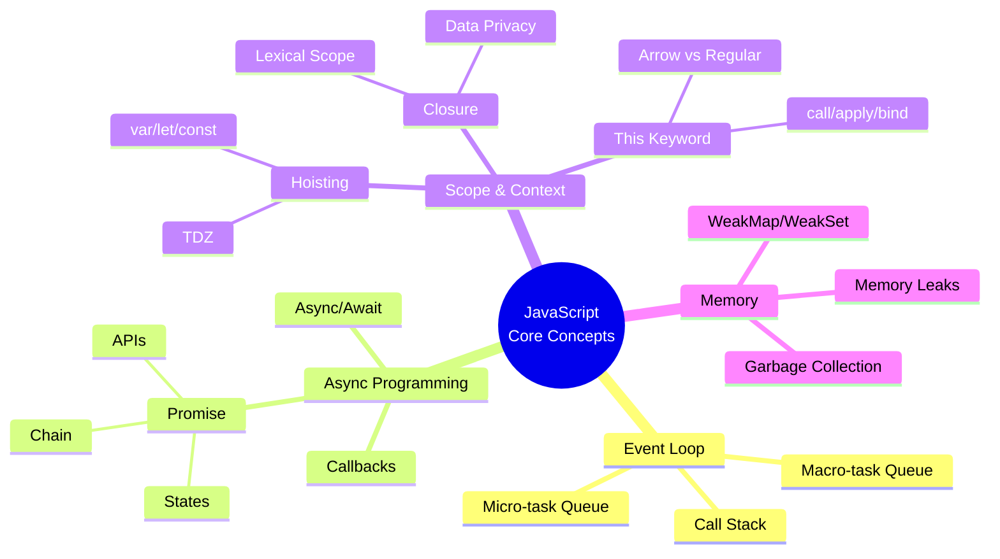

---

## 📚 Tài Liệu Tham Khảo

- [MDN Web Docs - Event Loop](https://developer.mozilla.org/en-US/docs/Web/JavaScript/EventLoop)
- [MDN Web Docs - Promise](https://developer.mozilla.org/en-US/docs/Web/JavaScript/Reference/Global_Objects/Promise)
- [MDN Web Docs - Closures](https://developer.mozilla.org/en-US/docs/Web/JavaScript/Closures)
- [MDN Web Docs - this](https://developer.mozilla.org/en-US/docs/Web/JavaScript/Reference/Operators/this)
- [JavaScript.info - Garbage Collection](https://javascript.info/garbage-collection)

---

> **Chúc bạn phỏng vấn thành công! 🎉**
>
> _Tài liệu được cập nhật: 22/12/2025_
