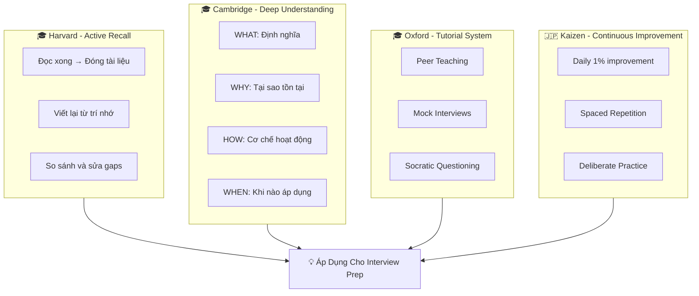
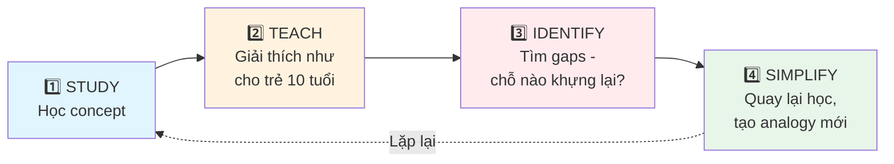
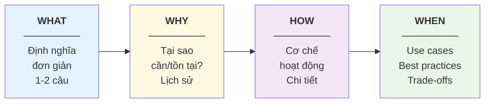
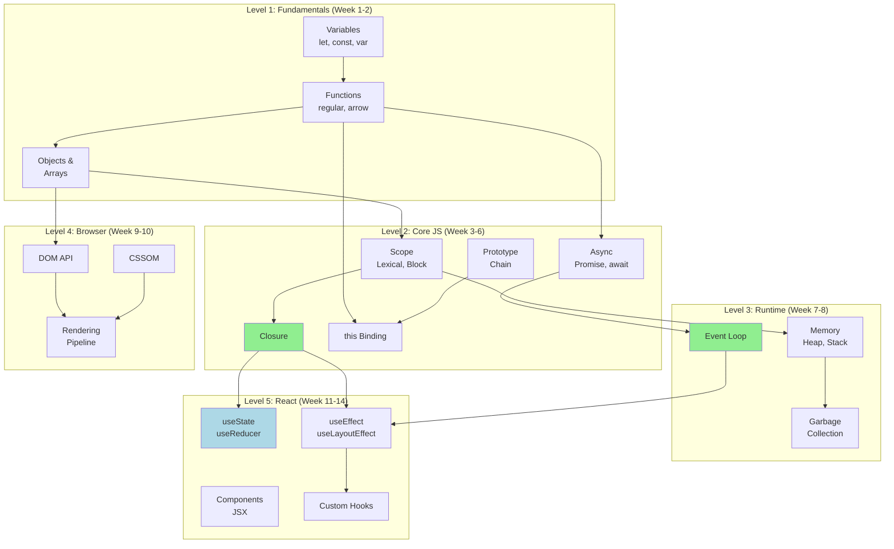
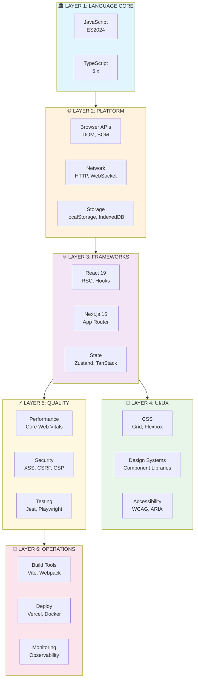
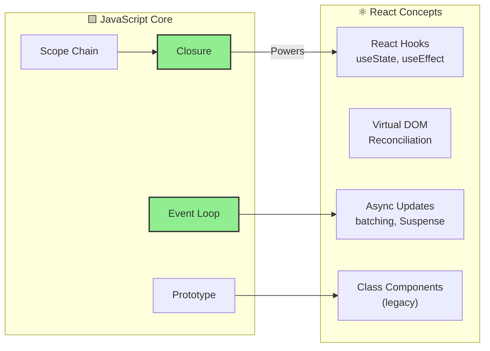
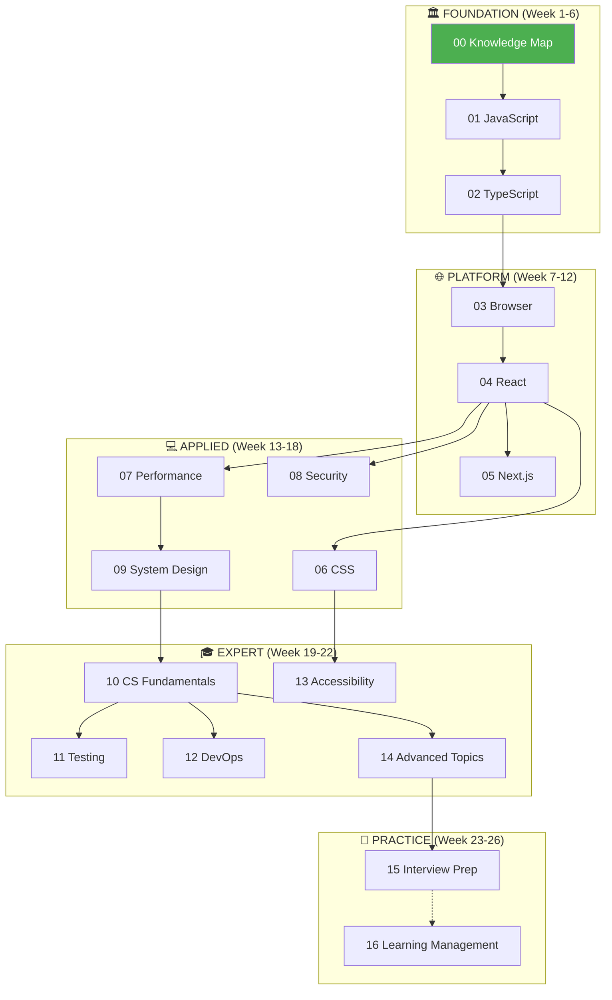
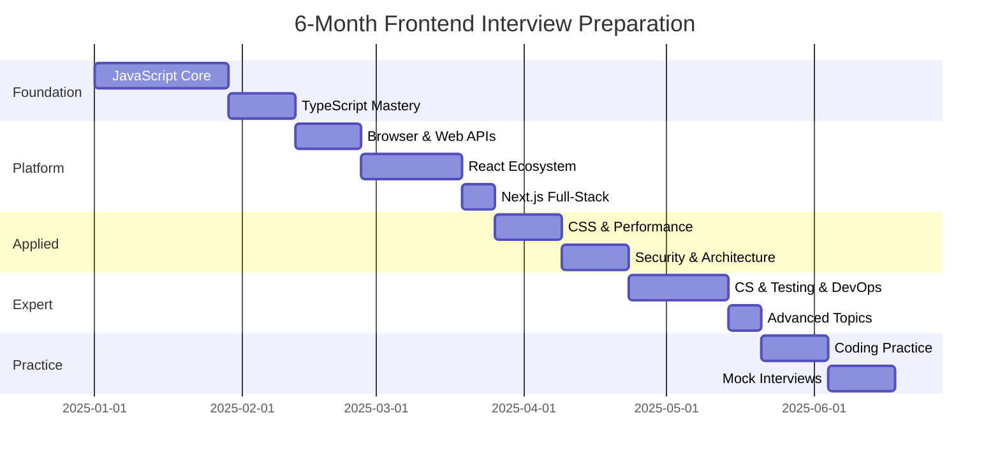
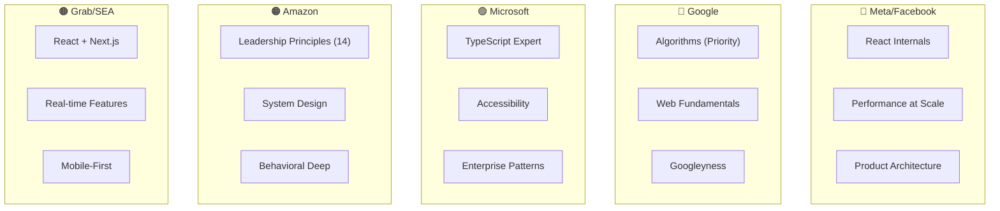

# 🗺️ MODULE 0: KNOWLEDGE MAP & LEARNING FRAMEWORK

> **Focus**: 100% Learning Strategy & Navigation
>
> _"Học đúng phương pháp = Nhớ lâu hơn, hiểu sâu hơn, phỏng vấn tự tin hơn"_
>
> **Core Philosophy**: Evidence-Based Learning + Deliberate Practice

---

## 📋 Trong Module Này

1. [Learning Science - Khoa Học Học Tập](#1-learning-science)
2. [WHAT-WHY-HOW-WHEN Framework](#2-what-why-how-when-framework)
3. [Prerequisite Graph - Học Gì Trước](#3-prerequisite-graph)
4. [Frontend Ecosystem Map](#4-frontend-ecosystem-map)
5. [17-Module Navigation](#5-module-navigation)
6. [6-Month Learning Roadmap](#6-learning-roadmap)
7. [Big Tech Interview Focus](#7-big-tech-focus)

---

## 1. Learning Science

### 🧠 Evidence-Based Learning (từ Harvard, Cambridge, Oxford, Japan)



### Ebbinghaus Forgetting Curve & Solution

```
📉 FORGETTING CURVE (Không ôn tập)

100% ─┐
      │
 70% ─┤─ ─ ─ ─ ─ ─ ─ ─ ─ ─ ─ ─ ─ ─ ─ ─ ─ ─ ─
      │ \
 50% ─┤   \
      │     \
 30% ─┤       \_____________________________
      │
  0% ─┼───────┬───────┬───────┬───────┬─────
      Day 1   Day 2   Day 7   Day 14  Day 30

📈 SPACED REPETITION (Ôn đúng timing)

100% ─┐  ╱\     ╱\       ╱\          ╱\
      │ /  \   /  \     /  \        /  \
 80% ─┤/    \ /    \   /    \      /    \
      │      ╳      \ /      \    /      \
 60% ─┤              ╳        \  /        ──
      │                        ╳
  0% ─┼───────┬───────┬───────┬───────┬─────
     Learn  Day1   Day3   Day7   Day14  Long-term
```

### Feynman Technique - 4 Steps



---

## 2. WHAT-WHY-HOW-WHEN Framework

Mỗi concept trong tài liệu này sẽ được trình bày theo 4 bước:



### Example: Closure

| Phase    | Content                                                                        |
| -------- | ------------------------------------------------------------------------------ |
| **WHAT** | Function kèm theo lexical environment nơi nó được tạo ra                       |
| **WHY**  | JavaScript cần cách để giữ data private + tạo stateful functions               |
| **HOW**  | Inner function giữ reference đến outer scope → Scope chain không bị GC         |
| **WHEN** | Private variables, Factory functions, Event handlers, React useState internals |

---

## 3. Prerequisite Graph

### 🔗 Concept Dependencies - Học Gì Trước Gì?



### 📋 Prerequisite Quick Reference

| Muốn học                     | Phải học trước      | Tại sao?                           |
| ---------------------------- | ------------------- | ---------------------------------- |
| **Closure**                  | Scope Chain         | Closure = Function + Lexical Scope |
| **React Hooks**              | Closure, this       | useState dùng closure để lưu state |
| **Virtual DOM**              | Real DOM, Reflow    | Hiểu vấn đề mới hiểu giải pháp     |
| **Event Loop**               | Async/Promises      | Event Loop điều phối async code    |
| **TypeScript Generics**      | JS Functions, Types | Generics = Functions cho types     |
| **Next.js SSR**              | React, HTTP         | SSR = React + Server response      |
| **Performance Optimization** | Browser Rendering   | Optimize = Reduce reflows/repaints |

---

## 4. Frontend Ecosystem Map

### The Big Picture - 6 Layers



### JavaScript Core → React Connection



> [!TIP] > **🔑 Key Insight**: Closures là nền tảng của React Hooks.
>
> - `useState` lưu state trong closure
> - `useEffect` cleanup function là closure
> - Custom hooks share logic qua closures

---

## 5. Module Navigation

### 📖 17-Module Structure (NEW)

| #   | Module                                                        | Layer      | Focus      |
| --- | ------------------------------------------------------------- | ---------- | ---------- |
| 00  | **[Knowledge Map](./00-knowledge-map.md)** (bạn đang ở đây)   | Foundation | Navigation |
| 01  | **[JavaScript Foundations](./01-javascript.md)**              | Foundation | 90% Theory |
| 02  | **[TypeScript Mastery](./02-typescript.md)**                  | Foundation | 90% Theory |
| 03  | **[Browser & Web Platform](./03-browser-platform.md)**        | Platform   | 90% Theory |
| 04  | **[React Ecosystem](./04-react-ecosystem.md)**                | Platform   | 85% Theory |
| 05  | **[Next.js Full-Stack](./05-nextjs-fullstack.md)**            | Platform   | 80% Theory |
| 06  | **[CSS & Visual Design](./06-css-visual-design.md)**          | Applied    | 75% Theory |
| 07  | **[Performance Engineering](./07-performance.md)**            | Applied    | 85% Theory |
| 08  | **[Security Best Practices](./08-security.md)**               | Applied    | 85% Theory |
| 09  | **[System Design & Architecture](./09-system-design.md)**     | Applied    | 90% Theory |
| 10  | **[Computer Science Fundamentals](./10-cs-fundamentals.md)**  | Expert     | 90% Theory |
| 11  | **[Testing & Quality Assurance](./11-testing-qa.md)**         | Expert     | 80% Theory |
| 12  | **[DevOps & Development Tools](./12-devops-tools.md)**        | Expert     | 75% Theory |
| 13  | **[Accessibility (a11y)](./13-accessibility.md)**             | Expert     | 85% Theory |
| 14  | **[Advanced & Expert Topics](./14-advanced-expert.md)**       | Expert     | 95% Theory |
| 15  | **[Interview Preparation](./15-interview-prep.md)**           | Practice   | 50% Theory |
| 16  | **[Learning Management System](./16-learning-management.md)** | Practice   | 90% Method |

### Learning Layer Map



---

## 6. Learning Roadmap

### 📅 6-Month Study Plan Overview



### ⏱️ Weekly Time Investment

| Phase          | Weeks | Modules | Theory Hours/Week | Practice Hours/Week |
| -------------- | ----- | ------- | ----------------- | ------------------- |
| **Foundation** | 1-6   | 01-02   | 8-10h             | 2-3h                |
| **Platform**   | 7-12  | 03-05   | 8-10h             | 3-4h                |
| **Applied**    | 13-18 | 06-09   | 6-8h              | 4-5h                |
| **Expert**     | 19-22 | 10-14   | 5-6h              | 3-4h                |
| **Practice**   | 23-26 | 15-16   | 3-4h              | 8-10h               |

---

## 7. Big Tech Focus

### 🏢 Company-Specific Preparation



### Priority Matrix by Company

| Company       | #1 Priority     | #2 Priority      | #3 Priority   | Special Focus    |
| ------------- | --------------- | ---------------- | ------------- | ---------------- |
| **Meta**      | React Internals | Performance      | System Design | Product Sense    |
| **Google**    | Algorithms      | Web Fundamentals | System Design | Googleyness      |
| **Microsoft** | TypeScript      | Design Patterns  | Behavioral    | Accessibility    |
| **Amazon**    | System Design   | LP Stories       | Coding        | Bar Raiser Ready |
| **Grab**      | React/Next.js   | Real-time        | Mobile UX     | SEA Context      |

---

## 🔑 Key Takeaways

> [!TIP] > **5 Rules for Effective Learning:**
>
> 1. **Prerequisite First** - Học đúng thứ tự (Closure trước Hooks)
> 2. **WHAT-WHY-HOW-WHEN** - Mỗi concept đều có 4 góc nhìn
> 3. **Spaced Repetition** - Ôn Day 1, 3, 7, 14, 30
> 4. **Active Recall** - Test yourself, không passive reading
> 5. **Feynman Technique** - Dạy lại = Hiểu sâu nhất

---

## 📚 Source Documents Reference

Tài liệu này consolidate từ:

```
📁 Original Sources (150+ files)
├── 01-javascript-fundamentals/  (25 files)
├── 02-typescript/               (7 files)
├── 03-react/                    (10 files)
├── 04-nextjs/                   (4 files)
├── 05-security/                 (3 files)
├── 06-html/                     (1 file)
├── 06-web-apis/                 (10 files)
├── 07-css/                      (8 files)
├── 08-performance/              (5 files)
├── 09-system-design/            (8 files)
├── 10-computer-science/         (16 files)
├── 11-interview-practice/       (8 files)
├── 12-visual-learning/          (3 files)
├── 13-tools-ecosystem/          (8 files)
├── 14-accessibility/            (2 files)
├── 15-advanced-topics/          (9 files)
├── 16-theoretical-foundations/  (9 files)
├── 17-frontend-theory/          (17 files)
├── 18-advanced-theory/          (6 files)
└── 19-expert-topics/            (4 files)
```

---

> _Tiếp theo: [Module 01: JavaScript Foundations](./01-javascript.md)_
