# 🧠 MODULE 1: JAVASCRIPT CORE THEORY

> **Focus**: 90% Theory - 10% Examples
>
> _Hiểu BẢN CHẤT - không chỉ cú pháp_
>
> **Phương pháp**: WHAT → WHY → HOW → WHEN

---

## 📋 Trong Module Này

1. [Lịch Sử JavaScript](#1-lịch-sử-javascript)
2. [Event Loop - Bản Chất](#2-event-loop---bản-chất)
3. [Closure - Mental Model](#3-closure---mental-model)
4. [Prototype Chain - Triết Lý](#4-prototype-chain---triết-lý)
5. [Memory & Garbage Collection](#5-memory--garbage-collection)
6. [this Binding - Quy Tắc](#6-this-binding---quy-tắc)
7. [Scope & Hoisting - Cơ Chế](#7-scope--hoisting---cơ-chế)
8. [Execution Context - Deep Dive](#8-execution-context---deep-dive)
9. [Type Coercion - Cơ Chế Chuyển Đổi](#9-type-coercion---cơ-chế-chuyển-đổi)
10. [ES6+ Paradigm Shifts](#10-es6-paradigm-shifts)

---

## 1. Lịch Sử JavaScript

### ❓ WHAT - JavaScript là gì?

JavaScript là **ngôn ngữ lập trình** được thiết kế cho web, ban đầu để thêm interactivity vào web pages.

```
JavaScript ≠ Java (Hoàn toàn khác nhau! Tên giống chỉ vì marketing trong 1995)
```

### 📜 Timeline Phát Triển

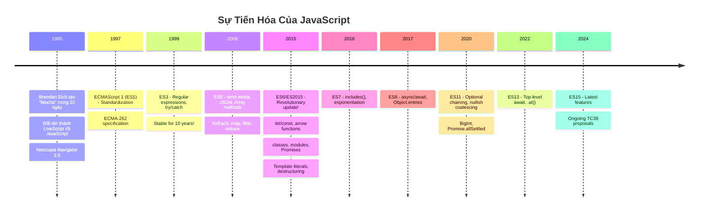

### 💡 WHY - Tại sao học lịch sử quan trọng?

| Milestone              | Vấn đề nó giải quyết     | Ảnh hưởng đến ngày nay       |
| ---------------------- | ------------------------ | ---------------------------- |
| **ES6 let/const**      | var hoisting gây bugs    | Best practice: const default |
| **ES6 Promises**       | Callback hell            | Foundation cho async/await   |
| **ES6 Classes**        | Prototype syntax khó đọc | React class components       |
| **ES2017 async/await** | Promise chains dài       | Standard async pattern       |

> [!NOTE] > **TC39 Process**: Proposals đi qua 4 stages (0→4) trước khi thành standard.
> Stage 3 = Safe to use trong production.

### 🔗 Cross-References

- → [Module 3: React History](./03-react-philosophy.md) - React born from ES5 era
- → [Module 5: TypeScript](./05-typescript-theory.md) - TS adds types to JS

---

## 2. Event Loop - Bản Chất

### ❓ WHAT - Event Loop là gì?

Event Loop là **cơ chế điều phối** giúp JavaScript (ngôn ngữ single-threaded) có thể xử lý các tác vụ bất đồng bộ mà không block main thread.

```
JavaScript = Single-threaded + Event Loop = Concurrent (not parallel)
```

### 💡 WHY - Tại sao cần Event Loop?

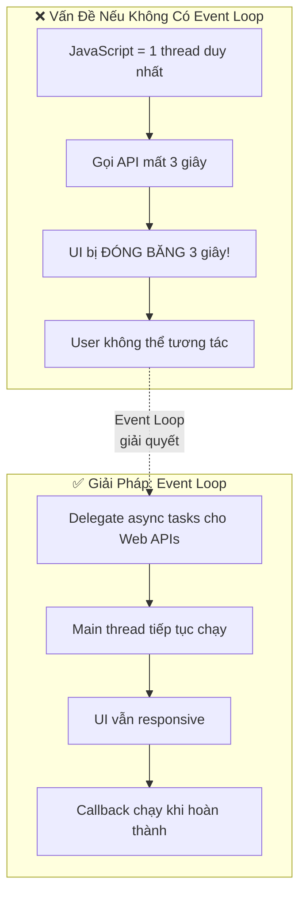

### 🔍 HOW - Hoạt động như thế nào?

#### Kiến Trúc Event Loop

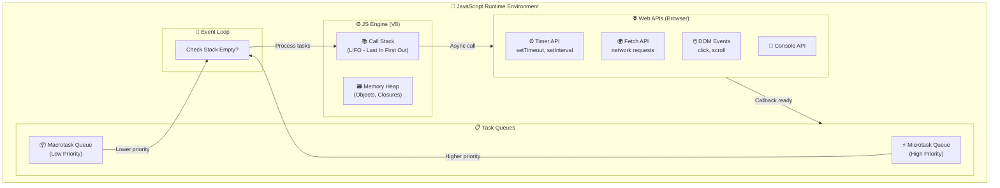

#### Microtask vs Macrotask

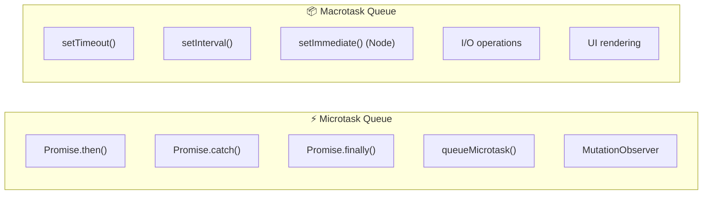

#### Thứ Tự Thực Thi - Chi Tiết

```
┌─────────────────────────────────────────────────────────┐
│  EVENT LOOP ALGORITHM                                    │
├─────────────────────────────────────────────────────────┤
│  1. Execute ALL synchronous code in Call Stack          │
│     └── Until stack is EMPTY                            │
│                                                          │
│  2. Execute ALL microtasks                               │
│     └── Promise.then(), queueMicrotask()                │
│     └── If microtask creates new microtask → also run   │
│                                                          │
│  3. Render (if needed by browser, ~60fps = 16.67ms)     │
│     └── requestAnimationFrame callbacks                 │
│     └── Layout, Paint, Composite                        │
│                                                          │
│  4. Execute ONE macrotask                                │
│     └── setTimeout, setInterval callback                │
│                                                          │
│  5. Go back to step 2                                    │
└─────────────────────────────────────────────────────────┘
```

### ⏰ WHEN - Khi nào áp dụng kiến thức này?

| Situation              | Áp dụng                                |
| ---------------------- | -------------------------------------- |
| **Debug async code**   | Hiểu tại sao code chạy theo thứ tự nào |
| **setTimeout(fn, 0)**  | Biết nó chạy SAU tất cả microtasks     |
| **Promise chains**     | Biết callbacks vào microtask queue     |
| **Performance issues** | Tránh blocking main thread             |
| **React batching**     | Hiểu tại sao setState không immediate  |

### 🧪 Ví Dụ Phân Tích

```javascript
console.log("1"); // Sync

setTimeout(() => console.log("2"), 0); // Macrotask

Promise.resolve().then(() => console.log("3")); // Microtask

queueMicrotask(() => console.log("4")); // Microtask

console.log("5"); // Sync

// Output: 1, 5, 3, 4, 2
// WHY?
// - Sync runs first: 1, 5
// - ALL Microtasks next: 3, 4
// - ONE Macrotask last: 2
```

> [!TIP] > **Mental Model**: Traffic Controller
>
> - Call Stack = Current car being processed
> - Microtasks = VIP lane (ambulance) - always first
> - Macrotasks = Normal lane - one at a time

### 🔗 Cross-References

- → [Module 2: Browser Runtime](./02-browser-theory.md) - Rendering cycle
- → [Module 3: React Philosophy](./03-react-philosophy.md) - React batches updates in microtasks

---

## 3. Closure - Mental Model

### ❓ WHAT - Closure là gì?

**Closure = Function + Lexical Environment (biến từ scope bên ngoài)**

Khi một function được tạo, nó **"nhớ"** các biến từ scope nơi nó được định nghĩa, kể cả khi function đó được gọi ở nơi khác.

```
Closure = Function that "remembers" its birthplace
```

### 💡 WHY - Tại sao cần Closure?

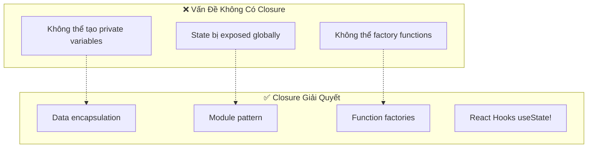

### 🔍 HOW - Closure hình thành như thế nào?

#### Mental Model: Cái Ba Lô (Backpack)

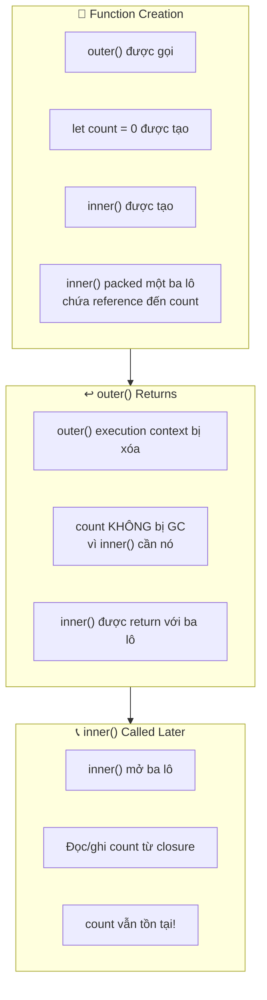

```
┌──────────────────────────────────────────────────┐
│  🎒 CLOSURE MENTAL MODEL: The Backpack           │
├──────────────────────────────────────────────────┤
│                                                   │
│  function outer() {                              │
│    let count = 0;  ← Được put vào ba lô         │
│                                                   │
│    return function inner() {                     │
│      return ++count;                             │
│    }                                             │
│  }  ← inner mang ba lô đi khi outer kết thúc    │
│                                                   │
│  const counter = outer();                        │
│  counter(); // 1 ← Mở ba lô, lấy count          │
│  counter(); // 2 ← count vẫn ở trong ba lô      │
│                                                   │
└──────────────────────────────────────────────────┘
```

#### Memory Representation

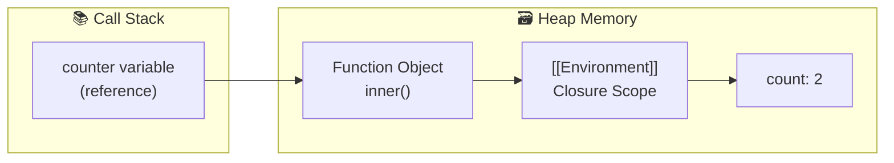

### ⏰ WHEN - Khi nào dùng Closure?

| Use Case                 | Example                                    |
| ------------------------ | ------------------------------------------ |
| **Private variables**    | Module pattern, encapsulation              |
| **Function factories**   | `createMultiplier(2)` returns `x => x * 2` |
| **Callbacks with state** | Event handlers remember context            |
| **Memoization**          | Cache computed values                      |
| **React Hooks**          | useState, useEffect, useCallback           |

### ⚠️ Gotchas - Stale Closure

```javascript
// ❌ Common Bug: Stale Closure
function createButtons() {
  for (var i = 0; i < 3; i++) {
    setTimeout(() => console.log(i), 100);
  }
}
createButtons(); // 3, 3, 3 (NOT 0, 1, 2!)

// WHY? var is function-scoped, closure captures REFERENCE, not VALUE
// When callbacks run, loop finished, i = 3

// ✅ Fix 1: Use let (block-scoped)
for (let i = 0; i < 3; i++) {
  setTimeout(() => console.log(i), 100);
} // 0, 1, 2

// ✅ Fix 2: IIFE to create new scope
for (var i = 0; i < 3; i++) {
  ((j) => setTimeout(() => console.log(j), 100))(i);
} // 0, 1, 2
```

> [!WARNING] > **React Stale Closure**: useEffect với dependency array rỗng sẽ capture state ban đầu. Đây là bug phổ biến trong React.

### 🔗 Cross-References

- → [Section 7: Scope](#7-scope--hoisting---cơ-chế) - Closure dựa trên lexical scope
- → [Module 3: React Hooks](./03-react-philosophy.md) - Hooks = Closures

---

## 4. Prototype Chain - Triết Lý

### ❓ WHAT - Prototype là gì?

JavaScript sử dụng **prototypal inheritance** - objects kế thừa trực tiếp từ objects khác, không cần class.

```
Mọi object đều có [[Prototype]] - một link đến object khác
```

### 💡 WHY - Tại sao JavaScript chọn Prototype?

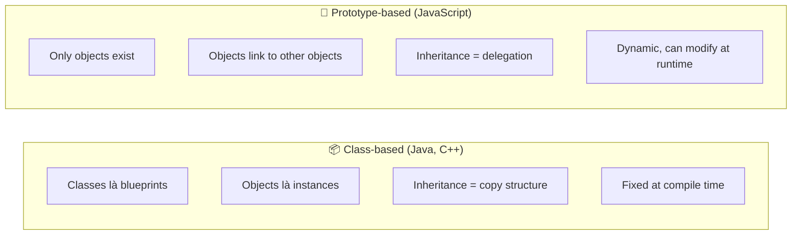

| Aspect          | Class-based (Java)           | Prototype-based (JS)        |
| --------------- | ---------------------------- | --------------------------- |
| **Inheritance** | Copy structure               | Link to object              |
| **Memory**      | Each instance copies methods | Share methods via prototype |
| **Flexibility** | Fixed at compile time        | Dynamic, modifiable         |
| **Philosophy**  | "IS-A" relationship          | "BEHAVES-LIKE" relationship |

### 🔍 HOW - Prototype chain hoạt động?

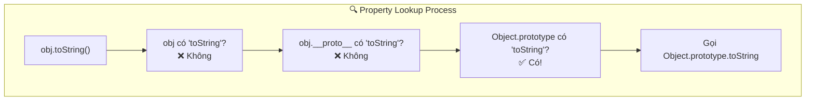

```
myObj
  │
  └──► myObj.__proto__ (= Constructor.prototype)
         │
         └──► Object.prototype
                │
                └──► null (end of chain)
```

### ⏰ WHEN - Khi nào quan trọng?

| Situation               | Tại sao cần hiểu Prototype           |
| ----------------------- | ------------------------------------ |
| **instanceof check**    | Kiểm tra prototype chain             |
| **Extending built-ins** | Thêm methods cho Array, String       |
| **Performance**         | Methods on prototype = shared memory |
| **ES6 classes**         | Vẫn là prototype under the hood      |

> [!NOTE] > **ES6 Class = Syntactic Sugar** > `class Dog extends Animal` vẫn sử dụng prototype chain. Class chỉ là syntax dễ đọc hơn.

### 🔗 Cross-References

- → [Module 5: TypeScript](./05-typescript-theory.md) - Structural typing tương tự prototype

---

## 5. Memory & Garbage Collection

### ❓ WHAT - JavaScript quản lý memory như thế nào?

JavaScript tự động quản lý memory với **Garbage Collection** - developer không cần malloc/free như C.

### 💡 WHY - Tại sao cần hiểu Memory Management?

| Không hiểu        | Hậu quả                 |
| ----------------- | ----------------------- |
| Memory leaks      | App chậm dần, crash     |
| Closure retention | Unexpected memory usage |
| Large objects     | Performance issues      |

### 🔍 HOW - Memory được tổ chức?

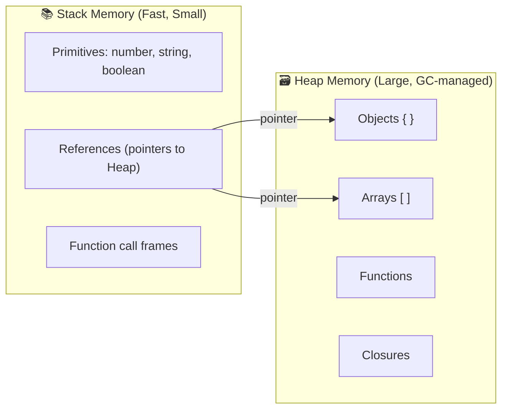

#### Mark-and-Sweep Algorithm

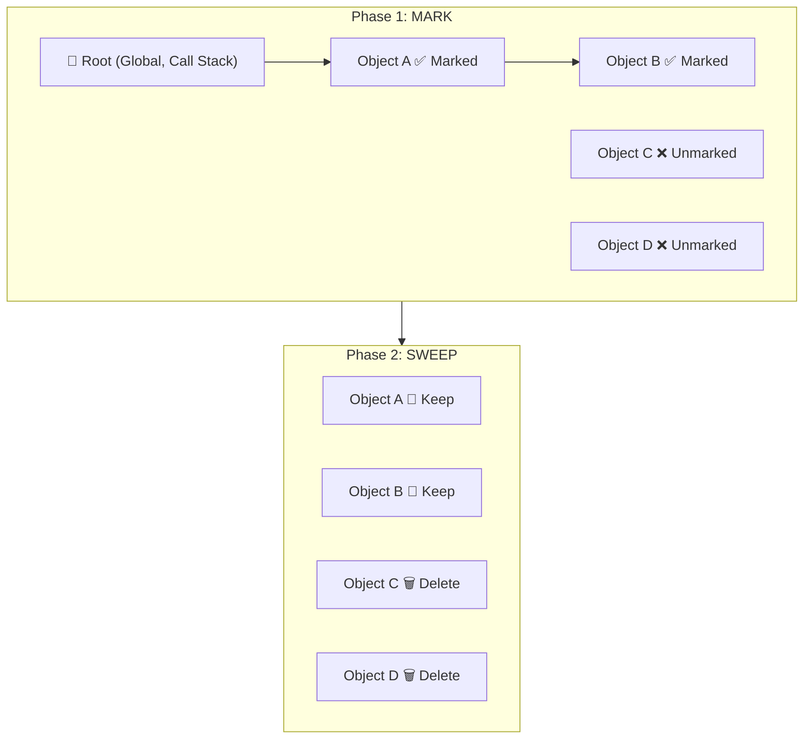

### ⏰ WHEN - Memory Leaks xảy ra khi nào?

| Nguyên nhân                    | Tại sao GC không dọn được            |
| ------------------------------ | ------------------------------------ |
| **Global variables**           | Always reachable from root           |
| **Forgotten timers**           | setInterval keeps reference          |
| **Closures giữ large objects** | Closure "remembers" entire scope     |
| **Detached DOM nodes**         | JS reference to removed DOM          |
| **Event listeners**            | Not removed with removeEventListener |

> [!WARNING] > **Common Memory Leak Pattern:**
>
> ```javascript
> function outer() {
>   const hugeData = new Array(1000000);
>   return function inner() {
>     console.log("I don't use hugeData");
>   };
>   // hugeData VẪN bị giữ vì closure!
> }
> ```

---

## 6. this Binding - Quy Tắc

### ❓ WHAT - `this` là gì?

`this` là **runtime binding** - giá trị phụ thuộc vào **CÁCH function được gọi**, không phải nơi được định nghĩa.

### 🔍 HOW - Quy tắc xác định `this`

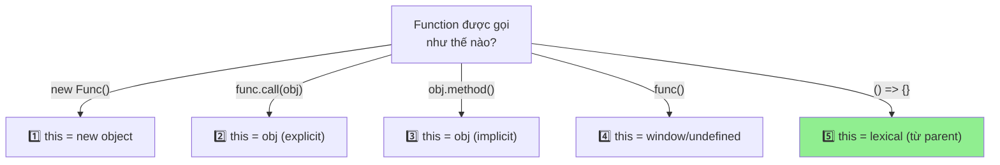

**Precedence (Thứ tự ưu tiên):**

```
1. new binding          → this = new object      (Highest)
2. Explicit (call/bind) → this = specified obj
3. Implicit (obj.func)  → this = object
4. Default              → this = global/undefined
5. Arrow function       → this = lexical         (Ignores all above)
```

### 💡 WHY - Tại sao Arrow function khác?

Arrow function được thiết kế để giải quyết "lost this" problem:

```javascript
// ❌ Problem với regular function
class Timer {
  constructor() {
    this.seconds = 0;
    setInterval(function () {
      this.seconds++; // this = window, NOT Timer!
    }, 1000);
  }
}

// ✅ Solution với arrow function
class Timer {
  constructor() {
    this.seconds = 0;
    setInterval(() => {
      this.seconds++; // this = Timer instance ✅
    }, 1000);
  }
}
```

---

## 7. Scope & Hoisting - Cơ Chế

### ❓ WHAT - Scope là gì?

**Scope = Vùng mà biến có thể được truy cập**

| Type         | Created by           | Visibility      |
| ------------ | -------------------- | --------------- |
| **Global**   | Default              | Everywhere      |
| **Function** | `function`           | Inside function |
| **Block**    | `{ }` with let/const | Inside block    |

### 🔍 HOW - Hoisting hoạt động?

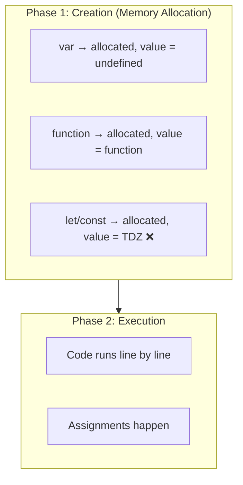

### 💡 WHY - Temporal Dead Zone (TDZ)?

TDZ là **feature, không phải bug**:

- Bắt lỗi sử dụng biến trước khai báo
- Đảm bảo const actually constant
- Ngăn patterns confusing từ var hoisting

---

## 8. Execution Context - Deep Dive

### ❓ WHAT - Execution Context là gì?

**Execution Context** = Môi trường mà code JavaScript được thực thi.

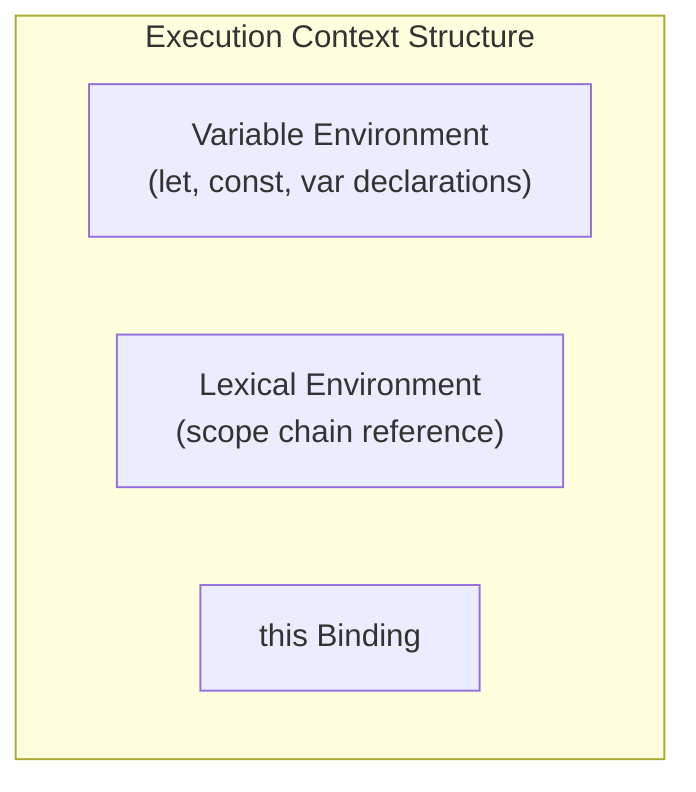

### 🔍 HOW - Types of Execution Context

| Type            | Khi nào tạo        | Chứa gì                          |
| --------------- | ------------------ | -------------------------------- |
| **Global EC**   | Script bắt đầu     | Global variables, this = window  |
| **Function EC** | Function được call | Local variables, arguments, this |
| **Eval EC**     | eval() called      | Variables trong eval string      |

---

## 9. Type Coercion - Cơ Chế Chuyển Đổi

### ❓ WHAT - Type Coercion là gì?

JavaScript tự động chuyển đổi types khi cần. Có 2 loại:

- **Implicit**: `'5' + 3` = `'53'`
- **Explicit**: `Number('5')` = `5`

### 🔍 HOW - Abstract Operations

| Operation       | Làm gì             | Ví dụ                           |
| --------------- | ------------------ | ------------------------------- |
| **ToPrimitive** | Object → Primitive | `{}.valueOf()` or `.toString()` |
| **ToNumber**    | → Number           | `Number('42')` = 42             |
| **ToString**    | → String           | `String(42)` = '42'             |
| **ToBoolean**   | → Boolean          | `Boolean(0)` = false            |

### Falsy Values (6 values)

```javascript
false, 0, "", null, undefined, NaN;
// Everything else is truthy!
```

### == vs === Deep Dive

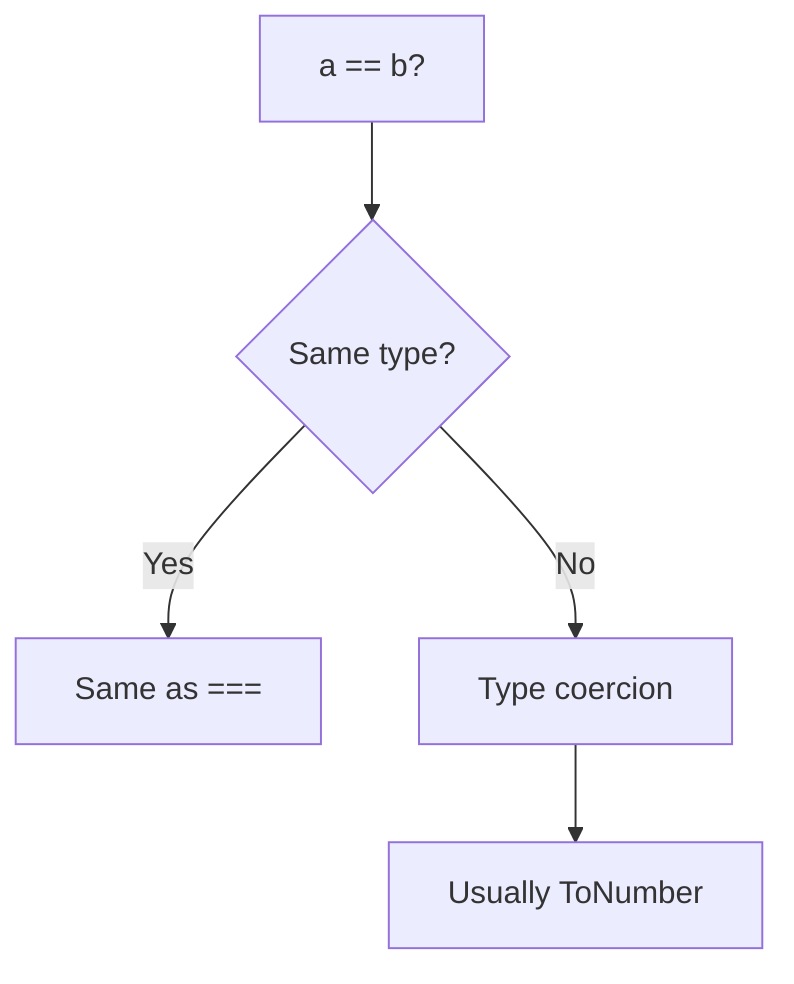

> [!TIP] > **Rule**: Luôn dùng `===` trừ khi có lý do cụ thể dùng `==`

---

## 10. ES6+ Paradigm Shifts

### Những thay đổi tư duy quan trọng

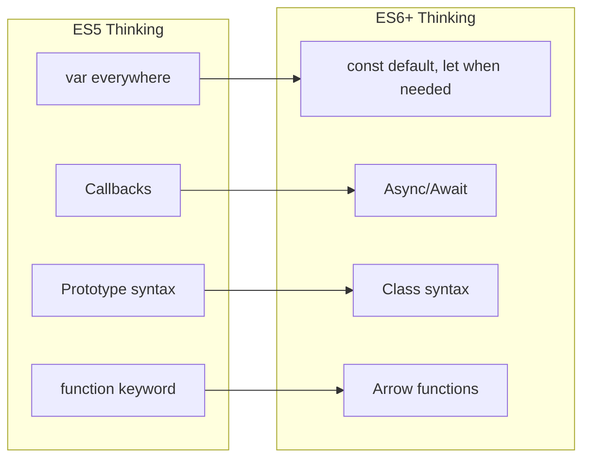

| ES5          | ES6+           | Why the Change                     |
| ------------ | -------------- | ---------------------------------- |
| `var`        | `const`/`let`  | Block scope, no hoisting confusion |
| Callbacks    | Promises/Async | Readable async code                |
| `.prototype` | `class`        | Familiar OOP syntax                |
| `function()` | `() =>`        | Lexical `this`, shorter            |

---

## 📚 Summary - Mental Models

| Concept        | Mental Model                                                |
| -------------- | ----------------------------------------------------------- |
| **Event Loop** | Traffic controller: Stack → ALL Micros → 1 Macro → Repeat   |
| **Closure**    | Function carries a backpack of outer variables              |
| **Prototype**  | Chain of fallback objects for property lookup               |
| **Memory**     | Primitives in Stack, Objects in Heap, GC cleans unreachable |
| **this**       | Not WHERE defined, but HOW called                           |
| **Scope**      | Nested boxes - inner sees outer, not reverse                |

---

## 📖 Deep-Dive Resources

Module này là **hub** - dưới đây là full deep-dive documents trong knowledge base:

### Core JavaScript Theory

| Topic                 | This Module                                       | 📚 Deep-Dive Documents                                                                                   | Expert Level                                                                                       |
| --------------------- | ------------------------------------------------- | -------------------------------------------------------------------------------------------------------- | -------------------------------------------------------------------------------------------------- |
| **Event Loop**        | [Section 2](#2-event-loop---bản-chất)             | [06-event-loop-async.md](../01-javascript-fundamentals/06-event-loop-async.md)                           | [10-async-programming-theory.md](../17-frontend-theory/10-async-programming-theory.md)             |
| **Closure**           | [Section 3](#3-closure---mental-model)            | [03-closures-comprehensive.md](../01-javascript-fundamentals/03-closures-comprehensive.md)               | [01-javascript-language-theory.md](../17-frontend-theory/01-javascript-language-theory.md)         |
| **Scope & Hoisting**  | [Section 7](#7-scope--hoisting---cơ-chế)          | [02-scope-hoisting-comprehensive.md](../01-javascript-fundamentals/02-scope-hoisting-comprehensive.md)   | [16-execution-context-theory.md](../01-javascript-fundamentals/16-execution-context-theory.md)     |
| **Prototype**         | [Section 4](#4-prototype-chain---triết-lý)        | [10-prototypes-inheritance-deep.md](../01-javascript-fundamentals/10-prototypes-inheritance-deep.md)     | -                                                                                                  |
| **this Binding**      | [Section 6](#6-this-binding---quy-tắc)            | [05-this-keyword.md](../01-javascript-fundamentals/05-this-keyword.md)                                   | -                                                                                                  |
| **Memory & GC**       | [Section 5](#5-memory--garbage-collection)        | [15-memory-management-advanced.md](../01-javascript-fundamentals/15-memory-management-advanced.md)       | [15-memory-management-deep-dive.md](../17-frontend-theory/15-memory-management-deep-dive.md)       |
| **Execution Context** | [Section 8](#8-execution-context---deep-dive)     | [16-execution-context-theory.md](../01-javascript-fundamentals/16-execution-context-theory.md)           | -                                                                                                  |
| **Type Coercion**     | [Section 9](#9-type-coercion---cơ-chế-chuyển-đổi) | [14-javascript-type-system-theory.md](../01-javascript-fundamentals/14-javascript-type-system-theory.md) | -                                                                                                  |
| **ES6+ Features**     | [Section 10](#10-es6-paradigm-shifts)             | [11-es6-features-deep.md](../01-javascript-fundamentals/11-es6-features-deep.md)                         | [22-modern-javascript-features.md](../01-javascript-fundamentals/22-modern-javascript-features.md) |

### Advanced & Expert Topics

| Topic                      | Documents                                                                                                                                                                                        |
| -------------------------- | ------------------------------------------------------------------------------------------------------------------------------------------------------------------------------------------------ |
| **Async Comprehensive**    | [09-async-comprehensive.md](../01-javascript-fundamentals/09-async-comprehensive.md), [19-concurrency-models-theory.md](../01-javascript-fundamentals/19-concurrency-models-theory.md)           |
| **Functional Programming** | [12-functional-programming.md](../01-javascript-fundamentals/12-functional-programming.md), [14-functional-reactive-programming.md](../17-frontend-theory/14-functional-reactive-programming.md) |
| **Engine Internals**       | [21-engine-internals-theory.md](../01-javascript-fundamentals/21-engine-internals-theory.md), [05-javascript-engine-internals.md](../17-frontend-theory/05-javascript-engine-internals.md)       |
| **Module Systems**         | [20-module-systems-theory.md](../01-javascript-fundamentals/20-module-systems-theory.md), [06-module-systems-theory.md](../15-advanced-topics/06-module-systems-theory.md)                       |
| **Metaprogramming**        | [18-metaprogramming-theory.md](../01-javascript-fundamentals/18-metaprogramming-theory.md), [17-advanced-patterns-theory.md](../01-javascript-fundamentals/17-advanced-patterns-theory.md)       |
| **Web Workers**            | [16-web-workers-concurrency.md](../17-frontend-theory/16-web-workers-concurrency.md), [05-concurrency-patterns.md](../18-advanced-theory/05-concurrency-patterns.md)                             |

### Practice & Interview

| Type                  | Documents                                                                                                                                                    |
| --------------------- | ------------------------------------------------------------------------------------------------------------------------------------------------------------ |
| **Coding Challenges** | [01-javascript-challenges.md](../11-interview-practice/01-javascript-challenges.md), [04-coding-patterns.md](../11-interview-practice/04-coding-patterns.md) |
| **Visual Learning**   | [01-javascript-concepts-map.md](../12-visual-learning/01-javascript-concepts-map.md)                                                                         |

---

## 🔗 Navigation

| Prev                                   | Module                   | Next                                     |
| -------------------------------------- | ------------------------ | ---------------------------------------- |
| [Knowledge Map](./00-knowledge-map.md) | **1. JavaScript Theory** | [Browser Theory](./02-browser-theory.md) |

---

> _Tiếp theo: [Module 2: Browser & Runtime Theory](./02-browser-theory.md)_
