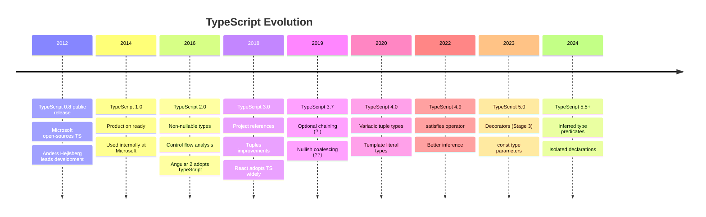
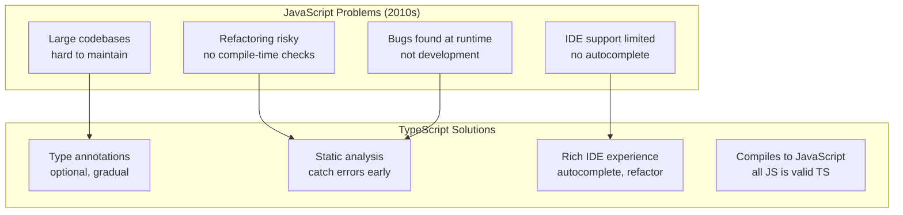
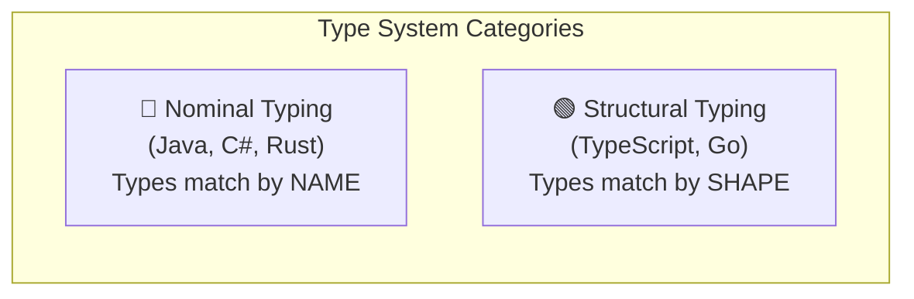
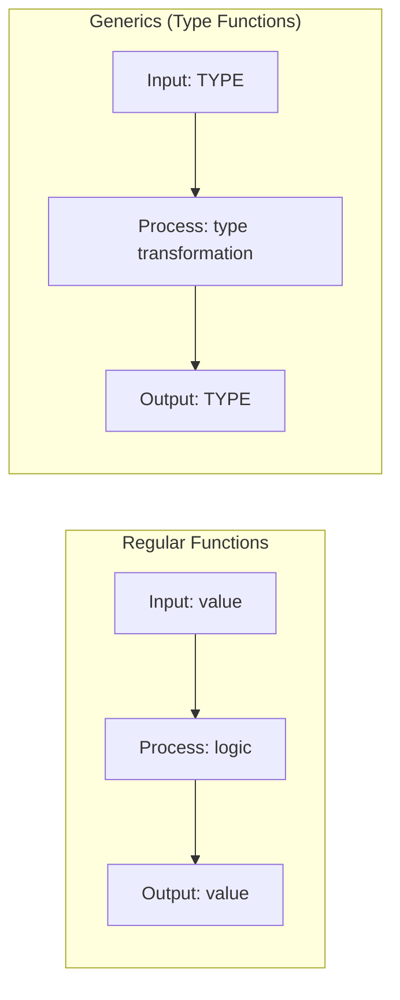
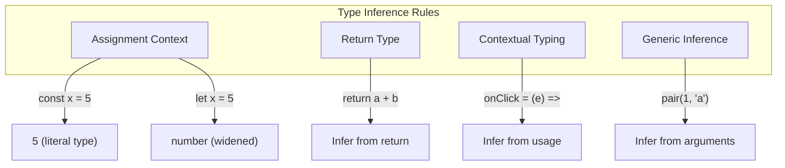
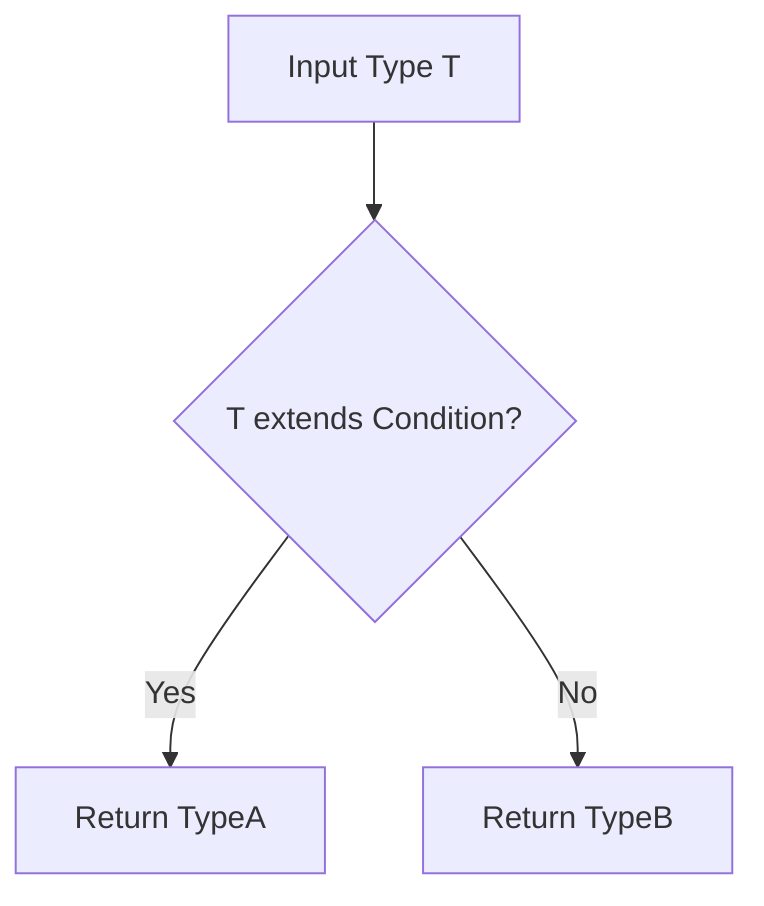
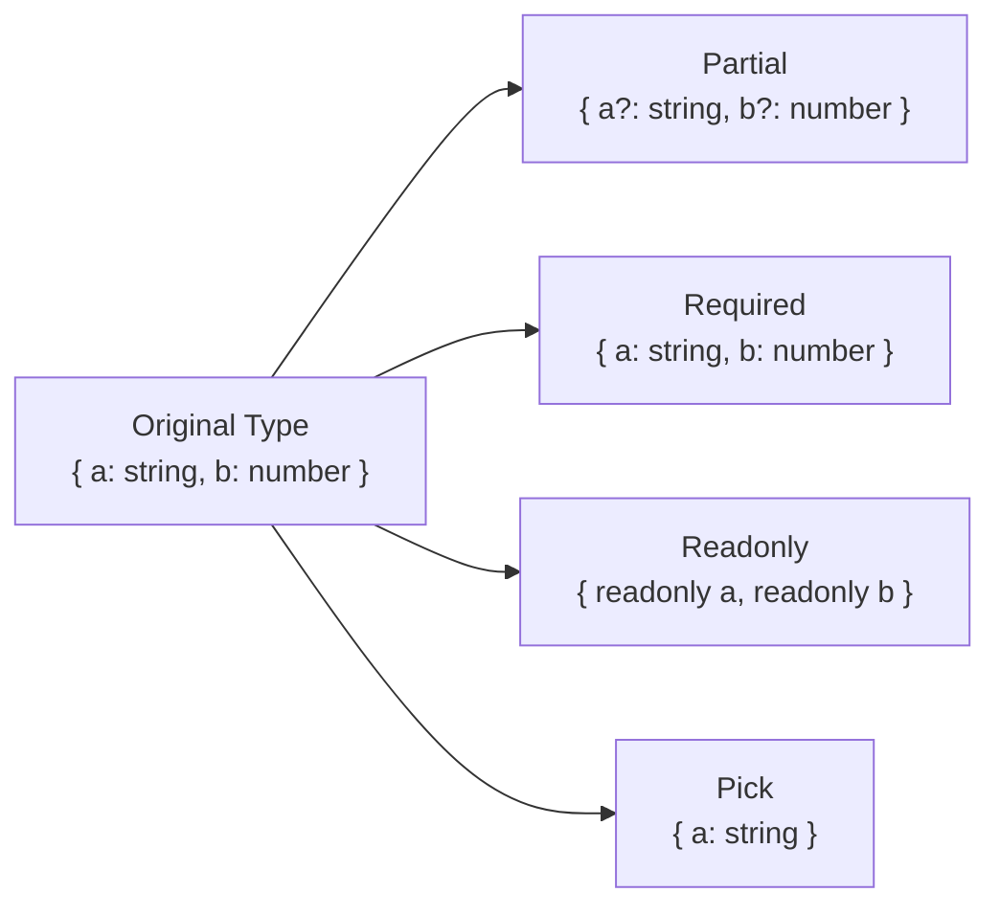
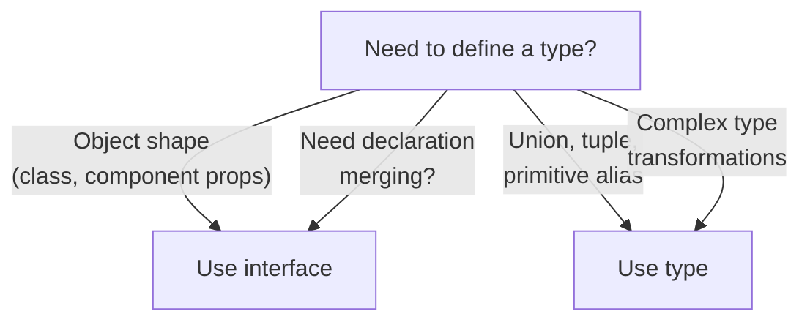

# 🔷 MODULE 5: TYPESCRIPT TYPE THEORY

> **Focus**: 90% Theory - 10% Type Examples
>
> _Hiểu TYPE SYSTEM, không chỉ syntax_
>
> **Phương pháp**: WHAT → WHY → HOW → WHEN

---

## 📋 Trong Module Này

1. [Lịch Sử TypeScript](#1-lịch-sử-typescript)
2. [Type System Philosophy](#2-type-system-philosophy)
3. [Generics Mental Model](#3-generics-mental-model)
4. [Type Inference Engine](#4-type-inference-engine)
5. [Conditional Types](#5-conditional-types)
6. [Mapped Types](#6-mapped-types)
7. [Template Literal Types](#7-template-literal-types)
8. [Type vs Interface Philosophy](#8-type-vs-interface-philosophy)

---

## 1. Lịch Sử TypeScript

### 📜 Timeline Phát Triển



### 💡 WHY - Tại sao TypeScript được tạo?



> [!NOTE] > **Anders Hejlsberg** - Creator of TypeScript, also created C#, Turbo Pascal, and Delphi.

---

## 2. Type System Philosophy

### ❓ WHAT - TypeScript type system là gì?



**TypeScript = Structural Typing**

```typescript
// Java (Nominal) - Would FAIL
class Dog { String name; }
class Cat { String name; }
Dog dog = new Dog();
Cat cat = dog; // ❌ Error: Dog is not Cat

// TypeScript (Structural) - WORKS
interface Dog { name: string; }
interface Cat { name: string; }
const dog: Dog = { name: 'Rex' };
const cat: Cat = dog; // ✅ Same SHAPE = Compatible
```

### 🔍 HOW - Compilation Pipeline

```
┌────────────────────────────────────────────────────────────┐
│  TypeScript Compilation Pipeline                           │
│                                                            │
│  Source.ts                                                 │
│      │                                                     │
│      ▼                                                     │
│  Scanner → Tokens                                          │
│      │                                                     │
│      ▼                                                     │
│  Parser → AST (Abstract Syntax Tree)                       │
│      │                                                     │
│      ▼                                                     │
│  Binder → Symbol Table                                     │
│      │                                                     │
│      ▼                                                     │
│  Type Checker (🔴 ERRORS CAUGHT HERE)                      │
│      │                                                     │
│      ▼                                                     │
│  Emitter → JavaScript (NO TYPES AT RUNTIME!)               │
│                                                            │
│  ⚠️ Types exist ONLY at compile-time                       │
│  ⚠️ All types are "erased" in output JS                    │
└────────────────────────────────────────────────────────────┘
```

### 💡 WHY - Structural over Nominal?

| Benefit              | Explanation                         |
| -------------------- | ----------------------------------- |
| **Flexibility**      | Code works if shapes match          |
| **Duck typing**      | "If it walks like a duck..."        |
| **Easy refactoring** | No need to implement interfaces     |
| **JS interop**       | JS objects don't have nominal types |

> [!TIP] > **Mental Model:**
> TypeScript asks: "Does this object HAVE the properties I need?"
> NOT: "Was this object DECLARED as this type?"

---

## 3. Generics Mental Model

### ❓ WHAT - Generics là gì?

**Generics = Functions for Types**



### 🔍 HOW - Common Generic Patterns

```typescript
// 1️⃣ Identity pattern - preserve input type
function identity<T>(x: T): T {
  return x;
}
const str = identity("hello"); // T = string

// 2️⃣ Container pattern - wrap any type
interface Box<T> {
  value: T;
}
const numBox: Box<number> = { value: 42 };

// 3️⃣ Constraint pattern - limit T
function getLength<T extends { length: number }>(item: T): number {
  return item.length;
}
getLength("hello"); // ✅ string has length
getLength([1, 2, 3]); // ✅ array has length
getLength(42); // ❌ number has no length

// 4️⃣ Multiple type parameters
function pair<T, U>(first: T, second: U): [T, U] {
  return [first, second];
}
const p = pair(1, "hello"); // [number, string]
```

### 💡 WHY - Khi nào cần Generics?

| Pattern            | Use Case                                 |
| ------------------ | ---------------------------------------- |
| **Containers**     | `Array<T>`, `Promise<T>`, `Map<K, V>`    |
| **Preserve types** | Return same type as input                |
| **Factories**      | Create instances of any type             |
| **Utilities**      | `Partial<T>`, `Pick<T, K>`, `Omit<T, K>` |

---

## 4. Type Inference Engine

### ❓ WHAT - Inference là gì?

TypeScript **automatically infers** types khi không khai báo.

### 🔍 HOW - Inference Rules



```typescript
// 1️⃣ Literal vs Widening
const x = 5; // Type: 5 (literal)
let y = 5; // Type: number (widened)
const z = 5 as const; // Type: 5 (literal via as const)

// 2️⃣ Return type inference
function add(a: number, b: number) {
  return a + b; // Return type inferred: number
}

// 3️⃣ Contextual typing
const names = ["Alice", "Bob"];
names.map((name) => name.toUpperCase());
//        ^^^^ TypeScript knows: string (from Array<string>)

// 4️⃣ Control flow narrowing
function process(x: string | number) {
  if (typeof x === "string") {
    return x.toUpperCase(); // x narrowed to string
  }
  return x.toFixed(2); // x narrowed to number
}
```

### ⏰ WHEN - Inference vs Explicit?

```
┌────────────────────────────────────────────────────────────┐
│  LET INFERENCE                  │  BE EXPLICIT             │
├─────────────────────────────────┼──────────────────────────┤
│  ✅ Variable assignments        │  ✅ Function parameters  │
│  ✅ Return types (simple)       │  ✅ Public API exports   │
│  ✅ Callback parameters         │  ✅ Complex object types │
│  ✅ Generic type arguments      │  ✅ When inference fails │
└─────────────────────────────────┴──────────────────────────┘
```

---

## 5. Conditional Types

### ❓ WHAT - Conditional Types là gì?

**Conditional Types = Ternary operator for types**

```typescript
Type = Condition extends Check ? TrueType : FalseType
```

### 🔍 HOW - Common Patterns



```typescript
// 1️⃣ Basic conditional
type IsString<T> = T extends string ? true : false;
type A = IsString<"hello">; // true
type B = IsString<123>; // false

// 2️⃣ Extract from union
type ExtractString<T> = T extends string ? T : never;
type C = ExtractString<"a" | 1 | "b">; // 'a' | 'b'

// 3️⃣ infer keyword - extract types
type GetReturnType<T> = T extends (...args: any[]) => infer R ? R : never;
type D = GetReturnType<() => string>; // string

// 4️⃣ GetArrayElement
type GetElement<T> = T extends (infer E)[] ? E : never;
type E = GetElement<string[]>; // string
```

### 💡 WHY - Distributive Behavior

```typescript
// Conditional types DISTRIBUTE over unions
type ToArray<T> = T extends any ? T[] : never;

type Result = ToArray<string | number>;
// Distributes as:
// ToArray<string> | ToArray<number>
// = string[] | number[]

// To PREVENT distribution, wrap in tuple:
type ToArrayNoDistribute<T> = [T] extends [any] ? T[] : never;
type Result2 = ToArrayNoDistribute<string | number>;
// = (string | number)[]
```

---

## 6. Mapped Types

### ❓ WHAT - Mapped Types là gì?

**Mapped Types = Transform all properties of a type**

```typescript
{ [K in keyof T]: TransformedType }
```

### 🔍 HOW - Built-in Utility Types



```typescript
// How Partial<T> works internally
type MyPartial<T> = {
  [K in keyof T]?: T[K];
};

// How Readonly<T> works
type MyReadonly<T> = {
  readonly [K in keyof T]: T[K];
};

// How Pick<T, K> works
type MyPick<T, K extends keyof T> = {
  [P in K]: T[P];
};

// Custom: Make all properties nullable
type Nullable<T> = {
  [K in keyof T]: T[K] | null;
};

// Key remapping (TS 4.1+)
type Getters<T> = {
  [K in keyof T as `get${Capitalize<K & string>}`]: () => T[K];
};
type Person = { name: string; age: number };
type PersonGetters = Getters<Person>;
// { getName: () => string; getAge: () => number }
```

### 💡 WHY - DRY for Types

```
┌────────────────────────────────────────────────────────────┐
│  INSTEAD OF:                                               │
│  interface UserRequired { name: string; age: number; }    │
│  interface UserOptional { name?: string; age?: number; }  │
│  interface UserReadonly { readonly name: string; ... }    │
│                                                            │
│  USE:                                                      │
│  interface User { name: string; age: number; }            │
│  type OptionalUser = Partial<User>;                       │
│  type ReadonlyUser = Readonly<User>;                      │
│                                                            │
│  ✅ Single source of truth                                 │
│  ✅ Changes propagate automatically                        │
└────────────────────────────────────────────────────────────┘
```

---

## 7. Template Literal Types

### ❓ WHAT - Template Literal Types?

**Template Literal Types = String manipulation at type level**

```typescript
type Greeting = `Hello, ${string}`;
type Valid = "Hello, World"; // ✅ matches Greeting
type Invalid = "Hi, World"; // ❌ doesn't match
```

### 🔍 HOW - Practical Patterns

```typescript
// 1️⃣ Event handlers
type EventName = "click" | "scroll" | "keydown";
type Handler = `on${Capitalize<EventName>}`;
// 'onClick' | 'onScroll' | 'onKeydown'

// 2️⃣ CSS colors
type Color = "red" | "blue" | "green";
type Shade = "light" | "dark";
type ColorVariant = `${Shade}-${Color}`;
// 'light-red' | 'light-blue' | ... | 'dark-green'

// 3️⃣ API endpoints
type Method = "GET" | "POST";
type Resource = "users" | "posts";
type Endpoint = `${Uppercase<Method>} /api/${Resource}`;
// 'GET /api/users' | 'GET /api/posts' | ...

// 4️⃣ Extract type from string
type ExtractLang<T> = T extends `${string}.${infer Ext}` ? Ext : never;
type Ext = ExtractLang<"file.ts">; // 'ts'
```

---

## 8. Type vs Interface Philosophy

### ❓ WHAT - Sự khác biệt?

| Feature                        | interface | type                 |
| ------------------------------ | --------- | -------------------- |
| **Extend**                     | `extends` | `&` (intersection)   |
| **Declaration merging**        | ✅ Yes    | ❌ No                |
| **Primitives, unions, tuples** | ❌ No     | ✅ Yes               |
| **Computed properties**        | ❌ No     | ✅ Yes               |
| **Error messages**             | ✅ Better | ⚠️ Sometimes verbose |

### 🔍 HOW - Decision Tree



```typescript
// ✅ interface: Objects, classes
interface User {
  id: number;
  name: string;
}

interface Admin extends User {
  role: "admin";
}

// ✅ type: Unions, tuples, complex
type Status = "pending" | "active" | "done";
type Pair<T> = [T, T];
type Nullable<T> = T | null;

// Declaration merging (interface only)
interface User {
  email: string; // Adds to existing User
}
```

### 💡 WHY - TypeScript Team Recommendation

```
┌────────────────────────────────────────────────────────────┐
│  "Use interface when you can, type when you must."         │
│                                                            │
│  REASONS for interface:                                    │
│  1. Better error messages                                  │
│  2. Better performance (faster type merging)               │
│  3. Clearer intent (describes object shape)                │
│                                                            │
│  USE type for:                                             │
│  • Unions: type A = B | C                                 │
│  • Tuples: type Pair = [string, number]                   │
│  • Computed/mapped types: type Keys = keyof T             │
│  • Primitive aliases: type ID = string                    │
└────────────────────────────────────────────────────────────┘
```

---

## 📊 Summary - TypeScript Mental Models

| Concept               | Mental Model                             |
| --------------------- | ---------------------------------------- |
| **Structural typing** | "Does it have the right shape?"          |
| **Generics**          | "Functions that operate on types"        |
| **Inference**         | "TypeScript figures it out"              |
| **Conditional types** | "if-else for types"                      |
| **Mapped types**      | "Transform all properties"               |
| **Template literals** | "String manipulation for types"          |
| **interface vs type** | "interface for shapes, type for algebra" |

---

## 🔗 Cross-References

| Topic              | Related Module                                                                               |
| ------------------ | -------------------------------------------------------------------------------------------- |
| React + TypeScript | [Module 6: Framework Patterns](./06-framework-patterns.md)                                   |
| JavaScript types   | [Module 1: JavaScript Theory](./01-javascript-theory.md#9-type-coercion---cơ-chế-chuyển-đổi) |

---

## 🔗 Navigation

| Prev                                               | Module                   | Next                                             |
| -------------------------------------------------- | ------------------------ | ------------------------------------------------ |
| [Architecture Theory](./04-architecture-theory.md) | **5. TypeScript Theory** | [Framework Patterns](./06-framework-patterns.md) |

---

> _Tiếp theo: [Module 6: Framework Patterns](./06-framework-patterns.md)_
