# 🌐 MODULE 2: BROWSER & RUNTIME THEORY

> **Focus**: 90% Theory - 10% Diagrams
>
> _Hiểu cách browser biến code thành pixels_
>
> **Phương pháp**: WHAT → WHY → HOW → WHEN

---

## 📋 Trong Module Này

1. [Lịch Sử Browser](#1-lịch-sử-browser)
2. [Browser Architecture - Multi-Process](#2-browser-architecture---multi-process)
3. [Critical Rendering Path](#3-critical-rendering-path)
4. [Reflow vs Repaint - Cost Analysis](#4-reflow-vs-repaint---cost-analysis)
5. [JavaScript Engine Comparison](#5-javascript-engine-comparison)
6. [DOM, BOM, CSSOM Architecture](#6-dom-bom-cssom-architecture)
7. [Network Layer Deep Dive](#7-network-layer-deep-dive)
8. [Browser Storage Philosophy](#8-browser-storage-philosophy)
9. [Web Standards Bodies](#9-web-standards-bodies)

---

## 1. Lịch Sử Browser

### ❓ WHAT - Browser là gì?

Browser là **phần mềm phức tạp** kết hợp:

- Rendering engine (hiển thị HTML/CSS)
- JavaScript engine (thực thi code)
- Networking stack (HTTP/HTTPS)
- Security sandbox (bảo vệ user)

### 📜 Timeline Phát Triển

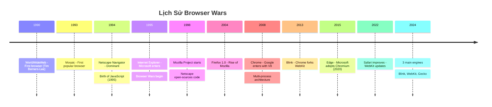

### 💡 WHY - Tại sao lịch sử browser quan trọng?

| Era               | Ảnh hưởng đến ngày nay      |
| ----------------- | --------------------------- |
| **Browser Wars**  | Web standards movement      |
| **Chrome 2008**   | V8, modern JS performance   |
| **Multi-process** | Security, stability model   |
| **Blink fork**    | Webkit vs Blink differences |

---

## 2. Browser Architecture - Multi-Process

### ❓ WHAT - Modern Browser Architecture

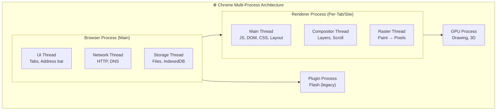

### 💡 WHY - Tại sao Multi-Process?

| Single-Process (cũ)            | Multi-Process (mới)         |
| ------------------------------ | --------------------------- |
| 1 tab crash = all crash        | 1 tab crash = only that tab |
| Security exploit = full access | Sandboxed, limited access   |
| 1 thread = UI freeze           | Parallel processing         |

### 🔍 HOW - Site Isolation hoạt động?

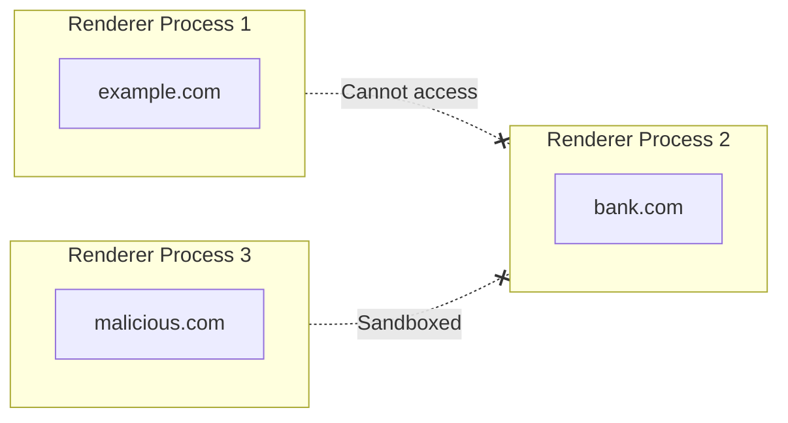

> [!IMPORTANT] > **Site Isolation** giúp chống lại Spectre/Meltdown attacks.
> Mỗi origin chạy trong process riêng, không thể đọc memory của origin khác.

### ⏰ WHEN - Quan tâm đến architecture khi nào?

| Situation                 | Tại sao cần hiểu                  |
| ------------------------- | --------------------------------- |
| **Performance debugging** | Biết thread nào bị bottleneck     |
| **Memory issues**         | Hiểu tại sao tab X dùng nhiều RAM |
| **Security review**       | Hiểu sandboxing, CSP              |
| **PWA development**       | Service Worker runs in background |

---

## 3. Critical Rendering Path

### ❓ WHAT - Đường đi từ HTML đến Pixels?

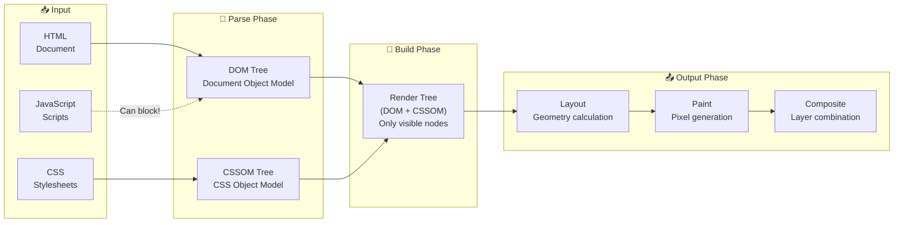

### 💡 WHY - Hiểu CRP để làm gì?

| Không hiểu CRP                     | Hiểu CRP                 |
| ---------------------------------- | ------------------------ |
| Page load chậm, không biết tại sao | Biết optimize từng phase |
| Random performance issues          | Identify bottleneck      |
| LCP score xấu                      | Improve Core Web Vitals  |

### 🔍 HOW - Chi tiết từng Phase

#### Phase 1: Parsing

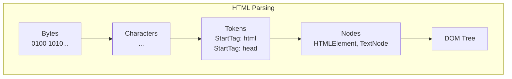

```
HTML Parser Algorithm:
1. Tokenization: bytes → characters → tokens
2. Tree Construction: tokens → nodes → DOM tree
3. Speculative Parsing: prefetch <link>, <script> while parsing
```

#### Phase 2: Styles & Render Tree

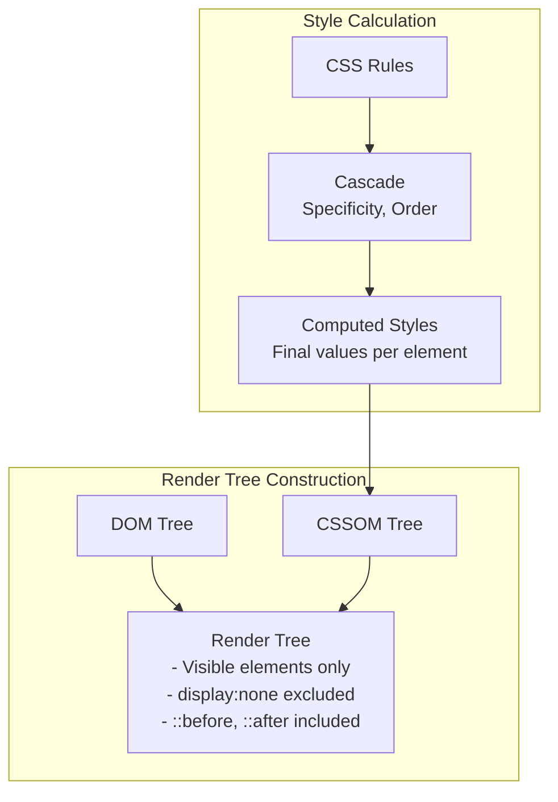

#### Phase 3: Layout (Reflow)

```
Layout Algorithm (Box Model):
1. Start from root
2. Calculate width (based on parent)
3. Calculate children positions
4. Calculate height (based on children or specified)
5. Repeat for all elements

Cost: O(n) where n = number of elements
```

#### Phase 4: Paint & Composite

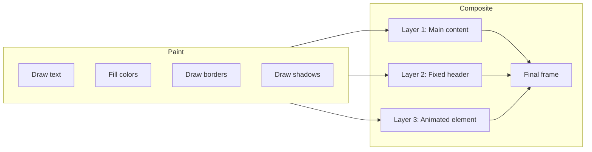

### Parser Blocking - Vấn Đề Quan Trọng

```
┌─────────────────────────────────────────────────────────────┐
│  <head>                                                     │
│    <link rel="stylesheet" href="style.css">  ← CSS blocks  │
│    <script src="app.js"></script>            ← JS blocks   │
│  </head>                                                    │
│                                                             │
│  ⚠️ Browser PHẢI:                                          │
│     1. Download CSS trước khi continue parsing             │
│     2. Download & Execute JS trước khi continue            │
│                                                             │
│  ✅ Solutions:                                              │
│     • <script defer> : Download parallel, execute after    │
│     • <script async> : Download parallel, execute ASAP     │
│     • CSS in <head>, JS at end of <body>                   │
│     • <link rel="preload"> for critical resources          │
└─────────────────────────────────────────────────────────────┘
```

### 🔗 Cross-References

- → [Module 7: Performance](./07-performance-security.md) - Core Web Vitals optimization
- → [Module 3: React](./03-react-philosophy.md) - Virtual DOM minimizes CRP cost

---

## 4. Reflow vs Repaint - Cost Analysis

### ❓ WHAT - Khi nào browser phải làm lại?

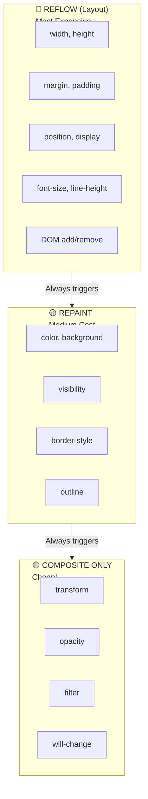

### 💡 WHY - Cost Analysis

| Operation     | CPU Cost  | Triggers                           |
| ------------- | --------- | ---------------------------------- |
| **Reflow**    | ~10-100ms | Recalculates ALL element positions |
| **Repaint**   | ~1-10ms   | Redraws affected pixels            |
| **Composite** | ~0.1-1ms  | Moves pre-painted layers           |

### 🔍 HOW - Layout Thrashing Explained

```javascript
// ❌ LAYOUT THRASHING (Very Bad!)
for (let i = 0; i < 100; i++) {
  element.style.width = element.offsetWidth + 10 + "px";
  // 👆 READ (offsetWidth) → Forces synchronous layout
  // 👆 WRITE (style.width) → Invalidates layout
  // Next iteration → Force layout AGAIN
  // 100 layouts instead of 1!
}

// ✅ CORRECT: Batch reads, then batch writes
const width = element.offsetWidth; // Read ONCE
const widths = [];
for (let i = 0; i < 100; i++) {
  widths[i] = width + i * 10;
}
for (let i = 0; i < 100; i++) {
  elements[i].style.width = widths[i] + "px"; // Write ALL
}
// Only 1 layout!
```

### ⏰ WHEN - Optimization Rules

> [!TIP] > **Gold Rules để tránh Reflow:**
>
> 1. Animate `transform` & `opacity` thay vì `left`, `top`, `width`
> 2. Batch DOM reads rồi mới writes
> 3. Use `will-change` to promote to own layer
> 4. Avoid reading layout properties in animation loops
> 5. Use `requestAnimationFrame` for visual changes

---

## 5. JavaScript Engine Comparison

### ❓ WHAT - Các JS Engine chính?

| Engine                     | Browser               | Company   | Notable For          |
| -------------------------- | --------------------- | --------- | -------------------- |
| **V8**                     | Chrome, Edge, Node.js | Google    | Fastest, most used   |
| **SpiderMonkey**           | Firefox               | Mozilla   | First ever JS engine |
| **JavaScriptCore (Nitro)** | Safari                | Apple     | iOS only option      |
| **Chakra**                 | Old Edge              | Microsoft | Deprecated           |

### 🔍 HOW - V8 Pipeline Deep Dive

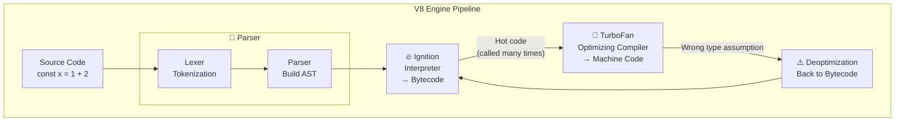

### 💡 WHY - JIT Compilation Strategy

**Just-In-Time (JIT)** = Compile at runtime based on actual usage patterns

```
Traditional Interpretation:    JIT Compilation:
Source → Execute               Source → Profile → Compile Hot Paths → Execute
Slow but starts fast           Fast execution, startup cost
```

### Hidden Classes (Shapes) - V8 Optimization

```javascript
// V8 creates "hidden classes" for object shapes

// ✅ GOOD - Consistent shape
function Point(x, y) {
  this.x = x;
  this.y = y;
}
const p1 = new Point(1, 2); // Shape A: {x, y}
const p2 = new Point(3, 4); // Shape A: {x, y} - SAME!
// V8 optimizes property access for Shape A

// ❌ BAD - Inconsistent shapes
const obj1 = { x: 1 };
const obj2 = { x: 1 };
obj2.y = 2; // Shape changes! Less optimized
```

### ⏰ WHEN - Write V8-Friendly Code

| Pattern                                  | V8 Impact                 |
| ---------------------------------------- | ------------------------- |
| Consistent object shapes                 | Hidden class optimization |
| Monomorphic functions                    | Inline caching works      |
| Avoid `delete` on objects                | Doesn't change shape      |
| Initialize all properties in constructor | Same hidden class         |

---

## 6. DOM, BOM, CSSOM Architecture

### ❓ WHAT - Ba "Object Models"?

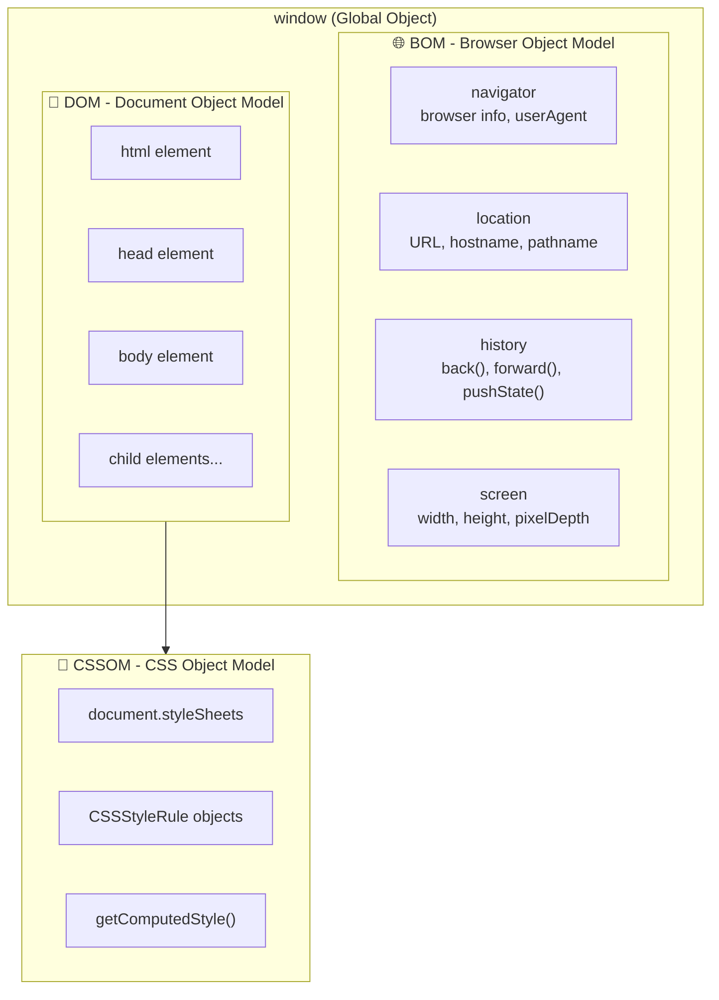

### 💡 WHY - DOM Access Slow?

```
┌───────────────────────┐      Bridge      ┌───────────────────────┐
│   JavaScript Engine   │ ◄─────────────► │   Rendering Engine    │
│   (V8)                │    COSTLY!       │   (Blink)             │
│                       │                  │   - DOM lives here    │
│   Your code runs      │                  │   - CSSOM lives here  │
│   here                │                  │   - Layout happens    │
└───────────────────────┘                  └───────────────────────┘

📌 Problem: Crossing bridge is expensive
📌 Solution: Batch DOM operations, cache references
```

### 🔍 HOW - DOM Manipulation Best Practices

```javascript
// ❌ Slow: Multiple bridge crossings
for (let i = 0; i < 1000; i++) {
  document.body.appendChild(document.createElement("div"));
}

// ✅ Fast: Use DocumentFragment (1 crossing)
const fragment = document.createDocumentFragment();
for (let i = 0; i < 1000; i++) {
  fragment.appendChild(document.createElement("div"));
}
document.body.appendChild(fragment);

// ✅ Even faster: innerHTML (but careful with XSS!)
document.body.innerHTML = divs.join("");
```

---

## 7. Network Layer Deep Dive

### ❓ WHAT - Request Lifecycle?

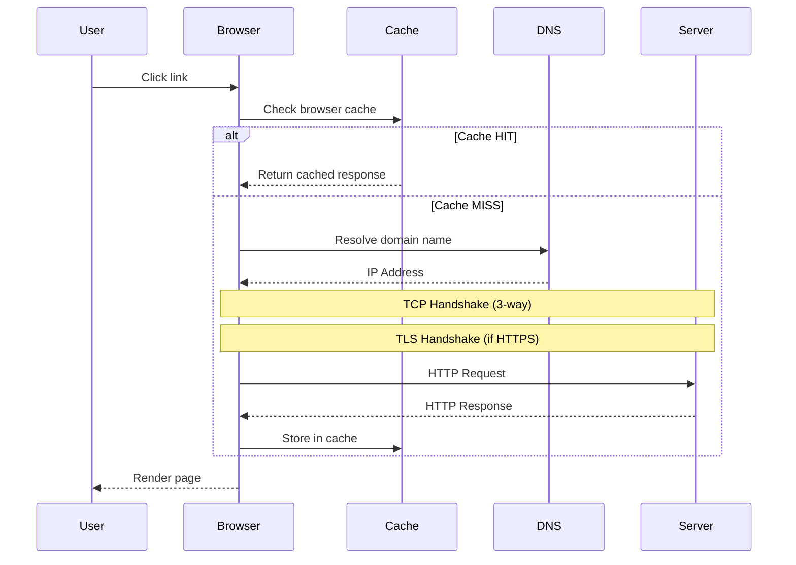

### 🔍 HOW - HTTP Evolution

| Aspect           | HTTP/1.1         | HTTP/2             | HTTP/3           |
| ---------------- | ---------------- | ------------------ | ---------------- |
| **Year**         | 1997             | 2015               | 2022             |
| **Connections**  | 6 per domain     | Single multiplexed | Single QUIC      |
| **Head-of-line** | Yes              | At TCP level       | None!            |
| **Headers**      | Text, repetitive | HPACK compress     | QPACK compress   |
| **Server Push**  | No               | Yes                | Yes              |
| **Protocol**     | TCP              | TCP                | QUIC (UDP-based) |

### 💡 WHY - HTTP/3 Uses QUIC?

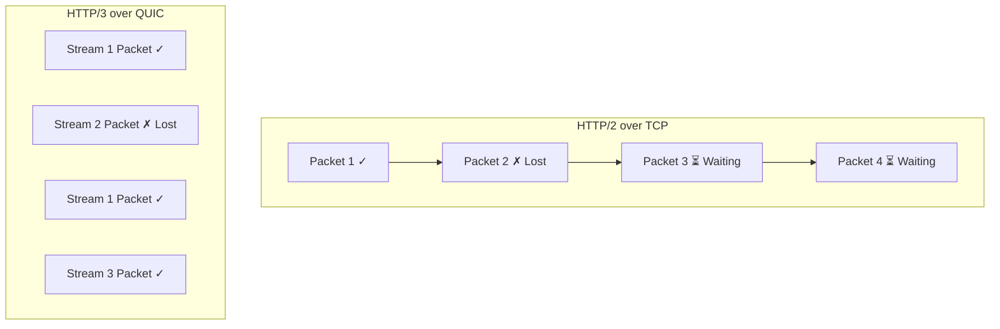

**TCP Problem**: One lost packet blocks ALL streams (Head-of-line blocking)

**QUIC Solution**: Streams are independent. Lost packet in Stream 2 doesn't block Stream 1 or 3.

---

## 8. Browser Storage Philosophy

### ❓ WHAT - Storage Options?

| Storage            | Size   | Persistence  | Scope      | Sync/Async | Best For          |
| ------------------ | ------ | ------------ | ---------- | ---------- | ----------------- |
| **Cookies**        | 4KB    | Expiry date  | Domain     | Sync       | Auth, tracking    |
| **localStorage**   | 5-10MB | Permanent    | Origin     | Sync       | Small key-value   |
| **sessionStorage** | 5-10MB | Tab lifetime | Origin+Tab | Sync       | Temp session data |
| **IndexedDB**      | Large  | Permanent    | Origin     | Async      | Structured data   |
| **Cache API**      | Quota  | Permanent    | Origin     | Async      | HTTP responses    |

### 🔍 HOW - Decision Tree

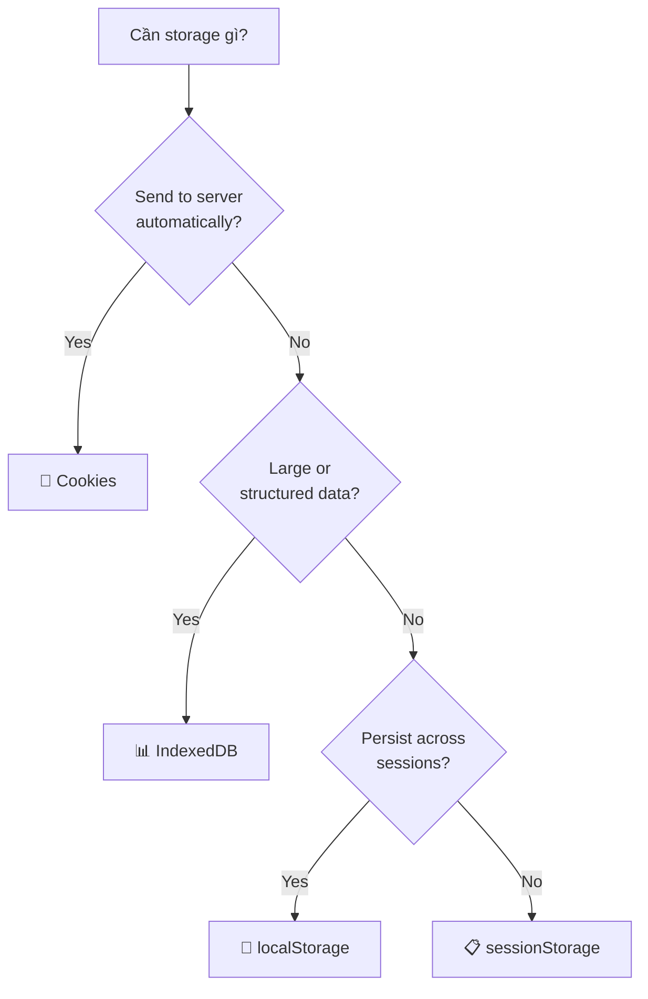

### 💡 WHY - localStorage Synchronous is Problematic

```javascript
// localStorage is SYNCHRONOUS → blocks main thread!
localStorage.setItem("huge", JSON.stringify(largeData));
// ❌ Everything waits until this completes

// IndexedDB is ASYNCHRONOUS → non-blocking
const db = await openDB("myDB", 1);
await db.put("store", largeData, "key");
// ✅ UI remains responsive
```

> [!WARNING] > **Security Notes:**
>
> - NEVER store sensitive data in localStorage (XSS can read it)
> - Use `HttpOnly` cookies for auth tokens
> - IndexedDB/localStorage obey Same-Origin Policy

---

## 9. Web Standards Bodies

### ❓ WHAT - Ai quyết định web standards?

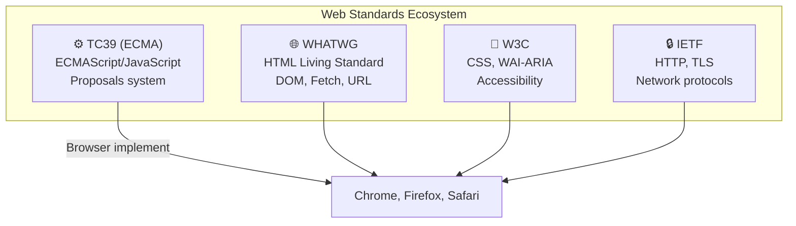

### 🔍 HOW - TC39 Proposal Process

| Stage | Name        | Meaning                  | Example                |
| ----- | ----------- | ------------------------ | ---------------------- |
| **0** | Strawperson | Just an idea             | Any TC39 member idea   |
| **1** | Proposal    | Problem defined          | General solution shape |
| **2** | Draft       | Specification text       | Formal spec language   |
| **3** | Candidate   | Ready for implementation | Browsers can ship      |
| **4** | Finished    | In ECMAScript spec       | Fully standardized     |

### 💡 WHY - WHATWG vs W3C History

**Problem (2004-2019)**: W3C và WHATWG có 2 HTML specs khác nhau

**Solution (2019)**: Agreement - WHATWG maintains "living standard", W3C creates snapshots

> [!NOTE] > **"Living Standard"** = Continuously updated, no version numbers.
> Check [caniuse.com](https://caniuse.com) for browser support.

---

## 📊 Summary Diagram

```
┌─────────────────────────────────────────────────────────────┐
│                    BROWSER ARCHITECTURE                      │
├──────────────────┬──────────────────┬───────────────────────┤
│   User Interface │  Browser Engine  │      Data Storage     │
│                  │       ↓          │                       │
│     Address Bar  │  ┌───────────┐   │  Cookies              │
│     Navigation   │  │ Rendering │   │  localStorage         │
│     Bookmarks    │  │  Engine   │   │  IndexedDB           │
│                  │  │ (Blink)   │   │  Cache API            │
│                  │  └───────────┘   │                       │
│                  │       ↓          │                       │
│                  │  ┌───────────┐   │                       │
│                  │  │    JS     │   │                       │
│                  │  │  Engine   │   │                       │
│                  │  │  (V8)     │   │                       │
│                  │  └───────────┘   │                       │
├──────────────────┴───────┬──────────┴───────────────────────┤
│                    Networking Layer                          │
│       DNS → TCP → TLS → HTTP/2 or HTTP/3 → Response         │
└─────────────────────────────────────────────────────────────┘
```

---

## 🔗 Cross-References

| Topic                    | Related Module                                                                   |
| ------------------------ | -------------------------------------------------------------------------------- |
| Event Loop integration   | [Module 1: JavaScript Theory](./01-javascript-theory.md#2-event-loop---bản-chất) |
| Performance optimization | [Module 7: Performance](./07-performance-security.md)                            |
| React Virtual DOM        | [Module 3: React Philosophy](./03-react-philosophy.md)                           |

---

## 🔗 Navigation

| Prev                                           | Module                | Next                                         |
| ---------------------------------------------- | --------------------- | -------------------------------------------- |
| [JavaScript Theory](./01-javascript-theory.md) | **2. Browser Theory** | [React Philosophy](./03-react-philosophy.md) |

---

> _Tiếp theo: [Module 3: React Philosophy](./03-react-philosophy.md)_
