# ⚛️ MODULE 3: REACT PHILOSOPHY

> **Focus**: 90% Theory - 10% Patterns
>
> _Hiểu TẠI SAO React thiết kế như vậy_
>
> **Phương pháp**: WHAT → WHY → HOW → WHEN

---

## 📋 Trong Module Này

1. [Lịch Sử React](#1-lịch-sử-react)
2. [Core Principles - UI = f(state)](#2-core-principles---ui--fstate)
3. [Virtual DOM Theory](#3-virtual-dom-theory)
4. [Reconciliation Algorithm Deep Dive](#4-reconciliation-algorithm-deep-dive)
5. [React Fiber Architecture](#5-react-fiber-architecture)
6. [Hooks Philosophy & Internals](#6-hooks-philosophy--internals)
7. [State Management Philosophy](#7-state-management-philosophy)
8. [Component Composition](#8-component-composition)

---

## 1. Lịch Sử React

### ❓ WHAT - React được tạo ra như thế nào?

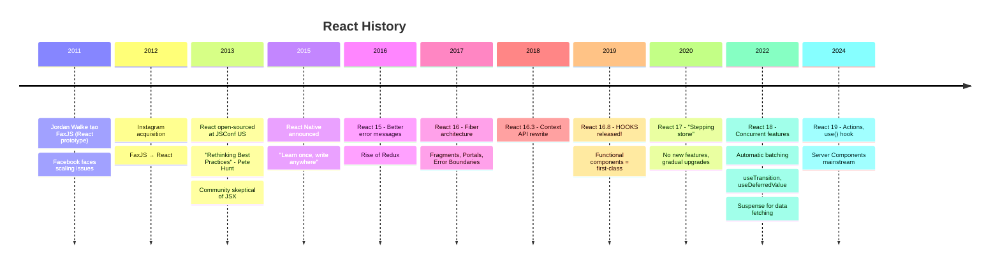

### 💡 WHY - Tại sao Facebook tạo React?

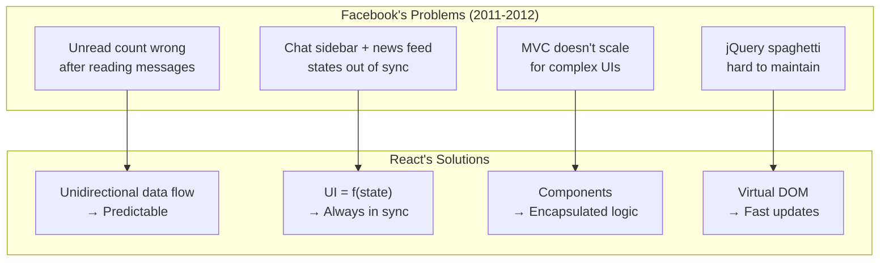

> [!NOTE] > **Jordan Walke's inspiration**: Từ XHP (PHP component framework tại Facebook) + Functional programming concepts.

---

## 2. Core Principles - UI = f(state)

### ❓ WHAT - Công Thức Cốt Lõi

```
UI = f(state)

Trong đó:
- UI = Giao diện người dùng hiển thị
- f = Function (React component)
- state = Dữ liệu hiện tại
```

### 💡 WHY - Tại sao công thức này quan trọng?

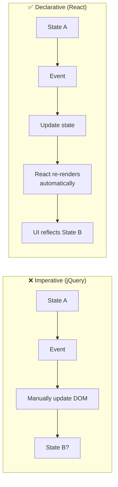

| Imperative                                     | Declarative                   |
| ---------------------------------------------- | ----------------------------- |
| "Khi click, tìm element, đổi text, thêm class" | "Khi count > 5, hiện warning" |
| Focus on HOW                                   | Focus on WHAT                 |
| DOM mutation                                   | State mutation                |
| Track manual changes                           | Auto re-render                |

### 🔍 HOW - React implements this

```javascript
// UI = f(state) in practice
function Counter() {
  // STATE
  const [count, setCount] = useState(0);

  // f(state) → UI
  return (
    <div>
      <span>{count}</span>
      {count > 10 && <Warning />} {/* Declarative! */}
      <button onClick={() => setCount((c) => c + 1)}>+</button>
    </div>
  );
}
// React automatically updates DOM when state changes
```

---

## 3. Virtual DOM Theory

### ❓ WHAT - Virtual DOM là gì?

**Virtual DOM = JavaScript object representation của Real DOM**

```javascript
// JSX
<div className="container">
  <h1>Hello</h1>
</div>

// Compiles to Virtual DOM object
{
  type: 'div',
  props: { className: 'container' },
  children: [
    {
      type: 'h1',
      props: {},
      children: ['Hello']
    }
  ]
}
```

### 💡 WHY - Tại sao không update DOM trực tiếp?

```
┌────────────────────────────────────────────────────────────┐
│  Real DOM manipulation = EXPENSIVE                         │
│                                                            │
│  Mỗi DOM change có thể trigger:                           │
│    1. Style recalculation                                  │
│    2. Layout (reflow) ← Most expensive!                   │
│    3. Paint                                                │
│    4. Composite                                            │
│                                                            │
│  Virtual DOM helps by:                                     │
│    ✓ Batching multiple state changes                       │
│    ✓ Computing diff in fast JavaScript memory              │
│    ✓ Minimizing actual DOM operations                      │
│    ✓ Applying only necessary changes                       │
└────────────────────────────────────────────────────────────┘
```

### 🔍 HOW - Virtual DOM Process

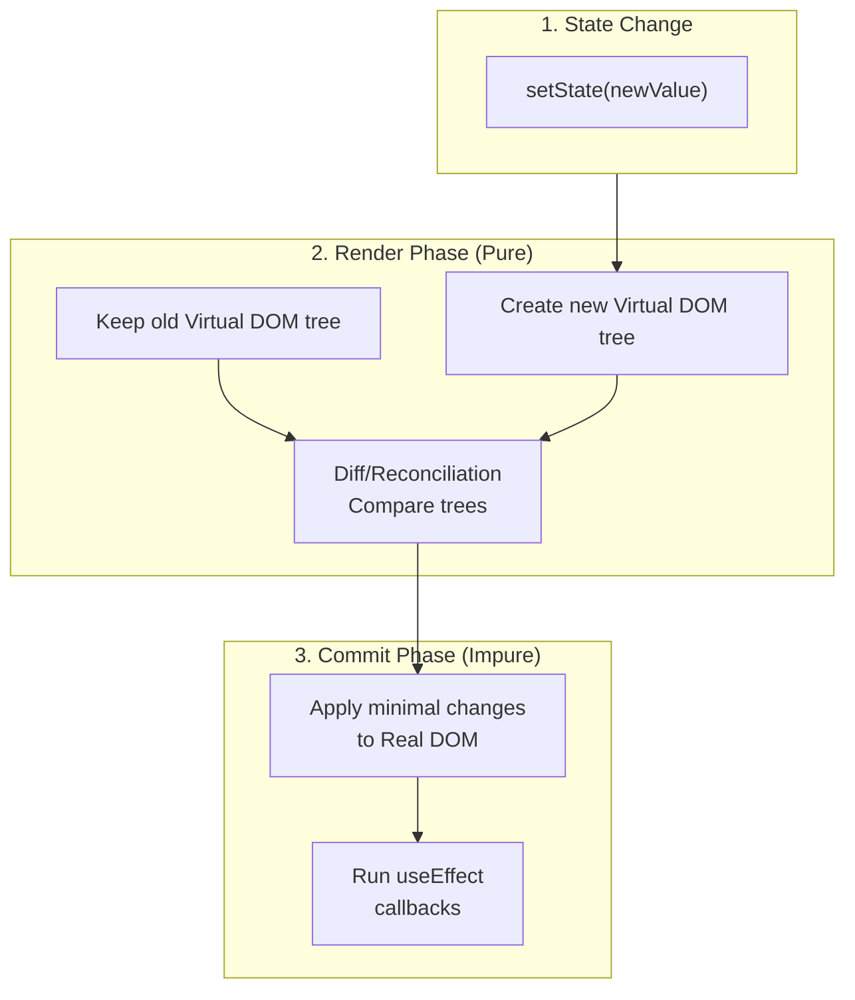

### 🔗 Cross-References

- → [Module 2: Reflow vs Repaint](./02-browser-theory.md#4-reflow-vs-repaint---cost-analysis)

---

## 4. Reconciliation Algorithm Deep Dive

### ❓ WHAT - Reconciliation là gì?

**Reconciliation** = Thuật toán để tìm sự khác biệt giữa 2 Virtual DOM trees.

### 💡 WHY - Toán học đằng sau

```
General tree diff algorithm: O(n³)
- Với 1000 elements = 1,000,000,000 comparisons!

React's heuristic algorithm: O(n)
- Với 1000 elements = 1,000 comparisons

Cải thiện 1,000,000x!
```

### 🔍 HOW - Two Key Heuristics

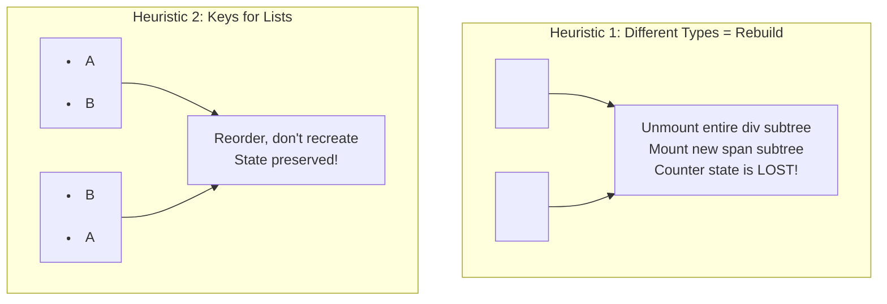

#### Heuristic 1: Element Type Changes

```javascript
// BEFORE
<div>
  <Counter />
</div>

// AFTER
<span>
  <Counter />
</span>

// React's decision:
// div !== span → Different types!
// → Unmount <div> and all children
// → Mount <span> from scratch
// → Counter loses all state!
```

#### Heuristic 2: Keys for Stable Identity

```javascript
// ❌ WITHOUT KEY - O(n²) worst case
<ul>
  {items.map(item => <li>{item.name}</li>)}
</ul>
// React can't tell which item moved, recreates all

// ✅ WITH KEY - O(n)
<ul>
  {items.map(item => <li key={item.id}>{item.name}</li>)}
</ul>
// React knows exactly which moved, reorders efficiently
```

> [!WARNING] > **Anti-pattern: Array index as key**
>
> ```javascript
> // ❌ BAD
> items.map((item, index) => <li key={index}>{item}</li>);
> // When items reorder, keys stay same but content changes!
> // React thinks same component, doesn't re-render correctly
> ```

---

## 5. React Fiber Architecture

### ❓ WHAT - Fiber là gì?

**Fiber = React's internal algorithm cho incremental, interruptible rendering**

| Pre-Fiber (React < 16) | With Fiber (React ≥ 16) |
| ---------------------- | ----------------------- |
| Stack Reconciler       | Fiber Reconciler        |
| Synchronous rendering  | Asynchronous rendering  |
| Cannot pause           | Can pause/resume/abort  |
| Blocking               | Non-blocking            |

### 💡 WHY - Vấn đề của Stack Reconciler

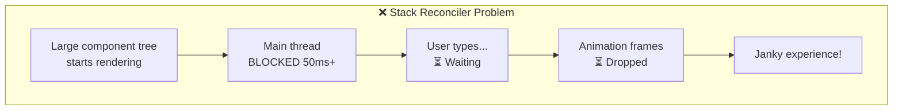

### 🔍 HOW - Fiber Works

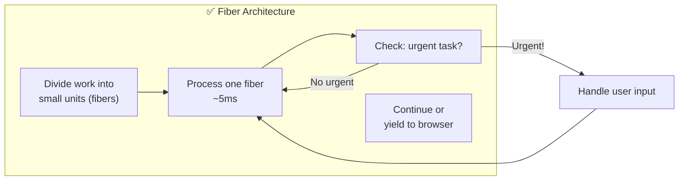

#### Fiber Node Structure

```javascript
// Simplified Fiber Node
const fiber = {
  // Identity
  type: "div", // Element type
  key: "item-1", // Unique identifier

  // Relationships (linked list)
  child: FiberNode, // First child
  sibling: FiberNode, // Next sibling
  return: FiberNode, // Parent (called 'return')

  // Work
  pendingProps: {}, // Incoming props
  memoizedProps: {}, // Props used last render
  memoizedState: {}, // Current state

  // Effects
  effectTag: "UPDATE", // PLACEMENT | UPDATE | DELETION
  nextEffect: FiberNode, // Next fiber with effect

  // Output
  stateNode: DOMElement, // Actual DOM node
};
```

#### Two Phases of Fiber

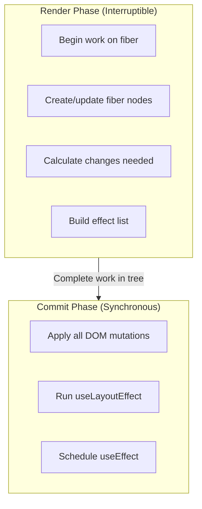

### ⏰ WHEN - Fiber Features

| Feature            | Enabled by Fiber                 |
| ------------------ | -------------------------------- |
| `Suspense`         | Pause rendering until data ready |
| `useTransition`    | Mark updates as non-urgent       |
| `useDeferredValue` | Defer expensive calculations     |
| Concurrent Mode    | Multiple renders in parallel     |
| Automatic Batching | Group state updates              |

> [!NOTE] > **React 18's Concurrent Features** Fiber cho phép React "chuẩn bị" multiple versions của UI simultaneously, chỉ commit version relevant nhất.

---

## 6. Hooks Philosophy & Internals

### ❓ WHAT - Tại sao Hooks thay thế Classes?

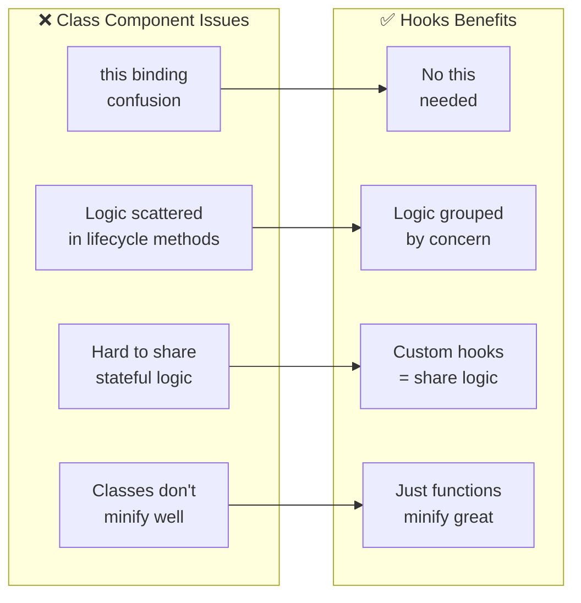

### 🔍 HOW - Hooks Internal Implementation

```javascript
// ⚠️ SIMPLIFIED - Actual React is more complex

// React keeps array of hooks per component
let hooks = [];
let currentHook = 0;

function useState(initial) {
  const hookIndex = currentHook;

  // First render: initialize
  if (hooks[hookIndex] === undefined) {
    hooks[hookIndex] = initial;
  }

  const setState = (newValue) => {
    hooks[hookIndex] = newValue;
    rerender(); // Trigger re-render
  };

  currentHook++; // Move to next hook position
  return [hooks[hookIndex], setState];
}

function useEffect(callback, deps) {
  const hookIndex = currentHook;
  const oldDeps = hooks[hookIndex]?.deps;

  // Compare dependencies
  const hasChanged =
    !oldDeps || deps.some((dep, i) => !Object.is(dep, oldDeps[i]));

  if (hasChanged) {
    hooks[hookIndex] = { callback, deps };
    scheduleEffect(callback); // Run after paint
  }

  currentHook++;
}
```

### 💡 WHY - Rules of Hooks

```
┌────────────────────────────────────────────────────────────┐
│  RULE 1: Only call hooks at TOP LEVEL                      │
│                                                            │
│  ❌ BAD:                                                   │
│  if (condition) {                                          │
│    const [a, setA] = useState(1);  // Index unpredictable │
│  }                                                         │
│                                                            │
│  Render 1: [useState(1)]        → hooks = [value1]        │
│  Render 2: [nothing]            → hooks = [] (mismatch!)   │
│                                                            │
│  ✅ GOOD:                                                  │
│  const [a, setA] = useState(1);    // Always index 0      │
│  const [b, setB] = useState(2);    // Always index 1      │
├────────────────────────────────────────────────────────────┤
│  RULE 2: Only call hooks in React functions                │
│                                                            │
│  ❌ regular functions, classes, event handlers             │
│  ✅ Functional components, custom hooks                    │
└────────────────────────────────────────────────────────────┘
```

### Common Hooks Deep Dive

#### useState - Closure Pattern

```javascript
// useState uses CLOSURES to persist state
function Counter() {
  const [count, setCount] = useState(0);

  // Stale closure problem:
  useEffect(() => {
    const id = setInterval(() => {
      console.log(count); // Always 0! (stale closure)
    }, 1000);
    return () => clearInterval(id);
  }, []); // Empty deps = captures initial count

  // Solution: Functional update
  useEffect(() => {
    const id = setInterval(() => {
      setCount((c) => c + 1); // Uses latest value
    }, 1000);
    return () => clearInterval(id);
  }, []);
}
```

#### useEffect - Lifecycle Mapping

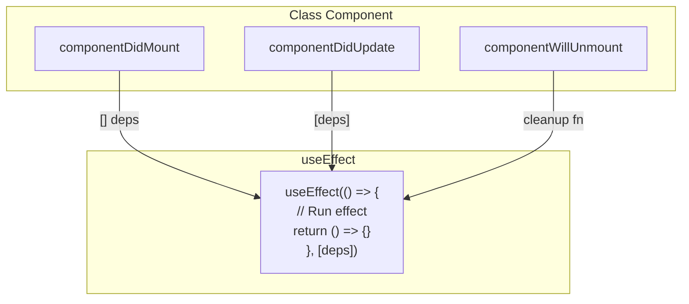

---

## 7. State Management Philosophy

### ❓ WHAT - Khi nào dùng gì?

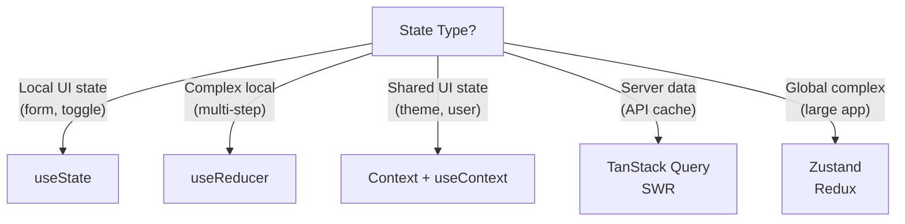

### 💡 WHY - Server State ≠ Client State

```
┌─────────────────────────────┬─────────────────────────────┐
│  CLIENT STATE               │  SERVER STATE               │
│  (UI owns)                  │  (Backend owns)             │
├─────────────────────────────┼─────────────────────────────┤
│  • Modal open/close         │  • User profile             │
│  • Selected tab             │  • Product list             │
│  • Form input values        │  • Comments, posts          │
│  • Theme preference         │  • Search results           │
├─────────────────────────────┼─────────────────────────────┤
│  Synchronous                │  Asynchronous               │
│  Always fresh               │  Can be stale               │
│  No caching needed          │  Needs caching strategy     │
│  useState is enough         │  TanStack Query better      │
└─────────────────────────────┴─────────────────────────────┘
```

### Decision Framework

> [!TIP]
>
> 1. Can state be DERIVED from props/other state? → Don't store
> 2. Is it COMPONENT-specific? → useState
> 3. Is it shared by SIBLINGS? → Lift to parent
> 4. Is it from SERVER? → TanStack Query / SWR
> 5. Is it GLOBAL UI? → Context or Zustand

---

## 8. Component Composition

### ❓ WHAT - Composition over Inheritance?

React ưu tiên **composition** (kết hợp) thay vì inheritance (kế thừa).

### 🔍 HOW - Evolution of Code Sharing

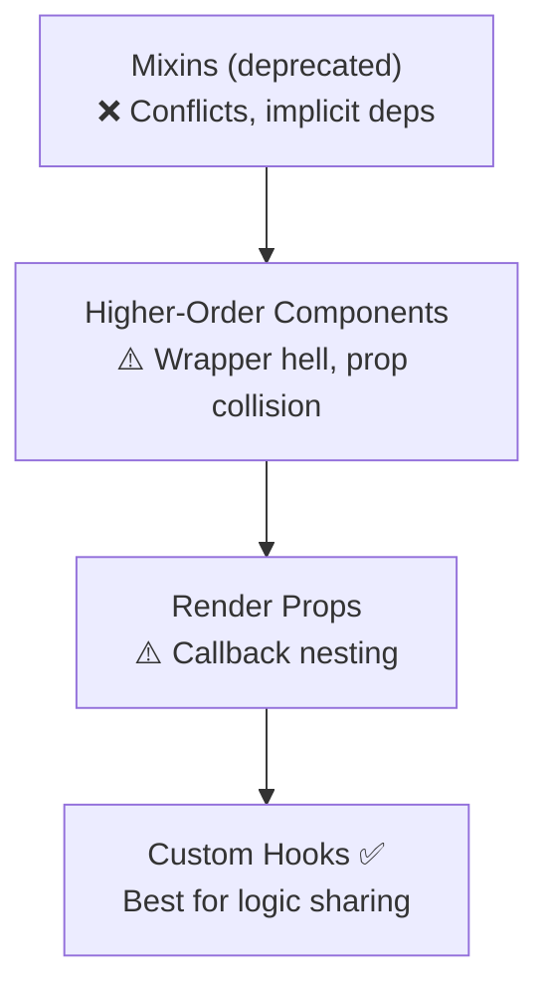

### 💡 WHY - React không dùng Inheritance?

| Inheritance Problems | Composition Solution     |
| -------------------- | ------------------------ |
| Tight coupling       | Loose, flexible          |
| "Is-A" forced        | "Has-A" or "Uses"        |
| Diamond problem      | No inheritance hierarchy |
| Hard to change       | Easy to swap components  |

> [!NOTE] > **React Team Quote:**
> "We have not found any use cases where we would recommend creating component inheritance hierarchies."

---

## 📊 Summary - React Mental Models

| Concept            | Mental Model                               |
| ------------------ | ------------------------------------------ |
| **UI = f(state)**  | Same state → Same UI, always               |
| **Virtual DOM**    | Fast JS diff → Minimal DOM updates         |
| **Reconciliation** | O(n) heuristics: type check + keys         |
| **Fiber**          | Interruptible, time-sliced rendering       |
| **Hooks**          | Closures + array by call order             |
| **State**          | Co-locate where possible, lift when needed |
| **Composition**    | Combine small parts, don't inherit         |

---

## 📖 Deep-Dive Resources

### React Ecosystem (10 files)

| Topic                   | This Module                                  | 📚 Deep-Dive Documents                                                                                                                                                                                         |
| ----------------------- | -------------------------------------------- | -------------------------------------------------------------------------------------------------------------------------------------------------------------------------------------------------------------- |
| **React Fundamentals**  | [Section 2](#2-core-principles---ui--fstate) | [01-react-fundamentals.md](../03-react/01-react-fundamentals.md), [03-react-fundamentals-theory.md](../17-frontend-theory/03-react-fundamentals-theory.md)                                                     |
| **React 19 Features**   | -                                            | [02-react-19-features.md](../03-react/02-react-19-features.md), [10-modern-react-features.md](../03-react/10-modern-react-features.md)                                                                         |
| **Hooks Deep Dive**     | [Section 6](#6-hooks-philosophy--internals)  | [03-hooks-deep-dive.md](../03-react/03-hooks-deep-dive.md), [07-hooks-comprehensive.md](../03-react/07-hooks-comprehensive.md), [04-react-hooks-advanced.md](../17-frontend-theory/04-react-hooks-advanced.md) |
| **Advanced Patterns**   | [Section 8](#8-component-composition)        | [04-advanced-patterns.md](../03-react/04-advanced-patterns.md), [08-react-patterns-advanced.md](../03-react/08-react-patterns-advanced.md)                                                                     |
| **State Management**    | [Section 7](#7-state-management-philosophy)  | [05-state-management.md](../03-react/05-state-management.md), [09-state-management-theory.md](../17-frontend-theory/09-state-management-theory.md)                                                             |
| **Virtual DOM & Fiber** | [Section 3-5](#3-virtual-dom-theory)         | [02-virtual-dom-reconciliation.md](../18-advanced-theory/02-virtual-dom-reconciliation.md)                                                                                                                     |
| **Performance**         | -                                            | [09-performance-optimization.md](../03-react/09-performance-optimization.md), [02-react-performance.md](../08-performance/02-react-performance.md)                                                             |
| **Testing**             | -                                            | [06-testing.md](../03-react/06-testing.md), [04-testing-tools.md](../13-tools-ecosystem/04-testing-tools.md)                                                                                                   |

### Practice & Interview

| Type                 | Documents                                                                         |
| -------------------- | --------------------------------------------------------------------------------- |
| **React Challenges** | [02-react-challenges.md](../11-interview-practice/02-react-challenges.md)         |
| **Visual Learning**  | [02-react-ecosystem-map.md](../12-visual-learning/02-algorithm-visualizations.md) |

---

## 🔗 Cross-References

| Topic                     | Related Module                                                           |
| ------------------------- | ------------------------------------------------------------------------ |
| Closures in Hooks         | [Module 1: Closures](./01-javascript-theory.md#3-closure---mental-model) |
| DOM Performance           | [Module 2: Browser Theory](./02-browser-theory.md)                       |
| State Management Patterns | [Module 6: Framework Patterns](./06-framework-patterns.md)               |

---

## 🔗 Navigation

| Prev                                     | Module                  | Next                                               |
| ---------------------------------------- | ----------------------- | -------------------------------------------------- |
| [Browser Theory](./02-browser-theory.md) | **3. React Philosophy** | [Architecture Theory](./04-architecture-theory.md) |

---

> _Tiếp theo: [Module 4: Web Architecture Theory](./04-architecture-theory.md)_
