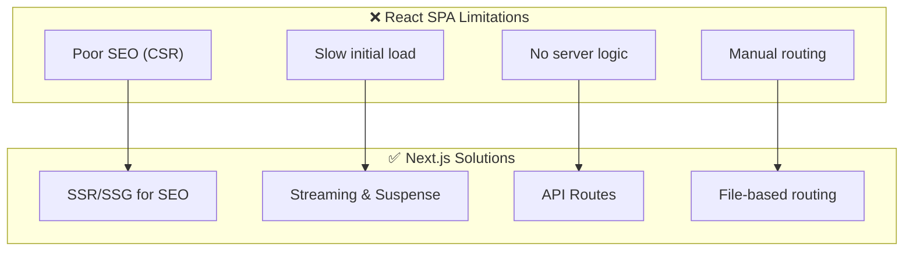
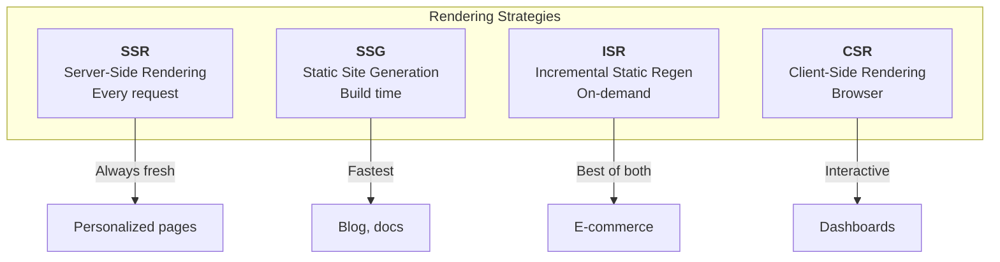
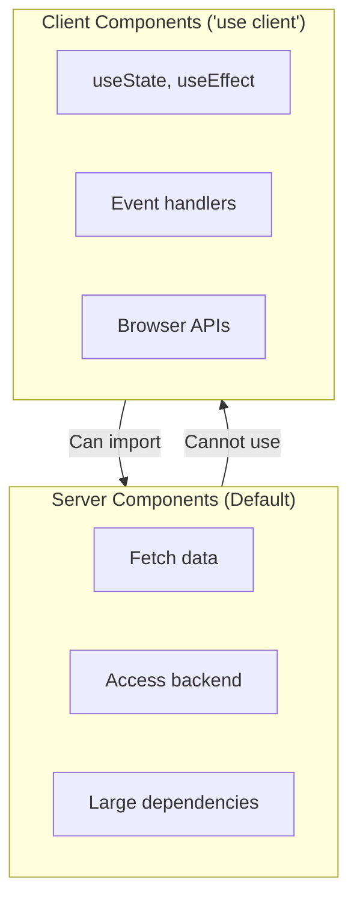
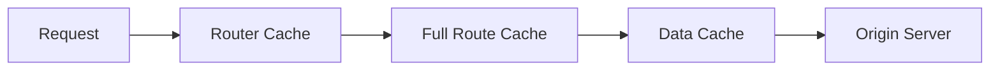

# 🚀 MODULE 5: NEXT.JS FULL-STACK

> **Focus**: 80% Theory - 20% Examples
>
> _Next.js = React Framework for Full-Stack Applications_
>
> **Phương pháp**: WHAT → WHY → HOW → WHEN

---

## 📋 Trong Module Này

1. [Next.js Philosophy](#1-nextjs-philosophy)
2. [Rendering Strategies](#2-rendering-strategies)
3. [App Router Architecture](#3-app-router-architecture)
4. [Server Components](#4-server-components)
5. [Data Fetching](#5-data-fetching)
6. [Caching & Revalidation](#6-caching--revalidation)
7. [API Routes](#7-api-routes)
8. [Middleware](#8-middleware)
9. [Deployment](#9-deployment)

---

## 1. Next.js Philosophy

### ❓ WHAT - Next.js là gì?

Next.js là **React Framework** cung cấp infrastructure cho full-stack applications với:

- Hybrid rendering (SSR, SSG, ISR, CSR)
- File-based routing
- API routes
- Built-in optimizations

### 💡 WHY - Tại sao cần Next.js?



### Next.js vs React Comparison

| Feature            | React (CRA)           | Next.js            |
| ------------------ | --------------------- | ------------------ |
| Rendering          | CSR only              | SSR, SSG, ISR, CSR |
| Routing            | Manual (React Router) | File-based         |
| SEO                | Poor                  | Excellent          |
| Backend            | Separate server       | API Routes         |
| Image Optimization | Manual                | Automatic          |
| Data Fetching      | Client-side           | Server + Client    |

---

## 2. Rendering Strategies

### 🔍 HOW - Các chiến lược render



### Decision Matrix

| Strategy | Time               | SEO     | Fresh Data   | Use Case            |
| -------- | ------------------ | ------- | ------------ | ------------------- |
| **SSG**  | Build              | ✅ Best | ❌ Stale     | Blogs, docs         |
| **ISR**  | Build + Revalidate | ✅      | ✅ Periodic  | E-commerce          |
| **SSR**  | Request            | ✅      | ✅ Real-time | User dashboards     |
| **CSR**  | Client             | ❌      | ✅           | Interactive widgets |

---

## 3. App Router Architecture

### File-Based Routing

```
app/
├── page.tsx                    → /
├── layout.tsx                  → Root layout
├── about/
│   └── page.tsx               → /about
├── blog/
│   ├── page.tsx               → /blog
│   └── [slug]/
│       └── page.tsx           → /blog/:slug
└── api/
    └── users/
        └── route.ts           → /api/users
```

### Special Files

| File            | Purpose        |
| --------------- | -------------- |
| `page.tsx`      | Route UI       |
| `layout.tsx`    | Shared layout  |
| `loading.tsx`   | Loading UI     |
| `error.tsx`     | Error boundary |
| `not-found.tsx` | 404 page       |
| `route.ts`      | API endpoint   |

---

## 4. Server Components

### ❓ WHAT - React Server Components (RSC)

Components render **on server only** - không gửi JavaScript đến client.

### 💡 WHY - Advantages

1. **Zero bundle size** - Code không gửi đến client
2. **Direct database access** - Fetch data trực tiếp
3. **Secure** - Secrets stay on server
4. **SEO friendly** - Full HTML gửi đến client

### Server vs Client Components



---

## 5. Data Fetching

### Server-Side Fetching (Recommended)

```typescript
// app/posts/page.tsx
async function getPosts() {
  const res = await fetch("https://api.example.com/posts", {
    next: { revalidate: 3600 }, // ISR: 1 hour
  });
  return res.json();
}

export default async function PostsPage() {
  const posts = await getPosts();

  return (
    <ul>
      {posts.map((post) => (
        <li key={post.id}>{post.title}</li>
      ))}
    </ul>
  );
}
```

### Caching Options

| Option                         | Behavior                   |
| ------------------------------ | -------------------------- |
| `{ cache: 'force-cache' }`     | SSG - Cache forever        |
| `{ cache: 'no-store' }`        | SSR - Always fresh         |
| `{ next: { revalidate: 60 } }` | ISR - Revalidate after 60s |

---

## 6. Caching & Revalidation

### Cache Hierarchy



### Revalidation Methods

1. **Time-based**: `revalidate: 60`
2. **On-demand**: `revalidatePath()`, `revalidateTag()`

---

## 7. API Routes

### Route Handlers

```typescript
// app/api/users/route.ts
export async function GET(request: Request) {
  const users = await db.user.findMany();
  return Response.json(users);
}

export async function POST(request: Request) {
  const body = await request.json();
  const user = await db.user.create({ data: body });
  return Response.json(user, { status: 201 });
}
```

---

## 8. Middleware

### Authentication Example

```typescript
// middleware.ts
import { NextResponse } from "next/server";
import type { NextRequest } from "next/server";

export function middleware(request: NextRequest) {
  const token = request.cookies.get("token");

  if (!token && request.nextUrl.pathname.startsWith("/dashboard")) {
    return NextResponse.redirect(new URL("/login", request.url));
  }

  return NextResponse.next();
}

export const config = {
  matcher: ["/dashboard/:path*"],
};
```

---

## 🔗 Deep-Dive Resources

| Topic        | Documents                                                                             |
| ------------ | ------------------------------------------------------------------------------------- |
| Fundamentals | [00-nextjs-fundamentals.md](../04-nextjs/00-nextjs-fundamentals.md)                   |
| App Router   | [01-app-router-server-components.md](../04-nextjs/01-app-router-server-components.md) |
| Architecture | [03-nextjs-architecture.md](../04-nextjs/03-nextjs-architecture.md)                   |

---

> _Tiếp theo: [Module 06: CSS & Visual Design](./06-css-visual-design.md)_
