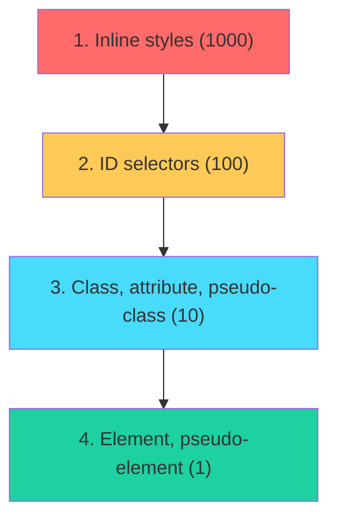
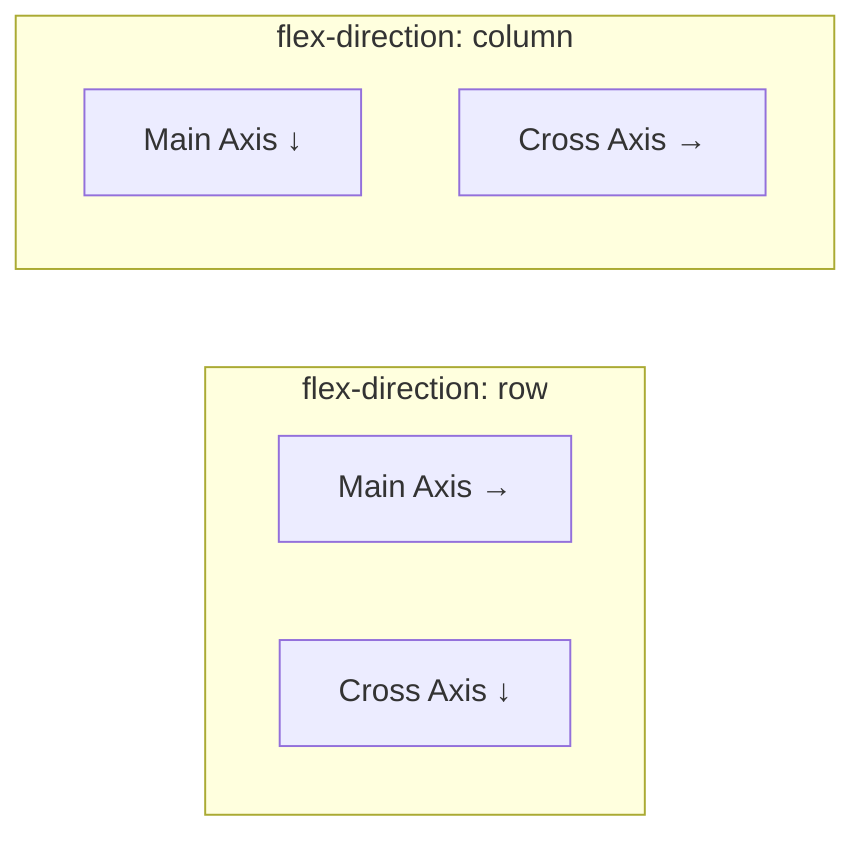
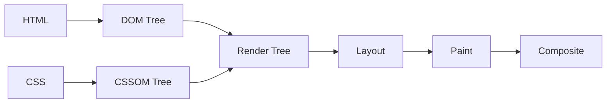

# 🎨 MODULE 6: CSS & VISUAL DESIGN

> **Focus**: 75% Theory - 25% Examples
>
> _CSS = Cascading Style Sheets - Phong cách trình bày_
>
> **Phương pháp**: WHAT → WHY → HOW → WHEN

---

## 📋 Trong Module Này

1. [CSS Fundamentals](#1-css-fundamentals)
2. [Box Model](#2-box-model)
3. [Flexbox](#3-flexbox)
4. [CSS Grid](#4-css-grid)
5. [Responsive Design](#5-responsive-design)
6. [Modern CSS Features](#6-modern-css-features)
7. [CSS Architecture](#7-css-architecture)
8. [Performance](#8-performance)

---

## 1. CSS Fundamentals

### ❓ WHAT - CSS là gì?

CSS điều khiển **presentation** của HTML elements - colors, layouts, fonts, spacing.

### 💡 WHY - Tại sao cần hiểu CSS sâu?

| Không hiểu CSS   | Hậu quả                         |
| ---------------- | ------------------------------- |
| Layout issues    | UI bị vỡ trên different screens |
| Specificity wars | `!important` everywhere         |
| Performance      | Layout thrashing, jank          |

### Specificity Hierarchy



---

## 2. Box Model

### Standard Box Model

```
┌─────────────────────────────────────────────┐
│              MARGIN                         │
│  ┌───────────────────────────────────────┐  │
│  │           BORDER                      │  │
│  │  ┌─────────────────────────────────┐  │  │
│  │  │         PADDING                 │  │  │
│  │  │  ┌───────────────────────────┐  │  │  │
│  │  │  │       CONTENT             │  │  │  │
│  │  │  │     width × height        │  │  │  │
│  │  │  └───────────────────────────┘  │  │  │
│  │  └─────────────────────────────────┘  │  │
│  └───────────────────────────────────────┘  │
└─────────────────────────────────────────────┘
```

### box-sizing

| Value                   | Calculation                        |
| ----------------------- | ---------------------------------- |
| `content-box` (default) | width = content only               |
| `border-box`            | width = content + padding + border |

```css
/* Best practice: Use border-box globally */
*,
*::before,
*::after {
  box-sizing: border-box;
}
```

---

## 3. Flexbox

### ❓ WHAT - Flexbox là gì?

**One-dimensional** layout method cho arranging items in rows OR columns.

### Main vs Cross Axis



### Key Properties

| Container Properties | Item Properties |
| -------------------- | --------------- |
| `flex-direction`     | `flex-grow`     |
| `justify-content`    | `flex-shrink`   |
| `align-items`        | `flex-basis`    |
| `flex-wrap`          | `align-self`    |
| `gap`                | `order`         |

---

## 4. CSS Grid

### ❓ WHAT - Grid là gì?

**Two-dimensional** layout system for complex layouts.

### Grid vs Flexbox

| Flexbox            | Grid                  |
| ------------------ | --------------------- |
| 1D (row OR column) | 2D (rows AND columns) |
| Content-first      | Layout-first          |
| Small components   | Page layouts          |

### Grid Template

```css
.container {
  display: grid;
  grid-template-columns: repeat(3, 1fr);
  grid-template-rows: auto 1fr auto;
  gap: 20px;
}

.header {
  grid-column: 1 / -1;
}
.sidebar {
  grid-row: 2 / 3;
}
.main {
  grid-column: 2 / 4;
}
```

---

## 5. Responsive Design

### Mobile-First Strategy

```css
/* Mobile (default) */
.container {
  padding: 16px;
}

/* Tablet */
@media (min-width: 768px) {
  .container {
    padding: 24px;
  }
}

/* Desktop */
@media (min-width: 1024px) {
  .container {
    padding: 32px;
    max-width: 1200px;
    margin: 0 auto;
  }
}
```

### Common Breakpoints

| Device  | Breakpoint     |
| ------- | -------------- |
| Mobile  | < 640px        |
| Tablet  | 640px - 1024px |
| Desktop | > 1024px       |

---

## 6. Modern CSS Features

### CSS Variables

```css
:root {
  --primary: #007bff;
  --spacing-sm: 8px;
  --spacing-md: 16px;
}

.button {
  background: var(--primary);
  padding: var(--spacing-sm) var(--spacing-md);
}
```

### Container Queries

```css
.card {
  container-type: inline-size;
}

@container (min-width: 400px) {
  .card-content {
    display: flex;
  }
}
```

### New Features (2024)

- `:has()` parent selector
- `@layer` cascade layers
- `subgrid`
- `color-mix()`
- Container queries

---

## 7. CSS Architecture

### BEM Methodology

```css
/* Block__Element--Modifier */
.card {
}
.card__title {
}
.card__button--primary {
}
```

### CSS-in-JS vs CSS Modules

| Approach          | Pros                | Cons           |
| ----------------- | ------------------- | -------------- |
| CSS Modules       | Scoped, no runtime  | Separate files |
| styled-components | Co-located, dynamic | Runtime cost   |
| Tailwind          | Utility-first, fast | HTML cluttered |

---

## 8. Performance

### Critical Rendering Path



### Performance Tips

1. **Avoid layout thrashing** - Batch DOM reads/writes
2. **Use `transform` over `top/left`** - GPU accelerated
3. **Minimize reflows** - Avoid animating width/height
4. **Contain layouts** - Use `contain: layout`

---

## 🔗 Deep-Dive Resources

| Topic           | Documents                                                                |
| --------------- | ------------------------------------------------------------------------ |
| Fundamentals    | [00-css-fundamentals.md](../07-css/00-css-fundamentals.md)               |
| Grid & Flexbox  | [05-css-grid-flexbox-theory.md](../07-css/05-css-grid-flexbox-theory.md) |
| Architecture    | [07-css-architecture-theory.md](../07-css/07-css-architecture-theory.md) |
| Modern Features | [06-modern-css-features.md](../07-css/06-modern-css-features.md)         |

---

> _Tiếp theo: [Module 07: Performance Engineering](./07-performance.md)_
