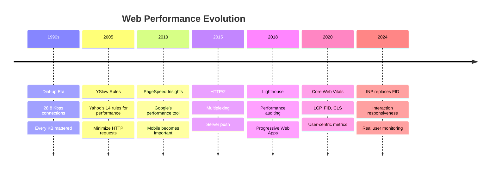
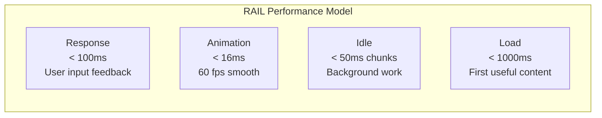
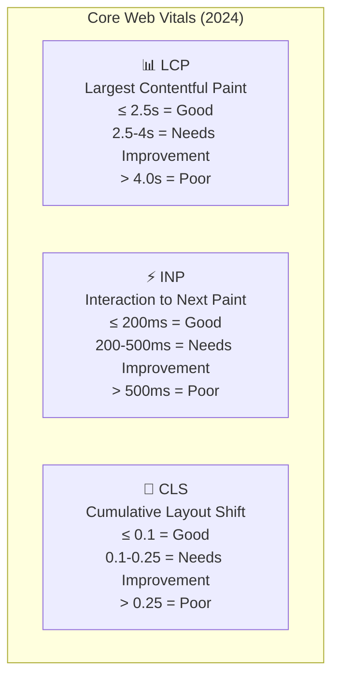
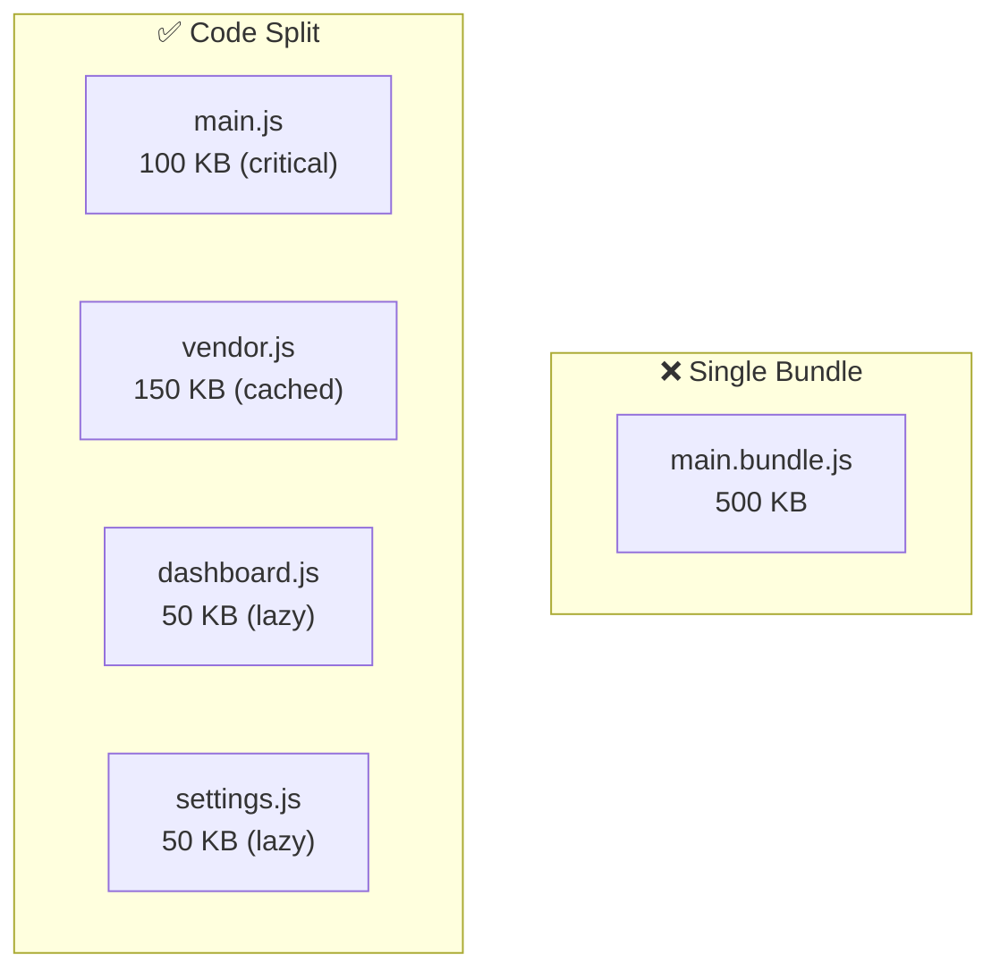
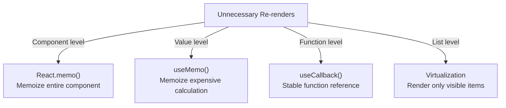
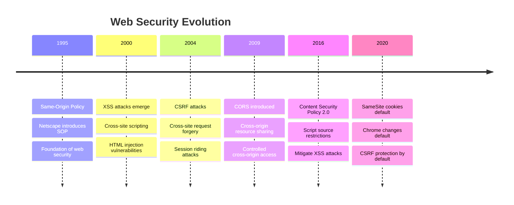

# ⚡ MODULE 7: PERFORMANCE & SECURITY

> **Focus**: 95% Theory - 5% Techniques
>
> _Hiểu nguyên lý để optimize và bảo mật đúng cách_
>
> **Phương pháp**: WHAT → WHY → HOW → WHEN

---

## 📋 Trong Module Này

1. [Performance Theory & History](#1-performance-theory--history)
2. [Core Web Vitals Deep Dive](#2-core-web-vitals-deep-dive)
3. [Bundle Optimization Theory](#3-bundle-optimization-theory)
4. [Runtime Performance](#4-runtime-performance)
5. [Memory Management](#5-memory-management)
6. [Security Fundamentals](#6-security-fundamentals)
7. [Common Vulnerabilities](#7-common-vulnerabilities)
8. [Security Headers & Best Practices](#8-security-headers--best-practices)

---

## 1. Performance Theory & History

### 📜 Lịch Sử Web Performance



### ❓ WHAT - RAIL Model

Google's **RAIL** model defines performance goals based on user perception:



### 💡 WHY - User Perception Science

```
┌────────────────────────────────────────────────────────────┐
│  HUMAN PERCEPTION OF DELAYS                                │
│  (Based on cognitive psychology research)                  │
│                                                            │
│  0-100ms    → INSTANT                                      │
│               Brain perceives as immediate response        │
│               Goal for all user interactions               │
│                                                            │
│  100-300ms  → SLIGHT DELAY                                 │
│               Noticeable but acceptable                    │
│               User stays focused on task                   │
│                                                            │
│  300-1000ms → PERCEPTIBLE DELAY                            │
│               User notices waiting                         │
│               May need loading indicator                   │
│                                                            │
│  1000ms+    → CONTEXT SWITCH                               │
│               User's mind wanders                          │
│               Loses flow state                             │
│                                                            │
│  10000ms+   → ABANDONMENT                                  │
│               User likely gives up                         │
│               53% mobile users leave after 3s              │
│                                                            │
│  💡 Goal: Keep interactions under 100ms                    │
│     Use loading states above 300ms                        │
└────────────────────────────────────────────────────────────┘
```

### Performance Budget

```
┌────────────────────────────────────────────────────────────┐
│  PERFORMANCE BUDGET CONCEPT                                │
│                                                            │
│  A performance budget is a set of limits on metrics       │
│  that affect user experience                               │
│                                                            │
│  EXAMPLE BUDGET:                                           │
│  ┌─────────────────────────────────────────────────────┐  │
│  │ Metric              │ Budget    │ Current │ Status  │  │
│  ├─────────────────────┼───────────┼─────────┼─────────┤  │
│  │ JS Bundle (gzip)    │ < 170 KB  │ 145 KB  │ ✅      │  │
│  │ CSS Bundle (gzip)   │ < 30 KB   │ 28 KB   │ ✅      │  │
│  │ Images total        │ < 500 KB  │ 620 KB  │ ❌      │  │
│  │ LCP                 │ < 2.5s    │ 2.1s    │ ✅      │  │
│  │ Time to Interactive │ < 3.8s    │ 4.2s    │ ❌      │  │
│  └─────────────────────┴───────────┴─────────┴─────────┘  │
│                                                            │
│  WHY BUDGET:                                               │
│  • Prevents gradual performance regression                 │
│  • Makes performance a first-class concern                 │
│  • Enables automated CI/CD checks                          │
└────────────────────────────────────────────────────────────┘
```

---

## 2. Core Web Vitals Deep Dive

### ❓ WHAT - The Three Metrics



### LCP Deep Dive

```
┌────────────────────────────────────────────────────────────┐
│  LCP = Render time of the largest visible element          │
│                                                            │
│  WHAT COUNTS AS LCP ELEMENT:                               │
│  •  elements                                          │
│  • <image> inside <svg>                                    │
│  • <video> poster image                                    │
│  • Element with background-image via CSS                   │
│  • Block-level elements with text nodes                    │
│                                                            │
│  LCP TIMELINE:                                             │
│  ┌──────────────────────────────────────────────────────┐ │
│  │ Request ──► TTFB ──► FCP ──► LCP                     │ │
│  │    │         │        │       │                       │ │
│  │  0ms      100ms    500ms   2000ms                    │ │
│  └──────────────────────────────────────────────────────┘ │
│                                                            │
│  ROOT CAUSES OF SLOW LCP:                                  │
│  1. Slow TTFB (server response time)                      │
│  2. Render-blocking CSS/JS                                │
│  3. Slow resource loading (images, fonts)                 │
│  4. Client-side rendering delay                           │
│                                                            │
│  OPTIMIZATION STRATEGIES:                                  │
│  ✓ Use SSR/SSG for critical content                       │
│  ✓ Preload LCP image: <link rel="preload" as="image">    │
│  ✓ Optimize images: WebP, responsive, CDN                │
│  ✓ Inline critical CSS                                    │
│  ✓ Remove render-blocking resources                       │
└────────────────────────────────────────────────────────────┘
```

### INP Deep Dive

```
┌────────────────────────────────────────────────────────────┐
│  INP = Responsiveness to user interactions                 │
│  (Replaced FID in March 2024)                              │
│                                                            │
│  WHY INP REPLACED FID:                                     │
│  FID only measured FIRST interaction                       │
│  INP measures ALL interactions throughout page lifecycle  │
│  More representative of real user experience              │
│                                                            │
│  INTERACTION PHASES:                                       │
│  ┌─────────────────────────────────────────────────────┐  │
│  │ User clicks ──► Input Delay ──► Processing ──► Paint │  │
│  │                    │              │             │      │  │
│  │               (JS blocking)   (Handler)    (Render)   │  │
│  └─────────────────────────────────────────────────────┘  │
│                                                            │
│  ROOT CAUSES OF SLOW INP:                                  │
│  1. Long JavaScript tasks (> 50ms)                        │
│  2. Heavy main thread work during interaction             │
│  3. Large DOM tree (slow updates)                         │
│  4. Too many event handlers                               │
│                                                            │
│  OPTIMIZATION STRATEGIES:                                  │
│  ✓ Break long tasks: setTimeout, scheduler.yield()       │
│  ✓ Use Web Workers for heavy computation                  │
│  ✓ Defer non-critical JavaScript                          │
│  ✓ Virtualize long lists                                  │
│  ✓ useTransition for non-urgent updates                   │
└────────────────────────────────────────────────────────────┘
```

### CLS Deep Dive

```
┌────────────────────────────────────────────────────────────┐
│  CLS = Visual stability score                              │
│                                                            │
│  FORMULA:                                                  │
│  Layout Shift Score = Impact Fraction × Distance Fraction │
│                                                            │
│  Impact Fraction: % of viewport affected by shift         │
│  Distance Fraction: How far elements moved (% of viewport)│
│                                                            │
│  ROOT CAUSES OF HIGH CLS:                                  │
│  1. Images without dimensions                              │
│  2. Ads, embeds, iframes without reserved space           │
│  3. Dynamically injected content above viewport           │
│  4. Web fonts causing FOUT (Flash of Unstyled Text)       │
│  5. Animations using top/left instead of transform        │
│                                                            │
│  OPTIMIZATION STRATEGIES:                                  │
│  ✓ Always set width/height on images                      │
│  ✓ Use aspect-ratio CSS property                          │
│  ✓ Reserve space for dynamic content                      │
│  ✓ Use font-display: swap with size-adjust               │
│  ✓ Add new content below viewport                         │
│  ✓ Animate with transform, not position properties       │
└────────────────────────────────────────────────────────────┘
```

---

## 3. Bundle Optimization Theory

### Tree Shaking Theory

```
┌────────────────────────────────────────────────────────────┐
│  TREE SHAKING = Dead Code Elimination                      │
│                                                            │
│  ANALOGY:                                                  │
│  Imagine a tree where each branch is a module             │
│  Shaking the tree drops the dead (unused) branches        │
│                                                            │
│  HOW IT WORKS:                                             │
│  1. Bundler builds module dependency graph                │
│  2. Analyzes which exports are actually imported          │
│  3. Marks unreachable code as "dead"                       │
│  4. Removes dead code from final bundle                    │
│                                                            │
│  REQUIREMENTS FOR TREE SHAKING:                            │
│                                                            │
│  ✓ ES Modules (import/export)                             │
│    Static structure, analyzable at compile time          │
│                                                            │
│  ✗ CommonJS (require)                                     │
│    Dynamic, can't determine at compile time               │
│                                                            │
│  ✓ "sideEffects": false in package.json                   │
│    Tells bundler module has no side effects              │
│                                                            │
│  ✗ Side effects in module scope                           │
│    Code that runs on import can't be removed             │
└────────────────────────────────────────────────────────────┘
```

### Code Splitting Strategies



```
┌────────────────────────────────────────────────────────────┐
│  CODE SPLITTING STRATEGIES                                 │
│                                                            │
│  1. ROUTE-BASED SPLITTING                                  │
│     Each page loads only its own code                     │
│     React.lazy(() => import('./Dashboard'))               │
│     Most common and effective strategy                    │
│                                                            │
│  2. COMPONENT-BASED SPLITTING                              │
│     Heavy components loaded on demand                     │
│     Example: Chart library, rich text editor              │
│     Load on visibility or interaction                     │
│                                                            │
│  3. VENDOR SPLITTING                                       │
│     Separate third-party code                             │
│     Better caching (vendors change less often)            │
│     Webpack splitChunks configuration                     │
│                                                            │
│  4. CONDITIONAL SPLITTING                                  │
│     Load based on feature flags or user role              │
│     Admin features only for admins                        │
└────────────────────────────────────────────────────────────┘
```

---

## 4. Runtime Performance

### React Re-render Optimization



### 💡 WHY - When to Optimize

```
┌────────────────────────────────────────────────────────────┐
│  THE OPTIMIZATION DECISION FRAMEWORK                       │
│                                                            │
│  ⚠️ "Premature optimization is the root of all evil"      │
│                          — Donald Knuth                    │
│                                                            │
│  STEP 1: MEASURE FIRST                                     │
│  • Use React DevTools Profiler                            │
│  • Identify which components re-render excessively        │
│  • Check if re-renders actually cause lag                 │
│                                                            │
│  STEP 2: DECIDE IF OPTIMIZATION NEEDED                     │
│                                                            │
│  ✅ OPTIMIZE WHEN:                                         │
│  • Profiler shows expensive re-renders (> 16ms)           │
│  • User experiences noticeable lag (> 100ms)              │
│  • Large lists (100+ items)                               │
│  • Complex computations on every render                   │
│                                                            │
│  ❌ DON'T OPTIMIZE:                                        │
│  • Component renders fast anyway (< 1ms)                  │
│  • Props/state change rarely                               │
│  • "Just in case" optimization                             │
│  • Without measuring first                                 │
│                                                            │
│  STEP 3: CHOOSE RIGHT TOOL                                 │
│  • React.memo: Prevent child re-renders                   │
│  • useMemo: Cache expensive calculations                  │
│  • useCallback: Stabilize function props                  │
│  • useTransition: Mark updates as non-urgent              │
└────────────────────────────────────────────────────────────┘
```

---

## 5. Memory Management

### JavaScript Memory Model

```
┌────────────────────────────────────────────────────────────┐
│  JAVASCRIPT MEMORY MODEL                                   │
│                                                            │
│  ┌─────────────────────────────────────────────────────┐  │
│  │  STACK (Primitives)        │  HEAP (Objects)        │  │
│  │  - Fast access             │  - Dynamic allocation  │  │
│  │  - Fixed size              │  - Garbage collected   │  │
│  │  - LIFO                    │  - Reference accessed  │  │
│  │                            │                         │  │
│  │  let x = 5;                │  let obj = { a: 1 };   │  │
│  │  ┌───┐                     │  ┌───────────────┐     │  │
│  │  │ 5 │                     │  │ { a: 1 }      │     │  │
│  │  └───┘                     │  └───────────────┘     │  │
│  │                            │        ↑               │  │
│  │                            │     reference          │  │
│  └─────────────────────────────────────────────────────┘  │
│                                                            │
│  GARBAGE COLLECTION:                                       │
│  • Mark-and-Sweep algorithm                               │
│  • Marks reachable objects starting from roots            │
│  • Sweeps (frees) unmarked objects                        │
│  • V8 uses generational GC (young/old generations)       │
└────────────────────────────────────────────────────────────┘
```

### Memory Leak Prevention

```
┌────────────────────────────────────────────────────────────┐
│  COMMON MEMORY LEAKS IN REACT                              │
│                                                            │
│  1. EVENT LISTENERS NOT CLEANED UP                         │
│     ❌ useEffect(() => {                                   │
│          window.addEventListener('resize', handler);       │
│        }); // No cleanup!                                  │
│                                                            │
│     ✅ useEffect(() => {                                   │
│          window.addEventListener('resize', handler);       │
│          return () => window.removeEventListener(...);    │
│        }, []);                                             │
│                                                            │
│  2. TIMERS NOT CLEARED                                     │
│     ❌ useEffect(() => {                                   │
│          setInterval(tick, 1000); // Leaks!               │
│        }, []);                                             │
│                                                            │
│     ✅ useEffect(() => {                                   │
│          const id = setInterval(tick, 1000);              │
│          return () => clearInterval(id);                  │
│        }, []);                                             │
│                                                            │
│  3. SUBSCRIPTIONS NOT UNSUBSCRIBED                         │
│     ❌ useEffect(() => {                                   │
│          observable.subscribe(handler);                    │
│        }, []);                                             │
│                                                            │
│     ✅ useEffect(() => {                                   │
│          const sub = observable.subscribe(handler);       │
│          return () => sub.unsubscribe();                  │
│        }, []);                                             │
│                                                            │
│  4. CLOSURES CAPTURING LARGE OBJECTS                       │
│     Avoid capturing large arrays/objects in closures      │
│     They can't be garbage collected while closure exists  │
└────────────────────────────────────────────────────────────┘
```

---

## 6. Security Fundamentals

### 📜 Web Security History



### Same-Origin Policy

```
┌────────────────────────────────────────────────────────────┐
│  SAME-ORIGIN POLICY (SOP)                                  │
│                                                            │
│  DEFINITION:                                               │
│  Origin = Protocol + Domain + Port                        │
│  https://example.com:443                                  │
│                                                            │
│  SAME ORIGIN EXAMPLES:                                     │
│  https://example.com/page1  ⟷  https://example.com/page2 │
│  ✅ Same origin (path doesn't matter)                     │
│                                                            │
│  DIFFERENT ORIGIN EXAMPLES:                                │
│  https://example.com  ⟷  http://example.com               │
│  ❌ Different protocol                                     │
│                                                            │
│  https://example.com  ⟷  https://example.com:8080         │
│  ❌ Different port                                         │
│                                                            │
│  https://example.com  ⟷  https://api.example.com          │
│  ❌ Different subdomain (subdomain = different origin)    │
│                                                            │
│  WHAT SOP PROTECTS:                                        │
│  • DOM access (can't read another origin's DOM)           │
│  • Cookies (can't access another origin's cookies)        │
│  • AJAX requests (can't make cross-origin requests)       │
│                                                            │
│  💡 SOP is the FOUNDATION of web security                  │
└────────────────────────────────────────────────────────────┘
```

### CORS Explained

```
┌────────────────────────────────────────────────────────────┐
│  CORS = Cross-Origin Resource Sharing                      │
│                                                            │
│  PROBLEM: SOP blocks legitimate cross-origin requests     │
│  SOLUTION: Server explicitly allows certain origins        │
│                                                            │
│  SIMPLE REQUEST FLOW:                                      │
│  ┌──────────┐                          ┌──────────┐       │
│  │ Browser  │ ──── GET /api/data ───→  │ Server   │       │
│  │          │      Origin: site.com    │          │       │
│  │          │ ←─── Response ─────────  │          │       │
│  │          │      Access-Control-     │          │       │
│  │          │      Allow-Origin:       │          │       │
│  │          │      site.com            │          │       │
│  └──────────┘                          └──────────┘       │
│                                                            │
│  PREFLIGHT REQUEST (Complex requests):                     │
│  ┌──────────┐                          ┌──────────┐       │
│  │ Browser  │ ──── OPTIONS /api ────→  │ Server   │       │
│  │          │      (Preflight check)   │          │       │
│  │          │ ←─── 200 OK ───────────  │          │       │
│  │          │      (Allowed methods)   │          │       │
│  │          │ ──── POST /api ────────→ │          │       │
│  │          │      (Actual request)    │          │       │
│  └──────────┘                          └──────────┘       │
│                                                            │
│  💡 IMPORTANT:                                             │
│  CORS is BROWSER-enforced, not server protection!         │
│  curl and Postman ignore CORS completely                  │
│  CORS only prevents BROWSER from reading response         │
└────────────────────────────────────────────────────────────┘
```

---

## 7. Common Vulnerabilities

### XSS (Cross-Site Scripting)

```
┌────────────────────────────────────────────────────────────┐
│  XSS = Injecting malicious scripts into trusted sites     │
│                                                            │
│  THREE TYPES:                                              │
│                                                            │
│  1. STORED XSS (Persistent)                                │
│     Malicious script saved in database                     │
│     Served to all users who view page                     │
│     Most dangerous type                                    │
│     Example: Comment with <script>alert()</script>        │
│                                                            │
│  2. REFLECTED XSS                                          │
│     Script in URL, reflected back in page                 │
│     Requires user to click malicious link                 │
│     Example: search.php?q=<script>alert()</script>        │
│                                                            │
│  3. DOM-BASED XSS                                          │
│     Script manipulates DOM directly                        │
│     Never hits server                                      │
│     Example: page.html#<script>alert()</script>           │
│                                                            │
│  ATTACK CONSEQUENCES:                                      │
│  • Steal cookies/session tokens                           │
│  • Redirect to phishing sites                             │
│  • Modify page content (fake login forms)                 │
│  • Capture keystrokes                                     │
│                                                            │
│  PREVENTION:                                               │
│  ✓ React auto-escapes by default (safe!)                 │
│  ✓ Never use dangerouslySetInnerHTML with user input     │
│  ✓ Sanitize with DOMPurify if needed                     │
│  ✓ Use Content-Security-Policy header                    │
│  ✓ textContent instead of innerHTML                      │
└────────────────────────────────────────────────────────────┘
```

### CSRF (Cross-Site Request Forgery)

```
┌────────────────────────────────────────────────────────────┐
│  CSRF = Tricking user's browser into making requests      │
│                                                            │
│  ATTACK FLOW:                                              │
│  1. User logs into bank.com (has session cookie)          │
│  2. User visits evil.com (in another tab)                 │
│  3. evil.com has:  │
│  4. Browser sends request with bank.com cookies!          │
│  5. Bank thinks it's legitimate request from user         │
│                                                            │
│  WHY IT WORKS:                                             │
│  • Cookies sent automatically with every request          │
│  • Browser doesn't know request was initiated by attacker│
│  • Server can't distinguish legitimate from forged request│
│                                                            │
│  PREVENTION:                                               │
│                                                            │
│  1. CSRF TOKENS                                            │
│     Include random token in every form                    │
│     Server validates token matches session                │
│     Attacker can't guess the token                        │
│                                                            │
│  2. SAMESITE COOKIES                                       │
│     SameSite=Strict: Never sent cross-site               │
│     SameSite=Lax: Sent for top-level navigations         │
│     SameSite=None: Sent always (requires Secure)         │
│                                                            │
│  3. CHECK ORIGIN/REFERER HEADERS                           │
│     Verify request came from your domain                  │
│     But headers can sometimes be stripped                 │
└────────────────────────────────────────────────────────────┘
```

---

## 8. Security Headers & Best Practices

### Essential Security Headers

| Header                        | Purpose                   | Example                           |
| ----------------------------- | ------------------------- | --------------------------------- |
| **Content-Security-Policy**   | Control allowed resources | `default-src 'self'`              |
| **X-Frame-Options**           | Prevent clickjacking      | `DENY` or `SAMEORIGIN`            |
| **X-Content-Type-Options**    | Prevent MIME sniffing     | `nosniff`                         |
| **Strict-Transport-Security** | Force HTTPS               | `max-age=31536000`                |
| **X-XSS-Protection**          | Legacy XSS filter         | `1; mode=block`                   |
| **Referrer-Policy**           | Control referrer info     | `strict-origin-when-cross-origin` |

### Content Security Policy Deep Dive

```
┌────────────────────────────────────────────────────────────┐
│  CONTENT SECURITY POLICY (CSP)                             │
│                                                            │
│  CSP = Whitelist of allowed content sources               │
│                                                            │
│  EXAMPLE:                                                  │
│  Content-Security-Policy:                                  │
│    default-src 'self';                                    │
│    script-src 'self' https://cdn.example.com;             │
│    style-src 'self' 'unsafe-inline';                      │
│    img-src *;                                              │
│    connect-src 'self' https://api.example.com;            │
│                                                            │
│  DIRECTIVES:                                               │
│  • default-src: Fallback for all resource types           │
│  • script-src: JavaScript sources                         │
│  • style-src: CSS sources                                 │
│  • img-src: Image sources                                 │
│  • connect-src: AJAX/fetch destinations                   │
│  • frame-src: iframe sources                              │
│  • font-src: Font file sources                            │
│                                                            │
│  💡 CSP effectively prevents XSS by blocking              │
│     unauthorized scripts from executing                   │
└────────────────────────────────────────────────────────────┘
```

---

## 📊 Summary

| Category   | Key Points                         |
| ---------- | ---------------------------------- |
| **RAIL**   | Response < 100ms, Animation < 16ms |
| **LCP**    | SSR, preload, optimize images      |
| **INP**    | Break long tasks, Web Workers      |
| **CLS**    | Reserve space, dimensions          |
| **Bundle** | Tree shake, code split, lazy load  |
| **Memory** | Clean up effects, avoid capturing  |
| **XSS**    | React escapes, CSP, sanitize       |
| **CSRF**   | Tokens, SameSite cookies           |

---

## 🔗 Cross-References

| Topic              | Related Module                                               |
| ------------------ | ------------------------------------------------------------ |
| Browser Rendering  | [Module 2: Browser Theory](./02-browser-theory.md)           |
| React Optimization | [Module 3: React Philosophy](./03-react-philosophy.md)       |
| Architecture       | [Module 4: Architecture Theory](./04-architecture-theory.md) |

---

## 🔗 Navigation

| Prev                                             | Module                        | Next                                       |
| ------------------------------------------------ | ----------------------------- | ------------------------------------------ |
| [Framework Patterns](./06-framework-patterns.md) | **7. Performance & Security** | [Testing & DevOps](./08-testing-devops.md) |

---

> _Tiếp theo: [Module 8: Testing & DevOps](./08-testing-devops.md)_
