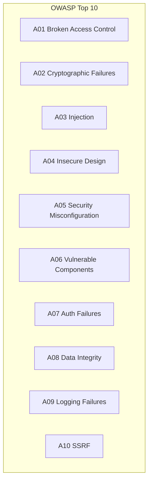
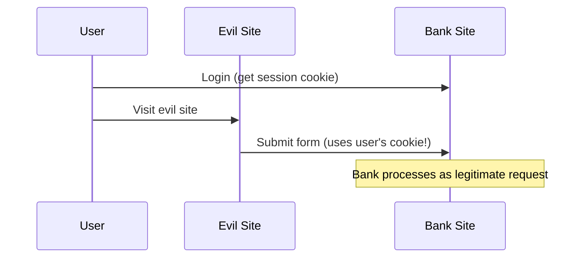

# 🔒 MODULE 8: SECURITY BEST PRACTICES

> **Focus**: 85% Theory - 15% Examples
>
> _Security = Protecting data, users, and systems_
>
> **Phương pháp**: WHAT → WHY → HOW → WHEN

---

## 📋 Trong Module Này

1. [OWASP Top 10 Overview](#1-owasp-top-10)
2. [XSS - Cross-Site Scripting](#2-xss)
3. [CSRF - Cross-Site Request Forgery](#3-csrf)
4. [SQL Injection](#4-sql-injection)
5. [Authentication Security](#5-authentication)
6. [CORS & CSP](#6-cors--csp)
7. [Secure Headers](#7-secure-headers)
8. [Best Practices Checklist](#8-best-practices)

---

## 1. OWASP Top 10

### Web Security Vulnerabilities (2021)



---

## 2. XSS

### ❓ WHAT - XSS là gì?

**Cross-Site Scripting** - Attacker inject malicious scripts vào trusted websites.

### Types of XSS

| Type          | Storage  | Example                 |
| ------------- | -------- | ----------------------- |
| **Stored**    | Database | Comment với `<script>`  |
| **Reflected** | URL      | URL với malicious query |
| **DOM-based** | Client   | Direct DOM manipulation |

### Prevention

```typescript
// ✅ React auto-escapes by default
function Safe({ userInput }) {
  return <div>{userInput}</div>; // Safe
}

// ❌ dangerouslySetInnerHTML = XSS risk
function Dangerous({ html }) {
  return <div dangerouslySetInnerHTML={{ __html: html }} />;
}

// ✅ If HTML needed, sanitize first
import DOMPurify from "dompurify";

function SafeHTML({ html }) {
  return (
    <div
      dangerouslySetInnerHTML={{
        __html: DOMPurify.sanitize(html),
      }}
    />
  );
}
```

---

## 3. CSRF

### ❓ WHAT - CSRF là gì?

**Cross-Site Request Forgery** - Tricking users vào performing unwanted actions.

### Attack Flow



### Prevention

1. **CSRF Tokens** - Unique token per session
2. **SameSite Cookies** - `SameSite=Strict`
3. **Custom Headers** - `X-Requested-With`

```typescript
// Cookie settings
res.setHeader("Set-Cookie", ["session=abc; HttpOnly; Secure; SameSite=Strict"]);
```

---

## 4. SQL Injection

### ❌ Vulnerable

```typescript
// ❌ String concatenation = SQL injection risk
const query = `SELECT * FROM users WHERE id = '${userId}'`;
```

### ✅ Prevention

```typescript
// ✅ Parameterized queries
const result = await db.query("SELECT * FROM users WHERE id = $1", [userId]);

// ✅ ORM (Prisma)
const user = await prisma.user.findUnique({
  where: { id: userId },
});
```

---

## 5. Authentication

### Password Security

| Practice          | Description                 |
| ----------------- | --------------------------- |
| **Hashing**       | Use bcrypt or Argon2        |
| **Salting**       | Unique salt per password    |
| **Rate Limiting** | Prevent brute force         |
| **MFA**           | Multi-factor authentication |

```typescript
import bcrypt from "bcryptjs";

// Hash password (registration)
const hash = await bcrypt.hash(password, 12);

// Verify password (login)
const valid = await bcrypt.compare(password, hash);
```

### Session Security

```typescript
// Secure session cookie
res.setHeader("Set-Cookie", [
  "session=token; HttpOnly; Secure; SameSite=Strict; Max-Age=3600",
]);
```

---

## 6. CORS & CSP

### CORS - Cross-Origin Resource Sharing

```typescript
// Next.js API route
export async function GET(request: Request) {
  return new Response(JSON.stringify(data), {
    headers: {
      "Access-Control-Allow-Origin": "https://trusted.com",
      "Access-Control-Allow-Methods": "GET, POST",
      "Access-Control-Allow-Headers": "Content-Type",
    },
  });
}
```

### CSP - Content Security Policy

```typescript
// Restrict what resources can load
const csp = [
  "default-src 'self'",
  "script-src 'self'",
  "style-src 'self' 'unsafe-inline'",
  "img-src 'self' data: https:",
  "connect-src 'self' https://api.example.com",
].join("; ");
```

---

## 7. Secure Headers

### Essential Security Headers

| Header                      | Purpose               |
| --------------------------- | --------------------- |
| `Content-Security-Policy`   | Prevent XSS           |
| `X-Frame-Options`           | Prevent clickjacking  |
| `X-Content-Type-Options`    | Prevent MIME sniffing |
| `Strict-Transport-Security` | Force HTTPS           |
| `X-XSS-Protection`          | XSS filter            |

```typescript
// next.config.js
module.exports = {
  async headers() {
    return [
      {
        source: "/(.*)",
        headers: [
          { key: "X-Frame-Options", value: "DENY" },
          { key: "X-Content-Type-Options", value: "nosniff" },
          { key: "X-XSS-Protection", value: "1; mode=block" },
          { key: "Strict-Transport-Security", value: "max-age=31536000" },
        ],
      },
    ];
  },
};
```

---

## 8. Best Practices

### Security Checklist

✅ **Input Validation**

- Validate all user input
- Use whitelist over blacklist
- Sanitize before output

✅ **Authentication**

- Strong password requirements
- Secure password storage (bcrypt)
- Session management
- Rate limiting

✅ **Authorization**

- Verify permissions server-side
- Principle of least privilege
- RBAC or ABAC

✅ **Data Protection**

- HTTPS everywhere
- Encrypt sensitive data
- HttpOnly, Secure cookies

✅ **Error Handling**

- Generic error messages
- Log errors server-side
- Never expose stack traces

---

## 🔗 Deep-Dive Resources

| Topic           | Documents                                                                           |
| --------------- | ----------------------------------------------------------------------------------- |
| Vulnerabilities | [01-common-vulnerabilities.md](../05-security/01-common-vulnerabilities.md)         |
| Web Security    | [03-web-security-comprehensive.md](../05-security/03-web-security-comprehensive.md) |
| Architecture    | [03-security-architecture.md](../19-expert-topics/03-security-architecture.md)      |

---

> _Tiếp theo: [Module 09: System Design & Architecture](./09-system-design.md)_
