# 🏛️ MODULE 4: WEB ARCHITECTURE THEORY

> **Focus**: 90% Theory - 10% Diagrams
>
> _Hiểu cách thiết kế hệ thống Frontend scale_
>
> **Phương pháp**: WHAT → WHY → HOW → WHEN

---

## 📋 Trong Module Này

1. [Lịch Sử Web Architecture](#1-lịch-sử-web-architecture)
2. [SPA vs MPA vs Hybrid](#2-spa-vs-mpa-vs-hybrid)
3. [Rendering Strategies Deep Dive](#3-rendering-strategies-deep-dive)
4. [Software Architecture Principles](#4-software-architecture-principles)
5. [Micro-frontends Philosophy](#5-micro-frontends-philosophy)
6. [API Design Theory](#6-api-design-theory)
7. [Caching Strategies](#7-caching-strategies)
8. [Architecture Decision Framework](#8-architecture-decision-framework)

---

## 1. Lịch Sử Web Architecture

### 📜 Timeline Phát Triển

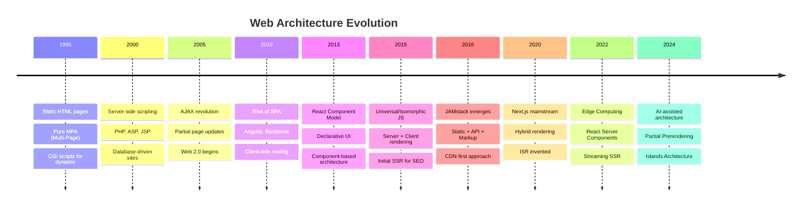

### 💡 WHY - Hiểu lịch sử để làm gì?

| Era      | Problem Solved       | Tradeoff               |
| -------- | -------------------- | ---------------------- |
| **MPA**  | Simple, SEO-friendly | Full page reloads      |
| **AJAX** | Better UX            | Complexity             |
| **SPA**  | App-like experience  | Initial load, SEO      |
| **SSR**  | SEO + fast FCP       | Server load            |
| **SSG**  | Max performance      | Build time, stale data |
| **ISR**  | Fresh + cached       | Complexity             |
| **RSC**  | Zero-JS components   | Learning curve         |

---

## 2. SPA vs MPA vs Hybrid

### ❓ WHAT - Sự khác biệt cốt lõi?

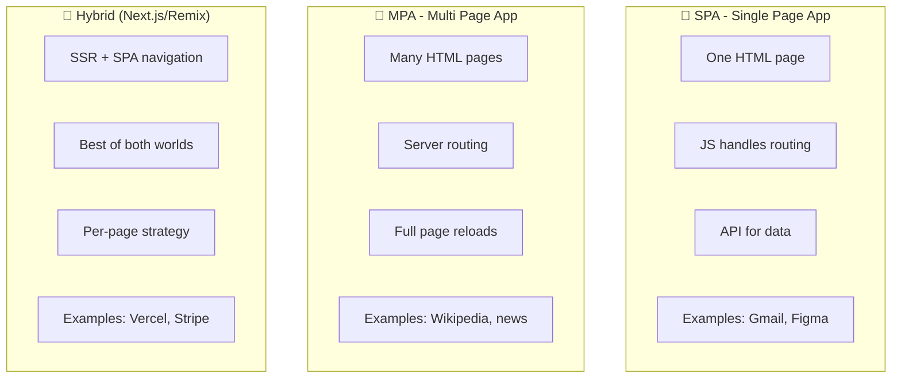

### Comparison Matrix

| Aspect           | SPA                 | MPA                | Hybrid             |
| ---------------- | ------------------- | ------------------ | ------------------ |
| **Initial Load** | Slow (large bundle) | Fast (single page) | Fast (SSR)         |
| **Navigation**   | Instant (no reload) | Slow (full reload) | Instant (prefetch) |
| **SEO**          | Difficult           | Excellent          | Excellent          |
| **Complexity**   | High                | Low                | Medium-High        |
| **Server Cost**  | Low                 | Medium             | Higher             |
| **Best For**     | Dashboards, apps    | Content, blogs     | E-commerce, SaaS   |

### 💡 WHY - Decision Framework

```
┌────────────────────────────────────────────────────────────┐
│  DECISION TREE: Choosing Architecture                      │
│                                                            │
│  ┌── Is SEO critical? ──┐                                  │
│  │                      │                                  │
│  No                    Yes                                 │
│  │                      │                                  │
│  ▼                      ▼                                  │
│  SPA is fine        ┌── Content type? ──┐                  │
│  (dashboards,       │                   │                  │
│   internal apps)    Mostly static    Highly dynamic        │
│                     │                   │                  │
│                     ▼                   ▼                  │
│                    SSG/MPA            SSR/Hybrid           │
│                    (docs,blogs)       (e-commerce)         │
└────────────────────────────────────────────────────────────┘
```

---

## 3. Rendering Strategies Deep Dive

### ❓ WHAT - 5 Rendering Strategies

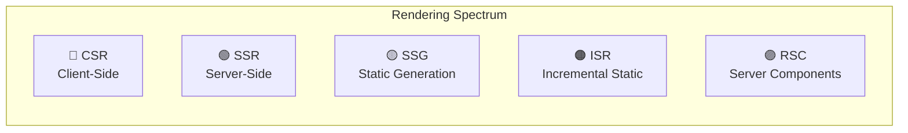

### 🔍 HOW - Chi tiết từng Strategy

#### CSR (Client-Side Rendering)

```
Request Flow:
┌────────┐     ┌────────┐     ┌─────────┐
│ Browser│────►│ Server │────►│ Response│
└────────┘     └────────┘     └────┬────┘
                                   │
    ┌──────────────────────────────┘
    ▼
┌─────────────────────────────────────────┐
│ 1. Empty HTML shell                     │
│ 2. Download large JS bundle             │
│ 3. Execute JS, init React               │
│ 4. Fetch data via API                   │
│ 5. Render content                       │
│                                         │
│ Timeline:                               │
│ |--TTFB--||--------FCP--------||--LCP---|│
│   fast        slow (bundle)        slow  │
└─────────────────────────────────────────┘
```

#### SSR (Server-Side Rendering)

```
Request Flow:
┌────────┐     ┌────────────────┐     ┌─────────┐
│ Browser│────►│ Server renders │────►│Full HTML│
└────────┘     │ React to HTML  │     └────┬────┘
               └────────────────┘          │
    ┌──────────────────────────────────────┘
    ▼
┌─────────────────────────────────────────┐
│ 1. Server fetches data                  │
│ 2. Server renders React → HTML          │
│ 3. Send complete HTML                   │
│ 4. Browser shows immediately            │
│ 5. Hydration (add interactivity)        │
│                                         │
│ Timeline:                               │
│ |---TTFB---||--FCP--||--TTI--|          │
│    slower     fast    hydration         │
└─────────────────────────────────────────┘
```

#### SSG vs ISR

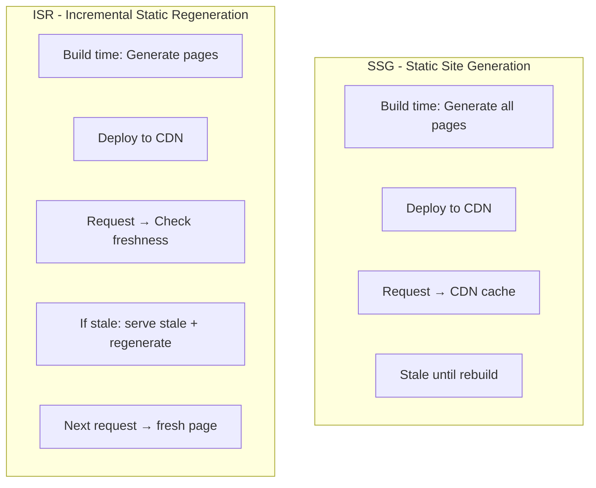

### ⏰ WHEN - Chọn Strategy nào?

| Use Case                   | Strategy     | Reason                     |
| -------------------------- | ------------ | -------------------------- |
| **Blog, Docs**             | SSG          | Content ít đổi, max cache  |
| **E-commerce products**    | ISR (60s)    | SEO + price updates hourly |
| **User dashboard**         | CSR          | Personalized, no SEO       |
| **News feed**              | SSR          | Luôn fresh, SEO critical   |
| **Marketing landing**      | SSG          | Performance + SEO          |
| **Interactive components** | RSC + Client | Zero JS where possible     |

---

## 4. Software Architecture Principles

### ❓ WHAT - Core Principles cho Frontend?

#### SOLID in Frontend Context

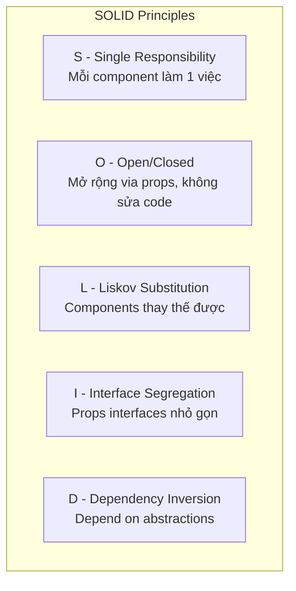

| Principle                 | Frontend Application                                 |
| ------------------------- | ---------------------------------------------------- |
| **Single Responsibility** | Button component chỉ render button, không fetch data |
| **Open/Closed**           | Component nhận children, không hardcode content      |
| **Interface Segregation** | Split large prop interfaces thành smaller ones       |
| **Dependency Inversion**  | Inject services via Context, không import directly   |

#### Clean Architecture Layers

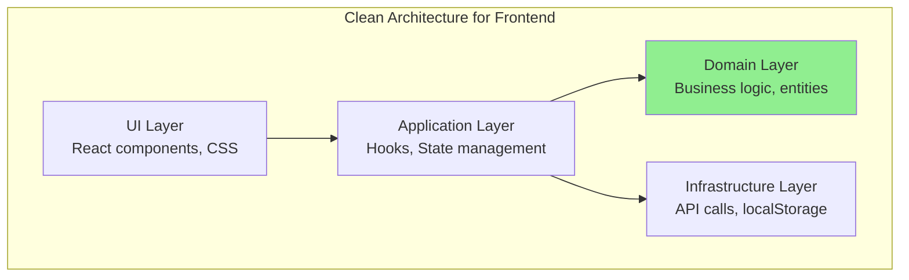

**Dependency Rule**: Outer layers depend on inner layers, never reverse.

---

## 5. Micro-frontends Philosophy

### ❓ WHAT - Micro-frontends là gì?

**Micro-frontends = Áp dụng microservices cho frontend**

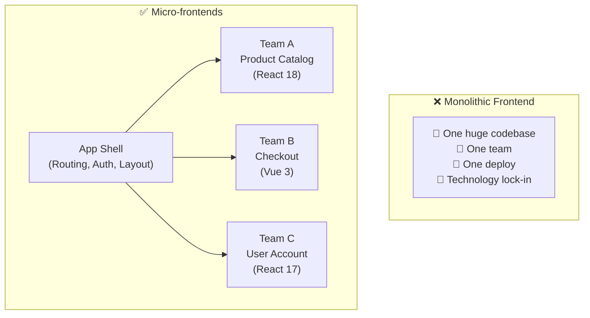

### 🔍 HOW - Integration Approaches

| Approach              | Mechanism          | Pros              | Cons               |
| --------------------- | ------------------ | ----------------- | ------------------ |
| **Build-time**        | NPM packages       | Type-safe, simple | Must rebuild all   |
| **Server-side**       | SSI, Edge includes | Fast initial      | Complex infra      |
| **Run-time iframe**   | `<iframe>`         | True isolation    | Poor UX, slow      |
| **Module Federation** | Webpack 5          | Best balance      | Bundler complexity |
| **Import maps**       | Native ES modules  | Standard          | Browser support    |

### 💡 WHY - Khi nào cần?

```
┌─────────────────────────────────────────────────────────────┐
│  ✅ GOOD FIT FOR MFE              │  ❌ BAD FIT             │
├───────────────────────────────────┼─────────────────────────┤
│  Large teams (30+ devs)           │  Small teams (<10 devs) │
│  Multiple distinct products       │  Single cohesive product│
│  Independent release cycles       │  Tightly coupled features│
│  Different tech stacks per team   │  Consistent stack       │
│  Autonomous team ownership        │  Centralized decisions  │
│  Acquisition integration          │  Greenfield project     │
└───────────────────────────────────┴─────────────────────────┘

⚠️ COMPLEXITY COST: Micro-frontends add significant overhead.
   Only adopt if organizational scaling benefits outweigh technical costs.
```

---

## 6. API Design Theory

### ❓ WHAT - REST vs GraphQL vs tRPC?

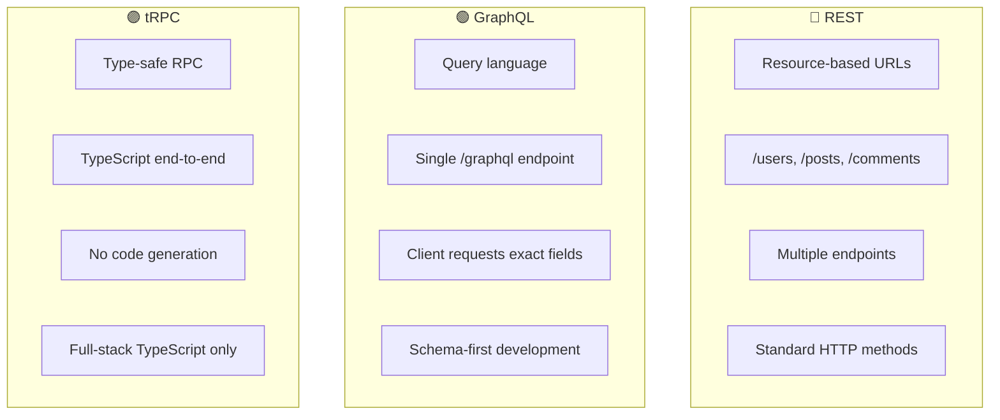

### Richardson Maturity Model (REST)

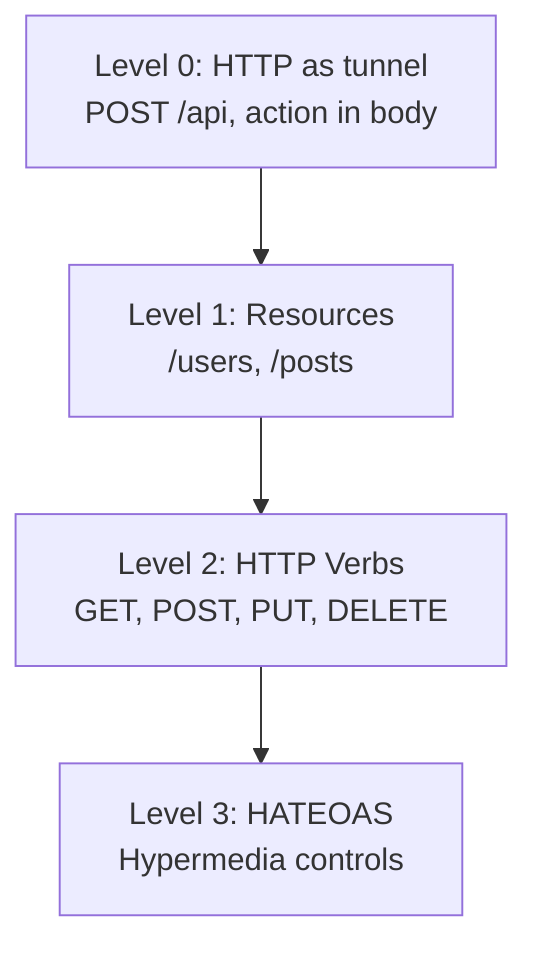

### 💡 WHY - Chọn pattern nào?

| Scenario                   | Best Choice | Reason                            |
| -------------------------- | ----------- | --------------------------------- |
| **Public API**             | REST        | Standard, cacheable, discoverable |
| **Complex data relations** | GraphQL     | One request, no over-fetching     |
| **Full-stack TypeScript**  | tRPC        | Zero-config type safety           |
| **Simple CRUD**            | REST        | No overhead, familiar             |
| **Mobile + Web clients**   | GraphQL     | Each client picks fields          |

---

## 7. Caching Strategies

### ❓ WHAT - Cache Layers

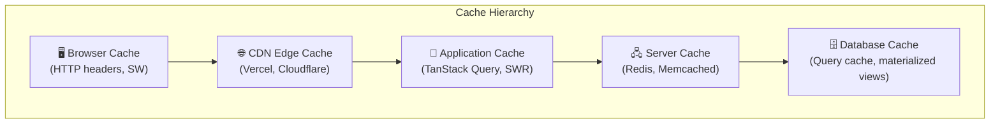

### 🔍 HOW - Cache-Control Headers

```
Cache-Control Header Values:

max-age=3600           → Cache for 1 hour
s-maxage=86400         → CDN caches for 1 day
no-cache               → Revalidate every time
no-store               → Never cache
stale-while-revalidate → Serve stale, fetch background
private                → Browser only, not CDN
public                 → CDN can cache
```

### Stale-While-Revalidate Pattern

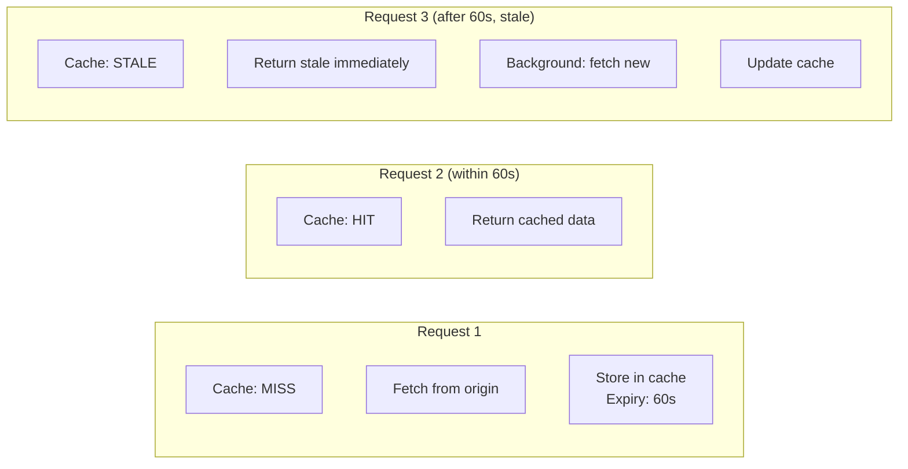

### 💡 WHY - Cache Invalidation Strategies

| Strategy           | How                    | Use Case          |
| ------------------ | ---------------------- | ----------------- |
| **TTL**            | Expires after time     | Static assets     |
| **Versioned URLs** | `/v2/app.js` or hash   | JS/CSS bundles    |
| **Tag-based**      | Purge by tag           | CMS content       |
| **Event-driven**   | Webhook invalidation   | Real-time updates |
| **SWR**            | Stale-while-revalidate | API responses     |

---

## 8. Architecture Decision Framework

### System Design Interview Approach

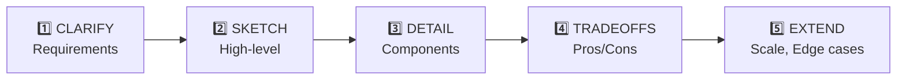

### Key Questions Matrix

| Category        | Questions                       |
| --------------- | ------------------------------- |
| **Scale**       | Users? Concurrent? Data volume? |
| **SEO**         | Public pages? Crawlable?        |
| **Performance** | Target LCP? Offline support?    |
| **Team**        | Size? Skills? Existing stack?   |
| **Budget**      | Server costs? CDN needs?        |

### Decision Record Template

```markdown
# ADR-001: Rendering Strategy

## Context

E-commerce site with 10K products, SEO critical

## Decision

Use ISR with 60-second revalidation

## Consequences

- ✅ Fast initial load (cached)
- ✅ Fresh prices (revalidate)
- ⚠️ Possible 60s stale data
```

---

## 📊 Summary - Mental Models

| Concept          | Mental Model                                      |
| ---------------- | ------------------------------------------------- |
| **SPA vs MPA**   | Interactivity vs SEO tradeoff                     |
| **SSR/SSG/ISR**  | Where rendering happens vs freshness              |
| **Micro-FE**     | Team autonomy vs technical complexity             |
| **API Patterns** | REST = resources, GraphQL = queries, tRPC = types |
| **Caching**      | Closer to user = faster, harder to invalidate     |

---

## 🔗 Cross-References

| Topic            | Related Module                                             |
| ---------------- | ---------------------------------------------------------- |
| React rendering  | [Module 3: React Philosophy](./03-react-philosophy.md)     |
| Performance      | [Module 7: Performance](./07-performance-security.md)      |
| Next.js patterns | [Module 6: Framework Patterns](./06-framework-patterns.md) |

---

## 🔗 Navigation

| Prev                                         | Module                     | Next                                           |
| -------------------------------------------- | -------------------------- | ---------------------------------------------- |
| [React Philosophy](./03-react-philosophy.md) | **4. Architecture Theory** | [TypeScript Theory](./05-typescript-theory.md) |

---

> _Tiếp theo: [Module 5: TypeScript Type Theory](./05-typescript-theory.md)_
