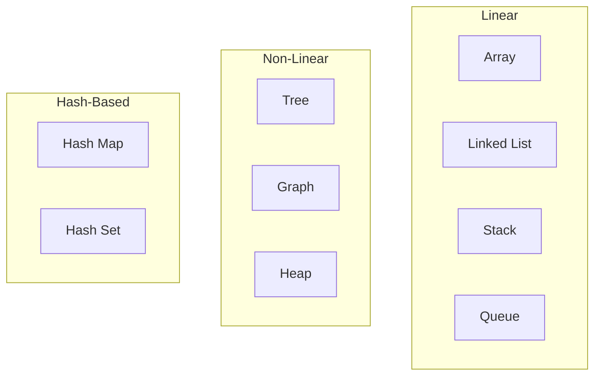
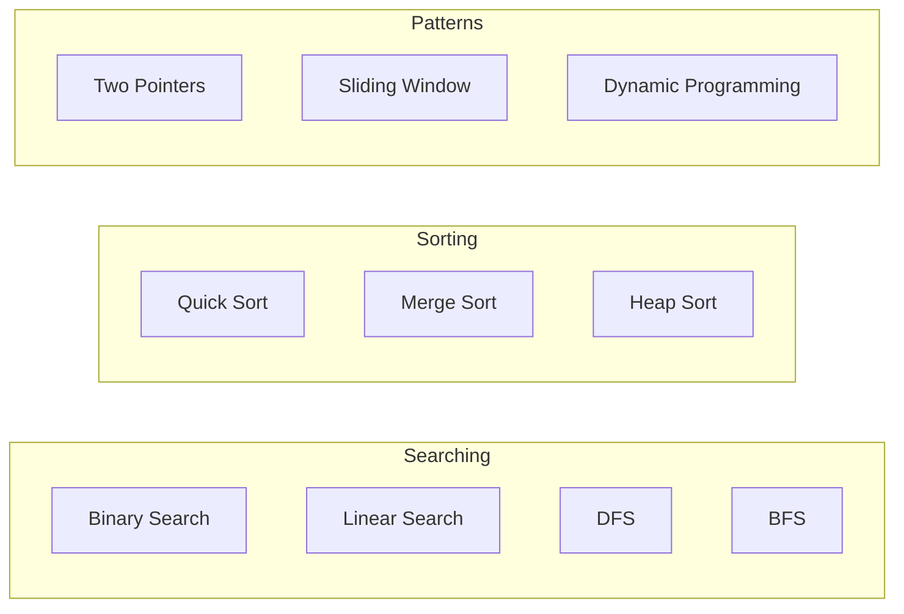

# 🧮 MODULE 10: COMPUTER SCIENCE FUNDAMENTALS

> **Focus**: 90% Theory
>
> _CS Fundamentals = Foundation for algorithmic thinking_
>
> **Phương pháp**: WHAT → WHY → HOW → WHEN

---

## 📋 Trong Module Này

1. [Data Structures](#1-data-structures)
2. [Algorithms](#2-algorithms)
3. [Complexity Analysis](#3-complexity-analysis)
4. [Design Patterns](#4-design-patterns)
5. [System Design Basics](#5-system-design)

---

## 1. Data Structures

### Overview



### Big-O Comparison

| Structure   | Access   | Search   | Insert   | Delete   |
| ----------- | -------- | -------- | -------- | -------- |
| Array       | O(1)     | O(n)     | O(n)     | O(n)     |
| HashMap     | O(1)     | O(1)     | O(1)     | O(1)     |
| Binary Tree | O(log n) | O(log n) | O(log n) | O(log n) |
| Linked List | O(n)     | O(n)     | O(1)     | O(1)     |

---

## 2. Algorithms

### Algorithm Categories



### Common Patterns for Frontend

| Pattern        | Use Case             | Example               |
| -------------- | -------------------- | --------------------- |
| Two Pointers   | Array manipulation   | Remove duplicates     |
| Sliding Window | Substring/subarray   | Max sum of k elements |
| Hash Map       | Counting, lookup     | Two Sum               |
| DFS/BFS        | Tree/graph traversal | DOM traversal         |
| Memoization    | Optimization         | React useMemo         |

---

## 3. Complexity Analysis

### Time Complexity

```
O(1)       < O(log n) < O(n) < O(n log n) < O(n²) < O(2^n)
Constant   < Logarithmic < Linear < Linearithmic < Quadratic < Exponential
```

### Space Complexity

Consider:

- Variable storage
- Recursion stack
- Additional data structures

---

## 4. Design Patterns

### Common Patterns in Frontend

| Pattern       | Description          | Example       |
| ------------- | -------------------- | ------------- |
| **Observer**  | Event subscription   | Event Emitter |
| **Singleton** | Single instance      | Store, Config |
| **Factory**   | Object creation      | createElement |
| **Decorator** | Extend functionality | HOC           |
| **Module**    | Encapsulation        | ES Modules    |

---

## 5. System Design

### Frontend System Design Questions

1. **Design a Chat Application**
2. **Design an Image Gallery**
3. **Design a Real-time Dashboard**
4. **Design a Form Builder**

### Key Considerations

- State management
- Data fetching
- Caching strategy
- Optimistic updates
- Error handling
- Accessibility
- Performance

---

## 🔗 Deep-Dive Resources

| Topic           | Documents                                                                     |
| --------------- | ----------------------------------------------------------------------------- |
| Data Structures | [01-data-structures.md](../10-computer-science/01-data-structures.md)         |
| Algorithms      | [02-algorithms.md](../10-computer-science/02-algorithms.md)                   |
| Design Patterns | [04-design-patterns.md](../10-computer-science/04-design-patterns.md)         |
| Complexity      | [03-complexity-analysis.md](../10-computer-science/03-complexity-analysis.md) |

---

> _Tiếp theo: [Module 11: Testing & QA](./11-testing-qa.md)_
