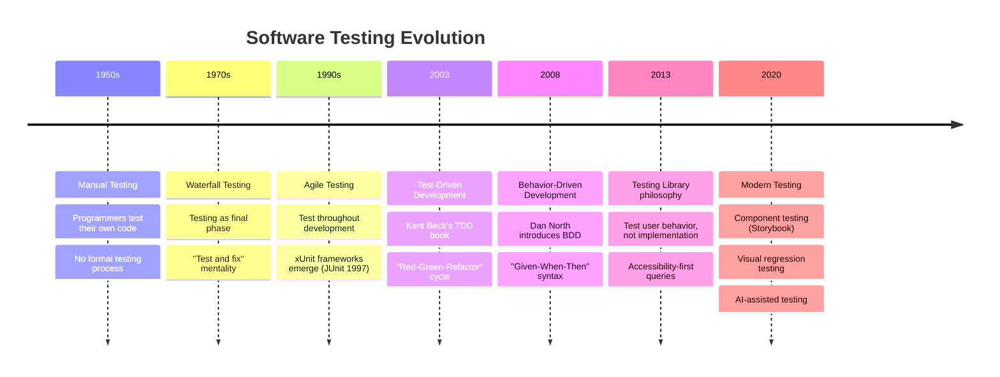
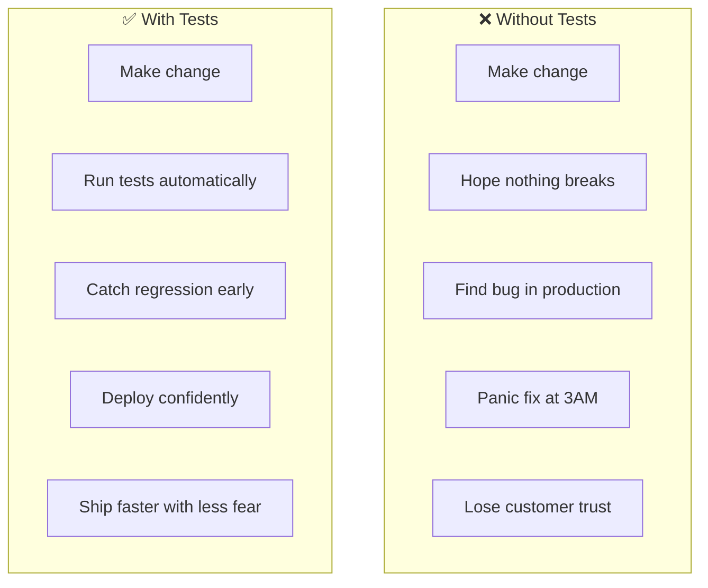
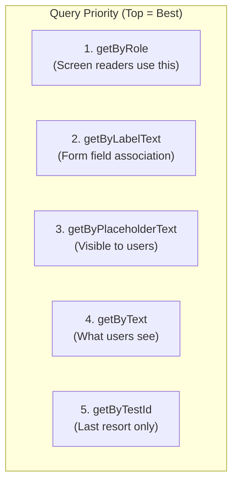
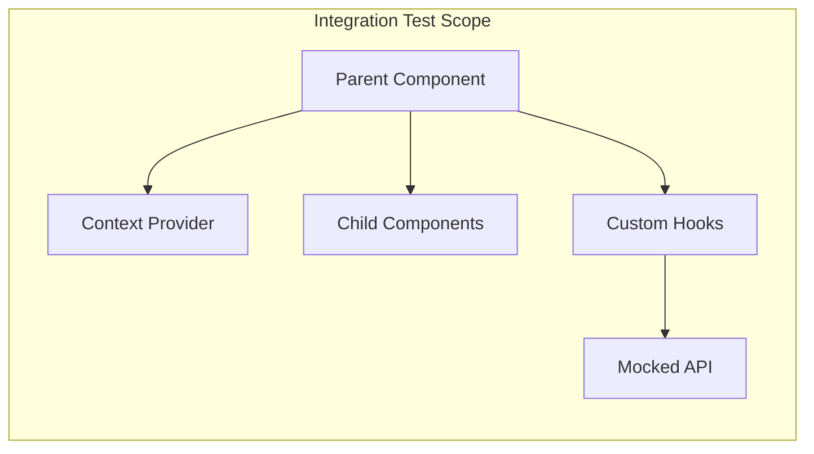
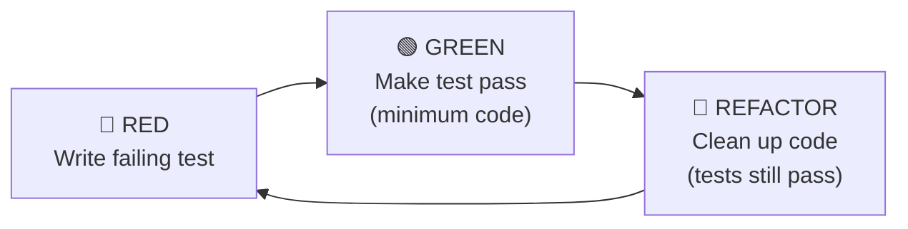
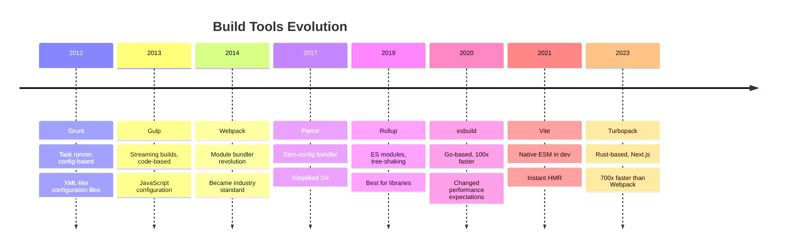
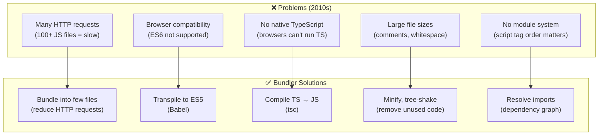
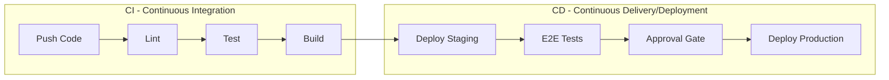
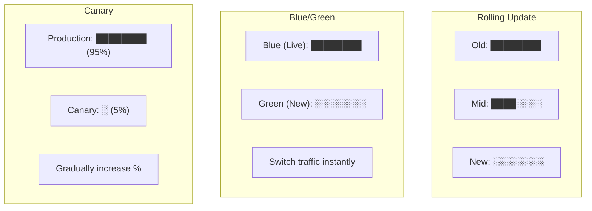

# 🛠️ MODULE 8: TESTING & DEVOPS

> **Focus**: 95% Theory - 5% Practice
>
> _Triết lý testing và workflow hiệu quả_
>
> **Phương pháp**: WHAT → WHY → HOW → WHEN

---

## 📋 Trong Module Này

1. [Testing Philosophy & History](#1-testing-philosophy--history)
2. [Testing Types & Strategies](#2-testing-types--strategies)
3. [Test-Driven Development Theory](#3-test-driven-development-theory)
4. [Build Tools Evolution](#4-build-tools-evolution)
5. [CI/CD Philosophy](#5-cicd-philosophy)
6. [Deployment Strategies](#6-deployment-strategies)
7. [DevOps Culture](#7-devops-culture)

---

## 1. Testing Philosophy & History

### 📜 Lịch Sử Testing



### ❓ WHAT - Tại sao cần test?



### 💡 WHY - Testing Provides Confidence

```
┌────────────────────────────────────────────────────────────┐
│  THE ECONOMICS OF TESTING                                  │
│                                                            │
│  Cost of bug found at each stage:                         │
│                                                            │
│  ┌─────────────────────────────────────────────────────┐  │
│  │ Development:  $1x    ████                           │  │
│  │ Code Review:  $3x    ████████████                   │  │
│  │ QA Testing:   $10x   ████████████████████████████   │  │
│  │ Production:   $100x  ████████████████████ (costly!) │  │
│  └─────────────────────────────────────────────────────┘  │
│                                                            │
│  💡 Finding bugs early is exponentially cheaper            │
│                                                            │
│  IBM Research: Bug found in production costs               │
│  6x more to fix than during development                   │
└────────────────────────────────────────────────────────────┘
```

### The Testing Pyramid Deep Dive

```
                 /\
                /E2E\           5-10%
               /──────\         Slow, Expensive, Brittle
              /        \        But: Highest confidence
             /Integration\      20-30%
            /──────────────\    Medium speed/cost
           /                \   Test component interactions
          /   Unit Tests     \  60-70%
         /────────────────────\ Fast, Cheap, Stable
                                Foundation of test suite
```

**Triết lý của Testing Pyramid:**

| Level           | Triết Lý                    | Ví Dụ                      |
| --------------- | --------------------------- | -------------------------- |
| **Unit**        | Test isolated logic         | Utility functions, hooks   |
| **Integration** | Test component interactions | Component + Context + API  |
| **E2E**         | Test user journeys          | Login → Dashboard → Logout |

### Đặc Điểm Của Test Tốt

```
┌────────────────────────────────────────────────────────────┐
│  F.I.R.S.T. PRINCIPLES                                     │
│                                                            │
│  F - Fast                                                  │
│      Tests should run in milliseconds                      │
│      Slow tests = developers stop running them            │
│                                                            │
│  I - Isolated/Independent                                  │
│      Tests don't depend on each other                      │
│      Can run in any order, in parallel                    │
│                                                            │
│  R - Repeatable                                            │
│      Same result every time, anywhere                      │
│      No flaky tests depending on time/network             │
│                                                            │
│  S - Self-validating                                       │
│      Pass or fail, no manual inspection                    │
│      Clear assertion messages                              │
│                                                            │
│  T - Timely                                                │
│      Written before or with production code                │
│      Not as afterthought                                   │
└────────────────────────────────────────────────────────────┘
```

### Testing Decision Matrix

```
┌────────────────────────────────────────────────────────────┐
│  ✅ TEST:                                                  │
│  • User interactions (click, type, submit)                 │
│  • Conditional rendering ("show X when Y")                 │
│  • Business logic (validation, calculations)               │
│  • Edge cases and error states                             │
│  • Accessibility (role, aria-labels)                       │
│  • API integration (request/response handling)             │
│  • Critical user paths                                     │
│                                                            │
│  ❌ DON'T TEST:                                            │
│  • Implementation details (internal state names)           │
│  • Third-party libraries (React, lodash)                  │
│  • Framework internals                                     │
│  • Styling/CSS (unless critical to UX)                     │
│  • Exact text content (too brittle)                        │
│  • Private methods                                         │
│                                                            │
│  💡 RULE: If refactoring changes your tests but not       │
│     behavior, you're testing implementation details       │
└────────────────────────────────────────────────────────────┘
```

---

## 2. Testing Types & Strategies

### Unit Testing Philosophy

```
┌────────────────────────────────────────────────────────────┐
│  WHAT IS A "UNIT"?                                         │
│                                                            │
│  Classical (Detroit) School:                               │
│  • Unit = Module/Class                                     │
│  • Test with real dependencies                            │
│  • Only mock external services (DB, network)              │
│                                                            │
│  London (Mockist) School:                                  │
│  • Unit = Single Class                                     │
│  • Mock all dependencies                                   │
│  • Test in complete isolation                             │
│                                                            │
│  Modern React Approach:                                    │
│  • Unit = Component or Hook                                │
│  • Render with real children                               │
│  • Mock only API calls and complex dependencies           │
└────────────────────────────────────────────────────────────┘
```

### AAA Pattern (Arrange-Act-Assert)

```
┌────────────────────────────────────────────────────────────┐
│  AAA PATTERN                                               │
│                                                            │
│  ARRANGE:  Set up test data, mocks, preconditions         │
│            Create component, set initial state            │
│                                                            │
│  ACT:      Execute the action being tested                 │
│            Click button, call function, trigger event     │
│                                                            │
│  ASSERT:   Verify expected outcome                         │
│            Check rendered output, function called, etc    │
│                                                            │
│  NAMING:                                                   │
│  "should [expected behavior] when [condition]"             │
│                                                            │
│  EXAMPLES:                                                 │
│  • should disable submit button when email is invalid     │
│  • should show error toast when API returns 500          │
│  • should redirect to dashboard when login succeeds       │
└────────────────────────────────────────────────────────────┘
```

### Testing Library Philosophy



```
┌────────────────────────────────────────────────────────────┐
│  TESTING LIBRARY PHILOSOPHY                                │
│                                                            │
│  "The more your tests resemble the way your software is   │
│   used, the more confidence they can give you."            │
│                                    — Kent C. Dodds          │
│                                                            │
│  CORE PRINCIPLES:                                          │
│                                                            │
│  1. Query by ACCESSIBILITY                                 │
│     Users (and screen readers) find elements by role      │
│     getByRole('button', { name: 'Submit' })               │
│                                                            │
│  2. Test BEHAVIOR, not implementation                      │
│     ❌ expect(state.isLoading).toBe(true)                 │
│     ✅ expect(screen.getByText('Loading...')).toBeVisible│
│                                                            │
│  3. Avoid testing INTERNAL STATE                           │
│     ❌ Checking component's useState value                │
│     ✅ Checking what user sees on screen                  │
│                                                            │
│  4. Fire REAL EVENTS                                       │
│     userEvent.click() simulates real user interaction     │
│     fireEvent is lower-level, less realistic              │
└────────────────────────────────────────────────────────────┘
```

### Integration Testing Theory



**Integration vs Unit:**

| Aspect           | Unit Test   | Integration Test        |
| ---------------- | ----------- | ----------------------- |
| **Scope**        | Single unit | Multiple units together |
| **Dependencies** | All mocked  | Some real, some mocked  |
| **Speed**        | Fastest     | Medium                  |
| **Confidence**   | Low-medium  | Medium-high             |
| **Debugging**    | Easy        | Medium                  |

### E2E Testing Comparison

| Tool           | Architecture              | Best For              | Speed   |
| -------------- | ------------------------- | --------------------- | ------- |
| **Playwright** | Multi-browser, headless   | Cross-browser testing | ⚡ Fast |
| **Cypress**    | Real browser, same-origin | Component + E2E       | ⚡ Fast |
| **Selenium**   | Driver-based              | Legacy, enterprise    | 🐢 Slow |
| **Puppeteer**  | Chrome only               | Chrome-specific       | ⚡ Fast |

---

## 3. Test-Driven Development Theory

### ❓ WHAT - TDD là gì?



### 💡 WHY - TDD Benefits

```
┌────────────────────────────────────────────────────────────┐
│  TDD BENEFITS                                              │
│                                                            │
│  1. DESIGN PRESSURE                                        │
│     Writing tests first forces you to think about API     │
│     Hard-to-test code = hard-to-use code                  │
│                                                            │
│  2. DOCUMENTATION                                          │
│     Tests document expected behavior                       │
│     Living documentation that can't get outdated          │
│                                                            │
│  3. CONFIDENCE                                             │
│     Every line of code has a test                          │
│     Refactor without fear                                  │
│                                                            │
│  4. DEBUGGING                                              │
│     When test fails, you know exactly what broke          │
│     Small iterations = easy to find bug source            │
│                                                            │
│  TDD CHALLENGES:                                           │
│  • Learning curve                                          │
│  • Slower initial development (but faster long-term)      │
│  • Not suitable for exploratory coding                    │
└────────────────────────────────────────────────────────────┘
```

### TDD vs Test-After

| Aspect          | TDD (Test-First)   | Test-After                 |
| --------------- | ------------------ | -------------------------- |
| **Design**      | Tests guide design | Tests verify existing code |
| **Coverage**    | High by default    | Often incomplete           |
| **Testability** | Code is testable   | May need refactoring       |
| **Flow**        | Slower but steady  | Fast then testing debt     |

---

## 4. Build Tools Evolution

### 📜 History of JavaScript Bundlers



### 💡 WHY - Why Bundlers Exist



### Vite vs Webpack Deep Comparison

```
┌────────────────────────────────────────────────────────────┐
│  WHY VITE IS FUNDAMENTALLY DIFFERENT                       │
│                                                            │
│  WEBPACK (Bundle-based dev server):                        │
│  ┌─────────────────────────────────────────────────────┐  │
│  │ 1. Read all source files                            │  │
│  │ 2. Parse and analyze dependencies                   │  │
│  │ 3. Bundle everything together                       │  │
│  │ 4. Serve bundled result                             │  │
│  │ Time: 10-30 seconds for large apps                  │  │
│  └─────────────────────────────────────────────────────┘  │
│                                                            │
│  VITE (Native ESM dev server):                             │
│  ┌─────────────────────────────────────────────────────┐  │
│  │ 1. Start server immediately                         │  │
│  │ 2. Browser requests module via import               │  │
│  │ 3. Transform only that module on-demand             │  │
│  │ 4. Browser executes native ES modules               │  │
│  │ Time: < 1 second regardless of app size             │  │
│  └─────────────────────────────────────────────────────┘  │
│                                                            │
│  KEY INSIGHT:                                              │
│  Webpack bundles THEN serves                               │
│  Vite serves THEN transforms (on-demand)                   │
└────────────────────────────────────────────────────────────┘
```

| Aspect         | Webpack                  | Vite                       |
| -------------- | ------------------------ | -------------------------- |
| **Dev server** | Bundle first, then serve | Native ESM, no bundle      |
| **Cold start** | 10-30 seconds            | < 1 second                 |
| **HMR speed**  | Rebuild affected chunk   | Update single module       |
| **Config**     | Complex, many plugins    | Simple, batteries included |
| **Production** | Webpack                  | Rollup                     |
| **Best for**   | Complex enterprise       | Modern apps                |
| **Ecosystem**  | Huge, mature             | Growing rapidly            |

### Tree Shaking Theory

```
┌────────────────────────────────────────────────────────────┐
│  TREE SHAKING = Dead Code Elimination                      │
│                                                            │
│  HOW IT WORKS:                                             │
│  1. Bundler analyzes import/export relationships          │
│  2. Builds dependency graph                                │
│  3. Marks unreachable code as "dead"                       │
│  4. Removes dead code from bundle                          │
│                                                            │
│  REQUIREMENTS:                                             │
│  ✓ ES Modules (import/export)                             │
│  ✗ CommonJS (require) - not statically analyzable        │
│                                                            │
│  ✓ No side effects in module scope                        │
│  ✗ Code that runs on import (e.g., polyfills)             │
│                                                            │
│  ✓ "sideEffects": false in package.json                   │
│                                                            │
│  EXAMPLE:                                                  │
│  // utils.js                                               │
│  export function used() { }     ✅ kept                   │
│  export function unused() { }   ❌ removed                │
│                                                            │
│  // app.js                                                 │
│  import { used } from './utils';                          │
└────────────────────────────────────────────────────────────┘
```

---

## 5. CI/CD Philosophy

### ❓ WHAT - CI/CD là gì?



### 💡 WHY - CI/CD Philosophy

```
┌────────────────────────────────────────────────────────────┐
│  CONTINUOUS INTEGRATION PRINCIPLES                         │
│                                                            │
│  1. MAINLINE DEVELOPMENT                                   │
│     Everyone commits to main/trunk frequently             │
│     Avoid long-lived feature branches                     │
│                                                            │
│  2. AUTOMATED BUILD                                        │
│     Every commit triggers build + tests                   │
│     No "it works on my machine" problems                  │
│                                                            │
│  3. FAST FEEDBACK                                          │
│     Build fails? Developer knows in minutes               │
│     Fix while context is fresh                            │
│                                                            │
│  4. EVERYONE OWNS THE BUILD                                │
│     If build breaks, team stops and fixes                 │
│     Don't commit on top of broken build                   │
└────────────────────────────────────────────────────────────┘

┌────────────────────────────────────────────────────────────┐
│  CONTINUOUS DELIVERY/DEPLOYMENT                            │
│                                                            │
│  DELIVERY: Code is always deployable                       │
│            Manual approval before production              │
│                                                            │
│  DEPLOYMENT: Code automatically goes to production         │
│              No manual steps (requires high confidence)   │
│                                                            │
│  REQUIREMENTS FOR CD:                                      │
│  • Comprehensive test coverage                             │
│  • Feature flags for incomplete features                  │
│  • Automated rollback capability                          │
│  • Monitoring and alerts                                   │
└────────────────────────────────────────────────────────────┘
```

### Key Principles

| Principle               | Why                    | How                                 |
| ----------------------- | ---------------------- | ----------------------------------- |
| **Automate everything** | Reduce human error     | Scripts, not manual steps           |
| **Fail fast**           | Catch issues early     | Lint before test, test before build |
| **Keep builds fast**    | Developer productivity | Parallel jobs, caching              |
| **Trunk-based dev**     | Reduce merge conflicts | Small, frequent merges              |
| **Feature flags**       | Deploy ≠ Release       | Toggle features without deploy      |

### CI Pipeline Stages

```
┌────────────────────────────────────────────────────────────┐
│  OPTIMIZED CI PIPELINE                                     │
│                                                            │
│  STAGE 1: STATIC ANALYSIS (Fast, run first)               │
│  ├── Lint (ESLint, Prettier)                              │
│  ├── Type check (TypeScript)                              │
│  └── Security scan (npm audit)                            │
│                                                            │
│  STAGE 2: UNIT TESTS (Parallel)                           │
│  ├── Component tests                                       │
│  ├── Hook tests                                            │
│  └── Utility tests                                         │
│                                                            │
│  STAGE 3: BUILD                                            │
│  ├── Production build                                      │
│  ├── Bundle size check                                     │
│  └── Generate sourcemaps                                   │
│                                                            │
│  STAGE 4: INTEGRATION (After build)                        │
│  ├── E2E tests (headless)                                  │
│  ├── Visual regression                                     │
│  └── Accessibility audit                                   │
│                                                            │
│  STAGE 5: DEPLOY                                           │
│  └── Preview deployment for PR                             │
└────────────────────────────────────────────────────────────┘
```

---

## 6. Deployment Strategies

### Deployment Methods Comparison



### Deep Comparison

| Strategy       | Risk     | Rollback         | Resource Cost   | Complexity |
| -------------- | -------- | ---------------- | --------------- | ---------- |
| **Rolling**    | Medium   | Slow (re-deploy) | Low             | Low        |
| **Blue/Green** | Low      | Instant (switch) | High (2x infra) | Medium     |
| **Canary**     | Very Low | Instant          | Medium          | High       |

```
┌────────────────────────────────────────────────────────────┐
│  WHEN TO USE EACH STRATEGY                                 │
│                                                            │
│  ROLLING UPDATE:                                           │
│  • Simple apps with minimal state                          │
│  • Can tolerate mixed versions briefly                     │
│  • Limited infrastructure budget                           │
│                                                            │
│  BLUE/GREEN:                                               │
│  • Need instant rollback capability                        │
│  • Can afford 2x infrastructure                            │
│  • Database migrations must be backward-compatible        │
│                                                            │
│  CANARY:                                                   │
│  • High-traffic production systems                         │
│  • Want to test with real users first                      │
│  • Have monitoring to detect issues                        │
└────────────────────────────────────────────────────────────┘
```

---

## 7. DevOps Culture

### ❓ WHAT - DevOps là gì?

```
┌────────────────────────────────────────────────────────────┐
│  DEVOPS = Development + Operations                         │
│                                                            │
│  NOT just tools, it's a CULTURE                           │
│                                                            │
│  BEFORE DEVOPS:                                            │
│  ┌──────────┐  "Throw over   ┌─────────────┐              │
│  │   Dev    │ ───the wall──► │   Ops       │              │
│  │(Build it)│               │(Run it)     │              │
│  └──────────┘               └─────────────┘              │
│  Blame game when things break                             │
│                                                            │
│  WITH DEVOPS:                                              │
│  ┌────────────────────────────────────────┐               │
│  │  DevOps Team (You build it, you run it)│               │
│  │  Shared responsibility                  │               │
│  │  Continuous feedback loop               │               │
│  └────────────────────────────────────────┘               │
└────────────────────────────────────────────────────────────┘
```

### CALMS Framework

```
┌────────────────────────────────────────────────────────────┐
│  C.A.L.M.S. - DevOps Principles                            │
│                                                            │
│  C - Culture                                               │
│      Collaboration between dev and ops                     │
│      Shared responsibility for production                  │
│                                                            │
│  A - Automation                                            │
│      Automate repetitive tasks                             │
│      CI/CD pipelines, infrastructure as code              │
│                                                            │
│  L - Lean                                                  │
│      Reduce waste, small batches                           │
│      Continuous improvement                                │
│                                                            │
│  M - Measurement                                           │
│      Metrics for everything                                │
│      Data-driven decisions                                 │
│                                                            │
│  S - Sharing                                               │
│      Share knowledge, tools, responsibilities             │
│      Blameless post-mortems                               │
└────────────────────────────────────────────────────────────┘
```

### Conventional Commits

| Type        | Purpose          | Example                         |
| ----------- | ---------------- | ------------------------------- |
| `feat:`     | New feature      | feat: add login page            |
| `fix:`      | Bug fix          | fix: resolve button click issue |
| `docs:`     | Documentation    | docs: update README             |
| `refactor:` | Code restructure | refactor: extract validation    |
| `test:`     | Add/update tests | test: add unit tests for auth   |
| `chore:`    | Maintenance      | chore: update dependencies      |
| `perf:`     | Performance      | perf: optimize image loading    |
| `ci:`       | CI changes       | ci: add cache to pipeline       |

---

## 📊 Summary

| Topic                  | Key Takeaway                        |
| ---------------------- | ----------------------------------- |
| **Testing Philosophy** | Test behavior, not implementation   |
| **Testing Pyramid**    | More unit tests, fewer E2E          |
| **TDD**                | Red-Green-Refactor cycle            |
| **Bundlers**           | Vite for speed, Webpack for complex |
| **CI/CD**              | Automate, fail fast, deploy often   |
| **Deployment**         | Blue/Green for safety               |
| **DevOps**             | Culture > Tools                     |

---

## 🔗 Cross-References

| Topic        | Related Module                                        |
| ------------ | ----------------------------------------------------- |
| Performance  | [Module 7: Performance](./07-performance-security.md) |
| Architecture | [Module 4: Architecture](./04-architecture-theory.md) |
| JavaScript   | [Module 1: JavaScript](./01-javascript-theory.md)     |

---

## 🔗 Navigation

| Prev                                                   | Module                  | Next                                       |
| ------------------------------------------------------ | ----------------------- | ------------------------------------------ |
| [Performance & Security](./07-performance-security.md) | **8. Testing & DevOps** | [Coding Practice](./09-coding-practice.md) |

---

> _Tiếp theo: [Module 9: Coding Practice](./09-coding-practice.md)_
