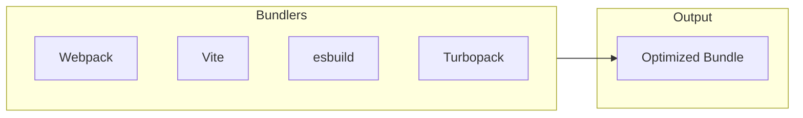
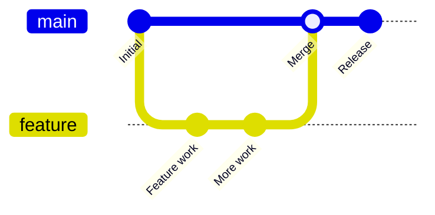
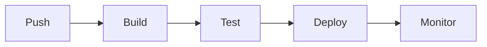

# 🛠️ MODULE 12: DEVOPS & DEVELOPMENT TOOLS

> **Focus**: 75% Theory - 25% Examples
>
> _DevOps = Development + Operations collaboration_
>
> **Phương pháp**: WHAT → WHY → HOW → WHEN

---

## 📋 Trong Module Này

1. [Build Tools](#1-build-tools)
2. [Package Managers](#2-package-managers)
3. [Version Control](#3-version-control)
4. [CI/CD](#4-cicd)
5. [Containerization](#5-containerization)
6. [Monitoring](#6-monitoring)

---

## 1. Build Tools

### Modern Build Tools Comparison



| Tool          | Speed        | Config  | Use Case        |
| ------------- | ------------ | ------- | --------------- |
| **Vite**      | ⚡ Fast      | Minimal | Modern projects |
| **Webpack**   | Moderate     | Complex | Enterprise      |
| **esbuild**   | ⚡⚡ Fastest | Minimal | Libraries       |
| **Turbopack** | ⚡ Fast      | Minimal | Next.js 13+     |

### Key Concepts

- **Bundling**: Combine multiple files
- **Tree Shaking**: Remove unused code
- **Code Splitting**: Load on demand
- **Minification**: Reduce file size

---

## 2. Package Managers

### Comparison

| Feature    | npm               | yarn      | pnpm           |
| ---------- | ----------------- | --------- | -------------- |
| Speed      | Moderate          | Fast      | Fastest        |
| Disk Space | High              | High      | Low (symlinks) |
| Lockfile   | package-lock.json | yarn.lock | pnpm-lock.yaml |

### Best Practices

```bash
# Lock versions in production
npm ci          # Install from lockfile
pnpm install --frozen-lockfile

# Security audit
npm audit
pnpm audit

# Update dependencies
npx npm-check-updates
```

---

## 3. Version Control

### Git Workflow



### Common Commands

```bash
# Branching
git checkout -b feature/name
git rebase main
git merge --squash feature

# History
git log --oneline
git reflog
git bisect

# Undo
git reset --soft HEAD~1
git stash
git cherry-pick <commit>
```

---

## 4. CI/CD

### Pipeline Example



### GitHub Actions Example

```yaml
name: CI/CD
on: [push, pull_request]

jobs:
  build:
    runs-on: ubuntu-latest
    steps:
      - uses: actions/checkout@v4
      - uses: actions/setup-node@v4
      - run: npm ci
      - run: npm test
      - run: npm run build
```

---

## 5. Containerization

### Docker Basics

```dockerfile
FROM node:20-alpine
WORKDIR /app
COPY package*.json ./
RUN npm ci --only=production
COPY . .
RUN npm run build
EXPOSE 3000
CMD ["npm", "start"]
```

### Key Concepts

- **Image**: Blueprint for containers
- **Container**: Running instance
- **Dockerfile**: Build instructions
- **docker-compose**: Multi-container apps

---

## 6. Monitoring

### Frontend Monitoring

| Type               | Tools                 | Purpose              |
| ------------------ | --------------------- | -------------------- |
| **Error Tracking** | Sentry                | Catch runtime errors |
| **Analytics**      | GA, Mixpanel          | User behavior        |
| **Performance**    | Lighthouse, WebVitals | Core Web Vitals      |
| **APM**            | Datadog, New Relic    | Full-stack           |

---

## 🔗 Deep-Dive Resources

| Topic          | Documents                                                                                                |
| -------------- | -------------------------------------------------------------------------------------------------------- |
| Build Tools    | [05-modern-development-tools.md](../13-tools-ecosystem/05-modern-development-tools.md)                   |
| Advanced Tools | [06-development-tools-advanced-theory.md](../13-tools-ecosystem/06-development-tools-advanced-theory.md) |

---

> _Tiếp theo: [Module 13: Accessibility](./13-accessibility.md)_
