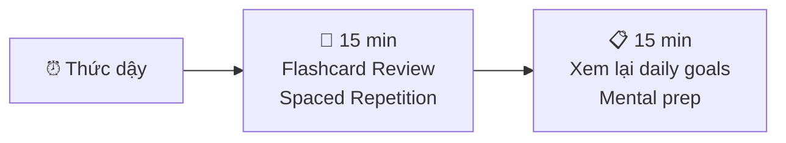
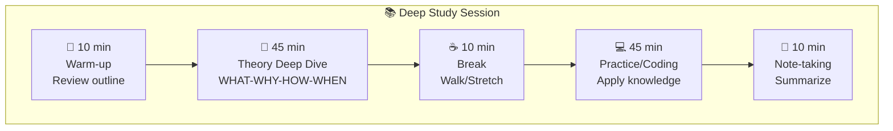
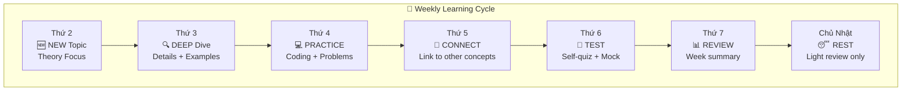
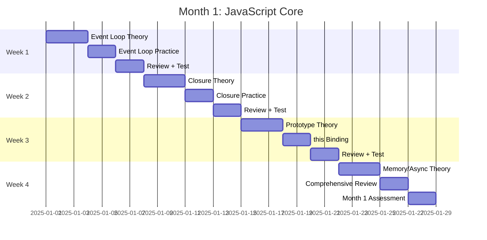

# 📋 MODULE 12B: DETAILED STUDY PROCESS

> **Bổ sung cho Module 12** - Quy trình chi tiết từng ngày/tuần
>
> _"Có kế hoạch rõ ràng = Thực hiện dễ dàng hơn"_

---

## 📋 Trong Module Này

1. [Daily Process Template](#1-daily-process-template)
2. [Weekly Process Flow](#2-weekly-process-flow)
3. [Monthly Milestones](#3-monthly-milestones)
4. [6-Month Detailed Timeline](#4-6-month-detailed-timeline)
5. [Self-Assessment Checkpoints](#5-self-assessment-checkpoints)

---

## 1. Daily Process Template

### 🌅 Morning Routine (30 phút)



**Checklist:**

```markdown
□ Ôn 10-15 flashcards (concepts từ hôm trước)
□ Đọc lại notes hôm qua (5 phút)
□ Set 3 học tập goals cho hôm nay
```

---

### 📚 Study Session (2-4 giờ)



**Session Structure:**

| Phase        | Thời gian | Activity                      | Mục tiêu                 |
| ------------ | --------- | ----------------------------- | ------------------------ |
| **Warm-up**  | 10 min    | Đọc outline, preview bài      | Activate prior knowledge |
| **Theory**   | 45 min    | Đọc sâu theory, draw diagrams | Deep understanding       |
| **Break**    | 10 min    | Đi lại, uống nước             | Brain recovery           |
| **Practice** | 45 min    | Code, giải problems           | Apply knowledge          |
| **Summary**  | 10 min    | Viết notes, tạo flashcards    | Consolidate              |

---

### 🌙 Evening Routine (30 phút)

```markdown
□ Review những gì học được hôm nay (10 min)
□ Viết 3 điều đã hiểu rõ (5 min)  
□ Viết 1-2 điều cần ôn lại (5 min)
□ Prepare cho ngày mai (10 min)
```

---

## 2. Weekly Process Flow

### 📅 Weekly Schedule Template



---

### Week Day Details

#### Thứ 2: NEW Topic Introduction

```
09:00-10:00  Read theory overview (WHAT)
10:00-10:15  Break
10:15-11:15  Understand WHY - historical context
11:15-12:00  Watch video explanations (nếu có)

14:00-15:00  Study HOW - mechanism details
15:00-16:00  Draw diagrams từ memory
16:00-16:30  Create initial flashcards
```

**Deliverable:**

- [ ] Có thể giải thích WHAT + WHY mà không cần notes

---

#### Thứ 3: DEEP Dive

```
09:00-10:30  Read deep-dive documents (từ reference table)
10:30-10:45  Break
10:45-12:00  Study HOW in detail với code examples

14:00-15:30  Take detailed notes
15:30-16:30  Practice explaining aloud (Feynman)
```

**Deliverable:**

- [ ] Có thể vẽ diagram từ memory
- [ ] Có thể giải thích cho người khác

---

#### Thứ 4: PRACTICE Day

```
09:00-10:30  Coding challenges related to topic
10:30-10:45  Break
10:45-12:00  More practice problems

14:00-15:00  Debug + understand solutions
15:00-16:00  Implement từ scratch (no reference)
```

**Deliverable:**

- [ ] Hoàn thành 3-5 practice problems
- [ ] Có thể implement key patterns từ memory

---

#### Thứ 5: CONNECT Day

```
09:00-10:00  Map connections to previous topics
10:00-11:00  Read related concepts (cross-references)
11:00-12:00  Update knowledge map diagram

14:00-15:00  Practice interview questions về topic
15:00-16:00  Record answers, self-critique
```

**Deliverable:**

- [ ] Updated concept relationship diagram
- [ ] 5 interview questions answered confidently

---

#### Thứ 6: TEST Day

```
09:00-10:00  Self-quiz (no notes)
10:00-11:00  Timed coding challenges
11:00-12:00  Mock interview practice

14:00-15:00  Review weak areas
15:00-16:00  Fill gaps, re-study if needed
```

**Deliverable:**

- [ ] Self-assessment score
- [ ] List of concepts to review

---

#### Thứ 7: REVIEW Day

```
09:00-10:00  Weekly summary notes
10:00-11:00  Flashcard marathon (all week's cards)
11:00-12:00  Plan next week

Afternoon: Lighter activities, project work
```

---

#### Chủ Nhật: REST Day

```
Morning:    Light flashcard review (15-30 min)
Afternoon:  Complete rest from studying
Evening:    Prepare materials for Monday

⚠️ REST IS PART OF LEARNING!
Memory consolidation happens during rest.
```

---

## 3. Monthly Milestones với Knowledge References

### Month 1: JavaScript Foundation



#### Week 1: Event Loop & Async

| Resource Type       | 📚 Documents                                                                                                                                                                           |
| ------------------- | -------------------------------------------------------------------------------------------------------------------------------------------------------------------------------------- |
| **Theory Core**     | [06-event-loop-async.md](../01-javascript-fundamentals/06-event-loop-async.md)                                                                                                         |
| **Deep Dive**       | [09-async-comprehensive.md](../01-javascript-fundamentals/09-async-comprehensive.md), [19-concurrency-models-theory.md](../01-javascript-fundamentals/19-concurrency-models-theory.md) |
| **Frontend Theory** | [10-async-programming-theory.md](../17-frontend-theory/10-async-programming-theory.md)                                                                                                 |
| **Advanced**        | [05-concurrency-patterns.md](../18-advanced-theory/05-concurrency-patterns.md), [16-web-workers-concurrency.md](../17-frontend-theory/16-web-workers-concurrency.md)                   |
| **Visual**          | [01-javascript-concepts-map.md](../12-visual-learning/01-javascript-concepts-map.md)                                                                                                   |
| **Practice**        | [01-javascript-challenges.md](../11-interview-practice/01-javascript-challenges.md)                                                                                                    |

#### Week 2: Closure & Scope

| Resource Type         | 📚 Documents                                                                                                                                                                                       |
| --------------------- | -------------------------------------------------------------------------------------------------------------------------------------------------------------------------------------------------- |
| **Theory Core**       | [03-closures.md](../01-javascript-fundamentals/03-closures.md), [02-scope-hoisting.md](../01-javascript-fundamentals/02-scope-hoisting.md)                                                         |
| **Deep Dive**         | [03-closures-comprehensive.md](../01-javascript-fundamentals/03-closures-comprehensive.md), [02-scope-hoisting-comprehensive.md](../01-javascript-fundamentals/02-scope-hoisting-comprehensive.md) |
| **Execution Context** | [16-execution-context-theory.md](../01-javascript-fundamentals/16-execution-context-theory.md)                                                                                                     |
| **Frontend Theory**   | [01-javascript-language-theory.md](../17-frontend-theory/01-javascript-language-theory.md)                                                                                                         |
| **Practice**          | [01-javascript-challenges.md](../11-interview-practice/01-javascript-challenges.md)                                                                                                                |

#### Week 3: Prototype & this Binding

| Resource Type         | 📚 Documents                                                                                                                                                       |
| --------------------- | ------------------------------------------------------------------------------------------------------------------------------------------------------------------ |
| **Theory Core**       | [04-prototypes-inheritance.md](../01-javascript-fundamentals/04-prototypes-inheritance.md), [05-this-keyword.md](../01-javascript-fundamentals/05-this-keyword.md) |
| **Deep Dive**         | [10-prototypes-inheritance-deep.md](../01-javascript-fundamentals/10-prototypes-inheritance-deep.md)                                                               |
| **Advanced Patterns** | [17-advanced-patterns-theory.md](../01-javascript-fundamentals/17-advanced-patterns-theory.md)                                                                     |
| **Design Patterns**   | [04-design-patterns.md](../10-computer-science/04-design-patterns.md)                                                                                              |
| **Practice**          | [04-coding-patterns.md](../11-interview-practice/04-coding-patterns.md)                                                                                            |

#### Week 4: Memory & ES6+

| Resource Type              | 📚 Documents                                                                                                                                                                                                                                                 |
| -------------------------- | ------------------------------------------------------------------------------------------------------------------------------------------------------------------------------------------------------------------------------------------------------------ |
| **Memory Core**            | [15-memory-management-advanced.md](../01-javascript-fundamentals/15-memory-management-advanced.md)                                                                                                                                                           |
| **Memory Deep**            | [15-memory-management-deep-dive.md](../17-frontend-theory/15-memory-management-deep-dive.md), [09-memory-management-theory.md](../10-computer-science/09-memory-management-theory.md)                                                                        |
| **ES6+ Features**          | [07-es6-features.md](../01-javascript-fundamentals/07-es6-features.md), [11-es6-features-deep.md](../01-javascript-fundamentals/11-es6-features-deep.md), [22-modern-javascript-features.md](../01-javascript-fundamentals/22-modern-javascript-features.md) |
| **Functional Programming** | [12-functional-programming.md](../01-javascript-fundamentals/12-functional-programming.md), [14-functional-reactive-programming.md](../17-frontend-theory/14-functional-reactive-programming.md)                                                             |

---

### Month 2: Browser + React Foundation

#### Week 5: DOM, CSSOM, Browser APIs

| Resource Type            | 📚 Documents                                                                                                                                                                               |
| ------------------------ | ------------------------------------------------------------------------------------------------------------------------------------------------------------------------------------------ |
| **Web APIs Core**        | [00-web-apis-fundamentals.md](../06-web-apis/00-web-apis-fundamentals.md), [01-browser-apis.md](../06-web-apis/01-browser-apis.md)                                                         |
| **DOM Theory**           | [05-dom-manipulation-theory.md](../06-web-apis/05-dom-manipulation-theory.md)                                                                                                              |
| **Browser Architecture** | [04-browser-architecture-comprehensive.md](../06-web-apis/04-browser-architecture-comprehensive.md), [06-browser-architecture-theory.md](../06-web-apis/06-browser-architecture-theory.md) |
| **HTML5**                | [00-html5-fundamentals.md](../06-html/00-html5-fundamentals.md)                                                                                                                            |
| **Visual**               | [03-frontend-concepts-visual.md](../12-visual-learning/03-frontend-concepts-visual.md)                                                                                                     |

#### Week 6: Rendering Pipeline

| Resource Type      | 📚 Documents                                                                                                                                                              |
| ------------------ | ------------------------------------------------------------------------------------------------------------------------------------------------------------------------- |
| **Rendering Core** | [02-browser-rendering-theory.md](../17-frontend-theory/02-browser-rendering-theory.md), [11-rendering-theory.md](../17-frontend-theory/11-rendering-theory.md)            |
| **Performance**    | [08-web-performance-theory.md](../06-web-apis/08-web-performance-theory.md), [05-rendering-optimization-theory.md](../08-performance/05-rendering-optimization-theory.md) |
| **CSS Core**       | [00-css-fundamentals.md](../07-css/00-css-fundamentals.md), [05-css-grid-flexbox-theory.md](../07-css/05-css-grid-flexbox-theory.md)                                      |
| **Networking**     | [07-browser-networking-theory.md](../06-web-apis/07-browser-networking-theory.md), [12-http-networking-theory.md](../17-frontend-theory/12-http-networking-theory.md)     |

#### Week 7: React Core Philosophy

| Resource Type   | 📚 Documents                                                                                                                                               |
| --------------- | ---------------------------------------------------------------------------------------------------------------------------------------------------------- |
| **React Core**  | [01-react-fundamentals.md](../03-react/01-react-fundamentals.md), [03-react-fundamentals-theory.md](../17-frontend-theory/03-react-fundamentals-theory.md) |
| **React 19**    | [02-react-19-features.md](../03-react/02-react-19-features.md), [10-modern-react-features.md](../03-react/10-modern-react-features.md)                     |
| **Virtual DOM** | [02-virtual-dom-reconciliation.md](../18-advanced-theory/02-virtual-dom-reconciliation.md)                                                                 |
| **Visual**      | [03-frontend-concepts-visual.md](../12-visual-learning/03-frontend-concepts-visual.md)                                                                     |
| **Practice**    | [02-react-challenges.md](../11-interview-practice/02-react-challenges.md)                                                                                  |

#### Week 8: React Hooks

| Resource Type      | 📚 Documents                                                                                                                   |
| ------------------ | ------------------------------------------------------------------------------------------------------------------------------ |
| **Hooks Core**     | [03-hooks-deep-dive.md](../03-react/03-hooks-deep-dive.md), [07-hooks-comprehensive.md](../03-react/07-hooks-comprehensive.md) |
| **Hooks Advanced** | [04-react-hooks-advanced.md](../17-frontend-theory/04-react-hooks-advanced.md)                                                 |
| **Testing Hooks**  | [06-testing.md](../03-react/06-testing.md)                                                                                     |
| **Practice**       | [02-react-coding-challenges.md](../11-interview-practice/02-react-coding-challenges.md)                                        |

---

### Month 3: React Advanced + TypeScript

#### Week 9: React Advanced Patterns

| Resource Type       | 📚 Documents                                                                                                                                       |
| ------------------- | -------------------------------------------------------------------------------------------------------------------------------------------------- |
| **Patterns Core**   | [04-advanced-patterns.md](../03-react/04-advanced-patterns.md), [08-react-patterns-advanced.md](../03-react/08-react-patterns-advanced.md)         |
| **Performance**     | [09-performance-optimization.md](../03-react/09-performance-optimization.md), [02-react-performance.md](../08-performance/02-react-performance.md) |
| **Design Patterns** | [06-design-patterns-advanced.md](../18-advanced-theory/06-design-patterns-advanced.md)                                                             |
| **Practice**        | [02-react-challenges.md](../11-interview-practice/02-react-challenges.md)                                                                          |

#### Week 10: TypeScript Basics

| Resource Type      | 📚 Documents                                                                                                                                           |
| ------------------ | ------------------------------------------------------------------------------------------------------------------------------------------------------ |
| **TS Core**        | [01-typescript-basics.md](../02-typescript/01-typescript-basics.md), [04-typescript-comprehensive.md](../02-typescript/04-typescript-comprehensive.md) |
| **Type Inference** | [05-type-inference-theory.md](../02-typescript/05-type-inference-theory.md)                                                                            |
| **Type Theory**    | [03-type-theory.md](../16-theoretical-foundations/03-type-theory.md)                                                                                   |
| **React + TS**     | [05-react-typescript.md](../02-typescript/05-react-typescript.md)                                                                                      |

#### Week 11: TypeScript Advanced

| Resource Type         | 📚 Documents                                                                                                                         |
| --------------------- | ------------------------------------------------------------------------------------------------------------------------------------ |
| **Advanced Types**    | [02-advanced-types.md](../02-typescript/02-advanced-types.md), [03-generics-deep-dive.md](../02-typescript/03-generics-deep-dive.md) |
| **Modern Features**   | [06-typescript-modern-features.md](../02-typescript/06-typescript-modern-features.md)                                                |
| **Advanced Patterns** | [08-typescript-advanced-patterns.md](../17-frontend-theory/08-typescript-advanced-patterns.md)                                       |

#### Week 12: State Management

| Resource Type      | 📚 Documents                                                                                                                                                                   |
| ------------------ | ------------------------------------------------------------------------------------------------------------------------------------------------------------------------------ |
| **State Core**     | [05-state-management.md](../03-react/05-state-management.md)                                                                                                                   |
| **State Theory**   | [09-state-management-theory.md](../17-frontend-theory/09-state-management-theory.md), [09-state-management-patterns.md](../17-frontend-theory/09-state-management-patterns.md) |
| **Event-Driven**   | [13-event-driven-architecture.md](../17-frontend-theory/13-event-driven-architecture.md)                                                                                       |
| **State Machines** | [07-state-machines-theory.md](../15-advanced-topics/07-state-machines-theory.md)                                                                                               |

---

### Month 4: Performance + Security

#### Week 13: Core Web Vitals

| Resource Type          | 📚 Documents                                                                                                                                                   |
| ---------------------- | -------------------------------------------------------------------------------------------------------------------------------------------------------------- |
| **CWV Core**           | [01-core-web-vitals.md](../08-performance/01-core-web-vitals.md), [04-web-performance-comprehensive.md](../08-performance/04-web-performance-comprehensive.md) |
| **Performance Theory** | [06-web-performance-optimization.md](../17-frontend-theory/06-web-performance-optimization.md)                                                                 |
| **Bundle**             | [03-bundle-optimization.md](../08-performance/03-bundle-optimization.md)                                                                                       |
| **Expert**             | [02-performance-engineering.md](../19-expert-topics/02-performance-engineering.md)                                                                             |

#### Week 14: Rendering Optimization

| Resource Type        | 📚 Documents                                                                                                                                                       |
| -------------------- | ------------------------------------------------------------------------------------------------------------------------------------------------------------------ |
| **Rendering**        | [05-rendering-optimization-theory.md](../08-performance/05-rendering-optimization-theory.md), [02-react-performance.md](../08-performance/02-react-performance.md) |
| **CSS Optimization** | [07-modern-css-architecture.md](../17-frontend-theory/07-modern-css-architecture.md), [06-modern-css-features.md](../07-css/06-modern-css-features.md)             |
| **Responsive**       | [03-responsive-design.md](../07-css/03-responsive-design.md), [04-css-architecture-comprehensive.md](../07-css/04-css-architecture-comprehensive.md)               |

#### Week 15: Security

| Resource Type     | 📚 Documents                                                                                                                                                     |
| ----------------- | ---------------------------------------------------------------------------------------------------------------------------------------------------------------- |
| **Security Core** | [01-common-vulnerabilities.md](../05-security/01-common-vulnerabilities.md), [03-web-security-comprehensive.md](../05-security/03-web-security-comprehensive.md) |
| **Auth**          | [02-authentication.md](../05-security/02-authentication.md)                                                                                                      |
| **Expert**        | [03-security-architecture.md](../19-expert-topics/03-security-architecture.md)                                                                                   |
| **Cryptography**  | [02-cryptography-theory.md](../15-advanced-topics/02-cryptography-theory.md)                                                                                     |

#### Week 16: Testing

| Resource Type        | 📚 Documents                                                                                                                                         |
| -------------------- | ---------------------------------------------------------------------------------------------------------------------------------------------------- |
| **Testing Core**     | [06-testing.md](../03-react/06-testing.md), [04-testing-tools.md](../13-tools-ecosystem/04-testing-tools.md)                                         |
| **Testing Advanced** | [04-testing-strategies-advanced.md](../19-expert-topics/04-testing-strategies-advanced.md)                                                           |
| **Build Tools**      | [01-build-tools.md](../13-tools-ecosystem/01-build-tools.md), [05-modern-development-tools.md](../13-tools-ecosystem/05-modern-development-tools.md) |

---

### Month 5: Architecture + Coding

#### Week 17: System Design

| Resource Type     | 📚 Documents                                                                                                                                                                                     |
| ----------------- | ------------------------------------------------------------------------------------------------------------------------------------------------------------------------------------------------ |
| **Architecture**  | [01-architecture-patterns.md](../09-system-design/01-architecture-patterns.md), [06-system-design-comprehensive.md](../09-system-design/06-system-design-comprehensive.md)                       |
| **Scalability**   | [02-scalability.md](../09-system-design/02-scalability.md), [03-caching.md](../09-system-design/03-caching.md)                                                                                   |
| **Microservices** | [04-microservices.md](../09-system-design/04-microservices.md), [08-microservices-patterns.md](../09-system-design/08-microservices-patterns.md)                                                 |
| **Distributed**   | [01-distributed-frontend-systems.md](../19-expert-topics/01-distributed-frontend-systems.md), [07-distributed-systems-theory.md](../16-theoretical-foundations/07-distributed-systems-theory.md) |

#### Week 18: Next.js/SSR

| Resource Type     | 📚 Documents                                                                                                                                               |
| ----------------- | ---------------------------------------------------------------------------------------------------------------------------------------------------------- |
| **Next.js Core**  | [00-nextjs-fundamentals.md](../04-nextjs/00-nextjs-fundamentals.md), [01-app-router-server-components.md](../04-nextjs/01-app-router-server-components.md) |
| **Data Fetching** | [02-data-fetching.md](../04-nextjs/02-data-fetching.md)                                                                                                    |
| **Architecture**  | [03-nextjs-architecture.md](../04-nextjs/03-nextjs-architecture.md)                                                                                        |
| **PWA**           | [05-progressive-web-apps-theory.md](../15-advanced-topics/05-progressive-web-apps-theory.md)                                                               |

#### Week 19: JS Coding Challenges

| Resource Type  | 📚 Documents                                                                                                                                                                           |
| -------------- | -------------------------------------------------------------------------------------------------------------------------------------------------------------------------------------- |
| **Challenges** | [01-javascript-challenges.md](../11-interview-practice/01-javascript-challenges.md), [01-javascript-coding-challenges.md](../11-interview-practice/01-javascript-coding-challenges.md) |
| **Patterns**   | [04-coding-patterns.md](../11-interview-practice/04-coding-patterns.md)                                                                                                                |
| **Algorithms** | [02-algorithms.md](../10-computer-science/02-algorithms.md), [07-algorithms-comprehensive.md](../10-computer-science/07-algorithms-comprehensive.md)                                   |

#### Week 20: React Coding Challenges

| Resource Type        | 📚 Documents                                                                                                                                                             |
| -------------------- | ------------------------------------------------------------------------------------------------------------------------------------------------------------------------ |
| **React Challenges** | [02-react-challenges.md](../11-interview-practice/02-react-challenges.md), [02-react-coding-challenges.md](../11-interview-practice/02-react-coding-challenges.md)       |
| **Frontend System**  | [06-frontend-system-design.md](../11-interview-practice/06-frontend-system-design.md)                                                                                    |
| **Data Structures**  | [01-data-structures.md](../10-computer-science/01-data-structures.md), [01-data-structures-comprehensive.md](../10-computer-science/01-data-structures-comprehensive.md) |

---

### Month 6: Interview Sprint

#### Week 21: Algorithms

| Resource Type  | 📚 Documents                                                                                                                                                                            |
| -------------- | --------------------------------------------------------------------------------------------------------------------------------------------------------------------------------------- |
| **Algorithms** | [07-algorithms-comprehensive.md](../10-computer-science/07-algorithms-comprehensive.md), [03-advanced-algorithms-frontend.md](../18-advanced-theory/03-advanced-algorithms-frontend.md) |
| **Graph/Tree** | [05-graph-algorithms.md](../10-computer-science/05-graph-algorithms.md), [06-tree-algorithms.md](../10-computer-science/06-tree-algorithms.md)                                          |
| **Complexity** | [03-complexity-analysis.md](../10-computer-science/03-complexity-analysis.md), [09-complexity-theory-advanced.md](../16-theoretical-foundations/09-complexity-theory-advanced.md)       |
| **Visual**     | [02-algorithm-visualizations.md](../12-visual-learning/02-algorithm-visualizations.md)                                                                                                  |

#### Week 22: System Design Practice

| Resource Type     | 📚 Documents                                                                                                                                                                   |
| ----------------- | ------------------------------------------------------------------------------------------------------------------------------------------------------------------------------ |
| **System Design** | [03-system-design-questions.md](../11-interview-practice/03-system-design-questions.md), [06-frontend-system-design.md](../11-interview-practice/06-frontend-system-design.md) |
| **API Design**    | [03-api-design-theory.md](../15-advanced-topics/03-api-design-theory.md), [09-graphql-advanced-theory.md](../15-advanced-topics/09-graphql-advanced-theory.md)                 |
| **Database**      | [05-database-design.md](../09-system-design/05-database-design.md), [08-database-theory.md](../10-computer-science/08-database-theory.md)                                      |
| **Consensus**     | [07-consensus-algorithms.md](../09-system-design/07-consensus-algorithms.md)                                                                                                   |

#### Week 23: Mock Interviews

| Resource Type     | 📚 Documents                                                                                                                                                   |
| ----------------- | -------------------------------------------------------------------------------------------------------------------------------------------------------------- |
| **Behavioral**    | [05-behavioral-questions.md](../11-interview-practice/05-behavioral-questions.md)                                                                              |
| **Accessibility** | [01-wcag-guidelines.md](../14-accessibility/01-wcag-guidelines.md), [02-aria-comprehensive.md](../14-accessibility/02-aria-comprehensive.md)                   |
| **Tools**         | [03-version-control.md](../13-tools-ecosystem/03-version-control.md), [07-tools-interview-questions.md](../13-tools-ecosystem/07-tools-interview-questions.md) |

#### Week 24: Final Review

| Resource Type            | 📚 Documents                                                                                                                                                                 |
| ------------------------ | ---------------------------------------------------------------------------------------------------------------------------------------------------------------------------- |
| **Quick Reference**      | [Module 11](./11-quick-reference.md)                                                                                                                                         |
| **CS Fundamentals**      | [01-computer-science-fundamentals.md](../16-theoretical-foundations/01-computer-science-fundamentals.md)                                                                     |
| **Software Engineering** | [14-software-engineering-theory.md](../10-computer-science/14-software-engineering-theory.md)                                                                                |
| **All Visual Maps**      | [01-javascript-concepts-map.md](../12-visual-learning/01-javascript-concepts-map.md), [03-frontend-concepts-visual.md](../12-visual-learning/03-frontend-concepts-visual.md) |

---

## 4. 6-Month Detailed Timeline

### Complete Progress Tracker

```
MONTH 1: JAVASCRIPT FOUNDATION
┌─────────────────────────────────────────────────────────┐
│ Week 1: □□□□□□□ Event Loop                              │
│ Week 2: □□□□□□□ Closure + Scope                         │
│ Week 3: □□□□□□□ Prototype + this                        │
│ Week 4: □□□□□□□ Memory + Async                          │
└─────────────────────────────────────────────────────────┘

MONTH 2: BROWSER + REACT BASICS
┌─────────────────────────────────────────────────────────┐
│ Week 5: □□□□□□□ DOM + CSSOM                             │
│ Week 6: □□□□□□□ Rendering Pipeline                      │
│ Week 7: □□□□□□□ React Core Philosophy                   │
│ Week 8: □□□□□□□ React Hooks                             │
└─────────────────────────────────────────────────────────┘

MONTH 3: REACT ADVANCED + TYPESCRIPT
┌─────────────────────────────────────────────────────────┐
│ Week 9:  □□□□□□□ React Advanced                         │
│ Week 10: □□□□□□□ TypeScript Basics                      │
│ Week 11: □□□□□□□ TypeScript Generics                    │
│ Week 12: □□□□□□□ State Management                       │
└─────────────────────────────────────────────────────────┘

MONTH 4: PERFORMANCE + TESTING
┌─────────────────────────────────────────────────────────┐
│ Week 13: □□□□□□□ Core Web Vitals                        │
│ Week 14: □□□□□□□ Rendering Optimization                 │
│ Week 15: □□□□□□□ Security                               │
│ Week 16: □□□□□□□ Testing                                │
└─────────────────────────────────────────────────────────┘

MONTH 5: ARCHITECTURE + CODING
┌─────────────────────────────────────────────────────────┐
│ Week 17: □□□□□□□ System Design                          │
│ Week 18: □□□□□□□ Next.js/SSR                            │
│ Week 19: □□□□□□□ JS Challenges                          │
│ Week 20: □□□□□□□ React Challenges                       │
└─────────────────────────────────────────────────────────┘

MONTH 6: INTERVIEW SPRINT
┌─────────────────────────────────────────────────────────┐
│ Week 21: □□□□□□□ Algorithms                             │
│ Week 22: □□□□□□□ System Design Practice                 │
│ Week 23: □□□□□□□ Mock Interviews                        │
│ Week 24: □□□□□□□ Final Review + REST                    │
└─────────────────────────────────────────────────────────┘
```

---

## 5. Self-Assessment Checkpoints

### Weekly Self-Assessment

```markdown
## Week X/24 Self-Assessment

### Knowledge Check (Rate 1-5)

| Topic     | Understanding | Can Explain | Can Apply | Can Teach |
| --------- | ------------- | ----------- | --------- | --------- |
| [Topic 1] | ⭐⭐⭐⭐      | ⭐⭐⭐      | ⭐⭐⭐    | ⭐⭐      |
| [Topic 2] | ⭐⭐⭐        | ⭐⭐⭐      | ⭐⭐      | ⭐        |

### Interview Readiness Check

□ Can answer "What is X?" in 30 seconds
□ Can explain "Why does X exist?" with history
□ Can draw diagram of "How X works" without notes
□ Can give example of "When to use X"
□ Can handle follow-up questions

### Confidence Level: \_\_\_/10

### Action Items for Next Week:

1. ***
2. ***
3. ***
```

---

### Monthly Assessment

```markdown
## Month X/6 Assessment

### Topics Covered

| Topic | Self-Rating | Notes                |
| ----- | ----------- | -------------------- |
| ...   | ⭐⭐⭐⭐    | Strong               |
| ...   | ⭐⭐⭐      | Need review          |
| ...   | ⭐⭐        | More practice needed |

### Practice Statistics

- Coding problems solved: \_\_\_
- Mock interviews completed: \_\_\_
- Concepts confidently explained: \_\_\_

### Achievements 🎉

1. ***
2. ***

### Focus for Next Month

1. ***
2. ***
```

---

## 📊 Quick Reference Cards

### Interview Question Framework

```
When answering technical questions:

1. DEFINITION (10 sec)
   "X is a mechanism that..."

2. PURPOSE (20 sec)
   "It was created because..."
   "It solves the problem of..."

3. MECHANISM (60 sec)
   "Here's how it works..."
   [Draw diagram if possible]

4. EXAMPLE (30 sec)
   "For example, in React..."

5. GOTCHAS (20 sec)
   "Common mistake is..."
   "Edge case to watch for..."
```

---

### Energy Optimization Quick Guide

```
🌅 MORNING (Peak Energy)
   → New, hard concepts
   → Complex coding problems
   → System design practice

☀️ AFTERNOON (Medium Energy)
   → Review and practice
   → Connect concepts
   → Note-taking

🌙 EVENING (Low Energy)
   → Flashcard review
   → Light reading
   → Video watching
   → Plan next day
```

---

## 🔗 Navigation

| Prev                                               | Module                    | Next                                   |
| -------------------------------------------------- | ------------------------- | -------------------------------------- |
| [Learning Management](./12-learning-management.md) | **12B. Detailed Process** | [Knowledge Map](./00-knowledge-map.md) |

---

> _Quay lại: [Module 12: Learning Management](./12-learning-management.md)_
