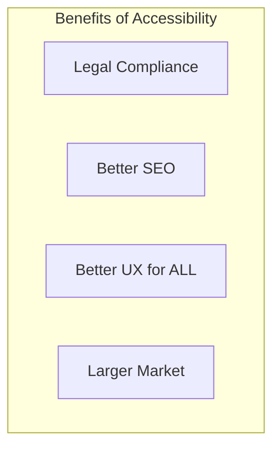
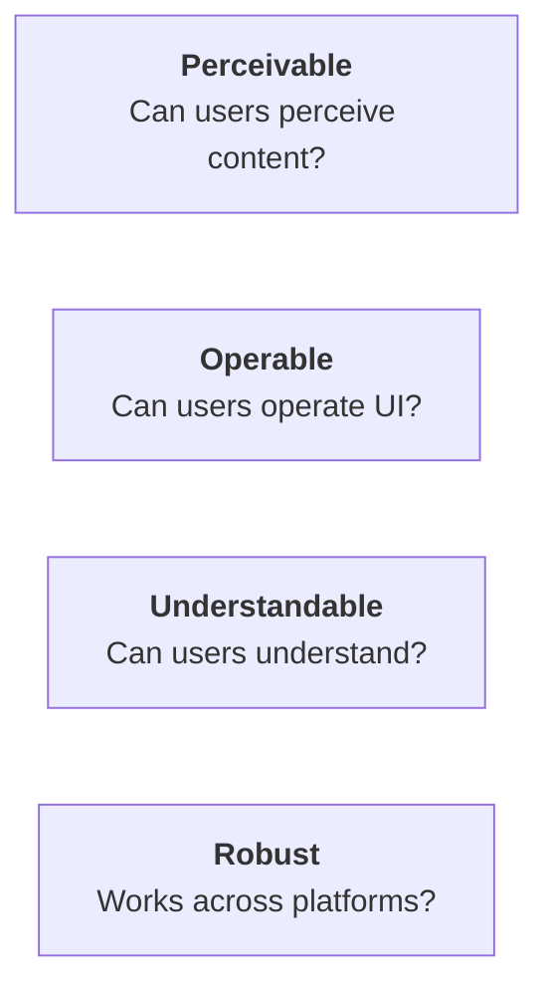

# ♿ MODULE 13: ACCESSIBILITY (a11y)

> **Focus**: 85% Theory
>
> _Accessibility = Making web usable for everyone_
>
> **Phương pháp**: WHAT → WHY → HOW → WHEN

---

## 📋 Trong Module Này

1. [Why Accessibility Matters](#1-why-accessibility)
2. [WCAG Guidelines](#2-wcag-guidelines)
3. [ARIA](#3-aria)
4. [Keyboard Navigation](#4-keyboard-navigation)
5. [Screen Readers](#5-screen-readers)
6. [Testing](#6-testing)

---

## 1. Why Accessibility

### ❓ WHAT - Accessibility là gì?

Designing websites usable by people with disabilities:

- **Visual**: Blind, low vision, color blind
- **Auditory**: Deaf, hard of hearing
- **Motor**: Limited fine motor control
- **Cognitive**: Learning disabilities

### 💡 WHY - Benefits



| Benefit    | Description                           |
| ---------- | ------------------------------------- |
| **Legal**  | ADA, Section 508, EN 301 549          |
| **SEO**    | Semantic HTML helps crawlers          |
| **UX**     | Helps everyone (mobile, slow network) |
| **Market** | 15% of population has disability      |

---

## 2. WCAG Guidelines

### Four Principles (POUR)



### Conformance Levels

| Level   | Description | Required          |
| ------- | ----------- | ----------------- |
| **A**   | Minimum     | Essential         |
| **AA**  | Mid-level   | Most laws require |
| **AAA** | Highest     | Gold standard     |

### Key WCAG Criteria

| Criterion               | Level | Description                |
| ----------------------- | ----- | -------------------------- |
| 1.1.1 Non-text Content  | A     | Alt text for images        |
| 1.4.3 Contrast          | AA    | 4.5:1 ratio                |
| 2.1.1 Keyboard          | A     | All functions via keyboard |
| 2.4.4 Link Purpose      | A     | Clear link text            |
| 4.1.2 Name, Role, Value | A     | ARIA attributes            |

---

## 3. ARIA

### ❓ WHAT - ARIA là gì?

**Accessible Rich Internet Applications** - Attributes to enhance accessibility.

### Key ARIA Attributes

```html
<!-- Role: What is this element? -->
<div role="navigation">...</div>
<div role="alert">Error message</div>

<!-- Properties: Describe characteristics -->
<button aria-label="Close dialog">×</button>
<input aria-required="true" />

<!-- States: Current state -->
<button aria-expanded="false">Menu</button>
<div aria-hidden="true">Decorative</div>
```

### ARIA Rules

1. **Don't use ARIA if HTML has it** - `<button>` over `<div role="button">`
2. **All interactive ARIA needs keyboard** - If clickable, make focusable
3. **No ARIA is better than bad ARIA** - Wrong ARIA is worse

---

## 4. Keyboard Navigation

### Focus Management

```typescript
// Focus trap for modals
function Modal({ isOpen, children }) {
  const modalRef = useRef<HTMLDivElement>(null);

  useEffect(() => {
    if (isOpen) {
      // Focus first element
      modalRef.current?.querySelector("button")?.focus();
    }
  }, [isOpen]);

  return (
    <div ref={modalRef} role="dialog" aria-modal="true">
      {children}
    </div>
  );
}
```

### Key Navigation Patterns

| Key         | Action                    |
| ----------- | ------------------------- |
| Tab         | Move to next focusable    |
| Shift+Tab   | Move to previous          |
| Enter/Space | Activate                  |
| Escape      | Close modal/menu          |
| Arrow keys  | Navigate within component |

---

## 5. Screen Readers

### How Screen Readers Work

1. Parse HTML/ARIA → Accessibility tree
2. Read content in logical order
3. Announce roles, states, names
4. Respond to keyboard navigation

### Writing for Screen Readers

```html
<!-- ❌ Bad: No context -->
<a href="/more">Click here</a>

<!-- ✅ Good: Descriptive -->
<a href="/products">View all products</a>

<!-- ❌ Bad: Image without alt -->


<!-- ✅ Good: Descriptive alt -->


<!-- For decorative images -->

```

---

## 6. Testing

### Testing Tools

| Tool               | Type              | Use                |
| ------------------ | ----------------- | ------------------ |
| **axe-core**       | Automated         | CI/CD testing      |
| **WAVE**           | Browser extension | Visual inspection  |
| **Lighthouse**     | Automated         | Performance + a11y |
| **NVDA/VoiceOver** | Screen reader     | Manual testing     |

### React Testing Example

```typescript
import { axe, toHaveNoViolations } from "jest-axe";

expect.extend(toHaveNoViolations);

test("Form is accessible", async () => {
  const { container } = render(<LoginForm />);
  const results = await axe(container);
  expect(results).toHaveNoViolations();
});
```

---

## 🔗 Deep-Dive Resources

| Topic | Documents                                                                |
| ----- | ------------------------------------------------------------------------ |
| WCAG  | [01-wcag-guidelines.md](../14-accessibility/01-wcag-guidelines.md)       |
| ARIA  | [02-aria-comprehensive.md](../14-accessibility/02-aria-comprehensive.md) |

---

> _Tiếp theo: [Module 14: Advanced & Expert Topics](./14-advanced-expert.md)_
