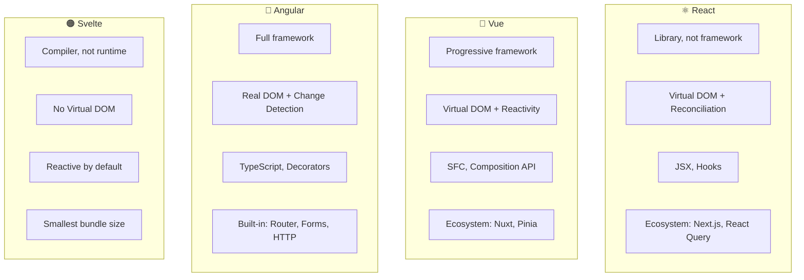
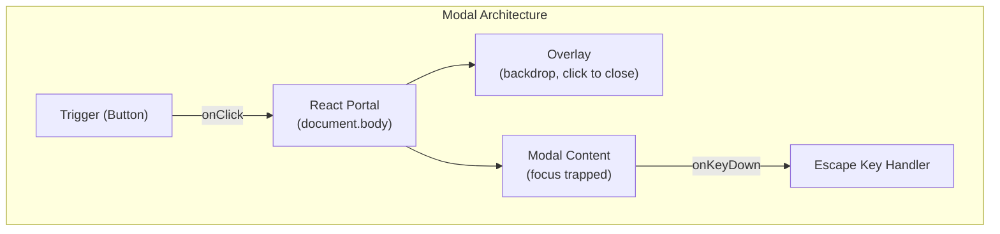
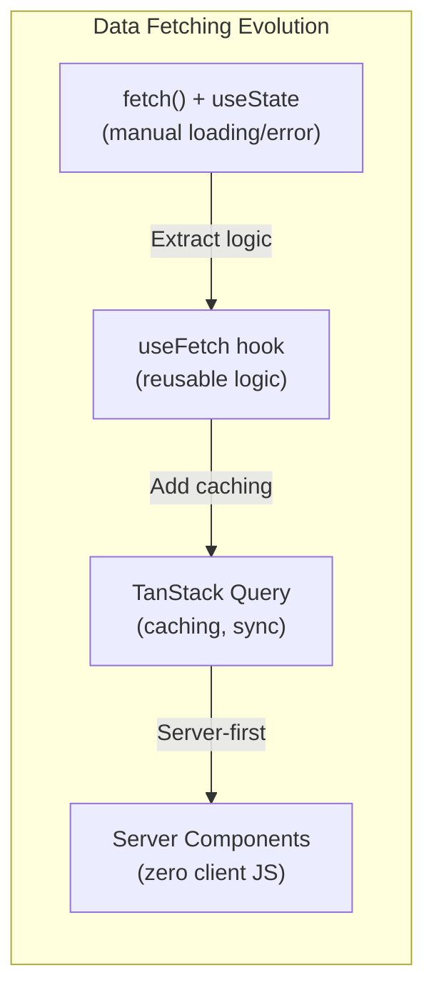
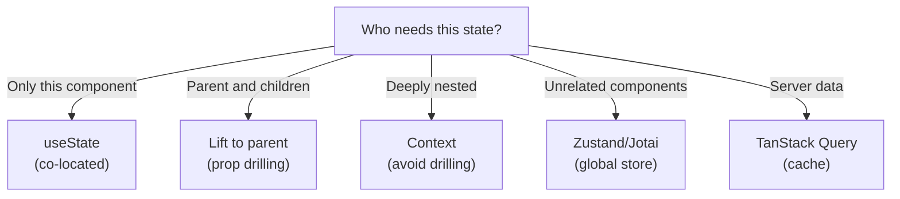
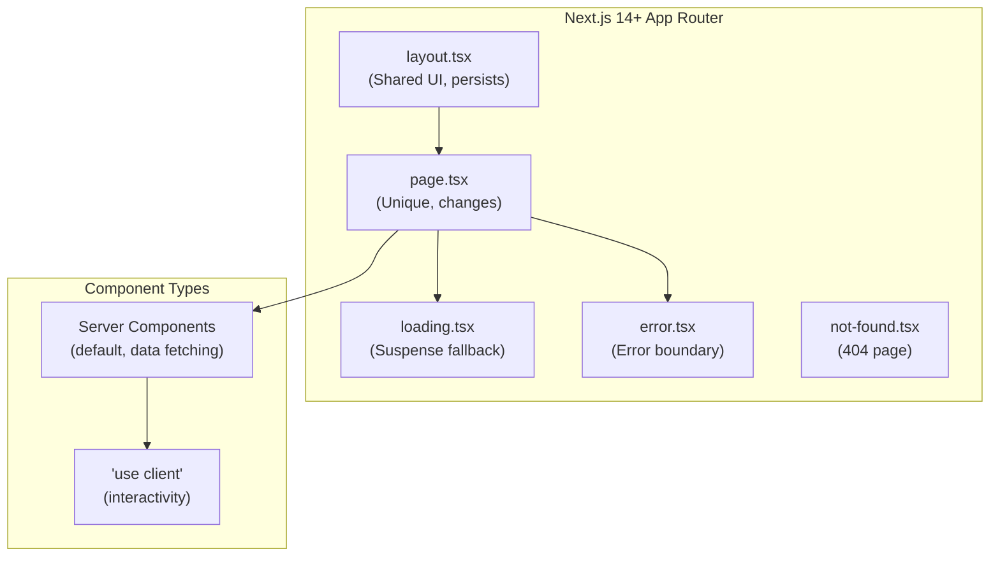
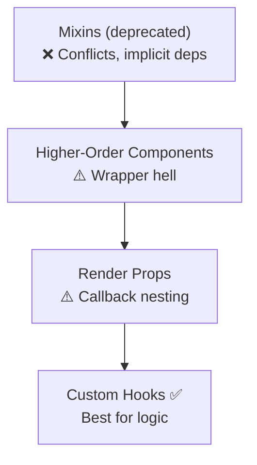

# 🧩 MODULE 6: FRAMEWORK PATTERNS

> **Focus**: 80% Theory - 20% Patterns
>
> _Hiểu WHY đằng sau mỗi pattern_
>
> **Phương pháp**: WHAT → WHY → HOW → WHEN

---

## 📋 Trong Module Này

1. [Framework Comparison](#1-framework-comparison)
2. [UI Component Patterns](#2-ui-component-patterns)
3. [Data Fetching Patterns](#3-data-fetching-patterns)
4. [State Patterns](#4-state-patterns)
5. [Next.js Deep Patterns](#5-nextjs-deep-patterns)
6. [Design Patterns in Frontend](#6-design-patterns-in-frontend)

---

## 1. Framework Comparison

### ❓ WHAT - React vs Vue vs Angular vs Svelte?



### Comparison Matrix

| Aspect             | React          | Vue       | Angular   | Svelte       |
| ------------------ | -------------- | --------- | --------- | ------------ |
| **Type**           | Library        | Framework | Framework | Compiler     |
| **Virtual DOM**    | Yes            | Yes       | No        | No           |
| **Learning Curve** | Medium         | Low       | High      | Low          |
| **Bundle Size**    | ~40KB          | ~30KB     | ~130KB    | ~5KB         |
| **Reactivity**     | Manual (hooks) | Proxies   | Zone.js   | Compile-time |
| **TypeScript**     | Optional       | Optional  | Required  | Optional     |

### 💡 WHY - Khi nào chọn framework nào?

| Scenario                  | Best Choice   | Reason                       |
| ------------------------- | ------------- | ---------------------------- |
| **Large enterprise**      | Angular       | Structure, DI, full-featured |
| **Fast prototyping**      | Vue           | Low learning curve, SFC      |
| **Ecosystem/Jobs**        | React         | Largest community, most jobs |
| **Performance-critical**  | Svelte        | No runtime overhead          |
| **Team knows TypeScript** | Angular/React | Strong TS support            |

---

## 2. UI Component Patterns

### Modal Pattern Theory



### 💡 WHY - Modal Best Practices

| Principle            | Why Needed                     |
| -------------------- | ------------------------------ |
| **Portal**           | Avoids z-index stacking issues |
| **Focus Trap**       | Accessibility - keyboard users |
| **Escape to close**  | Expected user behavior         |
| **Overlay click**    | Common dismissal pattern       |
| **Body scroll lock** | Prevent background scroll      |
| **aria-modal**       | Screen reader support          |

### Compound Components Pattern

```
┌────────────────────────────────────────────────────────────┐
│  COMPOUND COMPONENTS = Implicit State Sharing              │
│                                                            │
│  <Select>                      Components share state      │
│    <Select.Trigger />          via Context internally      │
│    <Select.Options>                                        │
│      <Select.Option />         User doesn't manage         │
│      <Select.Option />         open/close/selection        │
│    </Select.Options>                                       │
│  </Select>                                                 │
│                                                            │
│  WHY: Clean API, encapsulated logic, flexible composition  │
│  EXAMPLES: Radix UI, Headless UI, Reach UI                 │
└────────────────────────────────────────────────────────────┘
```

---

## 3. Data Fetching Patterns

### Evolution of Data Fetching



### 💡 WHY - TanStack Query Mental Model

```
┌────────────────────────────────────────────────────────────┐
│  TanStack Query = SERVER STATE Manager                     │
│  (NOT client state like Redux)                             │
│                                                            │
│  IT HANDLES:                                               │
│  ✓ Caching (don't refetch same data)                      │
│  ✓ Background refetching (keep data fresh)                │
│  ✓ Stale-while-revalidate (show stale, fetch new)         │
│  ✓ Deduplication (many components, one request)           │
│  ✓ Retry logic (automatic on failure)                     │
│  ✓ Pagination/Infinite queries                            │
│  ✓ Optimistic updates                                     │
│                                                            │
│  YOU HANDLE:                                               │
│  ✓ The actual fetch function                               │
│  ✓ Query keys for cache identification                    │
└────────────────────────────────────────────────────────────┘
```

### When to Use What?

| Pattern               | Use When           | Tradeoff         |
| --------------------- | ------------------ | ---------------- |
| **Raw fetch**         | Simple one-off     | No caching       |
| **Custom hook**       | Reusable logic     | Manual cache     |
| **TanStack Query**    | Complex data needs | Library overhead |
| **Server Components** | Initial page data  | No interactivity |

---

## 4. State Patterns

### State Location Decision Tree



### 💡 WHY - useState vs useReducer?

| useState            | useReducer                |
| ------------------- | ------------------------- |
| Simple primitives   | Complex objects           |
| Independent updates | Related state updates     |
| Quick prototyping   | Predictable transitions   |
| Few states          | Many state variables      |
|                     | Testable logic separately |

### Context Best Practices

```
┌────────────────────────────────────────────────────────────┐
│  CONTEXT: Good vs Bad Uses                                 │
│                                                            │
│  ✅ GOOD:                                                  │
│  • Theme (rarely changes)                                  │
│  • Locale (rarely changes)                                 │
│  • Auth user (one object)                                  │
│  • Configuration                                           │
│                                                            │
│  ❌ BAD:                                                   │
│  • Frequently changing data (cause re-renders)             │
│  • Large objects (all consumers re-render)                 │
│  • State that should be lifted                            │
│                                                            │
│  💡 TIP: Split contexts by update frequency                │
└────────────────────────────────────────────────────────────┘
```

---

## 5. Next.js Deep Patterns

### App Router Architecture



### Server vs Client Components

| Capability         | Server Component | Client Component    |
| ------------------ | ---------------- | ------------------- |
| **Fetch data**     | ✅ Direct DB/API | ❌ useEffect needed |
| **useState**       | ❌ No            | ✅ Yes              |
| **useEffect**      | ❌ No            | ✅ Yes              |
| **onClick**        | ❌ No            | ✅ Yes              |
| **Access backend** | ✅ Yes           | ❌ No               |
| **Bundle size**    | 0 KB             | Adds to bundle      |

### 💡 WHY - Server Components Pattern

```
┌────────────────────────────────────────────────────────────┐
│  GOLDEN RULE: Server by default, Client for interactivity  │
│                                                            │
│  1. Start with Server Component (page.tsx)                │
│  2. Fetch data directly (no useEffect)                    │
│  3. Add 'use client' ONLY when you need:                  │
│     - useState, useEffect                                  │
│     - onClick, onChange                                    │
│     - Browser APIs (window, localStorage)                  │
│                                                            │
│  4. Push 'use client' DOWN the tree                        │
│     (Keep more components on server)                       │
└────────────────────────────────────────────────────────────┘
```

---

## 6. Design Patterns in Frontend

### Code Sharing Evolution



### Custom Hooks Pattern

```
┌────────────────────────────────────────────────────────────┐
│  CUSTOM HOOKS = Reusable Stateful Logic                    │
│                                                            │
│  NAMING: Always start with "use"                           │
│                                                            │
│  EXAMPLES:                                                 │
│  • useLocalStorage - Sync with localStorage                │
│  • useDebounce - Debounce a value                         │
│  • useMediaQuery - Track media query                       │
│  • useOnClickOutside - Detect outside clicks              │
│  • useFetch - Data fetching logic                         │
│                                                            │
│  WHY CUSTOM HOOKS:                                         │
│  ✓ Extract and share logic                                 │
│  ✓ Compose multiple hooks                                  │
│  ✓ Test in isolation                                       │
│  ✓ No wrapper components                                   │
└────────────────────────────────────────────────────────────┘
```

---

## 📊 Summary - Patterns Mental Models

| Pattern                 | Mental Model                                        |
| ----------------------- | --------------------------------------------------- |
| **Compound Components** | Components that work together, share implicit state |
| **TanStack Query**      | Server state cache manager                          |
| **Server Components**   | Render on server, zero client JS                    |
| **Custom Hooks**        | Extract and reuse stateful logic                    |
| **Context**             | Avoid prop drilling for rarely-changing data        |

---

## 🔗 Cross-References

| Topic               | Related Module                                        |
| ------------------- | ----------------------------------------------------- |
| React Philosophy    | [Module 3: React](./03-react-philosophy.md)           |
| TypeScript Patterns | [Module 5: TypeScript](./05-typescript-theory.md)     |
| Architecture        | [Module 4: Architecture](./04-architecture-theory.md) |

---

## 🔗 Navigation

| Prev                                           | Module                    | Next                                                   |
| ---------------------------------------------- | ------------------------- | ------------------------------------------------------ |
| [TypeScript Theory](./05-typescript-theory.md) | **6. Framework Patterns** | [Performance & Security](./07-performance-security.md) |

---

> _Tiếp theo: [Module 7: Performance & Security](./07-performance-security.md)_
