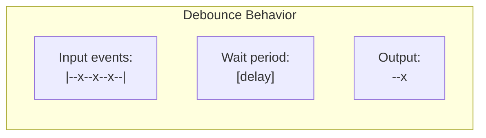
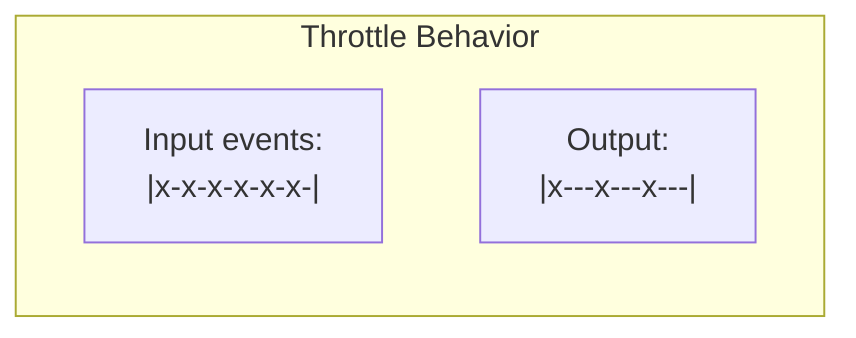
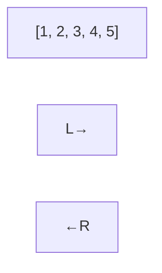

# 💻 MODULE 9: CODING PRACTICE

> **Focus**: 50% Theory - 50% Code
>
> _Mỗi pattern có giải thích WHY đằng sau_
>
> **Phương pháp**: Pattern → WHY → Implementation → When to Use

---

## 📋 Trong Module Này

1. [Interview Challenge Patterns](#1-interview-challenge-patterns)
2. [JavaScript Polyfills](#2-javascript-polyfills)
3. [Custom React Hooks](#3-custom-react-hooks)
4. [Algorithm Patterns](#4-algorithm-patterns)

---

## 1. Interview Challenge Patterns

### Debounce Pattern



**WHY**: Prevents excessive function calls during rapid user input (search, resize)

```javascript
function debounce(fn, delay) {
  let timeoutId;
  return function (...args) {
    clearTimeout(timeoutId);
    timeoutId = setTimeout(() => fn.apply(this, args), delay);
  };
}

// Usage: Search input - only fetch after user stops typing
const search = debounce((query) => fetchResults(query), 300);
```

### Throttle Pattern



**WHY**: Limits execution rate for continuous events (scroll, resize)

```javascript
function throttle(fn, limit) {
  let inThrottle;
  return function (...args) {
    if (!inThrottle) {
      fn.apply(this, args);
      inThrottle = true;
      setTimeout(() => (inThrottle = false), limit);
    }
  };
}

// Usage: Scroll handler - update at most every 100ms
window.addEventListener("scroll", throttle(handleScroll, 100));
```

### Deep Clone Pattern

**WHY**: JavaScript objects are passed by reference. Deep clone creates fully independent copy.

```javascript
function deepClone(obj, seen = new WeakMap()) {
  // Handle primitives and null
  if (obj === null || typeof obj !== "object") return obj;

  // Handle circular references
  if (seen.has(obj)) return seen.get(obj);

  // Handle special objects
  if (obj instanceof Date) return new Date(obj);
  if (obj instanceof RegExp) return new RegExp(obj);

  // Handle Arrays and Objects
  const clone = Array.isArray(obj) ? [] : {};
  seen.set(obj, clone);

  for (const key in obj) {
    if (obj.hasOwnProperty(key)) {
      clone[key] = deepClone(obj[key], seen);
    }
  }
  return clone;
}
```

---

## 2. JavaScript Polyfills

### 💡 WHY Learn Polyfills?

```
┌────────────────────────────────────────────────────────────┐
│  POLYFILL LEARNING VALUE:                                  │
│                                                            │
│  1. Understand HOW native methods work internally          │
│  2. Common interview questions                             │
│  3. Deepens understanding of prototype chain              │
│  4. Shows understanding of edge cases                      │
└────────────────────────────────────────────────────────────┘
```

### Array.prototype.map

**Contract**: Transform each element, return new array of same length

```javascript
Array.prototype.myMap = function (callback, thisArg) {
  const result = [];
  for (let i = 0; i < this.length; i++) {
    if (i in this) {
      // Handle sparse arrays: [1,,3]
      result[i] = callback.call(thisArg, this[i], i, this);
    }
  }
  return result;
};
```

### Array.prototype.reduce

**Contract**: Accumulate array into single value

```javascript
Array.prototype.myReduce = function (callback, initialValue) {
  let accumulator = initialValue;
  let startIndex = 0;

  // If no initial value, use first element
  if (initialValue === undefined) {
    if (this.length === 0) throw new TypeError("Reduce of empty array");
    accumulator = this[0];
    startIndex = 1;
  }

  for (let i = startIndex; i < this.length; i++) {
    if (i in this) {
      accumulator = callback(accumulator, this[i], i, this);
    }
  }
  return accumulator;
};
```

### Promise.all

**Contract**: Wait for all promises, fail on first rejection

```javascript
Promise.myAll = function (promises) {
  return new Promise((resolve, reject) => {
    const results = [];
    let completed = 0;

    if (promises.length === 0) {
      resolve([]);
      return;
    }

    promises.forEach((promise, index) => {
      Promise.resolve(promise) // Handle non-promise values
        .then((value) => {
          results[index] = value; // Maintain order
          completed++;
          if (completed === promises.length) {
            resolve(results);
          }
        })
        .catch(reject); // First rejection rejects all
    });
  });
};
```

---

## 3. Custom React Hooks

### useDebounce Hook

**WHY**: Common pattern for search inputs, form validation

```javascript
function useDebounce(value, delay) {
  const [debouncedValue, setDebouncedValue] = useState(value);

  useEffect(() => {
    const timer = setTimeout(() => setDebouncedValue(value), delay);
    return () => clearTimeout(timer); // Cleanup on value change
  }, [value, delay]);

  return debouncedValue;
}

// Usage
function Search() {
  const [query, setQuery] = useState("");
  const debouncedQuery = useDebounce(query, 300);

  useEffect(() => {
    if (debouncedQuery) fetchResults(debouncedQuery);
  }, [debouncedQuery]); // Only fetch when debounced value changes
}
```

### usePrevious Hook

**WHY**: React doesn't natively track previous values

```javascript
function usePrevious(value) {
  const ref = useRef();

  useEffect(() => {
    ref.current = value; // Update AFTER render
  }, [value]);

  return ref.current; // Return previous value during render
}

// Usage: Compare current vs previous
const prevCount = usePrevious(count);
if (prevCount !== count) {
  // Count changed
}
```

### useLocalStorage Hook

**WHY**: Sync React state with localStorage for persistence

```javascript
function useLocalStorage(key, initialValue) {
  // Lazy initialization - only read localStorage once
  const [storedValue, setStoredValue] = useState(() => {
    try {
      const item = localStorage.getItem(key);
      return item ? JSON.parse(item) : initialValue;
    } catch {
      return initialValue;
    }
  });

  const setValue = (value) => {
    const valueToStore = value instanceof Function ? value(storedValue) : value;
    setStoredValue(valueToStore);
    localStorage.setItem(key, JSON.stringify(valueToStore));
  };

  return [storedValue, setValue];
}
```

---

## 4. Algorithm Patterns

### Two Pointers Pattern

**WHY**: O(n) solution for problems involving sorted arrays or linked lists



```javascript
// Palindrome check: O(n) time, O(1) space
function isPalindrome(s) {
  let left = 0,
    right = s.length - 1;
  while (left < right) {
    if (s[left] !== s[right]) return false;
    left++;
    right--;
  }
  return true;
}

// Two sum (sorted): O(n) time, O(1) space
function twoSumSorted(arr, target) {
  let left = 0,
    right = arr.length - 1;
  while (left < right) {
    const sum = arr[left] + arr[right];
    if (sum === target) return [left, right];
    if (sum < target) left++;
    else right--;
  }
  return [];
}
```

### Sliding Window Pattern

**WHY**: O(n) solution for contiguous subarray problems

```javascript
// Max sum of k consecutive elements
function maxSumSubarray(arr, k) {
  let maxSum = 0,
    windowSum = 0;

  // Build first window
  for (let i = 0; i < k; i++) {
    windowSum += arr[i];
  }
  maxSum = windowSum;

  // Slide window: remove left, add right
  for (let i = k; i < arr.length; i++) {
    windowSum = windowSum - arr[i - k] + arr[i];
    maxSum = Math.max(maxSum, windowSum);
  }

  return maxSum;
}
```

### Hash Map Pattern

**WHY**: O(1) lookup trades space for time

```javascript
// Two sum (unsorted): O(n) time, O(n) space
function twoSum(nums, target) {
  const map = new Map();
  for (let i = 0; i < nums.length; i++) {
    const complement = target - nums[i];
    if (map.has(complement)) {
      return [map.get(complement), i];
    }
    map.set(nums[i], i);
  }
  return [];
}
```

---

## 📊 Complexity Reference

| Pattern            | Time     | Space | Use When            |
| ------------------ | -------- | ----- | ------------------- |
| **Two Pointers**   | O(n)     | O(1)  | Sorted array, pairs |
| **Sliding Window** | O(n)     | O(1)  | Contiguous subarray |
| **Hash Map**       | O(n)     | O(n)  | Need O(1) lookup    |
| **Binary Search**  | O(log n) | O(1)  | Sorted, find target |

---

## 🔗 Navigation

| Prev                                       | Module                 | Next                                     |
| ------------------------------------------ | ---------------------- | ---------------------------------------- |
| [Testing & DevOps](./08-testing-devops.md) | **9. Coding Practice** | [Interview Prep](./10-interview-prep.md) |

---

> _Tiếp theo: [Module 10: Interview Preparation](./10-interview-prep.md)_
