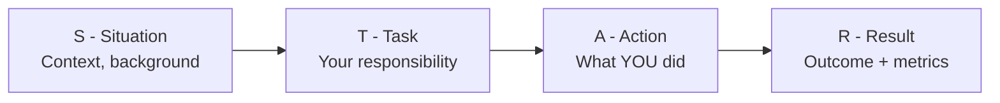
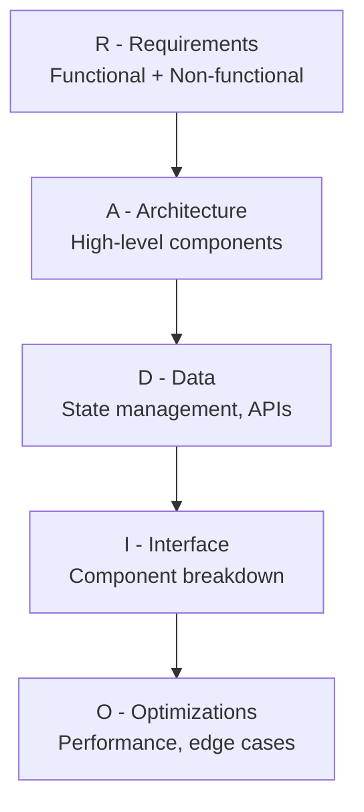

# 🎯 MODULE 10: INTERVIEW PREPARATION

> **Focus**: Theory-backed Q&A Format
>
> _Câu hỏi thực tế với giải thích BACKGROUND_
>
> **Phương pháp**: Question → WHY Asked → Answer → Follow-up

---

## 📋 Trong Module Này

1. [Technical Questions](#1-technical-questions)
2. [Behavioral Questions](#2-behavioral-questions)
3. [System Design Questions](#3-system-design-questions)
4. [Questions to Ask Interviewer](#4-questions-to-ask-interviewer)

---

## 1. Technical Questions

### JavaScript Core

<details>
<summary><strong>Q: Explain Event Loop</strong></summary>

**WHY Asked**: Tests deep understanding of JS async, not just API usage

**Answer**:
Event Loop là cơ chế cho phép JS single-threaded xử lý async operations.

```
Execution order:
1. Sync code (Call Stack)
2. ALL Microtasks (Promise.then, queueMicrotask)
3. ONE Macrotask (setTimeout, setInterval)
4. Repeat 2-3
```

**Key Insight**: Microtasks run before macrotasks because they're for continuation of current task (Promise chains).

**Follow-up**: "What happens if microtask queue never empties?"
→ UI freeze, macrotasks starved

</details>

<details>
<summary><strong>Q: What is Closure?</strong></summary>

**WHY Asked**: Fundamental to understanding scope, modules, hooks

**Answer**:
Closure = Function + reference to its lexical environment

```javascript
function outer() {
  let x = 10;
  return function inner() {
    return x; // inner "closes over" x
  };
}
const fn = outer();
fn(); // 10 - x still accessible
```

**Mental Model**: Function carries a "backpack" with variables from outer scopes.

**Use Cases**:

- Private variables
- Function factories
- React hooks (useState stores in closure)

</details>

<details>
<summary><strong>Q: == vs ===</strong></summary>

**WHY Asked**: Tests awareness of type coercion pitfalls

**Answer**:

- `==` : Loose equality, performs type coercion
- `===` : Strict equality, no coercion

```javascript
"5" == 5; // true (string coerced to number)
"5" === 5; // false (different types)
```

**Best Practice**: Always use `===` to avoid unexpected behavior

</details>

### React

<details>
<summary><strong>Q: Why use keys in lists?</strong></summary>

**WHY Asked**: Tests understanding of reconciliation algorithm

**Answer**:
Keys help React's O(n) diffing algorithm identify elements across renders.

**Without stable keys**:

- Performance: React re-renders entire list
- State bugs: Local state associates with wrong items

**Rule**:

- ✅ Use stable unique IDs (database ID)
- ❌ Don't use array index (breaks on reorder)

</details>

<details>
<summary><strong>Q: useEffect vs useLayoutEffect</strong></summary>

**WHY Asked**: Tests understanding of browser paint cycle

**Answer**:
| | useEffect | useLayoutEffect |
|---|---|---|
| **When** | After browser paint | Before browser paint |
| **Use case** | Data fetching, subscriptions | DOM measurements, prevent flicker |
| **Blocking** | No | Yes (blocks visual update) |

**Default**: useEffect (95% of cases)
**Use Layout**: Only when you see visual "flash" or need synchronous DOM read

</details>

<details>
<summary><strong>Q: How to optimize React performance?</strong></summary>

**WHY Asked**: Tests practical performance knowledge

**Answer** (in priority order):

1. **Measure first** - React DevTools Profiler
2. **React.memo** - Prevent re-render if props unchanged
3. **useMemo/useCallback** - Stabilize references
4. **Code splitting** - React.lazy per route
5. **Virtualization** - react-virtual for long lists

**Key Principle**: "Premature optimization is root of all evil"

</details>

### TypeScript

<details>
<summary><strong>Q: interface vs type</strong></summary>

**WHY Asked**: Tests understanding of TypeScript design choices

**Answer**:
| interface | type |
|---|---|
| Extendable (`extends`) | Intersection (`&`) |
| Declaration merging ✅ | No merging |
| Objects, classes | Unions, tuples, primitives |

**Rule of Thumb**:

- `interface` for object shapes
- `type` for unions, computed types

</details>

---

## 2. Behavioral Questions

### STAR Method Framework



### Common Questions

<details>
<summary><strong>Q: Tell me about a challenging project</strong></summary>

**Framework**:

- **S**: "At X company, we had a legacy jQuery app with 60s page loads"
- **T**: "I was tasked with modernizing the frontend"
- **A**: "I proposed React migration, created component library, implemented code splitting"
- **R**: "50% load reduction, 0 regression bugs, team adopted new stack"

**Tips**:

- Focus on YOUR contributions, not team's
- Include specific metrics
- Show problem-solving process

</details>

<details>
<summary><strong>Q: How do you handle disagreements?</strong></summary>

**Framework Answer**:

1. **Listen** to understand, not respond
2. **Ask** clarifying questions
3. **Present** data/evidence for your view
4. **Propose** experiments if uncertain
5. **Commit** to decision once made

**Key**: Show you're collaborative, not combative

</details>

<details>
<summary><strong>Q: How do you stay updated?</strong></summary>

**Good Answer Structure**:

- **Passive**: JavaScript Weekly, React Status newsletters
- **Active**: Side projects trying new libraries
- **Deep**: Reading library source code (React, Vue)
- **Community**: Local meetups, Twitter/X follows

</details>

---

## 3. System Design Questions

### RADIO Framework



### Example: Design Autocomplete

<details>
<summary><strong>Full Walkthrough</strong></summary>

**R - Requirements** (ask clarifying questions!):

- Functional: Search input, dropdown suggestions, keyboard navigation
- Non-functional: < 100ms response, 10k+ results possible

**A - Architecture**:

```
┌─────────────────────────────────────┐
│ SearchAutocomplete                   │
│  ├── Input (controlled)              │
│  ├── Suggestions (dropdown)          │
│  └── Loading/Error states            │
└─────────────────────────────────────┘
         │
         ▼ (debounced)
┌─────────────────────────────────────┐
│ API: GET /search?q={query}          │
│ Response: { suggestions: string[] }  │
└─────────────────────────────────────┘
```

**D - Data**:

- Local state: query, isOpen, selectedIndex
- Server state: suggestions (TanStack Query for caching)

**I - Key Considerations**:

- Debounce 300ms
- Cancel previous requests (AbortController)
- Keyboard: arrow keys, enter, escape
- a11y: aria-autocomplete, aria-expanded

**O - Optimizations**:

- Cache previous queries
- Virtualize long lists
- Highlight matching text

</details>

---

## 4. Questions to Ask Interviewer

### Team & Culture

- How is the frontend team structured?
- What does a typical sprint look like?
- How do you handle technical debt?

### Technology

- What's the biggest technical challenge right now?
- How do you make architectural decisions?
- What's on your tech radar for next year?

### Growth

- How does performance review work?
- What learning resources are available?
- What does career progression look like?

---

## 📋 Interview Checklist

```
BEFORE:
□ Research company products
□ Review job description keywords
□ Prepare 3-5 STAR stories
□ Prepare 3+ questions to ask
□ Test audio/video setup (remote)

DURING:
□ Ask clarifying questions first
□ Think out loud
□ Admit knowledge gaps honestly
□ Show enthusiasm

AFTER:
□ Send thank you email (24h)
□ Note questions asked for next time
□ Reflect on improvements
```

---

## 📖 Deep-Dive Resources

### Interview Practice (6 files)

| Type                      | Documents                                                                                                                                                                              |
| ------------------------- | -------------------------------------------------------------------------------------------------------------------------------------------------------------------------------------- |
| **JavaScript Challenges** | [01-javascript-challenges.md](../11-interview-practice/01-javascript-challenges.md), [01-javascript-coding-challenges.md](../11-interview-practice/01-javascript-coding-challenges.md) |
| **React Challenges**      | [02-react-challenges.md](../11-interview-practice/02-react-challenges.md), [02-react-coding-challenges.md](../11-interview-practice/02-react-coding-challenges.md)                     |
| **System Design**         | [03-system-design-questions.md](../11-interview-practice/03-system-design-questions.md), [06-frontend-system-design.md](../11-interview-practice/06-frontend-system-design.md)         |
| **Coding Patterns**       | [04-coding-patterns.md](../11-interview-practice/04-coding-patterns.md)                                                                                                                |
| **Behavioral**            | [05-behavioral-questions.md](../11-interview-practice/05-behavioral-questions.md)                                                                                                      |

### 🎯 Big Tech Specific Resources

| Company          | Focus Areas                  | Priority Documents                                                                                                                                                             |
| ---------------- | ---------------------------- | ------------------------------------------------------------------------------------------------------------------------------------------------------------------------------ |
| **🔵 Meta**      | React internals, Performance | [02-virtual-dom-reconciliation.md](../18-advanced-theory/02-virtual-dom-reconciliation.md), [09-performance-optimization.md](../03-react/09-performance-optimization.md)       |
| **🔴 Google**    | Algorithms, Web fundamentals | [07-algorithms-comprehensive.md](../10-computer-science/07-algorithms-comprehensive.md), [06-browser-architecture-theory.md](../06-web-apis/06-browser-architecture-theory.md) |
| **🟢 Microsoft** | TypeScript, Testing          | [04-typescript-comprehensive.md](../02-typescript/04-typescript-comprehensive.md), [04-testing-strategies-advanced.md](../19-expert-topics/04-testing-strategies-advanced.md)  |
| **🟠 Amazon**    | System Design, Leadership    | [06-system-design-comprehensive.md](../09-system-design/06-system-design-comprehensive.md), [05-behavioral-questions.md](../11-interview-practice/05-behavioral-questions.md)  |
| **🟣 Grab/Uber** | Performance, Real-time       | [04-web-performance-comprehensive.md](../08-performance/04-web-performance-comprehensive.md), [03-websockets.md](../06-web-apis/03-websockets.md)                              |

### Expert Level (Senior+)

| Topic                       | Documents                                                                                    |
| --------------------------- | -------------------------------------------------------------------------------------------- |
| **Distributed Systems**     | [01-distributed-frontend-systems.md](../19-expert-topics/01-distributed-frontend-systems.md) |
| **Performance Engineering** | [02-performance-engineering.md](../19-expert-topics/02-performance-engineering.md)           |
| **Security Architecture**   | [03-security-architecture.md](../19-expert-topics/03-security-architecture.md)               |
| **Testing Strategies**      | [04-testing-strategies-advanced.md](../19-expert-topics/04-testing-strategies-advanced.md)   |

---

## 🔗 Navigation

| Prev                                       | Module                 | Next                                       |
| ------------------------------------------ | ---------------------- | ------------------------------------------ |
| [Coding Practice](./09-coding-practice.md) | **10. Interview Prep** | [Quick Reference](./11-quick-reference.md) |

---

> _Tiếp theo: [Module 11: Quick Reference](./11-quick-reference.md)_
