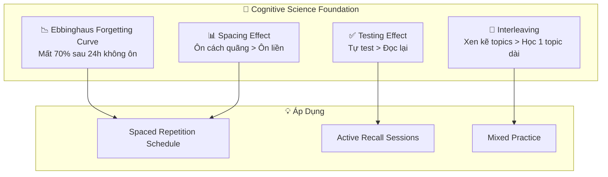
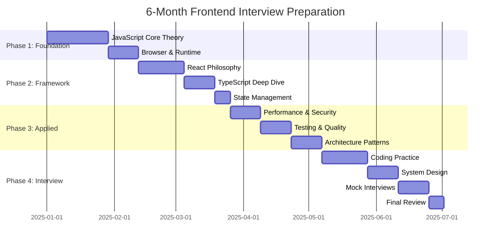
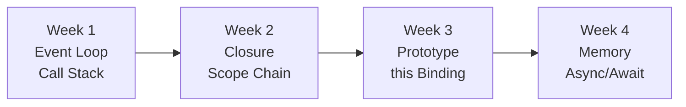
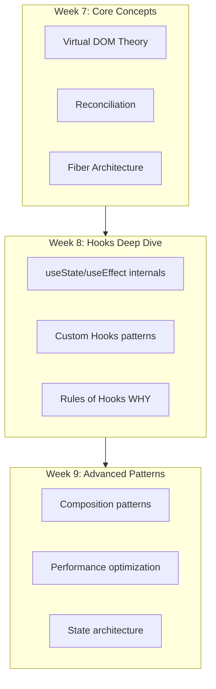
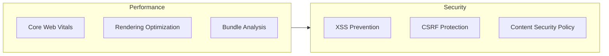
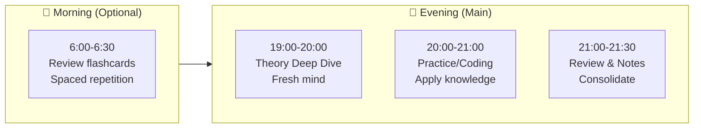
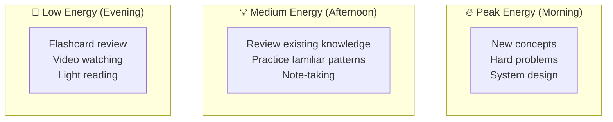
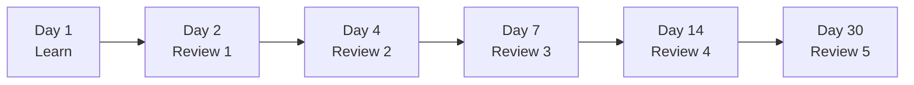
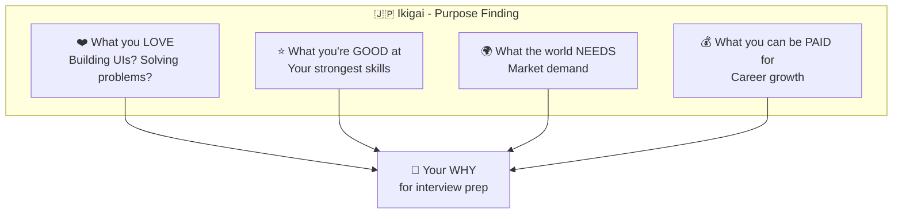
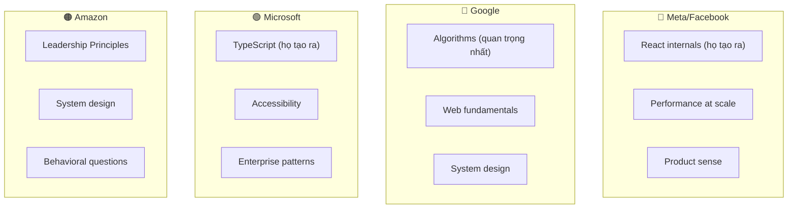

# 📅 MODULE 12: LEARNING MANAGEMENT SYSTEM

> **Focus**: 90% Methodology & Strategy
>
> _"Không phải học nhiều hơn, mà là học THÔNG MINH hơn"_
>
> **Core Principle**: Evidence-based learning + Sustainable practice

---

## 📋 Trong Module Này

1. [Khoa Học Học Tập](#1-khoa-học-học-tập)
2. [Lộ Trình 6 Tháng - Chi Tiết](#2-lộ-trình-6-tháng---chi-tiết)
3. [Quản Lý Năng Lượng & Thời Gian](#3-quản-lý-năng-lượng--thời-gian)
4. [Hệ Thống Tracking & Đánh Giá](#4-hệ-thống-tracking--đánh-giá)
5. [Động Lực & Phục Hồi](#5-động-lực--phục-hồi)
6. [Big Tech Company Strategies](#6-big-tech-company-strategies)

> 📋 **Xem thêm:** [Module 12B: Detailed Process](./12b-detailed-process.md) - Quy trình chi tiết từng ngày/tuần

---

## 1. Khoa Học Học Tập

### 🧠 Evidence-Based Learning Strategies



### Phương Pháp Học Từ Top Universities

| University         | Phương Pháp            | Áp Dụng Cho Interview Prep                 |
| ------------------ | ---------------------- | ------------------------------------------ |
| **Harvard**        | Active Recall          | Sau mỗi section, đóng tài liệu và viết lại |
| **Cambridge**      | Deep Understanding     | WHAT-WHY-HOW-WHEN cho mỗi concept          |
| **Oxford**         | Tutorial System        | Mock interview với peer/mentor             |
| **Japan (Kaizen)** | Continuous Improvement | Daily 1% improvement tracking              |

### Feynman Technique - Học Sâu

```
┌────────────────────────────────────────────────────────────────┐
│  FEYNMAN TECHNIQUE - 4 STEPS                                   │
├────────────────────────────────────────────────────────────────┤
│  1. STUDY concept (Event Loop, Closure, etc.)                  │
│                                                                │
│  2. TEACH to imaginary beginner                                │
│     - Dùng ngôn ngữ đơn giản                                  │
│     - Không dùng jargon                                       │
│                                                                │
│  3. IDENTIFY gaps                                              │
│     - Chỗ nào bạn khựng lại?                                  │
│     - Chỗ nào giải thích không rõ?                            │
│                                                                │
│  4. SIMPLIFY và lặp lại                                        │
│     - Quay lại học phần đó                                    │
│     - Tạo analogy mới                                         │
└────────────────────────────────────────────────────────────────┘
```

---

## 2. Lộ Trình 6 Tháng - Chi Tiết

### 📊 Overview - 24 Weeks Plan



---

### 📅 Phase 1: Foundation (Tuần 1-6)

#### Tuần 1-4: JavaScript Core Theory



| Tuần | Focus Topics            | Theory Hours | Practice Hours | Deliverables                              |
| ---- | ----------------------- | ------------ | -------------- | ----------------------------------------- |
| 1    | Event Loop, Call Stack  | 8h           | 2h             | Vẽ được Event Loop diagram từ trí nhớ     |
| 2    | Closure, Scope Chain    | 8h           | 2h             | Giải thích được stale closure trong React |
| 3    | Prototype, this Binding | 8h           | 2h             | Viết được class từ prototype              |
| 4    | Memory, GC, Async       | 8h           | 2h             | Nhận diện memory leak patterns            |

**Weekly Review Template:**

```markdown
## Week X Review

### Concepts Mastered

- [ ] Có thể giải thích cho người mới mà không cần notes
- [ ] Có thể vẽ diagram từ trí nhớ
- [ ] Có thể answer interview questions tự tin

### Gaps Identified

- [ ] Concept nào cần ôn lại?
- [ ] Question nào trả lời chưa tốt?

### Next Week Adjustment

- Focus thêm vào: \_\_\_
- Giảm bớt thời gian cho: \_\_\_
```

#### Tuần 5-6: Browser & Runtime

| Tuần | Focus Topics                         | Theory Hours | Practice Hours |
| ---- | ------------------------------------ | ------------ | -------------- |
| 5    | DOM, CSSOM, Rendering Pipeline       | 8h           | 2h             |
| 6    | Critical Rendering Path, Performance | 8h           | 2h             |

---

### 📅 Phase 2: Framework Mastery (Tuần 7-12)

#### Tuần 7-9: React Philosophy



#### Tuần 10-11: TypeScript Deep Dive

| Tuần | Focus Topics                 | Goals                                          |
| ---- | ---------------------------- | ---------------------------------------------- |
| 10   | Type System Theory, Generics | Hiểu structural typing, write complex generics |
| 11   | Advanced Types, React + TS   | Type inference, discriminated unions           |

#### Tuần 12: State Management

- Redux Toolkit internals
- Zustand/Jotai comparison
- Server State (TanStack Query)

---

### 📅 Phase 3: Applied Knowledge (Tuần 13-18)

#### Tuần 13-14: Performance & Security



#### Tuần 15-16: Testing & Quality

- Testing Philosophy (TDD, BDD)
- Jest/RTL deep patterns
- E2E với Playwright

#### Tuần 17-18: Architecture Patterns

- Design Patterns trong Frontend
- Micro-frontends theory
- System design fundamentals

---

### 📅 Phase 4: Interview Prep (Tuần 19-24)

#### Tuần 19-21: Coding Practice

```
┌────────────────────────────────────────────────────────────────┐
│  DELIBERATE PRACTICE SCHEDULE                                  │
├────────────────────────────────────────────────────────────────┤
│  Week 19: JavaScript Challenges                                │
│    - Polyfills (map, reduce, Promise.all)                     │
│    - Debounce, throttle, deep clone                           │
│    - 2-3 problems/day                                         │
│                                                                │
│  Week 20: React Challenges                                     │
│    - Custom hooks implementation                               │
│    - Component from scratch (autocomplete, modal)             │
│    - 1-2 components/day                                       │
│                                                                │
│  Week 21: Algorithm Patterns                                   │
│    - Two pointers, sliding window                             │
│    - Hash map, binary search                                  │
│    - 2-3 problems/day                                         │
└────────────────────────────────────────────────────────────────┘
```

#### Tuần 22-23: System Design & Mock Interviews

| Tuần | Activities                                               |
| ---- | -------------------------------------------------------- |
| 22   | System Design practice (2 designs/week), RADIO framework |
| 23   | Mock interviews với peers, behavioral prep               |

#### Tuần 24: Final Sprint

- Review weak areas
- Company-specific prep
- Rest before interviews

---

## 3. Quản Lý Năng Lượng & Thời Gian

### 🌅 Daily Schedule Templates

#### Working Professional (2-3h/day)



#### Full-Time Prep (6-8h/day)

| Time        | Activity                     | Brain State  |
| ----------- | ---------------------------- | ------------ |
| 08:00-10:00 | Deep Theory (hardest topics) | Peak focus   |
| 10:00-10:30 | Break + Walk                 | Recovery     |
| 10:30-12:00 | Coding Practice              | High focus   |
| 12:00-13:00 | Lunch + Nap                  | Recovery     |
| 13:00-15:00 | Review + Notes               | Medium focus |
| 15:00-15:30 | Break                        | Recovery     |
| 15:30-17:00 | Mock interview / Project     | Active       |
| 17:00-18:00 | Spaced repetition            | Low focus OK |

### ⚡ Energy Management



### 🍅 Pomodoro Adaptation for Coding

```
CODING POMODORO (không standard 25min)

Deep Theory:    45 min work → 10 min break
Coding:         50 min work → 10 min break
Review:         25 min work → 5 min break

WHY longer for coding?
- Context switching expensive
- Need time to get into "flow"
- Stopping mid-problem is frustrating
```

---

## 4. Hệ Thống Tracking & Đánh Giá

### 📊 Weekly Progress Tracker

```markdown
## Week X/24 Progress

### Knowledge Completion

| Module           | Progress  | Confidence |
| ---------------- | --------- | ---------- |
| JavaScript Core  | ▓▓▓▓░ 80% | ⭐⭐⭐⭐   |
| React Philosophy | ▓▓▓░░ 60% | ⭐⭐⭐     |
| TypeScript       | ▓▓░░░ 40% | ⭐⭐       |

### Practice Stats

- Problems solved: X/week target
- Mock interviews: X completed
- Concepts taught to others: X

### Confidence Levels

- 🔴 Cannot explain without notes
- 🟡 Can explain with some hesitation
- 🟢 Can explain confidently + answer follow-ups
```

### Self-Assessment Rubric

| Level              | Description                             | Interview Ready? |
| ------------------ | --------------------------------------- | ---------------- |
| **1 - Aware**      | Heard of concept, can't explain         | ❌ No            |
| **2 - Familiar**   | Can explain basic idea with notes       | ❌ No            |
| **3 - Competent**  | Can explain WHY and HOW                 | 🟡 Maybe         |
| **4 - Proficient** | Can teach to others, handle follow-ups  | ✅ Yes           |
| **5 - Expert**     | Can debate trade-offs, create analogies | ✅ Strong        |

### Spaced Repetition Schedule



---

## 5. Động Lực & Phục Hồi

### 🎯 Ikigai Framework cho Interview Prep



### Burnout Prevention Strategies

```
┌────────────────────────────────────────────────────────────────┐
│  🛑 BURNOUT WARNING SIGNS                                      │
├────────────────────────────────────────────────────────────────┤
│  • Dreading study sessions                                     │
│  • Feeling like you're not making progress                     │
│  • Physical exhaustion                                         │
│  • Irritability                                                │
│  • Loss of motivation                                          │
├────────────────────────────────────────────────────────────────┤
│  ✅ PREVENTION ACTIONS                                         │
├────────────────────────────────────────────────────────────────┤
│  1. Mandatory rest days (1-2/week)                            │
│  2. Exercise (releases BDNF - brain growth factor)            │
│  3. Sleep 7-8h (memory consolidation happens)                 │
│  4. Social activities (dopamine reset)                        │
│  5. Celebrate small wins                                       │
└────────────────────────────────────────────────────────────────┘
```

### Celebration Milestones

| Milestone                     | Celebration                     |
| ----------------------------- | ------------------------------- |
| Complete Phase 1 (Foundation) | Day off + something enjoyable   |
| First mock interview          | Treat yourself                  |
| Reach 10 problems solved      | Share progress with friend      |
| Complete Phase 3              | Weekend break                   |
| First real interview          | Celebrate regardless of outcome |
| Get offer                     | You deserve it! 🎉              |

---

## 6. Big Tech Company Strategies

### Company-Specific Focus



### Interview Format Comparison

| Company       | Rounds | Focus Areas                       | Uniqueness                     |
| ------------- | ------ | --------------------------------- | ------------------------------ |
| **Meta**      | 5-6    | React, Performance, System Design | Product Architecture round     |
| **Google**    | 4-5    | Algorithms, Web, Googleyness      | Strong emphasis on algorithms  |
| **Microsoft** | 4-5    | TypeScript, Design, Behavioral    | As Appropriate (AA) bar raiser |
| **Amazon**    | 5-6    | LP, System Design, Coding         | Leadership Principles (14)     |
| **Grab**      | 3-4    | React, System Design, Culture     | Real-time features focus       |

### Last Week Before Interview Checklist

```markdown
## 📋 Final Week Checklist

### Knowledge Review

- [ ] Review all mental models (1 page each concept)
- [ ] Practice top 10 interview questions aloud
- [ ] Review company's tech blog posts

### Practice

- [ ] 2-3 mock interviews
- [ ] Review past mistakes
- [ ] Practice thinking out loud

### Logistics

- [ ] Research interviewers on LinkedIn
- [ ] Prepare questions to ask
- [ ] Test equipment (remote) or plan route (onsite)

### Mental Prep

- [ ] Good sleep schedule
- [ ] Light exercise
- [ ] Visualization of success
- [ ] Prepare "tell me about yourself" (2 min version)
```

---

## 🔗 Navigation

| Prev                                       | Module                      | Next                                   |
| ------------------------------------------ | --------------------------- | -------------------------------------- |
| [Quick Reference](./11-quick-reference.md) | **12. Learning Management** | [Knowledge Map](./00-knowledge-map.md) |

---

## 📚 Summary - Key Takeaways

> [!TIP] > **6-Month Success Formula:**
>
> 1. **WHAT-WHY-HOW-WHEN** cho mỗi concept
> 2. **Spaced Repetition** - Ôn đúng thời điểm
> 3. **Active Recall** - Test yourself, không passive reading
> 4. **Energy Management** - Hard tasks khi peak energy
> 5. **Deliberate Practice** - Focus vào weak areas
> 6. **Recovery** - Rest là phần của training

---

> _Quay lại: [Module 00: Knowledge Map](./00-knowledge-map.md) để bắt đầu_
