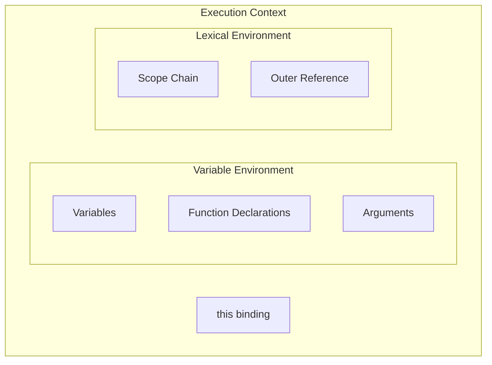
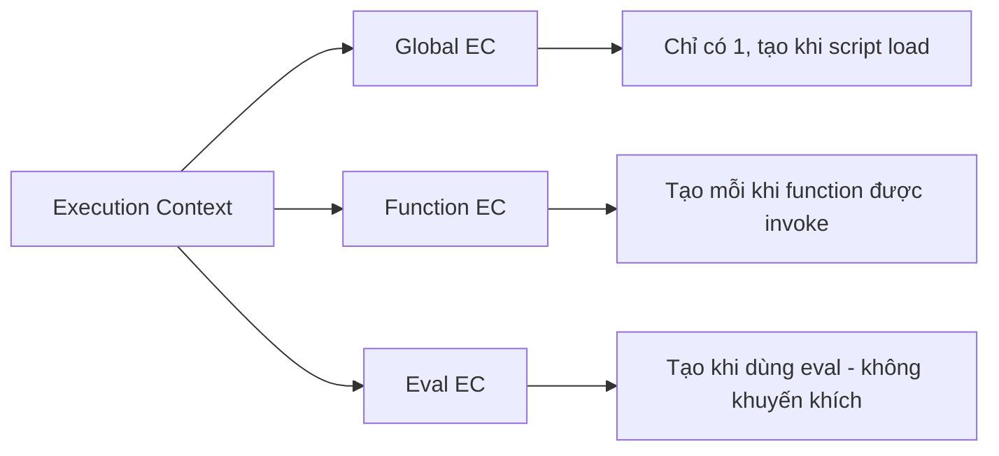
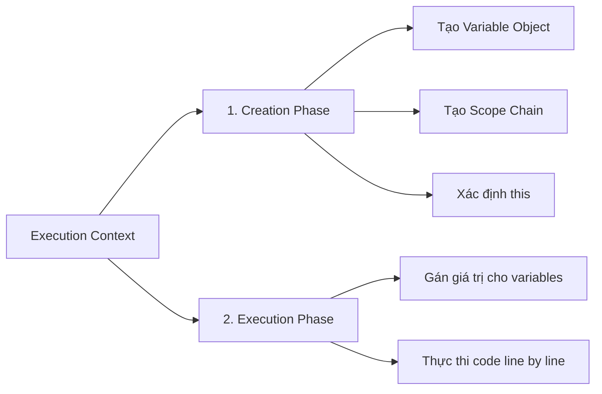
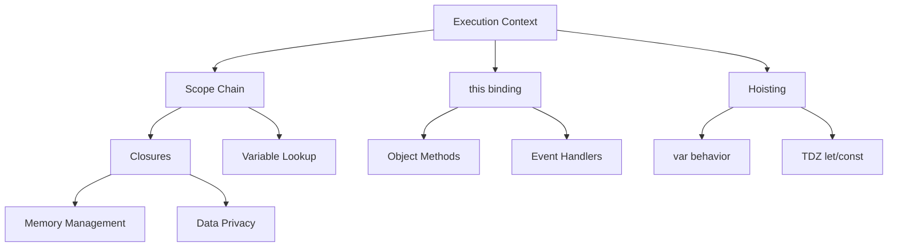

# Execution Context - Nền Tảng Của JavaScript

> Hiểu Execution Context là chìa khóa để master JavaScript. Mọi thứ trong JS - từ hoisting đến closures - đều dựa trên concept này.

---

## Mục Lục

- [Overview](#-overview)
- [What - Định Nghĩa](#-what---định-nghĩa)
- [Why - Tại Sao Quan Trọng](#-why---tại-sao-quan-trọng)
- [How - Cách Hoạt Động](#-how---cách-hoạt-động)
- [When - Khi Nào Được Tạo](#-when---khi-nào-được-tạo)
- [Mối Quan Hệ Với Các Khái Niệm Khác](#-mối-quan-hệ-với-các-khái-niệm-khác)
- [Câu Hỏi Phỏng Vấn](#-câu-hỏi-phỏng-vấn-thường-gặp)
- [Active Recall Questions](#-active-recall-questions)

---

## 🎯 Overview

**Execution Context** là môi trường nơi JavaScript code được đánh giá và thực thi. Nó chứa tất cả thông tin cần thiết để chạy code: biến, functions, giá trị `this`, và scope chain.

### Sơ Đồ Tổng Quan



### Tóm Tắt Key Points

| Khái niệm | Mô tả |
|-----------|-------|
| Global Execution Context | Được tạo khi script bắt đầu chạy |
| Function Execution Context | Được tạo mỗi khi function được gọi |
| Call Stack | Quản lý thứ tự thực thi các contexts |
| Hoisting | Kết quả của Creation Phase |

---

## 📖 What - Định Nghĩa

### Khái Niệm Cơ Bản

**Execution Context (EC)** là một abstract concept trong ECMAScript spec, đại diện cho môi trường nơi JavaScript code được thực thi. Mỗi khi JavaScript engine chạy code, nó tạo ra một Execution Context.

Có **3 loại** Execution Context:



### 1. Global Execution Context (GEC)

Global EC là execution context **mặc định** và **đầu tiên** được tạo khi JavaScript engine bắt đầu thực thi code.

**Đặc điểm:**
- Chỉ có **một** Global EC trong toàn bộ chương trình
- Tạo **Global Object** (`window` trong browser, `global` trong Node.js)
- Đặt `this` = Global Object
- Code không nằm trong function nào thuộc về Global EC

```javascript
// Tất cả code này chạy trong Global EC
var name = "JavaScript";
let version = "ES2024";

function greet() {
    // Đây là Function EC riêng
    console.log("Hello");
}

console.log(this === window); // true (trong browser)
console.log(window.name);     // "JavaScript"
```

### 2. Function Execution Context (FEC)

Mỗi khi một function được **gọi** (không phải khi định nghĩa), một Function EC mới được tạo.

```javascript
function outer() {
    // FEC #1 được tạo khi outer() được gọi
    console.log("Outer");

    function inner() {
        // FEC #2 được tạo khi inner() được gọi
        console.log("Inner");
    }

    inner();
}

outer(); // Tạo FEC #1, trong đó tạo FEC #2
outer(); // Tạo FEC #3 (hoàn toàn mới), trong đó tạo FEC #4
```

**Quan trọng:** Mỗi lần gọi function tạo một EC **hoàn toàn mới**, ngay cả khi gọi cùng một function.

### 3. Eval Execution Context

Được tạo khi code chạy trong `eval()`. **Không khuyến khích sử dụng** vì security risks và performance issues.

### Thuật Ngữ Quan Trọng

| Thuật ngữ | Định nghĩa | Ví dụ |
|-----------|------------|-------|
| **Variable Environment** | Component lưu trữ variables và function declarations | `var`, function declarations |
| **Lexical Environment** | Component xác định scope và outer references | Block scope với `let`/`const` |
| **this Binding** | Giá trị của `this` trong context hiện tại | `window`, object, `undefined` |
| **Scope Chain** | Chuỗi các Lexical Environments | Từ inner đến outer scopes |
| **Hoisting** | Hành vi đưa declarations lên đầu scope | `var`, function declarations |

---

## 🤔 Why - Tại Sao Quan Trọng

### Vấn Đề Được Giải Quyết

JavaScript là ngôn ngữ **single-threaded**, chỉ có thể thực thi một đoạn code tại một thời điểm. Execution Context giải quyết vấn đề:

1. **Quản lý biến và scope:** EC xác định biến nào accessible ở đâu
2. **Thứ tự thực thi:** Call Stack quản lý thứ tự các EC
3. **Context binding:** Xác định giá trị `this`
4. **Memory management:** Khi EC bị pop khỏi stack, memory có thể được giải phóng

### Lợi Ích Của Việc Hiểu EC

```
✅ Giải thích được hoisting
✅ Debug scope-related issues
✅ Hiểu tại sao this thay đổi
✅ Tránh memory leaks từ closures
✅ Optimize performance
```

### Trong Phỏng Vấn

**Tại sao interviewer hỏi về EC:**

1. **Đánh giá độ sâu:** EC là foundation - hiểu EC = hiểu JavaScript
2. **Debug skills:** Nhiều bugs liên quan đến scope, hoisting, this
3. **Senior level:** Seniors cần giải thích behavior, không chỉ code

**Các công ty thường hỏi:**
- Google: Yêu cầu vẽ Call Stack, giải thích execution flow
- Meta: Predict output của code phức tạp
- Amazon: Implement features dựa trên hiểu biết về EC

---

## 🔧 How - Cách Hoạt Động

### Hai Phase Của Execution Context

Mỗi Execution Context đi qua **2 phases**:



### Phase 1: Creation Phase

Trong Creation Phase, JavaScript engine thực hiện:

#### 1.1 Tạo Variable Object (VO) / Variable Environment

```javascript
function example(a, b) {
    var x = 10;
    function inner() {}
    var y = function() {};
}

example(1, 2);
```

**Trong Creation Phase, VO được tạo như sau:**

```javascript
VO = {
    arguments: { 0: 1, 1: 2, length: 2 },  // Arguments object
    a: 1,                                   // Parameters
    b: 2,
    inner: <reference to function>,         // Function declarations (toàn bộ)
    x: undefined,                           // var declarations (chỉ declaration)
    y: undefined                            // var declarations (chỉ declaration)
}
```

**Thứ tự xử lý trong Creation Phase:**

1. **Arguments Object** được tạo (cho Function EC)
2. **Parameters** được gán giá trị
3. **Function declarations** được đưa vào với toàn bộ function body
4. **Variable declarations** (`var`) được đưa vào với giá trị `undefined`

**⚠️ Đây chính là cơ chế HOISTING!**

```javascript
console.log(foo);     // undefined (var foo đã được hoist)
console.log(bar);     // ReferenceError (let không hoist cùng cách)
console.log(baz());   // "Hello" (function được hoist hoàn toàn)

var foo = "Hello";
let bar = "World";
function baz() { return "Hello"; }
```

#### 1.2 Tạo Scope Chain

Scope Chain là danh sách các Variable Objects mà EC hiện tại có thể truy cập.

```javascript
var globalVar = "global";

function outer() {
    var outerVar = "outer";

    function inner() {
        var innerVar = "inner";
        console.log(innerVar);   // ✅ Tìm trong inner's VO
        console.log(outerVar);   // ✅ Tìm trong outer's VO
        console.log(globalVar);  // ✅ Tìm trong global's VO
    }

    inner();
}

outer();
```

**Scope Chain của inner():**
```
inner's VO → outer's VO → global's VO
```

#### 1.3 Xác Định `this`

Giá trị `this` được xác định trong Creation Phase dựa trên cách function được gọi.

```javascript
// Global context
console.log(this); // window (browser) hoặc global (Node.js)

// Function context
function regular() {
    console.log(this);
}

const obj = {
    method: function() {
        console.log(this);
    }
};

regular();      // window (non-strict) hoặc undefined (strict)
obj.method();   // obj
```

### Phase 2: Execution Phase

Sau Creation Phase, JavaScript engine thực thi code **line by line**:

```javascript
function example() {
    console.log(x);  // undefined (từ Creation Phase)
    var x = 10;
    console.log(x);  // 10 (sau khi gán trong Execution Phase)
}
```

**Step-by-step:**

```
Creation Phase:
  VO = { x: undefined }

Execution Phase:
  Line 1: console.log(x) → output: undefined
  Line 2: x = 10 → VO = { x: 10 }
  Line 3: console.log(x) → output: 10
```

### Call Stack

**Call Stack** là cấu trúc LIFO (Last In, First Out) quản lý các Execution Contexts.

```javascript
function first() {
    console.log("First");
    second();
    console.log("First done");
}

function second() {
    console.log("Second");
    third();
    console.log("Second done");
}

function third() {
    console.log("Third");
}

first();
```

**Call Stack visualization:**

```
Bước 1: [Global EC]
Bước 2: [first EC, Global EC]          ← first() được gọi
Bước 3: [second EC, first EC, Global]  ← second() được gọi
Bước 4: [third EC, second, first, Global] ← third() được gọi
Bước 5: [second EC, first EC, Global]  ← third() return, pop
Bước 6: [first EC, Global EC]          ← second() return, pop
Bước 7: [Global EC]                    ← first() return, pop
```

**Output:**
```
First
Second
Third
Second done
First done
```

### Hoisting Chi Tiết

Hoisting là **behavior**, không phải mechanism thực sự di chuyển code. Nó là kết quả của Creation Phase.

#### var Hoisting

```javascript
console.log(a);  // undefined
var a = 5;
console.log(a);  // 5

// JavaScript engine "thấy" như:
var a;           // Declaration được hoist
console.log(a);  // undefined
a = 5;           // Assignment vẫn ở vị trí cũ
console.log(a);  // 5
```

#### let/const Hoisting - Temporal Dead Zone (TDZ)

`let` và `const` **vẫn được hoist**, nhưng không được **initialize**.

```javascript
console.log(a);  // ReferenceError: Cannot access 'a' before initialization
let a = 5;

// Thực tế:
// TDZ bắt đầu ←─────────┐
console.log(a);  //      │ Trong TDZ, access gây ReferenceError
let a = 5;       //      │ TDZ kết thúc ở đây
//               ←───────┘
```

**TDZ (Temporal Dead Zone):** Vùng từ đầu scope đến khi biến được declare. Trong TDZ, biến tồn tại nhưng không thể truy cập.

#### Function Hoisting

Function declarations được hoist **hoàn toàn** (cả declaration và definition).

```javascript
foo();  // "Hello" - Hoạt động!

function foo() {
    console.log("Hello");
}
```

**Nhưng Function Expressions thì không:**

```javascript
bar();  // TypeError: bar is not a function

var bar = function() {
    console.log("Hello");
};

// Vì chỉ có `var bar;` được hoist, với giá trị undefined
```

### Diagram Tổng Hợp: Creation vs Execution

```javascript
var x = 10;
function foo() {
    console.log(x);
    var x = 20;
}
foo();  // Output: ?
```

**Giải thích chi tiết:**

```
=== GLOBAL EXECUTION CONTEXT ===

Creation Phase:
  globalVO = {
    x: undefined,
    foo: <function reference>
  }

Execution Phase:
  Line 1: x = 10 → globalVO.x = 10
  Line 5: foo() được gọi → Tạo Function EC mới

=== FUNCTION EXECUTION CONTEXT (foo) ===

Creation Phase:
  fooVO = {
    x: undefined  ← var x được hoist trong foo's scope
  }

Execution Phase:
  Line 3: console.log(x) → fooVO.x = undefined → Output: undefined
  Line 4: x = 20 → fooVO.x = 20
```

**Answer: `undefined`**

Tại sao không phải `10`? Vì `var x = 20` trong foo tạo ra local variable `x` (shadowing global `x`), và trong Creation Phase, `x` này được set là `undefined`.

---

## ⏰ When - Khi Nào Được Tạo

### Execution Context Được Tạo Khi:

| Trigger | EC Type | Ví dụ |
|---------|---------|-------|
| Script bắt đầu chạy | Global EC | Page load, module import |
| Function được **gọi** | Function EC | `foo()`, `obj.method()` |
| `eval()` được gọi | Eval EC | `eval("code")` |

### Execution Context Được Destroy Khi:

| Trigger | Điều kiện |
|---------|-----------|
| Function return | EC bị pop khỏi Call Stack |
| Script kết thúc | Global EC bị destroy |
| Error (uncaught) | Stack được unwind |

**Quan trọng:** Variables trong EC **có thể** tồn tại lâu hơn EC nếu có closure reference!

```javascript
function createCounter() {
    let count = 0;  // Thuộc về EC của createCounter
    return function() {
        return ++count;  // Closure giữ reference đến count
    };
}

const counter = createCounter();  // EC của createCounter đã bị pop
console.log(counter());  // 1 - count vẫn accessible qua closure!
console.log(counter());  // 2
```

---

## 🔗 Mối Quan Hệ Với Các Khái Niệm Khác

### Diagram Quan Hệ



### EC → Scope & Closures

Execution Context **chứa** Lexical Environment, và Lexical Environment tạo nên **Scope Chain**. Closures hoạt động vì function "nhớ" Lexical Environment nơi nó được tạo.

```javascript
function outer() {
    const secret = "password";

    return function inner() {
        // inner's Scope Chain: inner VO → outer VO → global VO
        // Khi outer() return, outer's VO lẽ ra bị destroy
        // Nhưng inner() giữ reference → Closure!
        return secret;
    };
}

const getSecret = outer();
console.log(getSecret());  // "password"
```

### EC → this Binding

`this` được xác định trong **Creation Phase** của EC, dựa trên cách function được gọi.

| Cách gọi | this value |
|----------|------------|
| Regular call: `foo()` | `window` (non-strict) / `undefined` (strict) |
| Method call: `obj.foo()` | `obj` |
| Constructor: `new Foo()` | New object instance |
| `call`/`apply`/`bind` | Explicitly specified |
| Arrow function | Inherits from parent EC |

### EC → Memory

Khi EC bị pop khỏi Call Stack, variables trong EC **eligible for garbage collection** UNLESS có closure giữ reference.

---

## ❓ Câu Hỏi Phỏng Vấn Thường Gặp

### Mức độ: 🟢 Junior

#### Q1: Hoisting là gì?

**A:** Hoisting là hành vi của JavaScript đưa các declarations lên đầu scope trong Creation Phase của Execution Context.

- `var` declarations được hoist với giá trị `undefined`
- `let`/`const` declarations được hoist nhưng ở trong TDZ
- Function declarations được hoist hoàn toàn

```javascript
console.log(x);    // undefined
console.log(y);    // ReferenceError
console.log(foo);  // [Function: foo]

var x = 1;
let y = 2;
function foo() {}
```

#### Q2: Giải thích output của code sau:

```javascript
var a = 1;
function b() {
    a = 10;
    return;
    function a() {}
}
b();
console.log(a);
```

**A:** Output là `1`.

Giải thích:
1. Trong function `b`, có function declaration `function a() {}`
2. Function declarations được hoist, nên `a` là local variable trong `b`
3. `a = 10` gán giá trị cho local `a`, không phải global `a`
4. Global `a` vẫn là `1`

---

### Mức độ: 🟡 Mid-level

#### Q3: Giải thích Call Stack và Execution Context

**A:**
- **Execution Context** là môi trường nơi JavaScript code được thực thi, chứa variables, scope chain, và `this`
- **Call Stack** là cấu trúc LIFO quản lý các Execution Contexts
- Khi function được gọi, EC mới được push vào stack
- Khi function return, EC bị pop khỏi stack
- JavaScript engine luôn thực thi EC ở top của stack

```javascript
function a() { b(); }
function b() { c(); }
function c() { console.log("Done"); }
a();

// Stack evolution:
// [Global] → [a, Global] → [b, a, Global] → [c, b, a, Global]
// → [b, a, Global] → [a, Global] → [Global]
```

#### Q4: Tại sao code này hoạt động?

```javascript
const obj = {
    name: "John",
    greet: function() {
        setTimeout(function() {
            console.log("Hello, " + this.name);
        }, 100);
    }
};

obj.greet();  // Output: "Hello, undefined"
```

**A:**
- `setTimeout` callback là regular function, không phải method call
- Trong callback, `this` = `window` (non-strict) hoặc `undefined` (strict)
- `window.name` thường là empty string hoặc undefined

**Fix với arrow function:**
```javascript
greet: function() {
    setTimeout(() => {
        console.log("Hello, " + this.name);  // "Hello, John"
    }, 100);
}
```

Arrow function không có `this` của riêng nó - nó inherit từ enclosing EC.

---

### Mức độ: 🔴 Senior

#### Q5: Giải thích chi tiết Creation Phase và Execution Phase

**A:** Mỗi Execution Context đi qua 2 phases:

**Creation Phase:**
1. **Variable Environment được tạo:**
   - Arguments object (cho FEC)
   - Parameters được gán giá trị
   - Function declarations được hoist với full body
   - var declarations được hoist với `undefined`
   - let/const tồn tại nhưng trong TDZ

2. **Scope Chain được thiết lập:**
   - Reference đến outer Lexical Environment
   - Cho phép variable lookup

3. **this được xác định:**
   - Dựa trên cách function được gọi

**Execution Phase:**
- Code được thực thi line by line
- Variables được gán giá trị
- Functions được gọi (tạo EC mới)

```javascript
function example(x) {
    console.log(a);  // undefined
    console.log(b);  // ReferenceError
    console.log(c);  // [Function: c]

    var a = 1;
    let b = 2;
    function c() {}
}

// Creation Phase của example(5):
// VO = {
//   arguments: { 0: 5, length: 1 },
//   x: 5,
//   c: <function>,
//   a: undefined,
//   b: <uninitialized> (TDZ)
// }
```

#### Q6: Trong V8 engine, EC được optimize như thế nào?

**A:**
1. **Hidden Classes:** V8 tạo hidden classes cho objects với cùng structure để optimize property access
2. **Inline Caching:** Function EC được cache khi gọi với cùng types
3. **Stack Frames:** EC được implement như stack frames, không phải objects
4. **Context Variables:** Chỉ variables cần cho closures được allocate trong heap, còn lại ở stack
5. **Escape Analysis:** V8 phân tích xem object có "escape" ra khỏi function không để decide allocation

```javascript
function createPoint(x, y) {
    // Nếu object không escape, có thể allocate trên stack
    return { x, y };
}

function createCallback(x) {
    // x phải allocate trên heap vì closure escape
    return () => x;
}
```

---

## 📚 Active Recall Questions

*Đóng tài liệu và trả lời các câu hỏi sau:*

### Conceptual
1. [ ] Có bao nhiêu loại Execution Context? Kể tên.
2. [ ] Giải thích Creation Phase gồm những bước gì?
3. [ ] Tại sao `var` hoisting khác `let`/`const`?
4. [ ] Call Stack là gì? Hoạt động như thế nào?
5. [ ] TDZ (Temporal Dead Zone) là gì?

### Practical
6. [ ] Vẽ diagram Call Stack cho đoạn code có 3 nested function calls
7. [ ] Predict output của code với hoisting phức tạp
8. [ ] Giải thích tại sao closure "nhớ" được variables

### Interview-style
9. [ ] Nếu interviewer hỏi "Giải thích hoisting", bạn sẽ trả lời như thế nào?
10. [ ] Làm thế nào để debug scope-related issues sử dụng DevTools?

---

## 🎯 Tài Nguyên Học Thêm

### Articles
- [JavaScript Execution Context – How JS Works Behind The Scenes](https://www.freecodecamp.org/news/execution-context-how-javascript-works-behind-the-scenes/)
- [Understanding Execution Context and Execution Stack](https://blog.bitsrc.io/understanding-execution-context-and-execution-stack-in-javascript-1c9ea8642dd0)

### Videos
- [JavaScript Visualized: Execution Context](https://www.youtube.com/watch?v=Fd9VaW0M7K4) - Lydia Hallie
- [JavaScript Execution Context](https://www.youtube.com/watch?v=iLWTnMzWtj4) - Akshay Saini

### Practice
- [JavaScript Visualizer 9000](https://www.jsv9000.app/) - Visualize execution
- Chrome DevTools → Sources → Call Stack panel

---

## Checklist Tự Đánh Giá

- [ ] Tôi có thể giải thích 3 loại EC
- [ ] Tôi hiểu Creation Phase vs Execution Phase
- [ ] Tôi có thể predict output của code với hoisting
- [ ] Tôi hiểu Call Stack và có thể vẽ diagram
- [ ] Tôi biết TDZ là gì và tại sao nó tồn tại
- [ ] Tôi có thể giải thích EC cho người mới (Feynman test)

---

> **Tiếp theo:** [02-scope-closure.md](./02-scope-closure.md) - Scope Chain và Closures
