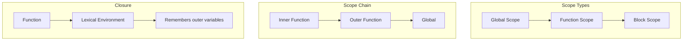
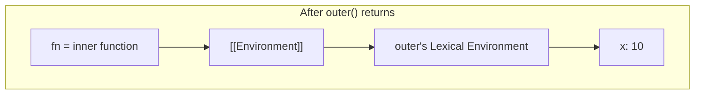

# Scope Chain & Closures - Trái Tim Của JavaScript

> Closures là một trong những concepts quan trọng nhất và được hỏi nhiều nhất trong phỏng vấn JavaScript. Hiểu closures = hiểu JavaScript.

---

## Mục Lục

- [Overview](#-overview)
- [What - Định Nghĩa](#-what---định-nghĩa)
- [Why - Tại Sao Quan Trọng](#-why---tại-sao-quan-trọng)
- [How - Cách Hoạt Động](#-how---cách-hoạt-động)
- [When - Khi Nào Sử Dụng](#-when---khi-nào-sử-dụng)
- [Mối Quan Hệ Với Các Khái Niệm Khác](#-mối-quan-hệ-với-các-khái-niệm-khác)
- [Câu Hỏi Phỏng Vấn](#-câu-hỏi-phỏng-vấn-thường-gặp)
- [Active Recall Questions](#-active-recall-questions)

---

## 🎯 Overview

**Scope** xác định accessibility của variables. **Closure** là khi một function "nhớ" được lexical scope của nó ngay cả khi function đó được thực thi bên ngoài scope đó.

### Sơ Đồ Tổng Quan



### Tóm Tắt Key Points

| Khái niệm | Mô tả |
|-----------|-------|
| Lexical Scope | Scope được xác định tại thời điểm viết code, không phải runtime |
| Scope Chain | Chuỗi các scopes từ inner đến outer để tìm variables |
| Closure | Function + Reference đến Lexical Environment của nó |

---

## 📖 What - Định Nghĩa

### 1. Scope

**Scope** là vùng trong code nơi một variable có thể được truy cập. JavaScript có 3 loại scope:

#### Global Scope

Variables được khai báo ngoài tất cả functions và blocks.

```javascript
var globalVar = "I'm global";
let globalLet = "I'm also global";

function foo() {
    console.log(globalVar); // ✅ Accessible
}
```

#### Function Scope

Variables được khai báo bên trong function chỉ accessible trong function đó.

```javascript
function foo() {
    var functionVar = "I'm function-scoped";
    console.log(functionVar); // ✅ Accessible
}

console.log(functionVar); // ❌ ReferenceError
```

#### Block Scope (ES6+)

Variables được khai báo với `let` và `const` bên trong block `{}` chỉ accessible trong block đó.

```javascript
if (true) {
    let blockLet = "I'm block-scoped";
    const blockConst = "Me too";
    var notBlockScoped = "I escape the block!";
}

console.log(notBlockScoped); // ✅ "I escape the block!"
console.log(blockLet);       // ❌ ReferenceError
```

**Quan trọng:** `var` không có block scope, chỉ có function scope!

### 2. Lexical Scope (Static Scope)

**Lexical Scope** có nghĩa là scope được xác định tại thời điểm **viết code** (author time), không phải khi code chạy (runtime).

```javascript
const name = "Global";

function outer() {
    const name = "Outer";

    function inner() {
        console.log(name); // "Outer" - không phải "Global"
    }

    return inner;
}

const innerFunc = outer();
innerFunc(); // "Outer" - vẫn nhớ scope của outer
```

Dù `inner` được gọi từ global scope, nó vẫn access `name` từ `outer` scope vì đó là nơi nó được **định nghĩa**.

### 3. Scope Chain

Khi JavaScript engine cần tìm một variable, nó tìm theo thứ tự:

```
Current Scope → Parent Scope → ... → Global Scope
```

```javascript
const global = "global";

function outer() {
    const outerVar = "outer";

    function middle() {
        const middleVar = "middle";

        function inner() {
            const innerVar = "inner";

            // Tìm theo scope chain:
            console.log(innerVar);  // Found in inner
            console.log(middleVar); // Found in middle
            console.log(outerVar);  // Found in outer
            console.log(global);    // Found in global
        }

        inner();
    }

    middle();
}

outer();
```

**Scope Chain của `inner`:**
```
inner's Scope → middle's Scope → outer's Scope → Global Scope
```

### 4. Closure - Định Nghĩa Chính Thức

> **Closure** là sự kết hợp của một function và lexical environment nơi function đó được **định nghĩa**.

```javascript
function createCounter() {
    let count = 0; // Biến trong outer scope

    return function() {
        count++; // Inner function access outer variable
        return count;
    };
}

const counter = createCounter();
console.log(counter()); // 1
console.log(counter()); // 2
console.log(counter()); // 3
```

**Điều kỳ diệu:**
- `createCounter()` đã return, EC của nó lẽ ra bị destroy
- Nhưng returned function vẫn access được `count`
- Đó là **CLOSURE**!

### Thuật Ngữ Quan Trọng

| Thuật ngữ | Định nghĩa |
|-----------|------------|
| **Lexical Scope** | Scope được xác định bởi vị trí trong source code |
| **Scope Chain** | Chuỗi các scopes để tìm variable |
| **Closure** | Function + Lexical Environment reference |
| **Free Variable** | Variable trong closure không phải local cũng không phải parameter |
| **Closed Over** | Variable được "đóng gói" trong closure |

---

## 🤔 Why - Tại Sao Quan Trọng

### Vấn Đề Được Giải Quyết

#### 1. Data Privacy (Encapsulation)

```javascript
// Không có closure - data exposed
let balance = 0;
function deposit(amount) { balance += amount; }
function withdraw(amount) { balance -= amount; }
// Vấn đề: ai cũng có thể modify balance trực tiếp!

// Với closure - data protected
function createAccount(initialBalance) {
    let balance = initialBalance; // Private!

    return {
        deposit(amount) {
            balance += amount;
            return balance;
        },
        withdraw(amount) {
            if (amount > balance) throw new Error("Insufficient funds");
            balance -= amount;
            return balance;
        },
        getBalance() {
            return balance;
        }
    };
}

const account = createAccount(100);
account.deposit(50);  // 150
account.balance;      // undefined - không access trực tiếp được!
```

#### 2. State Persistence

```javascript
function createIdGenerator() {
    let id = 0;
    return function() {
        return ++id;
    };
}

const generateId = createIdGenerator();
generateId(); // 1
generateId(); // 2
generateId(); // 3
// State được maintain giữa các calls
```

#### 3. Partial Application / Currying

```javascript
function multiply(a) {
    return function(b) {
        return a * b;
    };
}

const double = multiply(2);
const triple = multiply(3);

double(5); // 10
triple(5); // 15
```

### Trong Phỏng Vấn

Closure được hỏi ở **MỌI** vòng phỏng vấn JavaScript vì:

1. **Foundation concept** - Hiểu closure = hiểu how JS works
2. **Practical usage** - Dùng hàng ngày trong React hooks, event handlers
3. **Common bugs** - Nhiều bugs liên quan đến closure (loop + var)
4. **Design patterns** - Module pattern, factory functions

---

## 🔧 How - Cách Hoạt Động

### Cơ Chế Bên Trong

Khi function được tạo, nó lưu trữ reference đến **Lexical Environment** nơi nó được định nghĩa:

```javascript
function outer() {
    const x = 10;
    // Khi inner được tạo, nó lưu [[Environment]] = outer's LE
    function inner() {
        return x;
    }
    return inner;
}

const fn = outer();
// Lúc này:
// - outer's EC đã bị pop khỏi call stack
// - NHƯNG outer's Lexical Environment vẫn tồn tại
// - Vì fn (inner) có reference đến nó
```

### Diagram Chi Tiết



### Ví Dụ Từng Bước

```javascript
function outer() {
    let counter = 0;

    function increment() {
        counter++;
        console.log(counter);
    }

    function decrement() {
        counter--;
        console.log(counter);
    }

    return { increment, decrement };
}

const obj = outer();
obj.increment(); // 1
obj.increment(); // 2
obj.decrement(); // 1
```

**Giải thích:**
1. `outer()` được gọi, tạo Lexical Environment với `counter = 0`
2. `increment` và `decrement` được tạo, cả hai "close over" `counter`
3. `outer()` return, EC bị pop, nhưng LE vẫn tồn tại
4. `increment` và `decrement` **share** cùng một `counter`!

### Classic Interview Problem: Loop + var

```javascript
for (var i = 0; i < 3; i++) {
    setTimeout(function() {
        console.log(i);
    }, 1000);
}
// Output: 3, 3, 3 (không phải 0, 1, 2!)
```

**Tại sao?**
- `var` không có block scope
- Chỉ có một biến `i` trong toàn bộ loop
- Khi callbacks chạy (sau 1 giây), loop đã kết thúc, `i = 3`

**Fix 1: Dùng let (block scope)**
```javascript
for (let i = 0; i < 3; i++) {
    setTimeout(function() {
        console.log(i);
    }, 1000);
}
// Output: 0, 1, 2 ✅
```

**Fix 2: IIFE tạo closure mới cho mỗi iteration**
```javascript
for (var i = 0; i < 3; i++) {
    (function(j) {
        setTimeout(function() {
            console.log(j);
        }, 1000);
    })(i);
}
// Output: 0, 1, 2 ✅
```

### Memory Implications

Closures giữ reference đến outer scope, có thể gây **memory leaks** nếu không cẩn thận:

```javascript
function createHeavyClosure() {
    const hugeArray = new Array(1000000).fill("data");

    return function() {
        // hugeArray vẫn trong memory vì closure reference
        return hugeArray.length;
    };
}

const fn = createHeavyClosure();
// hugeArray không thể bị garbage collected
// vì fn vẫn reference đến nó
```

**Best Practice:** Chỉ close over những gì cần thiết:

```javascript
function createLightClosure() {
    const hugeArray = new Array(1000000).fill("data");
    const length = hugeArray.length; // Chỉ lấy cái cần

    return function() {
        return length; // Không reference hugeArray
    };
}
// hugeArray có thể bị garbage collected sau khi function return
```

---

## ⏰ When - Khi Nào Sử Dụng

### Use Cases Phổ Biến

#### 1. Data Privacy (Module Pattern)

```javascript
const counterModule = (function() {
    let count = 0; // Private

    return {
        increment() { return ++count; },
        decrement() { return --count; },
        getCount() { return count; }
    };
})();

counterModule.increment(); // 1
counterModule.count; // undefined - private!
```

#### 2. Factory Functions

```javascript
function createValidator(minLength) {
    return function(input) {
        return input.length >= minLength;
    };
}

const validatePassword = createValidator(8);
const validateUsername = createValidator(3);

validatePassword("abc");     // false
validatePassword("password123"); // true
```

#### 3. Event Handlers with State

```javascript
function setupButton(buttonId) {
    let clickCount = 0;

    document.getElementById(buttonId).addEventListener("click", function() {
        clickCount++;
        console.log(`Clicked ${clickCount} times`);
    });
}
```

#### 4. Memoization

```javascript
function memoize(fn) {
    const cache = {};

    return function(...args) {
        const key = JSON.stringify(args);
        if (key in cache) {
            return cache[key];
        }
        const result = fn.apply(this, args);
        cache[key] = result;
        return result;
    };
}

const expensiveCalculation = memoize(function(n) {
    console.log("Computing...");
    return n * n;
});

expensiveCalculation(5); // "Computing..." → 25
expensiveCalculation(5); // 25 (từ cache, không log)
```

#### 5. Debounce & Throttle

```javascript
function debounce(fn, delay) {
    let timeoutId;

    return function(...args) {
        clearTimeout(timeoutId);
        timeoutId = setTimeout(() => {
            fn.apply(this, args);
        }, delay);
    };
}

const debouncedSearch = debounce(function(query) {
    console.log("Searching:", query);
}, 300);
```

### Anti-patterns (Khi KHÔNG Nên Dùng)

#### 1. Không Cần Closure Khi Có Thể Dùng Parameters

```javascript
// ❌ Unnecessary closure
function makeMultiplier() {
    let factor = 2;
    return (num) => num * factor;
}

// ✅ Better: just use a parameter
function multiply(num, factor) {
    return num * factor;
}
```

#### 2. Tránh Tạo Closures Trong Loops (Performance)

```javascript
// ❌ Tạo function mới mỗi iteration
for (let i = 0; i < 1000; i++) {
    arr[i].onclick = function() { doSomething(i); };
}

// ✅ Dùng một function, pass data qua attribute
for (let i = 0; i < 1000; i++) {
    arr[i].dataset.index = i;
    arr[i].onclick = handleClick;
}

function handleClick(e) {
    doSomething(e.target.dataset.index);
}
```

---

## 🔗 Mối Quan Hệ Với Các Khái Niệm Khác

### Closures & React Hooks

```javascript
function Counter() {
    const [count, setCount] = useState(0);

    // useEffect callback là closure
    useEffect(() => {
        const id = setInterval(() => {
            // ⚠️ count bị "stale" vì closure capture giá trị cũ
            console.log(count); // Luôn log giá trị ban đầu!
        }, 1000);

        return () => clearInterval(id);
    }, []); // Empty deps = closure capture initial count

    // Fix: useRef hoặc thêm count vào deps
}
```

### Closures & this

```javascript
const obj = {
    name: "Object",
    greet: function() {
        // Regular function - this = obj
        setTimeout(function() {
            // Regular callback - this = window/undefined
            console.log(this.name); // undefined
        }, 100);
    },
    greetArrow: function() {
        // Arrow function - closure over this
        setTimeout(() => {
            console.log(this.name); // "Object" ✅
        }, 100);
    }
};
```

Arrow functions không có `this` riêng - chúng "close over" `this` từ parent scope!

---

## ❓ Câu Hỏi Phỏng Vấn Thường Gặp

### 🟢 Junior

**Q: Closure là gì?**

A: Closure là sự kết hợp của một function và lexical environment nơi function đó được định nghĩa. Nó cho phép function access variables từ outer scope ngay cả khi outer function đã return.

```javascript
function outer() {
    const secret = "password";
    return function inner() {
        return secret; // Closure giữ reference đến secret
    };
}
const getSecret = outer();
getSecret(); // "password"
```

### 🟡 Mid-level

**Q: Implement debounce function**

```javascript
function debounce(fn, delay) {
    let timeoutId;

    return function(...args) {
        // Closure: timeoutId persists giữa các calls
        clearTimeout(timeoutId);
        timeoutId = setTimeout(() => {
            fn.apply(this, args);
        }, delay);
    };
}
```

**Q: Giải thích output:**

```javascript
for (var i = 0; i < 3; i++) {
    setTimeout(() => console.log(i), 0);
}
```

A: Output là `3, 3, 3`. Vì `var` không có block scope, chỉ có một biến `i`. Khi callbacks chạy, loop đã kết thúc và `i = 3`. Fix bằng cách dùng `let` hoặc IIFE.

### 🔴 Senior

**Q: Closures có thể gây memory leaks như thế nào? Cách tránh?**

A: Closures giữ reference đến toàn bộ lexical environment, ngay cả khi chỉ dùng một biến nhỏ:

```javascript
function createLeak() {
    const hugeData = new Array(1000000).fill("x");
    return function() {
        // Chỉ dùng length nhưng hugeData không được GC
        return hugeData.length;
    };
}

// Fix: Extract needed data
function noLeak() {
    const hugeData = new Array(1000000).fill("x");
    const length = hugeData.length;
    return function() {
        return length;
    };
}
```

Cách tránh:
1. Chỉ capture những gì cần thiết
2. Nullify references khi không cần
3. Cẩn thận với event listeners - luôn cleanup
4. Dùng WeakMap/WeakSet cho object references

---

## 📚 Active Recall Questions

1. [ ] Định nghĩa closure bằng một câu
2. [ ] Vẽ scope chain cho nested function 3 levels
3. [ ] Giải thích tại sao loop+var+setTimeout output sai
4. [ ] Liệt kê 3 use cases của closures
5. [ ] Closures gây memory leak như thế nào?
6. [ ] Implement memoization function từ scratch
7. [ ] Tại sao arrow function "inherit" this?

---

## 🎯 Tài Nguyên Học Thêm

- [MDN: Closures](https://developer.mozilla.org/en-US/docs/Web/JavaScript/Closures)
- [JavaScript.info: Closure](https://javascript.info/closure)
- [You Don't Know JS: Scope & Closures](https://github.com/getify/You-Dont-Know-JS/blob/2nd-ed/scope-closures/README.md)

---

> **Tiếp theo:** [03-this-keyword.md](./03-this-keyword.md) - `this` Binding Rules
