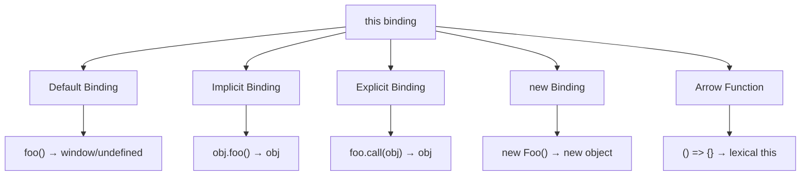

# this Keyword - Hiểu Đúng Về this Trong JavaScript

> `this` là một trong những concepts gây nhầm lẫn nhất trong JavaScript. Hiểu đúng về `this` giúp bạn tránh bugs và viết code tốt hơn.

---

## Mục Lục

- [Overview](#-overview)
- [What - Định Nghĩa](#-what---định-nghĩa)
- [Why - Tại Sao Quan Trọng](#-why---tại-sao-quan-trọng)
- [How - 4 Quy Tắc Binding](#-how---4-quy-tắc-binding)
- [When - Khi Nào Sử Dụng](#-when---khi-nào-sử-dụng)
- [Câu Hỏi Phỏng Vấn](#-câu-hỏi-phỏng-vấn-thường-gặp)

---

## 🎯 Overview

`this` trong JavaScript **không** giống như trong các ngôn ngữ OOP khác. Giá trị của `this` được xác định bởi **cách function được gọi**, không phải nơi function được định nghĩa.

### Sơ Đồ Tổng Quan



### Priority Order (Cao → Thấp)

```
1. new binding          (highest)
2. Explicit binding     (call/apply/bind)
3. Implicit binding     (object method)
4. Default binding      (lowest)
```

---

## 📖 What - Định Nghĩa

### `this` Là Gì?

`this` là một **keyword** đặc biệt trong JavaScript, tự động được định nghĩa trong scope của mọi function. Nó reference đến một object - object nào phụ thuộc vào cách function được invoked.

**Quan trọng:** `this` KHÔNG reference đến:
- Function chứa nó
- Lexical scope của function

```javascript
// Sai lầm phổ biến #1: Nghĩ this = function
function foo() {
    this.count++; // this KHÔNG phải là foo!
}
foo.count = 0;
foo();
console.log(foo.count); // 0, không phải 1!

// Sai lầm phổ biến #2: Nghĩ this = scope
function foo() {
    var a = 2;
    bar();
}
function bar() {
    console.log(this.a); // undefined, không phải 2!
}
```

---

## 🤔 Why - Tại Sao Quan Trọng

### Vấn Đề Được Giải Quyết

`this` cung cấp cách để functions tái sử dụng với các contexts khác nhau:

```javascript
function greet() {
    console.log(`Hello, ${this.name}!`);
}

const john = { name: "John", greet };
const jane = { name: "Jane", greet };

john.greet(); // "Hello, John!"
jane.greet(); // "Hello, Jane!"
// Cùng function, khác context
```

### Trong Phỏng Vấn

`this` được hỏi ở **MỌI** phỏng vấn JavaScript vì:
1. Bugs phổ biến liên quan đến `this`
2. Arrow functions vs regular functions
3. Event handlers, callbacks
4. React class components vs functional components

---

## 🔧 How - 4 Quy Tắc Binding

### Rule 1: Default Binding

Khi function được gọi **standalone** (không có object phía trước).

```javascript
function foo() {
    console.log(this);
}

foo(); // window (non-strict) hoặc undefined (strict mode)
```

**Non-strict mode:**
```javascript
var a = 2;
function foo() {
    console.log(this.a);
}
foo(); // 2 (this = window, window.a = 2)
```

**Strict mode:**
```javascript
"use strict";
function foo() {
    console.log(this);
}
foo(); // undefined
```

### Rule 2: Implicit Binding

Khi function được gọi như một **method của object**.

```javascript
const obj = {
    name: "Object",
    greet: function() {
        console.log(`Hello from ${this.name}`);
    }
};

obj.greet(); // "Hello from Object"
// this = obj vì greet được gọi trên obj
```

**⚠️ Cẩn thận: Implicit Loss**

```javascript
const obj = {
    name: "Object",
    greet: function() {
        console.log(this.name);
    }
};

const fn = obj.greet; // Lấy reference đến function
fn(); // undefined! Default binding, không phải implicit

// Tương tự với callbacks:
setTimeout(obj.greet, 100); // undefined!
```

**Chỉ object trực tiếp trước dấu `.` mới có implicit binding:**

```javascript
const obj1 = {
    name: "obj1",
    obj2: {
        name: "obj2",
        greet: function() {
            console.log(this.name);
        }
    }
};

obj1.obj2.greet(); // "obj2" (không phải "obj1")
```

### Rule 3: Explicit Binding

Dùng `call`, `apply`, hoặc `bind` để **explicit** set `this`.

#### call()
```javascript
function greet(greeting) {
    console.log(`${greeting}, ${this.name}!`);
}

const person = { name: "John" };
greet.call(person, "Hello"); // "Hello, John!"
```

#### apply()
```javascript
function greet(greeting, punctuation) {
    console.log(`${greeting}, ${this.name}${punctuation}`);
}

const person = { name: "John" };
greet.apply(person, ["Hello", "!"]); // "Hello, John!"
// Khác call: arguments là array
```

#### bind()
```javascript
function greet() {
    console.log(`Hello, ${this.name}!`);
}

const person = { name: "John" };
const boundGreet = greet.bind(person);
boundGreet(); // "Hello, John!"
// bind() trả về function mới với this đã được fix
```

**Hard Binding - Không thể override:**

```javascript
function foo() {
    console.log(this.a);
}

const obj1 = { a: 1 };
const obj2 = { a: 2 };

const bar = foo.bind(obj1);
bar.call(obj2); // 1, không phải 2! bind() không thể bị override
```

### Rule 4: new Binding

Khi function được gọi với `new` keyword.

```javascript
function Person(name) {
    // this = {} (empty object mới)
    this.name = name;
    // return this (implicit)
}

const john = new Person("John");
console.log(john.name); // "John"
```

**`new` làm gì:**
1. Tạo object rỗng mới
2. Link object đó với prototype
3. Set `this` = object mới
4. Return `this` (nếu function không return object khác)

### Arrow Functions - Lexical this

Arrow functions **KHÔNG** có `this` của riêng chúng. Chúng **inherit** `this` từ enclosing scope.

```javascript
const obj = {
    name: "Object",
    regularMethod: function() {
        console.log(this.name); // "Object"

        // Regular function trong callback
        setTimeout(function() {
            console.log(this.name); // undefined! (default binding)
        }, 100);

        // Arrow function trong callback
        setTimeout(() => {
            console.log(this.name); // "Object"! (lexical this)
        }, 100);
    }
};
```

**Arrow function KHÔNG thể bị override:**

```javascript
const foo = () => {
    console.log(this.a);
};

const obj = { a: 2 };
foo.call(obj); // undefined (không phải 2)
// call/apply/bind không affect arrow functions
```

---

## 📊 Bảng Tổng Hợp

| Cách gọi | this value | Ví dụ |
|----------|------------|-------|
| Default | `window` / `undefined` | `foo()` |
| Implicit | Object trước `.` | `obj.foo()` |
| Explicit | Argument đầu tiên | `foo.call(obj)` |
| new | Object mới | `new Foo()` |
| Arrow | Lexical (inherited) | `() => this` |

---

## ⏰ When - Khi Nào Sử Dụng

### Dùng Arrow Function Khi:

```javascript
// ✅ Event handlers cần access outer this
class Button {
    constructor() {
        this.count = 0;
        this.handleClick = () => {
            this.count++; // this = Button instance
        };
    }
}

// ✅ Callbacks trong methods
const obj = {
    data: [1, 2, 3],
    process: function() {
        return this.data.map(x => x * this.multiplier);
    },
    multiplier: 2
};

// ✅ Short inline functions
const doubled = numbers.map(n => n * 2);
```

### Dùng Regular Function Khi:

```javascript
// ✅ Object methods (để this = object)
const obj = {
    name: "Object",
    greet: function() { // Hoặc shorthand: greet() { }
        console.log(this.name);
    }
};

// ✅ Constructors
function Person(name) {
    this.name = name;
}

// ✅ Khi cần dynamic this
const handlers = {
    click: function() {
        console.log(this); // element được click
    }
};
button.addEventListener('click', handlers.click);
```

---

## ❓ Câu Hỏi Phỏng Vấn Thường Gặp

### 🟢 Junior

**Q: `this` trong arrow function khác regular function như thế nào?**

A: Arrow function không có `this` của riêng nó - nó inherit `this` từ enclosing lexical scope. Regular function xác định `this` dựa trên cách nó được gọi.

```javascript
const obj = {
    regular: function() {
        console.log(this); // obj
    },
    arrow: () => {
        console.log(this); // window/global (lexical)
    }
};
```

### 🟡 Mid-level

**Q: Predict output:**

```javascript
const obj = {
    name: "obj",
    getName: function() {
        return this.name;
    },
    getNameArrow: () => this.name
};

console.log(obj.getName());      // ?
console.log(obj.getNameArrow()); // ?

const getName = obj.getName;
console.log(getName());          // ?
```

**A:**
- `obj.getName()` → `"obj"` (implicit binding)
- `obj.getNameArrow()` → `undefined` (arrow inherits global this)
- `getName()` → `undefined` (default binding, implicit loss)

### 🔴 Senior

**Q: Implement `Function.prototype.bind` từ scratch**

```javascript
Function.prototype.myBind = function(context, ...args) {
    const fn = this;

    return function(...newArgs) {
        return fn.apply(context, [...args, ...newArgs]);
    };
};

// Test
function greet(greeting, punctuation) {
    return `${greeting}, ${this.name}${punctuation}`;
}

const person = { name: "John" };
const boundGreet = greet.myBind(person, "Hello");
console.log(boundGreet("!")); // "Hello, John!"
```

**Q: Tại sao React class components cần bind methods?**

```javascript
class Button extends React.Component {
    handleClick() {
        console.log(this); // undefined without bind!
    }

    render() {
        // Method được pass as callback → implicit loss
        return <button onClick={this.handleClick}>Click</button>;
    }
}

// Solutions:
// 1. Bind trong constructor
constructor() {
    this.handleClick = this.handleClick.bind(this);
}

// 2. Arrow function class field
handleClick = () => {
    console.log(this); // works!
};

// 3. Arrow function trong JSX (không recommend - tạo function mới mỗi render)
<button onClick={() => this.handleClick()}>Click</button>
```

---

## 📚 Active Recall Questions

1. [ ] Liệt kê 4 rules của this binding theo thứ tự priority
2. [ ] Implicit loss là gì? Cho ví dụ
3. [ ] Arrow function handle this như thế nào?
4. [ ] Sự khác nhau giữa call, apply, và bind?
5. [ ] Tại sao cần bind methods trong React class components?
6. [ ] Implement myBind từ scratch

---

## 🎯 Tài Nguyên

- [You Don't Know JS: this & Object Prototypes](https://github.com/getify/You-Dont-Know-JS/blob/1st-ed/this%20&%20object%20prototypes/README.md)
- [MDN: this](https://developer.mozilla.org/en-US/docs/Web/JavaScript/Reference/Operators/this)
- [JavaScript.info: Object methods, "this"](https://javascript.info/object-methods)

---

> **Tiếp theo:** [04-prototypes-inheritance.md](./04-prototypes-inheritance.md) - Prototype Chain
