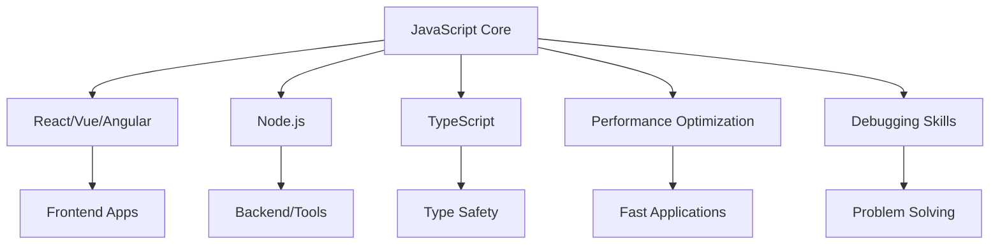
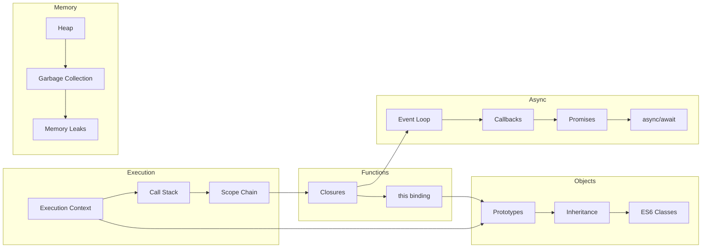

# JavaScript Core - Kiến Thức Nền Tảng

> Hiểu sâu JavaScript từ bên trong - nền tảng quan trọng nhất cho mọi frontend engineer

---

## Tổng Quan

JavaScript là ngôn ngữ **không thể thay thế** trong frontend development. Dù bạn sử dụng React, Vue, hay Angular - tất cả đều chạy trên JavaScript engine. Hiểu sâu JavaScript là yếu tố quyết định giữa một developer bình thường và một senior engineer.

### Tại Sao JavaScript Core Quan Trọng?



**Trong phỏng vấn:**
- Google: 2-3 câu hỏi JavaScript sâu trong mỗi vòng
- Meta: Focus vào event loop, async patterns
- Amazon: Implement polyfills (bind, Promise.all)
- Tất cả Big Tech: Expect bạn giải thích HOW, không chỉ WHAT

---

## Cấu Trúc Module

| File | Chủ Đề | Độ Quan Trọng |
|------|--------|---------------|
| [01-execution-context.md](./01-execution-context.md) | Execution Context, Call Stack | ⭐⭐⭐⭐⭐ |
| [02-scope-closure.md](./02-scope-closure.md) | Scope Chain, Closures | ⭐⭐⭐⭐⭐ |
| [03-this-keyword.md](./03-this-keyword.md) | `this` Binding Rules | ⭐⭐⭐⭐⭐ |
| [04-prototypes-inheritance.md](./04-prototypes-inheritance.md) | Prototype Chain, Inheritance | ⭐⭐⭐⭐ |
| [05-event-loop.md](./05-event-loop.md) | Event Loop, Task Queues | ⭐⭐⭐⭐⭐ |
| [06-async-programming.md](./06-async-programming.md) | Promises, async/await | ⭐⭐⭐⭐⭐ |
| [07-memory-management.md](./07-memory-management.md) | Garbage Collection, Memory Leaks | ⭐⭐⭐⭐ |
| [08-es6-plus-features.md](./08-es6-plus-features.md) | Modern JavaScript Features | ⭐⭐⭐⭐ |
| [09-design-patterns.md](./09-design-patterns.md) | JS Design Patterns | ⭐⭐⭐ |
| [mindmap-javascript.md](./mindmap-javascript.md) | Sơ Đồ Tổng Hợp | Review |

---

## Lộ Trình Học

### Tuần 1: Core Concepts
```
Ngày 1-2: Execution Context + Call Stack
Ngày 3-4: Scope Chain + Closures
Ngày 5-6: this keyword
Ngày 7:   Review + Practice
```

### Tuần 2: Async & Memory
```
Ngày 1-2: Event Loop
Ngày 3-4: Promises + async/await
Ngày 5:   Prototypes
Ngày 6:   Memory Management
Ngày 7:   Review + Practice
```

---

## Sơ Đồ Quan Hệ



---

## Câu Hỏi Phỏng Vấn Phổ Biến

### Top 10 JavaScript Questions (Big Tech)

| # | Câu hỏi | Difficulty | Xem chi tiết |
|---|---------|------------|--------------|
| 1 | Giải thích Event Loop | 🔴 | [05-event-loop.md](./05-event-loop.md) |
| 2 | Closure là gì? Memory leak từ closure? | 🟡 | [02-scope-closure.md](./02-scope-closure.md) |
| 3 | `this` trong arrow function vs regular function | 🟡 | [03-this-keyword.md](./03-this-keyword.md) |
| 4 | Implement Promise.all | 🔴 | [06-async-programming.md](./06-async-programming.md) |
| 5 | Hoisting với var, let, const | 🟢 | [01-execution-context.md](./01-execution-context.md) |
| 6 | Prototype chain hoạt động thế nào? | 🟡 | [04-prototypes-inheritance.md](./04-prototypes-inheritance.md) |
| 7 | Microtasks vs Macrotasks | 🔴 | [05-event-loop.md](./05-event-loop.md) |
| 8 | Implement debounce/throttle | 🟡 | [02-scope-closure.md](./02-scope-closure.md) |
| 9 | WeakMap vs Map cho memory | 🟡 | [07-memory-management.md](./07-memory-management.md) |
| 10 | Module pattern và IIFE | 🟡 | [09-design-patterns.md](./09-design-patterns.md) |

---

## Practice Exercises

### Beginner
1. Predict output của code với hoisting
2. Viết function với closure để tạo counter
3. Xác định `this` trong các scenarios

### Intermediate
1. Implement `Array.prototype.map` từ scratch
2. Viết debounce function
3. Giải thích output của async code

### Advanced
1. Implement Promise với handling edge cases
2. Tạo memoization function với cache invalidation
3. Design event emitter pattern

---

## Resources

### Must-Read
- [You Don't Know JS](https://github.com/getify/You-Dont-Know-JS) - Kyle Simpson
- [JavaScript.info](https://javascript.info) - Modern JavaScript Tutorial
- [MDN Web Docs](https://developer.mozilla.org/en-US/docs/Web/JavaScript)

### Videos
- [What the heck is the event loop](https://www.youtube.com/watch?v=8aGhZQkoFbQ) - Philip Roberts
- [JavaScript Visualized](https://dev.to/lydiahallie/javascript-visualized-series-3cnn) - Lydia Hallie

---

## Tips Học Hiệu Quả

1. **Đừng chỉ đọc** - Viết code, chạy thử, debug
2. **Feynman Technique** - Giải thích mỗi concept như dạy trẻ em
3. **Spaced Repetition** - Review flashcards hàng ngày
4. **Active Recall** - Đóng tài liệu, viết lại những gì nhớ
5. **Build Projects** - Áp dụng vào mini projects

---

> **Thời gian ước tính:** 2 tuần cho toàn bộ module (2-3h/ngày)
