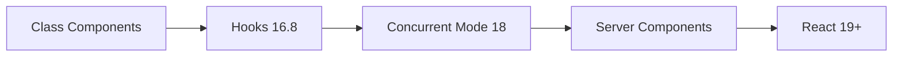

# React Deep Dive - Mastering Modern React

> Kiến thức React toàn diện từ cơ bản đến advanced - bao gồm hooks, patterns, internals, và performance optimization

---

## Tổng Quan

React là **framework frontend phổ biến nhất** và là yêu cầu bắt buộc cho hầu hết vị trí frontend tại Big Tech. Module này cover tất cả những gì bạn cần biết từ Junior đến Senior level.

### React Evolution



---

## Cấu Trúc Module

| File | Chủ Đề | Độ Quan Trọng |
|------|--------|---------------|
| [01-react-fundamentals.md](./01-react-fundamentals.md) | Components, JSX, Props, State | ⭐⭐⭐⭐⭐ |
| [02-hooks-deep-dive.md](./02-hooks-deep-dive.md) | useState, useEffect, useRef, useMemo, useCallback | ⭐⭐⭐⭐⭐ |
| [03-state-management.md](./03-state-management.md) | Context, Redux, Zustand, Jotai | ⭐⭐⭐⭐⭐ |
| [04-component-patterns.md](./04-component-patterns.md) | HOC, Render Props, Compound Components | ⭐⭐⭐⭐ |
| [05-react-internals.md](./05-react-internals.md) | Virtual DOM, Fiber, Reconciliation | ⭐⭐⭐⭐⭐ |
| [06-performance-optimization.md](./06-performance-optimization.md) | React.memo, useMemo, Code Splitting | ⭐⭐⭐⭐⭐ |
| [07-testing-react.md](./07-testing-react.md) | Jest, React Testing Library | ⭐⭐⭐⭐ |
| [mindmap-react.md](./mindmap-react.md) | Sơ Đồ Tổng Hợp | Review |

---

## Lộ Trình Học

### Tuần 1: Fundamentals & Hooks
```
Ngày 1-2: React Fundamentals (Components, JSX, Props)
Ngày 3-4: Hooks - useState, useEffect
Ngày 5-6: Hooks - useRef, useMemo, useCallback
Ngày 7:   Custom Hooks + Practice
```

### Tuần 2: Advanced & Performance
```
Ngày 1-2: State Management
Ngày 3:   Component Patterns
Ngày 4-5: React Internals
Ngày 6:   Performance Optimization
Ngày 7:   Testing + Review
```

---

## Sơ Đồ Quan Hệ

```
┌─────────────────────────────────────────────────────────────────────┐
│                           REACT ECOSYSTEM                            │
├─────────────────────────────────────────────────────────────────────┤
│                                                                       │
│  ┌───────────────┐      ┌───────────────┐      ┌───────────────┐    │
│  │  COMPONENTS   │      │    HOOKS      │      │    STATE      │    │
│  ├───────────────┤      ├───────────────┤      ├───────────────┤    │
│  │ • Functional  │◄────►│ • useState    │◄────►│ • Local       │    │
│  │ • JSX         │      │ • useEffect   │      │ • Context     │    │
│  │ • Props       │      │ • useRef      │      │ • Redux       │    │
│  │ • Children    │      │ • useMemo     │      │ • Zustand     │    │
│  │ • Composition │      │ • useCallback │      │ • Jotai       │    │
│  └───────┬───────┘      │ • useReducer  │      └───────────────┘    │
│          │              │ • Custom      │                            │
│          │              └───────────────┘                            │
│          │                                                           │
│          ▼                                                           │
│  ┌───────────────────────────────────────────────────────────────┐  │
│  │                        INTERNALS                               │  │
│  ├───────────────────────────────────────────────────────────────┤  │
│  │  Virtual DOM  ──►  Fiber  ──►  Reconciliation  ──►  Commit   │  │
│  └───────────────────────────────────────────────────────────────┘  │
│                                                                       │
│  ┌───────────────────────────────────────────────────────────────┐  │
│  │                       PERFORMANCE                              │  │
│  ├───────────────────────────────────────────────────────────────┤  │
│  │  React.memo │ useMemo │ useCallback │ Lazy │ Suspense │ Code │  │
│  │             │         │             │      │          │ Split│  │
│  └───────────────────────────────────────────────────────────────┘  │
│                                                                       │
└─────────────────────────────────────────────────────────────────────┘
```

---

## Top Interview Questions

| # | Câu hỏi | Difficulty | File |
|---|---------|------------|------|
| 1 | useEffect dependencies hoạt động như thế nào? | 🟡 | [02-hooks-deep-dive.md](./02-hooks-deep-dive.md) |
| 2 | Khi nào component re-render? | 🟡 | [06-performance-optimization.md](./06-performance-optimization.md) |
| 3 | React Fiber là gì? | 🔴 | [05-react-internals.md](./05-react-internals.md) |
| 4 | useMemo vs useCallback? | 🟢 | [02-hooks-deep-dive.md](./02-hooks-deep-dive.md) |
| 5 | Controlled vs Uncontrolled components? | 🟢 | [01-react-fundamentals.md](./01-react-fundamentals.md) |
| 6 | Giải thích Virtual DOM | 🟡 | [05-react-internals.md](./05-react-internals.md) |
| 7 | Context API vs Redux? | 🟡 | [03-state-management.md](./03-state-management.md) |
| 8 | Implement custom hook | 🟡 | [02-hooks-deep-dive.md](./02-hooks-deep-dive.md) |
| 9 | Optimize large list rendering | 🔴 | [06-performance-optimization.md](./06-performance-optimization.md) |
| 10 | Error Boundaries | 🟡 | [01-react-fundamentals.md](./01-react-fundamentals.md) |

---

## Quick Reference

### Hooks Rules
```javascript
// ✅ Call hooks at top level
// ✅ Call hooks from React functions
// ❌ Don't call hooks in loops, conditions, or nested functions

function Component() {
    // ✅ Top level
    const [state, setState] = useState();

    if (condition) {
        // ❌ Inside condition
        // const [x, setX] = useState();
    }
}
```

### Common Patterns
```javascript
// Controlled Input
const [value, setValue] = useState('');
<input value={value} onChange={e => setValue(e.target.value)} />

// Conditional Rendering
{isLoading ? <Spinner /> : <Content />}
{items.length > 0 && <List items={items} />}

// Event Handling
<button onClick={() => handleClick(id)}>Click</button>
```

---

## Company-Specific Focus

### Google
- React internals deep dive
- Performance optimization
- Large-scale state management

### Meta
- Hooks mastery (they created React!)
- Server Components
- Concurrent features

### Amazon
- Component patterns
- Accessibility
- Testing practices

---

## Resources

### Official
- [React Documentation](https://react.dev)
- [React Blog](https://react.dev/blog)

### Deep Dives
- [Overreacted](https://overreacted.io) - Dan Abramov
- [Kent C. Dodds Blog](https://kentcdodds.com/blog)

### Practice
- [React Challenges](https://www.greatfrontend.com/questions/react)
- [Frontend Interview Handbook - React](https://www.frontendinterviewhandbook.com/react)

---

> **Thời gian ước tính:** 2 tuần (2-3h/ngày)
