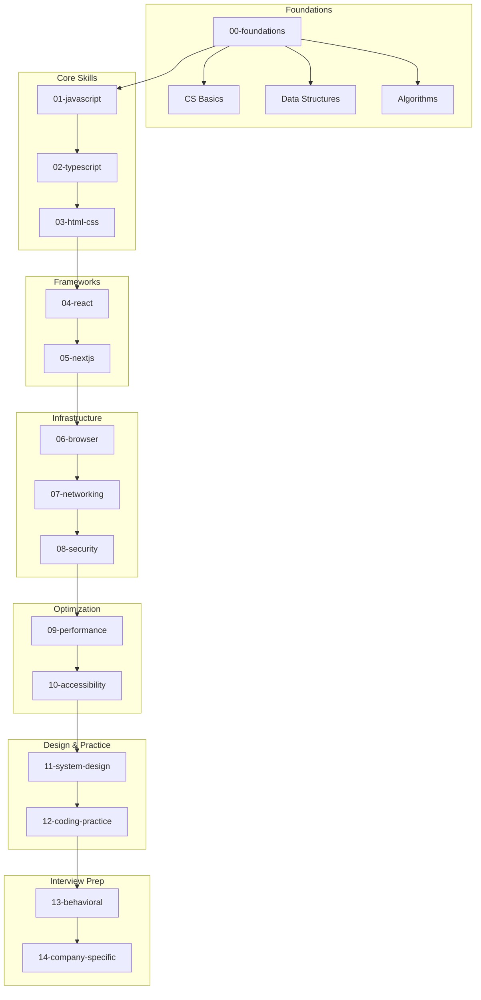
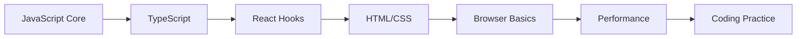
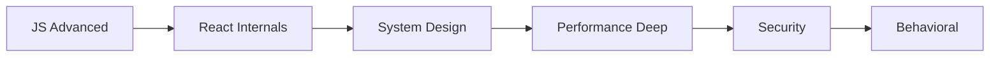

# Frontend Interview Preparation - Big Tech

> Tài liệu ôn phỏng vấn Frontend toàn diện cho vị trí Mid-Senior tại các công ty Big Tech (Google, Meta, Amazon, Microsoft, Apple, Netflix)

---

## Giới Thiệu

Đây là bộ tài liệu được thiết kế theo các **phương pháp học hiện đại** từ Oxford, Harvard, Cambridge và Nhật Bản. Mỗi chủ đề được trình bày theo cấu trúc **What → Why → How → When** để giúp bạn hiểu sâu và nhớ lâu hơn.

### Đặc điểm nổi bật

- **80% lý thuyết chi tiết** - Hiểu bản chất, không chỉ syntax
- **Visualization** - Sơ đồ, diagrams cho mỗi concept
- **Câu hỏi phỏng vấn thực tế** - Phân loại theo level Junior/Mid/Senior
- **Phương pháp học khoa học** - Spaced Repetition, Active Recall, Feynman Technique
- **Kế hoạch 6 tháng** - Lộ trình chi tiết từng tuần

---

## Sơ Đồ Tổng Quan



---

## Cấu Trúc Thư Mục

| Folder | Nội Dung | Độ Ưu Tiên |
|--------|----------|------------|
| [00-foundations](./00-foundations/) | CS cơ bản, Data Structures, Algorithms | Cao |
| [01-javascript](./01-javascript/) | JavaScript Core - Closures, Event Loop, Prototypes | Rất Cao |
| [02-typescript](./02-typescript/) | Type System, Generics, Utility Types | Cao |
| [03-html-css](./03-html-css/) | Semantic HTML, Flexbox, Grid, Responsive | Trung bình |
| [04-react](./04-react/) | Hooks, State, Patterns, React Internals | Rất Cao |
| [05-nextjs](./05-nextjs/) | App Router, RSC, SSR/SSG/ISR | Cao |
| [06-browser](./06-browser/) | Rendering Pipeline, V8, DevTools | Cao |
| [07-networking](./07-networking/) | HTTP, REST, GraphQL, WebSockets | Cao |
| [08-security](./08-security/) | XSS, CSRF, Authentication, CSP | Cao |
| [09-performance](./09-performance/) | Core Web Vitals, Optimization | Rất Cao |
| [10-accessibility](./10-accessibility/) | WCAG, ARIA, Keyboard Navigation | Trung bình |
| [11-system-design](./11-system-design/) | RADIO Framework, Architecture Patterns | Rất Cao |
| [12-coding-practice](./12-coding-practice/) | Bài tập thực hành theo category | Rất Cao |
| [13-behavioral](./13-behavioral/) | STAR Method, Leadership Principles | Cao |
| [14-company-specific](./14-company-specific/) | Google, Meta, Amazon, Microsoft, Apple, Netflix | Cao |
| [resources](./resources/) | Flashcards, Cheatsheets, Diagrams | Hỗ trợ |

---

## Bắt Đầu Từ Đâu?

### Bước 1: Đọc Phương Pháp Học
Trước khi bắt đầu, hãy đọc [LEARNING-METHODOLOGY.md](./LEARNING-METHODOLOGY.md) để hiểu cách học hiệu quả nhất.

### Bước 2: Xem Kế Hoạch 6 Tháng
Tham khảo [6-MONTH-STUDY-PLAN.md](./6-MONTH-STUDY-PLAN.md) để có lộ trình chi tiết.

### Bước 3: Theo Dõi Tiến Độ
Sử dụng [PROGRESS-TRACKER.md](./PROGRESS-TRACKER.md) để đánh giá và theo dõi tiến độ học tập.

### Bước 4: Học Theo Thứ Tự
```
Tuần 1-4:   JavaScript Core → TypeScript
Tuần 5-8:   React → Next.js
Tuần 9-12:  Browser → Networking → Security
Tuần 13-16: Performance → Accessibility → System Design
Tuần 17-20: Coding Practice Intensive
Tuần 21-24: Mock Interviews + Company-Specific
```

---

## Lộ Trình Học Đề Xuất

### Cho Junior → Mid (1-3 năm kinh nghiệm)



**Focus:**
- JavaScript fundamentals (closures, this, prototypes)
- React hooks và component patterns
- CSS layouts (Flexbox, Grid)
- Coding challenges (LeetCode Easy-Medium)

### Cho Mid → Senior (3-5+ năm kinh nghiệm)



**Focus:**
- React internals (Fiber, Reconciliation)
- Frontend System Design (RADIO framework)
- Performance optimization (Core Web Vitals)
- Security best practices (OWASP Top 10)
- Behavioral questions (STAR method)

---

## Phương Pháp Học

### 1. Spaced Repetition (Lặp lại ngắt quãng)
```
Ngày 1 → Ngày 3 → Ngày 7 → Ngày 14 → Ngày 30
```
Sử dụng flashcards trong folder `resources/flashcards/`

### 2. Active Recall (Nhớ lại chủ động)
- Đọc xong → Đóng tài liệu → Tự giải thích lại
- Làm bài không nhìn solution trước
- Sử dụng "Active Recall Questions" cuối mỗi file

### 3. Feynman Technique
- Giải thích concept như đang dạy người mới học
- Xác định gaps trong hiểu biết
- Đơn giản hóa bằng analogies

### 4. Pomodoro + Kaizen
- 25 phút focus + 5 phút nghỉ
- 4 pomodoros → nghỉ dài 15-30 phút
- Cải tiến nhỏ mỗi ngày

---

## Chuẩn Bị Phỏng Vấn Theo Công Ty

### Google
- **DSA:** LeetCode Medium-Hard (focus Array, String, Tree)
- **Frontend:** DOM manipulation, performance
- **System Design:** Large-scale frontend apps

### Meta
- **React:** Hooks deep dive, state management
- **System Design:** News feed, chat, notifications
- **Behavioral:** Impact và collaboration

### Amazon
- **Leadership Principles:** 16 LPs - chuẩn bị stories cho mỗi LP
- **Frontend:** Vanilla JS, DOM, browser APIs
- **Coding:** UI component implementation

### Microsoft
- **React:** Component design, state patterns
- **Algorithms:** LeetCode Easy-Medium
- **System Design:** Accessible, scalable UIs

### Apple
- **Design:** Attention to detail, pixel-perfect UI
- **Performance:** Smooth animations, 60fps
- **Accessibility:** VoiceOver compatibility

### Netflix
- **Performance:** Streaming, lazy loading, caching
- **React:** Advanced patterns, testing
- **System Design:** Video streaming frontend

---

## Thời Gian Học Đề Xuất

### Nếu có 6 tháng:
- 2-3 giờ/ngày
- Theo kế hoạch chi tiết trong [6-MONTH-STUDY-PLAN.md](./6-MONTH-STUDY-PLAN.md)

### Nếu có 3 tháng:
- 4-5 giờ/ngày
- Tập trung vào: JS, React, System Design, Coding

### Nếu có 1 tháng:
- 6-8 giờ/ngày
- Focus: Top questions, mock interviews, weak areas

---

## Daily Practice Template

```markdown
## Morning (1-2 giờ)
- [ ] 30 phút: SRS review (flashcards)
- [ ] 30 phút: Học concept mới
- [ ] 30 phút: Active recall exercises

## Evening (1-2 giờ)
- [ ] 1 giờ: Coding practice (1-2 problems)
- [ ] 30 phút: Review notes, mind mapping

## Weekly
- [ ] 1 mock interview (behavioral hoặc technical)
- [ ] 1 system design practice
- [ ] Review và consolidate tuần
```

---

## Tài Nguyên Bổ Sung

### Websites
- [LeetCode](https://leetcode.com) - Luyện algorithms
- [GreatFrontend](https://greatfrontend.com) - Frontend-specific practice
- [FrontendMasters](https://frontendmasters.com) - Video courses

### Books
- "You Don't Know JS" - Kyle Simpson
- "JavaScript: The Good Parts" - Douglas Crockford
- "Designing Data-Intensive Applications" - Martin Kleppmann

### YouTube Channels
- Fireship - Quick concepts
- Ben Awad - React, GraphQL
- Traversy Media - Full tutorials

---

## Đóng Góp

Nếu bạn muốn đóng góp hoặc phát hiện lỗi:
1. Fork repository
2. Tạo branch mới
3. Submit Pull Request

---

## License

MIT License - Sử dụng tự do cho mục đích học tập.

---

> **Lưu ý:** Tài liệu này được thiết kế cho frontend engineers với 2-5 năm kinh nghiệm, chuẩn bị phỏng vấn vào các vị trí Mid-Senior tại Big Tech companies. Mỗi topic được viết chi tiết 3000-5000+ words với nhiều ví dụ thực tế.
