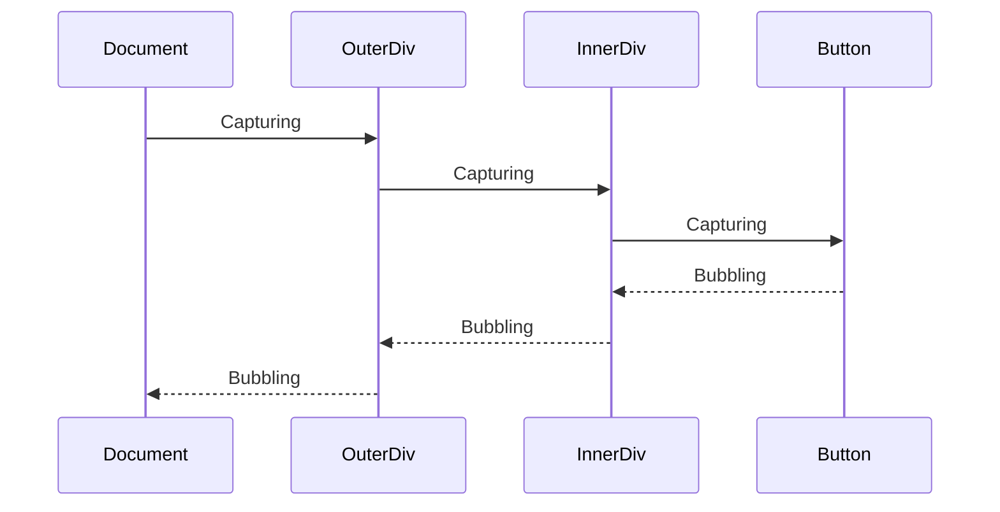

# DOM Manipulation: Complete Deep Dive / Thao tác DOM: Tìm hiểu chuyên sâu

## Table of Contents / Mục lục

- [Understanding the DOM / Hiểu về DOM](#understanding-the-dom)
- [DOM Tree Structure / Cấu trúc cây DOM](#dom-tree-structure)
- [Element Selection Methods / Phương thức chọn Element](#element-selection-methods)
- [Creating and Modifying Elements / Tạo và sửa đổi Elements](#creating-and-modifying-elements)
- [Event System Deep Dive / Tìm hiểu sâu hệ thống Sự kiện](#event-system-deep-dive)
- [Performance Optimization / Tối ưu hiệu suất](#performance-optimization)
- [Modern DOM APIs / DOM APIs hiện đại](#modern-dom-apis)
- [Visual Diagrams / Sơ đồ trực quan](#visual-diagrams)
- [Best Practices / Thực hành tốt nhất](#best-practices)
- [Interview Questions & Answers / Câu hỏi phỏng vấn & Câu trả lời](#interview-questions--answers)
- [Advanced Techniques / Kỹ thuật nâng cao](#advanced-techniques)

## Understanding the DOM / Hiểu về DOM

### What is the DOM? / DOM là gì?

**English:** The **Document Object Model (DOM)** is a programming interface for HTML and XML documents. It represents the document as a tree of objects that can be modified with JavaScript.

**Tiếng Việt:** **Document Object Model (DOM)** là một giao diện lập trình cho tài liệu HTML và XML. Nó đại diện cho tài liệu dưới dạng cây các đối tượng có thể được sửa đổi bằng JavaScript.

#### Key Concepts / Khái niệm chính:

**1. Live Representation / Đại diện trực tiếp**

**English:**
- The DOM is a **live**, in-memory representation of the document
- Changes to the DOM immediately affect the rendered page
- JavaScript can read and modify the DOM in real-time

**Tiếng Việt:**
- DOM là một đại diện **trực tiếp**, trong bộ nhớ của tài liệu
- Thay đổi DOM ngay lập tức ảnh hưởng đến trang được hiển thị
- JavaScript có thể đọc và sửa đổi DOM theo thời gian thực

**2. Object-Oriented Interface**

- Every element, attribute, and piece of text is an **object**
- Objects have properties and methods for manipulation
- Follows a hierarchical tree structure

**3. Language-Agnostic API**

- While commonly used with JavaScript, DOM APIs work with any language
- Standardized by W3C and WHATWG
- Consistent across different browsers (mostly)

### DOM vs HTML

```html
<!-- HTML Source Code -->
<html>
  <head>
    <title>My Page</title>
  </head>
  <body>
    <h1>Hello World</h1>
    <p>Welcome to my page</p>
  </body>
</html>
```

**HTML**: Static markup language
**DOM**: Dynamic object representation

```javascript
// DOM Representation (simplified)
{
    nodeType: 9, // DOCUMENT_NODE
    nodeName: "#document",
    children: [
        {
            nodeType: 1, // ELEMENT_NODE
            nodeName: "HTML",
            children: [
                {
                    nodeType: 1,
                    nodeName: "HEAD",
                    children: [/* title element */]
                },
                {
                    nodeType: 1,
                    nodeName: "BODY",
                    children: [/* h1 and p elements */]
                }
            ]
        }
    ]
}
```

## DOM Tree Structure

### Node Types and Hierarchy

The DOM represents documents as a tree of **nodes**:

```
                    document (Document Node)
                         │
                      html (Element Node)
                    ┌─────┴─────┐
                 head          body (Element Nodes)
                   │             │
               title          ┌───┴───┐
                 │          h1        p (Element Nodes)
           "My Page"         │        │
           (Text Node)  "Hello World" "Welcome..." (Text Nodes)
```

### Node Types (Complete List)


```javascript
// Node types with their numeric constants
const NODE_TYPES = {
  ELEMENT_NODE: 1, // <div>, <span>, etc.
  ATTRIBUTE_NODE: 2, // class="example" (deprecated)
  TEXT_NODE: 3, // Text content
  CDATA_SECTION_NODE: 4, // <![CDATA[...]]>
  ENTITY_REFERENCE_NODE: 5, // &amp; (deprecated)
  ENTITY_NODE: 6, // (deprecated)
  PROCESSING_INSTRUCTION_NODE: 7, // <?xml-stylesheet ... ?>
  COMMENT_NODE: 8, // <!-- comment -->
  DOCUMENT_NODE: 9, // document
  DOCUMENT_TYPE_NODE: 10, // <!DOCTYPE html>
  DOCUMENT_FRAGMENT_NODE: 11, // document.createDocumentFragment()
  NOTATION_NODE: 12, // (deprecated)
};

// Example usage
function analyzeNode(node) {
  switch (node.nodeType) {
    case Node.ELEMENT_NODE:
      console.log(`Element: ${node.tagName}`);
      break;
    case Node.TEXT_NODE:
      console.log(`Text: "${node.textContent}"`);
      break;
    case Node.COMMENT_NODE:
      console.log(`Comment: ${node.textContent}`);
      break;
    default:
      console.log(`Other node type: ${node.nodeType}`);
  }
}
```


### Node Properties and Relationships

Every DOM node has properties that describe its relationships:

```javascript
// Node relationship properties
const element = document.getElementById("myElement");

// Parent relationships
element.parentNode; // Immediate parent (any node type)
element.parentElement; // Parent element (null if parent isn't element)

// Child relationships
element.childNodes; // All child nodes (including text, comments)
element.children; // Only child elements
element.firstChild; // First child node
element.lastChild; // Last child node
element.firstElementChild; // First child element
element.lastElementChild; // Last child element

// Sibling relationships
element.nextSibling; // Next sibling node
element.previousSibling; // Previous sibling node
element.nextElementSibling; // Next sibling element
element.previousElementSibling; // Previous sibling element

// Document relationships
element.ownerDocument; // Reference to document
element.getRootNode(); // Root node (document or shadow root)
```

### Detailed Tree Navigation Example

```html
<div id="container">
  <!-- This is a comment -->
  <h1>Title</h1>
  Some text content
  <p>Paragraph</p>
  <span>Span element</span>
</div>
```

```javascript
const container = document.getElementById("container");

// Understanding childNodes vs children
console.log(container.childNodes.length); // 7 (includes text nodes and comment)
console.log(container.children.length); // 3 (only h1, p, span elements)

// Iterating through all nodes
for (let node of container.childNodes) {
  if (node.nodeType === Node.ELEMENT_NODE) {
    console.log(`Element: ${node.tagName}`);
  } else if (node.nodeType === Node.TEXT_NODE) {
    const text = node.textContent.trim();
    if (text) console.log(`Text: "${text}"`);
  } else if (node.nodeType === Node.COMMENT_NODE) {
    console.log(`Comment: ${node.textContent}`);
  }
}

// Output:
// Comment: This is a comment
// Element: H1
// Text: "Some text content"
// Element: P
// Element: SPAN
```

## Element Selection Methods

### Performance Comparison of Selection Methods

```javascript
// Performance ranking (fastest to slowest)
// 1. getElementById - O(1) hash lookup
const element = document.getElementById("myId");

// 2. getElementsByTagName - optimized native implementation
const paragraphs = document.getElementsByTagName("p");

// 3. getElementsByClassName - optimized for class selection
const highlighted = document.getElementsByClassName("highlight");

// 4. querySelector - flexible but slower for simple selections
const firstParagraph = document.querySelector("p");

// 5. querySelectorAll - most flexible but slowest
const allParagraphs = document.querySelectorAll("p");
```

### Advanced Selector Strategies

**1. Context-Specific Selection**

```javascript
// Instead of searching entire document
const expensiveSearch = document.querySelectorAll(".item .title");

// Search within a specific container
const container = document.getElementById("itemContainer");
const efficientSearch = container.querySelectorAll(".title");

// Even better: use more specific selectors
const verySpecific = document.querySelectorAll(
  "#itemContainer > .item > .title"
);
```

**2. Live vs Static Collections**

```javascript
// Live collections (automatically update)
const liveCollection = document.getElementsByClassName("dynamic");
console.log(liveCollection.length); // 3

// Add new element with class 'dynamic'
const newElement = document.createElement("div");
newElement.className = "dynamic";
document.body.appendChild(newElement);

console.log(liveCollection.length); // 4 (automatically updated!)

// Static collections (snapshot at query time)
const staticCollection = document.querySelectorAll(".dynamic");
console.log(staticCollection.length); // 3 (doesn't change)
```

**3. Custom Selection Utilities**

```javascript
class DOMSelector {
  // Enhanced getElementById with error handling
  static byId(id, context = document) {
    const element = context.getElementById(id);
    if (!element) {
      console.warn(`Element with id "${id}" not found`);
    }
    return element;
  }

  // Get element with data attribute
  static byData(attribute, value, context = document) {
    return context.querySelector(`[data-${attribute}="${value}"]`);
  }

  // Get all elements matching multiple classes
  static byClasses(classes, context = document) {
    const selector = classes.map((cls) => `.${cls}`).join("");
    return context.querySelectorAll(selector);
  }

  // Get closest ancestor matching selector
  static closest(element, selector) {
    return element.closest(selector);
  }

  // Get all descendants matching selector
  static descendants(element, selector) {
    return element.querySelectorAll(selector);
  }

  // Check if element matches selector
  static matches(element, selector) {
    return element.matches(selector);
  }
}

// Usage examples
const header = DOMSelector.byId("header");
const dataElement = DOMSelector.byData("role", "button");
const multiClass = DOMSelector.byClasses(["btn", "primary"]);
const parentSection = DOMSelector.closest(button, "section");
```

## Creating and Modifying Elements

### Element Creation Patterns

**1. Basic Element Creation**

```javascript
// Create element
const div = document.createElement("div");

// Set attributes
div.id = "myDiv";
div.className = "container highlight";
div.setAttribute("data-role", "content");

// Set content
div.textContent = "Hello World";
div.innerHTML = "<strong>Bold text</strong>";

// Append to document
document.body.appendChild(div);
```

**2. Advanced Element Factory**

```javascript
class ElementFactory {
  static create(tagName, options = {}) {
    const element = document.createElement(tagName);

    // Set attributes
    if (options.attributes) {
      Object.entries(options.attributes).forEach(([key, value]) => {
        element.setAttribute(key, value);
      });
    }

    // Set properties
    if (options.properties) {
      Object.assign(element, options.properties);
    }

    // Set styles
    if (options.styles) {
      Object.assign(element.style, options.styles);
    }

    // Set content
    if (options.textContent) {
      element.textContent = options.textContent;
    } else if (options.innerHTML) {
      element.innerHTML = options.innerHTML;
    }

    // Add event listeners
    if (options.events) {
      Object.entries(options.events).forEach(([event, handler]) => {
        element.addEventListener(event, handler);
      });
    }

    // Add children
    if (options.children) {
      options.children.forEach((child) => {
        if (typeof child === "string") {
          element.appendChild(document.createTextNode(child));
        } else {
          element.appendChild(child);
        }
      });
    }

    return element;
  }

  // Specialized creation methods
  static button(text, onClick, className = "btn") {
    return this.create("button", {
      textContent: text,
      properties: { className },
      events: { click: onClick },
    });
  }

  static input(type, placeholder, name) {
    return this.create("input", {
      attributes: { type, placeholder, name },
    });
  }

  static div(className, content) {
    return this.create("div", {
      properties: { className },
      innerHTML: content,
    });
  }
}

// Usage
const button = ElementFactory.button("Click me", () => alert("Clicked!"));
const input = ElementFactory.input("text", "Enter name...", "username");
const container = ElementFactory.div("form-container", "");

container.appendChild(input);
container.appendChild(button);
document.body.appendChild(container);
```

### Document Fragments for Performance

**Problem: Multiple DOM Manipulations**

```javascript
// SLOW: Each appendChild causes reflow
const container = document.getElementById("container");
for (let i = 0; i < 1000; i++) {
  const div = document.createElement("div");
  div.textContent = `Item ${i}`;
  container.appendChild(div); // Reflow on each iteration!
}
```

**Solution: Document Fragment**

```javascript
// FAST: Only one reflow at the end
const container = document.getElementById("container");
const fragment = document.createDocumentFragment();

for (let i = 0; i < 1000; i++) {
  const div = document.createElement("div");
  div.textContent = `Item ${i}`;
  fragment.appendChild(div); // No reflow
}

container.appendChild(fragment); // Single reflow
```

**Advanced Fragment Usage**

```javascript
class DOMBatchProcessor {
  constructor() {
    this.fragment = document.createDocumentFragment();
    this.operations = [];
  }

  // Queue element creation
  createElement(tagName, options = {}) {
    const element = ElementFactory.create(tagName, options);
    this.fragment.appendChild(element);
    return element;
  }

  // Queue existing element
  addElement(element) {
    this.fragment.appendChild(element);
    return this;
  }

  // Commit all changes at once
  commitTo(container) {
    container.appendChild(this.fragment);
    this.fragment = document.createDocumentFragment(); // Reset
    return this;
  }

  // Create multiple similar elements
  createMultiple(count, tagName, optionsGenerator) {
    for (let i = 0; i < count; i++) {
      const options =
        typeof optionsGenerator === "function"
          ? optionsGenerator(i)
          : optionsGenerator;
      this.createElement(tagName, options);
    }
    return this;
  }
}

// Usage
const processor = new DOMBatchProcessor();

processor
  .createMultiple(100, "div", (index) => ({
    textContent: `Item ${index}`,
    properties: { className: "list-item" },
    attributes: { "data-index": index },
  }))
  .commitTo(document.getElementById("list"));
```

## Event System Deep Dive

### Event Flow: Capturing, Target, Bubbling

```
Event Flow Phases:

Phase 1: CAPTURING (top-down)
┌─────────────────────────────────────┐
│            document                 │
│  ┌─────────────────────────────┐    │
│  │           html              │ ←──┼── Event travels down
│  │  ┌─────────────────────┐    │    │
│  │  │        body         │ ←──┼────┤
│  │  │  ┌─────────────┐    │    │    │
│  │  │  │    div      │ ←──┼────┼────┤
│  │  │  │  ┌─────┐    │    │    │    │
│  │  │  │  │ btn │ ←──┼────┼────┼────┘
│  │  │  │  └─────┘    │    │    │
│  │  │  └─────────────┘    │    │
│  │  └─────────────────────┘    │
│  └─────────────────────────────┘
└─────────────────────────────────────┘

Phase 2: TARGET
Button receives the event

Phase 3: BUBBLING (bottom-up)
┌─────────────────────────────────────┐
│            document                 │
│  ┌─────────────────────────────┐    │
│  │           html              │ ←──┼── Event bubbles up
│  │  ┌─────────────────────┐    │    │
│  │  │        body         │ ←──┼────┤
│  │  │  ┌─────────────┐    │    │    │
│  │  │  │    div      │ ←──┼────┼────┤
│  │  │  │  ┌─────┐    │    │    │    │
│  │  │  │  │ btn │ ←──┼────┼────┼────┘
│  │  │  │  └─────┘    │    │    │
│  │  │  └─────────────┘    │    │
│  │  └─────────────────────┘    │
│  └─────────────────────────────┘
└─────────────────────────────────────┘
```

### Event Handling Patterns

**1. Event Delegation**

```javascript
// Instead of adding listeners to many elements
document.querySelectorAll(".button").forEach((button) => {
  button.addEventListener("click", handleButtonClick); // Many listeners
});

// Use event delegation on parent
document.getElementById("container").addEventListener("click", function (e) {
  if (e.target.matches(".button")) {
    handleButtonClick(e);
  }
});

// Advanced event delegation
class EventDelegator {
  constructor(container) {
    this.container =
      typeof container === "string"
        ? document.querySelector(container)
        : container;
    this.handlers = new Map();

    // Single listener for all events
    this.container.addEventListener("click", this.handleClick.bind(this));
    this.container.addEventListener("change", this.handleChange.bind(this));
    this.container.addEventListener("input", this.handleInput.bind(this));
  }

  // Register handler for specific selector
  on(eventType, selector, handler) {
    if (!this.handlers.has(eventType)) {
      this.handlers.set(eventType, new Map());
    }
    this.handlers.get(eventType).set(selector, handler);
    return this;
  }

  // Handle delegated events
  handleEvent(e) {
    const eventHandlers = this.handlers.get(e.type);
    if (!eventHandlers) return;

    // Check each selector
    for (const [selector, handler] of eventHandlers) {
      const target = e.target.closest(selector);
      if (target && this.container.contains(target)) {
        handler.call(target, e);
        break; // Stop at first match
      }
    }
  }

  handleClick(e) {
    this.handleEvent(e);
  }
  handleChange(e) {
    this.handleEvent(e);
  }
  handleInput(e) {
    this.handleEvent(e);
  }
}

// Usage
const delegator = new EventDelegator("#app");

delegator
  .on("click", ".btn", function (e) {
    console.log("Button clicked:", this.textContent);
  })
  .on("click", ".link", function (e) {
    e.preventDefault();
    console.log("Link clicked:", this.href);
  })
  .on("input", ".search", function (e) {
    console.log("Search input:", this.value);
  });
```

**2. Custom Event System**

```javascript
class CustomEventEmitter {
  constructor(element) {
    this.element = element;
    this.listeners = new Map();
  }

  // Emit custom event
  emit(eventType, detail = null) {
    const event = new CustomEvent(eventType, {
      detail,
      bubbles: true,
      cancelable: true,
    });

    this.element.dispatchEvent(event);
    return event;
  }

  // Listen for custom events
  on(eventType, handler, options = {}) {
    this.element.addEventListener(eventType, handler, options);

    // Store for cleanup
    if (!this.listeners.has(eventType)) {
      this.listeners.set(eventType, new Set());
    }
    this.listeners.get(eventType).add(handler);

    return this;
  }

  // Remove specific listener
  off(eventType, handler) {
    this.element.removeEventListener(eventType, handler);

    if (this.listeners.has(eventType)) {
      this.listeners.get(eventType).delete(handler);
    }

    return this;
  }

  // Remove all listeners for event type
  offAll(eventType) {
    if (this.listeners.has(eventType)) {
      for (const handler of this.listeners.get(eventType)) {
        this.element.removeEventListener(eventType, handler);
      }
      this.listeners.delete(eventType);
    }

    return this;
  }

  // Cleanup all listeners
  destroy() {
    for (const [eventType, handlers] of this.listeners) {
      for (const handler of handlers) {
        this.element.removeEventListener(eventType, handler);
      }
    }
    this.listeners.clear();
  }
}

// Usage
const emitter = new CustomEventEmitter(document.getElementById("myComponent"));

// Listen for custom events
emitter.on("dataLoaded", (e) => {
  console.log("Data loaded:", e.detail);
});

emitter.on("statusChanged", (e) => {
  console.log("Status changed:", e.detail.status);
});

// Emit custom events
emitter.emit("dataLoaded", { data: [1, 2, 3] });
emitter.emit("statusChanged", { status: "ready" });
```

### Event Performance Optimization

**1. Throttling and Debouncing Events**

```javascript
class EventOptimizer {
  static throttle(func, limit) {
    let inThrottle;
    return function () {
      const args = arguments;
      const context = this;
      if (!inThrottle) {
        func.apply(context, args);
        inThrottle = true;
        setTimeout(() => (inThrottle = false), limit);
      }
    };
  }

  static debounce(func, delay) {
    let timeoutId;
    return function () {
      const args = arguments;
      const context = this;
      clearTimeout(timeoutId);
      timeoutId = setTimeout(() => func.apply(context, args), delay);
    };
  }

  // Smart event optimization
  static optimize(element, eventType, handler, options = {}) {
    const { throttle, debounce, passive = true } = options;

    let optimizedHandler = handler;

    if (throttle) {
      optimizedHandler = this.throttle(handler, throttle);
    } else if (debounce) {
      optimizedHandler = this.debounce(handler, debounce);
    }

    element.addEventListener(eventType, optimizedHandler, { passive });

    return () => element.removeEventListener(eventType, optimizedHandler);
  }
}

// Usage
const scrollHandler = EventOptimizer.optimize(
  window,
  "scroll",
  () => console.log("Scrolled!"),
  { throttle: 100, passive: true }
);

const searchHandler = EventOptimizer.optimize(
  document.getElementById("search"),
  "input",
  (e) => performSearch(e.target.value),
  { debounce: 300 }
);
```

## Performance Optimization

### Reflow and Repaint Optimization

**Understanding Browser Rendering Pipeline:**

```
1. Layout (Reflow) - Calculate positions and dimensions
2. Paint - Fill in pixels for each element
3. Composite - Combine layers for final image
```

**Properties that trigger reflows:**

- `width`, `height`, `margin`, `padding`
- `border`, `position`, `top`, `left`
- `font-size`, `line-height`
- `display`, `float`

**Properties that only trigger repaints:**

- `color`, `background-color`
- `visibility`
- `outline`

**Properties that only trigger composite:**

- `transform`, `opacity`
- `filter`

**Optimization Strategies:**

**1. Batch DOM Reads and Writes**

```javascript
// BAD: Causes multiple reflows
function badExample() {
  const element = document.getElementById("myDiv");

  element.style.height = "100px"; // Write - triggers reflow
  const height = element.offsetHeight; // Read - forces reflow

  element.style.width = "200px"; // Write - triggers reflow
  const width = element.offsetWidth; // Read - forces reflow
}

// GOOD: Batch reads and writes
function goodExample() {
  const element = document.getElementById("myDiv");

  // Batch all reads first
  const currentHeight = element.offsetHeight;
  const currentWidth = element.offsetWidth;

  // Then batch all writes
  element.style.height = "100px";
  element.style.width = "200px";
}
```

**2. Use CSS Classes Instead of Inline Styles**

```javascript
// BAD: Multiple style changes
element.style.width = "200px";
element.style.height = "100px";
element.style.backgroundColor = "red";
element.style.border = "1px solid black";

// GOOD: Single class change
element.className = "optimized-style";
```

**3. Virtualization for Large Lists**

```javascript
class VirtualList {
  constructor(container, items, itemHeight, visibleCount) {
    this.container = container;
    this.items = items;
    this.itemHeight = itemHeight;
    this.visibleCount = visibleCount;
    this.scrollTop = 0;

    this.init();
  }

  init() {
    // Create container for all items (sets scroll height)
    this.totalHeight = this.items.length * this.itemHeight;
    this.container.style.height = `${this.visibleCount * this.itemHeight}px`;
    this.container.style.overflow = "auto";

    // Create viewport
    this.viewport = document.createElement("div");
    this.viewport.style.height = `${this.totalHeight}px`;
    this.viewport.style.position = "relative";

    // Create visible items container
    this.visibleContainer = document.createElement("div");
    this.visibleContainer.style.position = "absolute";
    this.visibleContainer.style.top = "0";
    this.visibleContainer.style.width = "100%";

    this.viewport.appendChild(this.visibleContainer);
    this.container.appendChild(this.viewport);

    // Handle scrolling
    this.container.addEventListener("scroll", () => {
      this.scrollTop = this.container.scrollTop;
      this.render();
    });

    this.render();
  }

  render() {
    const startIndex = Math.floor(this.scrollTop / this.itemHeight);
    const endIndex = Math.min(
      startIndex + this.visibleCount + 1,
      this.items.length
    );

    // Clear current items
    this.visibleContainer.innerHTML = "";

    // Render visible items
    for (let i = startIndex; i < endIndex; i++) {
      const item = this.createItem(this.items[i], i);
      item.style.position = "absolute";
      item.style.top = `${i * this.itemHeight}px`;
      item.style.height = `${this.itemHeight}px`;
      this.visibleContainer.appendChild(item);
    }
  }

  createItem(data, index) {
    const item = document.createElement("div");
    item.textContent = `Item ${index}: ${data}`;
    item.style.border = "1px solid #ccc";
    item.style.padding = "10px";
    return item;
  }
}

// Usage for 10,000 items (only renders visible ones)
const items = Array.from({ length: 10000 }, (_, i) => `Data ${i}`);
const virtualList = new VirtualList(
  document.getElementById("list-container"),
  items,
  50, // item height
  20 // visible count
);
```

## Modern DOM APIs

### Intersection Observer

**Observing element visibility:**

```javascript
class VisibilityManager {
  constructor() {
    this.observers = new Map();
  }

  observe(element, callback, options = {}) {
    const defaultOptions = {
      root: null,
      rootMargin: "0px",
      threshold: 0.1,
    };

    const finalOptions = { ...defaultOptions, ...options };

    const observer = new IntersectionObserver((entries) => {
      entries.forEach((entry) => {
        callback(entry.target, entry.isIntersecting, entry);
      });
    }, finalOptions);

    observer.observe(element);
    this.observers.set(element, observer);

    return () => this.unobserve(element);
  }

  unobserve(element) {
    const observer = this.observers.get(element);
    if (observer) {
      observer.unobserve(element);
      this.observers.delete(element);
    }
  }

  disconnect() {
    for (const observer of this.observers.values()) {
      observer.disconnect();
    }
    this.observers.clear();
  }
}

// Usage: Lazy loading images
const visibilityManager = new VisibilityManager();

document.querySelectorAll("img[data-src]").forEach((img) => {
  visibilityManager.observe(img, (element, isVisible) => {
    if (isVisible) {
      element.src = element.dataset.src;
      element.removeAttribute("data-src");
      visibilityManager.unobserve(element);
    }
  });
});
```

### ResizeObserver

**Responding to element size changes:**

```javascript
class ResponsiveComponent {
  constructor(element) {
    this.element = element;
    this.breakpoints = {
      small: 300,
      medium: 600,
      large: 900,
    };

    this.init();
  }

  init() {
    this.resizeObserver = new ResizeObserver((entries) => {
      for (const entry of entries) {
        this.handleResize(entry);
      }
    });

    this.resizeObserver.observe(this.element);
  }

  handleResize(entry) {
    const { width } = entry.contentRect;

    // Remove all size classes
    this.element.classList.remove("small", "medium", "large");

    // Add appropriate class based on width
    if (width < this.breakpoints.small) {
      this.element.classList.add("small");
    } else if (width < this.breakpoints.medium) {
      this.element.classList.add("medium");
    } else {
      this.element.classList.add("large");
    }

    // Emit custom event
    this.element.dispatchEvent(
      new CustomEvent("sizeChanged", {
        detail: { width, height: entry.contentRect.height },
      })
    );
  }

  destroy() {
    this.resizeObserver.disconnect();
  }
}

// Usage
const responsiveComponent = new ResponsiveComponent(
  document.getElementById("responsive-element")
);
```

### MutationObserver

**Watching DOM changes:**

```javascript
class DOMWatcher {
  constructor() {
    this.observers = new Map();
  }

  watch(target, callback, options = {}) {
    const defaultOptions = {
      childList: true,
      subtree: false,
      attributes: false,
      attributeOldValue: false,
      characterData: false,
      characterDataOldValue: false,
    };

    const finalOptions = { ...defaultOptions, ...options };

    const observer = new MutationObserver((mutations) => {
      callback(mutations, observer);
    });

    observer.observe(target, finalOptions);
    this.observers.set(target, observer);

    return () => this.unwatch(target);
  }

  unwatch(target) {
    const observer = this.observers.get(target);
    if (observer) {
      observer.disconnect();
      this.observers.delete(target);
    }
  }

  disconnect() {
    for (const observer of this.observers.values()) {
      observer.disconnect();
    }
    this.observers.clear();
  }
}

// Usage: Auto-save when content changes
const watcher = new DOMWatcher();

watcher.watch(
  document.getElementById("editor"),
  (mutations) => {
    mutations.forEach((mutation) => {
      if (mutation.type === "childList" || mutation.type === "characterData") {
        console.log("Content changed, auto-saving...");
        autoSave();
      }
    });
  },
  {
    childList: true,
    subtree: true,
    characterData: true,
  }
);
```

## Interview Questions & Answers

### Q1: What's the difference between `innerHTML`, `textContent`, and `innerText`?

**Answer:**

**innerHTML**:

- Gets/sets HTML content including tags
- Parses HTML and creates DOM nodes
- Can execute scripts (security risk)
- Triggers reflow and repaint

**textContent**:

- Gets/sets only text content
- Ignores HTML tags
- Includes hidden elements
- Faster than innerText

**innerText**:

- Gets/sets visible text content
- Respects styling (hidden elements ignored)
- Triggers reflow to calculate visibility
- Slower than textContent

```javascript
const div = document.createElement("div");
div.innerHTML =
  '<span style="display:none">Hidden</span><strong>Visible</strong>';

console.log(div.innerHTML); // '<span style="display:none">Hidden</span><strong>Visible</strong>'
console.log(div.textContent); // 'HiddenVisible'
console.log(div.innerText); // 'Visible' (hidden span ignored)
```

### Q2: Explain event bubbling and capturing with an example.

**Answer:**

Event propagation occurs in three phases:

1. **Capturing phase**: Event travels from document to target
2. **Target phase**: Event reaches the target element
3. **Bubbling phase**: Event travels from target back to document

```html
<div id="outer">
  <div id="inner">
    <button id="button">Click me</button>
  </div>
</div>
```

```javascript
// Capturing listeners (third parameter = true)
document.getElementById("outer").addEventListener(
  "click",
  () => {
    console.log("Outer captured");
  },
  true
);

document.getElementById("inner").addEventListener(
  "click",
  () => {
    console.log("Inner captured");
  },
  true
);

// Bubbling listeners (default)
document.getElementById("button").addEventListener("click", () => {
  console.log("Button clicked");
});

document.getElementById("inner").addEventListener("click", () => {
  console.log("Inner bubbled");
});

document.getElementById("outer").addEventListener("click", () => {
  console.log("Outer bubbled");
});

// When button is clicked, output:
// Outer captured
// Inner captured
// Button clicked
// Inner bubbled
// Outer bubbled
```

### Q3: How would you implement efficient DOM manipulation for adding 1000 elements?

**Answer:**

**Bad approach (causes 1000 reflows):**

```javascript
const container = document.getElementById("container");
for (let i = 0; i < 1000; i++) {
  const div = document.createElement("div");
  div.textContent = `Item ${i}`;
  container.appendChild(div); // Reflow on each append
}
```

**Good approaches:**

**1. Document Fragment:**

```javascript
const container = document.getElementById("container");
const fragment = document.createDocumentFragment();

for (let i = 0; i < 1000; i++) {
  const div = document.createElement("div");
  div.textContent = `Item ${i}`;
  fragment.appendChild(div);
}

container.appendChild(fragment); // Single reflow
```

**2. innerHTML with array join:**

```javascript
const container = document.getElementById("container");
const html = [];

for (let i = 0; i < 1000; i++) {
  html.push(`<div>Item ${i}</div>`);
}

container.innerHTML = html.join(""); // Single reflow
```

**3. Template strings:**

```javascript
const container = document.getElementById("container");
const items = Array.from({ length: 1000 }, (_, i) => `<div>Item ${i}</div>`);
container.innerHTML = items.join("");
```

### Q4: What are the performance implications of different DOM querying methods?

**Answer:**

**Performance ranking (fastest to slowest):**

1. **getElementById()** - O(1) hash lookup

```javascript
document.getElementById("myId"); // Fastest
```

2. **getElementsByTagName()** - Optimized native implementation

```javascript
document.getElementsByTagName("div"); // Fast, returns live collection
```

3. **getElementsByClassName()** - Optimized for classes

```javascript
document.getElementsByClassName("myClass"); // Fast, returns live collection
```

4. **querySelector()** - CSS selector engine (returns first match)

```javascript
document.querySelector(".myClass"); // Slower, more flexible
```

5. **querySelectorAll()** - CSS selector engine (returns all matches)

```javascript
document.querySelectorAll(".myClass"); // Slowest, most flexible
```

**Optimization strategies:**

- Cache DOM references
- Use specific selectors
- Limit scope with context
- Prefer native methods for simple selections

### Q5: How do you prevent memory leaks in DOM manipulation?

**Answer:**

**Common causes and solutions:**

**1. Event listeners not removed:**

```javascript
// PROBLEM: Memory leak
function attachHandler() {
  const button = document.getElementById("button");
  const data = new Array(1000000); // Large data

  button.addEventListener("click", function () {
    console.log(data.length); // Keeps data in memory
  });
}

// SOLUTION: Proper cleanup
function attachHandler() {
  const button = document.getElementById("button");

  function clickHandler() {
    console.log("Clicked");
  }

  button.addEventListener("click", clickHandler);

  // Return cleanup function
  return () => {
    button.removeEventListener("click", clickHandler);
  };
}

const cleanup = attachHandler();
// Later: cleanup();
```

**2. Circular references:**

```javascript
// PROBLEM: Circular reference
const element = document.getElementById("myElement");
element.myProperty = {
  element: element, // Circular reference
  data: new Array(1000000),
};

// SOLUTION: Use WeakMap
const elementData = new WeakMap();
elementData.set(element, {
  data: new Array(1000000),
});
// When element is removed, data is automatically garbage collected
```

**3. Detached DOM nodes:**

```javascript
// PROBLEM: References to removed DOM nodes
const cache = [];
function cacheElement() {
  const element = document.querySelector(".temp");
  cache.push(element); // Keeps element in memory even after removal
}

// SOLUTION: Clear references
function clearCache() {
  cache.length = 0;
}
```

# Additional Advanced Interview Q&A and Visuals

## Q: How do you prevent XSS when updating the DOM with user input?

**Answer (English):**

- Never use `innerHTML` with untrusted data
- Use `textContent` or DOM methods
- Sanitize input with libraries (e.g., DOMPurify)

**Answer (Vietnamese):**

- Không dùng `innerHTML` với dữ liệu không tin cậy
- Dùng `textContent` hoặc các phương thức DOM
- Làm sạch dữ liệu với thư viện (ví dụ DOMPurify)

---

## Diagram: DOM Event Propagation (Capture & Bubble)



---

## Q: How would you optimize rendering performance in a large DOM tree?

**Answer (English):**

- Minimize reflows by batching DOM changes (use DocumentFragment, innerHTML with join, or requestAnimationFrame)
- Use virtual DOM or offscreen rendering for complex UIs
- Avoid layout thrashing (read/write DOM in separate phases)
- Use efficient selectors and cache references

**Answer (Vietnamese):**

- Giảm reflow bằng cách gộp thay đổi DOM (dùng DocumentFragment, innerHTML với join, hoặc requestAnimationFrame)
- Dùng virtual DOM hoặc render offscreen cho UI phức tạp
- Tránh layout thrashing (đọc/ghi DOM ở các phase riêng)
- Dùng selector hiệu quả và cache tham chiếu

---

This comprehensive guide covers DOM manipulation from fundamental concepts to advanced optimization techniques, providing the deep understanding needed for senior frontend engineering interviews.
