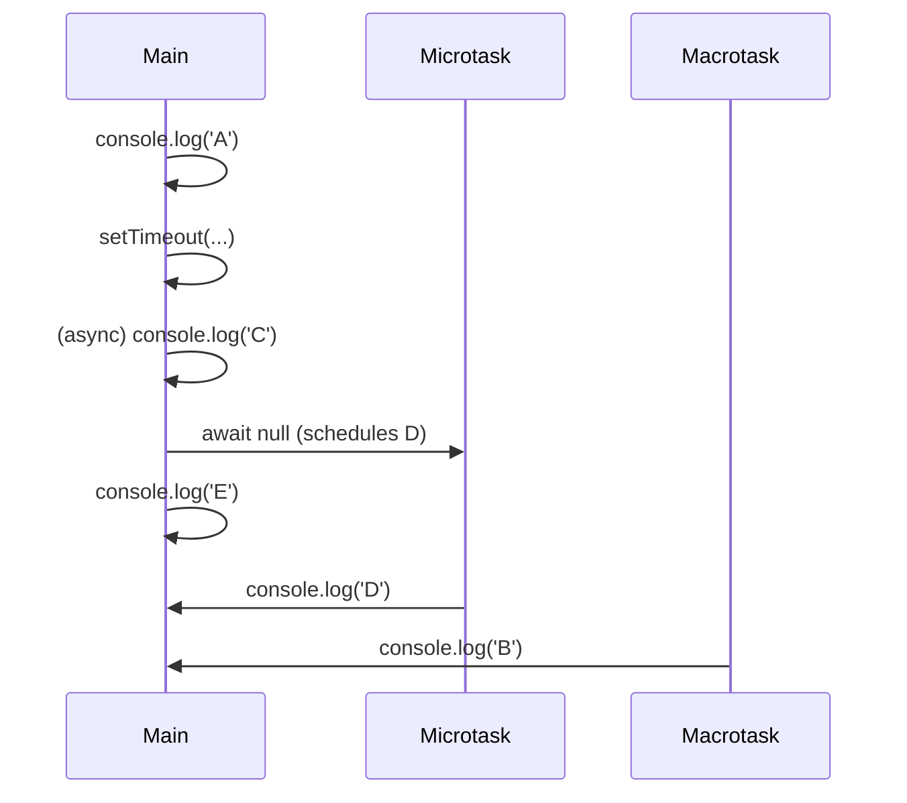

# JavaScript Event Loop: Complete Deep Dive / JavaScript Event Loop: Tìm hiểu chuyên sâu

## Table of Contents / Mục lục

- [Understanding the Event Loop / Hiểu về Event Loop](#understanding-the-event-loop)
- [Call Stack Fundamentals / Nền tảng Call Stack](#call-stack-fundamentals)
- [Web APIs and Browser Environment / Web APIs và Môi trường trình duyệt](#web-apis-and-browser-environment)
- [Task Queue vs Microtask Queue / Task Queue vs Microtask Queue](#task-queue-vs-microtask-queue)
- [Event Loop Phases / Các giai đoạn Event Loop](#event-loop-phases)
- [Visual Diagrams / Sơ đồ trực quan](#visual-diagrams)
- [Common Misconceptions / Hiểu nhầm phổ biến](#common-misconceptions)
- [Performance Implications / Ảnh hưởng hiệu suất](#performance-implications)
- [Interview Questions & Answers / Câu hỏi phỏng vấn & Câu trả lời](#interview-questions--answers)
- [Practical Examples / Ví dụ thực tế](#practical-examples)

## Understanding the Event Loop / Hiểu về Event Loop

### What is the Event Loop? / Event Loop là gì?

**English:** The **Event Loop** is the fundamental mechanism that allows JavaScript to perform asynchronous operations despite being a single-threaded language. It's the coordination system between the JavaScript engine and the browser's Web APIs.

**Tiếng Việt:** **Event Loop** là cơ chế cơ bản cho phép JavaScript thực hiện các thao tác bất đồng bộ mặc dù là ngôn ngữ đơn luồng. Nó là hệ thống điều phối giữa JavaScript engine và Web APIs của trình duyệt.

#### Key Concepts / Khái niệm chính:

**1. Single-Threaded Nature / Bản chất Đơn luồng**

**English:**
- JavaScript has only **one call stack**
- Only **one thing can happen at a time**
- But it can handle **asynchronous operations** through the event loop

**Tiếng Việt:**
- JavaScript chỉ có **một call stack**
- Chỉ **một việc có thể xảy ra tại một thời điểm**
- Nhưng nó có thể xử lý **các thao tác bất đồng bộ** thông qua event loop

**2. Non-Blocking I/O / I/O không chặn**

- Long-running operations don't freeze the UI
- Callbacks are scheduled for later execution
- Maintains responsive user interfaces

**3. Concurrency Model**

- JavaScript achieves concurrency through the event loop
- Multiple operations can be **initiated** simultaneously
- But they're **executed** one at a time

### The Big Picture Architecture

```
┌─────────────────────────────────────────────────────┐
│                 BROWSER ENVIRONMENT                 │
├─────────────────────────────────────────────────────┤
│  JavaScript Engine (V8, SpiderMonkey, etc.)        │
│  ┌─────────────┐  ┌─────────────┐                  │
│  │    Heap     │  │ Call Stack  │                  │
│  │   Memory    │  │             │                  │
│  │ Allocation  │  │ Execution   │                  │
│  └─────────────┘  │ Context     │                  │
│                   └─────────────┘                  │
├─────────────────────────────────────────────────────┤
│                  WEB APIs                           │
│  DOM APIs │ HTTP │ Timers │ Geolocation │ etc.     │
├─────────────────────────────────────────────────────┤
│              TASK QUEUES                            │
│  ┌─────────────┐  ┌─────────────┐                  │
│  │  Callback   │  │ Microtask   │                  │
│  │   Queue     │  │   Queue     │                  │
│  │(Macrotasks) │  │(Promises)   │                  │
│  └─────────────┘  └─────────────┘                  │
└─────────────────────────────────────────────────────┘
              ↑
        EVENT LOOP
```

## Call Stack Fundamentals

### How the Call Stack Works

The **Call Stack** is a LIFO (Last In, First Out) data structure that keeps track of function calls.

#### Stack Operations:

**1. Function Call (Push)**

```javascript
function first() {
  console.log("First function");
  second();
}

function second() {
  console.log("Second function");
  third();
}

function third() {
  console.log("Third function");
}

first();
```

**Call Stack Visualization:**

```
Step 1: first() called
┌─────────────┐
│   first()   │
└─────────────┘

Step 2: second() called from first()
┌─────────────┐
│  second()   │
├─────────────┤
│   first()   │
└─────────────┘

Step 3: third() called from second()
┌─────────────┐
│   third()   │
├─────────────┤
│  second()   │
├─────────────┤
│   first()   │
└─────────────┘

Step 4: third() completes (Pop)
┌─────────────┐
│  second()   │
├─────────────┤
│   first()   │
└─────────────┘

Step 5: second() completes (Pop)
┌─────────────┐
│   first()   │
└─────────────┘

Step 6: first() completes (Pop)
┌─────────────┐
│    Empty    │
└─────────────┘
```

### Stack Overflow

When the call stack exceeds its limit:

```javascript
function recursiveFunction() {
  recursiveFunction(); // Infinite recursion
}

recursiveFunction(); // RangeError: Maximum call stack size exceeded
```

**Prevention Strategies:**

- Use iterative solutions when possible
- Implement proper base cases in recursion
- Use setTimeout for deep recursion to break stack

## Web APIs and Browser Environment

### What are Web APIs?

Web APIs are browser-provided interfaces that allow JavaScript to interact with browser features asynchronously.

#### Common Web APIs:

**1. Timer APIs**

```javascript
// setTimeout - executes after delay
setTimeout(() => console.log("Timer callback"), 1000);

// setInterval - executes repeatedly
setInterval(() => console.log("Interval callback"), 1000);

// setImmediate (Node.js)
setImmediate(() => console.log("Immediate callback"));
```

**2. DOM APIs**

```javascript
// Event listeners
document.addEventListener("click", () => {
  console.log("Click handled");
});

// DOM manipulation
document.getElementById("button").onclick = () => {
  console.log("Button clicked");
};
```

**3. Network APIs**

```javascript
// Fetch API
fetch("/api/data")
  .then((response) => response.json())
  .then((data) => console.log(data));

// XMLHttpRequest
const xhr = new XMLHttpRequest();
xhr.open("GET", "/api/data");
xhr.onload = () => console.log(xhr.responseText);
xhr.send();
```

### How Web APIs Work

When you call a Web API:

1. **Delegation**: JavaScript delegates the operation to the browser
2. **Continuation**: JavaScript continues executing other code
3. **Completion**: Browser completes the operation
4. **Callback**: Browser places callback in appropriate queue

```javascript
console.log("Start");

setTimeout(() => {
  console.log("Timer callback");
}, 0);

console.log("End");

// Output:
// Start
// End
// Timer callback
```

## Task Queue vs Microtask Queue

### Understanding Queues

The Event Loop manages two main types of queues with different priorities:

#### 1. Macrotask Queue (Task Queue)

- **Lower priority**
- Processed **after** microtasks
- **Sources**: setTimeout, setInterval, I/O operations, UI events

#### 2. Microtask Queue

- **Higher priority**
- Processed **before** macrotasks
- **Sources**: Promises, queueMicrotask, MutationObserver

### Priority System

```
Event Loop Priority (High to Low):
1. Call Stack (currently executing)
2. Microtask Queue (Promises, queueMicrotask)
3. Macrotask Queue (setTimeout, DOM events)
```

### Visual Representation

```
┌─────────────────────────────────────────────────────┐
│                EVENT LOOP CYCLE                     │
│                                                     │
│  1. Execute Call Stack to completion                │
│  2. Process ALL Microtasks                          │
│  3. Process ONE Macrotask                           │
│  4. Process ALL Microtasks (again)                  │
│  5. Render (if needed)                              │
│  6. Repeat                                          │
│                                                     │
└─────────────────────────────────────────────────────┘
```

### Detailed Example

```javascript
console.log("1: Start");

setTimeout(() => console.log("2: setTimeout"), 0);

Promise.resolve()
  .then(() => console.log("3: Promise 1"))
  .then(() => console.log("4: Promise 2"));

queueMicrotask(() => console.log("5: queueMicrotask"));

setTimeout(() => console.log("6: setTimeout 2"), 0);

console.log("7: End");

// Execution Order:
// 1: Start
// 7: End
// 3: Promise 1
// 5: queueMicrotask
// 4: Promise 2
// 2: setTimeout
// 6: setTimeout 2
```

**Step-by-Step Breakdown:**

```
Initial State:
Call Stack: [main()]
Microtask Queue: []
Macrotask Queue: []

After console.log('1: Start'):
Call Stack: [main()]
Microtask Queue: []
Macrotask Queue: []
Output: "1: Start"

After setTimeout:
Call Stack: [main()]
Microtask Queue: []
Macrotask Queue: [setTimeout callback]

After Promise.resolve():
Call Stack: [main()]
Microtask Queue: [Promise callback]
Macrotask Queue: [setTimeout callback]

After queueMicrotask:
Call Stack: [main()]
Microtask Queue: [Promise callback, queueMicrotask callback]
Macrotask Queue: [setTimeout callback]

After second setTimeout:
Call Stack: [main()]
Microtask Queue: [Promise callback, queueMicrotask callback]
Macrotask Queue: [setTimeout callback, setTimeout callback 2]

After console.log('7: End'):
Call Stack: [main()]
Microtask Queue: [Promise callback, queueMicrotask callback]
Macrotask Queue: [setTimeout callback, setTimeout callback 2]
Output: "1: Start", "7: End"

Main function completes - Call Stack empty
Process Microtasks:
- Execute Promise callback → "3: Promise 1"
- Execute queueMicrotask callback → "5: queueMicrotask"
- Promise.then adds new microtask
- Execute Promise 2 callback → "4: Promise 2"

All Microtasks processed, process ONE Macrotask:
- Execute first setTimeout → "2: setTimeout"

Check for Microtasks (none), process next Macrotask:
- Execute second setTimeout → "6: setTimeout 2"
```

## Event Loop Phases

### Detailed Event Loop Algorithm

The Event Loop operates in phases:

```
┌───────────────────────────┐
┌─>│           timers          │  ← setTimeout, setInterval callbacks
│  └─────────────┬─────────────┘
│  ┌─────────────┴─────────────┐
│  │     pending callbacks     │  ← I/O callbacks (except close, timers, setImmediate)
│  └─────────────┬─────────────┘
│  ┌─────────────┴─────────────┐
│  │       idle, prepare       │  ← Internal use only
│  └─────────────┬─────────────┘
│  ┌─────────────┴─────────────┐
│  │           poll            │  ← Fetch new I/O events; execute I/O callbacks
│  └─────────────┬─────────────┘
│  ┌─────────────┴─────────────┐
│  │           check           │  ← setImmediate callbacks
│  └─────────────┬─────────────┘
│  ┌─────────────┴─────────────┐
└──┤      close callbacks      │  ← close event callbacks
   └───────────────────────────┘
```

### Browser Event Loop vs Node.js

**Browser Event Loop:**

- Simpler model
- Focuses on user interaction
- Microtasks processed after each macrotask

**Node.js Event Loop:**

- More complex with phases
- Handles I/O efficiently
- Different microtask timing

## Visual Diagrams

### Complete Event Loop Flow

```
┌─────────────────────────────────────────────────────────────────┐
│                        JAVASCRIPT RUNTIME                       │
│                                                                 │
│  ┌─────────────┐    ┌─────────────────────────────────────────┐ │
│  │    HEAP     │    │             CALL STACK                 │ │
│  │             │    │                                        │ │
│  │   Objects   │    │  ┌─────────────────────────────────┐   │ │
│  │  Memory     │    │  │        function()               │   │ │
│  │             │    │  └─────────────────────────────────┘   │ │
│  │             │    │  ┌─────────────────────────────────┐   │ │
│  │             │    │  │        function()               │   │ │
│  │             │    │  └─────────────────────────────────┘   │ │
│  │             │    │  ┌─────────────────────────────────┐   │ │
│  │             │    │  │         main()                  │   │ │
│  │             │    │  └─────────────────────────────────┘   │ │
│  └─────────────┘    └─────────────────────────────────────────┘ │
│                                                                 │
└─────────────────────────────────────────────────────────────────┘
                                   │
                                   ▼
┌─────────────────────────────────────────────────────────────────┐
│                          WEB APIs                               │
│                                                                 │
│  ┌─────────────┐  ┌─────────────┐  ┌─────────────────────────┐  │
│  │    DOM      │  │   Network   │  │        Timers           │  │
│  │   Events    │  │    APIs     │  │    setTimeout()         │  │
│  │             │  │   fetch()   │  │    setInterval()        │  │
│  └─────────────┘  └─────────────┘  └─────────────────────────┘  │
│                                                                 │
└─────────────────────────────────────────────────────────────────┘
                                   │
                                   ▼
┌─────────────────────────────────────────────────────────────────┐
│                        TASK QUEUES                             │
│                                                                 │
│  ┌─────────────────────────────┐  ┌─────────────────────────┐   │
│  │      MICROTASK QUEUE        │  │     MACROTASK QUEUE     │   │
│  │      (High Priority)        │  │     (Low Priority)      │   │
│  │                             │  │                         │   │
│  │  ┌─────────────────────┐    │  │  ┌─────────────────┐    │   │
│  │  │ Promise.then()      │    │  │  │ setTimeout()    │    │   │
│  │  └─────────────────────┘    │  │  └─────────────────┘    │   │
│  │  ┌─────────────────────┐    │  │  ┌─────────────────┐    │   │
│  │  │ queueMicrotask()    │    │  │  │ DOM Events      │    │   │
│  │  └─────────────────────┘    │  │  └─────────────────┘    │   │
│  │  ┌─────────────────────┐    │  │  ┌─────────────────┐    │   │
│  │  │ async/await         │    │  │  │ I/O Operations  │    │   │
│  │  └─────────────────────┘    │  │  └─────────────────┘    │   │
│  └─────────────────────────────┘  └─────────────────────────┘   │
└─────────────────────────────────────────────────────────────────┘
                                   ▲
                                   │
                         ┌─────────────────┐
                         │   EVENT LOOP    │
                         │                 │
                         │  1. Check Stack │
                         │  2. Microtasks  │
                         │  3. Macrotasks  │
                         │  4. Render      │
                         │  5. Repeat      │
                         └─────────────────┘
```

### Promise vs setTimeout Timing

```
Timeline: Promise vs setTimeout Execution

Time: 0ms
┌─────────────────────────────────────────────────────────────┐
│ console.log('start')                                        │
│ setTimeout(() => console.log('timeout'), 0)                │
│ Promise.resolve().then(() => console.log('promise'))       │
│ console.log('end')                                          │
└─────────────────────────────────────────────────────────────┘

Call Stack:     [main]
Microtasks:     []
Macrotasks:     []
Output:         "start"

Time: 1ms
┌─────────────────────────────────────────────────────────────┐
│ setTimeout callback queued                                  │
└─────────────────────────────────────────────────────────────┘

Call Stack:     [main]
Microtasks:     []
Macrotasks:     [setTimeout callback]
Output:         "start"

Time: 2ms
┌─────────────────────────────────────────────────────────────┐
│ Promise callback queued                                     │
└─────────────────────────────────────────────────────────────┘

Call Stack:     [main]
Microtasks:     [Promise callback]
Macrotasks:     [setTimeout callback]
Output:         "start"

Time: 3ms
┌─────────────────────────────────────────────────────────────┐
│ console.log('end') executed                                 │
└─────────────────────────────────────────────────────────────┘

Call Stack:     [main]
Microtasks:     [Promise callback]
Macrotasks:     [setTimeout callback]
Output:         "start", "end"

Time: 4ms - main() completes
┌─────────────────────────────────────────────────────────────┐
│ Call stack empty - Process microtasks first                │
└─────────────────────────────────────────────────────────────┘

Call Stack:     []
Microtasks:     [Promise callback] → Execute
Macrotasks:     [setTimeout callback]
Output:         "start", "end", "promise"

Time: 5ms
┌─────────────────────────────────────────────────────────────┐
│ All microtasks done - Process one macrotask                │
└─────────────────────────────────────────────────────────────┘

Call Stack:     []
Microtasks:     []
Macrotasks:     [setTimeout callback] → Execute
Output:         "start", "end", "promise", "timeout"
```

## Common Misconceptions

### Misconception 1: "setTimeout(fn, 0) executes immediately"

**Reality**: setTimeout(fn, 0) schedules execution for the next event loop cycle.

```javascript
console.log("1");
setTimeout(() => console.log("2"), 0);
console.log("3");

// Output: 1, 3, 2 (not 1, 2, 3)
```

### Misconception 2: "Promises are synchronous"

**Reality**: Promise callbacks are asynchronous microtasks.

```javascript
console.log("1");
Promise.resolve().then(() => console.log("2"));
console.log("3");

// Output: 1, 3, 2
```

### Misconception 3: "All async operations are the same priority"

**Reality**: Microtasks have higher priority than macrotasks.

```javascript
setTimeout(() => console.log("setTimeout"), 0);
Promise.resolve().then(() => console.log("Promise"));
queueMicrotask(() => console.log("queueMicrotask"));

// Output: Promise, queueMicrotask, setTimeout
```

## Performance Implications

### Blocking the Event Loop

**Long-running synchronous operations block everything:**

```javascript
// BAD: Blocks event loop
function heavyComputation() {
  let result = 0;
  for (let i = 0; i < 1000000000; i++) {
    result += i;
  }
  return result;
}

console.log("Start");
heavyComputation(); // Blocks everything
console.log("End");
```

**Solution: Break work into chunks:**

```javascript
// GOOD: Non-blocking approach
function heavyComputationAsync(start, end, chunkSize = 1000000) {
  return new Promise((resolve) => {
    let result = 0;
    let current = start;

    function processChunk() {
      const chunkEnd = Math.min(current + chunkSize, end);

      for (let i = current; i < chunkEnd; i++) {
        result += i;
      }

      current = chunkEnd;

      if (current < end) {
        setTimeout(processChunk, 0); // Yield control
      } else {
        resolve(result);
      }
    }

    processChunk();
  });
}

console.log("Start");
heavyComputationAsync(0, 1000000000).then((result) =>
  console.log("Result:", result)
);
console.log("End");
// Output: Start, End, Result: [number]
```

### Microtask Queue Starvation

**Problem**: Too many microtasks can starve macrotasks:

```javascript
// BAD: Infinite microtask loop
function recursiveMicrotask() {
  Promise.resolve().then(recursiveMicrotask);
}

recursiveMicrotask(); // Blocks all macrotasks!
```

**Solution**: Use macrotasks for long-running operations:

```javascript
// GOOD: Mix microtasks and macrotasks
function balancedRecursion(count = 0) {
  if (count % 100 === 0) {
    // Use macrotask every 100 iterations
    setTimeout(() => balancedRecursion(count + 1), 0);
  } else {
    // Use microtask for most iterations
    Promise.resolve().then(() => balancedRecursion(count + 1));
  }
}
```

## Interview Questions & Answers

### Q1: What will this code output and why?

```javascript
console.log("A");

setTimeout(() => console.log("B"), 0);

Promise.resolve().then(() => {
  console.log("C");
  setTimeout(() => console.log("D"), 0);
});

Promise.resolve().then(() => console.log("E"));

console.log("F");
```

**Answer**: A, F, C, E, B, D

**Explanation**:

1. **A** - Synchronous console.log
2. **F** - Synchronous console.log
3. **C** - First Promise microtask (higher priority)
4. **E** - Second Promise microtask
5. **B** - First setTimeout macrotask
6. **D** - Second setTimeout macrotask (queued from within Promise)

### Q2: Explain the difference between microtasks and macrotasks.

**Answer**:

**Microtasks**:

- Higher priority in event loop
- Processed completely before any macrotask
- Sources: Promises, queueMicrotask, MutationObserver
- Can starve macrotasks if not careful

**Macrotasks**:

- Lower priority in event loop
- Only one processed per event loop cycle
- Sources: setTimeout, setInterval, I/O, UI events
- Allow other operations between executions

### Q3: How would you prevent blocking the main thread during heavy computation?

**Answer**:

**1. Web Workers**:

```javascript
// main.js
const worker = new Worker("computation-worker.js");
worker.postMessage({ data: largeDataset });
worker.onmessage = (e) => console.log("Result:", e.data);

// computation-worker.js
self.onmessage = function (e) {
  const result = heavyComputation(e.data);
  self.postMessage(result);
};
```

**2. Time-slicing**:

```javascript
async function processLargeArray(array, processor) {
  const CHUNK_SIZE = 1000;

  for (let i = 0; i < array.length; i += CHUNK_SIZE) {
    const chunk = array.slice(i, i + CHUNK_SIZE);
    chunk.forEach(processor);

    // Yield control every chunk
    await new Promise((resolve) => setTimeout(resolve, 0));
  }
}
```

**3. RequestIdleCallback**:

```javascript
function processWhenIdle(tasks) {
  function processTasks(deadline) {
    while (deadline.timeRemaining() > 0 && tasks.length > 0) {
      const task = tasks.shift();
      task();
    }

    if (tasks.length > 0) {
      requestIdleCallback(processTasks);
    }
  }

  requestIdleCallback(processTasks);
}
```

### Q4: What's the difference between setTimeout(fn, 0) and queueMicrotask(fn)?

**Answer**:

**setTimeout(fn, 0)**:

- Macrotask - lower priority
- Minimum delay of 4ms in browsers
- Processed after current microtasks

**queueMicrotask(fn)**:

- Microtask - higher priority
- No artificial delay
- Processed before any macrotasks

```javascript
queueMicrotask(() => console.log("microtask"));
setTimeout(() => console.log("macrotask"), 0);
// Output: microtask, macrotask
```

## Practical Examples

### Example 1: Building a Non-Blocking Renderer

```javascript
class NonBlockingRenderer {
  constructor() {
    this.renderQueue = [];
    this.isRendering = false;
  }

  async render(items) {
    this.renderQueue.push(...items);

    if (!this.isRendering) {
      this.isRendering = true;
      await this.processRenderQueue();
      this.isRendering = false;
    }
  }

  async processRenderQueue() {
    const CHUNK_SIZE = 50;

    while (this.renderQueue.length > 0) {
      const chunk = this.renderQueue.splice(0, CHUNK_SIZE);

      // Render chunk synchronously
      chunk.forEach((item) => this.renderItem(item));

      // Yield control to prevent blocking
      await this.yieldControl();
    }
  }

  yieldControl() {
    return new Promise((resolve) => {
      if (this.shouldYield()) {
        setTimeout(resolve, 0); // Macrotask
      } else {
        queueMicrotask(resolve); // Microtask
      }
    });
  }

  shouldYield() {
    // Yield if we've been running for too long
    return performance.now() % 16 > 5; // ~5ms threshold
  }

  renderItem(item) {
    const element = document.createElement("div");
    element.textContent = item.text;
    document.body.appendChild(element);
  }
}
```

### Example 2: Promise Queue with Concurrency Control


```javascript
class PromiseQueue {
  constructor(concurrency = 1) {
    this.concurrency = concurrency;
    this.running = 0;
    this.queue = [];
  }

  add(promiseFactory) {
    return new Promise((resolve, reject) => {
      this.queue.push({
        promiseFactory,
        resolve,
        reject,
      });

      this.process();
    });
  }

  async process() {
    if (this.running >= this.concurrency || this.queue.length === 0) {
      return;
    }

    this.running++;
    const { promiseFactory, resolve, reject } = this.queue.shift();

    try {
      const result = await promiseFactory();
      resolve(result);
    } catch (error) {
      reject(error);
    } finally {
      this.running--;
      // Process next item in next microtask
      queueMicrotask(() => this.process());
    }
  }
}

// Usage
const queue = new PromiseQueue(3); // Max 3 concurrent operations

// Add multiple async operations
for (let i = 0; i < 10; i++) {
  queue
    .add(() => fetch(`/api/data/${i}`))
    .then((response) => console.log(`Completed ${i}`));
}
```


# Additional Advanced Interview Q&A and Visuals

## Q: What is the output of the following code and why?

```javascript
console.log("A");
setTimeout(() => console.log("B"), 0);
(async () => {
  console.log("C");
  await null;
  console.log("D");
})();
console.log("E");
```

**Answer (English):**
A, C, E, D, B

- Synchronous: A, C, E
- Awaited code (D) is a microtask, runs after sync code
- setTimeout (B) is a macrotask, runs after microtasks

**Answer (Vietnamese):**
A, C, E, D, B

- Lệnh đồng bộ: A, C, E
- D (sau await) là microtask, chạy sau code đồng bộ
- B (setTimeout) là macrotask, chạy sau microtask

---

## Q: How would you debug a UI freeze caused by a long-running synchronous function?

**Answer (English):**

- Use Chrome DevTools Performance tab to record and find long tasks
- Refactor code to break work into smaller chunks (setTimeout, requestIdleCallback)
- Move heavy computation to a Web Worker

**Answer (Vietnamese):**

- Dùng Chrome DevTools Performance để tìm task dài
- Chia nhỏ công việc bằng setTimeout, requestIdleCallback
- Đưa xử lý nặng sang Web Worker

---

## Diagram: Event Loop with Async/Await and Timers



---

This comprehensive deep-dive covers the Event Loop from fundamental concepts to advanced implementation patterns, providing the theoretical knowledge and practical understanding needed for senior frontend engineering interviews.
