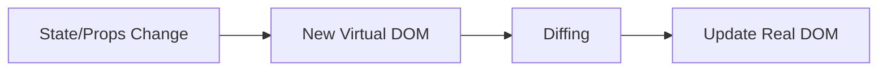

# React Core: Definitions, Interview Questions & Answers / React Cốt lõi: Định nghĩa, Câu hỏi và Câu trả lời phỏng vấn

*Tài liệu này cung cấp kiến thức React cốt lõi với định nghĩa chi tiết, câu hỏi phỏng vấn thường gặp và câu trả lời hoàn chỉnh để chuẩn bị cho phỏng vấn tại các công ty Big Tech.*

## Table of Contents / Mục lục

- [JSX](#jsx)
- [Components](#components)
- [Props & State](#props--state)
- [Hooks](#hooks)
- [Lifecycle](#lifecycle)
- [Context](#context)
- [Reconciliation & Virtual DOM](#reconciliation--virtual-dom)
- [Key Prop](#key-prop)
- [Controlled vs Uncontrolled](#controlled-vs-uncontrolled)
- [Event Handling](#event-handling)
- [Performance Optimization](#performance-optimization)
- [Error Boundaries](#error-boundaries)
- [Code Splitting & Lazy Loading](#code-splitting--lazy-loading)
- [Testing](#testing)
- [Custom Hooks](#custom-hooks)
- [Common Patterns](#common-patterns)
- [Practice Problems](#practice-problems)

---

## JSX

**English Definition:** JSX is a syntax extension for JavaScript that looks like HTML and is used to describe UI in React.

**Định nghĩa (Tiếng Việt):** JSX là một phần mở rộng cú pháp cho JavaScript trông giống như HTML và được sử dụng để mô tả UI trong React.

**Key Points / Điểm chính:**

- **English:** Compiled to `React.createElement` calls by Babel.
- **Tiếng Việt:** Được biên dịch thành các lời gọi `React.createElement` bởi Babel.

- **English:** Allows embedding JS expressions with `{}`.
- **Tiếng Việt:** Cho phép nhúng các biểu thức JS với `{}`.

- **English:** Must return a single root element.
- **Tiếng Việt:** Phải return một phần tử gốc duy nhất.

---

## Components

**Definition:** Reusable, self-contained building blocks of a React UI.

**Types:**

- Functional (with hooks)
- Class (legacy)
- Higher-order components (HOC)
- Render props

---

## Props & State

**Props:** Read-only data passed from parent to child.
**State:** Local, mutable data managed by the component.

**Key Points:**

- Props are immutable, set by parent.
- State is mutable, managed by the component.
- Use `useState` or `this.setState` to update state.

---

## Hooks

**Definition:** Functions that let you use state and other React features in functional components.

**Common Hooks:**

- `useState`, `useEffect`, `useContext`, `useReducer`, `useRef`, `useMemo`, `useCallback`.

**Rules:**

- Only call hooks at the top level of a function component.
- Only call hooks from React functions.

---

## Lifecycle

**Definition:** Phases a component goes through from creation to destruction.

**Class:** `componentDidMount`, `componentDidUpdate`, `componentWillUnmount`.
**Function:** Use `useEffect` for all lifecycle needs.

---

## Context

**Definition:** Provides a way to pass data through the component tree without props drilling.

**Usage:**

- Create context with `React.createContext()`
- Provide value with `<Provider>`
- Consume with `useContext` or `Context.Consumer`

---

## Reconciliation & Virtual DOM

**Definition:** React's process for updating the DOM efficiently.

**How it works:**

- State/props change → new Virtual DOM tree
- Diff with previous tree
- Only changed nodes are updated in the real DOM

**Diagram:**



---

## Key Prop

**Definition:** Unique identifier for list items to help React track changes.

**Best Practice:** Use stable, unique keys (not array index).

---

## Controlled vs Uncontrolled

**Controlled:** Form data managed by React state.
**Uncontrolled:** Form data managed by the DOM (useRef).

---

## Event Handling

- React uses a synthetic event system for cross-browser compatibility.
- Event handlers are camelCase (`onClick`).

---

## Performance Optimization

- Use `React.memo`, `useMemo`, `useCallback` to avoid unnecessary re-renders.
- Virtualize large lists (`react-window`).
- Code splitting and lazy loading.

---

## Error Boundaries

- Catch JS errors in child components and display fallback UI.
- Implement with class components using `componentDidCatch` and `getDerivedStateFromError`.

---

## Code Splitting & Lazy Loading

- Use `React.lazy` and `Suspense` for dynamic imports.
- Improves initial load time.

---

## Testing

- Use Jest and React Testing Library.
- Test rendering, user interactions, and output.

---

## Custom Hooks

- Encapsulate reusable logic (e.g., `useDebounce`, `useLocalStorage`).
- Follow the same rules as built-in hooks.

---

## Common Patterns

- **HOC:** Function that takes a component and returns a new one.
- **Render Props:** Pass a function as a prop to control rendering.
- **Compound Components:** Components that work together via context.

---

## Practice Problems

### 1. Create a reusable Modal component

### 2. Implement a drag-and-drop list

### 3. Build a form with validation

### 4. Implement virtual scrolling for a large list

### 5. Write a custom hook for localStorage

### 6. Create a custom hook for window size

### 7. Add keyboard shortcuts with a custom hook

### 8. Track network status with a custom hook

## Comprehensive React Interview Questions & Answers

### Q1: Explain the Virtual DOM and its benefits

**Answer**:
The Virtual DOM is a JavaScript representation of the real DOM that React keeps in memory.

**Benefits**:
- **Performance**: Batch DOM updates and minimize expensive operations
- **Predictability**: Declarative programming model
- **Cross-browser compatibility**: React handles browser differences

```javascript
// How Virtual DOM works
function ComponentExample() {
  const [count, setCount] = useState(0);
  
  // Each render creates a new Virtual DOM tree
  return (
    <div>
      <h1>Count: {count}</h1>
      <button onClick={() => setCount(count + 1)}>
        Increment
      </button>
    </div>
  );
}

// Virtual DOM representation (simplified)
const virtualDOM = {
  type: 'div',
  props: {
    children: [
      {
        type: 'h1',
        props: { children: 'Count: 0' }
      },
      {
        type: 'button',
        props: {
          onClick: handleClick,
          children: 'Increment'
        }
      }
    ]
  }
};
```

### Q2: What is the difference between state and props?

**Answer**:

| **State** | **Props** |
|-----------|-----------|
| Mutable | Immutable |
| Owned by component | Passed from parent |
| Can trigger re-renders | Read-only |
| Local to component | Shared data |

```javascript
// Parent component passing props
function Parent() {
  const [parentState, setParentState] = useState('parent data');
  
  return (
    <Child 
      propFromParent={parentState}
      onUpdate={setParentState}
    />
  );
}

// Child component receiving props and managing state
function Child({ propFromParent, onUpdate }) {
  const [childState, setChildState] = useState('child data');
  
  return (
    <div>
      <p>Prop: {propFromParent}</p>
      <p>State: {childState}</p>
      <button onClick={() => setChildState('updated')}>
        Update State
      </button>
      <button onClick={() => onUpdate('updated parent')}>
        Update Parent
      </button>
    </div>
  );
}
```

### Q3: Explain React hooks and their rules

**Answer**:
Hooks are functions that let you use state and other React features in functional components.

**Rules of Hooks**:
1. Only call hooks at the top level
2. Only call hooks from React functions
3. Hooks must be called in the same order every time

```javascript
// ✅ Correct - hooks at top level
function MyComponent() {
  const [count, setCount] = useState(0);
  const [name, setName] = useState('');
  
  useEffect(() => {
    document.title = `Count: ${count}`;
  }, [count]);
  
  return <div>{count}</div>;
}

// ❌ Wrong - conditional hook
function BadComponent({ shouldCount }) {
  if (shouldCount) {
    const [count, setCount] = useState(0); // ❌ Conditional hook
  }
  
  return <div>Bad</div>;
}

// ✅ Correct - conditional logic inside hook
function GoodComponent({ shouldCount }) {
  const [count, setCount] = useState(shouldCount ? 0 : null);
  
  useEffect(() => {
    if (shouldCount) {
      // Conditional logic inside hook
    }
  }, [shouldCount]);
  
  return <div>Good</div>;
}
```

### Q4: What is useEffect and how does it work?

**Answer**:
useEffect performs side effects in functional components, replacing lifecycle methods.

```javascript
import React, { useState, useEffect } from 'react';

function EffectExamples() {
  const [count, setCount] = useState(0);
  const [data, setData] = useState(null);
  
  // 1. Effect runs after every render (no dependency array)
  useEffect(() => {
    console.log('Runs after every render');
  });
  
  // 2. Effect runs only once (empty dependency array)
  useEffect(() => {
    console.log('Runs only on mount');
    
    // Cleanup function (componentWillUnmount)
    return () => {
      console.log('Cleanup on unmount');
    };
  }, []);
  
  // 3. Effect runs when count changes
  useEffect(() => {
    document.title = `Count: ${count}`;
  }, [count]);
  
  // 4. Data fetching with cleanup
  useEffect(() => {
    let cancelled = false;
    
    async function fetchData() {
      try {
        const response = await fetch('/api/data');
        const result = await response.json();
        
        if (!cancelled) {
          setData(result);
        }
      } catch (error) {
        if (!cancelled) {
          console.error('Fetch error:', error);
        }
      }
    }
    
    fetchData();
    
    // Cleanup function to prevent memory leaks
    return () => {
      cancelled = true;
    };
  }, []);
  
  return (
    <div>
      <p>Count: {count}</p>
      <button onClick={() => setCount(count + 1)}>
        Increment
      </button>
    </div>
  );
}
```

### Q5: Explain React Context and when to use it

**Answer**:
Context provides a way to pass data through the component tree without prop drilling.

```javascript
// Create context
const ThemeContext = React.createContext();
const UserContext = React.createContext();

// Provider component
function App() {
  const [theme, setTheme] = useState('light');
  const [user, setUser] = useState(null);
  
  return (
    <ThemeContext.Provider value={`{theme, setTheme}`}>
      <UserContext.Provider value={`{user, setUser}`}>
        <Layout />
      </UserContext.Provider>
    </ThemeContext.Provider>
  );
}

// Custom hooks for context
function useTheme() {
  const context = useContext(ThemeContext);
  if (!context) {
    throw new Error('useTheme must be used within ThemeProvider');
  }
  return context;
}

function useUser() {
  const context = useContext(UserContext);
  if (!context) {
    throw new Error('useUser must be used within UserProvider');
  }
  return context;
}

// Consumer components
function Header() {
  const { theme, setTheme } = useTheme();
  const { user } = useUser();
  
  return (
    <header className={`header-${theme}`}>
      <h1>Welcome {user?.name}</h1>
      <button onClick={() => setTheme(theme === 'light' ? 'dark' : 'light')}>
        Toggle Theme
      </button>
    </header>
  );
}

// Advanced context pattern with reducer
const StateContext = React.createContext();
const DispatchContext = React.createContext();

function appReducer(state, action) {
  switch (action.type) {
    case 'SET_USER':
      return { ...state, user: action.payload };
    case 'SET_THEME':
      return { ...state, theme: action.payload };
    case 'TOGGLE_LOADING':
      return { ...state, loading: !state.loading };
    default:
      return state;
  }
}

function AppProvider({ children }) {
  const [state, dispatch] = useReducer(appReducer, {
    user: null,
    theme: 'light',
    loading: false
  });
  
  return (
    <StateContext.Provider value={state}>
      <DispatchContext.Provider value={dispatch}>
        {children}
      </DispatchContext.Provider>
    </StateContext.Provider>
  );
}
```

### Q6: What is React reconciliation and the key prop?

**Answer**:
Reconciliation is React's diffing algorithm to determine what changes to make to the DOM.

```javascript
// Without keys (inefficient)
function BadList({ items }) {
  return (
    <ul>
      {items.map((item, index) => (
        <li key={index}>{item.name}</li> // ❌ Using index as key
      ))}
    </ul>
  );
}

// With proper keys (efficient)
function GoodList({ items }) {
  return (
    <ul>
      {items.map(item => (
        <li key={item.id}>{item.name}</li> // ✅ Using stable unique ID
      ))}
    </ul>
  );
}

// Complex example showing reconciliation
function TodoList() {
  const [todos, setTodos] = useState([
    { id: 1, text: 'Learn React', completed: false },
    { id: 2, text: 'Build app', completed: false }
  ]);
  
  const addTodo = (text) => {
    setTodos([...todos, {
      id: Date.now(),
      text,
      completed: false
    }]);
  };
  
  const toggleTodo = (id) => {
    setTodos(todos.map(todo =>
      todo.id === id ? { ...todo, completed: !todo.completed } : todo
    ));
  };
  
  return (
    <div>
      {todos.map(todo => (
        <TodoItem 
          key={todo.id} // Critical for performance
          todo={todo}
          onToggle={toggleTodo}
        />
      ))}
    </div>
  );
}

function TodoItem({ todo, onToggle }) {
  return (
    <div onClick={() => onToggle(todo.id)}>
      {todo.text} {todo.completed ? '✓' : '○'}
    </div>
  );
}
```

### Q7: Explain React performance optimization techniques

**Answer**:
Several techniques can optimize React applications:

```javascript
// 1. React.memo - Prevent unnecessary re-renders
const ExpensiveComponent = React.memo(function ExpensiveComponent({ data, onClick }) {
  console.log('ExpensiveComponent rendered');
  
  return (
    <div>
      {data.map(item => (
        <div key={item.id} onClick={() => onClick(item)}>
          {item.name}
        </div>
      ))}
    </div>
  );
}, (prevProps, nextProps) => {
  // Custom comparison function (optional)
  return prevProps.data.length === nextProps.data.length;
});

// 2. useMemo - Memoize expensive calculations
function DataProcessor({ items, filter }) {
  const processedData = useMemo(() => {
    console.log('Processing data...');
    return items
      .filter(item => item.category === filter)
      .map(item => ({
        ...item,
        processed: true,
        timestamp: Date.now()
      }))
      .sort((a, b) => a.name.localeCompare(b.name));
  }, [items, filter]);
  
  return (
    <div>
      {processedData.map(item => (
        <div key={item.id}>{item.name}</div>
      ))}
    </div>
  );
}

// 3. useCallback - Memoize functions
function Parent() {
  const [count, setCount] = useState(0);
  const [items, setItems] = useState([]);
  
  // ❌ New function on every render
  const handleClick = (item) => {
    console.log('Clicked:', item);
  };
  
  // ✅ Memoized function
  const handleClickMemoized = useCallback((item) => {
    console.log('Clicked:', item);
  }, []); // No dependencies, function never changes
  
  const addItem = useCallback((newItem) => {
    setItems(prev => [...prev, newItem]);
  }, []);
  
  return (
    <div>
      <p>Count: {count}</p>
      <button onClick={() => setCount(count + 1)}>Increment</button>
      <ExpensiveComponent 
        data={items}
        onClick={handleClickMemoized}
      />
    </div>
  );
}

// 4. Code splitting with React.lazy
const LazyComponent = React.lazy(() => import('./LazyComponent'));

function App() {
  return (
    <div>
      <Suspense fallback={<div>Loading...</div>}>
        <LazyComponent />
      </Suspense>
    </div>
  );
}

// 5. Virtual scrolling for large lists
function VirtualizedList({ items }) {
  const [startIndex, setStartIndex] = useState(0);
  const [endIndex, setEndIndex] = useState(10);
  const itemHeight = 50;
  const containerHeight = 500;
  
  const visibleItems = items.slice(startIndex, endIndex);
  
  const handleScroll = (e) => {
    const scrollTop = e.target.scrollTop;
    const newStartIndex = Math.floor(scrollTop / itemHeight);
    const newEndIndex = Math.min(
      newStartIndex + Math.ceil(containerHeight / itemHeight),
      items.length
    );
    
    setStartIndex(newStartIndex);
    setEndIndex(newEndIndex);
  };
  
  return (
    <div 
      style={`{height: ${containerHeight}px, overflow: 'auto'}`}
      onScroll={handleScroll}
    >
      <div style={`{height: ${items.length * itemHeight}px, position: 'relative'}`}>
        {visibleItems.map((item, index) => (
          <div
            key={item.id}
            style={`{
              position: 'absolute',
              top: ${(startIndex + index) * itemHeight}px,
              height: ${itemHeight}px,
              width: '100%'
            }`}
          >
            {item.name}
          </div>
        ))}
      </div>
    </div>
  );
}
```

### Q8: What are custom hooks and how do you create them?

**Answer**:
Custom hooks are JavaScript functions that use other hooks and allow you to extract component logic.

```javascript
// 1. useLocalStorage hook
function useLocalStorage(key, initialValue) {
  // State to store our value
  const [storedValue, setStoredValue] = useState(() => {
    try {
      const item = window.localStorage.getItem(key);
      return item ? JSON.parse(item) : initialValue;
    } catch (error) {
      console.error(`Error reading localStorage key "${key}":`, error);
      return initialValue;
    }
  });
  
  // Return a wrapped version of useState's setter function that persists the value
  const setValue = useCallback((value) => {
    try {
      // Allow value to be a function so we have the same API as useState
      const valueToStore = value instanceof Function ? value(storedValue) : value;
      setStoredValue(valueToStore);
      window.localStorage.setItem(key, JSON.stringify(valueToStore));
    } catch (error) {
      console.error(`Error setting localStorage key "${key}":`, error);
    }
  }, [key, storedValue]);
  
  return [storedValue, setValue];
}

// 2. useDebounce hook
function useDebounce(value, delay) {
  const [debouncedValue, setDebouncedValue] = useState(value);
  
  useEffect(() => {
    const handler = setTimeout(() => {
      setDebouncedValue(value);
    }, delay);
    
    return () => {
      clearTimeout(handler);
    };
  }, [value, delay]);
  
  return debouncedValue;
}

// 3. useFetch hook
function useFetch(url, options = {}) {
  const [data, setData] = useState(null);
  const [loading, setLoading] = useState(true);
  const [error, setError] = useState(null);
  
  useEffect(() => {
    let cancelled = false;
    
    const fetchData = async () => {
      try {
        setLoading(true);
        setError(null);
        
        const response = await fetch(url, options);
        
        if (!response.ok) {
          throw new Error(`HTTP error! status: ${response.status}`);
        }
        
        const result = await response.json();
        
        if (!cancelled) {
          setData(result);
        }
      } catch (err) {
        if (!cancelled) {
          setError(err.message);
        }
      } finally {
        if (!cancelled) {
          setLoading(false);
        }
      }
    };
    
    fetchData();
    
    return () => {
      cancelled = true;
    };
  }, [url, JSON.stringify(options)]);
  
  return { data, loading, error };
}

// 4. useWindowSize hook
function useWindowSize() {
  const [windowSize, setWindowSize] = useState({
    width: undefined,
    height: undefined,
  });
  
  useEffect(() => {
    function handleResize() {
      setWindowSize({
        width: window.innerWidth,
        height: window.innerHeight,
      });
    }
    
    // Add event listener
    window.addEventListener('resize', handleResize);
    
    // Call handler right away so state gets updated with initial window size
    handleResize();
    
    // Remove event listener on cleanup
    return () => window.removeEventListener('resize', handleResize);
  }, []);
  
  return windowSize;
}

// 5. useToggle hook
function useToggle(initialValue = false) {
  const [value, setValue] = useState(initialValue);
  
  const toggle = useCallback(() => {
    setValue(prev => !prev);
  }, []);
  
  const setTrue = useCallback(() => {
    setValue(true);
  }, []);
  
  const setFalse = useCallback(() => {
    setValue(false);
  }, []);
  
  return [value, { toggle, setTrue, setFalse, setValue }];
}

// Usage examples
function App() {
  const [name, setName] = useLocalStorage('name', 'Anonymous');
  const [searchTerm, setSearchTerm] = useState('');
  const debouncedSearchTerm = useDebounce(searchTerm, 500);
  const { data, loading, error } = useFetch('/api/users');
  const { width, height } = useWindowSize();
  const [isVisible, { toggle, setTrue, setFalse }] = useToggle();
  
  return (
    <div>
      <p>Name: {name}</p>
      <input 
        value={name}
        onChange={(e) => setName(e.target.value)}
        placeholder="Enter your name"
      />
      
      <p>Window size: {width} x {height}</p>
      
      <input
        value={searchTerm}
        onChange={(e) => setSearchTerm(e.target.value)}
        placeholder="Search..."
      />
      <p>Debounced: {debouncedSearchTerm}</p>
      
      {loading && <p>Loading...</p>}
      {error && <p>Error: {error}</p>}
      {data && <p>Users loaded: {data.length}</p>}
      
      <button onClick={toggle}>
        {isVisible ? 'Hide' : 'Show'}
      </button>
      {isVisible && <div>Toggle content!</div>}
    </div>
  );
}
```

### Q9: Explain React Error Boundaries

**Answer**:
Error boundaries are React components that catch JavaScript errors anywhere in their child component tree.

```javascript
// Error Boundary class component
class ErrorBoundary extends React.Component {
  constructor(props) {
    super(props);
    this.state = { hasError: false, error: null, errorInfo: null };
  }
  
  static getDerivedStateFromError(error) {
    // Update state so the next render will show the fallback UI
    return { hasError: true };
  }
  
  componentDidCatch(error, errorInfo) {
    // You can log the error to an error reporting service
    console.error('Error caught by boundary:', error, errorInfo);
    
    this.setState({
      error,
      errorInfo
    });
    
    // Log to error tracking service
    // logErrorToService(error, errorInfo);
  }
  
  render() {
    if (this.state.hasError) {
      // Fallback UI
      return (
        <div className="error-boundary">
          <h2>Something went wrong!</h2>
          {process.env.NODE_ENV === 'development' && (
            <details style={`{whiteSpace: 'pre-wrap'}`}>
              <summary>Error details (dev only)</summary>
              {this.state.error && this.state.error.toString()}
              <br />
              {this.state.errorInfo.componentStack}
            </details>
          )}
          <button onClick={() => this.setState({ hasError: false, error: null, errorInfo: null })}>
            Try again
          </button>
        </div>
      );
    }
    
    return this.props.children;
  }
}

// Hook-based error boundary (using error boundary library)
function useErrorHandler() {
  const [error, setError] = useState(null);
  
  const resetError = () => setError(null);
  
  const captureError = useCallback((error) => {
    setError(error);
  }, []);
  
  useEffect(() => {
    if (error) {
      throw error;
    }
  }, [error]);
  
  return { captureError, resetError };
}

// Component that might throw errors
function ProblematicComponent({ shouldError }) {
  const { captureError } = useErrorHandler();
  
  useEffect(() => {
    if (shouldError) {
      // Simulate an async error
      setTimeout(() => {
        captureError(new Error('Async error occurred!'));
      }, 1000);
    }
  }, [shouldError, captureError]);
  
  if (shouldError) {
    throw new Error('Render error occurred!');
  }
  
  return <div>Component working fine!</div>;
}

// App with error boundary
function App() {
  const [shouldError, setShouldError] = useState(false);
  
  return (
    <div>
      <h1>Error Boundary Demo</h1>
      <button onClick={() => setShouldError(!shouldError)}>
        {shouldError ? 'Fix Component' : 'Break Component'}
      </button>
      
      <ErrorBoundary>
        <ProblematicComponent shouldError={shouldError} />
      </ErrorBoundary>
    </div>
  );
}

// Advanced error boundary with retry logic
class RetryErrorBoundary extends React.Component {
  constructor(props) {
    super(props);
    this.state = {
      hasError: false,
      retryCount: 0,
      maxRetries: 3
    };
  }
  
  static getDerivedStateFromError(error) {
    return { hasError: true };
  }
  
  componentDidCatch(error, errorInfo) {
    console.error('Error in RetryErrorBoundary:', error, errorInfo);
  }
  
  handleRetry = () => {
    const { retryCount, maxRetries } = this.state;
    
    if (retryCount < maxRetries) {
      this.setState({
        hasError: false,
        retryCount: retryCount + 1
      });
    }
  };
  
  render() {
    const { hasError, retryCount, maxRetries } = this.state;
    
    if (hasError) {
      return (
        <div className="error-boundary">
          <h3>Component Error</h3>
          <p>Retry attempt: {retryCount}/{maxRetries}</p>
          {retryCount < maxRetries ? (
            <button onClick={this.handleRetry}>
              Retry ({maxRetries - retryCount} attempts left)
            </button>
          ) : (
            <p>Maximum retries exceeded. Please refresh the page.</p>
          )}
        </div>
      );
    }
    
    return this.props.children;
  }
}
```

### Q10: What are Higher-Order Components (HOCs)?

**Answer**:
HOCs are functions that take a component and return a new component with additional functionality.

```javascript
// Basic HOC pattern
function withLoading(Component) {
  return function WithLoadingComponent({ isLoading, ...props }) {
    if (isLoading) {
      return <div>Loading...</div>;
    }
    
    return <Component {...props} />;
  };
}

// HOC with authentication
function withAuth(Component) {
  return function AuthenticatedComponent(props) {
    const [user, setUser] = useState(null);
    const [loading, setLoading] = useState(true);
    
    useEffect(() => {
      // Check authentication status
      checkAuthStatus()
        .then(setUser)
        .finally(() => setLoading(false));
    }, []);
    
    if (loading) {
      return <div>Checking authentication...</div>;
    }
    
    if (!user) {
      return <div>Please log in to access this page.</div>;
    }
    
    return <Component {...props} user={user} />;
  };
}

// HOC for API data fetching
function withDataFetching(url) {
  return function(Component) {
    return function WithDataComponent(props) {
      const [data, setData] = useState(null);
      const [loading, setLoading] = useState(true);
      const [error, setError] = useState(null);
      
      useEffect(() => {
        fetch(url)
          .then(response => response.json())
          .then(setData)
          .catch(setError)
          .finally(() => setLoading(false));
      }, []);
      
      return (
        <Component 
          {...props}
          data={data}
          loading={loading}
          error={error}
        />
      );
    };
  };
}

// HOC for performance tracking
function withPerformanceTracking(Component) {
  return function TrackedComponent(props) {
    const componentName = Component.displayName || Component.name;
    
    useEffect(() => {
      const startTime = performance.now();
      
      return () => {
        const endTime = performance.now();
        console.log(`${componentName} render time: ${endTime - startTime}ms`);
      };
    });
    
    return <Component {...props} />;
  };
}

// Composing multiple HOCs
const enhance = compose(
  withAuth,
  withLoading,
  withPerformanceTracking,
  withDataFetching('/api/user-data')
);

function UserProfile({ user, data, loading, error }) {
  if (error) return <div>Error: {error.message}</div>;
  
  return (
    <div>
      <h1>Welcome, {user.name}!</h1>
      {data && (
        <div>
          <h2>Your Data:</h2>
          <pre>{JSON.stringify(data, null, 2)}</pre>
        </div>
      )}
    </div>
  );
}

const EnhancedUserProfile = enhance(UserProfile);

// Modern alternative using custom hooks
function useAuth() {
  const [user, setUser] = useState(null);
  const [loading, setLoading] = useState(true);
  
  useEffect(() => {
    checkAuthStatus()
      .then(setUser)
      .finally(() => setLoading(false));
  }, []);
  
  return { user, loading };
}

function useDataFetching(url) {
  const [data, setData] = useState(null);
  const [loading, setLoading] = useState(true);
  const [error, setError] = useState(null);
  
  useEffect(() => {
    fetch(url)
      .then(response => response.json())
      .then(setData)
      .catch(setError)
      .finally(() => setLoading(false));
  }, [url]);
  
  return { data, loading, error };
}

// Modern component using hooks instead of HOCs
function ModernUserProfile() {
  const { user, loading: authLoading } = useAuth();
  const { data, loading: dataLoading, error } = useDataFetching('/api/user-data');
  
  if (authLoading) return <div>Checking authentication...</div>;
  if (!user) return <div>Please log in.</div>;
  if (dataLoading) return <div>Loading...</div>;
  if (error) return <div>Error: {error.message}</div>;
  
  return (
    <div>
      <h1>Welcome, {user.name}!</h1>
      {data && (
        <div>
          <h2>Your Data:</h2>
          <pre>{JSON.stringify(data, null, 2)}</pre>
        </div>
      )}
    </div>
  );
}
```

---

_This comprehensive guide covers essential React concepts, advanced patterns, and practical implementation problems. Practice these concepts thoroughly for frontend interviews at Big Tech companies._
